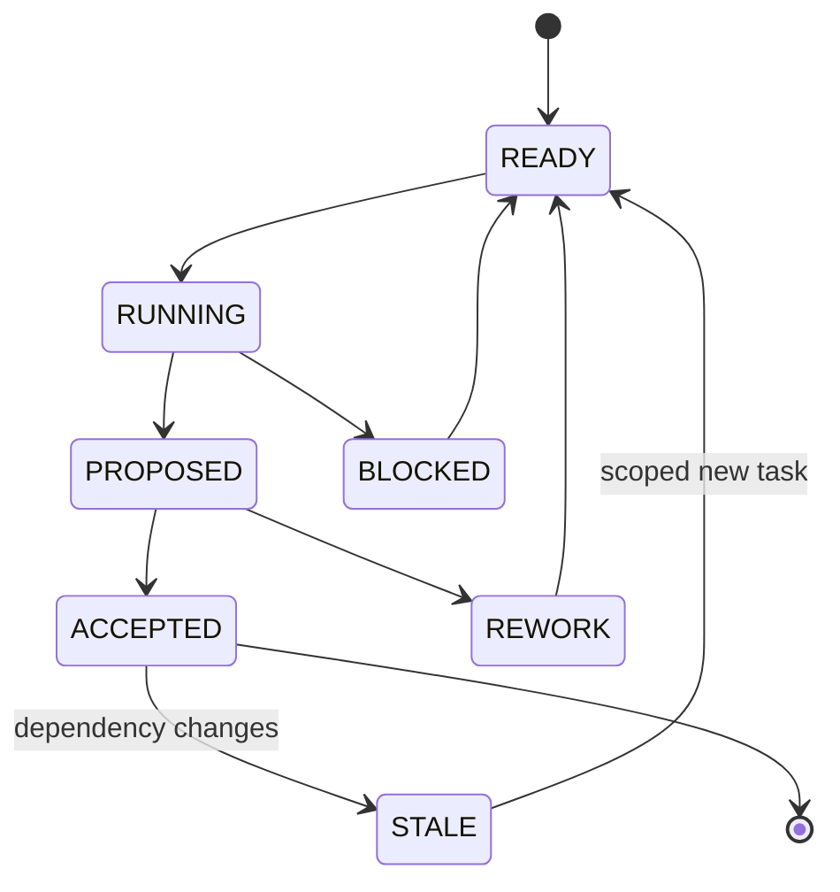

# Agent lifecycle, reuse and deterministic relay control

Status: PROPOSED DESIGN. Fresh instances at validation boundaries and 1–3-subtopic bundles preserve the owner's architecture. Specific scheduling and acceptance mechanisms below still require implementation and evaluation.

## Three distinct reuse decisions

| Reuse type | What persists | Proposed rule |
|---|---|---|
| Profile reuse | Role instructions, subject/PCK competence requirements, tool permissions and evaluated capability | Allowed when the next task's eligibility requirements are met; previous role title alone does not establish fitness |
| Instance continuation | Conversation state, hidden assumptions, previous answers and active working memory | Allowed for bounded work within the same assigned role/version; prohibited across an independent-validation boundary |
| Artifact reuse | Validated K/D reasoning, source snapshots, representations, receipts and audit history | Preferred at exact valid versions; preserve provenance and check dependencies instead of re-authoring |

A fresh instance using the same model/profile can still share systematic errors. A changed model can also repeat the error. Information exposure, independent derivation and external evidence establish the review basis; profile labels alone do not.

## Boundary matrix

| Transition | Same instance? | Profile decision | Artifacts passed |
|---|---|---|---|
| Core0 → selected first Core | Yes, once | Selected for evidence route | Neutral GT/LS/PUR/G and routing |
| First Core → second Core | No | Other role competence required | Original manifest first; sealed first-role claims exposed after initial analysis |
| Second Core → Join | Coordination may continue | Join rules, not author self-approval | Both claim sets and independent V records; new claims still require review |
| Join → Core1A | No | Domain competence plus assimilation competence mandatory | J/K/D/V and relevant originals, owner brief |
| Core1A planning → manuscript realization | May continue | Same-role scope and dependencies unchanged | Accepted plan and assets; later review independent |
| Core1A → receipt verification | No for independent acceptance | Subject/pedagogy reviewer suited to claims; visual review suited to artifact | Actual manuscript and sources; plan-only acceptance disallowed |
| Verified T → Core2A | No | Assessment competence at the requested elementary/competitive range | T/K/D plus exact owner brief, sources and transfer envelope |
| Core2A → product review | No for independent acceptance | Appropriate question/solution and product checking | Actual question set, independent solutions, teaching/source bindings |
| Same role after context exhaustion/crash | Fresh replacement | Equivalent eligible profile | Last accepted checkpoint and open work, not an unverified conversational summary |

Join and receipt verification are workflow functions. They need not create additional permanent content-producing Cores. Tools can perform deterministic checks; qualified fresh review is needed where substantive judgment is claimed.

## Independence protocol and its cost

Give the receiver the owner brief, neutral source manifest, assignment and original materials. Keep predecessor conclusions and suggested answers unavailable until the receiver records its initial role analysis. The worker needs full source discoverability; the initial source slice must not be curated to force the previous conclusion.

For question checking, keep an answer key identifiable but separate from the initial independent solution where feasible. Record any accidental exposure; do not label that attempt blind. A visible prior solution cannot be made unseen by a new prompt.

Seal the initial output with content/version identity, then release predecessor packets. The receiver compares, retrieves further context and reuses valid work. Independence therefore deliberately repeats a bounded grounding/verification task. Revise the original absolute prohibition on rediscovery: redundant complete re-authoring should be avoided, but necessary independent reconstruction cannot be prohibited.

For later roles the independent phase is role-appropriate, not a complete textbook rewrite. Core1A identifies the difficult conceptual connections from original material and owner context before reading the proposed teaching plan. Core2A independently interprets the selected question/demand basis before comparing inherited family solutions. It then needs T to judge eligible practice. If no source questions exist, it must explicitly work from the authorized semantic scope and owner generation policy.

## Governor decisions

Use a versioned policy with explicit predicates and a recorded decision trace. A deterministic policy applied to agent-estimated scores does not make those scores objective.

| Decision | Inputs and hard conditions | Proposed action |
|---|---|---|
| First role | Explicit adequate syllabus/semantic source | Core1-first, including zero-question cases |
| First role | Scope provisional; interpretable questions provide strongest evidence | Core2-first; mark inferred scope provisional |
| First role | Neither defines a usable bounded target | Record G; request the missing scope/source decision before unsupported subject production |
| Join eligibility | Critical claims reviewed; conflicts disposed; dependencies known | Release only eligible obligations; keep blocked dependents held |
| Core1A eligibility | Relevant subject correctness and difficult-concept teaching competence | Exclude profiles missing either, even when they are assessment-strong |
| Core1A selection | Semantic difficulty, assessment-triggered obstacles, audience needs, representational work | Choose among eligible profiles using a documented policy; retain alternatives and rationale |
| Bundle split | Different profile needs, dependency order, cognitive workload, budget | Re-shard while preserving IDs, edges and the 1–3-subtopic cap |
| New prerequisite | Supported gap affects current obligations | Insert a scoped subtopic task; recheck dependent eligibility |
| Core2A eligibility | Accepted T versions; owner brief; validated semantics; permitted transfer | Generate the requested elementary/support/challenge mix |
| Rework | Specific invalidated claim or failed acceptance | Route targeted correction; preserve unaffected accepted versions |
| No eligible profile or unresolved critical conflict | Competence/evidence gap | Block the affected task and expose the reason; no self-appointed substitute |

An assessment-strong profile can be a fresh Core1A only if it also meets subject and assimilation requirements. When a single subtopic needs both deep semantics and complex assessment reasoning, do not arbitrarily split its concept in half to satisfy a profile label. Select a combined eligible profile or obtain a bounded specialist contribution followed by independent review.

Keep eligibility separate from ranking. A future ranking policy may use held-out domain-task results and severity-weighted review evidence with sample sizes. Confirmation rates alone are unsafe: shared errors can yield high agreement, easy assignments inflate success, and a correct reviewer may disagree frequently. Without adequate evaluation data, state eligibility as unverified and require stronger review; do not invent numerical reliability.

Tie-breaking can be deterministic by policy priority, evidence strength then stable profile ID, but only among genuinely eligible candidates. Budget pressure does not waive subject competence. Hard owner profile choices remain explicit decisions with the resulting qualification limit visible.

## Subtopics, dependencies and scheduling

A relay bundle carries one to three assigned subtopics. Referencing a prerequisite already accepted elsewhere does not silently add a fourth active subtopic; teaching a newly required prerequisite creates its own scheduled work.

A subtopic may contain many learning atoms and several sequential authoring segments. Continuation IDs preserve the same subtopic identity. Shared concepts have one canonical home with many prerequisite links. Re-sharding changes assignment membership, not semantic identity.

Dispatch a dependent teaching obligation only when its prerequisite is accepted or a bounded support bridge is explicitly planned and independently checked. Detect genuine prerequisite cycles. A useful pedagogical revisit is a staged progression, not a license to mark mutually unintroduced concepts as already known. At assembly, recheck cross-bundle references and reading order.

Parallelize only independent bundles or review tasks with fixed inputs. A partially completed first bundle can release accepted subtopics without waiting for unrelated work, provided every released subtopic's dependencies and acceptance criteria are satisfied.

## State and recovery

Proposed task lifecycle:

ACCEPTED is scoped to exact inputs and review evidence. Reopening work creates a new task/version; it never changes the old accepted record retroactively.

A logical task signature binds role, policy/profile version, source versions, subtopic IDs, owner-brief version, accepted dependencies and intended output. Attempts have separate IDs. The acceptance store checks the expected dependency versions and custody epoch atomically before admitting a canonical result.

Model calls need not be reproducible. Store their outputs and review results. On recovery, reuse accepted artifacts; resume or replace unfinished attempts from a durable checkpoint. Duplicate delivery may create multiple attempts, but only one canonical acceptance may win for the same intended version. External side effects, if any, need their own idempotency protections.

A checkpoint carries: accepted versions, pending claims, rejected alternatives, unresolved gaps, source access state, task signature, exposure record, decisions/overrides and exact next action. It does not claim that a crash preserved an agent's private memory.

## Invalidation rules

| Changed basis | Recheck |
|---|---|
| Original question text/figure | Its interpretation, D solution/demands, affected K claims, dependent J/A/T/X |
| Semantic law/condition/derivation | Affected dependent obligations, explanations, receipts, hints and solutions |
| Owner goal/difficulty mix | Planning/selection and product fit; unchanged scientific claims remain reusable |
| Readiness assumption | Permissible jumps, scaffolding and support eligibility; do not automatically redefine the owner target |
| Rendered manuscript or diagram | Bound T evidence and dependent X support; a cosmetic-only change still needs verified locator/version rebinding |
| Profile/policy | Future eligibility and policy-dependent decisions; prior records stay auditable |
| Bundle membership | Assignment and assembly links; content reused if scope/dependencies are unchanged |

Before publication, compare the artifact set against a single accepted version manifest. Never mix old T with new content merely because IDs match.

## Owner intervention

An OVR records the system finding, owner's decision and resulting action. HARD means a controlling operational instruction within its stated scope; SOFT means a preference considered by the Governor. Both preserve truth and history.

Examples: choose elementary practice despite high reported knowledge; include a clearly labelled stretch section; defer a subtopic and disclose its dependent limitations. An instruction to use a disputed answer cannot convert that answer into a validated scientific result. The final artifact must accurately identify its status.

See [packets](packets.md), [decision register](decisions.md) and [evaluation](acceptance-and-evaluation.md).
