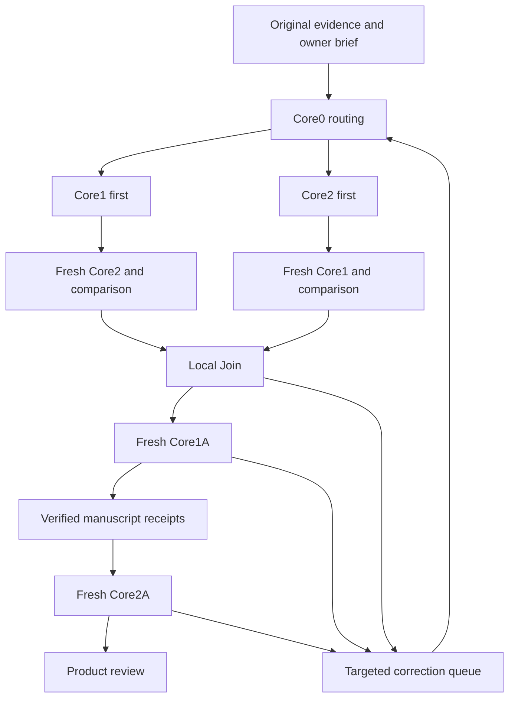

# Overall architecture assessment

Status: PROPOSED DESIGN. The four-Core meaning and subtopic relay bound are OWNER_REQUIREMENTS. Other choices below are recommendations for review, not implemented behavior.

## Assessment

Keep the four roles and the separation between evidence, reasoning and owner control. The strongest part of the pasted design is that assessment intelligence can inform teaching without replacing semantic scope, and that a later agent can reuse intellectual work while checking it against original evidence.

The architecture is not yet conceptually complete merely because packet names and validators exist. Its success depends on four contracts: what a receiving agent can actually reconstruct from a packet; what independent validation means; how a teaching plan becomes verifiable manuscript support; and how the owner's requested practice is preserved through all stages. These require explicit acceptance behavior and subject examples before numerical routing scores or JSON schemas can settle them.

## Meaning and ownership

| Core | Owns | Required intellectual output | Boundary |
|---|---|---|---|
| Core1 | Subject semantics and pedagogical content knowledge | Concepts, prerequisite graph, law/model/definition distinctions, valid derivations, conditions, meaning, useful contrasts and representation affordances | Does not infer examination prevalence from textbook importance or claim a child has assimilated anything |
| Core2 | Source-question intelligence | Full question interpretation, solution routes, recognition cues, demands, first non-obvious moves, wrong chains, hint requirements and conditional transfer families | Observed scope is provisional when the corpus is incomplete; source keys can be wrong |
| Core1A | Difficult-concept assimilation | Learner-relative breakdown, justified transitions, real-life connections, representation choices, equation/symbol bridges, misconception repair and realized teaching | Uses Core1's valid reasoning and Core2's demands; may propose additions but cannot silently approve its own new subject claims |
| Core2A | Owner-directed practice | Questions, hints, solutions and feedback at the owner's requested range, from elementary to competitive; explicit support and provenance | Cannot replace the owner's goal with percentage-derived defaults or rely on unsupported teaching claims |

Core1 supplies the valid derivation spine. Core1A decides how to make each difficult connection assimilable for this audience, including additional intermediate explanations. This avoids two independent authors inventing incompatible derivations, while giving Core1A real pedagogical work beyond rendering.

## Curriculum spine above the local relay

A chapter or course needs a shared scope and dependency ledger even though execution is subtopic-wise. This is control data, not a fifth content-writing Core.

Each subtopic has an ID, scope authority, prerequisites, intended capabilities, canonical teaching home, question links, optional extension status, and explicit disposition: required, deferred, excluded by owner, outside scope, or unresolved. An excluded item remains visible with its consequence. Concepts with zero direct questions remain on the ledger.

Before local dispatch, establish the smallest defensible scope. A syllabus can authorize required coverage; a question collection can suggest provisional assessed scope; an owner can authorize a deliberately bounded learning product. None establishes a complete examination syllabus by itself when that evidence is absent. Newly discovered prerequisites update the graph and create explicit work. Cross-subtopic questions retain all supporting edges even when assigned one primary home.

Before final assembly, reconcile the entire authorized scope against realized teaching and practice. Local success on every dispatched bundle cannot establish chapter completeness if a required subtopic was never dispatched.

## Local execution

Core0 normalizes original sources, figures, answer keys and owner inputs; records evidence gaps; and selects Core1-first or Core2-first. Its instance may transform once into the first selected role. Core0 has no subject conclusion requiring independent self-validation before that transition; if it has already made substantive claims, those claims remain proposals for the normal fresh reviewer.

The second role uses a new instance. It first records its own source-grounded role analysis, then sees the first role's claims. The Join binds validated semantics and assessment demands into assimilation obligations. Core1A runs in a fresh instance after the applicable Join has cleared. Core2A runs in another fresh instance after the relevant teaching receipts have cleared. A final reviewer checks the assembled product.

The correction edge creates a versioned scoped task; it does not erase completed work or blindly restart every Core. The graph is a proposal, not a claim about current runners.

## What convergence means

In a serial two-role pass, the second role can check the first role's claims, but the first has not independently checked claims newly introduced by the second. Therefore simply reaching Join is insufficient.

Join requires a validation disposition for every release-critical claim and its dependencies. New semantic claims from Core2, Core1A or Core2A go to a fresh eligible semantic reviewer. New assessment claims from another role receive an assessment review where relevant. A previously validated claim can be reused at the same version; it need not be re-authored. Unsettled claims affecting an obligation block that obligation.

The review is claim-scoped: it need not run two complete new Cores. Missing evidence produces a bounded uncertainty or a blocked outcome. Disagreement is not resolved by averaging confidence or counting agreeing agents.

## Three independent controls

1. **Subject validity:** Is a claim scientifically/mathematically sound under stated conditions?
2. **Teaching sufficiency:** Does this exact material explain the required connection with suitable support?
3. **Practice fitness:** Does this task meet the owner's purpose, chosen difficulty/support and source requirements?

An easy question can be valid and appropriately requested even when knowledge is described as 80 percent. A competitive destination can be appropriate for a learner described as 20 percent, with a longer scaffolded route and a clear distinction between supported exposure and independent challenge. Neither label establishes actual mastery.

## Join and teaching-content receipt

Join emits obligations, not a generic instruction to explain a chapter. Each obligation names a capability or confusion to resolve, its semantic basis, demand links, prerequisite dependencies, owner reason, proposed support and observable material-level acceptance evidence.

T is a **teaching-content receipt** in this proposal. It binds a capability to the exact accepted manuscript version and locators for explanation, representation, worked example, optional/faded support and independent task where applicable. Original fields such as taught, independent and checked must be interpreted explicitly:

- explanation_present is an artifact claim;
- independent_task_present means an unassisted task is included;
- content_reviewed records a review event and evidence;
- learner_demonstrated requires actual learner evidence and is outside the default generation workflow.

A plan, an atom ID or a true pre_taught flag cannot certify realized teaching. A valid T receipt also cannot certify that a child has learned it.

## Core2A and novel problems

Core2A consumes the owner's practice brief, validated Core1 boundaries, reusable Core2 demand/family intelligence and exact T support. It can invent a new combination or recognition challenge inside that validated scope. It need not teach the exact future question beforehand.

New subject semantics or an unavailable prerequisite trigger a targeted teaching/review request. If the owner explicitly requests diagnostic or stretch exposure outside the teaching support, preserve that decision and label the mode; do not claim ordinary taught-scope readiness. Feedback may explain the gap without pretending the material had previously covered it.

Source integrity and product selection are separate. Retain the full source inventory and its dispositions. An owner-selected elementary worksheet may omit advanced source items from that worksheet while preserving where those items went and why. Existing subject contracts that mandate every source item need an explicit future policy migration; this advisory PR does not rewrite them.

## Stopping, delivery and uncertainty

A deliverable may be complete for an owner-authorized bounded purpose while examination coverage remains unknown. It may also contain a clearly marked deferred extension. Completeness claims must name their denominator: supplied corpus, specified syllabus, requested practice set or whole course.

Recommended acceptance labels are scoped: SOURCE_CHECKED, CONTENT_REVIEWED, MACHINE_CHECKED and OWNER_ACCEPTED. None substitutes for the others. Release-critical disputes require resolution or an explicit restricted product disposition. Hard owner instructions govern operations but do not rewrite factual findings.

See [packets](packets.md), [relay lifecycle](agent-relay.md), [pedagogy](pedagogy-and-practice.md), [worked cases](examples/physics-relay.md) and [evaluation](acceptance-and-evaluation.md).
