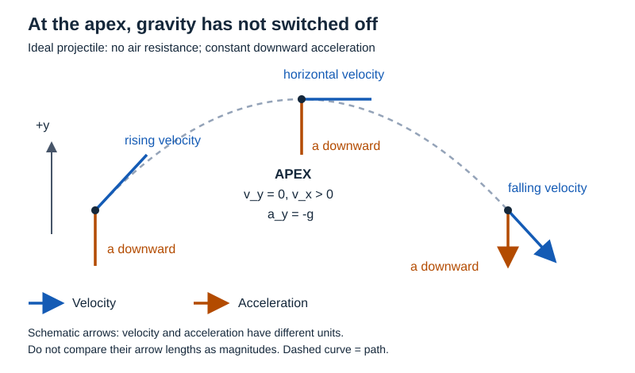

# Physics: one subtopic through the relay

Status: ILLUSTRATIVE DESIGN WALKTHROUGH, not an executed agent run or official exam item. The subject content below is an author-created classical-mechanics example. The diagram is a schematic teaching artifact. No learner effectiveness or independent expert review is claimed.

## Owner and scope inputs

Subtopic ST-P-APEX: velocity and acceleration at a projectile's highest point. Prerequisites: signed components, meaning of velocity/acceleration and constant-acceleration change. These receive explicit local support below; a full course may host them in earlier canonical subtopics.

Compare two owner briefs:
- PUR-P-SIMPLE: reported overall knowledge 80%; wants the very simplest conceptual practice and detailed clarification of apex confusion.
- PUR-P-COMP: reported overall knowledge 20%; wants a scaffolded route toward competitive readiness, including optional hints and a final independent opportunity.

The same percentage must not set both goals. No capability has been diagnosed from these percentages. Both briefs can use the detailed explanation; their practice selections differ.

## Ground truth and Core1

For this demonstration, the authorized source is the explicit model and statement here, not an examination archive.

**Model M-P-01:** ideal projectile near Earth's surface, constant downward gravitational acceleration of magnitude g > 0, air resistance neglected, upward y positive, horizontal x positive, launch time t = 0. Initial components u_x > 0 and u_y > 0. Apply the model over the flight interval before impact.

**Question Q-P-01 (newly authored):** at the highest point, which of v_y, a_y and v_x is zero? Explain why the projectile can still be moving.

K-P-01 distinguishes quantities: velocity describes the rate and direction of position change; acceleration describes the rate of velocity change. A zero value of one does not force the other to be zero.

K-P-02 retains the derivation:
1. Under constant acceleration, change in the vertical velocity over elapsed time t is delta v_y = a_y t.
2. Initial plus change gives v_y = u_y + a_y t.
3. Gravity points downward while positive y points upward, so a_y = -g.
4. Substitute to get v_y = u_y - gt. The term gt has units of velocity and measures the magnitude of accumulated downward velocity change.
5. The vertical component is zero at the transition from rising to falling: t_apex = u_y/g.
6. Horizontal acceleration is zero in this model, so v_x = u_x throughout.
7. At the apex v_y = 0, a_y = -g and v_x = u_x > 0. Total velocity is horizontal and nonzero.

K-P-03 limits: for a purely vertical launch u_x = 0, total velocity is momentarily zero at the highest point but acceleration remains downward. Drag changes the acceleration model; the preceding component equations cannot be carried over without review.

## Core2 demand intelligence

D-P-01 includes the entire question and model refs, then:
- Cue: highest point.
- First non-obvious move: distinguish a component condition, v_y = 0, from claims about acceleration or total velocity.
- Required capabilities: velocity/acceleration distinction, signed components, constant acceleration and horizontal/vertical separation.
- Wrong chain: highest point → momentarily no rise → nothing moves or acts → acceleration zero.
- Correct contrast: zero vertical velocity specifies an instant; gravity still changes velocity through that instant.
- H1: which component changes sign as rising becomes falling?
- H2: separate the two components of velocity from the acceleration.
- H3: use v_y = u_y - gt and a_y = -g; keep v_x = u_x.
- SAFE axes: different positive initial components, different positive g within the stated ideal model, equivalent wording.
- CONDITIONAL axes: pure vertical special case requires recognizing u_x = 0; perpendicular velocities require the dot product and two-time component relations.
- FORBIDDEN in this accepted slice: silently introducing drag or variable gravity while retaining the same equations.
- Evidence limit: one authored item demonstrates a demand; it establishes no examination frequency.

A receiving Core2 independently interprets the original question before opening K. It confirms applicable K claims against the model. Any new claim it adds about a transfer family must still be reviewed.

## Validation and Join

These are expected review outcomes, not records of actual independent reviewers:
- V-P-01 would confirm that a_y remains -g at apex using the unchanged model assumption.
- V-P-02 would refine any unqualified claim that total velocity never vanishes by distinguishing u_x > 0 from the pure-vertical case.
- V-P-03 would reject a proposed perpendicular-velocity extension until its extra prerequisites are established.

J-P-01 turns this into obligations:

| Obligation | Evidence and rationale | Material-level acceptance |
|---|---|---|
| O-P-01 | Distinguish velocity from acceleration | Explanation plus contrast where v_y = 0 and a_y is nonzero |
| O-P-02 | Read components and signs | Diagram legend and explicit upward-positive convention |
| O-P-03 | Understand the equation | Derivation explains change, sign and term meaning |
| O-P-04 | Avoid total/component confusion | Horizontal arrow and special-case comparison |
| O-P-05 | Apply with chosen support | Owner-appropriate question/hints/solution |
| O-P-06 | Preserve validity | Air-resistance/model limitation explicitly retained |

## Core1A: realized miniature explanation

### Teaching segment P-A1: the difficult distinction

Imagine filming a ball thrown upward and forward. Just before its highest point it is still rising; just after, it is falling. At the highest point its vertical velocity is zero for that instant. Gravity has not switched off: the vertical velocity is still changing downward.

Velocity tells us how position is changing now. Acceleration tells us how velocity is changing. These are different questions. An instant of zero vertical velocity can therefore coexist with downward acceleration.

The everyday ball is an entry point. Our equations use the ideal no-drag model stated above, rather than claiming every real throw exactly follows it.

### Teaching segment P-A2: notice the vectors

Read the blue and orange arrows separately. At the apex the blue velocity arrow points right, and the orange acceleration arrow points down. The vertical part of the blue arrow is zero; the orange arrow has not disappeared.

The dashed curve shows the path, not an arrow of force. The orange arrows show acceleration; their identical lengths depict the constant-g assumption. Arrow lengths are schematic; velocity and acceleration have different units and their lengths must not be compared as magnitudes.

RR-P-01 asks the learner to notice persistent downward acceleration before solving an equation. A trajectory-only picture was rejected because it leaves acceleration implicit. The chosen diagram includes both vectors and labels their different meanings. Its risk controls forbid implying that the apex has no gravity or that velocity and acceleration lengths share a scale.

### Teaching segment P-A3: unpack the equation

Take upward as positive. Gravity changes the vertical velocity downward, so its signed acceleration is -g. Over time t, constant acceleration changes vertical velocity by -gt:

delta v_y = -gt.

The new vertical velocity is its initial value plus this change:

v_y = u_y + delta v_y = u_y - gt.

If u_y = 20 m/s and g = 10 m/s², then after 1 second v_y = 10 m/s, after 2 seconds v_y = 0, and after 3 seconds v_y = -10 m/s, provided the projectile has not already hit anything. The minus sign in the last value means downward motion; it does not mean a negative speed.

At the apex, 0 = u_y - gt, so gt = u_y and t = u_y/g. Division is valid because g > 0. This finds when the vertical component vanishes; it does not make a_y vanish.

### Teaching segment P-A4: put the pieces together

For u_x = 15 m/s, the horizontal component remains 15 m/s in this model. At the apex the velocity components are (15, 0) m/s while acceleration is (0, -10) m/s². The ball is moving horizontally while gravity changes its vertical velocity downward.

If instead the launch is purely vertical, u_x = 0. Then both velocity components are zero at the highest point, but the same downward acceleration persists. This contrast tells us exactly which conclusion depends on horizontal launch motion.

LA records would separate quantity meaning, component reading, sign convention, constant-acceleration change, apex condition and recombination. They should not split every printed equation symbol into a new atom. The difficult decisions are explicit; whether that granularity is sufficient for a particular child remains untested.

## T receipt: what this draft can and cannot establish

| Capability | Actual draft locators | Current evidence status |
|---|---|---|
| Distinguish velocity and acceleration | P-A1, P-A4 | Explanation present; independent pedagogical acceptance pending |
| Read apex vectors | P-A2 and physics-apex.svg | Figure and interpretation present; visual inspection recorded separately |
| Reconstruct v_y relation | P-A3 | Justifications and worked values present; not evidence of learner mastery |
| Apply apex distinction | Questions below | Practice opportunity present; no learner responses observed |

These are candidate receipts. A production T needs exact artifact hashes and independent content review. They are deliberately not marked accepted teaching receipts in this walkthrough.

## Core2A output for the elementary owner brief

X-P-S1: At the highest point, does gravity stop accelerating the ball?  
Answer: No. In the stated model acceleration remains downward with magnitude g.

X-P-S2: In the forward-moving case shown, is the ball's whole velocity zero at the highest point?  
Answer: No. Its vertical component is zero, but its horizontal component remains positive.

X-P-S3: Complete the sentence: zero vertical velocity does not necessarily mean zero ______.  
Answer: acceleration.

These deliberately elementary questions honor PUR-P-SIMPLE despite the reported 80% knowledge. Three questions illustrate a mix; no fixed item count is mandated by the architecture.

## Core2A output for the competitive-readiness brief

X-P-C1: With initial components (15, 20) m/s and g = 10 m/s², neglecting air resistance, find the time to apex, velocity and acceleration there.

Solution: set 20 - 10t = 0, giving t = 2 s. Velocity is (15, 0) m/s; acceleration is (0, -10) m/s². A child can use the optional hints from D-P-01. This is supported progression toward the owner's destination, not proof of competitive readiness.

X-P-C2: Under the same ideal model with u_x > 0, a projectile has v_y = +b at one instant and v_y = -b at a later instant, where b > 0. Find the elapsed time between these instants and explain whether the projectile stopped moving between them.

Solution: delta v_y = -2b = -g delta t, so delta t = 2b/g. At the intervening apex v_y = 0 but v_x = u_x > 0, so total velocity did not vanish. This adds inverse reasoning and combines supported ideas; it does not require teaching this exact problem beforehand. The item is newly authored and not claimed as a past-exam problem or a calibrated exam-difficulty item.

If algebraic rearrangement remains unsupported for this audience, supply a reviewed bridge or keep this item in a declared supported mode. The reported 20% alone cannot resolve that dependency.

## Conditional extension and rework

A request for the times at which two velocity vectors are perpendicular introduces dot-product semantics. K/D/T in this slice do not establish that prerequisite. Core2A must not silently generate the challenge and label its hints pre-taught.

Governor action: create ST-P-DOT-PRODUCT as a separate prerequisite task; preserve ST-P-APEX's accepted work; release the extension only after the new teaching support and semantic review are available. An owner may instead defer it or authorize explicitly labelled stretch exposure.

This demonstrates why subtopic packet contents and dependency-aware reuse determine whether the relay works.
