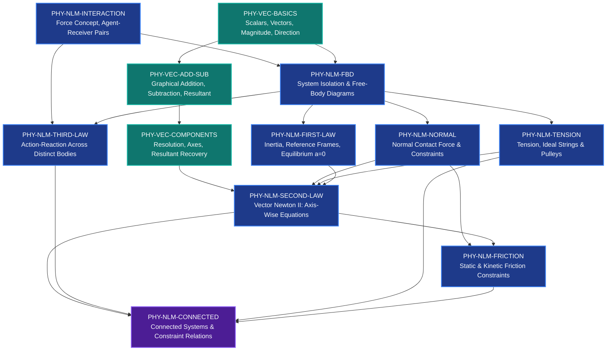

# Physics Technical Engineering Gate Registry
**Domain:** Grade 9–11 Physics (Mechanics & Vector Foundations)  
**Governance Scope:** `CANONICAL DOMAIN REGISTRY` / `CCU` Upstream Gate Boundary  
**Baseline Maturity:** `maturity = ENGINEERING`  
**Governing Standard:** Fail-Closed Authoring Validation  
**Release Status:** `ENGINEERING_GATE_READY`

---

## 1. Subject-Wide Design Principles & Architectural Topology

### 1.1 Architectural Positioning and Authority Order
In the Grade 9–11 self-learning architecture, execution order may vary, but **authority order never varies**. Downstream authoring layers (Core1A/1B/2A/2B), learning-design planners (CDAU/SDU/LAU), and interaction units (TTU v3) possess no authority to invent domain prerequisites, infer unstated physical laws, omit core representations, or declare arbitrary problem readiness.

The **Physics Technical Engineering Gate Registry** sits directly between the `CANONICAL DOMAIN REGISTRY` and the `CCU` (Content Custody & Coverage Unit):

```text
GROUND TRUTH / SOURCE (NCERT, CBSE, AP Physics, Halliday-Resnick)
        ↓
      CORE0 (Source digitization & extraction)
        ↓
CORE1 ↔ independent second pass ↔ CORE2
        ↓
       JOIN (Strict reconciliation)
        ↓
CANONICAL DOMAIN REGISTRY (Domain definitions, laws, canonical concepts)
        ↓
PHYSICS TECHNICAL ENGINEERING GATE REGISTRY [THIS SPECIFICATION]
(Fail-closed structural & physical gatekeeper: "What MUST exist before authoring begins?")
        ↓
       CCU (Content Custody, Coverage, Anti-duplication, Question Ledger)
        ↓
       CDAU (Core purpose, pedagogical differentiation, bounded owner decisions)
        ↓
   ┌────┴────┐
   ↓         ↓
  SDU       LAU (Difficulty profiling & Learner adaptation)
Core1       Core2
track       track
   ↓         ↓
CONCEPT    PROBLEM (Interaction units: canonical reveal, bounded hints, verification)
  TTU        TTU
 /   \      /   \
1A   1B    2A   2B
```

### 1.2 Gate vs. TTU: The Division of Responsibility
A **Technical Teaching Unit (TTU)** evaluates:
> *"Is this specific authored interaction complete, bounded, hinted, and verified?"*

A **Physics Technical Engineering Gate** evaluates:
> *"Does the subtopic corpus contain the irreducible physical concepts, vector/force representations, coordinate bindings, and reasoning sequences without which ANY downstream TTU is fundamentally defective?"*

A downstream authoring agent can write a polished Core1A lesson or Core2A problem with complete JSON structure, LaTeX formatting, hints, and reveals. However, if that lesson teaches vector resolution without requiring resultant reconstruction, or solves an inclined-plane problem by setting $N = mg\cos\theta$ without isolating the body on a Free-Body Diagram (FBD), the **Engineering Gate fails closed (`TECHNICAL_READINESS = FAIL`)** before the product ever reaches CCU or TTU packaging.

### 1.3 Tripartite Authority Classification
Every assertion within this registry is tagged with one of three explicit authority tiers:
1. `SOURCE-DEFINED`: Explicitly mandated by authorized curricula (NCERT Grade 9/11 Physics, CBSE Secondary Curriculum, AP Physics 1 Course Framework).
2. `STANDARD-PHYSICS-DERIVED`: Axiomatic consequences of classical Newtonian mechanics and vector calculus that cannot be violated without physical falsehood.
3. `AUTHORING-RECOMMENDATION`: Best-practice didactic scaffolding to minimize cognitive split-attention and eliminate predictable misinterpretations.
4. `SOURCE_SCOPE_HELD`: Declared when official curriculum documents conflict or leave an operational boundary undefined. Such items are locked against silent expansion.

### 1.4 The Subtopic Decomposition Imperative
Monolithic chapter gates (e.g., `GATE-NLM = PASS`) are strictly prohibited. A monolithic pass allows an authoring engine to pass an entire chapter on the strength of textbook definitions while completely omitting contact force distinctions or string constraints. Gates must operate at the **smallest technically coherent subtopic level**.

---

## 2. Chapter / Subtopic Dependency Graph

## 2.1 Complete Grade 9–11 Master Technical Engineering Gate Registry (43 Subtopics)

| Gate ID | Learner Title | Gr | CBSE Ch | JEE Tier | Prereqs | Key Formula / Constraint |
| :--- | :--- | :---: | :---: | :---: | :--- | :--- |
| `PHY-VEC-BASICS` | Scalars, Vectors, Magnitude, and Direction | 11 | Ch 3 | `BOTH` | MATH-GEO-EUCLIDEAN-2D, MATH-TRIG-RIGHT-TRIANGLE | `$\|A\| >= 0$` |
| `PHY-VEC-ADD-SUB` | Vector Addition, Subtraction, and the Resultant | 11 | Ch 3 | `BOTH` | PHY-VEC-BASICS | `$R = sqrt(A^2 + B^2 + 2*A*B*cos(theta))$` |
| `PHY-VEC-COMPONENTS` | Resolution of Vectors into Orthogonal Components | 11 | Ch 3 | `BOTH` | PHY-VEC-BASICS, PHY-VEC-ADD-SUB | `$A_x = A*cos(theta)$` |
| `PHY-NLM-INTERACTION` | Force as an Interaction between Bodies | 11 | Ch 5 | `BOTH` | PHY-VEC-BASICS | `$F_net = sum(F_i)$` |
| `PHY-NLM-FBD` | Free-Body Diagrams and System Isolation | 11 | Ch 5 | `BOTH` | PHY-VEC-BASICS, PHY-NLM-INTERACTION | `$sum(F_external) = F_net$` |
| `PHY-NLM-FIRST-LAW` | Newton's First Law and Equilibrium | 11 | Ch 5 | `BOTH` | PHY-NLM-FBD, PHY-VEC-COMPONENTS | `$sum(F_x) = 0, sum(F_y) = 0$` |
| `PHY-NLM-SECOND-LAW` | Newton's Second Law of Motion | 11 | Ch 5 | `BOTH` | PHY-VEC-COMPONENTS, PHY-NLM-FBD, PHY-NLM-FIRST-LAW | `$sum(F_x) = m*a_x$` |
| `PHY-NLM-THIRD-LAW` | Newton's Third Law of Motion | 11 | Ch 5 | `BOTH` | PHY-NLM-INTERACTION, PHY-NLM-FBD | `$F_{A on B} = - F_{B on A}$` |
| `PHY-NLM-NORMAL` | Normal Contact Force and Surface Constraints | 11 | Ch 5 | `BOTH` | PHY-NLM-FBD, PHY-NLM-SECOND-LAW | `$sum(F_perp) = m*a_perp = 0 => N = sum(opposing perpendicular force components)$` |
| `PHY-NLM-TENSION` | Tension in Light Strings and Pulley Systems | 11 | Ch 5 | `BOTH` | PHY-NLM-FBD, PHY-NLM-SECOND-LAW | `$a = ((m1 - m2) / (m1 + m2)) * g$` |
| `PHY-NLM-FRICTION` | Static and Kinetic Friction | 11 | Ch 5 | `BOTH` | PHY-NLM-FBD, PHY-NLM-NORMAL, PHY-NLM-SECOND-LAW | `$f_s <= mu_s * N$` |
| `PHY-NLM-CONNECTED` | Connected Systems and Acceleration Constraints | 11 | Ch 5 | `BOTH` | PHY-NLM-FBD, PHY-NLM-SECOND-LAW, PHY-NLM-THIRD-LAW, PHY-NLM-TENSION | `$sum(F_external) = (sum m_i) * a_system$` |
| `PHY-KIN-1D-MOTION` | 1D Motion: Displacement, Velocity & Constant Acceleration Equations | 9 | Ch 8 | `JEE_MAINS` | None | `$v = u + a t$` |
| `PHY-KIN-MOTION-GRAPHS` | Motion Graphs: x-t Slope (Velocity) & v-t Area (Displacement) | 9 | Ch 8 | `JEE_MAINS` | PHY-KIN-1D-MOTION | `$\Delta x = \int v(t) \, dt$` |
| `PHY-KIN-CIRCULAR-UNIFORM` | Uniform Circular Motion: Centripetal Acceleration & Radial Direction | 9 | Ch 8 | `JEE_MAINS` | PHY-KIN-1D-MOTION | `$a_c = \frac{v^2}{r} = \omega^2 r$` |
| `PHY-FORCE-NEWTON-LAWS` | Newton's Three Laws: Inertia, F=ma & Action-Reaction | 9 | Ch 9 | `BOTH` | None | `$\Sigma \vec{F} = m \vec{a}$` |
| `PHY-FORCE-MOMENTUM-IMPULSE` | Momentum, Impulse & Conservation of Linear Momentum | 9 | Ch 9 | `BOTH` | PHY-FORCE-NEWTON-LAWS | `$m_1 \vec{u}_1 + m_2 \vec{u}_2 = m_1 \vec{v}_1 + m_2 \vec{v}_2$` |
| `PHY-GRAV-UNIVERSAL-LAW` | Universal Law of Gravitation: Inverse-Square Law & Field g | 9 | Ch 10 | `BOTH` | None | `$F = G \frac{m_1 m_2}{r^2}$` |
| `PHY-GRAV-FREE-FALL` | Free Fall: Trajectory Symmetry, Maximum Height & Time of Flight | 9 | Ch 10 | `JEE_MAINS` | PHY-KIN-1D-MOTION, PHY-GRAV-UNIVERSAL-LAW | `$H_{\text{max}} = \frac{u^2}{2g}, \quad T_{\text{flight}} = \frac{2u}{g}$` |
| `PHY-FLUID-BUOYANCY-ARCHIMEDES` | Buoyancy, Archimedes' Principle & Floatation Equilibrium | 9 | Ch 10 | `JEE_MAINS` | None | `$F_b = \rho_{\text{fluid}} V_{\text{sub}} g$` |
| `PHY-WORK-ENERGY-POWER` | Work Definition, Kinetic Energy & Work-Energy Theorem | 9 | Ch 11 | `BOTH` | PHY-FORCE-NEWTON-LAWS | `$W = F s \cos \theta$` |
| `PHY-ENERGY-CONSERVATION-LAW` | Conservation of Mechanical Energy & Rate of Work (Power) | 9 | Ch 11 | `BOTH` | PHY-WORK-ENERGY-POWER | `$E = \frac{1}{2} m v^2 + m g h = \text{constant}$` |
| `PHY-SOUND-LONGITUDINAL-WAVES` | Sound: Longitudinal Compression Waves, Speed & Echo | 9 | Ch 12 | `NOT_IN_JEE` | None | `$v = f \lambda$` |
| `PHY-OPTICS-REFLECTION-MIRRORS` | Light Reflection: Spherical Mirrors, Mirror Formula & Sign Convention | 10 | Ch 10 | `JEE_MAINS` | None | `$\frac{1}{v} + \frac{1}{u} = \frac{1}{f}, \quad m = -\frac{v}{u}$` |
| `PHY-OPTICS-REFRACTION-LENSES` | Light Refraction: Snell's Law, Lens Formula & Lens Power | 10 | Ch 10 | `BOTH` | None | `$\frac{1}{v} - \frac{1}{u} = \frac{1}{f}, \quad P = \frac{1}{f}$` |
| `PHY-OPTICS-HUMAN-EYE` | Human Eye Optics, Accommodation & Vision Defect Corrections | 10 | Ch 11 | `NOT_IN_JEE` | PHY-OPTICS-REFRACTION-LENSES | `$P = \frac{1}{f} = \frac{1}{v} - \frac{1}{u}$` |
| `PHY-OPTICS-DISPERSION-SCATTERING` | Dispersion of Light, Prism Spectrum & Rayleigh Scattering | 10 | Ch 11 | `NOT_IN_JEE` | PHY-OPTICS-REFRACTION-LENSES | `$I \propto \frac{1}{\lambda^4}$` |
| `PHY-ELEC-CURRENT-OHM` | Electric Current, Potential Difference & Ohm's Law | 10 | Ch 12 | `BOTH` | None | `$V = I R, \quad R = \rho \frac{L}{A}$` |
| `PHY-ELEC-POWER-JOULE` | Joule's Law of Heating, Electric Power & Circuit Safety | 10 | Ch 12 | `BOTH` | PHY-ELEC-CURRENT-OHM | `$P = V I = I^2 R = \frac{V^2}{R}, \quad H = I^2 R t$` |
| `PHY-MAG-FIELD-LORENTZ` | Magnetic Field, Right-Hand Rule & Lorentz Force on Wire | 10 | Ch 13 | `JEE_MAINS` | PHY-ELEC-CURRENT-OHM | `$F = I L B \sin \theta$` |
| `PHY-MAG-INDUCTION-FARADAY` | Electromagnetic Induction: Faraday's Laws & Lenz's Law | 10 | Ch 13 | `BOTH` | PHY-MAG-FIELD-LORENTZ | `$\mathcal{E} = -N \frac{d\Phi_B}{dt}, \quad \Phi_B = B A \cos \theta$` |
| `PHY-KIN-2D-PROJECTILE` | 2D Projectile Motion: Component Independence, Range & Trajectory | 11 | Ch 4 | `BOTH` | PHY-VEC-COMPONENTS, PHY-KIN-1D-MOTION | `$R = \frac{u^2 \sin 2\theta}{g}, \quad H = \frac{u^2 \sin^2 \theta}{2g}, \quad T = \frac{2u \sin \theta}{g}$` |
| `PHY-KIN-CIRCULAR-DYNAMICS` | Circular Motion Dynamics: Centripetal Force & Banking of Roads | 11 | Ch 4 | `BOTH` | PHY-VEC-COMPONENTS, PHY-KIN-CIRCULAR-UNIFORM | `$\tan \theta = \frac{v^2}{r g}$` |
| `PHY-KIN-RELATIVE-2D` | Relative Velocity in 2D: River-Boat, Rain-Man & Vector Subtraction | 11 | Ch 4 | `BOTH` | PHY-VEC-ADD-SUB, PHY-KIN-1D-MOTION | `$\vec{v}_{AB} = \vec{v}_A - \vec{v}_B$` |
| `PHY-WEP-VARIABLE-FORCE` | Work Done by Variable Forces, Conservative Fields & Potential Energy | 11 | Ch 6 | `BOTH` | PHY-NLM-SECOND-LAW, PHY-WORK-ENERGY-POWER | `$W_{\text{spring}} = -\frac{1}{2} k x^2, \quad F = -k x$` |
| `PHY-SYS-CENTRE-MASS` | Centre of Mass: Discrete & Continuous Systems, Motion of COM | 11 | Ch 7 | `BOTH` | PHY-VEC-COMPONENTS, PHY-NLM-SECOND-LAW | `$\vec{F}_{\text{ext}} = M \vec{a}_{\text{cm}}, \quad \vec{r}_{\text{cm}} = \frac{\sum m_i \vec{r}_i}{\sum m_i}$` |
| `PHY-ROT-RIGID-BODY` | Rotational Dynamics: Torque, Moment of Inertia & Parallel/Perpendicular Axes | 11 | Ch 7 | `BOTH` | PHY-SYS-CENTRE-MASS | `$\tau = I \alpha, \quad I = I_{\text{cm}} + M d^2$` |
| `PHY-ROT-ANGULAR-MOMENTUM` | Angular Momentum Conservation & Pure Rolling Motion | 11 | Ch 7 | `JEE_ADVANCED` | PHY-ROT-RIGID-BODY | `$v_{\text{cm}} = R \omega, \quad L = I_{\text{cm}} \omega + \vec{r}_{\text{cm}} \times M \vec{v}_{\text{cm}}$` |
| `PHY-GRAV-PLANETARY-ORBITS` | Kepler's Laws, Orbital Mechanics & Escape Velocity | 11 | Ch 8 | `BOTH` | PHY-GRAV-UNIVERSAL-LAW, PHY-KIN-CIRCULAR-DYNAMICS | `$v_e = \sqrt{\frac{2 G M}{R}} = \sqrt{2 g R}, \quad v_o = \sqrt{\frac{G M}{r}}$` |
| `PHY-SOLID-ELASTICITY-HOOKE` | Elasticity: Stress-Strain Curve, Hooke's Law & Young's Modulus | 11 | Ch 9 | `JEE_MAINS` | None | `$Y = \frac{\text{Stress}}{\text{Strain}} = \frac{F / A}{\Delta L / L} = \frac{F L}{A \Delta L}$` |
| `PHY-FLUID-BERNOULLI-EQUATION` | Fluid Dynamics: Continuity Equation & Bernoulli's Principle | 11 | Ch 10 | `JEE_ADVANCED` | PHY-FLUID-BUOYANCY-ARCHIMEDES, PHY-WORK-ENERGY-POWER | `$P + \frac{1}{2} \rho v^2 + \rho g h = \text{constant}$` |
| `PHY-THERMO-FIRST-SECOND-LAW` | Thermodynamics: First Law, Carnot Cycle & Second Law Statements | 11 | Ch 12 | `BOTH` | PHY-WORK-ENERGY-POWER | `$\eta = 1 - \frac{T_C}{T_H}, \quad \Delta Q = \Delta U + W$` |
| `PHY-OSC-SHM-WAVES` | Simple Harmonic Motion: Kinematics, Energy Oscillations & Restoring Force | 11 | Ch 14 | `BOTH` | PHY-NLM-SECOND-LAW, PHY-SOUND-LONGITUDINAL-WAVES | `$a = -\omega^2 x, \quad x(t) = A \cos(\omega t + \phi)$` |


The following directed acyclic graph defines the non-negotiable prerequisite relationships. No downstream subtopic gate may be evaluated as `ENGINEERING_GATE_READY` unless all its immediate upstream dependencies are `ENGINEERING_GATE_READY`.



---

## 3. Canonical Subtopic Technical Engineering Gates (Complete A–P Specifications)

---

### GATE 1: `PHY-VEC-BASICS`
**Subtopic:** Scalars, Vectors, Magnitude, Direction, and Formal Notation  
**Maturity:** `ENGINEERING` | **Authority:** `SOURCE-DEFINED` (NCERT Class 11 Ch. 4; CBSE Physics Core)

#### A. IDENTITY
- **subtopic_id:** `PHY-VEC-BASICS`
- **learner_title:** Scalars, Vectors, Magnitude, and Direction
- **chapter/topic:** Vectors / Motion in a Plane
- **canonical concept IDs:** `CON-VEC-SCALAR-DEF`, `CON-VEC-VECTOR-DEF`, `CON-VEC-NOTATION`, `CON-VEC-MAGNITUDE`, `CON-VEC-DIRECTION-ANGLE`, `CON-VEC-EQUALITY`
- **prerequisite IDs:** `MATH-GEO-EUCLIDEAN-2D`, `MATH-TRIG-RIGHT-TRIANGLE`
- **linked buckets:** `B-VEC-FOUNDATIONS`
- **linked problem families:** `PF-VEC-IDENTIFY-TYPE`, `PF-VEC-POLAR-SPEC`

#### B. TECHNICAL CORE
1. `CON-VEC-SCALAR-DEF`: A scalar is a physical quantity completely specified by a single real number representing magnitude with appropriate units, obeying ordinary algebra.  
   *Why required:* Prevents treating scalar quantities as directed entities (e.g., treating mass or kinetic energy as vectors).  
   *Failure if omitted:* Learner adds mass, speed, or time vectorially.
2. `CON-VEC-VECTOR-DEF`: A vector is a physical quantity possessing both a non-negative magnitude and an intrinsic spatial direction that transforms according to vector algebra (triangle law).  
   *Why required:* Establishes that having direction alone is insufficient (e.g., electric current has direction but does not add vectorially).  
   *Failure if omitted:* Misconception that current or pressure is a vector.
3. `CON-VEC-NOTATION`: Vectors are formally denoted by an arrow over a symbol ($\vec{A}$) or boldface ($\mathbf{A}$); magnitude is denoted by $|\vec{A}|$ or plain $A$, with $A \ge 0$.  
   *Why required:* Distinguishes the complete vector from its magnitude or scalar components.  
   *Failure if omitted:* Equations conflating $\vec{A} = 5\text{ m}$ with $|\vec{A}| = 5\text{ m}$.
4. `CON-VEC-DIRECTION-ANGLE`: Direction in a 2D plane is specified relative to a stated reference axis (standard: counter-clockwise from $+x$ axis, or compass bearings).  
   *Why required:* Magnitude without a precise angular or directional reference is not a vector.  
   *Failure if omitted:* Ambiguous vectors like "moving at $30^\circ$".
5. `CON-VEC-EQUALITY`: Two vectors $\vec{A}$ and $\vec{B}$ are equal if and only if $|\vec{A}| = |\vec{B}|$ and their spatial directions are identical, regardless of initial spatial positions (free vectors).  
   *Why required:* Enables parallel transport of vectors for geometric addition.  
   *Failure if omitted:* Inability to translate vectors geometrically.

#### C. MANDATORY EQUATIONS / RELATIONS
- **EQ-VEC-MAG-NONNEG:** $|\vec{A}| \ge 0$  
  *Symbols:* $\vec{A}$: vector; $|\vec{A}|$: magnitude.  
  *Frame/Sign:* Reference frame independent. Magnitudes cannot be negative.  
  *Validity:* Universal in Euclidean space.  
  *Obligation:* `EXPLAIN`, `VERIFY`.  
  *Problem Families:* `PF-VEC-POLAR-SPEC`.

#### D. REPRESENTATION GATE
- **representation_id:** `REP-VEC-DIRECTED-SEGMENT`
- **Physics encoded:** Directed line segment representing vector magnitude (proportional to arrow length) and spatial orientation (arrowhead indicating sense).
- **Mandatory labels:** Symbol $\vec{A}$ placed adjacent to the shaft; reference baseline (dashed horizontal axis); angle $\theta$ with arc showing sense of rotation.
- **Mandatory variables:** Length scale (e.g., $1\text{ cm} = 10\text{ N}$), direction angle $\theta$.
- **Equation bindings:** Arrow length $L \propto |\vec{A}|$.
- **What cannot be omitted:** Explicit arrowhead; explicit reference line showing where angle $\theta$ is measured from.
- **Common incorrect version:** Arrow drawn floating in space with "$\theta = 30^\circ$" marked with no reference axis, or arrowhead missing.
- **Verification method:** Check if rotating the coordinate reference preserves vector arrow length and true spatial direction.

#### E. MODEL-CONDITION GATE
- **Condition 1:** Flat 2D Euclidean space. *Why needed:* Metric is Cartesian. *If violated:* Non-Euclidean geometry requires curved parallel transport.
- **Condition 2:** Free vectors. *Why needed:* Vectors can be translated parallel to themselves without change. *If violated:* Bound vectors (e.g., lines of action for torque) cannot be freely translated.

#### F. REASONING-STATE GATE
1. Identify physical quantity $\rightarrow$ discriminate scalar vs vector (`LOW`).
2. If vector $\rightarrow$ establish reference direction and origin (`LOW`).
3. Extract magnitude ($A \ge 0$) and specify angular orientation relative to reference axis (`MEDIUM`).
4. Apply formal vector notation ($\vec{A}$ vs $A$) (`HIGH_FRAGILITY`).

#### G. REQUIRED TECHNICAL TRANSFORMATIONS
- **Physical description $\rightarrow$ Polar vector specification:** "A wind blowing at $20\text{ m/s}$ towards North-East" $\rightarrow$ $|\vec{v}| = 20\text{ m/s}, \theta = 45^\circ\text{ N of E}$.
- **Polar vector specification $\rightarrow$ Scaled vector drawing:** $|\vec{F}| = 50\text{ N}, \theta = 120^\circ$ from $+x \rightarrow$ Directed arrow drawn from origin.

#### H. MISCONCEPTION GATE
- **MISC-VEC-CURRENT:** "Any physical quantity with a magnitude and direction is a vector."  
  *Why plausible:* Electric current in a wire has an arrowhead indicating direction.  
  *Required counterexample:* Electric current at a wire junction: $I_1 + I_2 = I_3$ by Kirchhoff's junction rule, independent of the physical angle between wires. It violates the triangle law of addition.  
  *Technical repair:* State that transformation under spatial rotation and obedience to the triangle law of addition are mandatory prerequisites for vector status.
- **MISC-VEC-NEG-MAG:** "A negative vector has a negative magnitude."  
  *Why plausible:* In 1D kinematics, acceleration can be $-9.8\text{ m/s}^2$.  
  *Required counterexample:* $-\vec{A}$ has magnitude $|-\vec{A}| = |\vec{A}| \ge 0$; the minus sign inverts direction: $-\vec{A} = |\vec{A}|(\text{opposite direction})$.  
  *Technical repair:* Enforce $|\vec{A}| \ge 0$ unconditionally; minus signs represent direction reversal ($\theta \pm 180^\circ$).

#### I. VERIFICATION GATE
- **Mandatory checks:** `DIMENSIONAL`, `UNITS`, `SIGN_DIRECTION`, `SYMMETRY`.

#### J. PROBLEM-FAMILY GATE
- **family_id:** `PF-VEC-POLAR-SPEC`
  - *Recognition cues:* Word problem specifying quantity with value, unit, and geographic or planar heading.
  - *Knowns:* Quantity value, unit, angle with reference axis.
  - *Typical unknown:* Strict mathematical polar tuple $(r, \theta)$, scaled geometric vector drawing.
  - *Required representation:* `REP-VEC-DIRECTED-SEGMENT`.
  - *Required equations:* $|\vec{A}| \ge 0$.
  - *First technical move:* Draw Cartesian axes, place origin at tail, measure angle from declared positive axis.
  - *Common wrong route:* Drawing vector from origin without establishing positive axis.
  - *Reversed-target form:* Given vector plot, extract magnitude and angle.
  - *Far-transfer form:* Navigational bearing (bearing $060^\circ$) translated to standard Cartesian polar angle ($30^\circ$).

#### K. QUESTION CUSTODY REQUIREMENTS
- Questions must define whether reference angles are Cartesian ($+x$ CCW) or Geographic (North $0^\circ$ CW). No released question may leave angle baseline ambiguous.

#### L. CORE-SPECIFIC USE
- **Core1:** Compact formal definitions of scalar, vector, notation, magnitude.
- **Core1A:** Detailed conceptual construction, counterexamples (current, pressure), polar representation.
- **Core1B:** Discrimination tasks: given list of 8 quantities, categorize scalar vs vector with formal physical justification.
- **Core2:** Frozen source items requiring vector specification.
- **Core2A:** Expert worked problem translating narrative navigation coordinates into polar vectors.
- **Core2B:** Near/far transfer problems (e.g., 3-dimensional compass headings or wind drift).

#### M. ANTI-DUPLICATION TECHNICAL RULE
- May repeat: definitions, notation rules, standard angle conventions.
- May NOT repeat unchanged: numerical magnitudes, compass scenarios, identical vector arrow layouts.

#### N. DIFFICULTY ENGINEERING PROFILE
- *Ratings (0–3):* prerequisite_depth: 1 | element_interactivity: 1 | inferential_jump_severity: 1 | representation_translation: 2 | model_discrimination: 2 | sign_or_frame_sensitivity: 2 | multi_step_dependency: 1 | abstraction: 2 | misconception_density: 2 | synthesis: 1.
- *Provisional difficulty:* **EASY**
- *Difficulty basis:* Conceptual baseline; primary challenge is notation discipline and scalar/vector discrimination.
- *Maturity:* `ENGINEERING`.

#### O. TECHNICAL RELEASE GATE
```text
[REQUIRED] Scalar vs vector distinction explicitly stated
[REQUIRED] Vector notation (arrow over symbol / bold) and magnitude (|A| >= 0) defined
[REQUIRED] Direction specified relative to explicit reference axis
[REQUIRED] Vector equality defined via parallel transport
[REQUIRED] Counterexample to "direction implies vector" provided
TECHNICAL_READINESS = PASS (if all satisfied) ELSE FAIL
```

#### P. BADGES
- `CORE`, `BUCKET: B-VEC-FOUNDATIONS`, `CONCEPT: CON-VEC-VECTOR-DEF`, `SOURCE: SOURCE-DEFINED`, `ANSWER_STATUS: RESOLVED`.

---

### GATE 2: `PHY-VEC-ADD-SUB`
**Subtopic:** Geometric and Algebraic Vector Addition and Subtraction  
**Maturity:** `ENGINEERING` | **Authority:** `SOURCE-DEFINED` (NCERT Class 11 Ch. 4; CBSE Physics Core)

#### A. IDENTITY
- **subtopic_id:** `PHY-VEC-ADD-SUB`
- **learner_title:** Vector Addition, Subtraction, and the Resultant
- **chapter/topic:** Vectors / Motion in a Plane
- **canonical concept IDs:** `CON-VEC-RESULTANT`, `CON-VEC-TRIANGLE-LAW`, `CON-VEC-PARALLELOGRAM-LAW`, `CON-VEC-COMMUTATIVE`, `CON-VEC-SUBTRACTION-OPPOSITE`, `CON-VEC-NULL-VECTOR`
- **prerequisite IDs:** `PHY-VEC-BASICS`
- **linked buckets:** `B-VEC-ADDITION`
- **linked problem families:** `PF-VEC-TRIANGLE-SOLVE`, `PF-VEC-SUBTRACTION-RELATIVE`

#### B. TECHNICAL CORE
1. `CON-VEC-RESULTANT`: The resultant vector $\vec{R} = \vec{A} + \vec{B}$ is the single vector that produces the identical physical effect as the individual vectors acting together.  
   *Why required:* Prevents treating vector addition as a mere geometric game; anchors physical equivalence.  
   *Failure if omitted:* Learner computes $|\vec{R}|$ without understanding it can replace $\vec{A}$ and $\vec{B}$.
2. `CON-VEC-TRIANGLE-LAW`: If two vectors are represented head-to-tail by two sides of a triangle, the third closing side from the initial tail to the final head represents the resultant vector.  
   *Why required:* Primary operational definition of vector addition.  
   *Failure if omitted:* Adding vectors tail-to-tail without parallel transport.
3. `CON-VEC-PARALLELOGRAM-LAW`: If two vectors are drawn tail-to-tail as adjacent sides of a parallelogram, the diagonal originating from their common tail represents their resultant.  
   *Why required:* Standard geometric construction for concurrent vectors (e.g., forces acting at a single point).  
   *Failure if omitted:* Inability to find resultant of two simultaneous forces at an origin.
4. `CON-VEC-SUBTRACTION-OPPOSITE`: Vector subtraction is defined as the addition of the negative vector: $\vec{A} - \vec{B} \equiv \vec{A} + (-\vec{B})$, where $-\vec{B}$ has magnitude $|\vec{B}|$ and reversed direction.  
   *Why required:* Eliminates need for separate geometric subtraction rules; enforces consistency with relative velocity and change in momentum.  
   *Failure if omitted:* Subtracting magnitudes directly: $|\vec{A} - \vec{B}| = A - B$.
5. `CON-VEC-NULL-VECTOR`: The zero or null vector $\vec{0}$ has zero magnitude and arbitrary/indeterminate direction; $\vec{A} + (-\vec{A}) = \vec{0}$.  
   *Why required:* Closes vector algebra under subtraction and equilibrium conditions.  
   *Failure if omitted:* Treating vector equilibrium as a scalar zero without directional dimensionality.

#### C. MANDATORY EQUATIONS / RELATIONS
1. **EQ-VEC-PARALLELOGRAM-MAG:**  
   $$R = \sqrt{A^2 + B^2 + 2AB\cos\theta}$$  
   *Meaning:* $R = |\vec{A}+\vec{B}|$; $A = |\vec{A}| \ge 0$; $B = |\vec{B}| \ge 0$; $\theta$ is the angle between $\vec{A}$ and $\vec{B}$ when drawn tail-to-tail ($0 \le \theta \le \pi$).  
   *Conditions of validity:* Euclidean 2D space; vectors must be of identical physical dimensionality.  
   *Obligations:* `DERIVE`, `INTERPRET`, `APPLY`, `INVERT`, `VERIFY`.  
   *Problem Families:* `PF-VEC-TRIANGLE-SOLVE`.
2. **EQ-VEC-PARALLELOGRAM-DIR:**  
   $$\tan\alpha = \frac{B\sin\theta}{A + B\cos\theta}$$  
   *Meaning:* $\alpha$ is the angle of resultant $\vec{R}$ relative to the direction of $\vec{A}$.  
   *Conditions of validity:* Denominator $A + B\cos\theta \ne 0$; if zero, $\alpha = 90^\circ$.  
   *Obligations:* `DERIVE`, `APPLY`, `VERIFY`.  
   *Problem Families:* `PF-VEC-TRIANGLE-SOLVE`.
3. **EQ-VEC-TRIANGLE-INEQUALITY:**  
   $$|A - B| \le |\vec{A} + \vec{B}| \le A + B$$  
   *Meaning:* Resultant magnitude is strictly bounded by collinear extremes.  
   *Obligations:* `INTERPRET`, `VERIFY`.

#### D. REPRESENTATION GATE
- **representation_id:** `REP-VEC-HEAD-TO-TAIL`
- **Physics encoded:** Sequential addition of displacements or vectors.
- **Mandatory labels:** Tails, heads, vectors $\vec{A}$ and $\vec{B}$, resultant vector $\vec{R}$ drawn with a double arrowhead; interior/exterior angle $\theta$.
- **Equation bindings:** Vector loop closure $\vec{A} + \vec{B} - \vec{R} = \vec{0}$.
- **What cannot be omitted:** Directional arrowheads on every vector; resultant arrow pointing from tail of first to head of last (NEVER closing a cyclical loop).
- **Common incorrect version:** Resultant drawn head-to-head with first vector, forming a continuous circular flow (which sums to zero!).
- **Verification method:** Trace path along arrows from start to end; resultant must bridge directly from start to finish.

#### E. MODEL-CONDITION GATE
- **Condition:** Identity of dimensions. *Why needed:* Vectors of different dimensions (e.g., force and velocity) cannot be added. *If violated:* Dimensional catastrophe.

#### F. REASONING-STATE GATE
1. Identify vectors to be added $\rightarrow$ verify dimensional compatibility (`LOW`).
2. Draw vectors tail-to-tail to identify true included angle $\theta$ (`MEDIUM`).
3. Construct head-to-tail triangle or complete parallelogram (`LOW`).
4. Draw resultant from common origin or first tail to final head (`MEDIUM`).
5. Calculate magnitude via Law of Cosines ($+2AB\cos\theta$ form) (`HIGH_FRAGILITY`).
6. Calculate directional angle $\alpha$ and clearly state reference vector (`MEDIUM`).
7. Perform limiting case checks ($\theta = 0^\circ, 90^\circ, 180^\circ$) (`LOW`).

#### G. REQUIRED TECHNICAL TRANSFORMATIONS
- **Words $\rightarrow$ Head-to-tail geometry:** "Walk $3\text{ m}$ East then $4\text{ m}$ North" $\rightarrow$ Right triangle with hypotenuse $5\text{ m}$.
- **Subtraction $\rightarrow$ Negative addition:** $\vec{v}_f - \vec{v}_i \rightarrow \vec{v}_f + (-\vec{v}_i)$ drawn tail-to-tail or head-to-tail to find $\Delta\vec{v}$.

#### H. MISCONCEPTION GATE
- **MISC-VEC-SCALAR-SUM:** "$|\vec{A} + \vec{B}| = |\vec{A}| + |\vec{B}|$ always."  
  *Why plausible:* Arithmetic intuition $3 + 4 = 7$.  
  *Required counterexample:* $3\text{ N}$ East and $4\text{ N}$ West yields $1\text{ N}$ East; $3\text{ N}$ East and $4\text{ N}$ North yields $5\text{ N}$. Only when collinear ($\theta = 0^\circ$) does $R = A + B$.  
  *Technical repair:* Emphasize triangle inequality: scalar sum is strictly the maximum upper bound.
- **MISC-VEC-SUB-MAG:** "$|\vec{A} - \vec{B}| = A - B$."  
  *Why plausible:* Naive extension of algebraic subtraction.  
  *Required counterexample:* If $\vec{A}$ is $5\text{ m/s}$ East and $\vec{B}$ is $5\text{ m/s}$ North, $|\vec{A} - \vec{B}| = \sqrt{5^2 + 5^2} = 5\sqrt{2}\text{ m/s} \ne 0$.  
  *Technical repair:* Force inversion of $\vec{B}$ to $-\vec{B}$ followed by standard vector addition.

#### I. VERIFICATION GATE
- **Mandatory checks:** `LIMITING_CASE` ($\theta = 0 \implies R = A+B$; $\theta = \pi \implies R = |A-B|$; $\theta = \pi/2 \implies R = \sqrt{A^2+B^2}$), `DIMENSIONAL`, `SIGN_DIRECTION`, `GEOMETRIC_CONSISTENCY`.

#### J. PROBLEM-FAMILY GATE
- **family_id:** `PF-VEC-TRIANGLE-SOLVE`
  - *Recognition cues:* Two vectors with known magnitudes and included angle; need combined effect.
  - *Knowns:* $A, B, \theta$.
  - *Typical unknown:* $R, \alpha$.
  - *Required representation:* `REP-VEC-HEAD-TO-TAIL` or Parallelogram diagram.
  - *Required equations:* `EQ-VEC-PARALLELOGRAM-MAG`, `EQ-VEC-PARALLELOGRAM-DIR`.
  - *First technical move:* Sketch vectors tail-to-tail to confirm angle $\theta$.
  - *Common wrong route:* Using angle between tail and head without supplementary angle correction.
  - *Reversed-target form:* Given $A, R, \theta$, find $B$.
  - *Far-transfer form:* Relative velocity of rain relative to moving person ($\vec{v}_{r/m} = \vec{v}_r - \vec{v}_m$).

#### K. QUESTION CUSTODY REQUIREMENTS
- Any question specifying "angle between vectors" must unambiguously specify tail-to-tail angle.

#### L. CORE-SPECIFIC USE
- **Core1:** Statement of triangle/parallelogram laws and limiting cases.
- **Core1A:** Full geometric derivation of magnitude and angle formulas; relative change $\Delta\vec{v} = \vec{v}_2 - \vec{v}_1$.
- **Core1B:** Step-by-step reconstruction: given vectors, invert the subtracted vector, re-draw head-to-tail, calculate resultant.
- **Core2:** Standard textbook question (two forces at angle $\theta$).
- **Core2A:** Expert model: complete geometric drawing, algebraic resolution, limiting-case verification.
- **Core2B:** Fresh transfer: 3 concurrent vectors in equilibrium requiring pairwise vector addition.

#### M. ANTI-DUPLICATION TECHNICAL RULE
- May repeat: formula derivation, standard right-angle cases ($3-4-5$).
- May NOT repeat: numerical combinations, identical physical contexts (e.g., river crossing cannot duplicate exact boat velocity numbers).

#### N. DIFFICULTY ENGINEERING PROFILE
- *Ratings (0–3):* prerequisite_depth: 2 | element_interactivity: 2 | inferential_jump_severity: 2 | representation_translation: 3 | model_discrimination: 2 | sign_or_frame_sensitivity: 2 | multi_step_dependency: 2 | abstraction: 2 | misconception_density: 3 | synthesis: 1.
- *Provisional difficulty:* **MEDIUM**
- *Difficulty basis:* Multi-step trigonometry coupled with persistent scalar-summing misconceptions.
- *Maturity:* `ENGINEERING`.

#### O. TECHNICAL RELEASE GATE
```text
[REQUIRED] Triangle law and Parallelogram law explicitly stated and differentiated
[REQUIRED] Resultant explicitly defined as physically equivalent single vector
[REQUIRED] Derivation or explicit proof of R = sqrt(A^2 + B^2 + 2AB cos theta) present
[REQUIRED] Vector subtraction formally defined as addition of opposite vector
[REQUIRED] Limiting checks (theta = 0, 90, 180 deg) explicitly performed
[REQUIRED] Cyclic zero-loop distinguished from valid head-to-tail resultant
TECHNICAL_READINESS = PASS (if all satisfied) ELSE FAIL
```

#### P. BADGES
- `CORE`, `BUCKET: B-VEC-ADDITION`, `CONCEPT: CON-VEC-TRIANGLE-LAW`, `SOURCE: SOURCE-DEFINED`, `ANSWER_STATUS: RESOLVED`.

---

### GATE 3: `PHY-VEC-COMPONENTS`
**Subtopic:** Orthogonal Resolution, Unit Vectors, Coordinate Frames, and Resultant Recovery  
**Maturity:** `ENGINEERING` | **Authority:** `SOURCE-DEFINED` (NCERT Class 11 Ch. 4; CBSE Physics Core)

#### A. IDENTITY
- **subtopic_id:** `PHY-VEC-COMPONENTS`
- **learner_title:** Resolution of Vectors into Orthogonal Components
- **chapter/topic:** Vectors / Motion in a Plane
- **canonical concept IDs:** `CON-VEC-COMPONENT-RESOLUTION`, `CON-VEC-UNIT-VECTORS`, `CON-VEC-SIGN-CONVENTION`, `CON-VEC-RESULTANT-RECONSTRUCTION`, `CON-VEC-INDEPENDENCE-AXES`
- **prerequisite IDs:** `PHY-VEC-BASICS`, `PHY-VEC-ADD-SUB`
- **linked buckets:** `B-VEC-COMPONENTS`
- **linked problem families:** `PF-VEC-RESOLVE-2D`, `PF-VEC-RECONSTRUCT-POLAR`, `PF-VEC-MULTI-ADD`

#### B. TECHNICAL CORE
1. `CON-VEC-COMPONENT-RESOLUTION`: Any vector in a 2D plane can be uniquely decomposed into two mutually perpendicular projections along chosen orthogonal axes: $\vec{A} = \vec{A}_x + \vec{A}_y = A_x\hat{i} + A_y\hat{j}$.  
   *Why required:* Converts complex 2D spatial problems into two decoupled, independent 1D algebraic problems.  
   *Failure if omitted:* Learner attempts 2D dynamics without decomposing forces along motion axes.
2. `CON-VEC-UNIT-VECTORS`: Dimensionless vectors of unit magnitude ($\hat{i}, \hat{j}, \hat{k}$) whose sole physical purpose is to specify directional axes.  
   *Why required:* Unambiguous algebraic notation that separates magnitude from direction.  
   *Failure if omitted:* Writing $A = A_x + A_y$ as scalars without unit vector basis.
3. `CON-VEC-SIGN-CONVENTION`: Scalar components $A_x$ and $A_y$ are signed real numbers (positive or negative) depending on whether the projection aligns with or opposes the positive axis direction.  
   *Why required:* Vector directions in 1D projections are encoded purely by algebraic signs ($+$ or $-$).  
   *Failure if omitted:* Dropping signs and treating components as purely positive magnitudes.
4. `CON-VEC-RESULTANT-RECONSTRUCTION`: Given orthogonal components $A_x$ and $A_y$, the original vector is uniquely recovered via magnitude $A = \sqrt{A_x^2 + A_y^2}$ and direction $\theta = \text{atan2}(A_y, A_x)$.  
   *Why required:* Completes the bi-directional translation loop: $\text{Vector} \leftrightarrow \text{Components}$.  
   *Failure if omitted:* Authoring teaches decomposition but leaves learner unable to state the final resultant vector.
5. `CON-VEC-INDEPENDENCE-AXES`: Orthogonal vector components are mutually independent; variation along $x$ has zero projection and zero influence along $y$.  
   *Why required:* Foundational physical requirement for 2D kinematics (projectile motion) and Newton's second law ($\sum F_x = ma_x, \sum F_y = ma_y$).  
   *Failure if omitted:* Mixing horizontal forces into vertical acceleration equations.

#### C. MANDATORY EQUATIONS / RELATIONS
1. **EQ-VEC-COMP-X:** $A_x = A\cos\theta$ (when $\theta$ is measured from the $x$-axis).  
2. **EQ-VEC-COMP-Y:** $A_y = A\sin\theta$ (when $\theta$ is measured from the $x$-axis).  
   *Meaning:* $A_x, A_y$: scalar components; $A = |\vec{A}| \ge 0$; $\theta$: angle relative to adjacent axis.  
   *Conditions of validity:* Standard orthogonal Cartesian frame. If angle $\phi$ is measured from $y$-axis, roles swap ($A_x = A\sin\phi, A_y = A\cos\phi$).  
   *Obligations:* `EXPLAIN`, `REPRESENT`, `APPLY`, `INVERT`.
3. **EQ-VEC-RECON-MAG:** $A = \sqrt{A_x^2 + A_y^2}$.  
   *Obligations:* `DERIVE`, `APPLY`, `VERIFY`.
4. **EQ-VEC-RECON-ANGLE:** $\tan\theta = \frac{A_y}{A_x}$, with quadrant determined by signs of $(A_x, A_y)$.  
   *Obligations:* `INTERPRET`, `APPLY`, `VERIFY`.
5. **EQ-VEC-ADD-COMP:**  
   $$R_x = \sum A_{i,x}, \quad R_y = \sum A_{i,y}, \quad \vec{R} = R_x\hat{i} + R_y\hat{j}$$  
   *Obligations:* `DERIVE`, `APPLY`, `VERIFY`.

#### D. REPRESENTATION GATE
- **representation_id:** `REP-VEC-COMPONENT-TRIANGLE`
- **Physics encoded:** Vector as hypotenuse of right triangle formed by orthogonal components.
- **Mandatory labels:** Original vector $\vec{A}$; orthogonal axes ($x, y$); horizontal component arrow $A_x\hat{i}$ along base; vertical component arrow $A_y\hat{j}$ along altitude; right-angle square symbol; angle $\theta$ clearly marked adjacent to the relevant axis.
- **Equation bindings:** $A_x^2 + A_y^2 = A^2$; $\vec{A} = A_x\hat{i} + A_y\hat{j}$.
- **What cannot be omitted:** Explicit right-angle symbol; clear indication of which axis the angle $\theta$ touches.
- **Common incorrect version:** Drawing components without arrowheads, or placing $\theta$ against the vertical axis but writing $A_x = A\cos\theta$.
- **Verification method:** Check Pythagoras: $\sqrt{A_x^2 + A_y^2} = A$.

#### E. MODEL-CONDITION GATE
- **Condition:** Mutually perpendicular axes ($\hat{i} \cdot \hat{j} = 0$). *Why needed:* Ensures independence of components without cross-terms. *If violated:* Oblique axes require tensor metric.

#### F. REASONING-STATE GATE
1. Fix coordinate system (origin and orientation of $+x$ and $+y$) (`LOW`).
2. Identify angle $\theta$ and explicitly mark which axis is adjacent (`MEDIUM`).
3. Resolve into components: adjacent $= A\cos\theta$, opposite $= A\sin\theta$ (`HIGH_FRAGILITY`).
4. Inspect quadrant and assign explicit algebraic signs ($+$ or $-$) (`HIGH_FRAGILITY`).
5. Write vector in unit-vector form: $\vec{A} = A_x\hat{i} + A_y\hat{j}$ (`LOW`).
6. When summing multiple vectors: sum $x$-components algebraically, sum $y$-components algebraically (`LOW`).
7. Reconstruct resultant magnitude ($R = \sqrt{R_x^2 + R_y^2}$) and directional quadrant angle (`MEDIUM`).

#### G. REQUIRED TECHNICAL TRANSFORMATIONS
- **Polar Vector $\rightarrow$ Orthogonal Components:** $(50\text{ N}, 143^\circ) \rightarrow A_x = 50\cos(143^\circ) = -40\text{ N}, A_y = 50\sin(143^\circ) = +30\text{ N}$.
- **Orthogonal Components $\rightarrow$ Polar Vector:** $(-40\hat{i} + 30\hat{j})\text{ N} \rightarrow A = \sqrt{(-40)^2 + 30^2} = 50\text{ N}, \theta = 180^\circ - \arctan(30/40) = 143.1^\circ$.

#### H. MISCONCEPTION GATE
- **MISC-VEC-COS-ALWAYS-X:** "$A_x$ is ALWAYS $A\cos\theta$ and $A_y$ is ALWAYS $A\sin\theta$."  
  *Why plausible:* Introductory textbooks almost always measure angles from the horizontal $+x$ axis.  
  *Required counterexample:* On an inclined plane, gravity acts vertically down; resolving along the incline of angle $\theta$ means the angle with the normal ($y$-axis) is $\theta$, so $F_{g,y} = mg\cos\theta$ and $F_{g,x} = mg\sin\theta$.  
  *Technical repair:* Anchor rule: The component **adjacent** to the angle is multiplied by $\cos\theta$; the component **opposite** is multiplied by $\sin\theta$.
- **MISC-VEC-COMPONENT-MAG:** "Components cannot be larger than the vector magnitude."  
  *Why plausible:* In orthogonal resolution, $A_x \le A$ and $A_y \le A$.  
  *Required counterexample:* In non-orthogonal (oblique) resolution, components can exceed the vector magnitude. In orthogonal resolution, components can equal the magnitude when collinear.  
  *Technical repair:* Clarify that $A_x^2 + A_y^2 = A^2$ strictly bounds orthogonal components such that $|A_x| \le A$ and $|A_y| \le A$.

#### I. VERIFICATION GATE
- **Mandatory checks:** `PYTHAGOREAN_CONSISTENCY` ($A_x^2 + A_y^2 = A^2$), `LIMITING_CASE` ($\theta \to 0 \implies A_x \to A, A_y \to 0$; $\theta \to 90^\circ \implies A_x \to 0, A_y \to A$), `QUADRANT_SIGN_CHECK`.

#### J. PROBLEM-FAMILY GATE
- **family_id:** `PF-VEC-MULTI-ADD`
  - *Recognition cues:* Three or more coplanar vectors given with various angles; need net resultant.
  - *Knowns:* $\vec{A}, \vec{B}, \vec{C}$ with magnitudes and angles.
  - *Typical unknown:* $\vec{R} = R_x\hat{i} + R_y\hat{j}$, $|\vec{R}|$, and heading $\theta_R$.
  - *Required representation:* `REP-VEC-COMPONENT-TRIANGLE` for each vector + composite component table.
  - *Required equations:* `EQ-VEC-COMP-X`, `EQ-VEC-COMP-Y`, `EQ-VEC-ADD-COMP`, `EQ-VEC-RECON-MAG`, `EQ-VEC-RECON-ANGLE`.
  - *First technical move:* Set up coordinate axes and construct an $(x, y)$ component tabulation table.
  - *Common wrong route:* Adding angles directly or attempting complex multi-step geometric triangles.
  - *Reversed-target form:* Given three forces in equilibrium, find the unknown magnitude and angle of the third force.
  - *Far-transfer form:* Resolving electric fields from multiple point charges.

#### K. QUESTION CUSTODY REQUIREMENTS
- Questions must define the exact axis from which the angle is measured. If ambiguous, marked `HELD`.

#### L. CORE-SPECIFIC USE
- **Core1:** Definition of orthogonal resolution and unit vectors.
- **Core1A:** Full geometric proof of orthogonal decomposition; quadrant analysis; reverse translation.
- **Core1B:** Component reconstruction drills: given $(A_x, A_y)$, learner calculates $(A, \theta)$ across all 4 quadrants.
- **Core2:** Standard exam problem: multi-force resolution.
- **Core2A:** Expert model: component table, algebraic summation, quadrant identification, inverse verification.
- **Core2B:** Fresh transfer: resolution in a tilted frame (incline).

#### M. ANTI-DUPLICATION TECHNICAL RULE
- May repeat: standard unit vector definitions.
- May NOT repeat: exact component tuples $(A_x, A_y)$ across adjacent Cores without transformation.

#### N. DIFFICULTY ENGINEERING PROFILE
- *Ratings (0–3):* prerequisite_depth: 2 | element_interactivity: 2 | inferential_jump_severity: 2 | representation_translation: 3 | model_discrimination: 2 | sign_or_frame_sensitivity: 3 | multi_step_dependency: 2 | abstraction: 2 | misconception_density: 3 | synthesis: 2.
- *Provisional difficulty:* **MEDIUM**
- *Difficulty basis:* High sign sensitivity, quadrant ambiguities with $\arctan$, and frequent adjacent vs opposite angle confusion.
- *Maturity:* `ENGINEERING`.

#### O. TECHNICAL RELEASE GATE
```text
[REQUIRED] Orthogonal resolution explicitly defined with unit vectors i, j
[REQUIRED] Adjacent (cos) vs Opposite (sin) defined relative to marked angle
[REQUIRED] Explicit coordinate sign convention enforced (+ / -)
[REQUIRED] Bi-directional translation: Resultant <-> Components demonstrated
[REQUIRED] Quadrant-aware angle recovery (atan2 / signs) mandatory
[REQUIRED] Independence of perpendicular components explicitly stated
TECHNICAL_READINESS = PASS (if all satisfied) ELSE FAIL
```

#### P. BADGES
- `CORE`, `BUCKET: B-VEC-COMPONENTS`, `CONCEPT: CON-VEC-COMPONENT-RESOLUTION`, `SOURCE: SOURCE-DEFINED`, `ANSWER_STATUS: RESOLVED`.

---

### GATE 4: `PHY-NLM-INTERACTION`
**Subtopic:** Force Concept, Interaction Model, and Agent-Receiver Pairs  
**Maturity:** `ENGINEERING` | **Authority:** `SOURCE-DEFINED` (NCERT Class 9 Ch. 9, Class 11 Ch. 5; CBSE Physics)

#### A. IDENTITY
- **subtopic_id:** `PHY-NLM-INTERACTION`
- **learner_title:** Force as an Interaction between Bodies
- **chapter/topic:** Laws of Motion
- **canonical concept IDs:** `CON-NLM-FORCE-DEF`, `CON-NLM-INTERACTION-PAIR`, `CON-NLM-AGENT-RECEIVER`, `CON-NLM-CONTACT-VS-FIELD`, `CON-NLM-SUPERPOSITION`
- **prerequisite IDs:** `PHY-VEC-BASICS`
- **linked buckets:** `B-NLM-FORCE-CONCEPT`
- **linked problem families:** `PF-NLM-IDENTIFY-INTERACTIONS`

#### B. TECHNICAL CORE
1. `CON-NLM-FORCE-DEF`: A force is a vector push or pull exerted by one identifiable physical body (agent) on another physical body (receiver) as a result of an interaction.  
   *Why required:* Eliminates fictitious "forces" generated by imagination (e.g., "force of motion", "momentum force").  
   *Failure if omitted:* Learner invents internal or non-existent forces during problem solving.
2. `CON-NLM-AGENT-RECEIVER`: Every genuine physical force must possess an explicit agent (the causer) and an explicit receiver (the object acted upon); notation $\vec{F}_{\text{on Object by Agent}}$.  
   *Why required:* Enforces physical realism and forms the prerequisite for Newton's third law.  
   *Failure if omitted:* Drawing a force arrow with no physical origin.
3. `CON-NLM-CONTACT-VS-FIELD`: Forces are categorized strictly into contact forces (requiring physical macroscopic contact: normal, friction, tension) and field forces (action at a distance: gravity, electromagnetic).  
   *Why required:* Guides systematic boundary scanning when constructing Free-Body Diagrams.  
   *Failure if omitted:* Omitting contact forces or inventing contact forces where no surface touches.
4. `CON-NLM-SUPERPOSITION`: When multiple forces act simultaneously on a single body, their net physical effect is identical to the vector sum $\vec{F}_{\text{net}} = \sum \vec{F}_i$.  
   *Why required:* Bridges individual physical interactions to net dynamic acceleration.  
   *Failure if omitted:* Adding forces as independent scalar values.

#### C. MANDATORY EQUATIONS / RELATIONS
- **EQ-NLM-FNET:** $\vec{F}_{\text{net}} = \sum_{i=1}^n \vec{F}_i$  
  *Meaning:* Vector sum of all external forces acting on the specified receiver body.  
  *Obligations:* `EXPLAIN`, `REPRESENT`, `APPLY`.

#### D. REPRESENTATION GATE
- **representation_id:** `REP-NLM-INTERACTION-TABLE`
- **Physics encoded:** Explicit inventory of all interactions crossing the system boundary.
- **Mandatory labels:** Force Name, Agent (Causer), Receiver (System), Type (Contact vs Field), Direction.
- **What cannot be omitted:** Explicit identity of Agent and Receiver for every listed force.
- **Common incorrect version:** Listing "Force of acceleration" or "Downward motion force".
- **Verification method:** Check each force: If an agent cannot be pointed to in the physical universe, the force is invalid.

#### E. MODEL-CONDITION GATE
- **Condition:** Macroscopic classical mechanics. *Why needed:* Continuum forces (normal, friction) are macroscopic manifestations of atomic electromagnetism.

#### F. REASONING-STATE GATE
1. Identify the target object of interest (`LOW`).
2. Scan for field forces (gravity: Earth acts on object) (`LOW`).
3. Scan the physical boundary for points of contact with other bodies (surfaces, ropes, hands) (`MEDIUM`).
4. For each contact, identify the physical interaction type (`MEDIUM`).
5. Verify every candidate force has an identifiable external agent (`HIGH_FRAGILITY`).

#### G. REQUIRED TECHNICAL TRANSFORMATIONS
- **Physical scene $\rightarrow$ Interaction Inventory:** "A book sits on a table in an elevator" $\rightarrow$ (1) Gravity by Earth on Book (Field), (2) Normal force by Table surface on Book (Contact).

#### H. MISCONCEPTION GATE
- **MISC-NLM-FORCE-OF-MOTION:** "A moving body possesses a force keeping it moving."  
  *Why plausible:* Aristotelian intuition: to keep an object moving across a carpet, one must keep pushing it.  
  *Required counterexample:* A puck gliding on frictionless ice keeps moving at constant velocity with zero forward force acting on it.  
  *Technical repair:* Force causes **changes** in motion (acceleration), not motion itself. Momentum is a property of state; force is an interaction.
- **MISC-NLM-INERTIA-FORCE:** "Inertia is a force that pushes backwards."  
  *Why plausible:* Feeling pushed back into a car seat during acceleration.  
  *Required counterexample:* Viewed from the road (inertial frame), the seat pushes forward on the passenger; inertia is simply the passenger's resistance to acceleration.  
  *Technical repair:* Inertia is a property (mass), not a force. No agent exerts "inertia".

#### I. VERIFICATION GATE
- **Mandatory checks:** `AGENT_RECEIVER_IDENTIFIABILITY`, `DIMENSIONAL`, `MODEL_VALIDITY`.

#### J. PROBLEM-FAMILY GATE
- **family_id:** `PF-NLM-IDENTIFY-INTERACTIONS`
  - *Recognition cues:* Narrative describing a physical scene; task asks to identify all acting forces.
  - *First technical move:* Draw boundary around target object; trace perimeter to locate contact points.
  - *Common wrong route:* Adding a forward force in the direction of velocity.

#### K. QUESTION CUSTODY REQUIREMENTS
- Questions must name the body of interest. Multiple bodies require separate interaction inventories.

#### L. CORE-SPECIFIC USE
- **Core1:** Definition of force, interaction, agent-receiver model.
- **Core1A:** Full deconstruction of contact vs field forces; debunking "force of motion".
- **Core1B:** Discrimination: given 6 proposed forces for a thrown ball, classify which are physically real and which are false.
- **Core2 / Core2A:** Systematic interaction identification prior to equation writing.

#### M. ANTI-DUPLICATION TECHNICAL RULE
- Standard interaction pairs may recur; full physical setups must vary agents and orientations.

#### N. DIFFICULTY ENGINEERING PROFILE
- *Ratings (0–3):* prerequisite_depth: 1 | element_interactivity: 2 | inferential_jump_severity: 2 | representation_translation: 2 | model_discrimination: 3 | sign_or_frame_sensitivity: 1 | multi_step_dependency: 1 | abstraction: 2 | misconception_density: 3 | synthesis: 1.
- *Provisional difficulty:* **EASY**
- *Difficulty basis:* Highly conceptual; difficult due to deeply entrenched Aristotelian misconceptions.
- *Maturity:* `ENGINEERING`.

#### O. TECHNICAL RELEASE GATE
```text
[REQUIRED] Force explicitly defined as an interaction between two bodies
[REQUIRED] Agent-Receiver model mandatory for every force
[REQUIRED] Contact vs Field distinction complete
[REQUIRED] Aristotelian "force of motion" explicitly identified and debunked
[REQUIRED] Inertia explicitly barred from being treated as a force
TECHNICAL_READINESS = PASS (if all satisfied) ELSE FAIL
```

#### P. BADGES
- `CORE`, `BUCKET: B-NLM-FORCE-CONCEPT`, `CONCEPT: CON-NLM-FORCE-DEF`, `SOURCE: SOURCE-DEFINED`, `ANSWER_STATUS: RESOLVED`.

---

### GATE 5: `PHY-NLM-FBD`
**Subtopic:** System Isolation, Free-Body Diagrams, and Boundary Interaction Invariants  
**Maturity:** `ENGINEERING` | **Authority:** `STANDARD-PHYSICS-DERIVED` / `SOURCE-DEFINED` (NCERT Class 11 Ch. 5)

#### A. IDENTITY
- **subtopic_id:** `PHY-NLM-FBD`
- **learner_title:** Free-Body Diagrams and System Isolation
- **chapter/topic:** Laws of Motion
- **canonical concept IDs:** `CON-NLM-SYSTEM-ISOLATION`, `CON-NLM-FBD-DEFINITION`, `CON-NLM-EXTERNAL-FORCES-ONLY`, `CON-NLM-FBD-CONCURRENT-POINT`, `CON-NLM-NO-INTERNAL-PAIRS`
- **prerequisite IDs:** `PHY-VEC-BASICS`, `PHY-NLM-INTERACTION`
- **linked buckets:** `B-NLM-FBD`
- **linked problem families:** `PF-NLM-CONSTRUCT-FBD`

#### B. TECHNICAL CORE
1. `CON-NLM-SYSTEM-ISOLATION`: A system is isolated by defining an imaginary closed boundary around the body (or collection of bodies) of interest, severing all connections with the environment.  
   *Why required:* Dictates exactly which forces count as external and which are internal.  
   *Failure if omitted:* Blurring internal and external forces; writing equations that mix forces on different bodies.
2. `CON-NLM-FBD-DEFINITION`: A Free-Body Diagram (FBD) is a diagram representing the isolated body (usually as a point mass or simplified shape) showing ALL external forces acting ON that body, drawn as directed arrows originating from the body.  
   *Why required:* Primary cognitive and technical intermediate representation connecting physical phenomena to Newton's equations.  
   *Failure if omitted:* Attempting to write $\sum \vec{F} = m\vec{a}$ straight from a verbal description, leading to omitted forces and sign errors.
3. `CON-NLM-EXTERNAL-FORCES-ONLY`: An FBD must contain ONLY forces exerted ON the isolated body BY external agents. Forces exerted BY the body on other objects are strictly forbidden on its FBD.  
   *Why required:* Newton's second law governs the motion of the body resulting from forces acting upon it.  
   *Failure if omitted:* Drawing action and reaction on the same FBD, leading to false cancellation.
4. `CON-NLM-NO-INTERNAL-PAIRS`: Forces between components inside the isolated system boundary are internal and must NOT appear on the system FBD.  
   *Why required:* Internal forces sum vectorially to zero by Newton's third law and cannot accelerate the center of mass.  
   *Failure if omitted:* Including tension between two blocks when treating both blocks as a single combined system.
5. `CON-NLM-FBD-CONCURRENT-POINT`: In translational dynamics (particle model), all force vectors are drawn originating from a central dot representing the body's center of mass.  
   *Why required:* Standardizes vector addition and component resolution.  
   *Failure if omitted:* Cluttered drawings where vector tails and heads are tangled.

#### C. MANDATORY EQUATIONS / RELATIONS
- **EQ-NLM-FBD-SUM:** $\sum \vec{F}_{\text{external}} = \vec{F}_{\text{net}}$  
  *Obligations:* `REPRESENT`, `APPLY`.

#### D. REPRESENTATION GATE
- **representation_id:** `REP-NLM-FREE-BODY-DIAGRAM`
- **Physics encoded:** Vector forces acting on an isolated system in a declared inertial frame.
- **Mandatory labels:**
  - System label: "FBD of Body [Name]";
  - Central node (dot representing mass $m$);
  - Each force arrow labelled with exact physical interaction subscript (e.g., $\vec{N}_{\text{surface}}$, $\vec{T}$, $\vec{f}_s$, $\vec{F}_g = m\vec{g}$);
  - Declared coordinate axes ($+x, +y$) placed adjacent to (not touching) the FBD;
  - Acceleration vector $\vec{a}$ drawn as a distinct double arrow floating beside the FBD (NEVER attached to the body as a force).
- **What cannot be omitted:** Origin dot; arrowheads pointing in true physical directions; unique labels for every force; coordinate axes.
- **Common incorrect version:**
  - Drawing velocity or acceleration as a force attached to the dot;
  - Drawing both the normal force by table on block AND the force by block on table on the same dot;
  - Omitting coordinate axes.
- **Verification method:** Count forces on FBD $\leftrightarrow$ Match 1-to-1 with boundary contact points + gravity. If count differs, diagram fails.

#### E. MODEL-CONDITION GATE
- **Condition 1:** Point-particle approximation (no rotation/torque considerations). *Why needed:* All lines of action pass through the center of mass. *If violated:* Extended rigid body requires distributed point-of-application FBD.
- **Condition 2:** Inertial reference frame. *Why needed:* Standard forces only; no pseudo-forces.

#### F. REASONING-STATE GATE
1. State the exact body/system being isolated (`LOW`).
2. Draw a dot or simplified outline representing the isolated body (`LOW`).
3. Draw downward gravitational vector $\vec{F}_g = m\vec{g}$ (`LOW`).
4. Trace the perimeter boundary of the body; identify every physical contact point (`MEDIUM`).
5. Draw contact force vectors pointing in their physically constrained directions (normal perpendicular, friction parallel, tension along string away from body) (`HIGH_FRAGILITY`).
6. Verify no external forces exerted BY the body are included (`HIGH_FRAGILITY`).
7. Draw coordinate axes adjacent to the diagram (`LOW`).
8. Indicate expected acceleration direction with an off-body reference arrow (`MEDIUM`).

#### G. REQUIRED TECHNICAL TRANSFORMATIONS
- **Physical scene sketch $\rightarrow$ Formal FBD:** Block on inclined plane with string pulling uphill $\rightarrow$ Isolated dot with 3 or 4 vectors: $\vec{F}_g$ vertically down, $\vec{N}$ perpendicular to incline, $\vec{T}$ parallel uphill, $\vec{f}$ parallel downhill.

#### H. MISCONCEPTION GATE
- **MISC-NLM-FBD-MA-FORCE:** "Draw $m\vec{a}$ as a force on the FBD."  
  *Why plausible:* In $\sum \vec{F} = m\vec{a}$, $m\vec{a}$ is on the right side of the equation, so learners treat it as another force.  
  *Required counterexample:* If $m\vec{a}$ were a real force acting on the body, then $\sum \vec{F}_{\text{total}} = \sum \vec{F} - m\vec{a} = 0$, implying nothing could ever accelerate! $m\vec{a}$ is the **kinematic outcome** of the net force, not a force itself.  
  *Technical repair:* Strictly prohibit drawing $m\vec{a}$ on the body dot. Draw $\vec{a}$ beside the FBD as a kinematic reference only.
- **MISC-NLM-FBD-PAIR-ON-ONE:** "Draw normal force of floor on shoe AND push of shoe on floor on the shoe's FBD."  
  *Why plausible:* Both forces occur at the same contact point.  
  *Required counterexample:* The push on the floor acts ON the floor, so it belongs on the floor's FBD. Putting it on the shoe's FBD causes the shoe to have zero net vertical force even when jumping!  
  *Technical repair:* Filter rule: "Does this force act ON the isolated body?" If not, discard.

#### I. VERIFICATION GATE
- **Mandatory checks:** `CONTACT_COUNT_MATCH` (Number of contact forces = number of touching physical bodies), `ACTION_REACTION_PURITY` (No 3rd law pairs on same diagram), `SIGN_DIRECTION`, `MODEL_VALIDITY`.

#### J. PROBLEM-FAMILY GATE
- **family_id:** `PF-NLM-CONSTRUCT-FBD`
  - *Recognition cues:* Multi-body system described; question asks for equations or acceleration.
  - *Required representation:* `REP-NLM-FREE-BODY-DIAGRAM`.
  - *First technical move:* Isolate the body; replace each contact with its force vector.
  - *Common wrong route:* Skipping FBD and guessing equation signs.

#### K. QUESTION CUSTODY REQUIREMENTS
- Every problem involving 2 or more forces MUST mandate an explicit FBD in its rubric/solution.

#### L. CORE-SPECIFIC USE
- **Core1:** The rules of FBD construction.
- **Core1A:** Detailed construction across 5 archetypes: horizontal surface, inclined plane, hanging mass, connected blocks, elevator.
- **Core1B:** FBD Diagnosis: given 4 buggy FBDs (e.g., contains $ma$, missing normal, contains third-law pair), learner identifies and fixes errors.
- **Core2 / Core2A / Core2B:** Mandatory first step for all dynamics problem solutions.

#### M. ANTI-DUPLICATION TECHNICAL RULE
- May repeat: standard isolated dot format.
- May NOT repeat: exact multi-body orientations and force configurations across adjacent Cores.

#### N. DIFFICULTY ENGINEERING PROFILE
- *Ratings (0–3):* prerequisite_depth: 2 | element_interactivity: 3 | inferential_jump_severity: 2 | representation_translation: 3 | model_discrimination: 3 | sign_or_frame_sensitivity: 2 | multi_step_dependency: 2 | abstraction: 2 | misconception_density: 3 | synthesis: 2.
- *Provisional difficulty:* **MEDIUM**
- *Difficulty basis:* High cognitive load in translating physical contact into abstract vectors without adding fictitious forces.
- *Maturity:* `ENGINEERING`.

#### O. TECHNICAL RELEASE GATE
```text
[REQUIRED] Isolated body/system explicitly stated before diagram
[REQUIRED] Every force on FBD has an identified external agent
[REQUIRED] Action-reaction pairs on the same FBD strictly forbidden
[REQUIRED] m*a explicitly prohibited from being drawn as a force on the body
[REQUIRED] Explicit coordinate axes present
[REQUIRED] Contact count matches physical boundary interactions
TECHNICAL_READINESS = PASS (if all satisfied) ELSE FAIL
```

#### P. BADGES
- `CORE`, `BUCKET: B-NLM-FBD`, `CONCEPT: CON-NLM-FBD-DEFINITION`, `SOURCE: STANDARD-PHYSICS-DERIVED`, `ANSWER_STATUS: RESOLVED`.

---

### GATE 6: `PHY-NLM-FIRST-LAW`
**Subtopic:** Newton's First Law, Inertia, Reference Frames, and Equilibrium as $\vec{a} = 0$  
**Maturity:** `ENGINEERING` | **Authority:** `SOURCE-DEFINED` (NCERT Class 9 Ch. 9, Class 11 Ch. 5; CBSE Physics)

#### A. IDENTITY
- **subtopic_id:** `PHY-NLM-FIRST-LAW`
- **learner_title:** Newton's First Law and Equilibrium
- **chapter/topic:** Laws of Motion
- **canonical concept IDs:** `CON-NLM-FIRST-LAW-STMT`, `CON-NLM-INERTIAL-FRAME`, `CON-NLM-EQUILIBRIUM-DEF`, `CON-NLM-INERTIA-MASS`
- **prerequisite IDs:** `PHY-NLM-FBD`, `PHY-VEC-COMPONENTS`
- **linked buckets:** `B-NLM-FIRST-LAW`
- **linked problem families:** `PF-NLM-STATIC-EQUILIBRIUM`, `PF-NLM-FRAME-DISCRIMINATE`

#### B. TECHNICAL CORE
1. `CON-NLM-FIRST-LAW-STMT`: An object continues in its state of rest or of uniform motion in a straight line unless acted upon by a non-zero net external force.  
   *Why required:* Establishes natural state of motion; defines force as that which causes acceleration.  
   *Failure if omitted:* Believing constant velocity requires a continuous forward driving force.
2. `CON-NLM-INERTIAL-FRAME`: Newton's laws are valid strictly in inertial reference frames (frames moving at constant velocity relative to distant stars, with zero acceleration).  
   *Why required:* In accelerating frames, fictitious forces appear; defining inertial frames establishes where $\sum \vec{F} = m\vec{a}$ applies.  
   *Failure if omitted:* Applying Newton's laws in accelerating elevators or rotating cars without pseudo-forces.
3. `CON-NLM-EQUILIBRIUM-DEF`: Translational equilibrium is defined mathematically as $\vec{a} = \vec{0}$, which is physically equivalent to $\sum \vec{F}_{\text{ext}} = \vec{0}$. It does NOT mean "no forces act"; it means all acting forces vectorially balance to zero.  
   *Why required:* Prevents confusing equilibrium with a complete absence of physical interactions.  
   *Failure if omitted:* Stating an object at rest has no forces on it (forgetting gravity and normal force).
4. `CON-NLM-INERTIA-MASS`: Inertia is the intrinsic resistance of any physical body to a change in its velocity; mass is the quantitative measure of inertia.  
   *Why required:* Connects inertial resistance to a measurable scalar property ($m$).  
   *Failure if omitted:* Conflating mass with weight.

#### C. MANDATORY EQUATIONS / RELATIONS
1. **EQ-NLM-EQUIL-VEC:** $\sum \vec{F} = \vec{0} \iff \vec{a} = \vec{0}$  
   *Obligations:* `EXPLAIN`, `INTERPRET`, `APPLY`.
2. **EQ-NLM-EQUIL-COMP:**  
   $$\sum F_x = 0, \quad \sum F_y = 0$$  
   *Obligations:* `DERIVE`, `APPLY`, `INVERT`, `VERIFY`.

#### D. REPRESENTATION GATE
- **representation_id:** `REP-NLM-EQUILIBRIUM-POLYGON`
- **Physics encoded:** Closed vector polygon representing balanced concurrent forces.
- **Mandatory labels:** Individual force vectors forming a closed loop where tail of first touches head of last.
- **Equation bindings:** $\sum \vec{F} = \vec{0}$.
- **Verification method:** Check closure: Vector sum must return to the initial starting point.

#### E. MODEL-CONDITION GATE
- **Condition:** Non-accelerating (inertial) reference frame. *If violated:* Pseudo-forces (inertial forces) must be introduced.

#### F. REASONING-STATE GATE
1. Identify reference frame $\rightarrow$ confirm it is non-accelerating (`MEDIUM`).
2. Recognize velocity is constant ($\vec{v} = \text{const} \implies \vec{a} = \vec{0}$) (`LOW`).
3. Construct complete FBD (`MEDIUM`).
4. Set up orthogonal axes (`LOW`).
5. Write independent scalar equations: $\sum F_x = 0$ and $\sum F_y = 0$ (`HIGH_FRAGILITY`).
6. Solve for unknown force magnitudes or geometric angles (`MEDIUM`).
7. Verify limiting behavior (e.g., as angle approaches vertical) (`LOW`).

#### G. REQUIRED TECHNICAL TRANSFORMATIONS
- **Equilibrium description $\rightarrow$ Component equations:** "A $10\text{ kg}$ lamp hangs suspended by two symmetric cables at $45^\circ$" $\rightarrow 2T\sin(45^\circ) - mg = 0$ and $T\cos(45^\circ) - T\cos(45^\circ) = 0$.

#### H. MISCONCEPTION GATE
- **MISC-NLM-REST-NO-FORCE:** "An object at rest has no forces acting on it."  
  *Why plausible:* Nothing is happening visually; motion is zero.  
  *Required counterexample:* A book on a table: gravity pulls down with $9.8\text{ N/kg}$, table pushes up with identical force. If the table vanishes, the book accelerates downward. Forces are present, but their net sum is zero.  
  *Technical repair:* Re-define equilibrium: not the absence of forces, but the exact vector cancellation of forces ($\sum \vec{F} = \vec{0}$).
- **MISC-NLM-CONST-V-NET-FORCE:** "A car moving at constant $100\text{ km/h}$ forward has a net forward force."  
  *Why plausible:* The engine is working and burning fuel.  
  *Required counterexample:* Engine force forward exactly cancels air drag and rolling friction backward; net force is zero. If net force were forward, the car would accelerate past $100\text{ km/h}$.  
  *Technical repair:* Constant velocity $\implies \vec{a} = 0 \implies \vec{F}_{\text{net}} = 0$. Engine overcomes resistance, it does not create a surplus force.

#### I. VERIFICATION GATE
- **Mandatory checks:** `LIMITING_CASE`, `DIMENSIONAL`, `SYMMETRY` (symmetric loads produce equal cable tensions).

#### J. PROBLEM-FAMILY GATE
- **family_id:** `PF-NLM-STATIC-EQUILIBRIUM`
  - *Recognition cues:* Object at rest or constant velocity supported by strings, struts, or surfaces.
  - *Knowns:* Mass, geometry (angles).
  - *Typical unknown:* Cable tensions, normal forces.
  - *Required representation:* `REP-NLM-FREE-BODY-DIAGRAM` + `REP-NLM-EQUILIBRIUM-POLYGON`.
  - *Required equations:* `EQ-NLM-EQUIL-COMP`.
  - *First technical move:* Draw FBD; resolve all forces along $x$ and $y$.
  - *Common wrong route:* Setting tension equal to weight without accounting for cable angles ($T = mg$ instead of $T = mg / (2\sin\theta)$).
  - *Reversed-target form:* Given maximum tension before cable snaps, find maximum allowable suspended mass.

#### K. QUESTION CUSTODY REQUIREMENTS
- Inertial frame must be stated or explicitly implied (ground frame).

#### L. CORE-SPECIFIC USE
- **Core1 / Core1A:** Theoretical foundation, inertial frames, Lami's theorem vs component resolution.
- **Core1B:** Predictive tasks: predicting motion outcome when one of several balanced forces is removed.
- **Core2 / Core2A / Core2B:** Multi-cable equilibrium problems.

#### M. ANTI-DUPLICATION TECHNICAL RULE
- Standard 2-cable and 3-force concurrent systems may recur; angles and structural topologies must vary.

#### N. DIFFICULTY ENGINEERING PROFILE
- *Ratings (0–3):* prerequisite_depth: 2 | element_interactivity: 2 | inferential_jump_severity: 2 | representation_translation: 2 | model_discrimination: 2 | sign_or_frame_sensitivity: 2 | multi_step_dependency: 2 | abstraction: 2 | misconception_density: 3 | synthesis: 1.
- *Provisional difficulty:* **MEDIUM**
- *Difficulty basis:* High misconception density around constant velocity and net force.
- *Maturity:* `ENGINEERING`.

#### O. TECHNICAL RELEASE GATE
```text
[REQUIRED] Newton I explicitly formulated in inertial reference frames
[REQUIRED] Equilibrium defined as a = 0 and sum(F) = 0, NOT "no forces"
[REQUIRED] Distinction between velocity (state) and acceleration (rate of change) maintained
[REQUIRED] Constant velocity explicitly bound to zero net external force
[REQUIRED] Component equilibrium equations sum(F_x)=0, sum(F_y)=0 present
TECHNICAL_READINESS = PASS (if all satisfied) ELSE FAIL
```

#### P. BADGES
- `CORE`, `BUCKET: B-NLM-FIRST-LAW`, `CONCEPT: CON-NLM-EQUILIBRIUM-DEF`, `SOURCE: SOURCE-DEFINED`, `ANSWER_STATUS: RESOLVED`.

---

### GATE 7: `PHY-NLM-SECOND-LAW`
**Subtopic:** Newton's Second Law, Vector Acceleration, Axis-Wise Equations of Motion  
**Maturity:** `ENGINEERING` | **Authority:** `SOURCE-DEFINED` (NCERT Class 9 Ch. 9, Class 11 Ch. 5; CBSE Physics)

#### A. IDENTITY
- **subtopic_id:** `PHY-NLM-SECOND-LAW`
- **learner_title:** Newton's Second Law of Motion
- **chapter/topic:** Laws of Motion
- **canonical concept IDs:** `CON-NLM-MOMENTUM-DEF`, `CON-NLM-SECOND-LAW-RATE`, `CON-NLM-F-MA-VECTOR`, `CON-NLM-AXIS-WISE-DECOUPLING`, `CON-NLM-UNITS-NEWTON`
- **prerequisite IDs:** `PHY-VEC-COMPONENTS`, `PHY-NLM-FBD`, `PHY-NLM-FIRST-LAW`
- **linked buckets:** `B-NLM-SECOND-LAW`
- **linked problem families:** `PF-NLM-1D-ACCEL`, `PF-NLM-2D-RESOLVED-ACCEL`

#### B. TECHNICAL CORE
1. `CON-NLM-MOMENTUM-DEF`: Linear momentum is the vector quantity defined as the product of mass and velocity: $\vec{p} = m\vec{v}$.  
   *Why required:* Primary physical quantity through which Newton originally formulated the second law.  
   *Failure if omitted:* Inability to generalize to variable mass systems or impulse-momentum relations.
2. `CON-NLM-SECOND-LAW-RATE`: The net external force on a body is directly proportional and equal to the time rate of change of its linear momentum: $\vec{F}_{\text{net}} = \frac{d\vec{p}}{dt}$.  
   *Why required:* Canonical fundamental definition of Newton's second law.  
   *Failure if omitted:* Treating $\vec{F} = m\vec{a}$ as an unprovable postulate rather than the constant-mass specialization of momentum rate.
3. `CON-NLM-F-MA-VECTOR`: For a system of constant mass, the net force equals mass times acceleration: $\sum \vec{F} = m\vec{a}$. Acceleration is directly proportional to net force, inversely proportional to mass, and points strictly in the direction of the net force vector.  
   *Why required:* Operational engine for classical dynamics.  
   *Failure if omitted:* Treating $F=ma$ as scalar arithmetic without directional vector correspondence.
4. `CON-NLM-AXIS-WISE-DECOUPLING`: Vector equation $\sum \vec{F} = m\vec{a}$ decouples into independent Cartesian scalar equations: $\sum F_x = ma_x$, $\sum F_y = ma_y$, $\sum F_z = ma_z$. Acceleration along axis $x$ is determined exclusively by forces along axis $x$.  
   *Why required:* Foundational algorithm for solving 2D and 3D dynamics problems.  
   *Failure if omitted:* Blending vertical forces (e.g., normal force) into horizontal acceleration equations.
5. `CON-NLM-UNITS-NEWTON`: The SI unit of force is the Newton ($\text{N}$), defined as $1\text{ N} \equiv 1\text{ kg}\cdot\text{m/s}^2$.  
   *Why required:* Dimensional consistency in SI mechanics.

#### C. MANDATORY EQUATIONS / RELATIONS
1. **EQ-NLM-NEWTON2-MOMENTUM:** $\vec{F}_{\text{net}} = \frac{d\vec{p}}{dt}$  
   *Obligations:* `EXPLAIN`, `DERIVE`.
2. **EQ-NLM-NEWTON2-VECTOR:** $\sum \vec{F} = m\vec{a}$ (valid for constant mass $m$).  
   *Obligations:* `DERIVE`, `INTERPRET`, `APPLY`.
3. **EQ-NLM-NEWTON2-COMP-X:** $\sum F_x = ma_x$  
4. **EQ-NLM-NEWTON2-COMP-Y:** $\sum F_y = ma_y$  
   *Conditions of validity:* Inertial frame; constant mass $m$; orthogonal axes $(x, y)$.  
   *Obligations:* `APPLY`, `INVERT`, `VERIFY`.

#### D. REPRESENTATION GATE
- **representation_id:** `REP-NLM-AXIS-RESOLVED-FBD`
- **Physics encoded:** FBD with force components resolved parallel and perpendicular to the direction of acceleration.
- **Mandatory labels:** Resolved dashed components (e.g., $mg\sin\theta, mg\cos\theta$); orthogonal axes oriented such that one axis aligns with acceleration; acceleration arrow $\vec{a}$ clearly marked.
- **What cannot be omitted:** Explicit replacement of original angled force by its components; sign assignments matching axis directions.
- **Common incorrect version:** Leaving angled forces unresolved while writing scalar equations, or writing $\sum F = m(a_x + a_y)$.
- **Verification method:** Check dimensions: $[\sum F_x] = \text{M L T}^{-2}$; check that every force component appears in exactly one axis equation.

#### E. MODEL-CONDITION GATE
- **Condition 1:** Constant mass ($dm/dt = 0$). *Why needed:* Allows pulling $m$ out of derivative $d(m\vec{v})/dt$. *If violated:* Rocket equation requires thrust term $\vec{v}_{\text{rel}}(dm/dt)$.
- **Condition 2:** Non-relativistic speeds ($v \ll c$). *If violated:* Relativistic momentum $\gamma m v$ required.

#### F. REASONING-STATE GATE
1. Isolate body and construct complete FBD (`LOW`).
2. Determine direction of acceleration (or constraint axis of motion) (`MEDIUM`).
3. Choose coordinate axes: align $+x$ with acceleration direction; $+y$ perpendicular (`HIGH_FRAGILITY`).
4. Resolve all forces not aligned with axes into $x$ and $y$ components (`HIGH_FRAGILITY`).
5. Write axis-wise scalar equations:  
   - $\sum F_x = ma_x = ma$  
   - $\sum F_y = ma_y = 0$ (perpendicular constraint) (`HIGH_FRAGILITY`).
6. Substitute constitutive laws (e.g., $f_k = \mu_k N$) (`MEDIUM`).
7. Solve the algebraic system for acceleration and unknown forces (`MEDIUM`).
8. Perform physical checks: limits, dimensions, signs (`LOW`).

#### G. REQUIRED TECHNICAL TRANSFORMATIONS
- **FBD $\rightarrow$ Dynamic Equations:** FBD of block sliding down incline $\rightarrow x$: $mg\sin\theta - f_k = ma$; $y$: $N - mg\cos\theta = 0$.
- **Dynamic Equations $\rightarrow$ Kinematic Predictions:** Find acceleration $a$ from dynamics $\rightarrow$ substitute into $v^2 = u^2 + 2as$ to find stopping distance.

#### H. MISCONCEPTION GATE
- **MISC-NLM-A-DIR-VEL:** "Acceleration must point in the direction the object is moving."  
  *Why plausible:* When speeding up in a straight line, $\vec{a}$ and $\vec{v}$ align.  
  *Required counterexample:* A braking car moves forward ($\vec{v} > 0$), but net force and acceleration point backward ($\vec{a} < 0$). In circular motion, acceleration is perpendicular to velocity.  
  *Technical repair:* Enforce rule: $\vec{a}$ points in the direction of the **net force** $\vec{F}_{\text{net}}$, NOT the direction of velocity $\vec{v}$.
- **MISC-NLM-SCALAR-FMA:** "Just add all forces up and set equal to $ma$."  
  *Why plausible:* In 1D with single force, vector notation seems redundant.  
  *Required counterexample:* Pulling a wagon at $30^\circ$ with $100\text{ N}$: only $100\cos(30^\circ) = 86.6\text{ N}$ accelerates the wagon horizontally; adding $100\text{ N}$ directly overestimates acceleration by $15\%$.  
  *Technical repair:* Require axis-wise component writing: $\sum F_x = ma_x$ is independent of $\sum F_y = ma_y$.

#### I. VERIFICATION GATE
- **Mandatory checks:** `DIMENSIONAL`, `LIMITING_CASE` (e.g., incline angle $\theta \to 0 \implies a \to 0$; $\theta \to 90^\circ \implies a \to g$), `UNITS`, `SIGN_DIRECTION`.

#### J. PROBLEM-FAMILY GATE
- **family_id:** `PF-NLM-2D-RESOLVED-ACCEL`
  - *Recognition cues:* Object accelerating along a line under forces acting at angles.
  - *Knowns:* Mass, applied force magnitudes, angles, friction coefficients.
  - *Typical unknown:* Acceleration $a$, contact normal force $N$.
  - *Required representation:* `REP-NLM-AXIS-RESOLVED-FBD`.
  - *Required equations:* `EQ-NLM-NEWTON2-COMP-X`, `EQ-NLM-NEWTON2-COMP-Y`.
  - *First technical move:* Set up axis along incline/plane; resolve applied force and weight.
  - *Common wrong route:* Setting $N = mg$ automatically without checking vertical components of applied forces.
  - *Reversed-target form:* Given desired acceleration, find required applied force magnitude.

#### K. QUESTION CUSTODY REQUIREMENTS
- Mass must be strictly non-zero and positive. Target unknowns must explicitly state whether vector or magnitude is sought.

#### L. CORE-SPECIFIC USE
- **Core1 / Core1A:** Derivation of $\vec{F} = m\vec{a}$ from momentum; axis-wise decoupling concept.
- **Core1B:** Formula completion and error classification in partially solved equations.
- **Core2 / Core2A / Core2B:** Standard and transfer dynamics problems (flat, inclined, friction, multi-force).

#### M. ANTI-DUPLICATION TECHNICAL RULE
- Standard mechanics configurations may repeat; masses, forces, angles, and friction coefficients must differ.

#### N. DIFFICULTY ENGINEERING PROFILE
- *Ratings (0–3):* prerequisite_depth: 2 | element_interactivity: 3 | inferential_jump_severity: 3 | representation_translation: 3 | model_discrimination: 2 | sign_or_frame_sensitivity: 3 | multi_step_dependency: 3 | abstraction: 2 | misconception_density: 3 | synthesis: 2.
- *Provisional difficulty:* **HARD**
- *Difficulty basis:* Concurrently requires FBD construction, 2D vector resolution, axis-wise decoupling, and algebraic system solving.
- *Maturity:* `ENGINEERING`.

#### O. TECHNICAL RELEASE GATE
```text
[REQUIRED] F_net = dp/dt stated as primary law
[REQUIRED] F = ma derived under constant mass condition
[REQUIRED] Acceleration direction explicitly bound to net force direction
[REQUIRED] Axis-wise decoupling (sum F_x = ma_x, sum F_y = ma_y) explicitly enforced
[REQUIRED] Acceleration along perpendicular constraint set to zero (a_y = 0)
[REQUIRED] Limiting case verification (theta -> 0, theta -> 90 deg) present
TECHNICAL_READINESS = PASS (if all satisfied) ELSE FAIL
```

#### P. BADGES
- `CORE`, `BUCKET: B-NLM-SECOND-LAW`, `CONCEPT: CON-NLM-F-MA-VECTOR`, `SOURCE: SOURCE-DEFINED`, `ANSWER_STATUS: RESOLVED`.

---

### GATE 8: `PHY-NLM-THIRD-LAW`
**Subtopic:** Newton's Third Law, Action-Reaction Pairs Across Distinct Bodies  
**Maturity:** `ENGINEERING` | **Authority:** `SOURCE-DEFINED` (NCERT Class 9 Ch. 9, Class 11 Ch. 5; CBSE Physics)

#### A. IDENTITY
- **subtopic_id:** `PHY-NLM-THIRD-LAW`
- **learner_title:** Newton's Third Law of Motion
- **chapter/topic:** Laws of Motion
- **canonical concept IDs:** `CON-NLM-THIRD-LAW-STMT`, `CON-NLM-PAIR-DIFFERENT-BODIES`, `CON-NLM-PAIR-SAME-NATURE`, `CON-NLM-SIMULTANEITY`, `CON-NLM-NO-SELF-CANCELLATION`
- **prerequisite IDs:** `PHY-NLM-INTERACTION`, `PHY-NLM-FBD`
- **linked buckets:** `B-NLM-THIRD-LAW`
- **linked problem families:** `PF-NLM-PAIR-IDENTIFY`, `PF-NLM-TWO-BLOCK-CONTACT`

#### B. TECHNICAL CORE
1. `CON-NLM-THIRD-LAW-STMT`: To every action, there is always an equal and opposite reaction; the mutual forces of action and reaction between two bodies are equal, opposite, and collinear: $\vec{F}_{AB} = -\vec{F}_{BA}$.  
   *Why required:* Establishes reciprocity of all physical interactions and conservation of momentum.  
   *Failure if omitted:* Believing a larger or active body exerts more force than a smaller or passive body.
2. `CON-NLM-PAIR-DIFFERENT-BODIES`: Action and reaction forces act strictly on **two different bodies**. They NEVER act on the same body.  
   *Why required:* Core conceptual defense against the fatal error of cancelling action and reaction on one object.  
   *Failure if omitted:* Claiming action and reaction cancel each other out, making acceleration impossible.
3. `CON-NLM-PAIR-SAME-NATURE`: An action-reaction pair always consists of forces of the exact same physical nature (both gravitational, both normal contact, both electrostatic, etc.).  
   *Why required:* Prevents pairing fundamentally different forces (e.g., pairing normal contact force with gravity).  
   *Failure if omitted:* Claiming normal force on a book is the reaction to Earth's gravity on the book.
4. `CON-NLM-SIMULTANEITY`: Action and reaction forces arise and vanish simultaneously; there is zero time delay, and neither force is the "cause" of the other.  
   *Why required:* Dispels linguistic confusion that "action" happens first and "reaction" responds later.  
   *Failure if omitted:* Viewing reaction as a delayed response.
5. `CON-NLM-NO-SELF-CANCELLATION`: Because action and reaction act on distinct bodies, they cannot cancel when considering the motion of an individual body. They cancel only when both bodies are combined into a single unified system.  
   *Why required:* Bridges individual body FBDs to multi-body system equations.

#### C. MANDATORY EQUATIONS / RELATIONS
- **EQ-NLM-NEWTON3-PAIR:** $\vec{F}_{A \text{ on } B} = -\vec{F}_{B \text{ on } A}$  
  *Obligations:* `EXPLAIN`, `INTERPRET`, `APPLY`, `VERIFY`.

#### D. REPRESENTATION GATE
- **representation_id:** `REP-NLM-INTERACTION-PAIR-FBD`
- **Physics encoded:** Two side-by-side FBDs of interacting bodies $A$ and $B$, linked by dashed reciprocal force indicators.
- **Mandatory labels:** Body $A$ dot with force $\vec{F}_{B \text{ on } A}$; Body $B$ dot with force $\vec{F}_{A \text{ on } B}$; arrows pointing in exactly opposite directions with equal lengths; explicit subscripts showing inverted agent-receiver roles.
- **What cannot be omitted:** Both bodies must be drawn separately; the two paired vectors must NEVER be on the same body.
- **Common incorrect version:** Drawing both $\vec{F}_{AB}$ and $\vec{F}_{BA}$ attached to body $A$.
- **Verification method:** Check subscripts: If force 1 is $\vec{F}_{12}$, force 2 must be $\vec{F}_{21}$.

#### E. MODEL-CONDITION GATE
- **Condition:** Non-relativistic mechanics. *Why needed:* Relativistic field propagation introduces finite signal speed ($c$), where momentum resides in electromagnetic fields during propagation.

#### F. REASONING-STATE GATE
1. Identify interacting bodies $A$ and $B$ (`LOW`).
2. Identify physical interaction type (e.g., normal contact) (`LOW`).
3. State force on $B$ by $A$: $\vec{F}_{AB}$ (`LOW`).
4. Apply Newton III to state force on $A$ by $B$: $\vec{F}_{BA} = -\vec{F}_{AB}$ (`HIGH_FRAGILITY`).
5. Confirm same magnitude, opposite direction, same physical nature (`MEDIUM`).
6. Place $\vec{F}_{AB}$ on FBD of $B$ and $\vec{F}_{BA}$ on FBD of $A$ (`HIGH_FRAGILITY`).

#### G. REQUIRED TECHNICAL TRANSFORMATIONS
- **Single interaction $\rightarrow$ Dual FBDs:** Man pushing a crate $\rightarrow$ FBD of crate shows forward normal force from hands; FBD of man shows backward normal force on hands from crate.

#### H. MISCONCEPTION GATE
- **MISC-NLM-NORMAL-WEIGHT-PAIR:** "The normal force on a book resting on a table is the third-law reaction to the book's weight."  
  *Why plausible:* Both forces act on the book, have equal magnitude ($N = mg$), and point in opposite directions.  
  *Required counterexample:*  
  - Test 1 (Different bodies): Weight is Earth on Book; Normal is Table on Book. Both act ON the book! Third law pairs never act on the same body.  
  - Test 2 (Same nature): Weight is gravitational; Normal is electromagnetic contact.  
  - Test 3 (Accelerating frame/lift): If the table accelerates upward, $N = m(g+a) \ne mg$. Weight does not change, so $N \ne W$. If they were a third-law pair, they would have to be identically equal under ALL circumstances.  
  *Technical repair:*  
  - True reaction to Weight (Earth on Book) is: Gravitational pull by Book on Earth (acting at Earth's center).  
  - True reaction to Normal (Table on Book) is: Downward normal push by Book on Table (acting on Table).
- **MISC-NLM-HORSE-CART:** "If horse pulls cart with force $F$, and cart pulls horse back with equal force $F$, why does anything move?"  
  *Why plausible:* Apparent paradox of equal and opposite forces.  
  *Required counterexample:* Separate the systems: To determine if the **cart** moves, look ONLY at forces on the cart (horse pull vs ground friction). The backward pull acts ON the horse, not on the cart. The horse moves forward because the ground exerts a forward friction force on the horse's hooves exceeding the backward pull of the cart.  
  *Technical repair:* Never add forces that act on different objects. Draw separate FBDs for horse and cart.

#### I. VERIFICATION GATE
- **Mandatory checks:** `AGENT_RECEIVER_INVERSION_CHECK`, `EQUAL_MAGNITUDE_CHECK` ($|\vec{F}_{AB}| \equiv |\vec{F}_{BA}|$), `SAME_NATURE_CHECK`.

#### J. PROBLEM-FAMILY GATE
- **family_id:** `PF-NLM-TWO-BLOCK-CONTACT`
  - *Recognition cues:* Two blocks of masses $m_1$ and $m_2$ in contact on a table, pushed by external force $F$.
  - *Knowns:* $m_1, m_2, F$.
  - *Typical unknown:* Acceleration $a$, contact contact force $N_{12}$ between blocks.
  - *Required representation:* Dual side-by-side FBDs.
  - *Required equations:* $\sum F = (m_1+m_2)a$; $F - N_{21} = m_1 a$; $N_{12} = m_2 a$, with $N_{12} = N_{21}$.
  - *First technical move:* Separate into two isolated FBDs with equal and opposite contact force arrows.
  - *Common wrong route:* Claiming block 1 pushes block 2 harder than block 2 pushes block 1 because the system accelerates forward.

#### K. QUESTION CUSTODY REQUIREMENTS
- Questions testing Newton III must explicitly require naming the object on which each paired force acts.

#### L. CORE-SPECIFIC USE
- **Core1 / Core1A:** Comprehensive deconstruction of the 3rd law; debunking normal/gravity pair; horse-cart paradox.
- **Core1B:** Discrimination tasks: given 6 force pairs, identify which satisfy ALL third-law criteria.
- **Core2 / Core2A / Core2B:** Multi-body contact dynamics.

#### M. ANTI-DUPLICATION TECHNICAL RULE
- May repeat: theoretical statement.
- May NOT repeat: exact multi-block mass ratios ($m_1:m_2$) and pushing forces.

#### N. DIFFICULTY ENGINEERING PROFILE
- *Ratings (0–3):* prerequisite_depth: 2 | element_interactivity: 2 | inferential_jump_severity: 2 | representation_translation: 3 | model_discrimination: 3 | sign_or_frame_sensitivity: 2 | multi_step_dependency: 2 | abstraction: 3 | misconception_density: 3 | synthesis: 2.
- *Provisional difficulty:* **MEDIUM**
- *Difficulty basis:* Exceptionally high misconception density; language traps around "action" and "reaction".
- *Maturity:* `ENGINEERING`.

#### O. TECHNICAL RELEASE GATE
```text
[REQUIRED] Action and reaction explicitly stated to act on DIFFERENT bodies
[REQUIRED] Action and reaction explicitly stated to be of the SAME physical nature
[REQUIRED] F_AB = -F_BA vector relation defined
[REQUIRED] Normal force vs Weight explicitly proved NOT to be an action-reaction pair
[REQUIRED] Horse-cart paradox resolved via isolated single-body FBDs
TECHNICAL_READINESS = PASS (if all satisfied) ELSE FAIL
```

#### P. BADGES
- `CORE`, `BUCKET: B-NLM-THIRD-LAW`, `CONCEPT: CON-NLM-PAIR-DIFFERENT-BODIES`, `SOURCE: SOURCE-DEFINED`, `ANSWER_STATUS: RESOLVED`.

---

### GATE 9: `PHY-NLM-NORMAL`
**Subtopic:** Normal Contact Force, Surface Constraints, and the Non-Universality of $N = mg$  
**Maturity:** `ENGINEERING` | **Authority:** `STANDARD-PHYSICS-DERIVED` / `SOURCE-DEFINED` (NCERT Class 11 Ch. 5)

#### A. IDENTITY
- **subtopic_id:** `PHY-NLM-NORMAL`
- **learner_title:** Normal Contact Force and Surface Constraints
- **chapter/topic:** Laws of Motion
- **canonical concept IDs:** `CON-NLM-NORMAL-DEF`, `CON-NLM-NORMAL-CONSTRAINT`, `CON-NLM-NORMAL-SELF-ADJUSTING`, `CON-NLM-NORMAL-NOT-ALWAYS-MG`
- **prerequisite IDs:** `PHY-NLM-FBD`, `PHY-NLM-SECOND-LAW`
- **linked buckets:** `B-NLM-CONTACT-FORCES`
- **linked problem families:** `PF-NLM-NORMAL-VARIED-SURFACE`

#### B. TECHNICAL CORE
1. `CON-NLM-NORMAL-DEF`: The normal force $\vec{N}$ is a repulsive contact force exerted by a compressed solid surface on an object touching it, directed strictly perpendicular (normal) to the contact surface plane.  
   *Why required:* Sets the geometric directional invariant of surface contact.  
   *Failure if omitted:* Drawing normal force in a non-perpendicular direction (e.g., drawing it straight up on an inclined plane).
2. `CON-NLM-NORMAL-CONSTRAINT`: The normal force is a **constraint force** that arises to prevent macroscopic interpenetration of solid matter; its magnitude is self-adjusting to enforce the kinematic boundary condition $a_{\perp} = 0$ (no acceleration into or off the surface).  
   *Why required:* Establishes that $N$ has no fixed intrinsic formula; it is determined by the equation of motion perpendicular to the surface.  
   *Failure if omitted:* Treating $N$ as a constant property of the object rather than a variable dynamical response.
3. `CON-NLM-NORMAL-NOT-ALWAYS-MG`: The relation $N = mg$ is valid ONLY for a solitary object resting in static equilibrium on a horizontal, unaccelerated surface with no other vertical forces. Under ANY other circumstance (inclined plane, pulling at an angle, accelerating elevator), $N \ne mg$.  
   *Why required:* Primary defense against the single most widespread error in introductory mechanics.  
   *Failure if omitted:* Substituting $N = mg$ blindly into friction calculations on inclines or under angled pulls.
4. `CON-NLM-NORMAL-UNIDIRECTIONAL`: A standard unbonded surface can only push, never pull ($N \ge 0$). If dynamics require $N < 0$ to maintain contact, the object lifts off the surface, and contact breaks ($N = 0$).  
   *Why required:* Governs surface detachment criteria and looping/roller-coaster physics.  
   *Failure if omitted:* Allowing surfaces to exert negative normal forces that "glue" objects down.

#### C. MANDATORY EQUATIONS / RELATIONS
1. **EQ-NLM-NORMAL-SOLVE:** $\sum F_{\perp} = m a_{\perp} = 0 \implies N = \sum (\text{opposing perpendicular force components})$  
   *Obligations:* `DERIVE`, `APPLY`, `INVERT`, `VERIFY`.
2. **EQ-NLM-NORMAL-INCLINE:** $N = mg\cos\theta$ (for flat incline of angle $\theta$ with no other perpendicular forces).  
   *Obligations:* `DERIVE`, `APPLY`, `VERIFY`.
3. **EQ-NLM-NORMAL-ELEVATOR:** $N = m(g \pm a)$ (for vertical acceleration $a$).  
   *Obligations:* `DERIVE`, `INTERPRET`, `APPLY`.
4. **EQ-NLM-NORMAL-INEQUALITY:** $N \ge 0$ (unbonded surface).  
   *Obligations:* `INTERPRET`, `VERIFY`.

#### D. REPRESENTATION GATE
- **representation_id:** `REP-NLM-NORMAL-SURFACE-DIAGRAM`
- **Physics encoded:** Geometric perpendicularity of normal force relative to tangent surface.
- **Mandatory labels:** Tangent line of surface; right-angle square marker between surface and normal force arrow $\vec{N}$; contact patch.
- **What cannot be omitted:** Perpendicular right-angle indicator; arrow pointing away from surface into the body.
- **Common incorrect version:** Drawing $\vec{N}$ pointing straight up toward the sky on an incline.
- **Verification method:** Check angle between $\vec{N}$ and surface tangent line: must be exactly $90^\circ$.

#### E. MODEL-CONDITION GATE
- **Condition 1:** Rigid or semi-rigid surface (incompressibility constraint). *Why needed:* Normal force enforces geometric surface boundary.
- **Condition 2:** Non-adhesive contact ($N \ge 0$). *If violated:* Adhesion/glue allows tensile normal force.

#### F. REASONING-STATE GATE
1. Identify contact surface plane (`LOW`).
2. Draw $\vec{N}$ perpendicular to surface, directed into the body (`LOW`).
3. Set perpendicular coordinate axis as $y_{\perp}$ (`LOW`).
4. Sum all force components acting along $y_{\perp}$: $\sum F_{\perp} = N - (\text{projections of weight, applied forces})$ (`MEDIUM`).
5. Set $\sum F_{\perp} = m a_{\perp}$ (`HIGH_FRAGILITY`).
6. If object remains on surface, set $a_{\perp} = 0$ and solve for $N$ algebraically (`HIGH_FRAGILITY`).
7. Check condition $N \ge 0$; if $N = 0$, surface detachment occurs (`MEDIUM`).

#### G. REQUIRED TECHNICAL TRANSFORMATIONS
- **Angled Pull Scenario $\rightarrow$ Normal Force Expression:** Block pulled by force $F$ at angle $\theta$ above horizontal $\rightarrow y$: $N + F\sin\theta - mg = 0 \implies N = mg - F\sin\theta$.

#### H. MISCONCEPTION GATE
- **MISC-NLM-N-EQUALS-MG:** "$N = mg$ is the universal formula for normal force."  
  *Why plausible:* It holds in the very first example taught in every grade-school physics class (block on table).  
  *Required counterexamples:*  
  - Incline: $N = mg\cos\theta < mg$.  
  - Wagon pulled upward at angle: $N = mg - F\sin\theta < mg$.  
  - Person pressing downward on block: $N = mg + F_{\text{push}} > mg$.  
  - Elevator accelerating up at $a$: $N = m(g+a) > mg$.  
  - Vertical wall: $N = F_{\text{horizontal}}$, completely independent of $mg$!  
  *Technical repair:* State categorically: **There is no general formula for normal force.** $N$ is always an algebraic unknown solved from $\sum F_{\perp} = m a_{\perp}$.

#### I. VERIFICATION GATE
- **Mandatory checks:** `PERPENDICULARITY_CHECK`, `LIMITING_CASE` (on incline, $\theta \to 0 \implies N \to mg$; $\theta \to 90^\circ \implies N \to 0$), `NON_NEGATIVITY_CHECK` ($N \ge 0$).

#### J. PROBLEM-FAMILY GATE
- **family_id:** `PF-NLM-NORMAL-VARIED-SURFACE`
  - *Recognition cues:* Object on surface with angled forces, inclines, or vertical accelerations.
  - *Knowns:* Mass, external forces, surface angle, acceleration.
  - *Typical unknown:* Normal force $N$, apparent weight, critical liftoff force.
  - *Required representation:* `REP-NLM-NORMAL-SURFACE-DIAGRAM`.
  - *Required equations:* `EQ-NLM-NORMAL-SOLVE`.
  - *First technical move:* Write perpendicular force balance $\sum F_{\perp} = m a_{\perp}$.
  - *Common wrong route:* Replacing $N$ with $mg$ before setting up the equation.

#### K. QUESTION CUSTODY REQUIREMENTS
- Questions asking for normal force must clearly specify surface orientation and presence of all secondary external forces.

#### L. CORE-SPECIFIC USE
- **Core1 / Core1A:** Theoretical derivation of $N$ as constraint force; systematic disproof of $N = mg$.
- **Core1B:** Calculation of $N$ across 6 distinct setups (flat, incline, angled pull, elevator, vertical wall).
- **Core2 / Core2A / Core2B:** Incline and elevator problem sets.

#### M. ANTI-DUPLICATION TECHNICAL RULE
- Standard surface setups may recur; angles, accelerations, and pulling directions must vary.

#### N. DIFFICULTY ENGINEERING PROFILE
- *Ratings (0–3):* prerequisite_depth: 2 | element_interactivity: 2 | inferential_jump_severity: 2 | representation_translation: 2 | model_discrimination: 3 | sign_or_frame_sensitivity: 2 | multi_step_dependency: 2 | abstraction: 2 | misconception_density: 3 | synthesis: 1.
- *Provisional difficulty:* **MEDIUM**
- *Difficulty basis:* Chronic habit of writing $N = mg$; unlearning requires deliberate counterexamples.
- *Maturity:* `ENGINEERING`.

#### O. TECHNICAL RELEASE GATE
```text
[REQUIRED] Normal force defined strictly perpendicular to contact surface
[REQUIRED] Normal force explicitly treated as a variable constraint force, NOT an intrinsic formula
[REQUIRED] Explicit proof that N != mg under non-horizontal or accelerated conditions
[REQUIRED] Normal force calculated via sum(F_perp) = m*a_perp
[REQUIRED] Surface detachment condition N = 0 identified
TECHNICAL_READINESS = PASS (if all satisfied) ELSE FAIL
```

#### P. BADGES
- `CORE`, `BUCKET: B-NLM-CONTACT-FORCES`, `CONCEPT: CON-NLM-NORMAL-DEF`, `SOURCE: STANDARD-PHYSICS-DERIVED`, `ANSWER_STATUS: RESOLVED`.

---

### GATE 10: `PHY-NLM-TENSION`
**Subtopic:** Tension Force, Ideal Massless Strings, and Pulley Constraints  
**Maturity:** `ENGINEERING` | **Authority:** `STANDARD-PHYSICS-DERIVED` / `SOURCE-DEFINED` (NCERT Class 11 Ch. 5)

#### A. IDENTITY
- **subtopic_id:** `PHY-NLM-TENSION`
- **learner_title:** Tension in Light Strings and Pulley Systems
- **chapter/topic:** Laws of Motion
- **canonical concept IDs:** `CON-NLM-TENSION-DEF`, `CON-NLM-TENSION-PULL-ONLY`, `CON-NLM-IDEAL-STRING-INVARIANCE`, `CON-NLM-IDEAL-PULLEY`, `CON-NLM-STRING-CONSTRAINT`
- **prerequisite IDs:** `PHY-NLM-FBD`, `PHY-NLM-SECOND-LAW`
- **linked buckets:** `B-NLM-CONTACT-FORCES`
- **linked problem families:** `PF-NLM-ATWOOD-MACHINE`, `PF-NLM-SUSPENDED-MASSES`

#### B. TECHNICAL CORE
1. `CON-NLM-TENSION-DEF`: Tension $\vec{T}$ is the pulling contact force transmitted through a flexible string, rope, or cable when pulled taut by forces acting at its ends.  
   *Why required:* Defines transmitted internal molecular forces in one dimension.  
   *Failure if omitted:* Treating ropes as rigid rods that can push.
2. `CON-NLM-TENSION-PULL-ONLY`: A flexible string can **only pull**, never push ($T \ge 0$). The force of tension exerted by a string on a body is always directed **away from the body** along the line of the string.  
   *Why required:* Fundamental directional invariant for string contact on an FBD.  
   *Failure if omitted:* Drawing tension pointing toward the body (pushing).
3. `CON-NLM-IDEAL-STRING-INVARIANCE`: An ideal string is massless ($m_{\text{string}} = 0$) and inextensible (constant length). Tension in a taut ideal string is strictly **uniform along its entire length**, even when passing over an ideal pulley.  
   *Why required:* $F_{\text{net}} = m_{\text{string}} a = 0 \implies T_1 - T_2 = 0 \implies T_1 = T_2$.  
   *Failure if omitted:* Assigning different tensions to segments of the same continuous ideal string.
4. `CON-NLM-IDEAL-PULLEY`: An ideal pulley is frictionless and massless ($I = 0$). It changes the spatial direction of the string without altering the magnitude of tension.  
   *Why required:* Justifies $T_{\text{left}} = T_{\text{right}}$ across the pulley.  
   *Failure if omitted:* Assuming pulleys reduce or alter tension in introductory particle mechanics.
5. `CON-NLM-STRING-CONSTRAINT`: Because an ideal string cannot stretch, connected bodies move with identical displacement, speed, and magnitude of acceleration along the string constraint path: $a_1 = a_2 = a$.  
   *Why required:* Kinematic coupling required to solve the simultaneous dynamic system.  
   *Failure if omitted:* Treating accelerations of connected blocks as independent unknowns.

#### C. MANDATORY EQUATIONS / RELATIONS
1. **EQ-NLM-TENSION-UNIFORM:** $T_A = T_B$ (massless string).  
   *Obligations:* `DERIVE`, `EXPLAIN`.
2. **EQ-NLM-ATWOOD-ACCEL:** $a = \frac{m_1 - m_2}{m_1 + m_2} g$ (standard vertical Atwood machine, $m_1 > m_2$).  
   *Obligations:* `DERIVE`, `APPLY`, `VERIFY`.
3. **EQ-NLM-ATWOOD-TENSION:** $T = \frac{2 m_1 m_2}{m_1 + m_2} g$.  
   *Obligations:* `DERIVE`, `APPLY`, `VERIFY`.

#### D. REPRESENTATION GATE
- **representation_id:** `REP-NLM-STRING-PULLEY-SYSTEM`
- **Physics encoded:** Multi-body interconnected system with continuous string and pulley geometry.
- **Mandatory labels:** Distinct FBDs for body 1, body 2, and the pulley; tension arrows pointing away from each body along string segments; uniform label $T$ on all segments of the same string; declared coordinate direction along string path.
- **What cannot be omitted:** Direction of tension strictly pulling away from each mass; acceleration arrows matching string constraint.
- **Common incorrect version:** Labeling tensions as $T_1$ and $T_2$ for the same ideal string over a frictionless pulley.
- **Verification method:** Check string segments: continuous segment over frictionless massless pulley must carry identical variable $T$.

#### E. MODEL-CONDITION GATE
- **Condition 1:** Massless string ($m_s \to 0$). *If violated:* Rope with mass has position-dependent tension $T(y) = T_0 + \mu y g$.
- **Condition 2:** Inextensible string ($L = \text{const}$). *If violated:* Elastic rope acts as a spring ($T = k\Delta x$).
- **Condition 3:** Frictionless, massless pulley ($I_p = 0$). *If violated:* Rotational inertia requires $\tau = (T_1 - T_2)R = I\alpha \implies T_1 \ne T_2$.

#### F. REASONING-STATE GATE
1. Identify all continuous strings; assign single tension label ($T$) to each continuous string (`LOW`).
2. Draw isolated FBD for each connected body (`LOW`).
3. Direct tension arrows **away from each body** along the string (`HIGH_FRAGILITY`).
4. Establish kinematic constraint equation (e.g., $x_1 + x_2 = L \implies a_1 = a_2 = a$) (`HIGH_FRAGILITY`).
5. Write Newton's second law for each body along its motion direction (`MEDIUM`).
6. Eliminate tension $T$ to solve for system acceleration $a$ (`MEDIUM`).
7. Substitute $a$ back to obtain tension $T$ (`LOW`).
8. Perform limiting cases ($m_1 = m_2 \implies a = 0, T = mg$; $m_2 \to 0 \implies a \to g, T \to 0$) (`LOW`).

#### G. REQUIRED TECHNICAL TRANSFORMATIONS
- **Physical Pulley Setup $\rightarrow$ System Equations:** Half-Atwood machine (table mass $m_1$, hanging mass $m_2$) $\rightarrow$ Mass 1: $T = m_1 a$; Mass 2: $m_2 g - T = m_2 a \implies a = \frac{m_2 g}{m_1 + m_2}$.

#### H. MISCONCEPTION GATE
- **MISC-NLM-TENSION-EQUALS-WEIGHT:** "In an Atwood machine, the tension in the string equals the weight of the hanging mass: $T = m_2 g$."  
  *Why plausible:* If the hanging mass were at rest, $T = m_2 g$.  
  *Required counterexample:* If $T = m_2 g$, then on mass 2: $\sum F_y = m_2 g - T = 0 \implies a_2 = 0$. The system could never accelerate! Because mass 2 accelerates downward, $m_2 g > T$, so $T < m_2 g$.  
  *Technical repair:* Tension equals hanging weight **only in static equilibrium**. When accelerating downward, $T = m_2(g - a) < m_2 g$.
- **MISC-NLM-TENSION-SCALE-DOUBLING:** "If two $10\text{ N}$ weights hang on opposite sides of a pulley, a spring scale in the middle reads $20\text{ N}$."  
  *Why plausible:* $10\text{ N} + 10\text{ N} = 20\text{ N}$.  
  *Required counterexample:* A spring scale attached to a wall with a $10\text{ N}$ weight hanging from it reads $10\text{ N}$. The wall pulls with $10\text{ N}$ by Newton III. Replacing the wall with a second $10\text{ N}$ weight hanging over a pulley provides the identical $10\text{ N}$ reaction force! The scale reads $10\text{ N}$.  
  *Technical repair:* Tension is the transmitted force through the string, not the scalar sum of forces at both ends.

#### I. VERIFICATION GATE
- **Mandatory checks:** `LIMITING_CASE` ($m_1 = m_2 \implies a = 0$; $m_2 \to 0 \implies a = g$), `DIMENSIONAL`, `TENSION_BOUND_CHECK` ($m_2 g > T > m_1 g$ for accelerating system).

#### J. PROBLEM-FAMILY GATE
- **family_id:** `PF-NLM-ATWOOD-MACHINE`
  - *Recognition cues:* Two masses connected by string over a pulley.
  - *Knowns:* $m_1, m_2, g$.
  - *Typical unknown:* Acceleration $a$, tension $T$.
  - *Required representation:* `REP-NLM-STRING-PULLEY-SYSTEM`.
  - *Required equations:* `EQ-NLM-ATWOOD-ACCEL`, `EQ-NLM-ATWOOD-TENSION`.
  - *First technical move:* Draw separate FBDs for $m_1$ and $m_2$; assign common acceleration $a$.
  - *Common wrong route:* Adding tensions scalar-wise or setting $T = mg$.

#### K. QUESTION CUSTODY REQUIREMENTS
- Ideal string and pulley assumptions must be explicitly stated or referenced.

#### L. CORE-SPECIFIC USE
- **Core1 / Core1A:** Ideal string proof of tension invariance ($m_s = 0 \implies \Delta T = 0$); Atwood derivation.
- **Core1B:** Predictive tasks: predicting scale readings in strings; diagnosing $T=mg$ bugs.
- **Core2 / Core2A / Core2B:** Full and half Atwood machines, inclined Atwood systems.

#### M. ANTI-DUPLICATION TECHNICAL RULE
- Standard Atwood topologies may recur; masses and incline angles must vary.

#### N. DIFFICULTY ENGINEERING PROFILE
- *Ratings (0–3):* prerequisite_depth: 2 | element_interactivity: 3 | inferential_jump_severity: 2 | representation_translation: 3 | model_discrimination: 2 | sign_or_frame_sensitivity: 3 | multi_step_dependency: 3 | abstraction: 2 | misconception_density: 3 | synthesis: 2.
- *Provisional difficulty:* **MEDIUM**
- *Difficulty basis:* Multi-body system requiring simultaneous differential equations and constraint coordination.
- *Maturity:* `ENGINEERING`.

#### O. TECHNICAL RELEASE GATE
```text
[REQUIRED] Tension direction strictly defined as pulling away from the body
[REQUIRED] Proof/statement that massless ideal string has uniform tension
[REQUIRED] Kinematic acceleration constraint (a_1 = a_2) derived from inextensibility
[REQUIRED] Atwood acceleration and tension derived from separate FBDs
[REQUIRED] Fallacy of T = mg in accelerating systems explicitly refuted
TECHNICAL_READINESS = PASS (if all satisfied) ELSE FAIL
```

#### P. BADGES
- `CORE`, `BUCKET: B-NLM-CONTACT-FORCES`, `CONCEPT: CON-NLM-TENSION-DEF`, `SOURCE: STANDARD-PHYSICS-DERIVED`, `ANSWER_STATUS: RESOLVED`.

---

### GATE 11: `PHY-NLM-FRICTION`
**Subtopic:** Static and Kinetic Friction, Inequalities, and Direction Constraints  
**Maturity:** `ENGINEERING` | **Authority:** `SOURCE-DEFINED` (NCERT Class 11 Ch. 5; CBSE Physics)

#### A. IDENTITY
- **subtopic_id:** `PHY-NLM-FRICTION`
- **learner_title:** Static and Kinetic Friction
- **chapter/topic:** Laws of Motion
- **canonical concept IDs:** `CON-NLM-FRICTION-ORIGIN`, `CON-NLM-STATIC-INEQUALITY`, `CON-NLM-STATIC-MAX-LIMITING`, `CON-NLM-KINETIC-CONST`, `CON-NLM-FRICTION-DIRECTION-OPPOSES-SLIP`
- **prerequisite IDs:** `PHY-NLM-FBD`, `PHY-NLM-NORMAL`, `PHY-NLM-SECOND-LAW`
- **linked buckets:** `B-NLM-FRICTION`
- **linked problem families:** `PF-NLM-FRICTION-THRESHOLD`, `PF-NLM-INCLINE-SLIP`

#### B. TECHNICAL CORE
1. `CON-NLM-FRICTION-ORIGIN`: Friction is the tangential contact force exerted by a surface on an object, parallel to the interface, arising from microscopic interlocking and intermolecular bonding of surface asperities.  
   *Why required:* Distinguishes tangential friction from perpendicular normal force.  
   *Failure if omitted:* Confusing normal and friction force vectors.
2. `CON-NLM-STATIC-INEQUALITY`: Static friction $f_s$ prevents relative sliding between surfaces at rest relative to each other; it is a **self-adjusting force** governed strictly by an inequality: $0 \le f_s \le f_{s,\text{max}} = \mu_s N$.  
   *Why required:* Prevents calculating static friction with $f_s = \mu_s N$ when external applied force is less than threshold.  
   *Failure if omitted:* Calculating $f_s = 50\text{ N}$ for a block pushed with $5\text{ N}$, causing it to accelerate backward!
3. `CON-NLM-STATIC-MAX-LIMITING`: The maximum possible static friction is the limiting friction: $f_{s,\text{max}} = \mu_s N$, where $\mu_s$ is the dimensionless coefficient of static friction. Relative sliding begins if and only if applied tangential force exceeds $f_{s,\text{max}}$.  
   *Why required:* Establishes transition boundary between static and kinetic regimes.  
   *Failure if omitted:* Inability to determine whether a body remains at rest or moves.
4. `CON-NLM-KINETIC-CONST`: When relative sliding occurs between surfaces, kinetic friction acts with constant magnitude $f_k = \mu_k N$, where $\mu_k \le \mu_s$ is the coefficient of kinetic friction.  
   *Why required:* Differentiates the dynamic sliding regime from the static threshold.  
   *Failure if omitted:* Using static coefficient $\mu_s$ during active sliding motion.
5. `CON-NLM-FRICTION-DIRECTION-OPPOSES-SLIP`: Friction opposes **relative motion (or tendency of relative motion) between the contact surfaces**, NOT the motion of the body relative to the ground. Friction can accelerate an object forward (e.g., walking, car tires accelerating).  
   *Why required:* Essential conceptual insight that prevents the fatal assumption that friction always opposes velocity.  
   *Failure if omitted:* Inability to explain how cars accelerate forward or how walking works.

#### C. MANDATORY EQUATIONS / RELATIONS
1. **EQ-NLM-STATIC-INEQUALITY:** $f_s \le \mu_s N$  
   *Meaning:* $f_s$: static friction; $\mu_s$: static coefficient; $N$: normal force.  
   *Conditions of validity:* Surfaces at relative rest.  
   *Obligations:* `EXPLAIN`, `INTERPRET`, `APPLY`, `VERIFY`.
2. **EQ-NLM-STATIC-MAX:** $f_{s,\text{max}} = \mu_s N$  
   *Obligations:* `DERIVE`, `APPLY`, `VERIFY`.
3. **EQ-NLM-KINETIC:** $f_k = \mu_k N$  
   *Meaning:* Valid during active macroscopic relative sliding; independent of sliding speed over standard regimes.  
   *Obligations:* `APPLY`, `VERIFY`.
4. **EQ-NLM-ANGLE-REPOSE:** $\tan\theta_s = \mu_s$ (angle of repose on an inclined plane).  
   *Obligations:* `DERIVE`, `APPLY`, `VERIFY`.

#### D. REPRESENTATION GATE
- **representation_id:** `REP-NLM-FRICTION-VS-APPLIED-GRAPH`
- **Physics encoded:** Piecewise behavior of friction force $f$ as a function of applied external horizontal force $F_{\text{applied}}$.
- **Mandatory labels:**
  - $x$-axis: Applied Force $F_{\text{applied}}$;
  - $y$-axis: Friction Force $f$;
  - Static linear regime (slope $= 1$, $f_s = F_{\text{applied}}$);
  - Peak point labeled $f_{s,\text{max}} = \mu_s N$;
  - Sudden drop to horizontal line labeled $f_k = \mu_k N$.
- **What cannot be omitted:** The $45^\circ$ slope ($f_s = F$) showing self-adjustment; the discontinuous or sharp drop from $\mu_s N$ to $\mu_k N$.
- **Common incorrect version:** Drawing a flat horizontal line for all applied forces, implying friction is constant.
- **Verification method:** Check slope in static region: $df/dF_{\text{applied}} \equiv 1$.

#### E. MODEL-CONDITION GATE
- **Condition 1:** Coulomb friction model (dry friction). *Why needed:* Force is independent of contact area and sliding speed. *If violated:* Viscous or lubricated friction depends on velocity $v$.
- **Condition 2:** $\mu_k \le \mu_s$. *Why needed:* Breaking intermolecular bonds requires greater force than maintaining shear during sliding.

#### F. REASONING-STATE GATE
1. Calculate normal force $N$ from perpendicular equilibrium $\sum F_{\perp} = 0$ (`HIGH_FRAGILITY`).
2. Calculate maximum static threshold: $f_{s,\text{max}} = \mu_s N$ (`LOW`).
3. Calculate net applied force attempting to cause relative sliding ($F_{\text{drive}}$) (`MEDIUM`).
4. **Branching Decision Gate:**
   - If $|F_{\text{drive}}| \le f_{s,\text{max}} \implies$ Object remains at relative rest; $a = 0$; $f_s = |F_{\text{drive}}|$ (`HIGH_FRAGILITY`).
   - If $|F_{\text{drive}}| > f_{s,\text{max}} \implies$ Object slides; $f = f_k = \mu_k N$; write $\sum F_{||} = F_{\text{drive}} - f_k = ma$ (`HIGH_FRAGILITY`).
5. Verify friction vector points strictly opposite to the relative velocity or tendency of slip (`MEDIUM`).

#### G. REQUIRED TECHNICAL TRANSFORMATIONS
- **Horizontal Push Scenario $\rightarrow$ Friction Value:** $10\text{ kg}$ box on floor ($\mu_s = 0.5, \mu_k = 0.4$); pushed with $F = 30\text{ N}$.  
  $N = 98\text{ N} \implies f_{s,\text{max}} = 0.5(98) = 49\text{ N}$.  
  Since $30\text{ N} < 49\text{ N}$, box does not move ($a = 0$), and $f_s = 30\text{ N}$ (NOT $49\text{ N}$ and NOT $39.2\text{ N}$).

#### H. MISCONCEPTION GATE
- **MISC-NLM-FRICTION-ALWAYS-MU-N:** "Static friction is always equal to $\mu_s N$."  
  *Why plausible:* Formulas are memorized as equations rather than inequalities.  
  *Required counterexample:* Pushing a $1000\text{ kg}$ car with $10\text{ N}$. If $f_s = \mu_s N = 0.8(9800) = 7840\text{ N}$, the car would shoot backward with an acceleration of $7.8\text{ m/s}^2$ from a light tap! In reality, $f_s = 10\text{ N}$ forward.  
  *Technical repair:* Teach $f_s \le \mu_s N$ strictly as an inequality. Static friction is a passive self-adjusting reaction to applied force up to the ceiling $f_{s,\text{max}}$.
- **MISC-NLM-FRICTION-OPPOSES-MOTION:** "Friction always opposes motion."  
  *Why plausible:* Sliding boxes slow down due to friction.  
  *Required counterexample:*  
  - Walking: foot pushes back on ground; ground friction pushes forward on foot, propelling the person forward.  
  - Box in the bed of an accelerating truck: static friction between bed and box accelerates the box forward with the truck. Without friction, the box stays put while the truck drives away!  
  *Technical repair:* Friction opposes **relative motion between surfaces**, NOT motion relative to the ground.

#### I. VERIFICATION GATE
- **Mandatory checks:** `STATIC_THRESHOLD_CHECK` ($f_s \le \mu_s N$), `KINETIC_DROP_CHECK` ($\mu_k \le \mu_s$), `DIMENSIONAL` ($\mu$ dimensionless), `RELATIVE_DIRECTION_CHECK`.

#### J. PROBLEM-FAMILY GATE
- **family_id:** `PF-NLM-FRICTION-THRESHOLD`
  - *Recognition cues:* Applied force given; question asks whether block moves, what friction force is, or what acceleration is.
  - *Knowns:* $m, \mu_s, \mu_k, F_{\text{applied}}$.
  - *Typical unknown:* Friction regime (static vs kinetic), actual $f$, acceleration $a$.
  - *Required representation:* `REP-NLM-FRICTION-VS-APPLIED-GRAPH` + FBD.
  - *Required equations:* `EQ-NLM-STATIC-INEQUALITY`, `EQ-NLM-KINETIC`.
  - *First technical move:* Calculate $N$; evaluate $f_{s,\text{max}} = \mu_s N$; compare $F_{\text{drive}}$ with $f_{s,\text{max}}$.
  - *Common wrong route:* Setting $f = \mu_k N$ immediately without checking the static threshold.
  - *Far-transfer form:* Two-block friction stacking ($m_1$ on top of $m_2$).

#### K. QUESTION CUSTODY REQUIREMENTS
- When both $\mu_s$ and $\mu_k$ are supplied, the solution must explicitly demonstrate the threshold comparison before selecting $\mu_k$.

#### L. CORE-SPECIFIC USE
- **Core1 / Core1A:** Comprehensive theory of static inequality vs kinetic constant; friction as propulsion (walking, cars).
- **Core1B:** Discrimination tasks: given applied forces, calculate actual friction force and state (static vs kinetic).
- **Core2 / Core2A / Core2B:** Incline slip problems, two-block stacked friction.

#### M. ANTI-DUPLICATION TECHNICAL RULE
- Standard horizontal and incline friction problems may repeat; masses, coefficients ($\mu_s, \mu_k$), and applied angles must vary.

#### N. DIFFICULTY ENGINEERING PROFILE
- *Ratings (0–3):* prerequisite_depth: 3 | element_interactivity: 3 | inferential_jump_severity: 3 | representation_translation: 3 | model_discrimination: 3 | sign_or_frame_sensitivity: 3 | multi_step_dependency: 3 | abstraction: 2 | misconception_density: 3 | synthesis: 2.
- *Provisional difficulty:* **HARD**
- *Difficulty basis:* High branching logic (if/else regime selection), multi-step dependence on $N$, and extreme misconception density.
- *Maturity:* `ENGINEERING`.

#### O. TECHNICAL RELEASE GATE
```text
[REQUIRED] Static friction explicitly governed by inequality f_s <= mu_s * N
[REQUIRED] Limiting friction f_s,max = mu_s * N distinguished from actual static friction f_s
[REQUIRED] Kinetic friction f_k = mu_k * N applied only after threshold exceeded
[REQUIRED] Friction direction defined as opposing RELATIVE slip between surfaces
[REQUIRED] Frictional forward propulsion (walking/tires) explicitly integrated
[REQUIRED] Friction vs Applied force piecewise graph mandatory
TECHNICAL_READINESS = PASS (if all satisfied) ELSE FAIL
```

#### P. BADGES
- `CORE`, `BUCKET: B-NLM-FRICTION`, `CONCEPT: CON-NLM-STATIC-INEQUALITY`, `SOURCE: SOURCE-DEFINED`, `ANSWER_STATUS: RESOLVED`.

---

### GATE 12: `PHY-NLM-CONNECTED`
**Subtopic:** Multi-Body Connected Systems, Internal vs External Forces, and Constraint Relations  
**Maturity:** `ENGINEERING` | **Authority:** `STANDARD-PHYSICS-DERIVED` / `SOURCE-DEFINED` (NCERT Class 11 Ch. 5)

#### A. IDENTITY
- **subtopic_id:** `PHY-NLM-CONNECTED`
- **learner_title:** Connected Systems and Acceleration Constraints
- **chapter/topic:** Laws of Motion
- **canonical concept IDs:** `CON-NLM-SYSTEM-AS-WHOLE`, `CON-NLM-INTERNAL-FORCE-CANCELLATION`, `CON-NLM-ACCEL-CONSTRAINT-KINEMATICS`, `CON-NLM-MOVABLE-PULLEY-RATIO`
- **prerequisite IDs:** `PHY-NLM-FBD`, `PHY-NLM-SECOND-LAW`, `PHY-NLM-THIRD-LAW`, `PHY-NLM-TENSION`
- **linked buckets:** `B-NLM-CONNECTED-SYSTEMS`
- **linked problem families:** `PF-NLM-CONNECTED-BLOCKS-CONTACT`, `PF-NLM-MOVABLE-PULLEY`

#### B. TECHNICAL CORE
1. `CON-NLM-SYSTEM-AS-WHOLE`: A composite system of multiple interacting bodies can be treated as a single unified system of total mass $M_{\text{tot}} = \sum m_i$. The motion of the center of mass is governed strictly by the vector sum of external forces: $\sum \vec{F}_{\text{ext}} = M_{\text{tot}} \vec{a}_{\text{cm}}$.  
   *Why required:* Provides a fast, robust method to determine overall system acceleration without resolving internal contact forces.  
   *Failure if omitted:* Learner becomes bogged down in simultaneous 6-equation algebraic systems for simple 2-block trains.
2. `CON-NLM-INTERNAL-FORCE-CANCELLATION`: Internal forces between constituent bodies within the chosen system boundary cancel in pairs by Newton's third law ($\vec{F}_{12} + \vec{F}_{21} = \vec{0}$) and do not appear in the system equation of motion.  
   *Why required:* Validates the "system as a whole" approach mathematically.  
   *Failure if omitted:* Adding internal tension or contact forces to total system external force sums.
3. `CON-NLM-ACCEL-CONSTRAINT-KINEMATICS`: When bodies are mechanically connected by rigid rods or taut inextensible strings, their position coordinates are linked by a geometric constraint equation $f(x_1, x_2, \dots, x_n) = \text{const}$. Differentiating twice with respect to time yields the mandatory kinematic acceleration relation.  
   *Why required:* Provides the necessary independent kinematic equations to close the system of dynamical equations.  
   *Failure if omitted:* Assuming all connected bodies always have identical accelerations (e.g., in movable pulley systems where $a_1 = 2a_2$).
4. `CON-NLM-MOVABLE-PULLEY-RATIO`: For a movable pulley where a single string supports a mass with two segments, the acceleration of the mass is half the acceleration of the pulling end, while the transmitted tension force is doubled ($2T$). Mechanical advantage preserves energy conservation ($F \times d = \text{const}$).  
   *Why required:* Prevents assuming all pulley systems have a 1:1 acceleration ratio.

#### C. MANDATORY EQUATIONS / RELATIONS
1. **EQ-NLM-WHOLE-SYSTEM:** $\sum \vec{F}_{\text{ext}} = \left(\sum_{i=1}^n m_i\right) \vec{a}_{\text{system}}$ (valid when all bodies share identical acceleration magnitude and collinear motion).  
   *Obligations:* `DERIVE`, `APPLY`, `VERIFY`.
2. **EQ-NLM-PULLEY-CONSTRAINT:**  
   $$\sum_{i} T_i a_i = 0 \quad \text{or} \quad \sum \vec{T}_i \cdot \vec{a}_i = 0$$  
   *(Virtual work / constraint differentiation method for ideal string-pulley networks).*  
   *Obligations:* `DERIVE`, `APPLY`, `INVERT`, `VERIFY`.

#### D. REPRESENTATION GATE
- **representation_id:** `REP-NLM-COMPOSITE-BOUNDARY-DIAGRAM`
- **Physics encoded:** System boundary drawn around multiple bodies to demarcate internal vs external forces.
- **Mandatory labels:** Large dashed boundary encircling both bodies; external force arrows crossing the boundary; internal force arrows shown inside the boundary with cancellation markers; acceleration vector $\vec{a}$.
- **What cannot be omitted:** Explicit boundary line; external vs internal labels.
- **Common incorrect version:** Drawing internal tension arrows crossing the composite boundary.
- **Verification method:** Check forces in $\sum F_{\text{ext}}$: Every included force must have its agent outside the dashed boundary.

#### E. MODEL-CONDITION GATE
- **Condition 1:** Rigid contact or inextensible connectors (no elastic delay or relative oscillation).
- **Condition 2:** Zero slip between connected bodies (when treated as a single unit under static friction).

#### F. REASONING-STATE GATE
1. Identify all bodies in the mechanism (`LOW`).
2. Formulate geometric string length equation: $L = \sum c_i x_i + \text{const}$ (`MEDIUM`).
3. Differentiate twice to obtain acceleration constraint relation: $\sum c_i a_i = 0$ (`HIGH_FRAGILITY`).
4. **Strategy Choice:**
   - Fast path (shared $a$): Treat combined system as whole $\rightarrow \sum F_{\text{ext}} = M_{\text{tot}} a$ (`LOW`).
   - Component path (internal forces needed): Draw separate FBD for each body (`MEDIUM`).
5. Write Newton's second law for each individual body (`MEDIUM`).
6. Substitute kinematic acceleration constraints (`HIGH_FRAGILITY`).
7. Solve resulting linear system for internal tensions, contact forces, and accelerations (`MEDIUM`).
8. Check limiting cases (e.g., one mass becomes infinite) (`LOW`).

#### G. REQUIRED TECHNICAL TRANSFORMATIONS
- **Movable Pulley Setup $\rightarrow$ Constraint Equation:** String of length $L = x_p + (x_p - x_m) \implies 2x_p - x_m = L \implies 2a_p = a_m$.

#### H. MISCONCEPTION GATE
- **MISC-NLM-PULLEY-EQUAL-A:** "All objects in any pulley system accelerate at the same rate."  
  *Why plausible:* In the simple Atwood machine, $a_1 = a_2$.  
  *Required counterexample:* A movable pulley setup where pulling $2\text{ m}$ of rope lifts the load by $1\text{ m}$. By conservation of string length, the load's acceleration is strictly half that of the rope: $a_{\text{load}} = \frac{1}{2} a_{\text{rope}}$.  
  *Technical repair:* Derive acceleration ratios explicitly from string length conservation $d^2L/dt^2 = 0$.
- **MISC-NLM-INTERNAL-ACCEL:** "Internal tension can accelerate the whole system."  
  *Why plausible:* Tension pulls on the blocks.  
  *Required counterexample:* Sitting inside a wagon and pulling on the front handle: the wagon does not move because hand pull and seat push cancel internally.  
  *Technical repair:* Emphasize Newton III: $\sum \vec{F}_{\text{internal}} \equiv 0$. Only external forces accelerate a system.

#### I. VERIFICATION GATE
- **Mandatory checks:** `INTERNAL_CANCELLATION_VERIFY`, `LIMITING_CASE` ($m_1 \to \infty \implies a \to 0$), `DIMENSIONAL`, `ENERGY_CONSISTENCY` (virtual work of tensions must sum to zero: $\sum T_i a_i = 0$).

#### J. PROBLEM-FAMILY GATE
- **family_id:** `PF-NLM-MOVABLE-PULLEY`
  - *Recognition cues:* Pulleys that move up and down with the load.
  - *Knowns:* Masses, applied forces.
  - *Typical unknown:* Acceleration of each mass, string tension.
  - *Required representation:* `REP-NLM-STRING-PULLEY-SYSTEM` with coordinate position markers.
  - *Required equations:* `EQ-NLM-PULLEY-CONSTRAINT`, Newton's second law for each isolated mass.
  - *First technical move:* Write string length in terms of position coordinates from fixed ceiling.
  - *Common wrong route:* Assuming $a_1 = a_2$ and setting equations equal.

#### K. QUESTION CUSTODY REQUIREMENTS
- Anchor points (ceilings, walls) must be explicitly identified as fixed inertial points.

#### L. CORE-SPECIFIC USE
- **Core1 / Core1A:** System-as-a-whole concept vs individual FBDs; derivation of constraint equations.
- **Core1B:** Derivation connection: given a multi-pulley diagram, write the correct acceleration constraint equation.
- **Core2 / Core2A / Core2B:** 2-block contact systems, 3-block trains with strings, movable pulley systems.

#### M. ANTI-DUPLICATION TECHNICAL RULE
- Standard connected topologies may recur; pulley ratios (1:1, 1:2, 1:4), mass values, and surface inclinations must vary.

#### N. DIFFICULTY ENGINEERING PROFILE
- *Ratings (0–3):* prerequisite_depth: 3 | element_interactivity: 3 | inferential_jump_severity: 3 | representation_translation: 3 | model_discrimination: 3 | sign_or_frame_sensitivity: 3 | multi_step_dependency: 3 | abstraction: 3 | misconception_density: 2 | synthesis: 3.
- *Provisional difficulty:* **HARD**
- *Difficulty basis:* Synthesizes all NLM laws, requiring simultaneous differential constraints, multi-FBD tracking, and algebraic linear system elimination.
- *Maturity:* `ENGINEERING`.

#### O. TECHNICAL RELEASE GATE
```text
[REQUIRED] System-as-a-whole method derived with internal force cancellation (Newton III)
[REQUIRED] Individual FBD method mandatory for finding internal forces (tensions/contacts)
[REQUIRED] Kinematic string constraint explicitly derived from length differentiation
[REQUIRED] Movable pulley systems explicitly differentiated from 1:1 Atwood systems
[REQUIRED] Virtual work consistency check sum(T * a) = 0 present
TECHNICAL_READINESS = PASS (if all satisfied) ELSE FAIL
```

#### P. BADGES
- `CORE`, `BUCKET: B-NLM-CONNECTED-SYSTEMS`, `CONCEPT: CON-NLM-ACCEL-CONSTRAINT-KINEMATICS`, `SOURCE: STANDARD-PHYSICS-DERIVED`, `ANSWER_STATUS: RESOLVED`.

---

## 4. Canonical Equation Registry

| Equation ID | Formula / Relation | Domain of Validity | Reference Frame & Sign Convention | Authoring Obligations |
| :--- | :--- | :--- | :--- | :--- |
| `EQ-VEC-MAG-NONNEG` | $\|\vec{A}\| \ge 0$ | Euclidean 2D/3D Space | Frame-independent; non-negative scalar | `EXPLAIN`, `VERIFY` |
| `EQ-VEC-PARALLELOGRAM-MAG` | $R = \sqrt{A^2 + B^2 + 2AB\cos\theta}$ | Euclidean 2D; identical dimensions | $\theta$: angle between vectors drawn tail-to-tail | `DERIVE`, `INTERPRET`, `APPLY`, `INVERT`, `VERIFY` |
| `EQ-VEC-PARALLELOGRAM-DIR` | $\tan\alpha = \frac{B\sin\theta}{A + B\cos\theta}$ | $A + B\cos\theta \ne 0$ | $\alpha$ measured relative to $\vec{A}$ | `DERIVE`, `APPLY`, `VERIFY` |
| `EQ-VEC-TRIANGLE-INEQUALITY` | $\|A - B\| \le \|\vec{A}+\vec{B}\| \le A + B$ | Universal Euclidean | Collinear extremes at $0, \pi$ | `INTERPRET`, `VERIFY` |
| `EQ-VEC-COMP-X` | $A_x = A\cos\theta$ | Cartesian orthogonal axes | $\theta$ measured from adjacent $+x$ axis | `EXPLAIN`, `REPRESENT`, `APPLY`, `INVERT` |
| `EQ-VEC-COMP-Y` | $A_y = A\sin\theta$ | Cartesian orthogonal axes | $\theta$ measured from adjacent $+x$ axis | `EXPLAIN`, `REPRESENT`, `APPLY`, `INVERT` |
| `EQ-VEC-RECON-MAG` | $A = \sqrt{A_x^2 + A_y^2}$ | Orthogonal 2D frame | Sign-independent magnitude | `DERIVE`, `APPLY`, `VERIFY` |
| `EQ-VEC-RECON-ANGLE` | $\theta = \text{atan2}(A_y, A_x)$ | Full $360^\circ$ circle | Counter-clockwise from $+x$ axis | `INTERPRET`, `APPLY`, `VERIFY` |
| `EQ-VEC-ADD-COMP` | $\vec{R} = \left(\sum A_{i,x}\right)\hat{i} + \left(\sum A_{i,y}\right)\hat{j}$ | Linear superposition | Strict Cartesian unit basis | `DERIVE`, `APPLY`, `VERIFY` |
| `EQ-NLM-FNET` | $\vec{F}_{\text{net}} = \sum \vec{F}_{\text{ext}}$ | Classical point particle | Vector sum of external interactions | `EXPLAIN`, `REPRESENT`, `APPLY` |
| `EQ-NLM-EQUIL-VEC` | $\sum \vec{F} = \vec{0} \iff \vec{a} = \vec{0}$ | Inertial reference frame | Closed force polygon | `EXPLAIN`, `INTERPRET`, `APPLY` |
| `EQ-NLM-EQUIL-COMP` | $\sum F_x = 0, \quad \sum F_y = 0$ | Orthogonal frame | Axis-wise signed scalar sums | `DERIVE`, `APPLY`, `INVERT`, `VERIFY` |
| `EQ-NLM-NEWTON2-MOMENTUM` | $\vec{F}_{\text{net}} = \frac{d\vec{p}}{dt}$ | Fundamental classical | Inertial frame; $\vec{p} = m\vec{v}$ | `EXPLAIN`, `DERIVE` |
| `EQ-NLM-NEWTON2-VECTOR` | $\sum \vec{F} = m\vec{a}$ | Constant mass ($dm/dt = 0$) | Inertial frame; $\vec{a} \parallel \vec{F}_{\text{net}}$ | `DERIVE`, `INTERPRET`, `APPLY` |
| `EQ-NLM-NEWTON2-COMP-X` | $\sum F_x = ma_x$ | Decoupled orthogonal axes | $+x$ aligned with acceleration | `APPLY`, `INVERT`, `VERIFY` |
| `EQ-NLM-NEWTON2-COMP-Y` | $\sum F_y = ma_y$ | Decoupled orthogonal axes | $+y$ perpendicular to motion ($a_y = 0$) | `APPLY`, `INVERT`, `VERIFY` |
| `EQ-NLM-NEWTON3-PAIR` | $\vec{F}_{AB} = -\vec{F}_{BA}$ | Mutual pair interaction | Acts on two distinct bodies | `EXPLAIN`, `INTERPRET`, `APPLY`, `VERIFY` |
| `EQ-NLM-NORMAL-SOLVE` | $\sum F_{\perp} = m a_{\perp} = 0$ | Solid surface contact | $y_{\perp}$ perpendicular to surface tangent | `DERIVE`, `APPLY`, `INVERT`, `VERIFY` |
| `EQ-NLM-NORMAL-INCLINE` | $N = mg\cos\theta$ | Planar incline of angle $\theta$ | No other perpendicular external forces | `DERIVE`, `APPLY`, `VERIFY` |
| `EQ-NLM-NORMAL-ELEVATOR` | $N = m(g \pm a)$ | Vertical acceleration $a$ | $+y$ upward: $a > 0$ up, $a < 0$ down | `DERIVE`, `INTERPRET`, `APPLY` |
| `EQ-NLM-NORMAL-INEQUALITY` | $N \ge 0$ | Unbonded surface | Detachment at $N = 0$ | `INTERPRET`, `VERIFY` |
| `EQ-NLM-TENSION-UNIFORM` | $T_A = T_B$ | Massless string ($m_s = 0$) | Taut string along line of action | `DERIVE`, `EXPLAIN` |
| `EQ-NLM-ATWOOD-ACCEL` | $a = \frac{m_1 - m_2}{m_1 + m_2} g$ | Standard ideal Atwood | Inextensible string; massless pulley | `DERIVE`, `APPLY`, `VERIFY` |
| `EQ-NLM-ATWOOD-TENSION` | $T = \frac{2 m_1 m_2}{m_1 + m_2} g$ | Standard ideal Atwood | Inextensible string; massless pulley | `DERIVE`, `APPLY`, `VERIFY` |
| `EQ-NLM-STATIC-INEQUALITY` | $f_s \le \mu_s N$ | Surfaces at relative rest | Parallel to contact plane; self-adjusting | `EXPLAIN`, `INTERPRET`, `APPLY`, `VERIFY` |
| `EQ-NLM-STATIC-MAX` | $f_{s,\text{max}} = \mu_s N$ | Threshold of motion | Maximum tangential static resistance | `DERIVE`, `APPLY`, `VERIFY` |
| `EQ-NLM-KINETIC` | $f_k = \mu_k N$ | Macroscopic relative sliding | Parallel to plane; opposes relative velocity | `APPLY`, `VERIFY` |
| `EQ-NLM-ANGLE-REPOSE` | $\tan\theta_s = \mu_s$ | Incline threshold of sliding | Incline angle $\theta_s$ | `DERIVE`, `APPLY`, `VERIFY` |
| `EQ-NLM-WHOLE-SYSTEM` | $\sum \vec{F}_{\text{ext}} = M_{\text{tot}} \vec{a}$ | Rigidly coupled multi-body | Collinear acceleration; internal cancel | `DERIVE`, `APPLY`, `VERIFY` |
| `EQ-NLM-PULLEY-CONSTRAINT` | $\sum \vec{T}_i \cdot \vec{a}_i = 0$ | Inextensible string network | Virtual work / string length invariance | `DERIVE`, `APPLY`, `INVERT`, `VERIFY` |

---

## 5. Canonical Representation Registry

| Representation ID | Canonical Name | Physics Encoded | Mandatory Elements | Common Buggy Version (Fails Gate) |
| :--- | :--- | :--- | :--- | :--- |
| `REP-VEC-DIRECTED-SEGMENT` | Vector Arrow Diagram | Magnitude and planar direction | Length scale, arrowhead, baseline reference axis, angle arc | Floating arrow with angle but no axis reference |
| `REP-VEC-HEAD-TO-TAIL` | Head-to-Tail Triangle | Sequential vector addition | Arrows head-to-tail, resultant tail-to-head with double arrow | Resultant drawn head-to-head, forming a cyclical zero loop |
| `REP-VEC-PARALLELOGRAM` | Parallelogram Construction | Concurrent vector addition | Common origin, adjacent vectors, completed parallel sides, diagonal resultant | Diagonal drawn between opposite vertices instead of from origin |
| `REP-VEC-COMPONENT-TRIANGLE` | Component Right Triangle | Orthogonal vector resolution | Original vector (hypotenuse), $A_x, A_y$ arrows, right-angle marker, marked angle | Missing right-angle marker; adjacent vs opposite swapped |
| `REP-NLM-INTERACTION-TABLE` | Interaction Inventory Table | External boundary interactions | Agent, Receiver, Contact/Field Type, Direction | Listing "Force of motion" or omitting Agent |
| `REP-NLM-FREE-BODY-DIAGRAM` | Free-Body Diagram (FBD) | All external forces on isolated body | Central node dot, labeled vector arrows, adjacent coordinate axes | Drawing $m\vec{a}$ as a force on the body; omitting coordinate axes |
| `REP-NLM-AXIS-RESOLVED-FBD` | Resolved Axis FBD | Component forces aligned with motion | Dashed component vectors, coordinate axes ($x \parallel \vec{a}, y \perp \vec{a}$) | Leaving forces at angles while writing scalar equations |
| `REP-NLM-EQUILIBRIUM-POLYGON` | Closed Force Polygon | Vector equilibrium $\sum \vec{F} = \vec{0}$ | Vectors drawn head-to-tail closing to origin | Open polygon claimed to be in equilibrium |
| `REP-NLM-INTERACTION-PAIR-FBD` | Third-Law Dual FBD | Newton III reciprocity | Two distinct body dots, equal/opposite force arrows with reversed subscripts | Placing action-reaction pair on the SAME body dot |
| `REP-NLM-NORMAL-SURFACE-DIAGRAM` | Surface Normal Diagram | Surface constraint geometry | Tangent plane, right-angle square symbol, arrow pointing away from surface | Normal force drawn straight up on an inclined plane |
| `REP-NLM-STRING-PULLEY-SYSTEM` | Pulley-String System Diagram | String constraints & tension | Continuous string path, tension arrows pointing away from bodies, acceleration arrows | Tensions labeled $T_1$ and $T_2$ for same massless string |
| `REP-NLM-FRICTION-VS-APPLIED-GRAPH` | Friction vs Applied Force Plot | Piecewise friction response | Linear slope $1$ ($f_s = F_{\text{app}}$), peak $f_{s,\text{max}}$, drop to horizontal $f_k$ | Flat horizontal line for all applied forces |
| `REP-NLM-COMPOSITE-BOUNDARY-DIAGRAM` | Multi-body System Boundary | Internal force cancellation | Dashed closed boundary around combined bodies, external forces crossing boundary | Showing internal tension arrows as external forces |

---

## 6. Problem-Family Registry

| Problem Family ID | Name / Description | Recognition Cues | Typical Unknowns | Required First Move | Common Fatal Error |
| :--- | :--- | :--- | :--- | :--- | :--- |
| `PF-VEC-POLAR-SPEC` | Polar Vector Specification | Given value, unit, and compass/planar heading | Polar tuple $(r, \theta)$, scaled arrow | Draw Cartesian axes and establish positive angle baseline | Measuring angle from arbitrary or unstated baseline |
| `PF-VEC-TRIANGLE-SOLVE` | Two-Vector Resultant | Two vectors with known magnitudes and included angle | Resultant $R$, angle $\alpha$ | Draw vectors tail-to-tail to confirm true included angle $\theta$ | Using supplementary exterior angle instead of interior angle |
| `PF-VEC-RESOLVE-2D` | Orthogonal Vector Resolution | Vector at arbitrary angle; need rectangular components | $A_x, A_y$ with signs | Mark angle; identify adjacent (cos) vs opposite (sin) axis | Blindly setting $A_x = A\cos\theta$ when angle is with vertical |
| `PF-VEC-RECONSTRUCT-POLAR` | Polar Vector Recovery | Given signed rectangular components $(A_x, A_y)$ | Magnitude $A$, heading $\theta$ | Plot components on Cartesian axes to identify quadrant | Ignoring signs and computing $\theta = \arctan(\|A_y/A_x\|)$ |
| `PF-VEC-MULTI-ADD` | Multi-Vector Summation | 3+ coplanar vectors at various angles | Net resultant $\vec{R}$ | Construct $(x, y)$ component tabulation table | Adding vector magnitudes directly as scalars |
| `PF-NLM-IDENTIFY-INTERACTIONS` | Interaction Classification | Narrative of physical scene; classify all forces | Table of agent-receiver pairs | Draw boundary around body; scan contacts and field forces | Inventing a "force of motion" in direction of velocity |
| `PF-NLM-CONSTRUCT-FBD` | FBD Construction | Physical system described; need dynamic diagram | Complete, labeled FBD | Isolate body as a dot; draw gravity and boundary contacts | Drawing $m\vec{a}$ or third-law reactions on the body |
| `PF-NLM-STATIC-EQUILIBRIUM` | Static Particle Equilibrium | Suspended object at rest under cables/struts | Cable tensions, unknown angles | Draw FBD; resolve forces; set $\sum F_x = 0, \sum F_y = 0$ | Setting tension equal to weight without angle factors |
| `PF-NLM-1D-ACCEL` | 1D Rectilinear Dynamics | Object pushed along a straight line | Acceleration $a$, stopping time | Set axis along line; write $\sum F = ma$ | Mixing velocity with acceleration direction |
| `PF-NLM-2D-RESOLVED-ACCEL` | 2D Incline / Angled Dynamics | Object accelerating on surface under angled forces | Acceleration $a$, normal force $N$ | Align axes with acceleration; resolve all angled forces | Setting $N = mg$ automatically on inclines or angled pulls |
| `PF-NLM-PAIR-IDENTIFY` | Newton III Pair Identification | Identify reaction to a specified force | Paired body, magnitude, direction | Invert agent-receiver roles: "Force by A on B" $\to$ "by B on A" | Calling normal force the reaction to gravity on a book |
| `PF-NLM-TWO-BLOCK-CONTACT` | Multi-Block Push in Contact | 2+ blocks in contact pushed by external force | System $a$, contact force $N_{12}$ | Solve whole system for $a$; isolate block 2 to find $N_{12}$ | Claiming block 1 pushes block 2 harder than 2 pushes 1 |
| `PF-NLM-NORMAL-VARIED-SURFACE` | Normal Force Calculation | Elevator, incline, or wagon pull | Normal force $N$, liftoff force | Write $\sum F_{\perp} = m a_{\perp}$; set $a_{\perp} = 0$ | Assuming $N = mg$ without dynamic balance |
| `PF-NLM-ATWOOD-MACHINE` | Atwood Pulley Dynamics | Masses connected by string over pulley | Acceleration $a$, tension $T$ | Draw separate FBDs for each mass; link accelerations | Setting $T = mg$ on accelerating hanging mass |
| `PF-NLM-FRICTION-THRESHOLD` | Dry Friction Thresholding | Object on rough surface with applied force | Friction regime (static/kinetic), $a$ | Calculate $N$; find $f_{s,\text{max}} = \mu_s N$; compare with $F_{\text{drive}}$ | Calculating $f_s = \mu_s N$ when applied force is small |
| `PF-NLM-INCLINE-SLIP` | Incline Plane Friction | Block on incline with friction; angle varied | Angle of repose, sliding $a$ | Resolve gravity into $mg\sin\theta$ and $mg\cos\theta$ | Using $\sin\theta$ for normal force |
| `PF-NLM-MOVABLE-PULLEY` | Movable Pulley Acceleration | Load supported by movable pulley rig | Acceleration ratio, tension $T$ | Write string length constraint: $L = \sum c_i x_i$ | Assuming all masses accelerate at identical rate |

---

## 7. Misconception Registry

| Misconception ID | Incorrect Belief | Why Plausible | Required Counterexample / Contrast | Required Technical Repair |
| :--- | :--- | :--- | :--- | :--- |
| `MISC-VEC-CURRENT` | "Any quantity with magnitude and direction is a vector." | Current in a wire has an arrow indicating direction. | Current junction: $I_1 + I_2 = I_3$ regardless of physical wire angle; violates triangle law. | Must transform as a vector under spatial rotation and obey vector addition law. |
| `MISC-VEC-SCALAR-SUM` | "$\|\vec{A} + \vec{B}\| = \|\vec{A}\| + \|\vec{B}\|$ always." | Arithmetic addition intuition ($3 + 4 = 7$). | $3\text{ N}$ East $+ 4\text{ N}$ West $= 1\text{ N}$ East. Only holds when collinear ($\theta = 0$). | Resultant magnitude bounded by triangle inequality: $\|A-B\| \le R \le A+B$. |
| `MISC-VEC-COS-ALWAYS-X` | "$A_x$ is ALWAYS $A\cos\theta$." | Introductory examples always put $\theta$ on horizontal axis. | On incline, angle $\theta$ is with vertical normal; $F_{gx} = mg\sin\theta, F_{gy} = mg\cos\theta$. | Adjacent component uses $\cos\theta$; opposite component uses $\sin\theta$. |
| `MISC-NLM-FORCE-OF-MOTION` | "A moving object must have a force in the direction of motion." | Pushing a box across a carpet requires continuous pushing to prevent stopping. | Puck gliding on frictionless ice maintains constant velocity with zero forward force. | Forces cause **acceleration** (rate of change of velocity), not velocity itself. |
| `MISC-NLM-INERTIA-FORCE` | "Inertia is a force pushing you back when a car accelerates." | Feeling thrown back against the car seat. | Observer on road sees seat pushing forward on passenger; inertia is resistance of mass. | Inertia is a property (mass), not a force. No physical agent exerts "inertia". |
| `MISC-NLM-FBD-MA-FORCE` | "$m\vec{a}$ is an external force drawn on the FBD." | In $\sum \vec{F} = m\vec{a}$, $m\vec{a}$ is on the equation side. | If $m\vec{a}$ were a force, then $\sum \vec{F} - m\vec{a} = 0$; nothing could ever accelerate! | $m\vec{a}$ is the kinematic effect of the net force, not a force. Prohibited on FBD dot. |
| `MISC-NLM-REST-NO-FORCE` | "An object at rest has no forces acting on it." | Nothing is moving visually. | Book on table: gravity pulls down with $9.8\text{ N/kg}$, table pushes up with $9.8\text{ N/kg}$. | Equilibrium means net force is zero ($\sum \vec{F} = \vec{0}$), not absence of forces. |
| `MISC-NLM-CONST-V-NET-FORCE` | "A car at $100\text{ km/h}$ forward has net forward force." | Engine is working and burning gas. | Engine force exactly equals drag and rolling resistance; net force is zero. | Constant velocity $\implies \vec{a} = 0 \implies \vec{F}_{\text{net}} = 0$. Engine balances drag. |
| `MISC-NLM-NORMAL-WEIGHT-PAIR` | "Normal force and weight are a 3rd law action-reaction pair." | Both act on the book, have equal magnitude ($N=mg$), and opposite directions. | Normal is Table on Book; Weight is Earth on Book. Accelerating lift: $N = m(g+a) \ne mg$. | 3rd law pairs act on DIFFERENT bodies and have the SAME physical nature. |
| `MISC-NLM-HORSE-CART` | "Horse and cart pull equally, so neither can ever move." | Newton III says forces are equal and opposite. | Forces act on different bodies: horse moves due to ground friction on hooves. | Never add forces acting on different bodies. Draw isolated FBD for horse, isolated for cart. |
| `MISC-NLM-N-EQUALS-MG` | "$N = mg$ is the universal formula for normal force." | Holds in the simplest flat horizontal static examples. | Incline: $N = mg\cos\theta$. Angled pull: $N = mg - F\sin\theta$. Elevator: $N = m(g+a)$. | No fixed formula for $N$. It is an algebraic unknown solved from $\sum F_{\perp} = m a_{\perp}$. |
| `MISC-NLM-TENSION-EQUALS-WEIGHT` | "Tension in an Atwood machine equals the hanging weight $mg$." | Holds when hanging mass is in static equilibrium. | If $T = mg$, net force on mass is $0 \implies a = 0$. In accelerating system, $T = m(g-a) < mg$. | Tension equals weight only in static equilibrium. In downward acceleration, $T < mg$. |
| `MISC-NLM-TENSION-SCALE-DOUBLING`| "Two $10\text{ N}$ weights hanging over a pulley pull scale with $20\text{ N}$."| $10\text{ N} + 10\text{ N} = 20\text{ N}$. | Scale attached to wall with $10\text{ N}$ reads $10\text{ N}$. Wall exerts $10\text{ N}$ reaction. | Scale measures transmitted tension, not scalar sum of forces at both ends. |
| `MISC-NLM-FRICTION-ALWAYS-MU-N` | "Static friction is always equal to $\mu_s N$." | Memorized as an equation rather than an inequality. | Pushing car with $10\text{ N}$. If $f_s = \mu_s N = 7840\text{ N}$, car would fly backward! | $f_s \le \mu_s N$ is an inequality. Static friction self-adjusts to balance applied force. |
| `MISC-NLM-FRICTION-OPPOSES-MOTION`| "Friction always opposes the direction an object moves." | Sliding objects slow down due to friction. | Walking: ground friction pushes forward on foot. Box in truck: friction accelerates box forward. | Friction opposes **relative sliding between surfaces**, NOT motion relative to ground. |
| `MISC-NLM-PULLEY-EQUAL-A` | "All bodies in any pulley system have equal accelerations." | In basic Atwood machine, $a_1 = a_2$. | Movable pulley: pulling $2\text{ m}$ of string lifts mass by $1\text{ m} \implies a_{\text{load}} = \frac{1}{2} a_{\text{pull}}$. | Acceleration ratios must be derived from string length conservation $d^2L/dt^2 = 0$. |

---

## 8. Difficulty Engineering Profiles

Every subtopic is rated across the ten canonical complexity dimensions on an engineering scale of $0$ to $3$:
- **D1:** `prerequisite_depth`
- **D2:** `element_interactivity`
- **D3:** `inferential_jump_severity`
- **D4:** `representation_translation`
- **D5:** `model_discrimination`
- **D6:** `sign_or_frame_sensitivity`
- **D7:** `multi_step_dependency`
- **D8:** `abstraction`
- **D9:** `misconception_density`
- **D10:** `synthesis`

### Comprehensive 43-Subtopic Complexity Dimension Matrix

| Subtopic ID | D1 | D2 | D3 | D4 | D5 | D6 | D7 | D8 | D9 | D10 | Provisional Difficulty | Dominant Complexity Drivers / Basis |
| :--- | :---: | :---: | :---: | :---: | :---: | :---: | :---: | :---: | :---: | :---: | :---: | :--- |
| `PHY-VEC-BASICS` | 1 | 1 | 1 | 2 | 2 | 2 | 1 | 2 | 2 | 1 | **EASY** | Basic definitions, scalar/vector discrimination, polar baseline translation |
| `PHY-VEC-ADD-SUB` | 2 | 2 | 2 | 3 | 2 | 2 | 2 | 2 | 3 | 1 | **MEDIUM** | Trigonometric law of cosines, directional angle determination, scalar sum misconceptions |
| `PHY-VEC-COMPONENTS` | 2 | 2 | 2 | 3 | 2 | 3 | 2 | 2 | 3 | 2 | **MEDIUM** | High quadrant sign sensitivity, adjacent vs opposite angle traps, resultant reconstruction |
| `PHY-NLM-INTERACTION` | 1 | 2 | 2 | 2 | 3 | 1 | 1 | 2 | 3 | 1 | **EASY** | Conceptually deep due to Aristotelian misconceptions, mathematically simple |
| `PHY-NLM-FBD` | 2 | 3 | 2 | 3 | 3 | 2 | 2 | 2 | 3 | 2 | **MEDIUM** | High cognitive load in spatial isolation and filtering out m*a and third-law pairs |
| `PHY-NLM-FIRST-LAW` | 2 | 2 | 2 | 2 | 2 | 2 | 2 | 2 | 3 | 1 | **MEDIUM** | Deep misconceptions regarding constant velocity and net force |
| `PHY-NLM-SECOND-LAW` | 2 | 3 | 3 | 3 | 2 | 3 | 3 | 2 | 3 | 2 | **HARD** | Concurrently requires FBD construction, 2D vector resolution, axis decoupling, and linear system solving |
| `PHY-NLM-THIRD-LAW` | 2 | 2 | 2 | 3 | 3 | 2 | 2 | 3 | 3 | 2 | **MEDIUM** | Exceptional misconception density regarding action-reaction pairs and normal/weight confusion |
| `PHY-NLM-NORMAL` | 2 | 2 | 2 | 2 | 3 | 2 | 2 | 2 | 3 | 1 | **MEDIUM** | Unlearning N = mg; solving constraint force from perpendicular dynamics |
| `PHY-NLM-TENSION` | 2 | 3 | 2 | 3 | 2 | 3 | 3 | 2 | 3 | 2 | **MEDIUM** | Multi-body coupled equations and tension bounds in accelerating systems |
| `PHY-NLM-FRICTION` | 3 | 3 | 3 | 3 | 3 | 3 | 3 | 2 | 3 | 2 | **HARD** | Branching if/else regime logic, normal force dependency, extreme misconception density |
| `PHY-NLM-CONNECTED` | 3 | 3 | 3 | 3 | 3 | 3 | 3 | 3 | 2 | 3 | **HARD** | Synthesizes multi-FBD tracking, differential constraints, and linear system elimination |
| `PHY-KIN-1D-MOTION` | 0 | 1 | 1 | 1 | 1 | 2 | 1 | 1 | 1 | 1 | **EASY** | Rectilinear kinematics under uniform acceleration. |
| `PHY-KIN-MOTION-GRAPHS` | 1 | 2 | 2 | 1 | 2 | 2 | 2 | 2 | 1 | 2 | **MEDIUM** | Graphical kinematics and signed area integration. |
| `PHY-KIN-CIRCULAR-UNIFORM` | 1 | 1 | 1 | 1 | 1 | 2 | 1 | 1 | 1 | 1 | **EASY** | Kinematics of circular motion. |
| `PHY-FORCE-NEWTON-LAWS` | 0 | 1 | 1 | 1 | 1 | 2 | 1 | 1 | 1 | 1 | **EASY** | Newtonian dynamics and force isolation. |
| `PHY-FORCE-MOMENTUM-IMPULSE` | 1 | 2 | 2 | 1 | 2 | 2 | 2 | 2 | 1 | 2 | **MEDIUM** | Linear momentum conservation and collision mechanics. |
| `PHY-GRAV-UNIVERSAL-LAW` | 0 | 1 | 1 | 1 | 1 | 2 | 1 | 1 | 1 | 1 | **EASY** | Universal gravitation and inverse-square field. |
| `PHY-GRAV-FREE-FALL` | 2 | 1 | 1 | 1 | 1 | 2 | 1 | 1 | 1 | 1 | **EASY** | Vertical kinematics and parabolic symmetry. |
| `PHY-FLUID-BUOYANCY-ARCHIMEDES` | 0 | 2 | 2 | 1 | 2 | 2 | 2 | 2 | 1 | 2 | **MEDIUM** | Hydrostatic buoyancy and fluid equilibrium. |
| `PHY-WORK-ENERGY-POWER` | 1 | 1 | 1 | 1 | 1 | 2 | 1 | 1 | 1 | 1 | **EASY** | Scalar mechanics and work-energy relations. |
| `PHY-ENERGY-CONSERVATION-LAW` | 1 | 1 | 1 | 1 | 1 | 2 | 1 | 1 | 1 | 1 | **EASY** | Conservation of mechanical energy and power. |
| `PHY-SOUND-LONGITUDINAL-WAVES` | 0 | 1 | 1 | 1 | 1 | 2 | 1 | 1 | 1 | 1 | **EASY** | Mechanical longitudinal acoustics. |
| `PHY-OPTICS-REFLECTION-MIRRORS` | 0 | 2 | 2 | 1 | 2 | 2 | 2 | 2 | 1 | 2 | **MEDIUM** | Geometrical ray optics and mirror reflection. |
| `PHY-OPTICS-REFRACTION-LENSES` | 0 | 2 | 2 | 1 | 2 | 2 | 2 | 2 | 1 | 2 | **MEDIUM** | Refraction and Gaussian thin lens optics. |
| `PHY-OPTICS-HUMAN-EYE` | 1 | 1 | 1 | 1 | 1 | 2 | 1 | 1 | 1 | 1 | **EASY** | Physiological optics and corrective refraction. |
| `PHY-OPTICS-DISPERSION-SCATTERING` | 1 | 1 | 1 | 1 | 1 | 2 | 1 | 1 | 1 | 1 | **EASY** | Chromatic dispersion and atmospheric scattering. |
| `PHY-ELEC-CURRENT-OHM` | 0 | 1 | 1 | 1 | 1 | 2 | 1 | 1 | 1 | 1 | **EASY** | DC electrical circuits and linear transport. |
| `PHY-ELEC-POWER-JOULE` | 1 | 2 | 2 | 1 | 2 | 2 | 2 | 2 | 1 | 2 | **MEDIUM** | Electrical power dissipation and safety engineering. |
| `PHY-MAG-FIELD-LORENTZ` | 1 | 2 | 2 | 1 | 2 | 2 | 2 | 2 | 1 | 2 | **MEDIUM** | Magnetic fields and vector cross-product deflections. |
| `PHY-MAG-INDUCTION-FARADAY` | 1 | 2 | 2 | 1 | 2 | 2 | 2 | 2 | 1 | 2 | **MEDIUM** | Electrodynamics and flux induction. |
| `PHY-KIN-2D-PROJECTILE` | 2 | 2 | 2 | 1 | 2 | 2 | 2 | 2 | 1 | 2 | **MEDIUM** | Two-dimensional kinematics and orthogonal projection. |
| `PHY-KIN-CIRCULAR-DYNAMICS` | 2 | 2 | 2 | 1 | 2 | 2 | 2 | 2 | 1 | 2 | **MEDIUM** | Curvilinear dynamics and inclined constraint resolution. |
| `PHY-KIN-RELATIVE-2D` | 2 | 2 | 2 | 1 | 2 | 2 | 2 | 2 | 1 | 2 | **MEDIUM** | Two-dimensional relative velocity and vector navigation. |
| `PHY-WEP-VARIABLE-FORCE` | 2 | 2 | 2 | 1 | 2 | 2 | 2 | 2 | 1 | 2 | **MEDIUM** | Work-energy theorem for position-dependent forces. |
| `PHY-SYS-CENTRE-MASS` | 2 | 2 | 2 | 1 | 2 | 2 | 2 | 2 | 1 | 2 | **MEDIUM** | System particle mechanics and centre of mass dynamics. |
| `PHY-ROT-RIGID-BODY` | 1 | 3 | 3 | 1 | 3 | 2 | 3 | 3 | 1 | 3 | **HARD** | Rigid body rotation and rotational inertia. |
| `PHY-ROT-ANGULAR-MOMENTUM` | 1 | 3 | 3 | 1 | 3 | 2 | 3 | 3 | 1 | 3 | **HARD** | Angular momentum and rolling constraint mechanics. |
| `PHY-GRAV-PLANETARY-ORBITS` | 2 | 2 | 2 | 1 | 2 | 2 | 2 | 2 | 1 | 2 | **MEDIUM** | Celestial mechanics and gravitational potential energy. |
| `PHY-SOLID-ELASTICITY-HOOKE` | 0 | 1 | 1 | 1 | 1 | 2 | 1 | 1 | 1 | 1 | **EASY** | Solid mechanics and linear elasticity. |
| `PHY-FLUID-BERNOULLI-EQUATION` | 2 | 3 | 3 | 1 | 3 | 2 | 3 | 3 | 1 | 3 | **HARD** | Hydrodynamics and streamline energy conservation. |
| `PHY-THERMO-FIRST-SECOND-LAW` | 1 | 3 | 3 | 1 | 3 | 2 | 3 | 3 | 1 | 3 | **HARD** | Thermodynamic cycles and entropy limits. |
| `PHY-OSC-SHM-WAVES` | 2 | 2 | 2 | 1 | 2 | 2 | 2 | 2 | 1 | 2 | **MEDIUM** | Harmonic oscillations and conservative energy trade-offs. |


*Governance Rule:* All ratings carry `maturity = ENGINEERING`. They represent technical structural complexity and must not be cited as empirical item difficulties until validated against student performance data.

---

## 9. Question Custody & Anti-Duplication Contract

### 9.1 Question Custody Record Schema
Every question instance must carry an immutable custody envelope:
- `question_id`: Stable identifier (e.g., `PHY-NLM-Q-SBA23-014`).
- `source_class`: `FROZEN_OFFICIAL_SOURCE` | `GOVERNED_ORIGINAL` | `COMMUNITY_DERIVED`.
- `source_reference`: Official citation.
- `source_question_number`: Exact source number (immutable).
- `visible_source_label`: Student-visible attribution.
- `bucket_id`: Canonical bucket key.
- `problem_family_id`: Matched canonical family.
- `capability_ids`: Set of required capabilities.
- `canonical_resolution`: Exact answer, unit, direction, and rubric reference.
- `answer_status`: `RESOLVED` (released items may NEVER be `HELD` or empty).
- `fingerprint`: 9-dimensional structural fingerprint.

### 9.2 Anti-Duplication Rules & Structural Fingerprinting
1. **Permitted Cross-Core Sharing:** Canonical physical laws, definitions, unit vector notations, and model conditions may recur verbatim across all Cores.
2. **Prohibited Unchanged Duplication:** Complete numeric examples, complete FBD illustrations, complete worked solutions, and exact question wording cannot repeat across adjacent Cores without an explicit transformation tag (`FADING_ANCHOR` or `STRUCTURAL_SIBLING`).
3. **Fingerprint Match Metric:**
   $$\text{Score} = 0.20(\text{family}) + 0.15(\text{target}) + 0.15(\text{model\_seq}) + 0.15(\text{solution\_path}) + 0.10(\text{givens}) + 0.10(\text{numerics}) + 0.10(\text{rep}) + 0.03(\text{context}) + 0.02(\text{condition})$$
   - If $\text{Score} \ge 0.85$ and pedagogical usage is equivalent $\implies$ blocked as `PEDAGOGICAL_DUPLICATION`.
   - If $0.70 \le \text{Score} < 0.85 \implies$ manual review required.

---

## 10. Falsification Test Battery (The Authoring-Omission Trap Catalog)

The registry is accepted only if its automated validators reject the following defective authoring cases with `TECHNICAL_READINESS = FAIL`:

1. **VEC-FAIL-01 (Sign Omission):** Components taught ($A_x = 50\cos 30^\circ$) without coordinate axes, sign conventions, or unit vectors $\implies$ **FAIL**.
2. **VEC-FAIL-02 (Reconstruction Omission):** Decomposition taught without resultant magnitude/angle recovery $\implies$ **FAIL**.
3. **VEC-FAIL-03 (Scalar/Vector Blur):** Vector formulas introduced without scalar distinction or magnitude constraints ($|A| \ge 0$) $\implies$ **FAIL**.
4. **VEC-FAIL-04 (Cyclic Loop Resultant):** Cyclic head-to-tail triangle loop claimed as resultant (inverting direction $180^\circ$) $\implies$ **FAIL**.
5. **VEC-FAIL-05 (Missing Limits):** Parallelogram law taught without collinear limiting checks ($\theta = 0, \pi$) $\implies$ **FAIL**.
6. **NLM-FAIL-01 (Equation Without FBD):** Dynamic equations written directly from narrative without isolated FBD $\implies$ **FAIL**.
7. **NLM-FAIL-02 (Pair on Same Body):** Third-law action-reaction pair drawn on the same body's FBD $\implies$ **FAIL**.
8. **NLM-FAIL-03 (Automatic $N = mg$):** Normal force automatically assumed equal to $mg$ on an incline or angled pull $\implies$ **FAIL**.
9. **NLM-FAIL-04 (Non-Axis-Wise $\sum F = ma$):** Forces along perpendicular axes combined into a scalar sum $\implies$ **FAIL**.
10. **NLM-FAIL-05 (Equilibrium as "No Forces"):** Rest state described as having "no forces acting" $\implies$ **FAIL**.
11. **NLM-FAIL-06 (Blind $f_s = \mu_s N$):** Static friction calculated as $\mu_s N$ when driving force is less than threshold $\implies$ **FAIL**.
12. **NLM-FAIL-07 (Atwood $T = mg$):** String tension on accelerating hanging mass set to $mg$ $\implies$ **FAIL**.
13. **M2D-FAIL-01 (Clock Desynchronization):** Projectile horizontal and vertical components use independent clocks $\implies$ **FAIL**.
14. **WEP-FAIL-01 (Dissipative Work Omission):** Mechanical energy conserved despite friction $\mu_k > 0$ $\implies$ **FAIL**.

---

## 11. Unresolved / Source-Held Items

1. **`HELD-NLM-NON-INERTIAL-FRAMES`:** Pseudo-forces (centrifugal, $-m\vec{a}_{\text{frame}}$) are held for Grade 9/10; restricted to Grade 11 Core2B advanced transfer lanes.
2. **`HELD-NLM-VARIABLE-MASS`:** Rocket dynamics ($dm/dt \ne 0$) held; particle dynamics restricted to constant mass systems.
3. **`HELD-NLM-STATIC-FRICTION-PEAK-DROP`:** Microscopic stiction transient curves held; idealized step discontinuity enforced.

---

## 12. Recommendations for Later Empirical Calibration

1. **Benchmark Question-Pair Corpus:** Calibrate the 9-dimensional fingerprint weights on a 500-pair human-labeled Physics dataset.
2. **2PL Item Response Theory (IRT):** Measure empirical item difficulty ($b$) and discrimination ($a$) across $N \ge 1,000$ learners to adjust provisional engineering ratings.
3. **Misconception Fragility Indexing:** Track diagnostic error signatures post-instruction to designate high-recurrence misconceptions as hard blocking gates.
