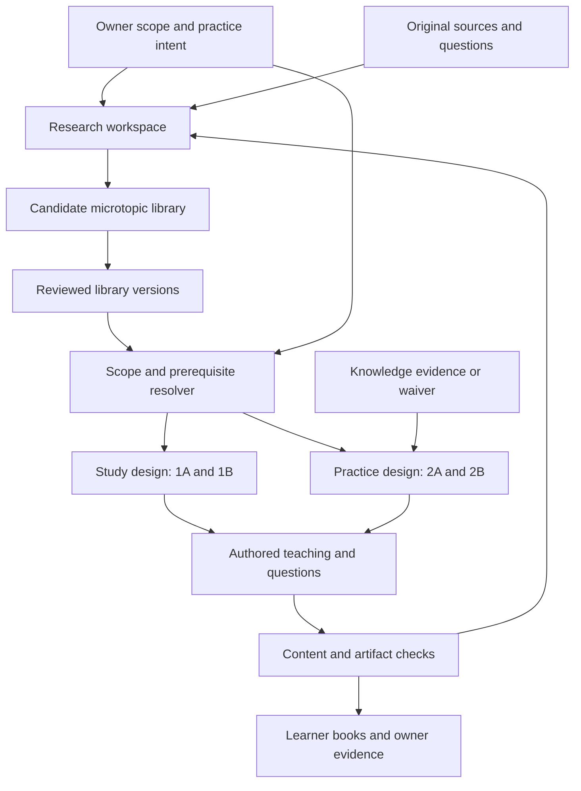

# V3B core system guide: architecture, contracts and growth

Status: consolidated guide and proposed roadmap, 2026-09-16. Existing Physics V3B implementation remains the execution basis. New library interfaces and future stages in this guide are **PROPOSED**, not implemented or independently validated. This task follows the owner's requirements; the owner has excluded the obsolete PR-delivery and Grade 9 workflow skills.

Start with the [stress-test prompt](../../Physics/StressTests/V3B-Stress-Test-Prompt-Template.md), [filled motion invocation](../../Physics/StressTests/V3B-Motion-Grade9-Example.md), [microtopic library design](V3B-Microtopic-Library-Design.md), [draft schema](V3B-Microtopic-Library.schema.json), [worked library seed](V3B-Relative-Motion-Library-Seed.json) and [research/adoption record](V3B-Research-and-Adoption.md).

Verification and explicit unexecuted checks: [design validation record](V3B-Design-Validation.md).

## 1. What success means

The system should help a competent general agent produce explainable, source-grounded self-study material without relying on that agent to rediscover expert teaching decisions. A larger prompt alone will not achieve this. We need reusable subject knowledge, explicit reasoning transitions, source selection with rationale, executable checks where possible and honest review boundaries.

“Any subtopic, research level or learner knowledge” is an extensibility goal, not a present guarantee. The system must handle unfamiliar inputs by discovering missing capabilities and producing bounded candidates or explicit holds. A previously unseen model must never become verified merely because it fits a schema. An average agent can be supported by a good library; an agent that cannot inspect evidence or follow the contracts cannot be made expert by metadata.

Evaluate both productivity and quality: useful complete learner material, correctness, difficult-step teaching, appropriate support, recoverability, false holds, actual research contribution and the amount of expert repair. Maximizing validator passes, pages, tokens or packet counts is not the objective.

## 2. Six learner products and separate engineering infrastructure

| Product | Purpose and depth control | Required self-help |
|---|---|---|
| Core1 | Existing compact basic notes/semantic orientation; preserve frozen material | Existing explanations and support; report source defects separately |
| Core2 | Existing frozen questions and ladder hints; source demand authority | Every question retains source identity and an answer |
| Core1A | Declarative detailed concept construction, by subtopic intrinsic difficulty | Completed reasoning, examples, pictorial/symbolic bridges and checks |
| Core1B | Open-ended conceptual reconstruction, with the same intrinsic coverage obligation | Meaningful prompts, optional graduated help, model response/rubric and repair |
| Core2A | Declarative question learning, from simplest tasks to competitive preparation | Full solution breakdown, appropriate diagrams, answers and guides |
| Core2B | Open-ended problem modelling/application/transfer | Attempt space, bounded support, full reasoning/rubric, checks and feedback routes |

Core1A/1B always use subtopic buckets. Hard/Medium/Easy are intrinsic authoring badges, not measured item difficulty or student mastery. Hard and Medium require research-informed enrichment. Easy follows the owner's no-enrichment-search choice. The 30/20/10-page examples express possible depth, not quotas.

Only Core2A/2B require knowledge information or an owner waiver for personalized routing. A scalar percentage needs provenance and scope; it cannot substitute for capability evidence. Owner overrides change operational choices while retaining the system finding. They cannot rewrite original evidence or correctness. Design previews may proceed without a personal diagnosis but must say so.

Core0 is routing infrastructure. Engineering gates specify scientific prerequisites and invariants. Neither is a seventh learner textbook. Keep learner navigation simple; expose engineering detail in an owner view.

## 3. System structure

This is target topology. Current V3B implements part of the source/input → composition → artifact check path. It does not yet implement the reviewed-library resolver or a complete authoring controller. Core1/Core2 provide preserved upstream material and question custody to these paths.

Separate five stores rather than embedding everything in each book: original resources; versioned subject knowledge; pedagogical designs and question families; learner/owner controls; actual realizations and evidence. A source can support many microtopics, a microtopic can appear in several curricula, and a question can assess more than one capability. Use typed links, not duplicated mutable records.

## 4. Contract inventory and ownership

This is the entry map to the schemas and logic needed by a new agent. Follow the actual linked contracts; the table does not redefine their field names.

| Contract family | Owner/input → output | Current V3B status / location |
|---|---|---|
| Subject contract and Core roles | Subject semantics → valid product responsibilities | [CoreContracts.json](../../Physics/CoreContracts.json), [six-Core contract](../../Physics/Engineering/CORE_CONTRACTS.md); legacy four-Core fields coexist explicitly |
| Production rule catalogue | Owner criteria → applicability and evidence requirements | [17-rule catalogue](../../Physics/Blueprint/V3B-Production-Rules.json); a policy catalogue, not a JSON Schema or proof of enforcement |
| Topic/source/gate packets | Original evidence and owner scope → versioned obligations and prerequisites | [packet contract](../../Physics/Engineering/PACKET_CONTRACT.md); fuller authoring integration remains pending |
| Baseline/source/plan | Separately bound original atoms/questions plus authored A/B blocks → immutable draft packet | [publication input](../../Physics/ProductionKit/V3B-Publication-Input.md), executable `publication_host/inputs.py` |
| Scientific candidates | Source-bound numeric values/equations → checked results or marked review requirements | `publication_host/science.py` plus existing Physics `validator.py`; limited families |
| Representation instance | Model/data/labels/frame → exact SVG and binding evidence | `publication_host/figures.py`; vector and piecewise-linear graph support only |
| Artifact/evidence manifest | Authored plan/runtime/input versions → composed HTML, readback and digests | `publication_host/compose.py`, `audit.py`, `storage.py`; no learner-release authority |
| Research promotion | Candidate discoveries → reviewed source/model/dependency changes | [research/minimum policy](../../Physics/Blueprint/V3B-Research-and-Minimum-Criteria.md); policy established, automated promotion pending |
| Microtopic library package | Research + expertise → reusable scientific and teaching units | [new schema proposal](V3B-Microtopic-Library.schema.json); structure-only validation, no runtime consumer yet |
| Capability state and routing | Scoped observations or waiver → practice selection/support rationale | Current publisher checks control fields; diagnosis/calibration and waiver authentication are not established |
| Core differentiation and exposure | Actual cross-Core objects → legitimate reuse or harmful repetition decision | Source/family screening exists; complete semantic adjudication pending |
| Extension/recovery | New scope/version → dependency closure, affected consumers, reproducible packet | Portable publication rebuild exists; full authoring-state invalidation and independent-agent recovery pending |

Human prompt configuration is not the publisher API. An adapter must map `SIMPLEST_FOUNDATION`, `BOARD_PRACTICE`, `COMPETITIVE_PREPARATION` to the current publisher purposes `STARTER`, `PRACTICE`, `COMPETITION`, preserving the owner's richer intent separately. The new library schema must not be passed directly to `publish`. The executable command and exact input contract remain in the publication guide.

### Logical schema vocabulary and parent crosswalk

Parent blueprints use different abbreviations and maturity levels. Normalize the **meaning** at the adapter boundary; do not rename or import every parent file blindly. The fields below describe logical payloads, not a replacement publisher API. Several payloads may share one physical document to keep authoring manageable.

| Logical payload / parent vocabulary | Fields or substance that must survive transport | Consumer and forbidden shortcut |
|---|---|---|
| Scope / scoped execution envelope / Core0 | Topic/subtopic/bucket IDs, year/track, includes/excludes, evidence availability, explicit unknowns and owner intent | Router; cannot reuse a topic-wide evidence score as proof for a narrower bucket |
| Ground truth / GT | Original bytes or exact accessible locators, source identity, extraction uncertainty, question numbers/figures and source-version digest | All analysis; source summaries cannot replace originals |
| Semantic analysis / K | Concepts, models, relation conditions, equation meanings, inference chains and conflicts | Join and library; cannot invent assessment provenance |
| Assessment analysis / D | Frozen item identity, demand, recognition cues, first difficult move, prerequisites, wrong routes and allowable transfer scope | Join/practice; no item evidence does not mean no educational importance |
| Independent comparison / V; Join / J | Frozen analyses, claim-level agreement/refinement/contradiction, missing semantics/demand, obligations and unresolved state | Production design; one author cannot manufacture independent agreement |
| Registry and engineering gate | Stable scientific assets, prerequisite links, invariant relations, representations, misconceptions, checks and maturity | Scope resolver/teaching design; declared READY is not scientific proof |
| Custody/coverage unit / CCU | Every required asset's disposition, required Core treatment, realization object and final location | Omission audit; an ID with an empty body is not realized content |
| Cross-Core differentiation / CDAU | Canonical asset, selected Core purpose, changed learner action, exposure lineage and reuse reason | A/B design and review; cosmetic rewrites do not establish differentiation |
| Study differentiation / SDU | Intrinsic badge, fragile inferences, decomposition, research contribution and representation needs | Core1A/1B; excludes personal knowledge percentage as a depth controller |
| Learner adaptation / LAU | Practice purpose, scoped capability evidence/estimate or waiver, item demand, support and uncertainty | Core2A/2B; no fabricated diagnosis from a percentage |
| Teaching unit / TTU | Expert completed state, meaningful learner transformation, technical representation, help, reveal, independent check and repair | A/B realization; arbitrary blanks or “ask a tutor” are insufficient |
| Taught/exposure state / T | What was actually presented, practised or attempted, at what version and under what support | Transfer eligibility; distinguish authored opportunities from observed student performance |
| Transfer eligibility / X | Valid semantic scope, permitted source/item family, prerequisite/support readiness and owner purpose | Practice selection; cannot silently introduce a new model or claim unseen exposure |
| Publication IR / PUB | Governed content, equation/figure bindings, answer navigation, layout instructions, exact output manifest and readback | Renderer/auditor; no invention of missing teaching or scientific content |
| Calibration / CAL | Observation origin, cohort/task/version, analysis method, uncertainty and resulting future policy revision | Future routing; never edits historical results or supplies retrospective source authority |
| Override / OVR; extension/change receipt | Original finding, owner instruction, changed operational action, scope/dependency delta and invalidated evidence | Controller; preserve truth, unrelated work and old accepted versions |

Implementation should converge on a small set of stable envelope and content schemas with typed sections. Creating a new top-level schema for every acronym would increase drift and maintenance without necessarily improving teaching. Parent-specific importers retain original packet IDs and record any field mapping or loss; lossy conversions remain candidates until the missing content is reconciled.

## 5. Core production logic

### Source and scope resolution

Bind board, grade, academic year, track, subtopic and inclusion/exclusion decisions. Distinguish curriculum scope, available semantic evidence and available assessment evidence. A topic-level source list is not proof of subtopic coverage. UNKNOWN, VERIFIED_ABSENT, CONFLICTED and AVAILABLE are different findings.

Preserve original questions, diagrams and answer statements. Record adaptations with parent IDs and changed fields. An original source can contain an error; retain it and produce a separate reviewed correction. Preferred source status is a retrieval recommendation, not scientific authority for every statement on that website.

### Decomposition and prerequisite closure

A microtopic represents an observable transition, not a heading. Store the entry capability, what changes in the learner's reasoning, the explanatory path, representation, plausible wrong path, repair and exit criterion. Split when a model, relation, sign/frame, difficult transformation or representation introduces a distinct dependency. Keep a coherent teaching episode above the microtopic layer so that decomposition does not create disconnected fragments.

Resolve prerequisite edges before accepting dependent teaching. Cross-subject dependencies retain provider identity: a Physics packet may point to an independently reviewed Mathematics bridge; it cannot relabel its own unreviewed trigonometry as provider approval. Missing approval permits a labelled candidate bridge and independent work elsewhere, not a forged READY receipt.

### Research and promotion

EXPLORATORY work may begin with provisional scope. REVIEW_DRAFT needs traceable content and visible uncertainties. LEARNER_READY needs applicable substantive criteria and acceptance evidence. Searches and abandoned ideas do not invalidate accepted products. Promoted changes to models, sources, prerequisites or depth invalidate the dependent versions only.

No source allowlist, fixed search count or per-page packet is required. Record meaningful findings in batches. Citation quantity is not research depth. For a research overlay require a question, model alternatives, derivation/experiment/argument plan, uncertainties and reviewer competence. It may discover more questions than it resolves; that is different from a failed search.

### Differentiated realization

Share scientific truth and declared anchors. Generate different learner work. In 1A, reveal and explain a completed construction; in 1B, elicit the relevant conceptual decision and supply reconstruction help. In 2A, teach a supported application; in 2B, assess a specified change in model choice, representation, context or demand. Changing numbers alone usually creates practice within a family, not a new transfer capability.

The library should recommend several useful teaching routes, not mandate one script for all topics. The generator chooses with a reason; a reviewer tests whether the resulting pages carry the intended thinking. Open-ended questions can have several valid responses, so closure may be a rubric with representative answers and rejected reasoning, rather than one string.

### Fit without fictional knowledge

For each practice item, compare required capabilities with demonstrated, uncertain and missing capabilities. Choose demand/support from the owner's purpose and available evidence. A percentage alone is an estimate or prior. Preserve dates, source, task conditions, hints used and uncertainty. Seeing a solution or receiving a generated book is not evidence of independent mastery.

The study contract remains invariant under changes in personal knowledge. An optional navigation pointer to a prerequisite is not permission to delete Hard-bucket explanation. For practice, let an owner ask for the simplest questions even when the estimate is high. For unknown knowledge, a waiver enables owner-directed practice, not a calibrated personalization claim.

## 6. Omission, reuse and acceptance

Use a two-way map: source/gate obligation → required Core treatment → actual content object → published location, and back from every published question/equation/figure to its sources and obligations. Count bodies and meaning, not only IDs. Every question, including informal embedded prompts, needs a source and answer/rubric. Separate supplied originals, adapted items and authored items visibly.

Use three complementary reuse signals: exact source/asset identity; text containment or similarity; semantic family/model/solution-path/exposure review. Keep the current 0.65/0.80/0.90 Jaccard thresholds as explicitly uncalibrated review triggers. Do not introduce a global “less than X% similar” acceptance rule. Necessary equations, definitions, spaced retrieval and worked-to-reconstruction anchors may legitimately repeat. Diagram instances require geometric/model compatibility even when the underlying rendering template is shared.

Six minimum criteria remain: correctness, required coverage, self-help closure, Core/learner fit, usable publication and traceable accepted state. Known scientific errors and missing required content block affected acceptance. Marked unresolved derivations or unsupported evaluators may remain review drafts. Advisories alone do not block research or release. Missing evaluation capability must remain visible.

Each check needs its method, version, scope, actual observation and limits. A checksum establishes byte identity; a schema establishes structure; an evaluator checks supported computations; academic review checks teaching and model validity; learner evidence tests actual learning. None substitutes for the others.

## 7. Agents, handoffs and owner visibility

The owner-facing board should answer: What is being built? What can proceed? What is uncertain? Which exact object is affected? What evidence will resolve it? What changed since the last accepted version? Show science, pedagogy, source coverage, learner fit, reuse and visual quality separately.

An agent should receive a compact entry file, resolved scope, relevant library slice, original references, required outputs, available tool capabilities and examples of valid/error states. Do not inject the whole repository or entire library. Budget packets by dependency size and reasoning load, with 1–3 subtopics per bundle; one large subtopic may need several sequential microtopic slices with a shared completeness ledger.

Reuse the specialist profile for continuing work. Reuse an agent instance for uninterrupted authoring when context remains sound. Use a separate instance for claimed independent validation, with access to the original evidence and an initial independent view before inspecting the author's conclusion. A second instance using the same model/source chain still has correlated-error risk; independent arithmetic or authoritative references strengthen the review. No particular model is assumed competent without observed performance.

On restart, load accepted and candidate versions, unresolved issues, relevant rejected alternatives, input/artifact digests and the exact next action. Summaries may aid navigation but must not replace missing source/equation/figure payloads. Concurrent workers return their base version; stale results become candidates for reconciliation, never silent replacement of current accepted content.

## 8. Scalability and subject adaptation

Start with versioned JSON/Markdown in Git and stable IDs; add an index only when discovery becomes slow. Keep large binary assets in an appropriate object store with immutable references. Preserve a canonical store plus rebuildable search indexes; embeddings are retrieval aids, not the source of truth. Resolve dependency closure and rank a small relevant library slice. Cache by source/model/policy/renderer version and invalidate only affected consumers.

Do not create a separate copy of each microtopic for every grade × badge × percentage × Core. Keep scientific content canonical; attach curriculum mappings, depth overlays, teaching routes and practice controls. Distinct scientific regimes need explicit model versions, not hidden flags. Measure library hit rate, candidate gap rate, stale-source rate, cost per accepted teaching unit and reviewer repair load before changing storage infrastructure.

| Shared machinery | Mathematics-specific adapter | Chemistry-specific adapter |
|---|---|---|
| Sources, provenance, versioning, scope, coverage, owner intent | Domains, assumptions, equivalent forms, proof dependencies and exceptional cases | Species, composition, charge, phase, conditions and model regime |
| Equation/representation links | Algebraic transformations with domain restrictions; geometric constructions and proof obligations | Stoichiometric coefficients, balancing, particle/symbolic/macroscopic correspondence |
| Scientific checks | Exact arithmetic, substitution, counterexamples and proof review; symbolic equality alone is insufficient | Atom/charge conservation, units, chemically valid species and condition-dependent interpretation |
| A/B differentiation | Completed argument versus reconstruction, conjecture, counterexample and transfer | Completed explanation versus prediction, representation translation and model discrimination |
| Question families/exposure | Structural solution families, not superficial algebraic changes | Reaction/model families, not merely swapping chemical names |
| Rendering and visual audit | Fractions, radicals, geometry marks, domains and graph discontinuities | Subscripts/superscripts, bonds, charges, phases, particle counts and reaction arrows |

Reuse the envelope and workflow, not Physics formula validators or diagram semantics. Mathematics/Chemistry development remains staged after the Physics proof. Adopt useful parent blueprints through an explicit field/meaning crosswalk and subject-specific examples. Older Chemistry guidance tying Core1A depth to readiness is superseded here by the owner's intrinsic-depth requirement.

## 9. Proposed roadmap with exit evidence

These stages are proposals, not authorization to execute every stage now. The stress prompt and design documents are the current deliverable.

| Stage | Deliverable | Exit evidence / dependency |
|---|---|---|
| R0: one usable entry point | This guide, template, current-capability map and scoped library seed | A new agent can identify the real command, input contracts and known limits without chat history; test still to be run |
| R1: Physics vertical slice | Run the motion production stress test with actual learner pages; wire accepted authoring packets to the existing publisher | Content/answer/source traceability and final-size review; positive flexibility probes and negative corruption probes both work; no copied manuscript side channel |
| R2: reusable microtopic library | Curated examples from several unlike Physics areas plus source/question registry and draft-to-reviewed promotion | An unseen subtopic can be built through the same interfaces; missing model/source support is explicit; source rationale and all microtopic exit tasks reviewable |
| R3: reliable adaptation/reuse | Capability-scoped practice route, exposure ledger, subject review acceptance and extension impact resolver | High-with-gap/unknown-with-waiver probes, semantic duplicate probes and changed-prerequisite invalidation behave correctly |
| R4: normal-agent reproducibility | Multiple fresh-agent runs on held-out topics using identical inputs and resource budgets | Report spread in omissions, scientific defects, repair effort, false holds and cost; compare with prompt-only baseline; no cherry-picked best run |
| R5: Mathematics adapter | Crosswalk PR351 structures, implement subject checks and one end-to-end proof | Algebraic and geometric/proof tasks pass their own scientific and final-medium review; Physics examples are not sufficient evidence |
| R6: Chemistry adapter | Reconcile current Chemistry blueprint with owner rules; implement representations/checks and proof | Quantitative and particle/conceptual tasks validate sources, conditions, conservation and self-help; do not inherit old readiness-driven study depth |
| R7: empirical improvement | Optional learner observations, versioned calibration, curated maintenance and search/index scaling | Evidence on transfer/retention and subgroup/uncertainty limits; no universal mastery claim from a few users |

Priority is R1's usable production integration, alongside a small curated library. Building a huge registry before proving its consumer risks another schema-only success. R2 need not catalogue the entire syllabus before R1 can run. Exact dates and staffing depend on the first measured run; no unsupported schedule is promised.

## 10. Known limitations and risks

| Issue | Present limitation / mitigation |
|---|---|
| Fragmented runtime maturity | Shared legacy commands are four-Core; the new Physics host composes A/B only. Complete six-Core orchestration is pending. |
| Architecture versus product success | A correctly blocked pipeline can pass a defensive probe while producing no useful book. Report these outcomes separately. |
| Current scientific coverage | Only limited scalar evaluators and vector/graph scenes; general derivations, source figures and domain-specific models need extensions/review. |
| Academic quality | 38 earlier runtime tests do not establish teaching depth, good B interactions or real learner fit. |
| Visual quality | Previous standalone SVG review is narrower than final-page/PDF inspection; full publication review remains pending. |
| Source availability and rights | Local question banks may be absent; websites move or restrict reuse. Record locator/access/licence and retain permitted snapshots; never fabricate provenance. |
| Source preference bias | A familiar provider may be poor for a specific capability. Keep alternatives and record why the chosen source helps. |
| Automated decomposition | Plausible titles or generated atom labels can conceal missing reasoning. Review content and exit tasks, and refine using production/learner evidence. |
| Excessive decomposition | Too many fragments increase reading and orchestration load. Group into coherent teaching episodes and measure repair effort. |
| Reviewer correlation | Fresh agents can share the same misconceptions. Combine independent methods and separate observation from inference. |
| Uncalibrated thresholds | Similarity, layout heuristics and estimated task difficulty are local design choices. Tune with labelled examples and record false positives/negatives. |
| Version and curriculum drift | Parent PRs and annual syllabuses change. Pin what was read; do not silently absorb a newer schema or track. |
| Personalization | Unknown or aggregate knowledge cannot diagnose individual capabilities. Keep estimates, observations and waivers separate. |
| Research-level claims | Deep literature search is not frontier expertise. State model limits, disagreements and review competence. |
| Missing historic attachment | The third 2026-09-14 attachment is not present in this workspace; this guide uses the visible owner requirements and available earlier files, without claiming a fresh reread of that missing file. |

The essential promise should be **traceable, extensible and testable production with visible limits**. A universal expert-output guarantee is neither implemented nor supported by the present evidence.
