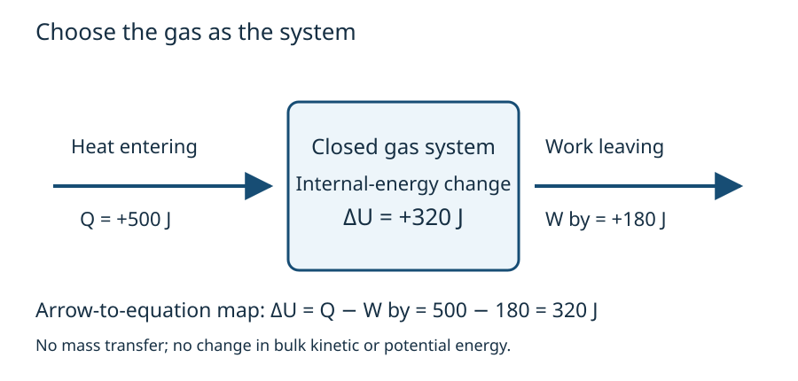

# Energy entering, energy leaving, energy retained

CORE1A · HARD first-law/path-work bucket · Design specimen for review

Every question is author-created for this V3B proof; none is official or owner-frozen. Answers follow the attempt/support sections.

## Choose the system

Imagine gas in a cylinder pushing a piston. The system is the gas. No matter crosses its boundary, and changes in bulk kinetic and gravitational potential energy are negligible. Heat and work describe transfers; internal energy describes the system's state. Define \(Q>0\) into the gas and \(W_{\rm by}>0\) for work done by it.

## Map arrows to equation terms

The heat arrow crosses inward and contributes \(+Q\). The work arrow crosses outward and contributes \(-W_{\rm by}\). The diagram represents energy bookkeeping, not heat stored as a substance inside the gas.

## Build the relation, then use it

\[
U_f=U_i+Q-W_{\rm by}
\quad\Rightarrow\quad
\Delta U=Q-W_{\rm by}.
\]
Subtraction follows from energy leaving. If another book defines work **on** the gas, \(W_{\rm on}=-W_{\rm by}\); the equivalent relation is \(\Delta U=Q+W_{\rm on}\).

With 500 J entering as heat and 180 J leaving as work,
\[
\Delta U=500-180=320\ {\rm J}.
\]
The gas gains internal energy while transferring some energy outward. Do not subtract the outward work twice.

For piston area \(A\) moving through \(dx\), \(dV=A\,dx\). Therefore \(dW_{\rm by}=F_{\rm ext}dx=p_{\rm ext}A\,dx=p_{\rm ext}dV\). At constant opposing pressure, \(W_{\rm by}=p_{\rm ext}(V_f-V_i)\). Substituting system pressure for opposing pressure requires quasistatic mechanical equilibrium.

Expansion gives positive work; compression gives negative work. A fixed-volume process gives zero pressure-volume work, but may still exchange heat. Electrical or shaft work would require additional terms.

## Self-check: A1-Q1

A closed rigid vessel receives 120 J of heat. There is no electrical or shaft work and no change in bulk kinetic/potential energy. Determine its pressure-volume work and internal-energy change. Identify the condition fixing the work.

## Answer: A1-Q1

\(W_{\rm by}=0\), \(\Delta U=+120\ {\rm J}\).

## Explain the result

Rigidity fixes volume, so the moving-boundary work is zero. The question separately excludes other work modes. Thus all the heat input increases internal energy. Rigidity alone would not exclude electrical work.

## Verify

In the worked illustration, \(320+180=500\ {\rm J}\). In A1-Q1, \(120+0=120\ {\rm J}\). Energy retained plus work transferred out equals heat entering. All terms have energy units. Temperature cannot be predicted without an additional material model.

## Model references and status

[MIT thermodynamics](https://ocw.mit.edu/ans7870/16/16.unified/thermoF03/chapter_3.htm) and [OpenStax first law](https://openstax.org/books/university-physics-volume-2/pages/3-3-first-law-of-thermodynamics) support the model conventions. These are content references, not question sources. Questions, explanations, calculations and diagrams are original design material. Independent Physics/pedagogy review and actual-size visual inspection are pending.
