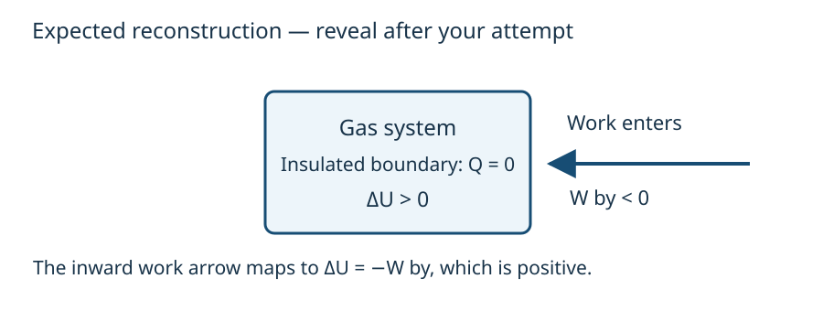

# Reconstruct the model and challenge its assumptions

CORE1B · HARD first-law/path-work bucket · Design specimen for review

Every question is author-created for this V3B proof; none is official or owner-frozen. Answers follow the attempt/support sections.

## Reconstruct: B1-Q1

A closed gas is compressed in an insulated cylinder. Exclude electrical/shaft work and changes in bulk kinetic/potential energy. Draw the system boundary and work-transfer arrow. Decide the signs of \(Q\), \(W_{\rm by}\) and \(\Delta U\), then derive the relation connecting them.

## Attempt before revealing help

Mark the selected gas, moving boundary and energy-transfer direction. Write signs beside your arrows. Leave space for a relation derived from the sketch. This is a reconstruction task; numerical substitution is unnecessary. Use only the first help step that restores progress.

## Progressive help

**Notice:** insulation sets heat transfer to zero.

**Represent:** compression transfers energy into the gas as work, so the work arrow crosses inward.

**Connect:** positive \(W_{\rm by}\) describes work transferred out by the gas. Its sign is negative during compression.

**Start:** substitute \(Q=0\) into the first law, keeping work symbolic.

## Expected response

No heat-transfer arrow; an inward work-transfer arrow. \(Q=0\), \(W_{\rm by}<0\), and \(\Delta U=-W_{\rm by}>0\).

## Find the broken link

If you concluded that insulation means no energy change, you omitted work as a transfer mechanism. Return to the inward arrow. If you concluded that the gas loses energy, check whether you switched between work on and work by.

A correct explanation connects the physical transfer, the chosen convention and the equation. Memorizing that compression “makes work positive” is incomplete without naming whose work is measured.

## Check your representation

Accept a boundary sketch or equivalent annotated representation with all these features:

| Feature | Physical meaning | Equation mapping |
|---|---|---|
| Gas inside boundary | Chosen system | Change in this gas's \(U\) |
| No heat arrow | Insulation | \(Q=0\) |
| Work arrow inward | Work enters | \(W_{\rm by}<0\) |
| Energy retained | Internal energy increases | \(\Delta U=-W_{\rm by}>0\) |

A complete sketch must show the arrow crossing the boundary, not just an arrow floating beside an equation.

## Generalize: B1-Q2

Change only the insulation condition: heat may now leave during compression. Is an internal-energy increase still guaranteed? Give a symbolic condition and a numerical counterexample.

## Generalization answer

No. Internal energy increases only if \(Q-W_{\rm by}>0\). It can also remain unchanged or decrease.

## Counterexample

Let 90 J enter as work and 140 J leave as heat. Then \(W_{\rm by}=-90\ {\rm J}\), \(Q=-140\ {\rm J}\), and \(\Delta U=-140-(-90)=-50\ {\rm J}\). Compression alone does not determine the internal-energy change. Insulation was an essential assumption in B1-Q1.

## Check the counterexample

The gas receives 90 J and loses 140 J, supplying the 50 J difference from its internal energy. Both the arrow model and equation predict \(-50\ {\rm J}\). For the insulated case, setting \(Q=0\) restores the positive change.

## Model references and status

[MIT thermodynamics](https://ocw.mit.edu/ans7870/16/16.unified/thermoF03/chapter_3.htm) and [OpenStax first law](https://openstax.org/books/university-physics-volume-2/pages/3-3-first-law-of-thermodynamics) support the model conventions. These are content references, not question sources. Questions, explanations, calculations and diagrams are original design material. Independent Physics/pedagogy review and actual-size visual inspection are pending.
