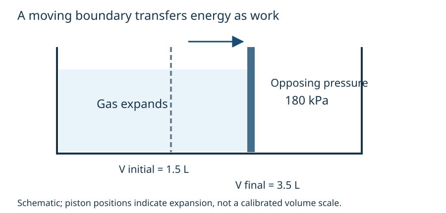

# Recognize cues and build the full solution

CORE2A · HARD first-law/path-work bucket · Design specimen for review

Every question is author-created for this V3B proof; none is official or owner-frozen. Answers follow the attempt/support sections.

**Learner calibration:** illustrative guided-practice design preset only. No actual percentage or owner waiver is supplied; personalized release is blocked. This material does not claim measured learner fit.

## Worked practice: A2-Q1

A fixed amount of gas expands quasistatically from 1.5 L to 3.5 L against a constant opposing pressure of 180 kPa. It receives 760 J of heat. Only pressure-volume work occurs, with no bulk kinetic/potential-energy change. Determine work done by the gas and its internal-energy change.

## Extract the setup

System: the gas. Known: \(V_i=1.5\ {\rm L}\), \(V_f=3.5\ {\rm L}\), \(p_{\rm ext}=180\ {\rm kPa}\), \(Q=+760\ {\rm J}\).

“Constant opposing pressure” selects a rectangle-area calculation. “Expands” fixes a positive volume change. “Receives” fixes the heat sign. Find work before the internal-energy change.

## Connect the boundary to the numbers

The moving boundary sweeps a volume difference of 2.0 L. The final volume 3.5 L is not the swept volume. The diagram is schematic; do not measure pixels to infer volumes.

## Complete working

\[
\Delta V=3.5-1.5=2.0\ {\rm L},
\quad W_{\rm by}=p_{\rm ext}\Delta V.
\]
Since \(1\ {\rm kPa\,L}=1\ {\rm J}\),
\[
W_{\rm by}=180\times2.0=+360\ {\rm J}.
\]
Then
\[
\Delta U=Q-W_{\rm by}=760-360=+400\ {\rm J}.
\]
Using \(pV_f\) counts volume that was already present. Adding work to the heat would treat energy leaving as if it entered.

## Quick answer

\(W_{\rm by}=+360\ {\rm J}\), \(\Delta U=+400\ {\rm J}\).

## Why the signs matter

The gas transfers energy out while pushing the surroundings and receives a larger amount as heat. The retained 400 J is the difference. The sign convention describes transfers across this gas's boundary; it is not chosen to make a memorized formula fit.

## Independent unit route

\[
180000\ {\rm Pa}\times0.0020\ {\rm m^3}=360\ {\rm J}.
\]
The energy check is \(400+360=760\ {\rm J}\). Expansion gives positive work by the gas, and \(Q-W_{\rm by}-\Delta U=0\). No temperature change is asserted without a material model.

## Model references and status

[MIT thermodynamics](https://ocw.mit.edu/ans7870/16/16.unified/thermoF03/chapter_3.htm) and [OpenStax first law](https://openstax.org/books/university-physics-volume-2/pages/3-3-first-law-of-thermodynamics) support the model conventions. These are content references, not question sources. Questions, explanations, calculations and diagrams are original design material. Independent Physics/pedagogy review and actual-size visual inspection are pending.
