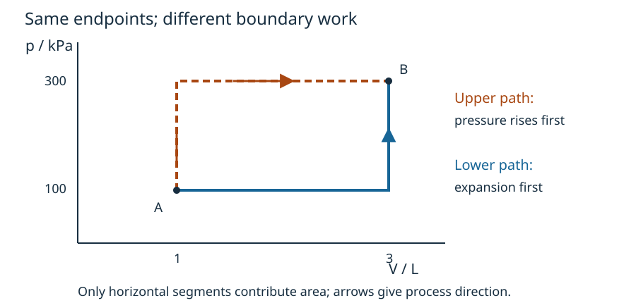

# Choose a route through an unfamiliar-looking problem

CORE2B · HARD application task; method labels withheld before attempt · Design specimen for review

Every question is author-created for this V3B proof; none is official or owner-frozen. Answers follow the attempt/support sections.

**Learner calibration:** illustrative guided-practice design preset only. No actual percentage or owner waiver is supplied; personalized release is blocked. This material does not claim measured learner fit.

## Choose a strategy: B2-Q1

The same fixed ideal-gas sample moves from A (1.0 L, 100 kPa) to B (3.0 L, 300 kPa) along either of two quasistatic routes. The lower route expands first at 100 kPa, then changes pressure at fixed volume. The upper route changes pressure first at fixed volume, then expands at 300 kPa. Only pressure-volume work occurs, with no bulk kinetic/potential-energy change. Heat supplied on the lower route is 650 J. Find heat supplied on the upper route and explain how the endpoint information helps.

## Attempt before the model is revealed

Draw both routes with axes, units and arrows. Decide which transfers can differ between routes and which state change must agree. Choose an order of calculation. Keep your sketch for comparison with the representation check.

## Progressive rescue

**Notice:** the same sample starts and ends in the same states.

**Structure:** distinguish state-property changes from process-dependent transfers.

**Represent:** fixed-volume segments contribute no pressure-volume work. Constant-pressure expansion contributes a rectangle.

**First move:** calculate work for each route. Use the known lower-route heat to find the internal-energy change.

**Method:** combine the common internal-energy change with upper-route work.

## Representation check — after attempting

A valid sketch preserves endpoints and process order, labels axes and units, and associates work with area under the directed path. It must not label a vertical segment “zero heat”: only its pressure-volume work is zero.

## Full solution

Lower route:
\[
W_l=100(3-1)=200\ {\rm J},\qquad \Delta U=650-200=450\ {\rm J}.
\]
Its vertical leg adds no boundary work. Internal energy is a state property, so the same fixed sample between the same complete equilibrium states has the same \(\Delta U\) on the other route.

Upper route:
\[
W_u=300(3-1)=600\ {\rm J},\qquad Q_u=450+600=1050\ {\rm J}.
\]
The extra heat compensates for extra work. The endpoint match does not make the heat or work identical.

## Quick answer

\(Q_u=1050\ {\rm J}\); both routes have \(\Delta U=450\ {\rm J}\).

## The decisive model choice

The useful bridge is path independence of the internal-energy change. A separate temperature calculation is unnecessary. Treating all three quantities as state properties would erase the work difference; treating none as state properties would discard the endpoint information.

## Verify through subtraction

Subtract the two balances:
\[
Q_u-Q_l=W_u-W_l=600-200=400\ {\rm J}.
\]
Hence \(Q_u=650+400=1050\ {\rm J}\). This matches the separate-route calculation and the area between the paths.

## Linked transfer check: B2-Q2

Traverse the upper route backward from B to A under the same assumptions. Determine the signed work, internal-energy change and heat transfer.

## Reversal answer

\(W_{\rm by}=-600\ {\rm J}\), \(\Delta U=-450\ {\rm J}\), \(Q=-1050\ {\rm J}\).

## Change orientation, preserve the model

Reversing the path reverses the work integral; interchanging the end states reverses \(\Delta U\). Therefore \(Q=\Delta U+W_{\rm by}=-1050\ {\rm J}\). Check: \(-1050-(-600)=-450\ {\rm J}\). This deliberately linked reversal is a reconstruction/variation check, not independent evidence of unfamiliar transfer.

## Model references and status

[MIT thermodynamics](https://ocw.mit.edu/ans7870/16/16.unified/thermoF03/chapter_3.htm) and [OpenStax first law](https://openstax.org/books/university-physics-volume-2/pages/3-3-first-law-of-thermodynamics) support the model conventions. These are content references, not question sources. Questions, explanations, calculations and diagrams are original design material. Independent Physics/pedagogy review and actual-size visual inspection are pending.
