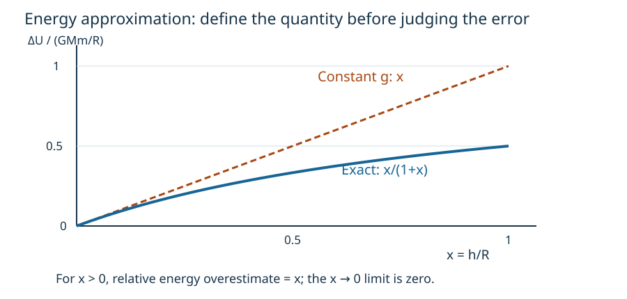

# Gravity extension: measure when a familiar approximation fails

**Profile:** research-method extension · HARD intrinsic bucket · Core1A/1B depth, not a knowledge-percentage setting.

This is a bounded original investigation, not a claim of new scientific discovery or a complete research-level gravity course. The school model remains available. The extension adds derivation, error analysis, reproducibility and a documented validity boundary.

## Research question G-RQ1

**Source:** author-created V3B investigation; model reference: [OpenStax gravitational potential](https://openstax.org/books/university-physics-volume-1/pages/13-3-gravitational-potential-energy-and-total-energy).

For a test mass raised radially from radius \(R\) to \(R+h\), when does using the surface value of gravity overestimate the potential-energy increase by at most 1% relative to the exact Newtonian result?

State the model before calculating: a spherical nonrotating source of fixed mass \(M\), exterior positions, \(h\ge0\), no drag or other energy transfers, and a Newtonian regime. Distances are measured from the centre. The 1% criterion is chosen for this investigation; it is not a universal acceptable-error rule.

## Core1A treatment: derive and interpret

With \(U(\infty)=0\),
\[
U(r)=-\frac{GMm}{r}.
\]
Therefore
\[
\Delta U_{\rm exact}
=GMm\left(\frac1R-\frac1{R+h}\right)
=\frac{GMm\,h}{R(R+h)}.
\]
Using constant surface gravity \(g_0=GM/R^2\) instead gives
\[
\Delta U_{\rm approx}=mg_0h=\frac{GMm\,h}{R^2}.
\]
For \(h>0\), define error using the exact result in the denominator:
\[
\epsilon_U
=\frac{\Delta U_{\rm approx}-\Delta U_{\rm exact}}{\Delta U_{\rm exact}}
=\frac{R+h}{R}-1=\frac hR.
\]
Thus the answer to G-RQ1 is \(0<h/R\le0.01\). At \(h=0\), both energy changes vanish, so this quotient is \(0/0\); its limiting value is zero. Do not silently divide by zero.

The approximation overestimates the increase because it keeps gravity at its larger surface value throughout the ascent.

Let \(x=h/R\). The plotted energy is normalized by \(GMm/R\). The exact curve is \(x/(1+x)\); the approximation is \(x\). Each plotted coordinate corresponds directly to a term in the derivation.

## Core1B treatment: investigate the choice of error measure

**Question G-RQ2 — source: author-created V3B extension.**

A learner uses the preceding 1% altitude rule to claim that the gravitational field itself changes by at most 1%. Determine whether that conclusion follows. Try deriving the field-error expression before revealing the help.

**Hint 1:** the previous error concerned an energy difference, not the field at the upper endpoint.

**Hint 2:** \(g(R+h)=GM/(R+h)^2\). Keep the same exact-value denominator convention.

**Answer and derivation:**
\[
\epsilon_g
=\frac{g_0-g(R+h)}{g(R+h)}
=(1+x)^2-1=2x+x^2.
\]
At \(x=0.01\), \(\epsilon_g=0.0201=2.01\%\). The claim is false.

For endpoint-field error at most 1%,
\[
x\le\sqrt{1.01}-1\approx0.004988.
\]
The quantity being approximated and the error denominator must be stated explicitly.

## Reproduce and falsify

| \(h/R\) | Exact normalized energy | Approximate energy | Relative energy overestimate |
|---:|---:|---:|---:|
| 0.001 | 0.000999001 | 0.001 | 0.1% |
| 0.01 | 0.009900990 | 0.01 | 1% |
| 0.1 | 0.090909091 | 0.1 | 10% |
| 1 | 0.5 | 1 | 100% |

Independent checks: \(F_r=-dU/dr=-GMm/r^2\); as \(h/R\to0\), exact and approximate energy agree to leading order. At \(r=2R\), the field ratio is \(1/4\), whereas escape-speed ratio is \(1/\sqrt2\). These ratios describe different quantities.

A falsifier should reject a method returning half the surface field at \(2R\), using altitude as centre distance, or reporting finite relative error from direct division at \(h=0\).

## Extending toward actual research literature

The next branch must specify a paper or research question and its required mathematics. A guided critical reading could use the [LIGO GW150914 primary paper record](https://dcc.ligo.org/P150914/public), explicitly separating reported observation, model inference, uncertainty and the student's own reproduction. Reading a summary is not reproducing the analysis.

Derivation-level general relativity remains held. [MIT 8.962's syllabus](https://ocw.mit.edu/courses/8-962-general-relativity-spring-2020/pages/syllabus/) identifies substantial prerequisites. The owner board records the gap instead of claiming a larger page count resolves it. No relativistic equation or question is automatically added to school exam scope.

A paper-study deliverable needs a claim-evidence table, prerequisite bridges, exact figure/data provenance, uncertainty interpretation, a reproducible bounded calculation and an expected-response rubric. These are extension obligations, not completed evidence in this specimen.
