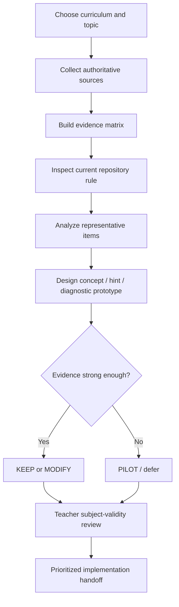
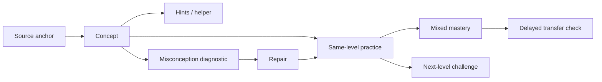

# Analytical Report on `Grade 9/DeepResearchPrompt.md`

## Executive summary

The GitHub file is accessible and was fetched from `reallaksh19/Common` on the `main` branch. It is a **25 KB research-and-engineering specification**, not a conventional Grade 9 student assignment. Its purpose is to commission an independent evidence review of a reusable Grade 9 learning-production system and then translate that evidence into concrete changes to repository schemas, instructional skills, question-generation logic, diagnostics, validators, and publication rules. fileciteturn1file0 fileciteturn5file0

The prompt is unusually comprehensive. It defines **twelve research streams, A–L**, spanning cognitive difficulty, item generation, concept architecture, scaffolding, misconceptions, retrieval and spacing, psychometrics, Mathematics, Physics, Chemistry, textbook/user-experience design, and AI/provenance/copyright. It then requires a repository gap analysis, a tightly prescribed report structure, an implementation backlog, a pilot design, and a final implementation handoff. fileciteturn2file0 fileciteturn3file0 fileciteturn4file0

The prompt's strongest design features are its insistence on high-quality evidence, explicit separation of empirical evidence from engineering judgment, skepticism toward unsupported numerical heuristics, preservation of source provenance, prohibition on pretending that psychometric calibration exists without learner-response data, and requirement that uncertainty remain visible. Those principles align well with authoritative learning-science and assessment guidance. The AERA/APA/NCME testing standards emphasize validity, fairness, and responsible interpretation, while the U.S. Institute of Education Sciences provides evidence-based guidance on spacing, retrieval, worked examples, representations, and study organization. citeturn1search0turn0search7turn0search8

Its biggest weakness for the requested student use case is **scope mismatch**. The file asks for work normally divided among learning scientists, assessment specialists, subject-education researchers, UX specialists, and software engineers. A Grade 9 student should therefore **not attempt a full professional execution of all twelve streams**. The appropriate school version is a supervised research capstone: survey every stream, investigate a small number deeply, analyze representative Mathematics/Physics/Chemistry items, and leave Rasch/IRT, production-schema migration, experimental statistics, and software validation to the teacher or technical mentor. The file itself implicitly supports this restraint by warning against false psychometric precision and by requiring pilots where evidence is insufficient. fileciteturn4file0

A second major issue is that several project-defining variables are missing: target curriculum or exam board, learner population, language level, definition of "Grade 9 appropriate," meaning of "competitive foundation," search dates and inclusion criteria, operational definitions for evidence grades A–D, citation style, privacy/ethics rules for collecting learner data, and a fixed repository revision for reproducibility. These should be resolved before substantive research begins. fileciteturn1file0 fileciteturn4file0

For a student-and-teacher version, I recommend an **eight-week, approximately 32–36 student-hour project**, with the teacher contributing roughly 8–12 hours of supervision and technical validation. The final student package should consist of an evidence matrix, source log, one detailed item analysis per subject, one concept/hint/misconception prototype, a repository-rule gap analysis, five to ten prioritized changes, a small pilot proposal, and a short Methodology v2 diagram. This preserves the intellectual core of the GitHub prompt without pretending a Grade 9 student can independently perform professional psychometric or software-engineering validation.

For sources, begin with official or authoritative material rather than general web searches: ERIC and the What Works Clearinghouse for educational research; *How People Learn II* for broad learning-science synthesis; the AERA/APA/NCME *Standards for Educational and Psychological Testing* for assessment; TIMSS, NAEP, and PISA released items for authentic item-design exemplars; W3C WCAG 2.2 for accessibility; UNESCO for generative-AI guidance; and copyright authorities appropriate to the jurisdiction. ERIC is an IES-sponsored education-research database, while OECD currently provides interactive released PISA Mathematics and Science items suitable for learners around age 15. citeturn8search0turn5search0turn7search0

## File summary

**File reviewed:** [`Grade 9/DeepResearchPrompt.md`](https://github.com/reallaksh19/Common/blob/main/Grade%209/DeepResearchPrompt.md)

The file describes itself as a prompt to be copied into a Deep Research session so that the resulting evidence report can be used directly to revise the Grade 9 skill family and roadmap. The project is framed as an **independent research and design review**, explicitly instructing the researcher not to endorse the existing architecture automatically but to identify supported, unsupported, oversimplified, missing, or potentially harmful rules. fileciteturn1file0

It points to a real repository structure rather than a hypothetical project. The current `Grade 9/` directory contains, among other things, `DeepResearchPrompt.md`, `SKILLSET.md`, `roadmap.md`, `shared/`, `skills/`, and validation scripts. The root `Grade9schema.md` separately describes the current production standard, including source-fidelity rules, default question-bank sizes, cognitive difficulty profiles, provenance classes, pedagogical enrichment, and PDF quality assurance. fileciteturn5file0 fileciteturn6file0

| Aspect | What the file requires |
|---|---|
| **Purpose** | Establish an evidence-based methodology for converting source material into concepts, calibrated questions, hints, diagnostics, mastery activities, challenge questions, structured master data, and published learning materials. fileciteturn1file0 |
| **Primary outcome** | Not merely a literature review; recommendations must be sufficiently concrete to modify repository schemas, skills, algorithms, validators, and publishing rules. fileciteturn1file0 |
| **Research breadth** | Twelve streams covering learning science, assessment, subject pedagogy, publishing, AI, provenance, and copyright. fileciteturn2file0 fileciteturn3file0 |
| **Repository audit** | Every important current rule must receive a verdict such as `KEEP`, `MODIFY`, `REPLACE`, `REMOVE`, or `REQUIRES PILOT DATA`. fileciteturn3file0 |
| **Evidence handling** | Prefer meta-analyses, systematic reviews, primary studies, professional standards, official curriculum/exam sources, and authoritative AI/education research; distinguish empirical findings, expert standards, design inference, and engineering recommendations. fileciteturn1file0 |
| **Required report structure** | Executive findings, evidence matrix, current-rule review, Methodology v2, revised difficulty/item/enrichment models, subject schemas, publishing system, schema changes, skill changes, validators, pilot plan, prioritized backlog, open questions, and bibliography. fileciteturn3file0 fileciteturn4file0 |
| **Final handoff** | An explicitly titled implementation section containing the top 25 changes, affected/new files, schema migrations, skill changes, validators, deferred findings, pilot experiments, and Definition of Done. fileciteturn4file0 |
| **Success criterion** | The final work must explain exactly what should change in the Grade 9 system and why, rather than merely describing education research. fileciteturn4file0 |

**Assessment criteria are present, but not as a school marking rubric.** The file provides evidence grades `A–D`, implementation priorities `P0–P4`, rule-review verdicts, source-quality requirements, methodological constraints, and a final success standard. It does **not** assign points, percentages, student grades, or teacher marking bands. fileciteturn3file0 fileciteturn4file0

The file also specifies several reusable output templates. These include an evidence-matrix table, a current-rule review table, a YAML-style schema-change record, skill-level `KEEP/ADD/MODIFY/REMOVE` decisions, automated-versus-judgment validation categories, and effort/impact/dependency/evidence fields for the implementation backlog. fileciteturn3file0 fileciteturn4file0

## Extracted requirements

The central research question asks, in substance, **what evidence-based methodology should control the entire pipeline from source material to concept architecture, calibrated practice, diagnostics, hints, mastery, challenge material, and publications while maintaining correctness, provenance, learner appropriateness, validity, and transfer**. The answer is expected to be directly implementable. fileciteturn1file0

The explicit research streams can be reduced to the following working questions without losing their intent:

| Stream | Explicit question or design problem | Required output |
|---|---|---|
| **Cognitive difficulty** | What actually creates item difficulty, which frameworks describe which aspects of it, and how can new items be matched to anchor items before student data exist? | Subject difficulty dimensions, comparison rubric, rejection rules, uncertainty fields, future empirical calibration, three subject examples. fileciteturn1file0 |
| **Question generation** | How can same-level and harder items preserve conceptual structure without becoming superficial numerical copies? | Generation taxonomy, authoring workflow, transformation rules, QA, duplicate rejection, Core-N allocation, strong/weak examples. fileciteturn2file0 |
| **Concept architecture** | How should concepts, prerequisites, misconceptions, and many-to-many question mappings be represented? | Concept schema, edge types, mastery rules, coverage metrics, remediation routing. fileciteturn2file0 |
| **Scaffolding and hints** | How should worked examples, fading, progressive hints, productive struggle, and solution reveal be controlled? | Hint/helper policy, stages, fading rules, learner-state logic and subject examples. fileciteturn2file0 |
| **Misconceptions and diagnostics** | How can the system distinguish persistent misconceptions from slips and route students through targeted repair? | Misconception/error schemas, diagnostic confidence, repair and transfer workflow. fileciteturn2file0 |
| **Retrieval and mastery** | How should blocked practice, retrieval, spacing, interleaving, mixed practice, delayed testing, and hidden concept labels interact? | Practice sequence, review principles, mixed-test rules, delayed retest and retention criteria. fileciteturn2file0 |
| **Assessment/psychometrics** | How must practice, diagnosis, and formal assessment differ, and what can legitimately be inferred before learner-response data exist? | Assessment metadata, blueprint, learner-performance schema, revision/retirement policy, precision warnings. fileciteturn2file0 |
| **Mathematics** | Which dimensions best represent secondary mathematics reasoning and transfer? | Mathematics difficulty vector and question fingerprint. fileciteturn2file0 |
| **Physics** | How should system/model choice, assumptions, representations, vectors, units, and validation checks be encoded? | Physics difficulty vector, fingerprint, solution contract and misconception taxonomy. fileciteturn2file0 fileciteturn3file0 |
| **Chemistry** | How should macroscopic, particulate, and symbolic reasoning plus practical and evidential reasoning be represented? | Chemistry vector, fingerprint, solution contract, experimental schema and misconception taxonomy. fileciteturn3file0 |
| **Textbook/UX** | Which page-design rules are evidence based and which are merely stylistic heuristics? | Page archetypes, typography/layout, whitespace, diagrams, print/digital differences, accessibility. fileciteturn3file0 |
| **AI/provenance/copyright** | How should AI-generated educational content be verified, attributed, audited, and protected against near-copying or hallucination? | Source hierarchy, provenance schema, verification policy, error severity, human gates, disclosure and copyright cautions. fileciteturn3file0 |

The file places especially strong constraints on interpretation. It says not to equate visible algebraic complexity with cognitive difficulty, not to treat Bloom/SOLO/DOK as psychometric item difficulty, not to report IRT/Rasch conclusions without learner-response data, not to assume that more scaffolding is always better, and not to invent precise universal thresholds where evidence is weak. It also requires clear separation of sourced, paraphrased, and newly authored material. fileciteturn4file0

That caution is consistent with professional assessment guidance. The AERA/APA/NCME standards treat appropriate score interpretation, validity, fairness, accessibility, and evidence for intended uses as central concerns rather than assuming that an item-quality label automatically supplies psychometric validity. citeturn1search0turn1search2

**Teacher/student instructions:** none are explicitly provided. The original role is a multidisciplinary expert research team, not "student" or "teacher." There is no student-facing worksheet, lesson sequence, submission date, oral-presentation requirement, teacher feedback cycle, collaboration policy, or age-adjusted research method. fileciteturn1file0 This is the single most important change needed before using the file as a Grade 9 research project.

## Ambiguities & assumptions

The following should be resolved—or explicitly recorded as assumptions—before a student begins.

| Ambiguity or omission | Why it matters | Working assumption for the plan |
|---|---|---|
| **Target curriculum/exam board is unspecified** | "Grade 9" differs substantially across systems, and the prompt also mentions competitive-foundation work. | Teacher identifies one authoritative curriculum as the scope boundary before item evaluation begins. |
| **"Grade 9 appropriate" is undefined** | Age, prerequisites, algebra background, reading ability and science sequence affect what counts as appropriate. | Assume approximately ages 14–15, then adjust to the school's actual curriculum. |
| **"Competitive foundation" has no precise ceiling** | It could allow useful extension or produce premature syllabus drift. | Every extension item must be separately tagged and must state additional prerequisites. |
| **No search protocol** | Source-quality categories are given, but not databases, date range, keywords, screening criteria or stopping rule. | Use ERIC plus authoritative organizations first; maintain a source-screening log. ERIC is an IES-sponsored database covering scholarly and other education research. citeturn8search0turn8search10 |
| **Evidence grades A–D are not operationally defined** | Two researchers could grade the same evidence differently. | Use A = multiple strong reviews/standards; B = consistent high-quality studies; C = limited/promising evidence; D = project hypothesis requiring pilot. Label this as a project convention, not an established universal scale. |
| **No citation style** | A long multi-source report needs consistent attribution. | Use APA 7 author-date references; use a student-friendly university guide such as Purdue OWL for formatting support. Purdue OWL provides free academic writing and citation guidance. citeturn3search2 |
| **No reproducibility/version rule** | The repository's `main` branch can evolve while research is underway. | Record the repository commit used for the study and archive the exact prompt/schema versions. The currently fetched prompt blob is `8dced8700d9fbe283b103ee1d4a821ebfc8d3fdd`. fileciteturn1file0 |
| **No empirical student dataset exists in the prompt** | True item difficulty, discrimination and IRT/Rasch parameters require response data. | Restrict initial difficulty judgments to expert/design estimates; describe empirical calibration only as a later pilot. This is also required by the prompt itself. fileciteturn4file0 |
| **Pilot ethics/privacy are underspecified** | A real pilot could collect student scores, confidence judgments and error patterns. | Teacher/school controls consent, anonymization, data retention and access before collecting learner data. |
| **Copyright jurisdiction is unspecified** | Rules vary by country and source license. | Store source/license metadata and avoid bulk copying. The U.S. Copyright Office, for example, stresses that educational use is not automatically fair use and that no fixed percentage guarantees legality. citeturn9search0turn9search10 |
| **Page-density target has no measurement definition** | "70–85% meaningful content" could refer to area, visual weight, or subjective impression. | Treat page occupancy as a design hypothesis to test, not a pass/fail numerical rule. fileciteturn3file0 |
| **No formal student assessment rubric** | Teachers cannot consistently mark the assignment from the prompt alone. | Use the aligned 100-point rubric later in this report. |

A further assumption is necessary for workload: a Grade 9 student will **survey all twelve streams but deeply investigate only a manageable subset**. Attempting a systematic literature review, three subject-specific schemas, professional psychometrics, AI governance, accessibility engineering, copyright analysis and code/schema migration at equal depth would undermine rather than demonstrate sound research practice.

## Detailed plan & timeline

A suitable school implementation is a **breadth-plus-deep-dive model**. The student learns what every research stream is asking, but concentrates original analysis on a small set of representative artifacts. This keeps the intellectual architecture of the GitHub prompt while matching the student's developmental level.

The project should use authentic item exemplars. TIMSS publishes released Grade 8 Mathematics and Science items with content/cognitive classifications and scoring information, while OECD publishes PISA Mathematics and Science items for 15-year-olds. Both are substantially better calibration examples than anonymous tutoring websites. citeturn2search0turn2search2turn5search0

| Period | Student activities | Teacher/mentor role | Est. student hours | Milestone and deliverable |
|---|---|---|---:|---|
| **Week 1 — Scope and repository map** | Read the prompt once for structure and once for requirements. Map the source → concepts → questions → diagnostics → publication pipeline. Identify five current heuristics to test. | Select curriculum authority and three pilot topics; explain what psychometrics is and is not. | 3–4 | One-page project brief; repository map; research question; assumptions register. |
| **Week 2 — Search strategy and evidence collection** | Learn ERIC/WWC searching. Create keyword groups for difficulty, retrieval, misconceptions, assessment, Math/Physics/Chemistry pedagogy, AI and UX. Collect 12–18 strong sources. | Check source quality; reject weak commercial/SEO sources. | 4 | Search log; annotated bibliography; preliminary evidence matrix. |
| **Week 3 — Difficulty and question quality** | Study Streams A/B. Select one official Mathematics anchor and compare two candidate variants for conceptual demand, steps, representation, transfer, language and calculation burden. | Review the student's ratings without converting them into false psychometric statistics. | 4–5 | Completed anchor-comparison sheet; strong-vs-weak variant example. |
| **Week 4 — Concepts, hints and misconceptions** | Study C/D/E. Build a small prerequisite graph for one topic; design a three- or four-stage hint sequence; create one misconception diagnostic chain. | Check subject correctness and whether hints reveal too much. | 4–5 | Concept map; hint ladder; misconception → probe → repair → retry → transfer prototype. |
| **Week 5 — Retrieval, mastery and assessment** | Study F/G. Design a short sequence moving from guided practice to mixed practice and delayed retrieval. Explain the difference among practice, diagnostic and assessment items. | Introduce validity/reliability conceptually; keep IRT/Rasch as extension material. | 4 | Practice schedule; mini test blueprint; one-page assessment-validity note. |
| **Week 6 — Subject comparison** | Analyze one Math, one Physics and one Chemistry item. Identify subject-specific reasoning features rather than using one generic difficulty scale. | Verify equations, models, terminology and curricular scope. | 4–5 | Three subject fingerprints and a comparative table. |
| **Week 7 — UX, accessibility, AI and provenance** | Audit one existing page/item for visual hierarchy, diagrams, accessibility and provenance. Build a provenance record for one official item and one synthetic item. | Check licensing/copyright and accessibility interpretation. | 4 | Page audit; provenance table; AI/human verification checklist. |
| **Week 8 — Synthesis and implementation** | Fill the current-rule matrix, assign `KEEP/MODIFY/REPLACE/PILOT`, identify 5–10 highest-priority changes, produce Methodology v2 and a small pilot proposal. | Challenge unsupported conclusions; ensure evidence grade matches source strength. | 5 | Final report, evidence matrix, rubric self-check, implementation handoff and 5–8 minute presentation. |

**Total student workload:** approximately **32–36 hours over eight weeks**. A realistic teacher/technical-mentor contribution is approximately **8–12 hours**, concentrated on curriculum scoping, subject correctness, assessment interpretation, copyright/privacy, and final evidence review.

The research method should be simple enough for a Grade 9 student to execute consistently:

```text
Question
→ Search authoritative sources
→ Record source and evidence type
→ Extract the finding in the student's own words
→ Record limitations/boundary conditions
→ Compare finding with repository rule
→ Decide KEEP / MODIFY / REPLACE / PILOT
→ Explain why
```

The student should not attempt Rasch or IRT calculations merely because the terms occur in the prompt. The GitHub file explicitly prohibits presenting such claims without learner-response data, and professional testing standards likewise require evidence appropriate to the intended interpretation and use of assessment results. fileciteturn4file0 citeturn1search0

For the learning-design portion, the student can test several relatively accessible research-supported principles. The IES/WWC practice guide recommends spacing learning over time, interleaving worked examples with problem solving, combining graphics and verbal explanations, connecting concrete and abstract representations, using active retrieval, and prompting deeper explanation. citeturn0search7turn0search8 These make good first targets because they can be examined in actual Grade 9 materials without requiring advanced statistics.

## Resources & links

The source hierarchy should begin with **official standards and research organizations**, then systematic reviews and peer-reviewed research, then official assessment exemplars. General education blogs should be used only for discovery, not as the evidential basis for major conclusions, matching the file's instructions. fileciteturn1file0

| Resource | Best use in this project | Link |
|---|---|---|
| **ERIC — Institute of Education Sciences** | Main literature-search database. ERIC is an IES-sponsored digital library of education research and information and includes filters useful for secondary/Grade 9 work. citeturn8search0turn8search10 | [ERIC](https://eric.ed.gov/) |
| **What Works Clearinghouse — Organizing Instruction and Study** | Accessible evidence on spacing, retrieval, worked examples, representations and study design; the guide applies through Grade 12. citeturn0search7turn0search8 | [IES/WWC practice guide](https://ies.ed.gov/ncee/wwc/PracticeGuide/1) |
| **How People Learn II — National Academies** | Broad authoritative learning-science synthesis covering cognition, context, learning environments and school implications. It is a National Academies consensus study report. citeturn7search0turn7search11 | [National Academies report](https://www.nationalacademies.org/projects/DBASSE-BBCSS-13-06/publication/24783) |
| **Standards for Educational and Psychological Testing — AERA/APA/NCME** | Primary professional reference for validity, reliability, fairness, accessibility and responsible testing. The 2014 edition is open access; a revision process is underway, so record the edition used. citeturn1search0turn1search13 | [NCME Testing Standards](https://ncme.org/resources/books/testing-standards/) |
| **TIMSS 2027 Assessment Frameworks** | Current authoritative Math/Science framework with content domains and cognitive domains such as knowing, applying and reasoning. citeturn2search4 | [TIMSS frameworks](https://timssandpirls.bc.edu/latest-news/timss-2027-frameworks-release.html) |
| **TIMSS released Grade 8 items** | Excellent exemplar bank for comparing question structure, cognitive domain and scoring. Released sets include documentation and constructed-response scoring guides. citeturn2search0turn2search2 | [TIMSS released items](https://timssandpirls.bc.edu/timss2011/international-released-items.html) |
| **OECD PISA test items** | Age-near exemplar problems emphasizing application and transfer. OECD currently provides released PISA 2022 Mathematics and PISA 2025 Science sample items in English. citeturn5search0turn5search1turn5search7 | [OECD PISA test](https://www.oecd.org/en/about/programmes/pisa/pisa-test.html) |
| **NAEP teacher resources and sample questions** | Official examples for assessment frameworks, content areas and varying question complexity. citeturn2search21turn2search19 | [NAEP educator resources](https://nces.ed.gov/nationsreportcard/educators/) |
| **EEF Metacognition and Self-Regulated Learning** | Teacher-friendly synthesis and implementation examples for modelling, planning, monitoring, evaluating and scaffolding. The guidance was updated in 2025. citeturn6search0turn6search3 | [EEF guidance](https://educationendowmentfoundation.org.uk/education-evidence/guidance-reports/metacognition) |
| **W3C WCAG 2.2** | Accessibility checklist for digital learning material. W3C encourages use of the latest WCAG version; WCAG 2.2 organizes requirements around perceivable, operable, understandable and robust content. citeturn0search11turn0search3 | [WCAG overview](https://www.w3.org/WAI/standards-guidelines/wcag/) |
| **UNESCO Guidance for Generative AI in Education and Research** | AI governance, inclusion, ethics and human-centered educational use. citeturn0search4 | [UNESCO guidance](https://www.unesco.org/en/digital-education/ai-future-learning/guidance) |
| **U.S. Copyright Office Fair Use Index** | Useful copyright reference when U.S. law is relevant. Importantly, it warns that educational purpose alone does not automatically establish fair use and that no fixed percentage rule exists. citeturn9search0turn9search10 | [Copyright Office Fair Use](https://copyright.gov/fair-use/) |
| **Purdue OWL** | Student-friendly citation and research-writing support. For this project, **APA 7** is a practical recommended house style because the report is education/research oriented; this is a project choice, not a requirement of the GitHub file. Purdue provides freely accessible writing and citation guidance. citeturn3search2 | [Purdue OWL](https://owl.purdue.edu/owl/) |

For official question exemplars, prefer **released items** rather than copying live or secure assessment questions. TIMSS explicitly documents item-release conditions and source acknowledgments, while professional testing guidance cautions that exposing secure test content can damage validity. citeturn2search1turn1search1

A compact recommended citation format is:

> Author/organization. (Year). *Title*. Publisher/organization. DOI or URL.

In the report body, use `(Author, Year)`. For the GitHub repository itself, include repository owner, file path, branch/commit identifier and access date so later reviewers can identify exactly which version was audited.

## Rubric/checklist

Because the original file supplies quality criteria rather than student marks, the following is a **derived Grade 9 teacher rubric** aligned with its priorities.

| Criterion | Points | Full-credit evidence |
|---|---:|---|
| **Research question and scope** | 10 | States the central problem clearly, defines curriculum/topic boundaries, records assumptions, and distinguishes the student's project from the full professional specification. |
| **Source quality and research method** | 15 | Uses mostly primary/official/high-quality research; keeps a search/source log; distinguishes empirical evidence, standards, inference and project recommendations as the prompt requires. fileciteturn1file0 |
| **Evidence matrix and uncertainty** | 10 | Every major claim has a source, evidence grade and limitation/boundary condition; weak evidence is not presented as certainty. |
| **Difficulty and item-quality analysis** | 15 | Compares conceptual demand, reasoning, representation, transfer and other relevant dimensions; does not confuse calculation length with cognitive difficulty or claim unsupported numeric precision. fileciteturn4file0 |
| **Learning architecture and diagnostics** | 15 | Produces a coherent concept/prerequisite model, hint sequence, misconception diagnostic and repair/transfer path. |
| **Math/Physics/Chemistry application** | 10 | Includes at least one correctly analyzed item from each subject and shows why subject reasoning differs. |
| **Assessment validity and responsible interpretation** | 10 | Clearly distinguishes practice, diagnostic and assessment uses; does not claim IRT/Rasch calibration without data. fileciteturn2file0turn4file0 |
| **Gap analysis and actionable recommendations** | 10 | Uses `KEEP/MODIFY/REPLACE/REMOVE/PILOT`; recommendations state affected rule/artifact, evidence, expected benefit and priority. |
| **Provenance, copyright, AI and accessibility** | 5 | Sources and synthetic items are clearly labelled; copyright is treated cautiously; accessibility and AI verification are considered. W3C and UNESCO provide relevant authoritative guidance. citeturn0search11turn0search4 |
| **Total** | **100** | |

Four items should function as **non-negotiable pass gates**, regardless of the numerical score:

| Gate | Pass condition |
|---|---|
| **No fabricated evidence** | Every evidence-based claim is traceable to a real source. |
| **No false psychometric precision** | No empirical item-difficulty, discrimination, Rasch or IRT claim is made without suitable learner-response evidence. fileciteturn4file0 |
| **Provenance preserved** | Official/source-derived, paraphrased and newly authored items are distinguishable. fileciteturn4file0 |
| **Uncertainty visible** | Unsupported heuristics are labelled as hypotheses or pilot candidates instead of facts. fileciteturn4file0 |

A useful student self-check immediately before submission is:

| Check | Yes/No |
|---|---|
| Can I explain my research question in two sentences? | □ |
| Did I define the curriculum and learner group I am studying? | □ |
| Are most important claims supported by authoritative or peer-reviewed sources? | □ |
| Did I write what each source actually supports, rather than merely listing citations? | □ |
| Did I record conflicting or limited evidence? | □ |
| Did I test at least one current repository rule instead of assuming it is correct? | □ |
| Does every recommendation say `KEEP`, `MODIFY`, `REPLACE`, `REMOVE`, or `PILOT`? | □ |
| Did I avoid calling an item "psychometrically calibrated" without learner data? | □ |
| Did I analyze one Math, Physics and Chemistry example? | □ |
| Can another person trace the origin of every sample question? | □ |
| Did I check visual accessibility and readability? | □ |
| Does the final handoff state exactly what should change and why? | □ |

## Sample templates/visuals

The project will be much easier for a Grade 9 student if the GitHub prompt's professional structures are converted into a few repeatable worksheets.

**Student evidence matrix**

| ID | Design question | What the source found | Evidence type | Confidence | Limitation | Repository implication |
|---|---|---|---|---|---|---|
| E01 | Does spacing help long-term retention? | Summarize evidence in your own words | Review / guidance | A/B/C/D | State context | KEEP / MODIFY / PILOT |
| E02 | Should every question have five hints? | Summarize evidence | Study / inference | A/B/C/D | State context | KEEP / MODIFY / PILOT |
| E03 | Is ±0.4 scientifically justified? | Summarize evidence | Standards / no direct evidence | A/B/C/D | State uncertainty | REPLACE / PILOT |

The original file explicitly requires an evidence matrix that includes claim/design question, finding, evidence strength, sources, boundary conditions, and system implication. fileciteturn3file0

**Anchor-to-candidate item comparison**

| Dimension | Anchor | Candidate | Match? | Evidence/notes |
|---|---:|---:|---|---|
| Core concept | Sequence rule | Sequence rule | Yes | Same concept |
| Hidden-structure recognition | Medium | Medium | Yes | Similar method-selection demand |
| Reasoning steps | 3 | 3 | Yes | Count meaningful steps, not arithmetic operations |
| Representation shift | None | Table → algebra | No/partial | Candidate adds translation demand |
| Calculation burden | Low | Medium | Partial | Candidate may feel harder for the wrong reason |
| Transfer distance | Near | Near | Yes | Same conceptual family |
| Language demand | Low | Low | Yes | |
| Confidence in comparison | — | — | Medium | Needs teacher review |

This template operationalizes one of the file's most important ideas: "same level" should be judged by a **multidimensional cognitive profile**, not merely by a single Easy/Medium/Hard label. fileciteturn1file0

**Misconception diagnostic template**

| Field | Example entry |
|---|---|
| Concept | `ALG-C03` |
| Suspected misconception | Student treats a multiplicative pattern as additive |
| Observable signature | Uses constant difference despite changing ratios |
| Diagnostic probe | New short item with obvious multiplicative structure |
| Confidence | Low / Medium / High |
| Repair | Contrast additive and multiplicative examples |
| Immediate retry | Same concept, changed surface features |
| Delayed transfer check | Mixed item two sessions later |
| Result | Repaired / uncertain / persists |

This mirrors the prompt's requested sequence from incorrect model to error signature, probe, repair, retry and transfer check. fileciteturn2file0

**Methodology-v2 student workflow**



The important feature is the **evidence decision point**: weak evidence routes to a pilot rather than to invented certainty, exactly as the file requires. fileciteturn4file0

**Relationship map for one concept**



This is a student-scale version of the repository's existing linked architecture connecting concept, source anchor, calibrated practice, challenge, hints, misconception diagnosis, solutions and mixed-test diagnosis. fileciteturn1file0

**Current-rule review template**

| Current rule | Evidence found | Verdict | Recommended change | Priority |
|---|---|---|---|---|
| Same-level threshold ±0.4 | No direct validation found | REQUIRES PILOT DATA | Replace hard cutoff with profile comparison + uncertainty | P1 |
| Five fixed hint levels | Mixed/context-dependent | MODIFY | Allow 2–5 stages depending on item and learner state | P1 |
| Stable concept IDs | Operationally useful | KEEP WITH CLARIFICATION | Document versioning and concept-granularity rules | P1 |
| 70–85% page occupancy | Design heuristic | REQUIRES PILOT DATA | Use accessibility/readability QA instead of a hard density rule | P3 |

Those example verdicts should **not be treated as final literature-review conclusions**; they illustrate how the student should turn evidence into decisions. The original prompt intentionally treats the numeric difficulty thresholds and page-occupancy target as hypotheses to be evaluated rather than established truths. fileciteturn1file0turn3file0

For visual review, the teacher/project owner should provide three concrete artifacts before Week 7: **a screenshot or rendered page from the current Grade 9 textbook format, one representative source/anchor question from each of Mathematics, Physics and Chemistry, and—if available—a diagram of the current master schema or concept relationships**. These are more useful than decorative imagery because they allow direct before/after evaluation of the system the research is supposed to improve. The file itself emphasizes visual QA, diagram use, accessibility and the principle that the PDF is a rendered publication product rather than merely exported text. fileciteturn3file0 fileciteturn6file0

The resulting Grade 9 submission should therefore be judged less by its length than by whether a reader can move cleanly from **source → evidence → analysis → uncertainty → recommendation → implementation or pilot**. That preserves the defining standard of `DeepResearchPrompt.md`: research is valuable only when it explains what should change in the learning system, why the change is justified, and which claims still require evidence before adoption. fileciteturn4file0