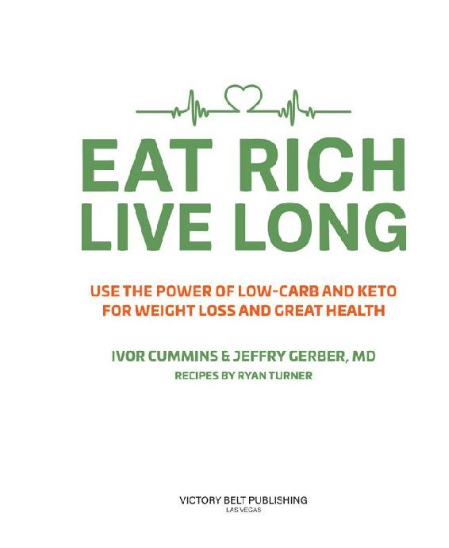

First Published in 2018 by Victory Belt Publishing Inc.

Copyright © 2018 Jeffry Gerber & Ivor Cummins

All rights reserved

No part of this publication may be reproduced or distributed in any form or by any means, electronic or mechanical, or stored in a database or retrieval system, without prior written permission from the publisher.

ISBN-13: 978-1-628602-73-9

The information included in this book is for educational purposes only. It is not intended or implied to be a substitute for professional medical advice. The reader should always consult his or her health-care provider to determine the appropriateness of the information for his or her own situation or if he or she has any questions regarding a medical condition or treatment plan. Reading the information in this book does not constitute a physician-patient relationship.

Recipes created by Ryan Turner and edited by Jordan von Trapp

Recipe photos by Ryan Turner

Author photos by Leonard Photography and Truth Photography, LLC

Interior design by Justin-Aaron Velasco

Printed in Canada

TC 0118

## CONTENTS

Foreword by Michael Eades, MD

Introduction

1 SICK AND TIRED OF BEING UNHEALTHY

Chapter 1: We’re Getting Heavier and Heavier

Chapter 2: Seven Ways to Twist the Truth

Chapter 3: Respect Your Insulin: Why Most Weight-Loss Plans Fail

Chapter 4: Stop the Toxic MIRS Diet

Chapter 5: Low-Carb, High-Fat for the Win

2 THE EAT RICH, LIVE LONG PRESCRIPTION

Chapter 6: Your Weight-Loss Master Class

Chapter 7: The Eat Rich, Live Long Plan: Days 1–7

Chapter 8: The Eat Rich, Live Long Plan: Days 8–21

Chapter 9: Recipes

3 EAT RICH, LIVE LONG: THE DEEPER DIVE

Chapter 10: Most of Us Have Diabetes: Insulin as a Master Gauge of Chronic Disease

Chapter 11: Fixing Heart Disease: Cholesterol Is a Weapon of Mass Distraction

Chapter 12: Cancer: When Your Metabolic Control System Fails

Chapter 13: Healthy Fat: The Fuel for Longevity

Chapter 14: Protein: Benefits and Pitfalls

Chapter 15: Which Vitamins and Minerals Do You Really Need?

Chapter 16: The Long-Term Eat Rich, Live Long Plan

Acknowledgments

Appendix A: Resources

Appendix B: The Eat Rich, Live Long Guide to Sweeteners

Appendix C: High Cholesterol Concerns

Appendix D: The Insulin Spectrum

Appendix E: The Science of Polyunsaturated Fats

About the Authors

Notes

In memory of my father, Nicholas J. Cummins, one of the countless secret diabetics who were never diagnosed. He passed away at seventy-two following many years of poor health—long before the knowledge in this book could have saved him. Also in memory of Dr. Joseph R. Kraft, who half a century ago could have told my father all that he needed to know.

—IVOR CUMMINS

In memory of Dr. Alexander C. Szabo Jr., a family physician and dear friend who devoted his life to helping others. Like so many, he thought he was healthy, yet he was suddenly lost to us at the age of sixty-two due to a massive heart attack.

—JEFF GERBER
