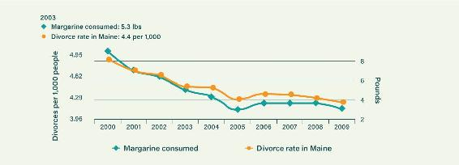
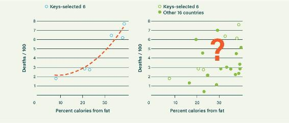

## CHAPTER 2

### SEVEN WAYS TO TWIST THE TRUTH

The low-fat dietary confusion highlighted in the last chapter did not come about by chance. It was driven remorselessly by that most dangerous of things: an idea. The idea became a theory and then, over time, dogma. It is important to know how this occurred because we are being misled by this same theory to this very day. The theory was “proven” using some deceptive and unsound scientific methods. Truth became mangled as groupthink took over the world of nutrition. And it was all based on simplistic interpretations of how the food groups interacted with our bodies. So that’s where we’ll start, with some basic definitions of the elements in food and their characteristics.

All food is composed of three macronutrients: fat, carbohydrate, and protein. These are what provide us with energy, in the form of calories, and nutrients.

FATS

-  Fats are energy-dense at 9 calories per gram.

-  They are concentrated in many highly nutritious foods, including fatty meats, eggs, cheeses, nuts, avocado, olives, and coconut.

-  Fats are also found in ingredients created through high-volume, industrial chemical processes; these are not at all good for you:

- Vegetable oils, low-cost, supposedly healthy polyunsaturated fats that are extracted from seeds in a multistep industrial refining process

- Hydrogenated fats, vegetable oils chemically altered to make them more solid at room temperature; often used in baked goods

-  There are many essential fats that our body needs but cannot make—we have to consume them to be healthy. There are also many fat-soluble vitamins that our body requires fats to absorb. Fat is crucial for health!

-  According to the Institute of Medicine, the minimum amount of dietary fat humans require is around 20 percent of dietary intake. That means that at least 20 percent of your calories each day *must* come from fat. If you approach zero, you will soon become ill.

PROTEIN

-  Protein is low in energy density at 4 calories per gram.

-  It is concentrated in many healthy whole foods, including meat and fish, eggs, cheese, nuts, and some vegetables and plant foods.

-  Protein supplies the molecular building blocks our bodies use to make muscle and other tissues.

-  The minimum human requirement for protein is around 15 percent of dietary intake, or 0.4 gram per pound of body weight. This equates to around 55 grams (2 ounces) per day for an adult weighing 150 pounds. If you approach zero protein intake, you will soon become very ill. Protein also affects our appetite: if we don’t get enough, we tend to keep eating until we do.

CARBOHYDRATES

-  Like protein, carbs are low in energy density at 4 calories per gram.

-  All carbs are broken down into glucose, which the body either uses for fuel or stores—mostly as body fat.

-  Carbs are abundant in many healthy whole foods, including vegetables, some nuts, fruits, and roots and tubers such as potatoes.

-  Carbs are also abundant in wheat, which humans began using on a large scale approximately eight thousand years ago, making it a more recent addition to our diet than the foods listed above.

-  More modern still are highly processed carbohydrates: refined sugar and refined wheat flour and all the foods they’re found in—soft drinks, candy, chips, bread, pasta, baked goods of all types, breakfast cereal, and more.

-  The three bullet points above on foods that contain carbs start with the more slowly digested carbs, which can have beneficial nutritional effects—they can assist the function of your gut. At the bottom of the list are sugary foods that can destroy the function of your gut. In terms of your health, this distinction matters a lot.

-  The minimum human requirement for carbohydrate is effectively 0 percent of dietary intake. *That’s right—zero—you don’t have to eat any carbs at all*. Your body can easily synthesize all the glucose it requires. So—unlike with fats and protein—as your carbohydrate intake approaches zero, there is no known scientific reason for you to become ill. The exception is if the foods you’re eating are all missing a key nutrient—vitamin C, for example, is classically associated with fruit. But you can get vitamin C from organ meats and low-carb vegetables, too. In short, unlike fat and protein, carbohydrate is not a necessary part of the human diet.

All that may be surprising. It certainly doesn’t match what we’ve been told for decades about health and nutrition. So given that dietary fat is a key essential nutrient and carbohydrate is not, why did authorities decide that dietary natural fats could be the primary source of risk for heart disease and other diet-related health problems?

Unfortunately, they all fell for the low-fat theory that had been knocking around in the 1950s, although it was highly contested in the scientific community at the time. But what really planted the seeds for the low-fat era was a crucial event: the theory attracted a true champion, an extraordinarily influential champion, who was set to change the course of history. He took a complex issue and simplified it to the point that he created a lie.

### THE ELEPHANT IN THE ROOM

There’s an old parable about four blind men and an elephant. None of the men has encountered an elephant before, so each feels a different part of the elephant to try to determine what it is. One feels the trunk and thinks the elephant is like a snake; another feels its side and thinks it’s a kind of wall; the third feels a leg and thinks it’s a pillar; and the last feels the tail and thinks it’s like a rope. Each man has a piece of information that’s pretty convincing, and each feels that he has enough data to make a judgment. *But each blind man doesn’t know what he doesn’t know*. None of them have enough information to see the big picture, so each one gets what an elephant is like totally wrong.

In the 1960s, an influential blind man grasped onto a trunk and would not let go. He was absolutely, positively sure that he held a snake in his hands. He believed with fervor that his nutritional villain was causing the world’s heart disease problems, and over time he convinced many people that his villain was the primary driver of heart disease.

This blind man’s name was Ancel Keys. The villain he held onto was dietary fat, particularly saturated fat. He convinced the world that this dietary fat from natural sources was the thing we should all fear, thereby setting in motion the biggest mistake in the history of nutritional science. The world is only now beginning to recover from his mistake, and very slowly at that.

### ANCEL KEYS AND HIS LOUSY RESEARCH

To verify that something actually causes a specified result and isn’t just associated with it, there are three primary pillars of proof that must be demonstrated.

The first pillar is *associational evidence*. This is essentially some kind of indication that two things have an association. It is hardly even a pillar because it is so weak—it only suggests that there might be a relationship between two things; it doesn’t prove that one thing causes the other. You’ve probably heard it said that “correlation does not imply causation,” meaning that just because two things are linked doesn’t mean one causes the other—for instance, the divorce rate in Maine correlates with the per capita consumption of margarine, but it would be absurd to suggest that one causes the other.^1^ One should* never* say that X causes Y using associational evidence alone, and yet the vast majority of nutritional studies you see in the media are teetering on this one weak pillar of evidence.

The second pillar is *mechanism evidence.* Here you have to demonstrate that your cause makes *technical sense*—that it is physically probable that one thing should cause the other. But that alone doesn’t prove it is significant, especially if there is bias to defend a prevailing theory. Mechanism evidence is regularly exaggerated to defend dogmas.

Divorce Rate in Maine Correlates with Per Capita Consumption of Margarine

Figure 2.1. While the change in margarine consumption correlates with the divorce rate in Maine, obviously a change in one doesn’t cause a change in the other. Source: Tyler Vigen, *Spurious Correlations,*
www.tylervigen.com/spurious-correlations.

The third pillar is *experimental evidence*. When it comes to medicine, this refers to evidence obtained through a randomized controlled trial, the gold standard for determining cause and effect without bias. A randomized controlled trial changes a single factor and demonstrates a clear change in outcome, showing that that factor is a causal one. It is the only pillar that might technically stand on its own, but the danger with using the third pillar alone is that the experiment might be poorly designed, some interactional factors may be missed and therefore not controlled for, or the experimenter may inappropriately change several things at once.

The strongest case for a cause-and-effect relationship is made when you have all three pillars of evidence solidly in agreement.

Of the three pillars required, the associational pillar is the most dangerous to lean on—it is the very lowest quality of evidence possible. And now we get to the problem with Ancel Keys: the evidence he used to blame dietary fat for cardiovascular disease was made up almost exclusively of associational data.

#### PILLAR ONE: AN ASSOCIATIONAL DISASTER

Ancel believed in his heart that dietary fat (particularly saturated fat) was a key cause of coronary heart disease (CHD). He bolstered this belief by highlighting *associations* between dietary fat and CHD. (Even though at the time, in the 1950s, CHD was associated as or more closely with many other things, like sugar and latitude/sun exposure.^2^) No scientist should ever come to a conclusion based primarily on associational evidence, but Ancel Keys did—and the whole world followed him into the void.

Ancel’s offending theory is known as the diet-heart hypothesis, and it basically states that dietary saturated fat increases levels of cholesterol in the blood, and high blood cholesterol in turn increases the risk of coronary heart disease.

We will deal with the cholesterol part of this theory in Part 3. But what about the claim about saturated fat, which fooled the world for fifty years?

Embarking on his association fest, Ancel put together his Six Countries Study. In this statistical confection he observed a relationship between the percentages of dietary fat in the diets of six handpicked countries (the United States, Japan, Italy, England/Wales, Canada, and Australia) and their death rates from CHD.

This of course is merely a correlation, showing that fat content in the diet appears to associate or correlate with deaths from CHD. It is a near-meaningless pillar of nothing. Also, he had selected which countries to use in the study—the exact opposite of what happens in a randomized study, in which the participants are chosen at random to prevent researcher bias from affecting the outcome.

And what if we stood back and looked at all of the data available at the time of the study? Figure 2.2 on the following page shows the complete data available when Ancel began to mislead the world.

The Selected Six Countries

Figure 2.2. Source: J. Yerushalmy and H. E. Hilleboe, “Fat in the Diet and Mortality from Heart Disease: A Methodologic Note,” *New York State Journal of Medicine* 57, no. 14 (1957): 2343–54.

Though an association between dietary fat and CHD in these particular countries would mean little, there wasn’t a consistent association in the first place. But Ancel appeared to have bewitched himself with this contrived pillar of association. Justly, in spite of his personal passion, Ancel did not get very far in the scientific community with his Six Countries analysis—in fact, he was humiliated at a World Health Organization gathering of scientists, and an excellent paper was published in the *New York State Journal of Medicine* that eviscerated his correlational capers.^3^

Ancel was furious. So how did he proceed? He designed and executed the Seven Countries Study, which looked at the diets and disease rates of United States, Japan, Italy, Finland, Netherlands, Yugoslavia, and Greece. This study would artfully place dietary fat at the scene of the crime and seal its fate for decades.

Scientific studies and experiments can be constructed to tell whatever story you want to be told. If the initial results don’t support your desired outcome, the data can always be statistically tortured to say what you want.

Ancel designed his experiment in such a way that he didn’t need to torture things too much afterward, but he did strap the data into a chair and slap it around a bit. By personally choosing the regions for the Seven Countries Study, Ancel could largely predict the outcome of the study. It therefore *appeared* to deliver a real answer the way a proper experiment might. But nothing could be further from the truth.

We won’t summarize the Seven Countries Study here. The bottom line is that it was simply another associational study, propped up with cherry-picked countries. It included only 12,700 men—no women—and it sampled only a percentage of the dietary information for these men.^4^ So do we have a similar modern study that analyzes much larger numbers of both men *and* women? One that covers a much larger range of countries, to avoid the cherry-picking that creates misleading results? One that, although associational, is at least capable of *properly* analyzing the associations for our review? Luckily, we do.

In August 2017, the results of the Prospective Urban Rural Epidemiology (PURE) study were published.^5^ This seven-year study used modern methods and technology to examine the very same questions around dietary fat and disease that Keys looked at. But in marked contrast to the Seven Countries Study, the PURE study tracked 135,335 men and women across eighteen countries. So it was essentially a massively more dependable test of the fat theories. You might say it was a huge modern upgrade of a sloppy old study. So what did this PURE analysis conclude?

*It came to the opposite conclusion of Ancel Keys’s Seven Countries Study.*

PURE found that neither coronary heart disease nor mortality in general were associated with intake of overall fat or saturated fat. In fact, higher saturated fat intake was associated with benefits such as lower stroke rates. However, carbohydrate did not fare so well: higher carbohydrate intake tracked with increasing mortality. Which was exactly what the American Heart Association quietly acknowledged in their 2015 report *Heart Disease and Stroke Statistics,* based on statistics relating to 344,696 men and women.

But sadly, fifty years of fat phobia have done untold damage to our perceptions of diet and disease. The Seven Countries Study has a lot to answer for.

For anyone who wishes to enjoy a detailed account of the shenanigans in Ancel’s Seven Countries Study, we highly recommend *The Big Fat Surprise* by investigative journalist Nina Teicholz. Deservedly a *New York Times* bestseller, it is a gripping historical account of how the world was cleverly duped into fearing fat, and it was one of the first mainstream publications to make a comprehensive argument that saturated fats have been unfairly maligned.

As we will discuss later, many recent studies have revealed that higher saturated fat in the diet is associated with lower heart disease rates. Does this mean that saturated fat could actually reduce heart disease? Maybe, maybe not. We cannot tell from associational data. Associational data is best used to disprove a theory or correct another, weaker associational study. Just as the PURE study has nicely demonstrated.

#### PILLAR THREE: IGNORING THE EXPERIMENT REALITIES

We’ll be addressing elements of the second pillar in Part 3 of the book. For now, suffice to say that the mechanism evidence for the low-fat theory was based on mistaken beliefs around the importance of cholesterol and the idea that dietary fat had an important influence on it. So let’s go straight to the third pillar here: the experimental evidence. Remember that this is the most powerful evidence. It can provide proof on its own, without associational or mechanism evidence. Experimental evidence supporting the low-fat diet would have been crucial to have before directing the world’s population to jack up their carbohydrate intake.

There actually were good experiments—proper randomized controlled trials—on dietary fat and heart disease in the 1960s and 1970s. These trials were all carried out on human subjects, so their results are particularly important. Sadly, they were ignored.

The problem was that these experiments showed that dietary fat was not significantly linked to heart disease. These gold-standard experiments *disproved* the diet-heart hypothesis! The leaders who were pushing the low-fat theory did not like these results, so the experiments were ignored. (British researcher Zoe Harcombe published a paper in the esteemed *British Medical Journal* whose title says it all: “Evidence from Randomized Controlled Trials Did Not Support the Introduction of Dietary Fat Guidelines in 1977 and 1983.”)

One notable trial in 1973 even had its results withheld from publication.^6^ Eventually, the study was quietly published in a modest journal in 1989, a full sixteen years after its analysis was completed. The results were not published for so long because, as recounted by the principal investigator of the experiment, Ivan D. Frantz Jr., “We were just so disappointed in the way they turned out.”^7^

More randomized controlled trials on the diet-heart hypothesis were run in the 1980s and 1990s. They had the desperate goal of showing even a tiny problem with dietary fat. Hundreds of millions of dollars were invested to get the required results. The trials all failed to change mortality outcomes, even though some were biased to “help” the hypothesis.

The most notable trial was carried out at enormous cost—several hundred million dollars—and ran for nearly ten years.^8^ It reduced total fat intake significantly, to approximately 20 percent, and saturated fat down to a paltry 7 percent. This was a major achievement, as lower-fat diets like these are unpalatable for most people. So what resulted from this huge intervention? There was no improvement in heart disease rates, or any health outcome for that matter—it was a total failure. (It did manage to significantly reduce LDL cholesterol levels, but as we’ll discuss in Chapter 11, LDL levels are a poor predictor of heart disease.)

There was also an interesting fact in the final report that speaks to the lack of any benefits seen from this reduction of fat: “Levels of high-density lipoprotein cholesterol, triglycerides, glucose, and insulin did not significantly differ in the intervention vs comparison groups.” These are very important biometrics that should have been the focus all along. Instead, total cholesterol and LDL were the focus, even though they are weak and often misleading, as we’ll see in Chapter 11. In focusing on improving these metrics over the important ones, the researchers made a serious error. This scientific error was one big reason why their experiments were doomed to fail.

Many other large trials had similarly useless results. Eventually researchers simply gave up trying to prove that a low-fat diet had any value—but they certainly did not give up *saying* it had value.

Dietary fat was never within a mile of being convicted as a cause of heart disease. None of this was acknowledged, and nothing was learned. Authorities went on promoting the low-fat lunacy in spite of having no worthy evidence. But let’s now meet the substance that was used to replace natural dietary fat. A substance that is only now being fully banned as toxic for human consumption.^9^

### FRANKENFATS: A TOXIC SOLUTION TO A NONEXISTENT PROBLEM

Natural saturated fat—the kind found in animal foods, nuts, olives, and other healthy whole foods—has been consumed by humans for millennia. It’s an excellent ingredient in a huge range of tasty foodstuffs. But once natural fats started to be vilified by low-fat proponents, what substance was chosen by the industrial food complex to replace them?

In the face of fat phobia and with the ancestral saturated fats out of favor, industry had to find a solution they could sell. They would gladly have used cheap refined polyunsaturated oils—soybean and corn oils, among others—but polyunsaturated oils are unstable, which means they don’t have a long shelf life, and they don’t give foods the firm texture that their saturated cousins do. Luckily for industry, there was an available solution that perfectly fit the bill.

In the early 1900s, the food industry figured out how to convert cottonseed oil into a stable semisolid product through a process known as hydrogenation. This was achieved in huge industrial chemical plants. The high temperatures, pressures, and solvents used made this “vegetable shortening” rather toxic for humans, but nobody realized this at the time. The tortured molecules delivered the required properties of solidity and shelf life. And it was filthy cheap to produce. That was all that mattered.

And so, since 1911, we have been eating these industrially synthesized saturated fats known as partially hydrogenated oils. It turns out that hydrogenation creates molecules called trans fats that we now know are directly linked to coronary heart disease. So, ironically, these products contributed to the explosion of heart disease for which Ancel Keys and his acolytes blamed natural saturated fats. And yet, in the 1980s, their production was ramped up to replace natural saturated fats. Our food supply became flooded with these “frankenfats.”

Attempting to beat evolution at its own game has had consequences. The effects of these mass-produced substances on heart disease and overall health is hard to quantify. Before they were largely banned, however, we all ate plenty of them for decades in “heart-healthy” margarines and spreads, low-fat foods, and all the copious sugar-laden junk foods of the era.

Trans fats have finally been deemed unfit for human consumption. The restrictions took place in a series of actions from the early 2000s on around the world, starting with Denmark.^10^ As trans fats were removed from the food supply, however, natural fats were not given a pardon to replace them. So now industry is attempting to replace partially hydrogenated oils with some mixture of the following:

-  modified hydrogenated seed oils

-  genetically modified seed oils

-  interesterified seed oils

The new frankenfats, in other words. All of the above are made through new industrial chemical processes. We’ll see how harmful these are to humans, but we must be patient. Going from past experience, it may take decades before we discover exactly how much harm they cause us.

But even without the hydrogenation that makes them solid and shelf-stable, there are huge questions remaining around the health of vegetable oils. Should we be consuming them in any form, rather than simply eating real food? No, as we will see in Chapter 4 (and in even more disturbing detail in Appendix E).

### THE FINAL INSULT: SWEET POISON DESCENDS

The other main replacement for natural fats truly planted the seeds for disaster.

In 1977, *Dietary Goals for the United States* officially told us to jack up the percentage of carbohydrate in our diet to 55–60 percent of our caloric intake. This gave the food industry the opportunity to provide a major new source of processed carbohydrate. What form did this mass of new carbohydrate take?

The food industry released an enormous mushroom cloud of refined wheat flour and sugar, including the especially odious high-fructose corn syrup. It entered most processed food products with frightening speed. With the delicious flavor and mouthfeel of natural fat banished, pretty much everything got a shot of refined grains or sugar to sweeten it or improve the texture. And without fat’s natural satiating effects, refined carbohydrates created a new era of hunger—and a major business benefit to the food corporations. It wasn’t just waistlines that started growing. The hunger that these products created drove food revenues also.

Another industry was also set for enormous revenue growth. The pharmaceutical industry massively exploited an explosion of chronic disease driven by the new food supply. Two of the biggest industries in the world made out like bandits from the low-fat diet fad. For we had unwittingly replaced an imaginary poison—natural fats—with very real ones—trans fats, refined grains, and sugar. However lacking in any robust science, the low-fat age began in earnest. Nothing would ever be the same again.

### THE WILD-GOOSE CHASE

And that’s how we embarked on a fifty-year wild-goose chase, before finally realizing that it was never really natural fats that caused our problems in the first place. Now we can start addressing the real issues. But our task ahead has been made extremely difficult because we are now burdened by the host of fake foods and carby trash littering the landscape.

Between food-industry marketing and the steady drumbeat of media messages explaining that red meat and eggs are deadly, Americans have gotten the message, all right. Apparently around 36 percent of Americans believe that UFOs are real, but only 25 percent believe that there’s no link between natural fats and heart disease. We are more willing to believe that we’ve been visited by creatures from outer space than we are to believe that these foods full of natural, healthy fats are not harmful. These are foods that humans have been eating ever since we became human—foods that arguably are responsible for our *becoming* human.

DENNIS’S STORY

Jeff’s patient Dennis has always struggled with being overweight. When he was a kid, his aunt would bring a grocery bag full of Entenmann’s pastries to the house every Wednesday afternoon. They would never last until the following Wednesday whenever Dennis was around.

Although he was an active and athletic kid, Dennis was always borderline obese. He joined the Marine Corps when he was eighteen years old, 5′8″ and 185 pounds. Boot camp quickly took 50 pounds off his frame, and after thirteen weeks of running, hiking, and other “fun” activities, he graduated at a trim 135 pounds. The problem really came when diet and exercise became his responsibility.

After his four-year tour ended, he went right back to nearly 200 pounds. He managed to control his weight at around 200 pounds until he married and had a son. With the stress of running his own business and taking care of his new family, combined with typical lunches of pizza or subs and potato chips, he ballooned. Within a couple of years he was weighing in at 260 pounds, and his blood pressure, triglycerides, and cholesterol numbers were astronomical. He was only thirty years old, but he looked and felt much older. He became depressed and desperate. A friend’s wife was a nurse and recommended an experimental drug known as fen-phen. The drug enabled him to get back to 200 pounds, but its side effects and risks were starting to become known, and soon it was banned. Without the drug, the hunger crept back. Dennis gained back 40 pounds within a year. Although he now followed a “food pyramid” diet, he remained fat and hungry. He resigned himself to his fate, thinking that this was just how he was made.

Then he heard about Jeff and decided to give it one more go. He was taken aback by Jeff’s unorthodox approach to weight loss. Jeff told him that breads, cereals, pasta, and sugar had to go. To Dennis, it sounded bizarre and hard to imagine. But then Jeff also told him to start eating bacon, real butter, eggs, and many other “forbidden” foods. As soon as he committed to this change, he started dropping weight without any effort. Within six months he was down to 173 pounds—67 pounds gone. What’s more, he was now off blood pressure meds for the first time in twenty years.

Dennis still struggles with his old desires for New York–style pizza and Krispy Kreme—and pies, cakes, and candy during the holidays. He has even gone through some cheat periods when he gained back around 10 pounds. But the crucial thing is that he now knows how to get back on track with high-fat real food. He also finds that the low-carb books and websites that have become popular over the last few years make the low-carb lifestyle much easier and more enjoyable. Having dumped the high-carb food pyramid, he can ski all day with his boys—and they wear out before he does. He is also grateful to his wife for creating new and wonderful low-carb recipes that keep him from drifting. He keeps safely away from the high-carb fare that was ruining both his health and his enjoyment of life.
