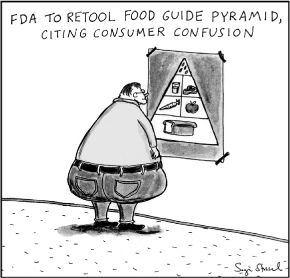

## CHAPTER 3

### RESPECT YOUR INSULIN:

### WHY MOST WEIGHT-LOSS PLANS FAIL

“Those with cardiovascular disease not identified with diabetes are simply undiagnosed.”

—Dr. Joseph R. Kraft

Let’s look at why most weight-loss plans fail. Importantly, we will also keep an eye on their long-term health implications. A diet for longevity and vitality is not all about weight loss. There are countless “normal weight” individuals who desperately need a corrected diet to avoid premature death. Perhaps not surprisingly, the ideal dietary regime for weight loss is the same one that will optimize health and longevity.

Any weight-loss diet must have two crucial elements. First, it must improve your body’s existing appetite and weight control system. That is essentially why most orthodox dietary regimens fail: they ask you to restrict calories by eating less, tell you to burn away the calories you do eat by moving more, and often deprive you of fatty, protein-rich, and nutrient-dense foods—which would help return your appetite to a healthy level.

The other fundamental key to a successful diet is the ability to use fat as your body’s preferred fuel. If a dietary regimen does not improve your ability to burn body fat efficiently, it will fail. The key is to switch from being a carbohydrate-burner to being a fat-burner. You will not achieve this transformation with a high-carbohydrate, low-fat diet—not even if the carbohydrates are so-called complex ones. As we’ll explain later in this chapter, it simply doesn’t work that way.

Let’s start by looking at the two most common ways people are told to lose weight—follow a low-fat diet and “eat less, move more”—and why they don’t work.

### FOOL ME ONCE, SHAME ON YOU

Let’s start with the first nutritional myth that’s caused so many problems: that a low-fat diet is healthy and good for weight loss. When a low-fat diet was first proposed in the 1950s, it was under the misguided belief that it would reduce heart attacks. Since the 1970s, following a low-fat diet has also been the primary advice for weight loss and good health. Yet, as we talked about in the previous chapter, this advice is not based on sound evidence, and it’s had very serious consequences. Low-fat ideology has contributed significantly to our current epidemics of obesity, diabetes, heart disease, and more. In a twist of irony, the low-fat diet was proposed as a solution to the obesity epidemic it helped create in the first place.

Here’s how the story that a low-fat diet would help us lose weight was sold:

-  Fat has 9 calories per gram, whereas carbohydrate has 4 calories per gram. Therefore, eating less fat and more carbohydrate will lower your caloric intake.

-  Fat causes heart disease, and heart disease is linked to obesity, so fat probably causes obesity, too.

-  Also, it’s *called* “fat”—get it? So it stands to reason that it probably makes you fat.

We could go on, but the logic wouldn’t get any better. So what was ignored in this overly simplistic thinking? The science of human metabolism, for starters. Body weight is controlled by an exquisite hormonal signaling system that includes everything from the food sensors in your gut to signals in your brain and other organs. The number of calories in fat is not relevant unless you are eating too much carbohydrate with it (for reasons we’ll cover later)—a healthy human body will smoothly compensate for an increase in the number of calories consumed by increasing satiety signals. In other words, because fat has more calories per gram than carbohydrate, it also makes you feel full faster, so you end up eating less of it. The fact that it has more calories is the least relevant point.

There are many benefits to eating a higher-fat, lower-carbohydrate diet. It has overwhelmingly been shown to be better for weight loss than a lower-fat diet. This is not based on theory; it is based on direct experimental evidence from over fifty trials.^1^ The reasons are many, but one important reason involves the master signaling hormone, insulin: unlike carbohydrate, dietary fat does not trigger a significant release of insulin, and controlling your insulin is the single best way to control your body weight—as we’ll discuss later in this chapter. It is also the best way to achieve great health and longevity.

Even a slender person carries the vast majority of his or her energy stores in the form of body fat. It can keep you alive for many weeks or even months with no food. It is the master fuel our species evolved on. In contrast, our body’s carbohydrate stores run out after a day or so.

We evolved to burn fat as a favored fuel. Carbohydrate is a flash fuel that must be constantly topped up. When almost no carbohydrate is available, however, we can get along just fine—we can smoothly burn dietary or body fat. For most of human existence, this was the evolutionary norm. The idea that natural fat sources could be toxic to humans was a false and contrived notion with no basis in evolutionary or physiological science. Avoiding fat in favor of carbohydrate will undermine your weight-loss efforts.

Fat is nutrient-dense in natural food sources. *But man-made fats and vegetable oils are not nutrient-dense.* Fat promotes satiety and minimizes inflammatory factors—if eaten in natural, whole foods that humans evolved eating.

### FOOL ME TWICE, SHAME ON ME

The second primary concept for weight loss in the past couple of decades has been the “move more and eat less” dogma. It sounds plausible and feels sensible, just like the “lower your fat intake” paradigm. And yet it also ignores the realities of human metabolism.

Let’s examine the proposition piece by piece.

- Move more. Exercise has many health benefits, but weight control is not one of them.^2^ Yes, if you move more you will burn more calories—great. But you will also increase your appetite. There is no escaping this fact. Even after long months of painfully rigorous training, many people who take up running to lose weight are still fat—because they are now ravenous. Back in the sixties, runners were not fat. Even most of the paper-pushers who spent their time behind a desk were not fat. The “move more” mantra only helps reduce weight in the long term *if you also chronically starve yourself.* Which, of course, is unsustainable.

- Eat less. Mild starvation and self-denial has its benefits, but *sustainable* slimness is not one of them. Yes, if you eat little enough, you will lose weight—try eating nothing for a week to prove this obvious fact. But you will also unleash hunger, which in itself is a core driver of our obesity epidemic. Back in the sixties, hunger was not such a terrible threat. The kinds of foods we were eating did not drive hunger to problematic levels—they did not cut the wires on our hunger control system. The kinds of foods we’re eating now do.

The “eat less, move more” theory assumes that humans are like simple steam engines rather than complex, hormone-controlled machines. In simple steam engines, the “energy in” matches the “work out”—it is a relatively straightforward calculation. In contrast, human machines are vastly more complicated, with myriad control-feedback loops that change everything. “Eat less, move more” ignores these most important body mechanisms—the crucial feedback loops of hormones that control appetite and weight loss and gain—and the pivotal effects of the *type* of food we eat. That is why the vast majority of calorie-counting diets fail over the long term.^3^ They implement the unsustainable and entirely bypass the most important factors in the problem.

The same type of flawed and simplistic thinking led to the recommendations that placed “complex carbohydrates” like breads and pasta at the base of the food pyramid. Ignoring the hormonal systems has led to serious unintended consequences, from obesity to diabetes and more.

By Sage Stossel for TheAtlantic.com.

### BEATING THE SPRING

So what is it about the body’s feedback loops that’s so important to weight loss and good health? It all comes down to hormones. Hormones are powerful signaling molecules that control many functions in the body. Many, many hormonal control loops govern appetite and body weight. Over the long run, the powerful effects of these hormones will beat willpower every time.

Imagine that you are stretching out a strong spring that’s attached to a wall. You can hold it for quite a while, perhaps, but eventually your arm grows tired and the spring wins. Understanding this fact, you lock the spring with a hook or fastener, so it will stay put without your constant focus and effort.

In this analogy, the spring is your hormonal weight-control apparatus, which is ancient and remorseless. Your arm is your willpower. It may be robust when you start, but eventually it weakens. Maybe a difficult time in your life will undermine your willpower. Maybe time alone will weaken it. Regardless, slippage is almost inevitable. Willpower eventually fails. We will teach you how to beat the spring by restraining it with clever “hooks” that you can create in your body.

First, it is crucial to understand that *food is information*. What you put in your mouth sets off an explosive cascade of hormonal signaling throughout your body. The most trivial aspect of food is its calories. It is the* type* of food that is crucial to long-term weight-management success—as is the mixture of foods that make up your meals. What you eat determines how your body produces hormones that affect weight and health.

Many hormones work together and respond dramatically to the types of food you eat. Here’s a short list of some major ones:

-  Insulin (master regulator of glucose and fat-burning)

-  Glucagon (controller of glucose release into your system, the yin to insulin’s yang)

-  Leptin (released by your fat cells to regulate appetite and more)

-  Ghrelin (the hunger hormone, released by your empty stomach)

-  GIP (stimulated by carbohydrate, released by your gut to trigger insulin and prime fat cells for energy take-up)

-  GLP-1 (released in your gut to enhance the function of the pancreas, which makes insulin)

-  PYY (released in your gut to control appetite and enhance pancreatic function)

### AN INTRODUCTION TO INSULIN

Of all the hormones involved in weight control, insulin is the one to watch the most closely. Engineers live by the Pareto Principle, which says that 80 percent of a given problem is generally caused by 20 percent of the factors driving it. We need to focus on the *big* factors to be successful. Insulin signaling is one of those factors that can cause 80 percent of weight-control problems.

Insulin:

-  rises rapidly based largely on signals emitted from your gut when you eat

-  runs high in most people who are obese or have type 2 diabetes

-  runs low in slim and healthy people (it may be high in slim people who are unhealthy)

-  can be manipulated masterfully by the food choices you make

-  is provoked most strongly by high carbohydrate intake—particularly refined carbohydrates

-  is provoked to a lesser extent by protein intake

-  is minimally provoked by fat intake

-  can be badly disrupted by many nondietary factors, including poor sleep, stress, gut microbiome issues, smoking, and limited exposure to sunlight

Insulin is the master manager of glucose in the body: it moves glucose from the bloodstream into cells, which use glucose for energy. It also directly controls glucagon, which has an enormous effect on glucose production and release. Carbohydrate is essentially just glucose—a sugar molecule, or a bunch of them joined together. When you eat carbohydrate, your blood glucose levels rise, and insulin levels rise correspondingly. Insulin also tells the body not to burn fat—since more insulin means more glucose is available to use immediately as fuel. Insulin therefore dictates your ability to use fat as a fuel.

The most important goal you can have for weight loss or longevity is to *keep your insulin levels low.* This can be easy to do—when you eat the correct type of low-carb diet. Keeping insulin at low levels will enable this crucial hormone to perform its signaling functions optimally. Any dietary advice that doesn’t account for insulin’s effects will be deeply flawed.

Insulin in various molecular forms has existed for nearly a billion years. It has been doing its pivotal job in our bodies since the dawn of humanity. It manages the body’s response to food, promotes fat storage, and prevents fat from being burned for energy when carbohydrate has been consumed. It is the last thing you want to provoke inappropriately.

For weight loss and longevity, you must respect your insulin!

### WHAT YOU EAT MATTERS

All proper biochemistry textbooks acknowledge these fundamental properties of insulin. In spite of this fact, many of these textbooks still recommend a high-carbohydrate, low-fat diet for health and weight loss. This absurd contradiction is made possible by the fat-phobic lunacy that took over in the late 1970s and 1980s, as discussed in Chapter 1.

The supreme irony is that excessive glucose and excessive insulin can actually cause problems with the dietary fat you ingest. Many of the associations between fat and disease were created through this mechanism.

Remember that insulin prevents fat-burning. When insulin is driven higher by ingested carbohydrate, you cannot optimally burn any fat that you eat along with it. Insulin shuts down your fat-burning machinery. And with that machinery shut down, your body can’t easily turn to stored fat for fuel when it’s used up available glucose, resulting in more feelings of hunger. The spring will continue to exert its tireless pull.

What is the *worst* thing you can eat to provoke problematic amounts of insulin? A mixture of refined carbohydrate—for example, bread—and fatty foods: for example, a grass-fed meaty hamburger. Actually, it’s never okay to eat bread. The hamburger could be okay if eaten on its own. In fact, bread can *cause* the hamburger to become problematic. There is a synergy between macronutrients. The mixture matters.

The higher-carb, lower-fat regimen has another major problem. Carbohydrate-rich foods raise blood sugar levels. Insulin must be promptly raised to manage this blood sugar. Particularly in people who need to lose weight, the insulin response can overshoot the mark. This will drive blood sugar levels down in the hour or two following a meal. The natural response to this blood sugar drop is the triggering of hunger signals. Carbohydrate-rich foods are also poorly satiating to begin with—they don’t fill you up and keep you feeling full. The overall effect is that you feel hungry again soon after a meal. The spring is difficult to ignore—it will whisper in your ear, “You really need and deserve a snack.”

### RESISTANCE IS FUTILE

It is tragic that the people who really need to lose weight are generally the very people who have the greatest insulin-related problems, making it harder for them to lose weight. Overweight and unhealthy people normally have higher insulin levels, a condition known as hyperinsulinemia. Unfortunately, they also respond less well to insulin’s orders, even though they have higher insulin levels—just as with any powerful drug, you can become resistant to the effects of insulin over time. This phenomenon is called insulin resistance. In fact, the majority of adult Americans now have an insulin resistance problem.^4^ And a shocking proportion of our children have it, too.^5^ A high level of insulin in the bloodstream with associated insulin resistance is the signature dysfunction of our modern age.

Anyone who needs to lose weight is highly likely to have some degree of insulin resistance. In contrast, slim, healthy people normally have low levels of insulin—they are insulin sensitive.

Most weight problems are underpinned by excessive insulin secretion. Moreover, type 2 diabetes is a manifestation of long-term insulin resistance. In type 2 diabetes, insulin resistance has progressed to the point that the body has lost control of blood glucose levels. Most heart disease is driven by diabetic vascular inflammation: high insulin and glucose levels damage the walls of your arteries, which leads to the buildup of materials in the artery walls. This process is called atherosclerosis, and it is the primary driver of heart attacks. Therefore, most heart disease is the result of being in a state of hyperinsulinemia and insulin resistance. Interestingly, even recent mathematical models based on very large data sets illustrate this point.^6^ Many cancers are also tightly linked to hyperinsulinemia and its linked effects.^7^ Shockingly, most primary care doctors don’t measure insulin levels during a regular checkup.

Many population studies clearly show that insulin levels have been rising for decades, as of course you would expect given the diabetes epidemic.^8^ In line with this rise, the decline in atherosclerosis rates since 1977, which was driven mainly by a reduction in smoking habits, stalled in 1994. Atherosclerosis rates then began to tilt upward again, in spite of continued smoking reduction.^9^ One recent report predicts that the menace of diabetes-induced heart disease will sink our collective health.^10^

The first step in any health and weight-loss strategy should be to lower insulin levels. Whatever achieves this goal will tend to resolve insulin resistance and improve weight loss. This may not be a magic fix for everybody with weight issues, but it is the clear first step. Ignoring this step is one of the primary reasons why most diets fail.

### BECOMING SENSITIVE

There will be more on the science of insulin and its important effects in later chapters. In the meantime, let’s look at the bottom line.

Nearly everyone can achieve healthy low insulin levels and become insulin sensitive. A low-carbohydrate diet is the place to start, but some people may need to take more substantial measures (as we’ll discuss in Chapter 6).

THE PLAN FOR LOWERING INSULIN

How do you go about lowering your insulin? The core strategy, based on science, is to lower the carbohydrate levels in your diet. The secondary consideration is to moderate your protein intake to appropriate levels, based on your muscle mass and exercise level, since excessive protein can also raise insulin levels. Finally, the bulk of your energy needs should be supplied by healthy, nutrientdense fats. There are also many nondietary factors involved, such as getting enough sleep, exercising, and managing stress. All this forms the core of the Eat Rich, Live Long program, and we’ll talk about it in more detail in Chapter 6.

People with insulin resistance can’t burn fat effectively. Who are the people with the biggest insulin issues? See if you can pick out the group which you are in:

- 
Slim, insulin sensitive: Low blood insulin, super fat-burner, high life expectancy

- 
Overweight, insulin sensitive: Low blood insulin, moderate fat-burner, good life expectancy

- 
Slim, insulin resistant: High blood insulin, poor fat-burner, poor life expectancy

- 
Overweight, insulin resistant: High blood insulin, very poor fat-burner, very poor life expectancy

- 
Type 2 diabetes (regardless of weight): High blood insulin, dreadful fat-burner, dreadful life expectancy

Did you find your group? It’s tricky if you have never measured your insulin. Did you notice that body weight is a weak indicator for judging your health outlook? What really matters is your insulin and blood glucose status. That’s why many health authorities have been confused by the results of studies looking at body mass index and life expectancy. The trends and outcomes from these studies are all over the place, *because they’re measuring the wrong thing.* Body mass index isn’t the crucial factor; insulin is.

Before you embark on our plan to lower your insulin, it is important to know where you are starting from. This is not difficult to find out. The simplest way is to calculate what’s called your HOMA value, which indicates your level of insulin resistance, using one of the many online calculators. (There’s a good one at www.thebloodcode.com/homa-ir-calculator.) All you need for this is the measure of your fasting glucose and fasting insulin. These tests can be requested in any doctor’s office. With those numbers in hand, you can plug your fasting glucose and insulin values into the calculator and get the result. If it is below 1.0, you have low insulin resistance. Between 1.0 and 1.5 is marginal and may require some corrective action. Approaching 2.0 and certainly above 2.0 indicates significant levels of insulin resistance. These must be tackled using our plan.

People with type 2 diabetes have major problems burning fat as a fuel—they have high blood glucose and high blood fat levels simultaneously. Over half of the US adult population is now classified as prediabetic or diabetic. Anyone caught in these categories has serious problems burning fat. That means the majority of American adults have a fat-burning problem, which is an absolute disaster for the health of our citizens.

If these folks have problems burning fat, does this mean they should eat less fat? No—that is not how it works. Insulin resistance (and the trouble with fat-burning it brings) starts with eating too much carbohydrate relative to dietary fat. Remember the worst mix a human can eat: lots of carb with plenty of fat.

MARY’S STORY

At sixty-eight years old, Mary believed she was healthy and hardly needed a checkup. Sure, she had been overweight for twenty-five years, which was frustrating. But compared to her three siblings, who were all suffering from full-blown type 2 diabetes, she seemed healthy. She had always been careful with her diet and had exercised regularly for the past forty years. But “careful” had meant following the standard advice to eat a low-fat diet filled with whole grains and vegetables. And because no diet she’d tried had worked, she no longer believed in them and had thrown away her scale years ago.

Jeff’s exam showed a serious level of prediabetes, so he prescribed a tailored low-carb diet of 70 percent of calories from fat, 20 percent from protein, and 10 percent from carb. It sounded strange to Mary, but she was willing to try it in order to avoid medications. She asked Jeff, “How do I eat that much fat when I’ve been trying to eliminate fat for forty years?” His advice: eat an avocado every day; eat more nuts, especially macadamias; and consume healthy fats, including coconut oil, olive oil, and butter. Later, she learned about adding more delicious fats and the wonderful health benefits of eliminating grains.

Within a few weeks, all Mary’s friends were commenting on her transformation. Her clothes were becoming loose and her skin was glowing. After nine months of the new healthy-fat lifestyle, she had lost 40 pounds, her blood pressure was back to normal, and she had great cholesterol numbers. What’s more, she no longer had arthritis pain, frequent urination, or low energy.

On a recent visit with Jeff, she asked, “How long should I be on this diet?” Jeff answered, “For the rest of your life.” Mary was delighted. She is really enjoying her new lifestyle, which has freed her from obesity and serious health concerns and has given her renewed energy and vigor.

For weight loss and longevity—by way of lower insulin status and insulin sensitivity—it is important to burn fat as your primary fuel, and that means significantly reducing the amount of carb you eat. Eating this way will also enable huge improvements in appetite control, since fat is so satiating. You may even find that the increase in fat calories doesn’t need to fully match the calories from carb lost from your diet. Pleasingly, your body fat can now become part of your fat-based fuel supply. This will particularly be the case after you have become “fat-adapted”: after your body optimizes its fat-burning machinery and switches to preferring fat to glucose. This fat adaptation occurs in the first weeks of our plan and will be described in Part 2. When your body starts to rely primarily on fat for fuel instead of glucose, you’ll be able to tap into your body fat stores in addition to dietary fat.

### SAFE STORAGE IS EVERYTHING

Every time we eat, energy is stored in multiple different compartments in our bodies. That energy is then released steadily to fuel our activity when we are not eating. Think of your personal energy storage as a rechargeable battery in an electric car. When you eat, your batteries get charged up. Between meals, the batteries provide a steady release of energy to keep you alive. Let’s briefly look at how carbohydrate and fat play into this process:

- 1. The glucose from food you eat is used for your body’s immediate needs, and whatever remains is first stored in the *glycogen* battery. This glycogen reserve can hold around 2,000 calories’ worth of glucose. These are short-term batteries—in the absence of food, they run out within a day or so. When glycogen is full, you will not be in a good state for the healthy burning of fat. *The healthiest state is one in which glycogen remains incompletely full.*

- 2. When the glycogen battery becomes full, excess glucose is converted into special fats that are released from the liver into the bloodstream. This process can drive up your “bad cholesterol” (LDL) and promote many other problems in the body. It is a very different phenomenon from the healthy processing of dietary fat. *The healthiest state is one in which glucose is not converted into these fats.*

- 3. The final storage depot is your body fat, or *adipose tissue.* The storage capacity here is huge, but most overweight people don’t tap into it. *The healthiest state is one in which this battery is used almost exclusively.* To achieve this, you must stop drawing on glycogen (#1) and creating the special fats in your liver (#2).

Healthy dietary fats are the safest fuel in a well-formulated low-carb diet. They directly enable you to minimize your intake of glucose, and so achieve the optimization of 1 to 3 above.

In doing so, you can help keep your adipose tissue in good health and insulin sensitive.^11^ When the cells of your adipose storage remain insulin-sensitive, they protect the rest of your body from metabolic dysregulation. In contrast, following a poor diet will allow your adipose tissue to become insulin resistant. When this happens, it is often the first step in the process that leads to your whole body becoming insulin resistant. In this way, much of modern chronic disease originates with unhealthy fat cells. (If you’re interested in learning more about the importance of healthy fat cells, it’s explored in more detail in Appendix D.)

For the majority of people, the worst diet to drive problems in adipose tissue is a high-carbohydrate diet—especially when it includes substantial dietary fat, and particularly if refined sugar and/or processed vegetable oils are added to the mix.

The best diet to achieve desirable insulin sensitivity is essentially the opposite of the silliness we’ve been sold. The best diet is low in carb and has good quantities of satiety-inducing healthy fats and protein. With the ratios right, your insulin is optimized. Much of the rest will follow. Obesity and chronic disease can be prevented and even largely reversed.

### ARE YOU A SUGAR-BURNER OR A FAT-BURNER?

Your body’s cells do not burn both glucose and fat at the same time. In fact, the core fat-burning mechanisms are intentionally shut down when glucose enters your system. Mammals always prioritize burning glucose when it is present—which makes sense, because glucose is toxic to cells when it is at elevated levels. Note that we only carry about 1.5 teaspoons of glucose in our entire blood supply. If it rises much beyond that, it will damage the body’s organ systems. Fat, on the other hand, is easy for the body to store and reuse. But fat is not easy to tap into if carb is the main part of your meals.

The standard American diet relies primarily on carb—in fact, the government has told us for decades to make “healthy whole grains” the bulk of our calories. And most Americans are sugar-burners. What are the major implications of this higher-carb dietary strategy?

- 1. You experience blood sugar and insulin spikes.

-  This downregulates the fat-burning machinery.

-  For many, this can promote a speedier onset of post-meal hunger pangs.

-  Over time, insulin spikes can lead to insulin resistance.

-  With increasing insulin levels, the negative aspects of the diet become magnified.

- 2. You miss out on the benefits of nutrient-dense foods high in healthy fat and protein.

-  For many, hunger pangs start sooner after meals that lack fat and protein.

-  This promotes larger, hunger-driven meals and snacking behavior.

-  A relative deficiency in fat-soluble nutrients can promote appetite to compensate for their lack.

Let’s contrast the above with a diet that focuses on healthy fats and keeps carb intake low. The implications of this diet are as follows:

- 1. You will minimize blood sugar and insulin spikes.

-  This upregulates your fat-burning machinery and reduces your dependency on sugar.

-  It enhances smooth burning of body fat between meals, suppressing appetite and enabling you to skip meals without undue hunger.

-  Over time, your insulin resistance levels will fall steadily, and with them your risk of chronic disease.

- 2. You will gain access to a whole range of nutrient-dense foods, which will enhance your health and vitality.

The above is only a brief summary of the advantages that come with a high-healthy-fat diet. We will be exploring them in more detail throughout the rest of the book.

In short, a higher-carb diet promotes a sugar-burning physiology, which directly impedes your fat-burning ability. This is the very last thing that you want, for either weight loss *or* longevity. But the worst thing about being a sugar-burner over the long term is that it drives up your risk of acquiring the most prevalent disease in our world today, which in turn underpins the risk for most diseases of modernity—heart disease, diabetes, Alzheimer’s, and many cancers. We call this disease state metabolic insulin resistance syndrome (MIRS)—and the last thing you want to be on is the MIRS diet.
