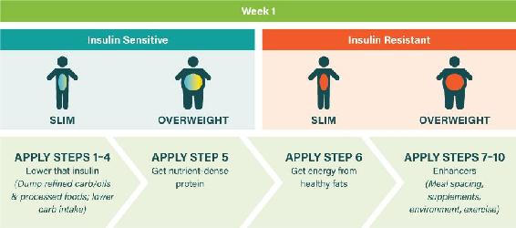
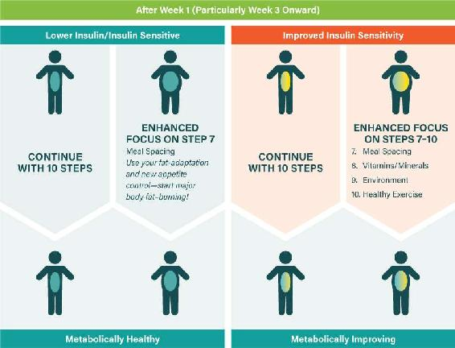

## CHAPTER 8

### THE EAT RICH, LIVE LONG PLAN:

### DAYS 8 THROUGH 21

We are what we repeatedly do. Excellence, then, is not an act but a habit.

—Will Durant

The next two weeks on the Eat Rich, Live Long program will establish your new, healthier habits. While in the first week you focused primarily on getting the food right, now it’s time to add some more strategies to achieve optimal results over the longer term. Most notably, this means focusing on steps 7 through 10. As a reminder, these are: widely spacing meals, getting enough vitamins and minerals, managing environment factors, and exercising. As with the first week, some focus and dedication are required to do all this properly, but rest assured, covering all the steps is the recipe for success.

But first, let’s check in on how the first seven days went.

### FIRST AND FOREMOST: CHECK IN ON YOUR FIRST SEVEN DAYS!

At the end of the week, you should be feeling much better than you did before. Your belt should be looser, your mind should be clearer, and your mood should be more stable. You should be facing the next fourteen days with determination and gusto.

But what do you do if you are also experiencing some challenges?

We then need to check in on potential pitfalls. First, make sure that you are following the action steps on here to here correctly. If you’re not, then address any gaps. Finally, you may need to adjust your plan according to your specific needs.

Here is a list of potential roadblocks and their remedies. (We’ll talk about some other challenges that can happen over time in Chapter 16.)

- 
“Low-carb flu.” When you’re crossing the bridge to fat-burning, you may experience some symptoms as your body makes the transition away from sugar-burning. These symptoms can include headache, lethargy, nausea, confusion, brain fog, and general irritability. Usually these can be traced back to dehydration or sodium deficiency. Review the supplements section for the first week again (here). Boost your intake of salt and make sure you’re drinking plenty of water. Chicken or beef bone broth—or even a bouillon cube that contains salt dissolved in water—can be a huge help. As an emergency measure, you can add a small amount of healthy carbs back into your diet—for example, add some sweet potato with one of your meals. We do not recommend this, however, as it may only delay the switch to fat-burning.

- 
Muscle twitches and aches. If you’re experiencing muscle cramps, restless legs, achiness, and the like, it may be related to a nutrient deficiency. Boost your intake of salt and make sure you’re drinking plenty of water—these are the most likely culprits in the first week. Muscle symptoms may also be a sign that you’re low in magnesium, however. Take a good supplement (see here) and do not go low on this miraculous element.

- 
Constipation. Although most people experience improvements in this department, constipation can occur. Yet again, dehydration may be the culprit. You may also need to tweak up the vegetable intake, while being careful to avoid those problematic grains. Magnesium citrate can also come to the rescue. It is an extraordinary bowel-mover, to the point that many people have to be careful with it. Taking the maximum daily dose of 1,000 milligrams will make constipation impossible to maintain!

- 
Heart palpitations, blood pressure fluctuations, and other cardiovascular concerns. The solution to these issues is similar to the other ones—drink plenty of water and eat plenty of salt. But it is important to check with your doctor in advance before making any significant lifestyle changes. You need to be sure you are aware of any underlying heart issues, and if you do have a heart concern, talk to your doctor about this diet before making the switch and again if you experience any heart-related symptoms on the diet. You need to also be careful if you are currently on medication for diabetes or high blood pressure. The sudden switch to a genuinely healthy diet may mean that the conditions these medications are meant to treat are no longer there, as blood pressure and blood glucose drop naturally. If you’re taking medications designed to have these effects, they may result in particularly low blood glucose or blood pressure. You can discuss this with your physician as necessary, although it would be ideal if he/she is well-informed on the low-carb science.

- 
Hair loss. Mild hair loss can occur during any significant diet change, and so it is with switching to a low-carb regimen. The phenomenon is a temporary one. During the first few months following the switch you may notice more hairs coming away when you brush. After a few more months new hair follicles will replace the old, and the experience will fade. Essentially, the sudden switch causes a global replacement of the hair. Usually this replacement process is occurring randomly across your scalp and is not so noticeable.

### PERSONALIZING YOUR PLAN

Back in Chapter 3, we identified four main kinds of people based on insulin status and body weight. Each type of person will benefit from tailored advice for the next fourteen days. On the next page is an overview diagram to illustrate the primary types and where they should focus.

#### THE INSULIN-RESISTANT OVERWEIGHT PERSON

This is the most common type among American adults nowadays. Let’s take a look at where you are now, after your first week on a low-carb, high-fat diet.

During the first week, there was a prompt fall in your insulin and glucose levels. This alone has begun to dismantle the insulin/glucose roller coaster in which you were trapped. Our recommended very low net carb intake (less than 40 grams per day) accelerates this crucial process. Likewise, your body’s stores of glycogen (glucose) finally have begun to deplete. Glycogen carries a lot of water, so you’ll have experienced weight loss due to this factor alone as your body drops water weight. But toward the end of the week, you’ll also have seen the beginnings of body fat loss. You’re starting to feel that belt loosening.

Personalizing Your Plan

The fall in insulin is also opening the door to your new fat-burning physiology. You are getting most of your energy from healthy fats now. Your body is beginning to switch over its machinery to burn this fat more efficiently.

Your insulin and glucose levels have begun to drop, particularly your post-meal levels. Likewise, the most important cholesterol numbers have started to improve—the ratios of triglycerides to HDL cholesterol and total cholesterol to HDL (we’ll talk about these much more in Chapter 11). If you have been tracking your blood pressure, you should see those numbers beginning to drop also. All these and more indicators of health status are improving. Your body has started to repair itself. It is becoming ready for a much healthier future.

All this is great news, but people with very high insulin and associated insulin resistance may experience a double-edged sword in the first week. On the one hand, they tend to have the most extreme improvements in health status. But they may also have more challenges. This is where continued focus on all ten of our steps is very important. Resolving profound insulin issues requires more than simply restricting carb intake–protein and healthy fat intake matter, too, along with meal spacing, environmental factors, and exercise. The action steps must all be tackled to eradicate this near-universal driver of poor health and obesity.

If you’re insulin resistant and overweight, here’s what you should be focusing on over the next fourteen days:

-  Address any challenges that you may have experienced in the first week.

-  Continue following the prescription for meals and supplements from days 1 through 7, but go beyond the diet. Start really working all ten action steps.

-  If things are going well and you are comfortable, begin to focus particularly on action step 7, meal spacing / fasting.

Remember that following the other action steps will enable you to apply step 7 effectively. You cannot apply meal spacing effectively when enslaved in the high-carb hunger trap. You must break the cycle and develop some degree of fat-burning capability in order to practice healthy fasting habits. These habits in turn will enhance your fat-burning metabolism. They will actually end up enabling themselves.

After some level of fat-adaptation is achieved, you can deploy meal spacing as a powerful intervention. Make this a primary goal over the coming fourteen days!

#### THE INSULIN-RESISTANT NORMAL-WEIGHT PERSON

This kind of person is often called “thin outside, fat inside” (TOFI). It is a common category—these people experience a huge number of surprise heart attacks. They share most of the health risks associated with the insulin-resistant overweight, but they seem relatively healthy—until one day a heart attack comes out of the blue. They may not need to lose much weight, but for longevity and genuine good health, they need a low-carb, high-fat diet just as much as overweight folks.

If you are insulin resistant but not overweight, your experience after the first seven days is probably similar to that of the insulin-resistant overweight type, though you’ve probably lost less weight. Most importantly, a similar fall in your insulin and glucose levels has taken place. Our recommended very low net carb intake (less than 40 grams per day) has kick-started your exit from insulin dysregulation. Your body’s stores of glycogen have finally begun to deplete. The body fat loss will be coming particularly from the fat in your belly region. An insulin-resistant person will likely have significant visceral adipose tissue—fat in and around their internal organs. This is the fat you really need to tackle, as it can affect overall health. You should be beginning to feel some belt-loosening effects as this occurs.

The fall in insulin levels is promoting your fat-burning physiology, which is crucial for your longevity. It will also inoculate you against significant weight gain as you age.

Your insulin and glucose levels have begun to drop, particularly your post-meal levels. Likewise, the most important cholesterol numbers have started to improve. Many TOFI people have “unexplained” high blood pressure, mostly driven by high levels of insulin and insulin resistance. So your blood pressure should have begun to drop naturally, too. All these and more indicators of your health status will improve. Your body has started to repair itself. It is getting ready for a much healthier future.

Continued focus on all ten of action steps is still important. That said, if you’re insulin-resistant but not overweight, you’ll have experienced a rapid improvement in well-being by the end of the first week.

Here’s what your primary focus should be on over the next fourteen days:

-  Be sure to address any challenges you may have experienced (see here).

-  Continue following the prescription for meals and supplements from days 1 through 7, but go beyond the diet. Start really pushing all ten of those action steps.

-  While weight loss may not be needed, step 7 should be a focus to help you further accelerate the switch to a fat-burning physiology.

-  Action steps 8 through 10 will really help accelerate progress to true insulin sensitivity and the ultimate goal: habitually low insulin levels.

#### THE INSULIN-SENSITIVE OVERWEIGHT PERSON

The path forward for people in this category can be a little tricky. If you are one of these people, you may not have experienced a dramatic weight transformation in the first week. You certainly should have noticed significant changes, but perhaps less so than the insulin-resistant folks.

Our recommendation to you was a low to moderate net carb intake (40 to 80 grams per day, with a maximum of 120 grams). During the first week, you likely saw a moderate drop in your insulin and glucose levels. The extent of the change will of course depend on how healthy or low-carb your previous diet was. Let’s look at the most likely outcome from the first week in more detail.

Your body’s stores of glycogen have begun to deplete. Toward the end of the week, there was also body fat loss. Your belt should be easing somewhat from its previous tightness.

During the first week, you too started crossing the bridge to fat-burning—just like your insulin-resistant colleagues. With most of your energy now coming from healthy fats, you will be much better prepared for the actions required during the next fourteen days. Your key focus in the next fourteen days will be to leverage your growing ability to burn your own body fat. You are keeping the carbs down—this is good. But dietary fat is providing the energy you need to simply stay where you are in terms of body weight.

Your body is now carrying reserves of what is essentially healthy fat. Your fat cells are not insulin resistant and are functioning very well—which will support your overall health. Metabolically, you are in reasonably good shape, but there is no internal driver to burn stored body fat. Therefore, you must intentionally create a driver to achieve this. You are one of the few types of people who should keep an eye on caloric intake. Our guideline would be to aim for less than 1,800 calories per day, which will help you burn your body fat for fuel. This is, of course, a rough estimate for an average adult—and your primary focus should always be on following the ten action steps.

In terms of blood tests, your insulin and glucose numbers should have been reasonable before starting the first week. That said, your post-meal levels might not have looked quite so good but are now improving. While your ratio of triglycerides to HDL cholesterol was likely okay, your post-meal triglyceride levels were likely higher than optimal. These metrics should now have improved. Although it’s less likely that blood pressure is a problem for you, it should have dropped a little by the end of the week.

So things are improving, and indeed weight loss may be progressing satisfactorily. But for the insulin-sensitive person, it may not progress as rapidly as desired. So let’s focus now on what you need to do for it. Here’s what your primary focus should be on over the next fourteen days.

-  Continue following the prescription for meals and supplements from days 1 through 7, but go beyond the diet. Start really pushing all ten of those action steps.

-  For insulin-sensitive weight loss in particular, you must focus heavily on action step 7 (meal spacing / fasting). This will become increasingly easier as your fat-burning and appetite-control mechanisms become established.

-  Keep an eye on calorie intake. As mentioned, we recommend staying below 1,800 calories per day as you apply the action steps to lose weight. Depending on your ability and comfort with meal skipping, you may go much lower than this. Check out Simon’s story on here to see how it’s done.

-  Remember that applying the other action steps correctly will enable you to develop effective fasting habits. You must develop some degree of fat-burning capability first. Otherwise, it will be difficult to practice healthy fasting habits. This is not simply about calorie restriction, either. Meal skipping is about cycling fasting periods on a regular basis and depends on your ability to smoothly burn your own body fat for energy. This strategy of cyclical fasting will in turn enhance your fat-burning capabilities. This is the virtuous cycle that an insulin-sensitive person really needs to foster.

#### THE INSULIN-SENSITIVE NORMAL-WEIGHT PERSON

Okay, you’re the lucky type who was already in good shape before adopting the Eat Rich, Live Long plan. That said, you may not remain in such good shape as you age. By following our prescription, you can continue to hold on to your health in the coming decades. You can also prevent the middle-aged spread that has become near inevitable.

Although you do not have much weight to lose, after the first week of the plan your belt should be beginning to ease. Your blood glucose and insulin were already at good levels, but your insulin is starting to drop even more. Your triglyceride/HDL ratio should have been pretty good, but now you’re tuning them to even better values. Your average glycogen levels are dropping, too, and you are on your way to optimal fat-burning. Keep focusing on the ten action steps to stay in great shape.

Let’s visit in more detail the action steps to start prioritizing in the coming weeks. Practicing these will indeed make perfect. They will become your tools for life. The first six steps will pretty much continue to be applied as before. In the next fourteen days, however, action steps 7 through 10 need some extra focus. You now have a growing muscle in the fat-burning department. Get ready to flex it.

### ACTION STEP 7: MEAL SPACING

It’s time to start putting your body fat to work. It won’t get off its butt all by itself—you need to encourage it, and going for longer periods without eating will get your body to burn some of that stored fat. Let’s look at some meal-spacing realities.

There are two primary states you can be in: fed or fasted. Here’s the bottom line on each.

The Fed State: This applies both while you are eating and for a period of several hours after eating. Insulin is elevated and body fat either is being added or, at best, is immobilized. When you are in the fed state, there is no net burning of body fat—quite the opposite, in fact. The best way to trap yourself in an overweight state is simply to ensure that you eat too often. Making your meals high-carb ones will seal the deal.

And eating too often while also attempting to reduce your calories is a fool’s game. Frequent eating will maintain the fed state and hamper your progression to a fat-burning mode, and eating many calorie-restricted meals with high carb content is not sustainable for most. Hunger will eventually cause you to fail.

The Fasted State: This state begins a few hours after a meal. Insulin is lowered and body fat is leveraged to fuel your body—you’re now beginning to achieve a net loss of body fat. (This only occurs, however, when the body’s stores of glycogen are depleted—that is why it’s beneficial that glycogen stores start to drop on a low-carb, high-fat diet.) That’s why the best way to shift stubborn weight is to ensure that long gaps between meals are the norm, so you stay in a fasted state longer. Make these well-spaced meals low-carb ones to seal the weight-loss deal.

Calories do matter at some level, especially for insulin-sensitive overweight people. But our approach is far more effective than general calorie restriction because it takes advantage of how the body and brain work—it does not rely on monotonous self-denial. That’s neither effective nor sustainable over the long term. Most calorie-restriction diets fail, but our science-based strategy will not; you won’t get hungry, and you’ll reduce your calories naturally, through eating the right foods.

It is important to take advantage of the fat-burning machinery you’ve started to create during your first seven days. We believe it is crucial to strike while the iron is hot. If you experienced significant challenges during your first week, then consider continuing to focus on steps 1 through 6 and holding off working on meal spacing for another week or so while you apply the solutions discussed at the start of this chapter. Otherwise, you’ll benefit from doubling down on your efforts now and following that magical step 7.

We and countless other meal-spacing followers have found that you can learn to really *enjoy* fasting. Crazy, perhaps? Not at all. It only seems crazy if you’ve swallowed the “eat regularly” brainwashing of the past forty years. When you understand the enormous health benefits of fasting, it becomes a pleasure to bypass breakfast. You also realize that you are performing a metabolic workout during fasted periods, making your body provide fuel. You are effectively advancing your health and fitness—without going near a gym.

There are marked increases in mental acuity during the fasted state also. When you experience these increases, you will become highly motivated to fast. For instance, we always prepare for challenging events—like stressful meetings, public speaking engagements, or difficult negotiations—by dropping meals in advance. Fasting creates a heightened sense of awareness and sharpened frame of mind. Therefore we make a point of not eating in the first part of the day before the event. We go in fasted and thus achieve peak performance. Of course, we gain this edge only because we are fat-adapted—our bodies have their fat-burning machinery in place so we can burn our own body fat smoothly, just as our ancestors could. It would not work so well for a sugar-burner, who would just slump after a few hours without a carb fix.

Fasting gives you an edge if you are a capable fat-burner. It is an edge that you will grow to desire and even depend on. And you will be honing your health as you use this advantage.

#### TIPS FOR WORKING ACTION STEP 7

The easiest way to start using this tool is simply to drop one meal on a couple of days each week. It is important to enjoy your two meals as normal, eating until you’re satisfied. In fact, you should relish them—the eating experience will now be enhanced.

To keep it simple, there are two primary approaches to meal spacing—either skip breakfast or skip lunch. We prefer to skip breakfast. We have, at most, a coffee with a couple of tablespoons of heavy cream instead.

This breakfast-skipping strategy works well for several reasons:

-  You have fasted right through the night and fat-burning is already underway. So you can keep it going quite easily for the win.

-  On a real-food regimen, there are often minimal feelings of hunger, especially in the mornings. Take advantage of this—don’t waste the edge it affords.

-  It eliminates the hassle of preparing food on a busy morning. This gives you back valuable time, to help you start your day with gusto.

-  You can look forward to “breaking the fast” around lunchtime with colleagues or friends. What’s more, you can really relish this meal when it comes. You can savor it as you should.

Sometimes we change things around by having breakfast and skipping lunch instead. This can be a good strategy for those who really feel that they need their breakfast in the morning. If you go this route, make sure you eat until you’re fully satiated at breakfast—an egg-based breakfast is ideal. The following are some more tips for success:

-  Make your breakfast substantial, with plenty of fat and protein. A perfect breakfast on a lunch-skipping day would be several eggs with fatty bacon, topped off with coffee with heavy cream.

-  Have access to a backup real-food snack (see here). Use this only if you really feel it’s necessary.

-  Plan a particularly delicious meal for the evening. Relish it as a reward for your meal-spacing achievement.

SIMON’S STORY

Simon began loosely following a low-carb diet in the year 2000, based on his extensive research. This enabled him to reduce his insulin resistance, become much healthier, and lose some weight in the process. But even after this health success, his weight continued to fluctuate. In 2014, he was quite overweight and hurt his back in an accident. He then experimented with a protein-sparing modified fast (PSMF) followed by a strict ketogenic regimen (see here). PSMF involves dropping dietary fat intake and simultaneously skipping meals. This enables your body to be fueled with fat that primarily comes from your body’s own stores. Although the diet does not have a high percentage of fat, the calories your body uses are still coming predominantly from fat.

The clever combination of PSMF and keto enabled Simon to lose 50 pounds in a year. His blood tests now showed that he had achieved insulin sensitivity. When his weight loss plateaued, he made some final tweaks to the winning PSMF/keto formula: he simply nudged up the protein, which enabled him to skip even more meals without hunger. He went on to lose *another* 50 pounds in the following three months. So after twenty years of experimentation, he had applied the magical formula of PSMF/keto to finally achieve an ideal weight.

He achieved this because the ketogenic regimen made him a fat-burner, not a sugar-burner, and skipping meals allowed him to burn body fat rather than dietary fat. Measured by calorie intake, his weight-loss diet was 30 percent carb, 25 percent fat, and 45 percent protein. The fat intake was lower to account for the significant amount of body fat he was now burning. It is crucial to remember that this plan works for him because (1) his prior low-carb, high-fat lifestyle had already tackled much of his insulin resistance, and (2) his ketogenic diet enabled him to burn body fat smoothly, without hunger.

You may think that this PSMF diet is not ketogenic, as the fat calories look low in percentage terms. But as Dr. Stephen Phinney explains, “With a weight-loss ketogenic diet, you eat less fat on your plate because you’re burning the fat that comes from your inside.” You may be consuming fewer calories from fat, but when you add in the body fat being burned, then you actually are getting most of your energy from fat. The real caloric percentages of Simon’s fuel actually look like this: 10 percent carb, 70 percent fat, and 20 percent protein. Simon was expertly maintaining a keto diet—but much of the fat content was coming from his ample body fat stores!

Simon’s insulin sensitivity enabled him to easily slip into ketosis. He could gain weight easily, but he could also lose weight easily given the right environment. He did it by applying step 7—eat no more than three meals a day, ideally two—in a most expert fashion.

### ACTION STEP 8: ENHANCE YOUR ENVIRONMENT TO PROPEL YOUR PERFORMANCE

With the first week under your (shrinking) belt, it is time to apply some helpful steps. Step 8 is so important for long-term success. We include three key factors in this step. Falling short in any of these can have very negative effects on your long-term success.

Sleep cycle and quality. Achieving quality sleep is very important. Ideally, you should be getting at least seven hours of quality sleep per night.

The science of sleep has exploded in the past ten years. Poor sleep drives up cortisol levels, disrupting your insulin signaling and glucose metabolism. It also messes with many other hormones involved in neurological signaling, promoting poor decision-making (including making food choices).^1^ Moreover, it increases the levels of the hunger hormone ghrelin and slows your metabolism. Countless people have undermined their weight-loss plans through poor sleep hygiene—don’t let it make your journey much harder!

Stress management. Chronic stress makes weight loss much harder to achieve and sustain. It also significantly undermines long-term health. A certain amount of stress is inevitable in the modern world, but how you deal with it is the variable that you can control. We like to use brisk exercise in the fresh air to control stress—a regular short run or vigorous hill-climbing type of activity is ideal. Other methods of managing stress include the practice of mindfulness and various forms of meditation. Find the stress-management practice that works best for you and make time for it in your life.

Sunlight exposure. It can be difficult to get adequate sunlight each day—working hours and many other commitments that keep us indoors conspire against us. But you will benefit hugely from accessing good natural light for at least thirty minutes in the morning after awakening—not through windows but out in the fresh air. We also recommend getting healthy sun exposure on your skin in the middle of the day when possible (without burning, of course—know your limits).

The many benefits of healthy sun exposure include weight control, vitamin D, and much more. We have been sold a twisted and one-sided story of the sun as villain. This has been a huge disservice to the health and well-being of the Western world.

### ACTION STEP 9: DON’T FALL SHORT ON VITAMINS AND MINERALS

We will cover all the core supplements in detail in Chapter 15. For now, here is the list of supplements from Chapter 7 as a reminder of those that you’ll want to focus on now. These are very important, and being deficient in them can have significant consequences. Continue to access them through food or supplementation during the coming fourteen days:

-  Potassium

-  Sodium

-  Magnesium

-  Omega-3 fatty acids

-  Vitamin D

-  Iodine (possibly from iodine-rich foods rather than supplements)

### ACTION STEP 10: GET THE RIGHT KINDS OF EXERCISE

As has been demonstrated repeatedly in many studies, exercise is not an effective tool for long-term weight loss—unless, however, you use it to enhance fat-adaptation. Then it can be a really helpful adjunct to your weight-loss efforts. You can use exercise to help you become a fat-burning machine.

Exercise can contribute in many ways to your fat-burning capabilities. It has all the following benefits:

-  Depletes the body’s glycogen stores and lowers blood glucose

-  Lowers insulin levels and enhances insulin sensitivity

-  Enhances the fat-burning machinery of muscles via mitochondrial changes

-  Liberates fatty acids from adipose tissue so they can be burned as fuel

-  Encourages cells to renew themselves

These effects are wonderful and will accelerate your adaptation toward efficient and automatic fat-burning. Long, brisk walks in the fresh air are the easiest option for many people. Ideally they will be conducted over hilly ground to enhance the beneficial effects.

The best exercise for enhancing muscle function and insulin sensitivity, though, is resistance training, sometimes called weight training. This does not mean you need to use expensive equipment or join a gym. Neither of us frequents a gym at all—we just do basic strength training at home using, at most, a pull-up bar and some dumbbells.

Below is a sample routine suggested by our MD pal Ted Naiman, an expert in the field and host of the website BurnFatNotSugar.com. We think this is an absolutely super approach. You can easily do this routine in your living room. You can even watch television or listen to a podcast throughout. What’s more, the routine takes only fifteen to twenty minutes.

-  Virtual jump-rope (5 minutes)—you can use an actual rope, but you don’t really need one

-  Push-ups

-  Sit-ups

-  Chin-ups (using a basic pull-up bar attached to a doorway)

-  Wall squats (squat down with your back lightly pressed against a wall, rise to standing, repeat)

The key for each exercise type is to continue it until you cannot manage another rep (this is known as “maxing out” or “pushing to failure”). This means the last rep of each exercise should be very difficult to complete. That’s all. When you have pushed to failure for all the exercises, you have a choice of starting again at the top, but you’ll get great benefits just by doing one full set.

You only have to do this simple routine a few times a week to accrue truly amazing benefits. Again, no gym or equipment is required.

You will gain the greatest benefits by exercising in a fasted state, long after a meal. We find that a great time is just before you sit down to your evening meal. There are two key advantages to this timing:

-  You should already be in a somewhat glycogen-depleted state. This will enable you to deplete your glycogen even further before your next meal. An ideal state will thereby be reached—excellent for your insulin sensitivity and the optimal processing of the energy from your meal.

-  This timing will further enhance your body’s tendency to use fat as a fuel over the long term.

If you follow these simple exercise guidelines, you will put yourself way ahead of the vast majority of folks. After only a couple of weeks, you will feel an enormous difference, especially when combining these exercises with the other elements of the Eat Rich, Live Long plan.

Of course, there is also the option to do some aerobic exercise out on the road or in the park. If you are up for the aerobics, we favor relatively short jogging sessions of twenty to thirty minutes. Ideally, these will incorporate an element of interval training as well. This just means that at regular intervals during your jog, you break into a short, hard sprint of around 100 yards. Doing these sprints every three minutes or so will enhance the value of your routine.

We hope that you will apply the exercise rule during these fourteen days and beyond. It will greatly enhance your path to slimness and longevity.

### DAYS 8 THROUGH 21: TWO WEEKS OF MEALS

Now let’s look at a good meal plan for your next two weeks.

If you have followed our instructions, you should be pretty fat-adapted by this point. Therefore, you should try some meal skipping in the second week of this plan, as per action step 7. You can extend your overnight fast by skipping breakfast (or just have a coffee with heavy cream instead). Alternatively, you could skip lunch and really savor a delicious evening meal. The snacks have been omitted from this meal plan because it’s time to focus on meal spacing, but keep some healthy stopgap snacks (see here and here to here) within reach for tough situations, including a failed meal-skipping event. Don’t forget to keep a water bottle handy, either. Try to drink several pints of water a day, mainly away from your mealtimes.

If you need a reminder of how many people the meal plans are designed to feed, jump over to the introduction to “Days 1 Through 7: A Sample Week of Meals” on here, where the logistics of using the meal plans are discussed.

DAY 8

BREAKFAST: 1 batch High-Protein Breakfast Smoothie of your choice (here)

LUNCH: Asian lettuce wraps: Two large Boston lettuce cups filled with 4 ounces (90 g) ground pork or diced bacon cooked with ¼ cup (60 g) diced onions, ¼ cup (20 g) sliced mushrooms, ½ teaspoon minced garlic, 1 teaspoon minced fresh ginger, and 2 teaspoons soy sauce. *(Serving per person)*

DINNER: 1 batch Zucchini, Ricotta & Parmesan Lasagna (here) *(This recipe makes 10 servings; leftovers are used on day 12 of this plan.)*

DAY 9

BREAKFAST: 1 batch Overnight Blueberry & Chia Breakfast Pudding (here) *(This recipe makes 6 servings; make a smaller batch, if required, to suit your needs.)*

LUNCH: 1 batch Macadamia-Crusted Halibut with Orange-Sesame Salad (here)

DINNER: 1 batch Pesto-Mozzarella Chicken with Caprese Salad (here)

DAY 10

BREAKFAST: Three eggs, any style, with 2 slices cooked bacon *(Serving per person)*

LUNCH: 8 slices beefsteak tomato, each topped with a slice of fresh buffalo mozzarella, fresh basil, and arugula with scattered walnuts and/or other nuts (not peanuts). Drizzle with virgin olive oil and balsamic vinegar as desired. *(Serving per person)*

DINNER: 1 batch Slow Cooker Chicken in Creamy Bacon Sauce (here)

DAY 11

BREAKFAST: 1 batch Butter “Cappuccino” (here) *(This recipe makes 2 servings.)*

LUNCH: 1 batch Asian-Style Shrimp & Vegetable Wraps with Peanut-Cilantro Slaw (here)

DINNER: 1 batch Juicy Turkey Swedish Meatballs (here)

DAY 12

BREAKFAST: 1 batch Vanilla-Almond Granola (here) *(This recipe makes 20 servings but keeps for a month. If you’re concerned about the quantity, make a half batch. Leftovers are used on day 14 of this plan.)*

LUNCH: 1 batch Chicken Tikka Skewers with Cilantro-Lime Dipping Sauce (here) *(This recipe makes 6 servings; freeze any leftover portions of chicken for later.)*

DINNER: *Leftover* Zucchini, Ricotta & Parmesan Lasagna

DAY 13

BREAKFAST: Three-egg omelet filled with 2 ounces (60 g) fresh (soft) goat cheese and chopped fresh herbs, such as chives, parsley, and tarragon or basil *(Serving per person)*

LUNCH: 1 batch Pan-Roasted Chicken, Avocado, Apricot & Prosciutto Salad (here)

DINNER: 1 batch Squid “Pasta” with Pan-Seared Cod, Chorizo & Spinach (here)

DAY 14

BREAKFAST: *Leftover* Vanilla-Almond Granola

LUNCH: 2 ounces (60 g) smoked salmon with chopped fresh dill, capers, a large spoonful of crème fraîche, and diced red onion; serve with a crisp salad dressed with oil and vinegar *(Serving per person)*

DINNER: 1 batch Bunless Burgers with Halloumi Fries (here)

DAY 15

BREAKFAST: 1 batch Zucchini, Sausage & Melted Cheese Casserole (here) *(This recipe makes 8 servings; leftovers are used on day 19 of this plan.)*

LUNCH: BLT stuffed avocado: Fill two hollowed avocado halves with chopped lettuce, 2 slices cooked and chopped bacon, diced tomatoes, and a dollop of 2-Minute Homemade Mayonnaise (here); serve with a low-carb side salad. *(Serving per person)*

DINNER: 1 batch Philly Cheesesteak Lettuce Wraps (here)

DAY 16

BREAKFAST: Two hard-boiled eggs with 2 ounces (60 g) full-fat cheese *(Serving per person)*

LUNCH: 1 batch Indulgent Chocolate Milkshake (here) *(This recipe makes 2 servings.)*

DINNER: 1 batch Indian-Style Coconut Butter Chicken (here)

DAY 17

BREAKFAST: ½ batch Cheddar & Almond Flour Biscuits (here)

LUNCH: 1 batch Pesto-Mozzarella Chicken with Caprese Salad (here)

DINNER: 1 batch Pork Loin Schnitzel with Tomato Pesto & Mozzarella (here)

DAY 18

BREAKFAST: 1 batch Butter “Cappuccino” (here) *(This recipe makes 2 servings.)*

LUNCH: 1 batch Caesar Salad with Seared Salmon & Parmesan Crisps (here)

DINNER: 1 batch Slow Cooker Chicken in Creamy Bacon Sauce (here)

DAY 19

BREAKFAST: *Leftover* Zucchini, Sausage & Melted Cheese Casserole

LUNCH: 1 batch Macadamia-Crusted Halibut with Orange-Sesame Salad (here)

DINNER: 1 batch Caesar Salad with Seared Salmon & Parmesan Crisps (here)

DAY 20

BREAKFAST: 1 batch Cheesy Cauliflower “Grits” with Garlicky Portobello Mushrooms (here)

LUNCH: 1 batch Creamy Tomato-Basil Soup (here) with side salad *(This soup recipe makes 6 servings; leftovers will keep for up to 4 days.)*

DINNER: 1 batch Shrimp Fried Cauliflower “Rice” (here)

DAY 21

BREAKFAST: Meal-skipping option (see below) or 1 batch Butter “Cappuccino” (here) *(This recipe makes 2 servings.)*

LUNCH: 1 batch Pesto & Tomato “Flatbreads” with Chicken Parmesan Crust (here)

DINNER: 1 batch Provolone & Ham–Stuffed Pork Tenderloin (here) *(This recipe makes 6 servings; freeze any leftover portions for later.)*

MEAL-SKIPPING OPTION THROUGHOUT DAYS 8 THROUGH 21

As your body becomes more accustomed to burning fat, see if you can skip breakfast regularly or have a cup or two of bone broth instead. Have a stopgap snack available (see here) if it’s not working out for you. If it does work, congratulations! As you extend your natural overnight fast, your ability to burn fat is being accelerated and you’re burning body fat for fuel. Take pride in how your body is becoming healthier, and look forward to a delicious lunch!
