## CHAPTER 9  
RECIPES

BASICS

Mozzarella Pastry Dough

2-Minute Homemade Mayonnaise

Low-Carb Almond Bread

Simple Cauliflower “Rice”

BREAKFASTS

Bacon, Gruyère & Red Pepper Egg Muffins

Bacon-Wrapped Roasted Squash Egg Muffin Cups

Zucchini, Sausage & Melted Cheese Casserole

Vanilla-Almond Granola

Overnight Blueberry & Chia Breakfast Pudding

Cheddar & Almond Flour Biscuits

Cheesy Cauliflower “Grits” with Garlicky Portobello Mushrooms

High-Protein Breakfast Smoothies

LUNCHES & SOUPS

Pesto & Tomato “Flatbreads” with Chicken Parmesan Crust

Creamy Chicken-Mushroom Soup

Creamy Tomato-Basil Soup

Philly Cheesesteak Lettuce Wraps

Incredible Keto Pizza

Asian-Style Shrimp & Vegetable Wraps with Peanut-Cilantro Slaw

Pan-Roasted Chicken, Avocado, Apricot & Prosciutto Salad

Caesar Salad with Seared Salmon & Parmesan Crisps

Bunless Burgers with Halloumi Fries

APPETIZERS & SNACKS

Bacon-Cheddar Pinwheels

Parmesan Roasted Mixed Nuts

Chicken Tikka Skewers with Cilantro-Lime Dipping Sauce

No-Bake Cocoa Peanut Butter Protein Balls

Crispy Sesame Shrimp “Toast”

Crispy Boneless Chicken Wings with Buffalo Ranch Dip

DINNERS & SIDES

Indian-Style Coconut Butter Chicken

Macadamia-Crusted Halibut with Orange-Sesame Salad

Juicy Turkey Swedish Meatballs

Zucchini, Ricotta & Parmesan Lasagna

Pesto-Mozzarella Chicken with Caprese Salad

Pork Loin Schnitzel with Tomato Pesto & Mozzarella

Almond & Parmesan–Crusted Baked Salmon with Braised Broccolini

Shrimp Fried Cauliflower “Rice”

Slow Cooker Beef Stew

Provolone & Ham–Stuffed Pork Tenderloin

One-Pan Thai Coconut Chicken & Vegetable Bake

Seared Liver with Bacon & Wild Mushrooms

Slow Cooker Chicken in Creamy Bacon Sauce

Squid “Pasta” with Pan-Seared Cod, Chorizo & Spinach

DESSERTS & DRINKS

Double Chocolate Pudding

Blueberry Custard Tart

No-Bake Strawberry Cheesecake with Almond-Macadamia Crust

No-Churn Avocado & Salted Pistachio Ice Cream

Mini Rhubarb Custards

Strawberry Cheesecake Keto “Fat Bombs”

Butter “Cappuccino”

Vanilla Bean Frappé with Whipped Cream

Cucumber & Raspberry Mojito Mocktail

Indulgent Chocolate Milkshake

The recipes that contain sweetener were created with Sola, a granulated low-carb sweetener that measures exactly like sugar. See here for more information.

### MOZZARELLA PASTRY DOUGH

PREP TIME: 10 minutes

COOKING TIME: 5 minutes

MAKES 8 servings (enough for 1 large pie or quiche)

Did you think pastry was off-limits on a low-carb plan? So did we, until we discovered mozzarella pastry dough: a combination of mozzarella cheese, almond flour, and eggs that, when baked, tastes amazingly close to the real thing. This versatile pastry dough can be used to replace traditional pastry in any recipe; the mozzarella flavor is so mild that you can add low-carb sweetener and use it in your favorite sweet dishes, too.

1½ cups (165 g) almond flour

¼ teaspoon fine sea salt

2 teaspoons baking powder

1½ sticks (¾ cup/165 g) unsalted butter

3 cups (335 g) shredded low-moisture mozzarella cheese

2 large eggs

1. Place the almond flour, salt, and baking powder in a mixing bowl and whisk thoroughly.

2. Place the butter and mozzarella cheese in a large saucepan over low heat. Stirring constantly, melt the butter and cheese (they may look separated at this point, but they will combine nicely when mixed with the other ingredients).

3. Pour the melted cheese and butter mixture in the bowl of a stand mixer fitted with the paddle attachment. With the mixer on low speed, add the almond flour mixture and the eggs and turn the speed up to high. Continue to mix for 1 to 2 minutes until you have a smooth, soft dough. Alternatively, this can be done using an electric hand mixer or by hand, but a stand mixer works best.

4. Allow the dough to cool slightly, then use in any recipe to replace flour-based pastry.

CHEF’S TIPS

-  Roll the dough out on clean work surface. If you find the dough is sticking, lightly dust the work surface with almond flour.

-  This pastry dough is easier to roll out when warm, so work quickly. If it becomes too stiff to roll out, heat the dough in the microwave for 20 seconds on high power to make it pliable again.

-  If using for a sweet recipe, such as the Blueberry Custard Tart on here, a touch of sweetener is nice, but not required. If using, add up to 3 tablespoons of the granulated low-carb sweetener of your choice to the almond flour mixture in Step 1.

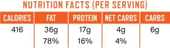

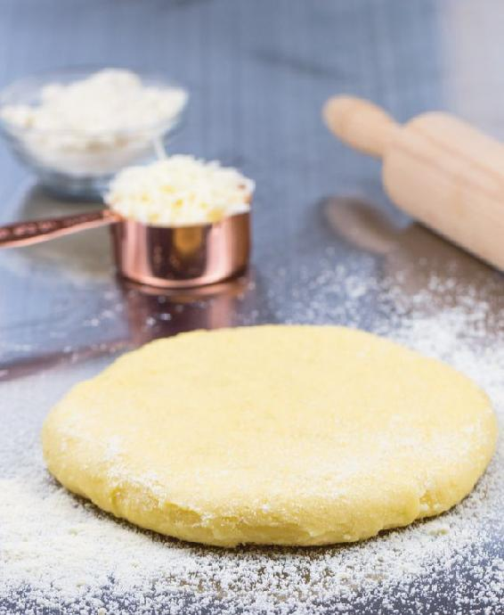

### 2-MINUTE HOMEMADE MAYONNAISE

PREP TIME: 2 minutes

MAKES 16 servings (1 tablespoon per serving)

This recipe takes less than two minutes to prepare and requires virtually no cooking skills. If you find yourself short on mayonnaise and are looking to avoid store-bought mayo made with canola or soybean oil, then this is the recipe for you.

Simply place all ingredients into a large mug and use an immersion blender to whip the mixture into a smooth creamy mayonnaise in a matter of seconds. This mayonnaise can be made with your favorite healthy oil. We recommend a mild-tasting oil such as avocado oil, macadamia oil (though this one is expensive!), or light olive oil. You should avoid using extra-virgin olive oil—it will give the mayonnaise a strong flavor.

1 large whole egg (see Tip)

½ teaspoon fine sea salt

½ teaspoon ground mustard

2 tablespoons fresh lemon juice or white wine vinegar

1 cup (240 ml) avocado oil, macadamia oil, or light olive oil

1. Place all ingredients into a large mug or widemouthed mason jar, big enough for an immersion blender to do its work. (The blender needs to be able to reach all the way to the bottom of the mug.)

2. Place the immersion blender into the mug and pulse while moving the blender up and down. Within seconds you’ll have a smooth, creamy mayonnaise.

3. Remove the mayonnaise from the mug and store in an airtight container in the refrigerator for up to 1 week.

CHEF’S TIP

-  The fresher the egg here, the better. Fresh eggs—one week old at most—have superior binding properties and help to ensure the mayonnaise emulsifies.

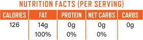

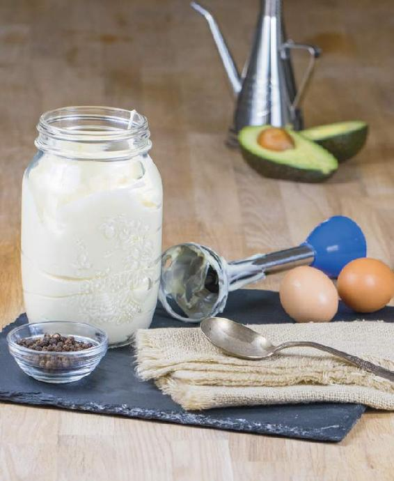

### LOW-CARB ALMOND BREAD

PREP TIME: 10 minutes

COOKING TIME: 35 minutes

MAKES 1 loaf (16 slices, 1 slice per serving)

This chewy, mildly sweet bread is almost reminiscent of a carby off-limits yeast bread; it can be toasted for sandwiches and used in any recipe calling for a slice of traditional glutinous bread. You can top it with just about anything you like; we topped the loaf in the photograph opposite with 1 teaspoon sesame seeds and 1 teaspoon flax seeds. Other ideas are listed below. Use the leftover egg yolks to make Blueberry Custard Tart (here) or Double Chocolate Pudding (here).

2 cups (180 g) almond flour

½ teaspoon fine sea salt

4 ounces (110 g) low-moisture mozzarella cheese or mild full-fat cheddar cheese, shredded

2 teaspoons baking powder

10 large egg whites

½ stick (¼ cup/55 g) unsalted butter, melted but not hot

SUGGESTED TOPPINGS

Flax seeds

Poppy seeds

Pumpkin seeds

Sesame seeds

Sunflower seeds

Dried herbs of choice

Grated Parmesan cheese

1. Preheat the oven to 325°F (163°C). Line a 9 by 5-inch (23 by 12.75-cm) loaf pan with parchment paper, leaving about 1 inch (2.5 cm) of paper overhanging.

2. Place the almond flour, salt, cheese, and baking powder in a mixing bowl and mix until well combined.

3. In a separate bowl, whip the egg whites until stiff (using a stand mixer, electric beaters, or a hand whisk). Add the cooled melted butter to the whipped egg whites, then very gently fold in the almond flour mixture, keeping as much air in the whipped egg whites as possible.

4. Transfer the batter to the loaf pan and sprinkle about 2 teaspoons of the topping(s) of your choice on top. Place the pan on a middle rack in the oven.

5. Bake until the loaf has risen by about one-third and is golden brown, about 35 minutes. Remove from the oven and allow to cool in the pan for 10 minutes, then remove the loaf from the pan and allow to cool completely on a wire cooling rack before slicing.

6. Store in an airtight container in the refrigerator for up to 4 days.

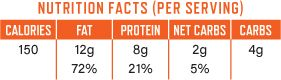

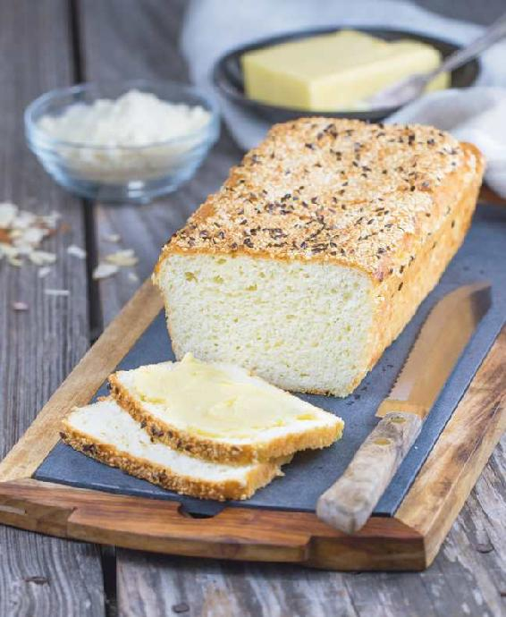

### SIMPLE CAULIFLOWER “RICE”

PREP TIME: 10 minutes

COOKING TIME: 5 to 10 minutes

MAKES 4 servings

This rice substitute is one of my favorite starch replacers; the finished dish doesn’t have an overpowering cauliflower flavor (as one might expect), and it has a great texture that makes it ideal for pairing with a wide range of meals. This is a basic recipe that can be used as a starting point for a wide range of flavored rice dishes.

1 medium cauliflower (about 1½ lbs/675 g)

2 tablespoons olive oil

Fine sea salt and freshly ground black pepper

ON OLIVE OIL

We use two types of olive oil in the kitchen: extra-virgin olive oil and refined olive oil. The latter is often simply called “olive oil” and a description of its cooking applications is sometimes included on the label, such as “for sautéing and grilling.” Extra-virgin olive oil should never be used in cooking; instead, use it for cold applications only, such as when drizzling olive oil over plated dishes, as a finishing oil, or in recipes such as gazpacho or vinaigrettes. When using olive oil in cooking, always reach for what’s called simply “olive oil.”

1. To rice the cauliflower, remove the leaves and stalk from the cauliflower and roughly chop into florets. Place the cauliflower into a food processor with the S-blade in place. Process the cauliflower in short pulses until it is chopped up into pieces the size of grains of rice. Alternatively, you can use the grater blade for your food processor to grate the florets. If you do not have a food processor, you can also use the large holes on a box cheese grater to shred the cauliflower into rice-size pieces.

2. Place the cauliflower into a large saucepan and drizzle with the oil. Cover the pan and gently steam over low heat for 5 to 10 minutes, stirring regularly and keeping the lid on until the “rice” is tender. Remove the saucepan from the heat, season to taste with salt and pepper, and serve immediately.

3. Store leftovers in an airtight container in the refrigerator for up to 4 days. Reheat in the microwave for 2 minutes in a microwave-safe bowl covered with plastic wrap.

CHEF’S TIPS

-  Don’t add any water to the cauliflower; there is enough naturally occurring water in the cauliflower to help steam the rice.

-  Remove the rice from the heat when it is just barely tender; don’t overcook it, as it can become mushy. Cauliflower rice will have a slightly firmer texture than regular rice.

-  Raw cauliflower can be riced ahead of time and stored in the refrigerator in an airtight container for up to 4 days until ready to cook.

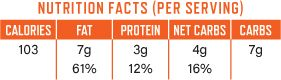

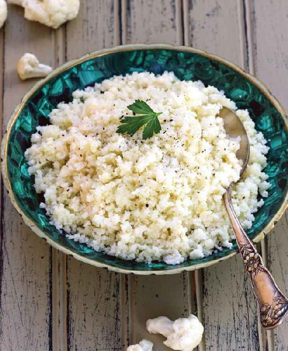

### BACON, GRUYÈRE & RED PEPPER

### EGG MUFFINS

PREP TIME: 10 minutes

COOKING TIME: 25 minutes

MAKES 8 muffins (1 per serving)

These delicious, protein-packed savory muffins are great for on-the-go breakfasts. You can make a big batch on Sunday and heat them up quickly on busy mornings. Fresh eggs are blended with cream and Gruyère cheese to create a rich, quichelike texture. This recipe is easily customizable; add any of your favorite ingredients to the muffin pan before putting in the egg mixture for endless flavor variations.

A nonstick silicone muffin pan is best for easy removal and cleanup. If you are using a metal muffin pan, be sure to grease it well with butter or another healthy cooking fat.

6 slices bacon, cooked and finely chopped

3 ounces (85 g) jarred roasted red peppers, diced

½ cup (120 ml) heavy cream

4 large eggs

8 ounces (220 g) Gruyère cheese, shredded, divided

Fine sea salt and freshly ground black pepper

Finely chopped fresh parsley, for garnish (optional)

1. Preheat the oven to 350°F (177°C).

2. Divide the chopped bacon and diced red peppers evenly among 8 cups of a standard-size 12-cup nonstick muffin pan.

3. Place the cream, eggs, half of the cheese, and a generous pinch each of salt and pepper in a blender and blend until smooth, 1 to 2 minutes. Divide the mixture evenly among the muffin cups, pouring it over the red pepper and bacon and filling each cup about three-quarters full.

4. Place the muffin pan in a baking dish and pour 1 inch (2.5 cm) of boiling water into the dish, around the muffin pan. Sprinkle the remaining cheese over the tops of the muffins and bake for 25 minutes.

5. Remove the pan from the oven and let the muffins cool in the pan. To serve, gently tap the egg muffins out of the muffin pan. Garnish with a sprinkle of parsley, if desired. Eat the muffins right away or store in the refrigerator and reheat individually as desired. Or eat them cold if you want! Store in an airtight container in the refrigerator for up to 4 days.

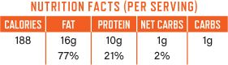

### BACON-WRAPPED ROASTED SQUASH

### EGG MUFFIN CUPS

PREP TIME: 10 minutes

COOKING TIME: 15 minutes

MAKES 8 muffins (1 per serving)

These delicious egg muffin cups can be a grab-and-go breakfast or part of a to-go lunch. They can be reheated quickly or enjoyed at room temperature. Use this recipe with your own favorite fillings for thousands of possible variations (see a handful of our suggested combinations below).

A nonstick silicone muffin pan will simplify the removal of the muffin cups from the pan, as well as the cleanup. If you are using a metal muffin pan, use cupcake liners for easy cleanup.

8 slices bacon, cooked but not crispy (it needs to remain flexible)

1 cup (140 g) peeled, diced, and roasted butternut squash

1 teaspoon olive oil

3 ounces (85 g) fresh (soft) goat cheese, crumbled

8 large eggs

¼ teaspoon fine sea salt

¼ teaspoon freshly ground black pepper

1. Preheat the oven to 400°F (205°C). Have on hand a standard-size 12-cup nonstick muffin pan.

2. Line 8 of the muffin cups with the bacon, using 1 slice per cup. Divide the butternut squash among the bacon cups, then drizzle with the oil and sprinkle on the goat cheese.

3. Crack the eggs into a large bowl, season with the salt and pepper, whisk well, and pour into the bacon-lined cups, filling each about three-quarters full.

4. Place the muffin pan in the oven and bake until the eggs are firm, puffed, and golden brown, about 15 minutes.

5. Remove the pan from the oven, let the muffins cool a bit, then remove the muffins from the pan and enjoy warm. Store the remaining cups in the refrigerator for up to 1 week. Enjoy cold or reheat individually as desired.

VARIATIONS

Use a range of different ingredients to fill the egg cups before pouring in the whisked eggs and baking:

-  Crumbled or diced cooked Italian sausage, diced roasted red peppers, and crumbled feta cheese

-  Diced or shredded cooked chicken, sliced cooked asparagus, and shredded mozzarella cheese

-  Diced roasted Mediterranean vegetables and grated Parmesan cheese

-  Crumbled cooked sausage of choice, chopped cooked broccoli, and crumbled blue cheese

-  Sliced roast beef and diced and caramelized red onions

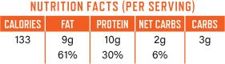

### ZUCCHINI, SAUSAGE & MELTED CHEESE CASSEROLE

PREP TIME: 10 minutes

COOKING TIME: 30 minutes

MAKES 8 servings

This versatile casserole, which is similar to a frittata, makes a great brunch, or it can be made ahead and stored in the refrigerator for quick and easy breakfasts during the week.

1 tablespoon olive oil

4 medium zucchinis

Fine sea salt and freshly ground black pepper

1 pound (450 g) spicy bulk Italian sausage (made with no grain fillers)

7 ounces (200 g) fontina cheese, shredded

6 large eggs

½ cup (120 ml) heavy cream

Crispy cooked bacon slices, cut into 1-inch (2.5-cm) pieces, for garnish (optional)

1. Preheat the oven to 400°F (205°C). Heat the oil in a large frying pan over medium-high heat.

2. Slice the zucchini, add it to the pan with the oil, and season with ⅛ teaspoon each of salt and pepper. Cook the zucchini for 5 minutes or until soft and starting to brown, then remove from the pan and set aside.

3. Add the sausage meat to the pan and sauté until fully cooked and golden brown.

4. Line an 8-inch (20-cm) round baking pan (or similar vessel) with parchment paper, leaving some parchment overhanging. Evenly distribute the zucchini and sausage in the pan and sprinkle with the fontina cheese (reserving a small handful for the top of the casserole).

5. Crack the eggs into a mixing bowl, season with ¼ teaspoon each of salt and pepper, add the cream, and whisk well. Pour the egg mixture over the zucchini-sausage mixture and sprinkle the reserved fontina on top. Place the pan in the oven and bake until the egg mixture is firm and the top of the casserole golden brown, about 30 minutes.

6. Top with crispy bacon slices, if desired. Lift the casserole out of the pan, cut into 8 pieces, and serve immediately or store in the refrigerator for up to 4 days and reheat as desired.

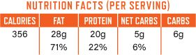

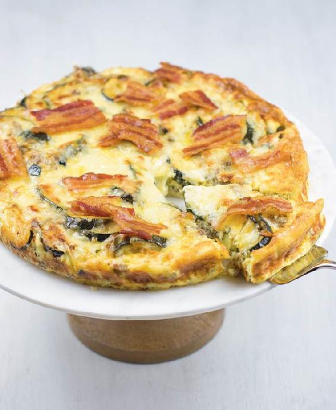

### VANILLA-ALMOND GRANOLA

PREP TIME: 10 minutes

COOKING TIME: 35 minutes + 1 hour to cool

MAKES Twenty ¾-cup (145-g) servings

This delicious granola is a low-carb dream—a sweet alternative to the more common savory breakfast options. Granola really does not need oats to be delicious and satisfying; this grain-free version is nutrient-rich and provides long-lasting energy. Top with full-fat yogurt or ice-cold unsweetened almond milk and fresh berries.

1 cup (100 g) raw walnuts

1 cup (100 g) raw pecans

2 cups (220 g) almond flour

1 cup (80 g) unsweetened coconut flakes

¾ cup (145 g) granulated low-carb sweetener of your choice (see Note)

½ cup (65 g) dried apricots, chopped (optional—they contain sugar)

½ cup (40 g) golden flaxseed meal

½ cup (65 g) pumpkin seeds

½ cup (120 ml) water

¼ cup (60 ml) coconut oil, melted, plus more for the parchment

2 teaspoons vanilla extract

½ teaspoon ground cinnamon

Full-fat yogurt or almond milk, for serving (optional)

Fresh berries, for serving (optional)

NOTE

Feel free to reduce the amount of sweetener to taste.

1. Preheat the oven to 300°F (150°C). Line a sheet pan with parchment paper and grease the paper with coconut oil.

2. Place the walnuts in a food processor and press the pulse button a few times to roughly chop them. Your goal is a rough chop, not ground nuts or nut butter, so watch closely! Remove the walnuts to a large mixing bowl. Repeat with the pecans, then place them in the bowl with the walnuts.

3. Add the remaining ingredients to the bowl with the nuts and mix well, using your hands. Transfer the mixture to the baking sheet and lightly press into an even layer.

4. Bake for 15 minutes, then remove the pan from the oven, stir the granola with a large spoon, and press it back down onto the sheet. Bake for another 15 to 20 minutes, or until fragrant and lightly browned on the surface. Switch off the oven and let the granola cool completely in the oven, about 1 hour. It will crisp up as it cools.

5. When the granola has fully cooled, use your hands to crumble it up into small chunks. Serve with full-fat yogurt or unsweetened almond milk and fresh berries. Store the granola in an airtight container in a cool, dark place, such as the pantry, for up to 1 month.

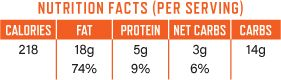

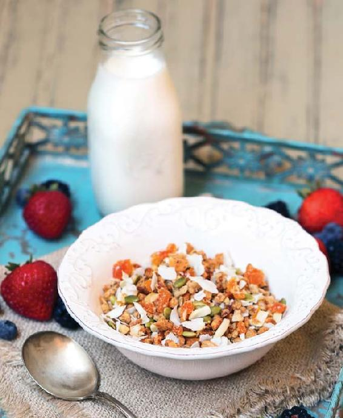

### OVERNIGHT BLUEBERRY & CHIA BREAKFAST PUDDING

PREP TIME: 5 minutes + 4 hours to chill

MAKES 6 servings

Chia seeds have been used for centuries by the indigenous populations of Mexico and Guatemala, mainly in beverages. Chia naturally thickens liquids when soaked, creating a thick, creamy texture. This is a fantastic, filling breakfast that takes very little effort to prepare.

2 cups (480 ml) unsweetened almond milk

1 cup (130 g) fresh blueberries

6 tablespoons granulated low-carb sweetener of your choice (see Note)

½ cup (120 ml) heavy cream

½ cup (95 g) white chia seeds

Pinch of fine sea salt

Additional fresh blueberries and/or other fresh berries of choice, for garnish

NOTE

Feel free to reduce the amount of sweetener to taste.

1. Place the almond milk, blueberries, and sweetener in a blender and blend until the blueberries are broken down and the mixture is smooth. Transfer to a medium-size mixing bowl.

2. Add the cream, chia seeds, and salt and whisk until well combined. Cover the bowl with plastic wrap and refrigerate overnight or for at least 4 hours.

3. When you are ready to serve the pudding, remove from the refrigerator and whisk well; the chia seeds will have swelled and the mixture should have thickened to about the consistency of yogurt.

4. Spoon the pudding into individual serving glasses and top with fresh berries. Store leftovers in the fridge for up to 4 days.

VARIATION: VANILLA CHIA BREAKFAST PUDDING

-  Simply omit the blueberries and add 1 teaspoon of vanilla extract.

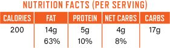

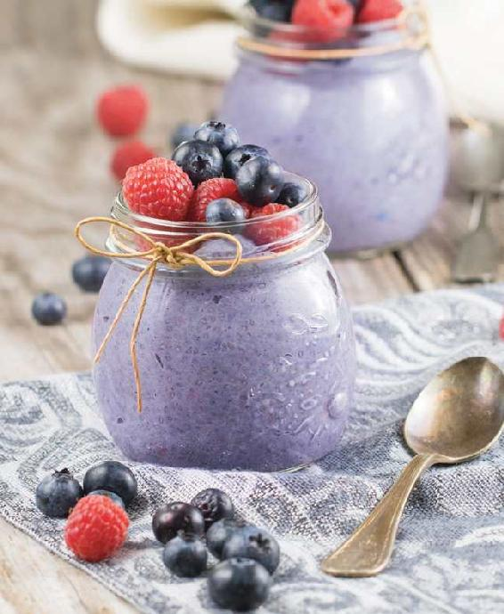

### CHEDDAR & ALMOND FLOUR BISCUITS

PREP TIME: 10 minutes

COOKING TIME: 20 minutes

MAKES 8 biscuits (1 per serving)

These moist, savory biscuits make an excellent breakfast or quick snack. Serve them warm with salted butter.

2 cups (220 g) almond flour

2 teaspoons baking powder

½ teaspoon fine sea salt

Pinch of cayenne pepper

6 ounces (170 g) sharp or extra-sharp cheddar cheese, shredded, divided

2 large eggs, beaten

½ stick (¼ cup/55 g) unsalted butter, softened

Salted butter, for serving

1. Preheat the oven to 350°F (177°C). Grease 8 cups of a standard-size 12-cup nonstick muffin pan.

2. In a large bowl, whisk together the almond flour, baking powder, salt, and cayenne pepper. Set aside ¼ cup (30 grams) of the cheese for the tops of the biscuits. Add the remaining cheese, eggs, and butter to the dry ingredients and mix with a rubber spatula until well combined.

3. Divide the mixture evenly among the greased muffin cups, filling each about two-thirds full, and top each with a sprinkle of the reserved cheddar cheese.

4. Place the muffin pan in the oven and bake until the biscuits have doubled in size and are golden, 15 to 20 minutes.

5. Cool the biscuits slightly in the pan, then turn out onto a cooling rack and enjoy warm with salted butter. Store any leftovers in an airtight container in the refrigerator for up to 4 days.

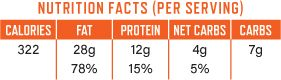

### CHEESY CAULIFLOWER “GRITS”

### WITH GARLICKY PORTOBELLO MUSHROOMS

PREP TIME: 10 minutes

COOKING TIME: 30 minutes

MAKES 4 servings

Cheesy grits make an excellent savory breakfast. This recipe uses a sprinkle of real corn grits for flavor and texture, but the bulk of the dish is grated cauliflower. A warm bowl of these “grits” with sautéed mushrooms and a bit of crispy bacon is a winning weekend breakfast.

GRITS

½ stick (¼ cup/55 g) unsalted butter

¼ white onion, finely diced

2 cloves garlic, minced

1 tablespoon coarsely ground corn grits or polenta (not quick-cook)

Florets from ½ head cauliflower, riced (see here)

½ cup (120 ml) all-natural salted chicken stock

½ cup (120 ml) heavy cream

¼ teaspoon smoked paprika

Pinch of cayenne pepper

A few dashes of Tabasco sauce

½ cup (55 g) shredded cheddar cheese

½ cup (55 g) grated Parmesan cheese

Fine sea salt and freshly ground black pepper

MUSHROOMS

2 large portobello mushrooms

2 tablespoons olive oil

½ stick (¼ cup/55 g) unsalted butter

2 cloves garlic, minced

1 teaspoon fresh thyme leaves, chopped, or ¼ heaping teaspoon dried thyme leaves

Fine sea salt

12 slices crispy cooked bacon, for serving (optional)

Fresh thyme (sprigs or leaves) or chopped fresh parsley, for garnish

1. Prepare the “grits”: Place the butter, onion, and garlic in a large saucepan and sauté over medium heat for 2 to 3 minutes, until softened.

2. Add the corn grits and continue to sauté for 2 minutes. Add the cauliflower and cook for a further 2 minutes, stirring well.

3. Add the chicken stock and cream and bring to a boil, then reduce the heat to a steady simmer. Add the spices and hot sauce and continue to simmer for 15 to 20 minutes, until the liquid has reduced to a creamy sauce and the cauliflower and grits are tender.

4. While the grits are cooking, prepare the mushrooms: Slice the portobellos into ½-inch (1.25-cm) strips, place in a large frying pan with the oil and butter, and fry over medium heat for about 5 minutes. Add the minced garlic and thyme and continue to cook for 4 to 5 minutes more, until the mushrooms are golden brown and caramelized. Season to taste with salt.

5. When the grits are done, add the cheddar and Parmesan cheeses and continue to cook for 5 minutes, until the cheese is melted and evenly distributed, stirring often. Season to taste with salt and pepper and immediately divide among four serving plates.

6. Top the creamy grits with the mushrooms and add crispy bacon, if desired. Garnish with thyme or parsley and serve. Store any leftovers for up to 3 days in the refrigerator and reheat as desired.

CHEF’S TIP

-  Store corn grits or polenta in an airtight container in the freezer for up to 6 months.

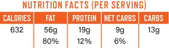

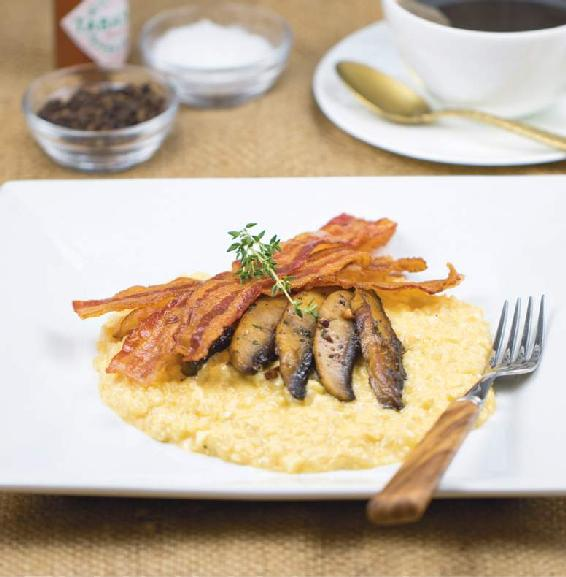

### HIGH-PROTEIN  
BREAKFAST SMOOTHIES

Smoothies are a great way to get all of your nutrients and energy for the morning in a quick format that is easy to take on the go.

BERRY BLITZ

PROTEIN SMOOTHIE

PREP TIME: 5 minutes

MAKES 4 servings

2 cups (480 ml) unsweetened almond milk

2 cups (480 ml) ice

½ cup (75 g) unsweetened whey protein powder

½ cup (65 g) hulled and sliced fresh strawberries

½ cup (60 g) fresh raspberries

½ cup (60 g) fresh blackberries

⅓ cup (38 g) raw almonds

¼ cup (32 g) fresh blueberries

Granulated low-carb sweetener of your choice (see Note)

NOTE

Feel free to reduce the amount of sweetener to taste.

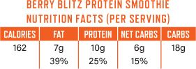

GREEN POWER

PROTEIN SMOOTHIE

PREP TIME: 5 minutes

MAKES 4 servings

1 handful of fresh spinach

2 large kale leaves

2 large fresh strawberries, hulled and chopped

2 cups (480 ml) unsweetened almond milk

2 cups (480 ml) ice

½ cup (70 g) fresh raspberries

½ cup (75 g) unsweetened whey protein powder

⅓ cup (38 g) raw almonds

¼ cup (60 ml) heavy cream

Granulated low-carb sweetener of your choice (see Note)

1. Place all of the ingredients, except the sweetener, in a high-powered blender and blend for 2 minutes, until smooth and creamy. Taste and add sweetener to your liking. (*Note:* If your blender isn’t a high-powdered one, finely chop the kale leaves and pulverize the almonds before adding them to the blender jar. You may need to blend longer to get a smooth texture.)

2. Pour into four 12-ounce (350-ml) glasses and serve immediately.

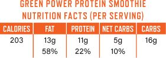

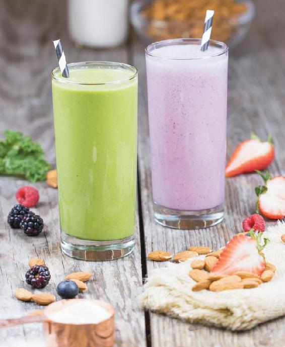

### PESTO & TOMATO “FLATBREADS”

### WITH CHICKEN PARMESAN CRUST

PREP TIME: 10 minutes

COOKING TIME: 25 minutes

MAKES 4 servings

Making a flatbread crust from chicken may sound a bit strange, but give it a try—this is a delicious, simple solution for a crisp, high-protein base for your favorite toppings. Simply blend Parmesan cheese and chicken, spread into “dough” circles, and bake for ten minutes. The finished product is delicious, satisfying, and healthy. Serve with a side salad for a complete meal.

CHICKEN FLATBREAD CRUST

2 whole boneless, skinless chicken breasts (about 1¾ lbs/675 g)

1 large egg

½ teaspoon fine sea salt

¼ teaspoon freshly ground black pepper

1½ teaspoons fresh oregano leaves, or ½ teaspoon dried oregano leaves

½ teaspoon ground mustard

½ teaspoon onion powder

1½ cups (165 g) grated Parmesan cheese

2 tablespoons extra-virgin olive oil, for drizzling

TOPPINGS

8 teaspoons high-quality store-bought pesto

1 cup (110 g) shredded mozzarella cheese

8 ounces (225 g) fresh (soft) goat cheese, sliced

24 cherry tomatoes, halved

Freshly ground black pepper

1. Preheat the oven to 400°F (205°C). Line 2 sheet pans with parchment paper.

2. Make the crust: Cut the chicken breasts into cubes and place in a food processor. Add the egg, salt, pepper, oregano, ground mustard, and onion powder and process until you have a smooth paste. Add the shredded Parmesan cheese and pulse a few more times, until well incorporated.

3. Divide the chicken mixture into 4 parts and place 2 parts onto each sheet pan, evenly spaced in mounds. Use a pallet knife or the back of a spoon to spread each mound out into tortilla-size circles, about ¼ inch (6 mm) thick. Drizzle the circles with olive oil and place in the oven to bake for 10 minutes, until golden.

4. Remove the sheet pans from the oven and spread 2 teaspoons of the pesto over each flatbread crust. Top each circle with one-quarter of the shredded mozzarella and goat cheese slices, then finish with cherry tomato halves (12 per circle) and a grind of black pepper.

5. Place the flatbreads back in the oven and bake for 15 minutes, until golden brown and bubbly.

6. Remove the sheet pans from the oven and let the flatbreads cool slightly, then cut into quarters and serve. Store any leftovers in the refrigerator for up to 3 days and reheat as desired.

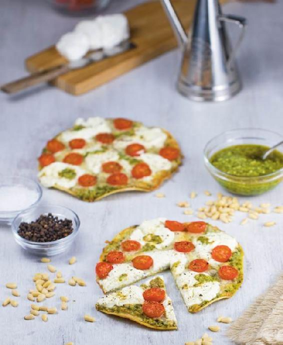

### CREAMY CHICKEN-MUSHROOM SOUP

PREP TIME: 10 minutes

COOKING TIME: 55 minutes

MAKES 6 servings

This is a spectacularly delicious soup, but you need to be a mushroom lover to enjoy it as the soup has an intensely rich and earthy mushroom flavor. Make a large batch in advance and simply reheat for a quick, wholesome lunch during the week.

POACHED CHICKEN

6 cups (1.4 liters) all-natural salted chicken stock

1 whole boneless, skinless chicken breast (about 14 ounces)

SOUP

1 tablespoon olive oil

2 tablespoons unsalted butter

4 portobello mushrooms, diced

2 stalks celery, diced

3 cloves garlic, minced

2 cups (480 ml) heavy cream

1 teaspoon fresh thyme leaves, finely chopped

Fresh parsley, for garnish (optional)

Sautéed sliced portobello mushroom, for garnish (optional)

CHEF’S TIP

-  For a fancy presentation, swirl a tablespoon of crème fraîche into each bowl of soup.

1. Place the chicken stock in a large saucepan and bring to a boil. Reduce the heat to a steady simmer, then add the chicken breast. Cover with a lid and poach gently for 20 minutes, or until the chicken is fully cooked. Remove the chicken from the pan (reserve the stock) and set aside.

2. Make the soup: Heat the oil and butter in a large saucepan over medium-high heat. Once hot, add the vegetables and cook, stirring constantly, for 5 minutes, until tender. Add the cream, thyme, and 3 cups (720 ml) of the reserved chicken stock. Bring to a boil, then reduce the heat to a rolling simmer.

3. Dice the cooked chicken, add to the soup, and continue to cook for 20 to 25 minutes, until thick and creamy. Garnish with parsley and sautéed mushroom, if desired, and serve. Store any leftovers in the refrigerator for up to 3 days.

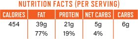

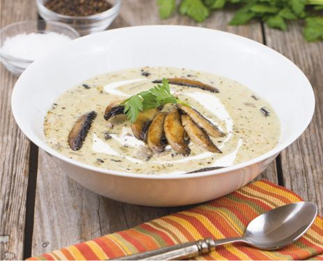

### CREAMY TOMATO-BASIL SOUP

PREP TIME: 10 minutes

COOKING TIME: 25 minutes

MAKES 6 servings

This aromatic soup features a classic tomato-and-basil flavor combination. Using canned diced tomatoes makes this recipe really easy, but feel free to use fresh ripe tomatoes if you prefer. Serve with toasted Low-Carb Almond Bread (here) for a delicious, hearty lunch.

1 tablespoon olive oil

2 tablespoons unsalted butter

2 stalks celery, diced

½ white onion, chopped

3 cloves garlic, chopped

1 (28-oz/785-g) can diced tomatoes, or 1 pound (450 g) fresh tomatoes, diced

2 cups (480 ml) heavy cream

2 cups (480 ml) all-natural salted chicken stock

1 large handful of fresh basil leaves, chopped

Heavy cream, for garnish

Torn fresh basil, for garnish

Freshly ground black pepper, for garnish

1. Place a large saucepan over medium-high heat and add the oil and butter. Add the celery, onion, and garlic to the hot oil and cook for 5 minutes, until tender, stirring constantly.

2. Add the diced tomatoes, cream, and chicken stock and bring to a boil. Reduce the heat to a rolling simmer and continue to cook for 20 minutes.

3. Add the chopped basil and continue to cook for 3 more minutes. Remove the pan from the heat and use an immersion blender to purée the soup until smooth and creamy. Pour into serving bowls and garnish with a few drops of cream, some fresh basil leaves, and a sprinkle of freshly ground black pepper. Store any leftovers in the refrigerator for up to 4 days.

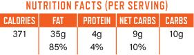

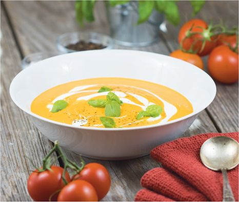

### PHILLY CHEESESTEAK  
LETTUCE WRAPS

PREP TIME: 10 minutes

COOKING TIME: 15 minutes

MAKES 4 servings

For those not in the know, a Philly cheesesteak is a simple delicacy that originates from Philadelphia—a sandwich comprising finely sliced steak, sautéed onions and bell peppers, and processed cheese sauce, served in a soft white hoagie roll. In this version, the processed cheese sauce is replaced with real melted cheese and the bread is exchanged for large crunchy romaine lettuce leaves, which cuts the carbs dramatically and still delivers an extremely satisfying meal.

2 (8-oz/225-g) boneless rib-eye steaks

2 tablespoons olive oil

2 red bell peppers, sliced

½ white onion, sliced

3 cloves garlic, minced

2 cups (220 g) shredded full-fat cheese (any combination you like—half provolone and half Gruyère works well)

8 large romaine lettuce leaves

*SPECIAL EQUIPMENT*

Cocktail skewers

1. Place the steaks in the freezer for 30 to 40 minutes (very cold meat is easier to slice).

2. Using a sharp knife, slice the steak into thin strips and set aside.

3. Place a large frying pan over medium-high heat. Add the oil to the pan and heat. Add the sliced red peppers and white onion to the hot oil and sauté for 5 minutes, or until softened. Add the garlic and continue to cook for an additional 3 to 5 minutes, until the vegetables are golden brown and caramelized. Transfer the vegetables to a plate and set aside.

4. Add the sliced steak to the hot frying pan and stir-fry for 2 to 3 minutes, until fully cooked and browned. Add the peppers and onions back to the pan and stir well. Sprinkle the shredded cheese over the steak, cover the pan with a lid, and continue to cook for an additional 2 to 3 minutes, until the cheese is melted and bubbling. Transfer the meat and vegetable mixture to a plate and allow to cool for 3 to 5 minutes.

5. Assemble the wraps: Stack 2 lettuce leaves per wrap and top with a quarter of the steak mixture. Carefully roll the lettuce around the filling, cut each lettuce wrap in half, and secure with cocktail skewers. Serve immediately.

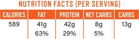

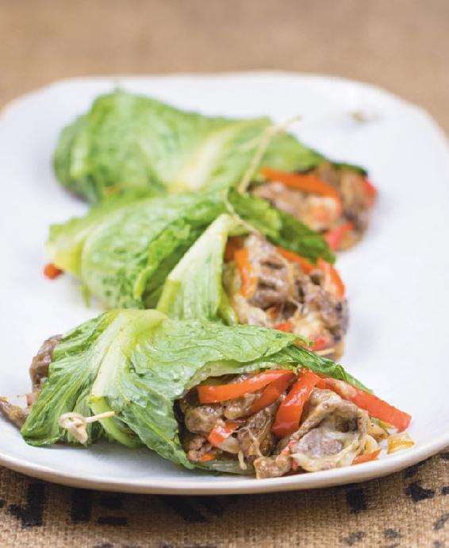

### INCREDIBLE KETO PIZZA

PREP TIME: 10 minutes

COOKING TIME: 30 minutes

MAKES 4 servings

Who doesn’t like pizza? Pizza may be the food that low-carb, gluten-free, and Paleo dieters miss the most. This pizza crust, made from an ingenious blend of mozzarella cheese and almond flour, tastes very similar to the real thing. It is identical to the recipe for Mozzarella Pastry Dough on here, but here is reduced to a manageable size for hand-forming into the perfect thin-crust pizza. Experiment with your favorite toppings!

DOUGH

1 cup (110 g) almond flour

¼ teaspoon fine sea salt

1 teaspoon baking powder

2 tablespoons unsalted butter

½ cup (55 g) grated Parmesan cheese

1 cup (110 g) shredded low-moisture mozzarella cheese

1 large egg

TOPPING

¼ cup (60 ml) store-bought all-natural marinara or pizza sauce (no added sugar)

4 ounces (110 g) fresh mozzarella cheese, sliced

2 ounces (55 g) fresh (soft) goat cheese, crumbled

2 ounces (55 g) blue cheese, crumbled

10 slices pepperoni

4 slices prosciutto, torn, for garnish

Fresh arugula, for garnish

1. Preheat the oven to 400°F (205°C).

2. Make the pizza dough: Place the almond flour, salt, and baking powder in a mixing bowl and whisk thoroughly.

3. Place a large saucepan over low heat and add the butter, Parmesan cheese, and mozzarella cheese. Stirring constantly, melt the butter and cheese (they may look separated at this point, but they will incorporate when mixed with the other ingredients).

4. Pour the cheese-butter mixture into the bowl of a stand mixer fitted with the paddle attachment. With the mixer on low speed, add the almond flour mixture and the egg, then turn the speed to high. Continue to mix for 1 to 2 minutes, until you have smooth, soft dough. Alternatively, you can use an electric hand mixer or good old-fashioned elbow grease, but a stand mixer works best.

5. Allow the dough to cool slightly. Place a large piece of parchment paper on the counter and form the dough into a 12 by 8-inch (30.5 by 20-cm) rectangle directly on the paper. Try to keep the crust as thin as you can.

6. Place the parchment directly onto the middle rack of the oven and par-bake for 10 minutes.

7. Remove the dough from the oven, spread on the marinara sauce, and then add the remaining toppings except the prosciutto and arugula. Place the pizza back in the oven and bake for 15 to 20 minutes, until golden and bubbling.

8. Garnish the hot pizza with the prosciutto slices and fresh arugula and serve immediately. Store leftovers in the refrigerator for up to 3 days.

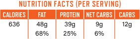

### ASIAN-STYLE SHRIMP & VEGETABLE WRAPS

### WITH PEANUT-CILANTRO SLAW

PREP TIME: 30 minutes

COOKING TIME: 5 minutes

MAKES 4 wraps (1 per serving)

Rice is typically off-limits on a low-carb diet, but ultra-thin Asian rice paper wraps (also known as *báhn tráng*) are so thin that they really don’t contain many carbs at all. They are stretchy when soaked in water and are great for making healthy vegetable and protein-packed rolls. Stuff the wraps with any of your favorite fillings; they are great for boxed lunches and quick snacks as well as meals when paired with this tangy slaw.

COCONUT CURRY POACHED SHRIMP

1 (1-oz/28-g) piece fresh ginger, roughly chopped

1 (14-oz/400-ml) can full-fat unsweetened coconut milk

2 teaspoons curry powder

1 teaspoon fine sea salt

20 raw large shrimp or king prawns, peeled and deveined

4 (8½-in/21½-cm) bánh tráng rice paper wraps

VEGETABLE FILLINGS

1 small handful of mung bean sprouts

1 small handful of fresh cilantro, chopped

½ red bell pepper, sliced into strips

¼ medium cucumber, sliced into strips

3 scallions, sliced into strips

Sesame seeds, for garnish

Soy sauce, for dipping

SLAW

¼ head red cabbage

1 small handful of fresh cilantro leaves, chopped, plus extra for garnish

2 tablespoons 2-Minute Homemade Mayonnaise (here)

1 tablespoon creamy all-natural peanut butter (no sugar added)

1 teaspoon soy sauce

1 teaspoon unseasoned rice wine vinegar

½ teaspoon all-natural chili paste

1. Make the poached shrimp: Place all the ingredients, aside from the shrimp, in a saucepan and bring to a boil. Reduce the heat to a simmer, then add the shrimp and gently poach for 5 minutes. Drain the shrimp, then place in a bowl and refrigerate until needed; discard the cooking liquid.

2. Make the rice paper wraps: Soak the wraps in cold water for 30 seconds, then place on a cutting board (they will be pliable and sticky after soaking; work quickly, before they become too tacky). Top each wrap with 5 poached shrimp and one-quarter of each of the filling ingredients. Carefully roll the stuffed wraps into cylinder shapes and store in the refrigerator until needed.

3. Make the slaw: Finely shred the red cabbage and place in a large mixing bowl. Add all the other ingredients, except for the garnishes, and mix well.

4. To serve, slice each rice wrap in half and divide the pieces among 4 serving plates. Place a large scoop of the slaw on each plate and top with some extra cilantro. Sprinkle the wraps with sesame seeds and serve with soy sauce for dipping.

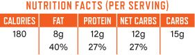

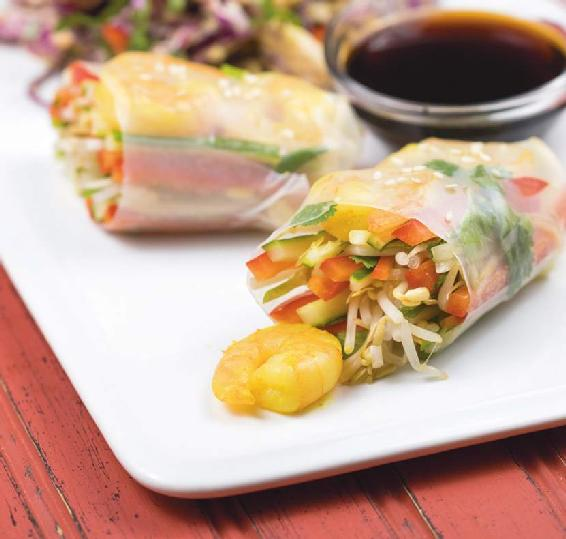

### PAN-ROASTED CHICKEN, AVOCADO, APRICOT & PROSCIUTTO SALAD

PREP TIME: 10 minutes

COOKING TIME: 20 minutes

MAKES 4 servings

This colorful salad is full of contrasting flavors; the apricots add a hint of sweetness and tanginess and cut through the rich avocado and prosciutto. Warm, crispy pan-roasted chicken and light Dijon mustard dressing elevate the salad to a refreshing yet wholesome lunch.

CHICKEN

4 boneless, skinless chicken breast halves (about 1¾ lbs/675 g) or boneless, skinless thighs (see Note)

¼ teaspoon fine sea salt

¼ teaspoon freshly ground black pepper

2 tablespoons olive oil

DRESSING

¼ cup (60 ml) white wine vinegar

½ cup (120 ml) extra-virgin olive oil

1 teaspoon Dijon mustard

Fine sea salt and freshly ground black pepper to taste

SALAD

4 large handfuls of arugula

1 large handful of pea shoots (optional)

4 medium ripe apricots, pitted and cut into wedges

2 ripe avocados, peeled and sliced

8 slices prosciutto, roughly torn

Freshly ground black pepper, for garnish

1. Preheat the oven to 400°F (205°C). Season the chicken breasts with the salt and pepper.

2. Place a large ovenproof frying pan over high heat. Add the oil and, once hot, add the chicken breasts. Cook the chicken for 3 minutes on each side, then transfer the frying pan to the oven and continue to cook for 15 minutes, until the chicken is golden brown, crispy, and fully cooked in the center.

3. Make the dressing: Place all ingredients in a mixing bowl and whisk until fully combined and emulsified.

4. Assemble the salad: Place a handful of arugula onto each serving plate. Scatter the pea shoots, apricot wedges, sliced avocado, and torn prosciutto over each pile of arugula.

5. Remove the chicken breasts from the oven, allow to rest for 3 to 5 minutes, and then slice and place on top of each salad. Drizzle the salads with the dressing, garnish with freshly ground black pepper, and serve.

NOTE

Chicken thighs contain more fat, flavor, and calories than breasts.

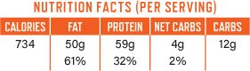

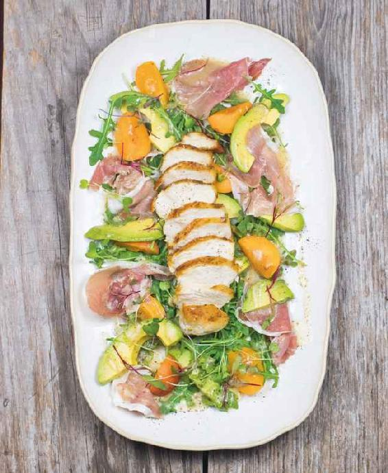

### CAESAR SALAD

### WITH SEARED SALMON & PARMESAN CRISPS

PREP TIME: 15 minutes

COOKING TIME: 20 minutes

MAKES 4 servings

Caesar salad is always a crowd-pleaser. Anchovies, traditional in Caesars, add a real kick of umami flavor. Little-known Caesar salad factoid: it was actually invented in Mexico! Parmesan crisps are added in this version as a superior replacement for croutons.

CAESAR DRESSING

2 cloves garlic, minced

1 tablespoon grated Parmesan cheese

1½ teaspoons Dijon mustard

2 large egg yolks

Juice of ½ lemon

2 anchovy fillets (packed in oil), roughly chopped

1¼ cups (300 ml) extra-virgin olive oil

Fine sea salt and freshly ground black pepper

PARMESAN CRISPS

1 cup (110 g) freshly grated Parmesan cheese (from a block, not powdered)

SALMON

2 tablespoons olive oil

4 (6-oz/170-g) skinless salmon fillets, ideally wild-caught

¼ teaspoon fine sea salt

¼ teaspoon freshly ground black pepper

SALAD

2 romaine lettuce hearts

12 marinated white anchovy fillets (boquerones), for garnish

Lemon wedges, for serving

1. Make the dressing: Place the garlic, Parmesan cheese, mustard, egg yolks, lemon juice, and anchovies in a food processor and blend until very smooth.

2. With the motor running, trickle in the olive oil very slowly, until fully emulsified and creamy (this should take about 1½ minutes). Transfer the dressing to a jar and season with salt and pepper to taste. If the dressing is thicker than you would like, add 1 to 2 tablespoons of boiling water to thin it out.

3. Make the crisps: Preheat the oven to 350°F (177°C) and line a sheet pan with parchment paper. Spread the Parmesan cheese onto the sheet in a thin layer, ensuring there are no gaps.

4. Place the sheet pan in the oven and bake for 4 to 5 minutes, until golden brown and bubbly. Remove the sheet pan from the oven and, using a metal spatula, immediately remove the molten cheese from the parchment paper to a cooling rack. The cheese layer will become crispy as it cools; when cooled completely, snap the layer into small crisps.

5. Cook the salmon: Place a large frying pan over medium-high heat and add the olive oil. Season the salmon fillets evenly with the salt and pepper and, once the oil is hot, add the salmon to the pan. Cook for 5 minutes on the first side, until golden and crispy, then flip and continue cooking for 2 to 3 minutes more, until the salmon is cooked through (or less if you like your salmon medium-rare).

6. Prepare the salad: Trim the base of the lettuce hearts, separate the leaves, and wash well. Place the leaves in a large bowl, pour the dressing over them, and toss. Divide the salad among 4 large plates and top with the warm salmon. Garnish with the anchovies and Parmesan crisps and serve with lemon wedges. Store any leftover salmon in the refrigerator for up to 2 days.

CHEF’S TIP

-  For this particular recipe, it’s important to use freshly grated Parmesan—it melts better and creates better crisps.

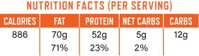

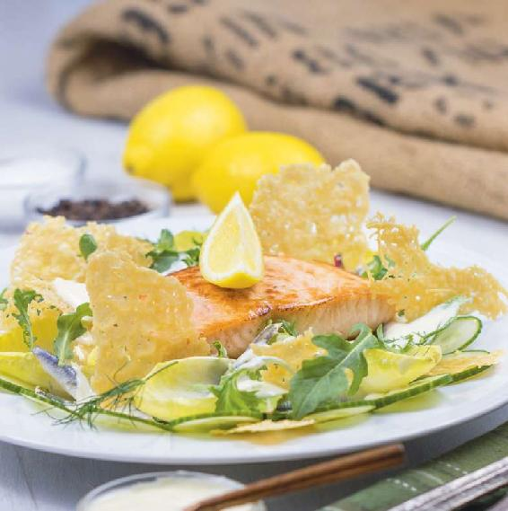

### BUNLESS BURGERS

### WITH HALLOUMI FRIES

PREP TIME: 15 minutes

COOKING TIME: 25 minutes

MAKES 4 servings

You can’t beat the fresh taste of a high-quality homemade beef burger. These burgers take ten minutes or less to put together and are packed with juicy flavor. The crispy halloumi fries are made by simply deep-frying halloumi cheese—a low-carb french fry alternative packed with flavor and protein.

BURGER PATTIES

2 pounds (900 g) grass-fed ground beef (80% lean)

2 teaspoons Dijon mustard

1 teaspoon fine sea salt

1 teaspoon freshly ground black pepper

BURGER TOPPINGS

2 tablespoons olive oil

½ red onion, sliced

Fine sea salt and freshly ground black pepper

2 ounces (60 g) fresh (soft) goat cheese, crumbled

FRIES

High-heat oil for deep-frying, such as coconut oil or avocado oil (about 3 cups/720 ml)

1 (8.8-oz/250-g) package halloumi cheese, sliced into fry-size pieces

SIDE SALAD (OPTIONAL)

4 large handfuls of mixed salad greens

2-Minute Homemade Mayonnaise (here), for dressing the salad

1. Combine all the ingredients for the burger patties in a large bowl and use your hands to mix until thoroughly combined.

2. Divide the burger meat evenly into 4 balls, then use your hands to press into patties about 5 inches (12.75 cm) in diameter and ½ inch (1.25 cm) thick. Preheat a grill or cast-iron griddle pan to high heat.

3. While the grill is heating up, make the red onion topping: Place the olive oil in a frying pan over medium heat and add the red onion slices. Sauté the onions for about 5 to 10 minutes. Season to taste with salt and pepper.

4. Cook the burgers on the preheated grill or cast-iron griddle pan for about 5 minutes on the first side, then flip it and cook 5 minutes on the other side for medium done burgers.

5. Make the halloumi fries: In a large heavy saucepan, heat a generous amount of oil (about 3 cups) to 350°F (177°C) over medium-high heat. (You want about 2 inches (5 cm) of oil in the pan and 3 inches (7.5 cm) or more of headspace above the oil.) Add all of the halloumi pieces to the hot oil and cook for about 5 minutes, until golden brown and crispy. Drain the fries on paper towels.

6. Top the cooked burgers with the onions and crumbled goat cheese. Serve with a side salad, if desired. Store any leftovers in the refrigerator for up to 3 days.

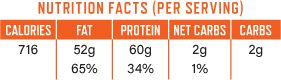

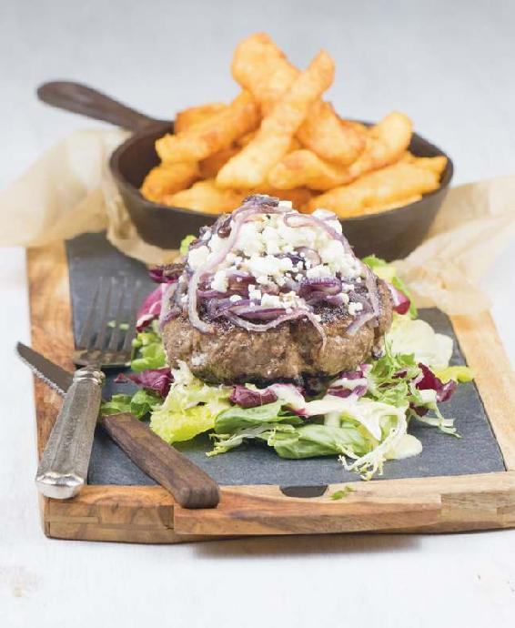

### BACON-CHEDDAR PINWHEELS

PREP TIME: 10 minutes + 15 minutes for the pastry dough

COOKING TIME: 30 minutes

MAKES 22 pinwheels (1 per serving)

Crisp bites of warm golden-brown pastry stuffed with cheddar and bacon—yum! This mouthwatering party appetizer (or meal when paired with a salad) is versatile and surprisingly very low carb. Once baked, the pinwheels can be garnished with extra toppings of your choice, such as cream cheese and smoked salmon. Use the directions below to make an endless array of flavor varieties by filling the pinwheels with your own ingredient combinations.

1 recipe Mozzarella Pastry Dough (here)

12 slices crispy cooked bacon, chopped

8 ounces (225 g) sharp or extra-sharp cheddar cheese, shredded

4 ounces (110 g) Parmesan cheese, grated

1. Preheat the oven to 350°F (177°C) and line a sheet pan with parchment paper.

2. Make the pastry dough according to recipe instructions. Place the dough on a clean work surface and roll it out into a large rectangle about ¼ inch (6 mm) thick. Use a little bit of almond flour for dusting if the pastry becomes sticky.

3. Sprinkle the bacon and cheddar over the pastry and, working with one of the long sides, carefully roll it into a long cylinder shape.

4. Slice the cylinder into 22 round discs and place them onto the baking sheet. Sprinkle the Parmesan cheese over the pinwheels and bake for 30 minutes, until golden brown and crispy. Serve immediately.

5. Store leftover pinwheels in an airtight container at room temperature for 2 to 3 days. To reheat, place in a preheated moderate oven for 5 to 8 minutes, or until piping hot and crispy.

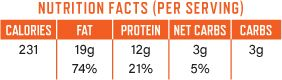

### PARMESAN ROASTED MIXED NUTS

PREP TIME: 5 minutes

COOKING TIME: 45 minutes

MAKES 12 servings

Nuts are a classic low-carb snack, but store-bought flavored mixes often feature additives and sugars. This homemade nut mix is delicious, crunchy, and cheesy, and it can be made with any of your favorite nuts.

4 tablespoons olive oil, divided

PARMESAN COATING

1½ cups (165 g) grated Parmesan cheese

1 teaspoon fine sea salt

1 teaspoon onion powder

1 teaspoon smoked paprika

½ teaspoon dried ground oregano

¼ teaspoon cayenne pepper

2 large egg whites

NUT MIX

1 cup (135 g) raw almonds

1 cup (145 g) raw peanuts

½ cup (65 g) raw Brazil nuts

½ cup (65 g) raw macadamia nuts

½ cup (50 g) raw pecan halves

½ cup (65 g) raw hazelnuts

1. Preheat the oven to 325°F (163°C). Line a sheet pan with parchment paper and drizzle with 2 tablespoons of the oil.

2. Make the Parmesan coating: Place the Parmesan, salt, and spices in a bowl and mix well until combined.

3. Whisk the egg whites in a separate medium-sized bowl until they form soft peaks.

4. Add the mixed nuts and the Parmesan coating mixture to the egg whites and stir well until the nuts are thoroughly coated with the mixture.

5. Sprinkle the nuts onto the prepared sheet pan and drizzle the remaining 2 tablespoons of oil over the top.

6. Place the sheet pan in the oven and bake for 15 minutes. Stir the nut mixture well and continue to bake for 5 to 10 minutes more, until golden and aromatic. Switch off the oven and leave the nuts inside with the door ajar for 20 minutes.

7. Remove the nuts from the oven and cool completely in the pan, then store in an airtight container at room temperature for up to 1 week.

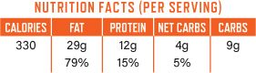

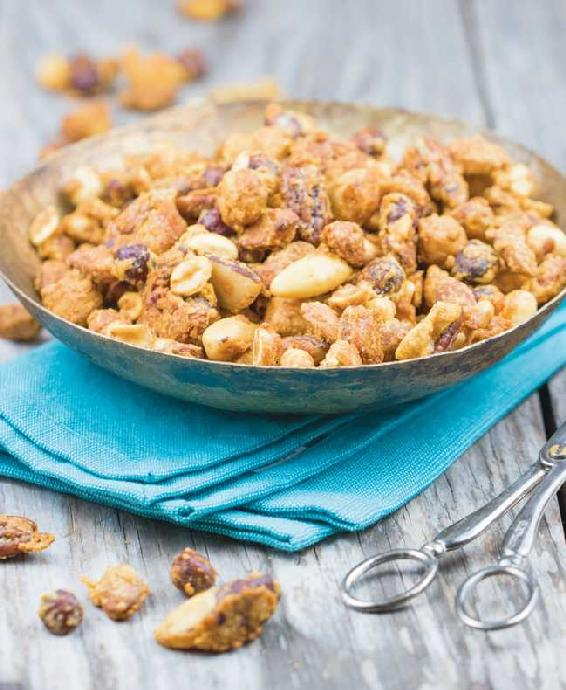

### CHICKEN TIKKA SKEWERS

### WITH CILANTRO-LIME DIPPING SAUCE

PREP TIME: 15 minutes + 1 hour to marinate

COOKING TIME: 30 minutes

MAKES 6 servings

These flavor-packed skewers make a fantastic party appetizer. This recipe uses store-bought tikka masala curry paste, so they are super easy to make. If you are ambitious, you can make your own curry paste. The cooling cilantro dipping sauce adds a sharp and tangy contrast to the robust flavors of the spiced chicken.

CHICKEN TIKKA

1 whole boneless, skinless chicken breast (about 14 oz/400 g)

½ cup (120 ml) full-fat yogurt

3 tablespoons all-natural Indian tikka masala curry paste

Juice of ½ lemon

½ teaspoon fine sea salt

CILANTRO-LIME DIPPING SAUCE

¾ cup (180 ml) full-fat yogurt

½ cup (120 ml) 2-Minute Homemade Mayonnaise (here)

Zest and juice of 2 limes

3 tablespoons chopped fresh cilantro

¼ teaspoon freshly ground black pepper

¼ teaspoon fine sea salt

Stevia to taste (optional)

Chopped fresh cilantro, for garnish

*SPECIAL EQUIPMENT*

Bamboo skewers, soaked in water for 15 minutes

1. Marinate the chicken: Cut the chicken breasts into 1-inch (2.5-cm) cubes and place in a large mixing bowl. Add the rest of the ingredients for the chicken, stir well, and refrigerate for 1 hour.

2. Make the dipping sauce: Simply mix all of the ingredients in a bowl and store in the refrigerator until needed.

3. Preheat the oven to 400°F (205°C) and line a sheet pan with parchment paper. Thread 2 or 3 pieces of chicken onto each bamboo skewer and place the skewers on the sheet pan. Place the pan in the oven and bake the chicken for 30 minutes, until golden brown and no longer pink in the center. Serve the skewers with a bowl of the dipping sauce, garnished with chopped fresh cilantro. Store any leftovers in the refrigerator for up to 3 days.

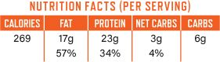

### NO-BAKE

### COCOA PEANUT BUTTER PROTEIN BALLS

PREP TIME: 15 minutes + 1 hour to chill

COOKING TIME: 5 minutes

MAKES 12 protein balls (1 per serving)

These protein-packed bites are a quick and easy snack to keep in the refrigerator for a sweet energy boost. Take them in the car or on a hike!

DRY MIX

¾ cup (82 g) almond flour

¼ cup (32 g) whey protein powder

¼ cup (20 g) unsweetened shredded coconut

3 tablespoons unsweetened cocoa powder

2 tablespoons chia seeds

⅛ teaspoon fine sea salt

SYRUP

¼ cup (60 ml) water

¼ cup (48 g) granulated low-carb sweetener of your choice (see Note)

2 tablespoons unsalted butter

1 teaspoon vanilla extract

¼ cup (60 g) creamy all-natural peanut butter (no sugar added)

Crushed toasted peanuts, for garnish (optional)

NOTE

Feel free to reduce the amount of sweetener to taste.

1. Place all of the ingredients for the dry mix in a mixing bowl and combine.

2. Place all the ingredients for the syrup in a saucepan over medium heat. Bring to a boil, then reduce the heat to a simmer and cook until syrupy, about 5 minutes.

3. Pour the syrup over the dry ingredients, then add the peanut butter and stir until fully combined. Cover and refrigerate for 1 hour.

4. Use a tablespoon to scoop the chilled mixture into 12 portions and roll between your hands to form balls. Coat the balls with crushed peanuts, if desired, and store in an airtight container in the refrigerator for up to a week or in the freezer for up to a month.

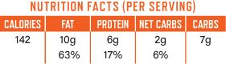

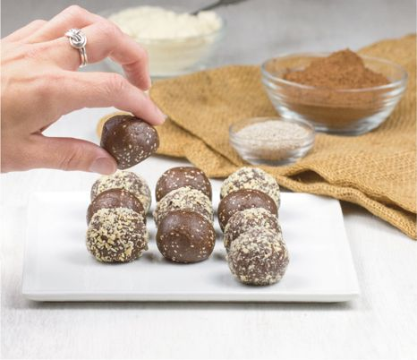

### CRISPY SESAME SHRIMP “TOAST”

PREP TIME: 15 minutes + 1 hour to freeze

COOKING TIME: 10 minutes

MAKES 6 servings

Sesame shrimp toast is a popular Chinese takeout item and usually consists of a flavorful shrimp paste spread on bread, coated in sesame seeds and deep-fried. This low-carb version skips the bread and uses shrimp paste alone; it’s a fantastic accompaniment to a stir-fried main course or as a punchy umami appetizer on its own.

SHRIMP PASTE

10 ounces (285 g) raw shrimp, peeled and deveined

1 large egg white

1 scallion, chopped

2 cloves garlic, chopped

High-heat oil for deep-frying, such as coconut oil or avocado oil (about 3 cups/720 ml)

“BREADING”

1 cup (110 g) almond flour

¼ cup plus 2 tablespoons (55 g) sesame seeds

EGG WASH

1 large egg

Black sesame seeds, for garnish (optional)

Scallions, thinly sliced on the diagonal, for garnish (optional)

Soy sauce, for serving

1. Line a sheet pan with parchment paper, leaving some overhanging. Place all of the shrimp paste ingredients in a high-powered blender or food processor and blend until smooth. Spread the paste in an even layer in the bottom of the lined sheet pan. Place the pan in the freezer for 1 hour.

2. In a large heavy saucepan, heat a generous amount of oil (about 3 cups/700 ml) to 350°F (177°C) over medium-high heat. (You want about 2 inches/5 cm of oil in the pan and 3 inches/7.5 cm or more of headspace above the oil.)

3. While the oil is heating, prepare the breading and egg wash: Mix the almond flour and sesame seeds together in a large bowl and beat the egg in a separate small bowl.

4. Remove the shrimp paste from the freezer and, using the parchment, transfer it to a cutting board. Slice it into triangles. Working quickly, dip each triangle into the beaten egg, then into the almond flour mixture, and then gently drop in the oil. Deep-fry the “toasts” in batches for 3 to 5 minutes, until golden brown and crispy, then drain on paper towels and sprinkle with sea salt.

5. Serve immediately, garnished with black sesame seeds and sliced scallions, if desired, and with soy sauce for dipping.

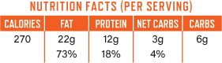

### CRISPY BONELESS CHICKEN WINGS

### WITH BUFFALO RANCH DIP

PREP TIME: 15 minutes + 30 minutes to marinate

COOKING TIME: 30 minutes

MAKES 4 servings

There is something very satisfying about the crispy skin, tender meat, and tangy Buffalo sauce of Buffalo chicken wings. You may be aware of the increasingly popular boneless “wings,” which are essentially chicken nuggets with breading, jam-packed full of carbs. Here’s a recipe for an equally satisfying low-carb alternative with a great crunch—they are yummy!

1 whole boneless, skinless chicken breast (about 14 ounces), cut into 1-inch (2.5-cm) cubes

MARINADE

½ cup (120 ml) full-fat buttermilk

¼ cup (60 ml) Buffalo wing hot sauce (see Note)

¼ teaspoon fine sea salt

¼ teaspoon freshly ground black pepper

“BREADING”

1 cup (110 g) almond flour

1 cup (110 g) grated Parmesan cheese

EGG WASH

2 large eggs, beaten

BUFFALO DRIZZLE

3 tablespoons Buffalo wing hot sauce (see Note)

⅓ cup (80 ml) olive oil

CREAMY BUFFALO DIP

¼ cup plus 2 tablespoons (90 ml) 2-Minute Homemade Mayonnaise (here)

¼ cup (60 ml) full-fat sour cream

1 tablespoon Buffalo wing hot sauce (see Note)

¼ teaspoon smoked paprika

¼ teaspoon freshly ground black pepper

1. Place the chicken breast cubes in a large mixing bowl with all the marinade ingredients, stir well, and marinate for 30 minutes in the refrigerator.

2. After the chicken has marinated for 15 minutes, preheat the oven to 450°F (232°C) and line a sheet pan with parchment paper.

3. Prepare the breading and egg wash: Mix the almond flour and Parmesan cheese in a large mixing bowl and beat the eggs in a small bowl.

4. Take a chicken cube and shake off the excess marinade, dip it in the egg, and then roll it in the almond flour mixture, until well coated. Place the breaded chicken cube on the lined sheet pan. Repeat with the rest of the chicken, egg wash, and breading.

5. Mix the drizzle ingredients together and drizzle the mixture over the chicken using a spoon. Place the sheet pan in the oven and bake the chicken for 30 minutes, until golden brown.

6. Mix all the dip ingredients together and serve alongside the crispy chicken pieces. Store any leftovers in the refrigerator for up to 3 days.

NOTE

Make sure to purchase an all-natural, no-sugar-added Buffalo sauce, available online and at natural food markets such as Whole Foods. Or make your own low-carb version. (We recommend a recipe on the site Allrecipes.com. Search for “Buffalo Chicken Wing Sauce” and select the recipe submitted by Chef John.)

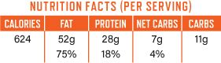

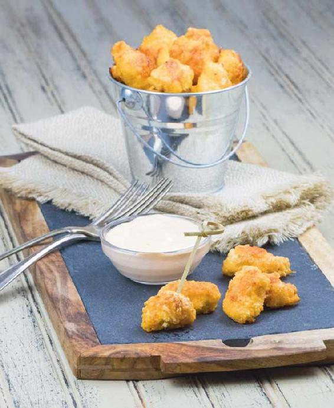

### INDIAN-STYLE

### COCONUT BUTTER CHICKEN

PREP TIME: 10 minutes + 1 hour to marinate

COOKING TIME: 25 minutes

MAKES 4 servings

A rich and creamy curry offers a slight kick of spice without being overpowering. This also happens to be one of the easiest curries to make: just throw marinated chicken in a frying pan, add cream and tomato sauce, and simmer until the chicken is tender and the sauce is thick. This makes a great weeknight dinner when paired with cauliflower “rice” (here). You can even drop the chicken in the marinade in the morning so that it’s ready to cook when you get home from work.

MARINADE

½ cup (120 ml) full-fat yogurt

Juice of ½ lemon

5 cloves garlic, minced

2 tablespoons grated fresh ginger

2 teaspoons chopped fresh curry leaves (optional, but it adds fantastic flavor)

2 teaspoons garam masala

2 teaspoons ground mustard

1 teaspoon turmeric powder

1 teaspoon ground cumin

½ teaspoon cayenne pepper

¼ teaspoon ground cardamom

CURRY

1½ pounds (675 g) skinless, boneless chicken breasts or thighs, cut into bite-size pieces (see Note)

1 tablespoon coconut oil

½ teaspoon fine sea salt

1 cup (240 ml) unsweetened all-natural tomato sauce

1 cup (240 ml) heavy cream

½ stick (¼ cup/55 g) unsalted butter

1 batch Simple Cauliflower “Rice” (here), for serving

Fresh cilantro, for garnish

1. Combine the marinade ingredients in a large mixing bowl. Add the chicken, stir well, and let marinate in the refrigerator for a minimum of 1 hour or up to 8 hours.

2. Heat the oil in a large frying pan over high heat and add the marinated chicken. Sauté for 5 minutes, until the chicken is browned.

3. Add the salt, tomato sauce, cream, and butter and stir well. Simmer the mixture on low heat for 20 minutes, until the chicken is fully cooked and tender. Taste for seasoning and add salt if needed.

4. Serve the curry with cauliflower “rice” and garnish with cilantro. Store any leftovers in the refrigerator for up to 3 days.

NOTE

Chicken thighs contain more fat, flavor, and calories than breasts.

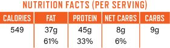

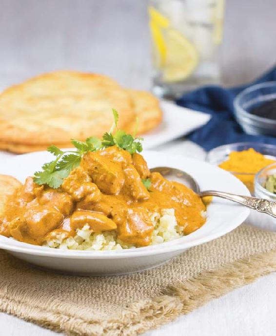

### MACADAMIA-CRUSTED HALIBUT

### WITH ORANGE-SESAME SALAD

PREP TIME: 15 minutes

COOKING TIME: 25 minutes

MAKES 4 servings

This Asian-style salad is fresh and light tasting, yet substantial. Halibut is encrusted with crushed macadamia nuts and baked, which results in a texture similar to that of a traditional panko-breaded fish.

HALIBUT

¾ cup (100 g) raw macadamia nuts

½ cup (55 g) grated Parmesan cheese

4 (8-oz/225-g) skinless halibut fillets

¼ teaspoon fine sea salt

¼ teaspoon freshly ground black pepper

1 large egg, beaten

3 tablespoons olive oil

SALAD

1 large orange

4 large handfuls of mixed salad leaves

1 (2-inch/5-cm) piece cucumber, sliced

DRESSING

3 tablespoons light olive oil

2 tablespoons fresh orange juice

1 tablespoon toasted (dark) sesame oil

1 tablespoon unseasoned rice wine vinegar

1 tablespoon soy sauce

1 tablespoon minced fresh ginger

1 tablespoon sesame seeds

Fresh cilantro, for garnish

1. Preheat the oven to 400°F (205°C). Line a sheet pan with parchment paper.

2. Place the macadamia nuts in a food processor and process until they resemble finely textured bread crumbs. Add the Parmesan and pulse to mix in, then transfer to a plate or shallow bowl.

3. Season the halibut fillets evenly with the salt and pepper. Dip each fillet in the beaten egg, then dredge the fillets in the macadamia-Parmesan mixture on all sides until fully coated. Place the fillets on the baking sheet and drizzle with the olive oil. Place the baking sheet in the oven and cook for 20 to 25 minutes, until golden brown and crispy and opaque in the center.

4. Meanwhile, peel and segment the orange for the salad and set aside.

5. Make the dressing: Place all ingredients in a mixing bowl and whisk well until fully combined.

6. Divide the salad leaves among 4 serving plates. Top with the orange segments and cucumber slices and drizzle some of the dressing on each serving. Place the cooked halibut fillets on the plates, directly on top of the salad or to the side, and garnish with cilantro.

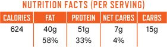

### JUICY TURKEY SWEDISH MEATBALLS

PREP TIME: 20 minutes

COOKING TIME: 30 minutes

MAKES 4 servings

These easy-to-make baked turkey meatballs are served in a creamy sauce flavored with bacon, mustard, and Parmesan cheese. They taste like the most delicious Swedish meatballs you’ve ever had. Serve the meatballs over zucchini “noodles” for an indulgent dinner.

2 large zucchinis

MEATBALLS

¼ white onion, finely diced

2 cloves garlic, minced

2 tablespoons olive oil, divided

1 teaspoon chopped fresh thyme leaves

1 tablespoon chopped fresh oregano leaves

2 pounds (900 g) ground turkey meat (not lean)

3 tablespoons grated Parmesan cheese

½ teaspoon fine sea salt

Pinch of freshly ground black pepper

1 large egg

BACON SAUCE

6 slices bacon, chopped

¼ white onion, diced

2 cloves garlic, minced

½ cup (120 ml) all-natural salted chicken stock

1 tablespoon chopped fresh parsley

½ teaspoon whole-grain mustard (no sugar added)

Fine sea salt and freshly ground black pepper

2 cups (480 ml) heavy cream

2 tablespoons grated Parmesan cheese

Grated Parmesan cheese, for garnish

Fresh chopped parsley, for garnish

1. Preheat the oven to 400°F (205°C). Line a sheet pan with aluminum foil.

2. Use a spiralizer, julienne peeler, or vegetable peeler to cut the zucchinis into “noodles.” Set aside.

3. Make the meatballs: Fry the onion and garlic in a tablespoon of the olive oil over medium heat for 5 minutes, until softened. Add the herbs and continue to cook for another 2 minutes. Remove from the heat, place the mixture in a large mixing bowl, and allow to cool.

4. Add the ground turkey, Parmesan cheese, seasoning, and egg to the mixing bowl. Use your hands to combine the ingredients thoroughly.

5. Form the mixture into 24 meatballs, rolling them into compact balls with your hands. Place the meatballs on the sheet pan, drizzle with the remaining tablespoon of olive oil, and place the pan in the oven to bake for 20 minutes, until golden brown and cooked through.

6. Make the sauce: In a large saucepan, cook the bacon over high heat for 5 minutes, until crispy, then add the onion and garlic and cook for 5 more minutes, until softened. Add the chicken stock, parsley, mustard, and seasoning and bring the mixture to a boil. Cook for 5 minutes, until the chicken stock has mostly evaporated, then add the cream and Parmesan cheese and reduce the heat to a simmer. Cook for 10 minutes, until the sauce has thickened.

7. Remove the meatballs from the oven and add them to the sauce. Simmer the meatballs in the sauce for a few minutes to ensure they are piping hot. Divide the zucchini “noodles” evenly among 4 plates and top with the meatballs and sauce. Sprinkle with extra Parmesan and chopped parsley. Store any leftovers in the refrigerator for up to 3 days.

### ZUCCHINI, RICOTTA & PARMESAN LASAGNA

PREP TIME: 10 minutes

COOKING TIME: 1 hour 30 minutes

MAKES 8 servings

This family-size low-carb lasagna is a great make-ahead dish to reheat as needed. Layers of baked zucchini replace traditional pasta noodles, and add a lovely texture to the finished dish; you’ll barely even notice you aren’t eating pasta. For a dinner party, serve the lasagna with a simple Caesar salad with Parmesan crisps (see here for the recipe, but omit the salmon).

ZUCCHINI “PASTA” LAYER

6 large zucchinis, sliced lengthwise into ¼-inch (6-mm)-thick planks (a mandoline works perfectly for this)

Fine sea salt and freshly ground black pepper

¼ cup (60 ml) olive oil

BOLOGNESE MEAT SAUCE

2 pounds (900 g) grass-fed ground beef (80% lean)

½ white onion, chopped

6 cloves garlic, minced

1 teaspoon dried oregano leaves

1 teaspoon chopped fresh thyme leaves, or ¼ heaping teaspoon dried thyme leaves

½ teaspoon freshly ground black pepper

1 (28-oz/785-g) can diced tomatoes

1 cup (240 ml) all-natural salted chicken stock

RICOTTA & PARMESAN LAYER

20 ounces (565 g) full-fat ricotta cheese

8 ounces (225 g) Parmesan cheese, grated, plus extra for the top

Fine sea salt and freshly ground black pepper

1. Prepare the “pasta” layer: Preheat the oven to 350°F (177°C). Line 3 sheet pans with parchment paper. Place the zucchini slices on the baking sheets in a single layer. Season well with salt and pepper and drizzle with the oil. Place in the oven and bake for 45 minutes, flipping the slices after 20 minutes. The idea is to dry out the zucchini as much as possible so that the finished lasagna is not soggy. When the zucchini is done, remove it from the oven and turn the temperature up to 400°F (205°C).

2. Meanwhile, make the Bolognese: Place a large saucepan over high heat. Put the ground beef in the pan and cook for about 5 minutes, until browned, crumbling the meat as it cooks. Drain the excess oil, then add the onion, garlic, herbs, and pepper; continue to cook the mixture for 5 more minutes, until the onion has softened.

3. Add the diced tomatoes and chicken stock to the beef mixture. Bring to a boil, then reduce the heat to a steady simmer and continue to cook for an additional 30 minutes, until the sauce has thickened, stirring often.

4. Make the ricotta-Parmesan layer: Mix the two ingredients together and season to taste.

5. Assemble the lasagna: Line a 12 by 8-inch (30.5 by 20-cm) baking pan with parchment paper. Start with a layer of meat sauce, then alternate layers of zucchini slices, cheese mixture, and meat sauce, finishing with the cheese mixture on top. Sprinkle some extra grated Parmesan on the top of the lasagna and bake for 40 minutes, until golden brown and bubbling.

6. Serve hot. Store leftovers in the refrigerator for up to 4 days.

### PESTO-MOZZARELLA CHICKEN

### WITH CAPRESE SALAD

PREP TIME: 15 minutes

COOKING TIME: 25 minutes

MAKES 4 servings

Rich, flavorful pesto and creamy mozzarella make a classic flavor combination and a winning weeknight dinner. Chicken breasts are the base for a layer of pesto that is topped with mozzarella then baked until golden brown and bubbling. An heirloom tomato and mozzarella caprese salad is a simple pairing.

CHICKEN

1 whole boneless, skinless chicken breast (about 14 ounces)

¼ teaspoon fine sea salt

¼ teaspoon freshly ground black pepper

4 tablespoons (60 ml) store-bought pesto (see Note)

8 ounces (225 g) fresh mozzarella cheese, sliced

CAPRESE SALAD

3 large heirloom tomatoes

8 ounces (225 g) fresh mozzarella cheese

2 tablespoons extra-virgin olive oil

2 tablespoons store-bought pesto

Fine sea salt and freshly ground black pepper

FOR GARNISH

1 handful of fresh arugula

3 tablespoons pine nuts, toasted

1. Preheat the oven to 400°F (205°C). Line a sheet pan with parchment paper.

2. Slice the chicken breasts in half horizontally to make a total of 4 large, flat pieces. Place the chicken on the sheet pan and season evenly with the salt and pepper. Spread each chicken piece with 1 tablespoon of the pesto and top with the mozzarella cheese slices, dividing them evenly among the chicken. Bake for 25 minutes, or until the chicken is cooked through (it will be opaque throughout) and the mozzarella is golden and bubbling.

3. Meanwhile, make the caprese salad: Wash and slice the tomatoes, then slice the mozzarella cheese. Alternate the tomato slices with mozzarella slices in a fan-shaped arrangement on four serving dishes. Drizzle with the olive oil and pesto and season with salt and pepper to taste.

4. Serve the cooked chicken with the caprese salad and top with fresh arugula and a sprinkling of pine nuts. Store any leftovers in the refrigerator for up to 3 days.

NOTE

When buying store-bought pesto, be sure to check the ingredient label to make sure it is free of sugar. Make your own pesto if you are ambitious!

### PORK LOIN SCHNITZEL

### WITH TOMATO PESTO & MOZZARELLA

PREP TIME: 20 minutes + 1 hour to marinate

COOKING TIME: 35 minutes

MAKES 4 servings

Layers of creamy mozzarella and tangy tomato pesto broiled on top of breaded pork loin cutlets…Need we say more? For a balanced meal, serve this with a side of your favorite low-carb vegetables or a salad.

PORK SCHNITZEL

1 pound (450 g) boneless pork loin

1 cup (240 ml) full-fat buttermilk

Fine sea salt and freshly ground black pepper

1½ cups (165 g) almond flour

1½ cups (165 g) grated Parmesan cheese

2 large eggs

¼ cup (60 ml) olive oil

TOPPINGS

8 tablespoons store-bought tomato pesto

8 ounces (225 g) fresh mozzarella, sliced

Chopped fresh parsley, for garnish

1. Preheat the oven to 450°F (232°C). Line a sheet pan with parchment paper.

2. Slice the pork loin into 4 pieces (you can ask your butcher to do this for you when you buy it) and place each piece between 2 layers of plastic wrap. Use a rolling pin to pound the pork into ¼-inch (6-mm)-thick cutlets. Place the meat in a mixing bowl, add the buttermilk, and stir well to coat. Marinate for 1 hour (this helps tenderize the meat, but you can skip this step if you are short on time).

3. Remove the pork from the buttermilk and pat dry with paper towels. Season well with salt and pepper.

4. In a large mixing bowl, combine the almond flour and Parmesan cheese and mix well. In a small bowl, beat the eggs. Dip the pork cutlets in the beaten eggs and then in the almond flour mixture, making sure the cutlets are thoroughly coated on both sides. Transfer the cutlets to the prepared sheet pan and drizzle with the oil.

5. Bake the cutlets for 30 minutes, or until golden brown and no longer pink in the center, then remove from the oven.

6. Top each pork cutlet with 2 tablespoons of tomato pesto and one-quarter of the mozzarella slices. Turn on the broiler and, once it is fully hot, broil the pork cutlets for 5 minutes, until the cheese is melted, golden, and bubbling.

7. Remove the pan from the broiler and place the cutlets on individual serving plates. Garnish with fresh parsley and serve. Store any leftovers in the refrigerator for up to 3 days.

### ALMOND & PARMESAN–CRUSTED BAKED SALMON

### WITH BRAISED BROCCOLINI

PREP TIME: 10 minutes

COOKING TIME: 20 minutes

MAKES 4 servings

Before we found out about the benefits of a LCHF diet, panko breadcrumb–crusted salmon was one of our favorite midweek dinners. This new and improved recipe uses the same concept of fresh salmon fillets with a crunchy, flavorful topping, but it replaces the panko crumbs with a mixture of almonds and Parmesan cheese. This is a fantastic quick dinner.

SALMON

4 (6-oz/170-g) skin-on salmon fillets, ideally wild-caught

¼ teaspoon fine sea salt

¼ teaspoon freshly ground black pepper

¼ cup (60 ml) olive oil

PARMESAN CRUST

1 cup (110 g) grated Parmesan cheese

½ cup (55 g) almond flour

½ cup (42 g) sliced or chopped raw almonds

1 teaspoon chopped fresh dill

1 egg white

Pinch of fine sea salt

Pinch of freshly ground black pepper

BRAISED BROCCOLINI

2 tablespoons unsalted butter

2 (8-oz/225-g) bunches broccolini, stalks trimmed

½ cup (120 ml) all-natural salted chicken stock

4 ounces (110 g) cherry tomatoes

Fine sea salt and freshly ground black pepper

Zest of ½ lemon, cut into thin strips, for garnish (optional)

1. Preheat the oven to 400°F (205°C). Season the salmon fillets evenly with the salt and pepper, then place the fillets on a sheet pan.

2. Mix all the ingredients for the Parmesan crust in a large mixing bowl until fully combined.

3. Top each salmon fillet with the Parmesan crust mixture and press down lightly. Drizzle generously with the oil and place in the oven to bake for 20 minutes, or until opaque in the center.

4. Meanwhile, prepare the broccolini: Place a large frying pan over medium-high heat. Melt the butter in the hot pan until frothy, then add the broccolini and stir-fry for 2 to 4 minutes.

5. Add the chicken stock, cherry tomatoes, and a pinch each of salt and pepper, then cover the pan with a lid and cook for an additional 3 minutes.

6. Remove the lid and continue to cook over high heat for about 5 minutes, until the liquid has evaporated and the broccolini is tender and glazed.

7. Serve the cooked salmon over the broccolini. Garnish with lemon zest, if desired. Store any leftovers in the refrigerator for up to 3 days.

### SHRIMP FRIED CAULIFLOWER “RICE”

PREP TIME: 15 minutes

COOKING TIME: 20 minutes

MAKES 4 servings

Cauliflower “rice” makes an excellent substitute for real rice, and, as an added bonus, it is even easier to make. This flavorful Asian-style fried “rice” is ready in 35 minutes—a great weeknight dinner. If you are feeling adventurous and have extra time, serve the “rice” with our delicious sesame shrimp “toast” (here) for a Chinese takeaway-like experience, minus the carbs and guilt.

3 tablespoons coconut oil

2 tablespoons minced ginger

3 cloves garlic, minced

½ red bell pepper, diced

1 pound (450 g) raw shrimp (preferably tail-on), peeled and deveined

1 pound (450 g) riced cauliflower (see Note)

1 teaspoon curry powder

1 teaspoon all-natural chili paste

½ cup (120 ml) all-natural salted chicken stock

2 tablespoons unsalted butter

¼ teaspoon fine sea salt

1 large handful of fresh cilantro, chopped

½ cup (50 g) mung bean sprouts

3 scallions, sliced on the diagonal

Lime wedges, for serving

NOTE

To rice cauliflower, see Step 1 of the recipe for Simple Cauliflower “Rice” on here; to get 1 pound (450 g) of riced cauliflower you will need 1 medium head of cauliflower (about 1½ lbs/675 g). Use store-bought riced cauliflower to save time if you can find it.

1. Place a large frying pan or wok over high heat, add the oil, ginger, garlic, and red bell pepper, and stir-fry for 5 minutes. Add the shrimp and continue to cook for 2 to 3 minutes more, until no longer translucent.

2. Add the riced cauliflower, curry powder, chili paste, chicken stock, butter, and salt and cover with a lid. Cook the mixture for 5 minutes, then remove the lid and continue to stir-fry for another 3 to 5 minutes, until the cauliflower is tender and the dish is aromatic.

3. Divide the fried “rice” among 4 serving plates and sprinkle with the cilantro, mung bean sprouts, and scallions. Serve with lime wedges.

### SLOW COOKER BEEF STEW

PREP TIME: 15 minutes

COOKING TIME: 8 hours

MAKES 6 servings

Spend fifteen minutes of your morning preparing this stew and you’ll have a wonderful, hearty dinner waiting for you when you get home! Low-carb cooking does not have to be labor-intensive. The addition of radishes may sound strange, but after slow-cooking, they lose their peppery bite and taste very similar to steamed new potatoes.

1¾ pounds (800 g) boneless chuck steak

2 tablespoons olive oil

10 ounces (280 g) radishes, peeled

6 cloves garlic, minced

½ white onion, diced

1 (14½-oz/400-g) can diced tomatoes

1 cup (240 ml) heavy cream

½ cup (120 ml) all-natural salted chicken stock

2 teaspoons ground mustard

Chopped fresh parsley, for garnish

1. Preheat a slow cooker to high.

2. Cut the chuck steak into 2-inch (5-cm) cubes. Heat a large frying pan over high heat, then pour the oil into the hot pan; when the oil is hot, add the steak cubes and brown on all sides for 5 minutes.

3. Place the browned meat and all the other ingredients in the slow cooker. Cover with the lid and cook on high for 8 hours.

4. After 8 hours of cooking, stir well, garnish with chopped parsley, and serve. Store leftovers in the refrigerator for up to 3 days.

### PROVOLONE & HAM–STUFFED PORK TENDERLOIN

PREP TIME: 20 minutes

COOKING TIME: 40 minutes

MAKES 6 servings

Smoky melted cheese and cured ham make a simple and delightful filling for this crowd-pleasing meal. Serve the pork with a big green salad and, voilà, you have a perfect dinner for Sunday or any other day of the week!

1 boneless pork tenderloin (about 1½ lbs/675 g)

¼ teaspoon fine sea salt

¼ teaspoon freshly ground black pepper

1 pound (450 g) smoked full-fat provolone cheese, shredded

6 thin slices ham, preferably cured (see Note)

3 tablespoons olive oil

NOTE

For health and flavor, always buy high-quality ham, cut off the bone; avoid processed, reformed ham.

1. Preheat the oven to 400°F (205°C). Line a sheet pan with parchment paper.

2. Butterfly the pork tenderloin lengthwise and place between 2 sheets of plastic wrap (or ask your butcher to do this). Use a rolling pin to smash the meat into 1 flat piece, about ¼ inch (6 mm) in thickness.

3. Season the tenderloin with the salt and pepper and sprinkle the provolone cheese on top. Layer the ham over the cheese, then roll the tenderloin into a long roll and secure with cocktail skewers.

4. Place a large frying pan over high heat. Pour the oil into the pan and, once hot, add the tenderloin roll. Sear for 2 to 3 minutes on each side, until golden.

5. Transfer the roll to the prepared sheet pan and place in the oven. Cook for 35 minutes, or until golden brown and no longer pink in the middle.

6. When the tenderloin is cooked, remove it from the oven and allow to rest for 5 minutes. Cut into 1-inch (2.5-cm) slices and serve. Store any leftovers in the refrigerator for up to 3 days.

### ONE-PAN THAI COCONUT CHICKEN & VEGETABLE BAKE

PREP TIME: 15 minutes + 1 hour to marinate

COOKING TIME: 45 minutes

MAKES 6 servings

This meal of spicy and sweet chicken pieces and roasted squash makes a great family-style centerpiece when served with a big bowl of cauliflower “rice” (here)—a simple yet satisfying dinner that involves minimal prep time. You will love how the coconut-coated chicken pieces come out: crispy on the outside and tender on the inside.

CHICKEN

1 whole boneless, skinless chicken breast (about 14 oz/400 g), or 2 boneless, skinless thighs, cut into 1-inch (2.5-cm) cubes (see Note)

6 ounces (170 g) coconut cream

2 tablespoons all-natural Thai red curry paste

½ cup (40 g) unsweetened shredded coconut

3 tablespoons coconut oil, melted

VEGETABLES

1 large yellow zucchini or summer squash, cut into ½-inch (1.25-cm) dice

1 large zucchini, cut into ½-inch (1.25-cm) dice

2 cloves garlic, minced

1 cup (140 g) peeled and cubed butternut squash

2 tablespoons olive oil

2 tablespoons all-natural Thai red curry paste

¼ teaspoon fine sea salt

¼ teaspoon freshly ground black pepper

GARNISH

1 handful of fresh cilantro, roughly chopped

1 handful of fresh basil, roughly chopped

2 tablespoons unsweetened shredded coconut

2 limes, halved or quartered

1 batch Simple Cauliflower “Rice” (here), for serving

1. Marinate the chicken: Place the chicken breast cubes, coconut cream, and curry paste in a large mixing bowl, stir well, and refrigerate for 1 hour to marinate.

2. Preheat the oven to 400°F (205°C). Have on hand a nonstick sheet pan or grease a metal sheet pan with coconut oil.

3. Remove the chicken cubes from the bowl, roll them in the shredded coconut, and set aside.

4. Prepare the vegetables: Place the zucchini, garlic, and butternut squash on the sheet pan. Add the olive oil and curry paste and mix well using your hands. Ensure that all the vegetables are covered in the oil and curry paste mixture, then season them with the salt and pepper. Bake the vegetables for 15 minutes.

5. Remove the sheet pan from the oven and add the coconut-crusted chicken pieces. Drizzle the chicken with the melted coconut oil and place the sheet pan back in the oven to cook for 30 minutes more, until the chicken is golden brown and no longer pink in the center.

6. Remove the pan from the oven, then garnish with the fresh cilantro and basil, shredded coconut, and lime halves or wedges. Bring the sheet pan right to the table and serve alongside a bowl of hot, steamed cauliflower “rice.”

NOTE

Chicken thighs contain more fat, flavor, and calories than breasts.

### SEARED LIVER

### WITH BACON & WILD MUSHROOMS

PREP TIME: 15 minutes + 1 hour to marinate

COOKING TIME: 25 minutes

MAKES 4 servings

If you are a liver lover, you are going to really like this dish, and if you’re not, give it a try anyway; this recipe may convert you! Liver is a fantastic source of nutrients and pairs beautifully with earthy morel mushrooms—or you can substitute any other mushroom of your choice for similar results. For a complete meal, serve with your favorite low-carb vegetables or a salad.

4 (4-oz/110-g) calves’ liver steaks

1 cup (240 ml) full-fat buttermilk

4 tablespoons (60 ml) olive oil, divided

6 slices bacon, finely chopped

5 cloves garlic, minced

4 ounces (110 g) morel mushrooms or other mushrooms of your choice

1 cup (240 ml) all-natural salted chicken stock

1 stick (½ cup/110 g) cold unsalted butter, cubed

Fine sea salt and freshly ground black pepper

2 tablespoons chopped fresh parsley, or a handful of pea shoots, for garnish

1. Place the liver in a mixing bowl and add the buttermilk. Stir well and let marinate for 1 hour (this improves the flavor of the liver).

2. Heat a large frying pan over medium heat, then pour 2 tablespoons of the oil into the pan. When the oil is hot, add the bacon and sauté for 5 to 8 minutes, until golden brown. Add the garlic and morels and cook for 3 to 5 minutes more, until the mushrooms are tender.

3. Add the chicken stock and bring to a boil, then reduce the heat to a steady simmer and cook for about 5 minutes, until the liquid has reduced by two-thirds.

4. Reduce the heat to low and whisk in the cold butter until emulsified. You should have a smooth, buttery sauce. Slide the pan off the heat and move to the back of the stove to keep warm.

5. Remove the liver from the buttermilk and pat dry with a paper towel. Heat the remaining 2 tablespoons of oil in a frying pan over high heat. Season the liver steaks well with salt and pepper, then pan fry for about 2 minutes on each side; the liver should still be slightly pink in the middle (be careful not to overcook it since it can become dry, chewy, and grainy).

6. To serve family style, cut the steaks crosswise into ½-inch (1.25-cm) strips and place on a platter, then spoon the morel-butter sauce over the top and garnish with chopped parsley. Or divide the liver steaks among four serving plates, spoon the morel-butter sauce over the steaks, and garnish with chopped parsley. Store any leftovers in the refrigerator for up to 3 days.

### SLOW COOKER

### CHICKEN IN CREAMY BACON SAUCE

PREP TIME: 10 minutes

COOKING TIME: 8 hours

MAKES 4 servings

This is an all-time favorite recipe, converted to a slow cooker method. The low and slow cooking ensures tender, flavorful chicken. Simply brown the chicken and bacon, put all ingredients in a slow cooker before work, and come home to a wonderful-smelling house and an irresistible dinner. For a complete, wholesome meal, pair this with any low-carb vegetable. Our favorite choice is grilled asparagus.

2 tablespoons olive oil

4 boneless, skinless chicken breast halves (about 1¾ lbs/780 g) or boneless, skinless chicken thighs (see Note)

¼ teaspoon fine sea salt

¼ teaspoon freshly ground black pepper

8 slices bacon, diced

1 cup (240 ml) heavy cream

½ cup (120 ml) all-natural salted chicken stock

1 teaspoon chopped fresh thyme leaves, or ¼ heaping teaspoon dried thyme leaves

½ teaspoon ground mustard

Chopped fresh parsley or a handful of pea shoots, for garnish

1. Preheat a slow cooker to high.

2. Heat a large frying pan until hot and add the oil. Season the chicken breasts evenly with the salt and pepper and add to the pan. Cook the chicken for 2 to 3 minutes on each side, until golden brown. Add the chopped bacon and cook for 2 minutes more, until crispy.

3. Place the browned chicken breasts, bacon, and all other ingredients in the slow cooker. Secure the lid and leave to cook on high for 8 hours.

4. After 8 hours, stir the ingredients well and season to taste. Garnish with fresh parsley and serve. Store any leftovers in the refrigerator for up to 3 days.

NOTE

Chicken thighs contain more fat, flavor, and calories than breasts.

### SQUID “PASTA”

### WITH PAN-SEARED COD, CHORIZO & SPINACH

PREP TIME: 10 minutes + 2 hours to tenderize

COOKING TIME: 15 minutes

MAKES 4 servings

Make sure you use the freshest squid you can find for this delicious, summery dinner. Fresh fish should not taste fishy at all. Frozen squid will work, too, though fresh is preferred. Follow the directions carefully to end up with tender, not chewy, squid!

1 pound (450 g) cleaned squid tubes (fresh or frozen)

1 cup (240 ml) whole milk

3 tablespoons olive oil, divided

4 ounces (110 g) Spanish-style dry-cured chorizo sausage, sliced

5 ounces (140 g) fresh spinach

2 tablespoons unsalted butter

Fine sea salt and freshly ground black pepper

4 (6-oz/170-g) skinless cod fillets

Chopped fresh parsley, for garnish

Lemon wedges, for serving

1. Prepare the squid: Place a tube on a cutting board with a short end facing you. Slice lengthwise through one side to open it up into a large rectangle of flesh (do not cut all the way though, which would leave you with 2 pieces). Discard any remaining membrane inside the squid.

2. Cover the rectangle with a piece of plastic wrap. Use a metallic or wooden meat tenderizer or rolling pin to gently smash the squid into a uniformly thick layer—this will also soften its texture. Make sure that the squid pieces remain whole and aren’t broken up.

3. Repeat this process for all the squid tubes, placing them in a large mixing bowl as you go. Cover the squid with the milk and place in the fridge for at least 2 hours to tenderize.

4. When you are ready to cook, remove the squid from the milk and pat dry using paper towels. Cut the pieces lengthwise into thin noodle-size strips.

5. Place a large frying pan over medium heat and pour 1 tablespoon of the oil into the pan. Add the chorizo and cook until crispy, 3 to 5 minutes. Add the spinach and butter and cook until the spinach is wilted. Add the squid and cook for about 1 more minute, stirring constantly, until the squid is opaque. Season well with salt and pepper, then slide off the heat and move to the back of the stove to keep warm.

6. Prepare the cod: Season each fillet with a generous pinch of salt and pepper. Place a large frying pan over high heat and pour the remaining 2 tablespoons of oil into the pan. Once hot, add the cod and pan-fry the fish for 5 minutes, until crispy and golden, then flip and cook for 2 to 3 minutes more, until no longer translucent in the center.

7. Divide the squid “pasta” evenly among 4 serving plates and top with the hot cod.

8. Garnish with chopped parsley and serve with a lemon wedge. Store any leftovers in the refrigerator for up to 2 days.

### DOUBLE CHOCOLATE PUDDING

PREP TIME: 10 minutes + 3 hours to chill

COOKING TIME: 15 minutes

MAKES 4 servings

This rich chocolate pudding combines a chocolate egg custard and a silky chocolate sauce for a double chocolatey match made in heaven. Pudding can be dressed up as an excellent no-fuss dinner-party dessert or dressed down as a simple sweet snack to keep in the refrigerator. For a particularly pretty presentation, you can swirl the sauce into the pudding, and then top with the cream and berries.

PUDDING

2 teaspoons powdered unflavored gelatin

2 cups (480 ml) heavy cream, divided

½ cup (95 g) granulated low-carb sweetener of your choice

½ stick (¼ cup/55 g) unsalted butter

6 tablespoons (30 g) unsweetened cocoa powder

Pinch of fine sea salt

4 large egg yolks

1 teaspoon vanilla extract

CHOCOLATE SAUCE

½ cup (120 ml) heavy cream

3 tablespoons granulated low-carb sweetener of your choice

1 tablespoon unsweetened cocoa powder

Pinch of fine sea salt

FOR GARNISH

Fresh berries

Additional heavy cream

1. Make the pudding: Sprinkle the gelatin over ½ cup (120 ml) of the cream, whisk with a fork, and let rest for 5 minutes to bloom.

2. In a saucepan over medium heat, heat the remaining 1½ cups (360 ml) of the cream, sweetener, butter, cocoa powder, and salt almost to the point of boiling, whisking often.

3. While the cream mixture is heating, place the egg yolks in a large mixing bowl and lightly beat until well combined.

4. While whisking rapidly, slowly pour the hot cream mixture into the bowl with the egg yolks. Add the bloomed gelatin mixture and continue to whisk.

5. Return the cream-egg mixture to the saucepan and continue to cook over low heat, stirring constantly, until the mixture thickens and lightly coats the back of a spoon. Whisk in the vanilla extract.

6. Pour the mixture into a heatproof bowl. Place plastic wrap directly on the surface of the pudding to stop a skin from forming, let cool slightly, then place the pudding in the refrigerator until fully cooled and firm, about 3 hours.

7. Make the sauce: Place all the ingredients in a small saucepan and simmer over medium heat for 5 minutes, until thickened, stirring continuously. Pour the sauce into a small heatproof jar and place in the refrigerator to cool before using.

8. When ready to serve, remove the chilled pudding from the refrigerator and whisk well until it is smooth and glossy (you can do this by hand for a great biceps workout, or with an electric beater).

9. Divide the pudding among 4 individual serving dishes. Drizzle the cooled chocolate sauce on each serving and top with cream and fresh berries.

### BLUEBERRY CUSTARD TART

PREP TIME: 20 minutes + 3 hours to chill

COOKING TIME: 55 minutes

MAKES one 9-inch (23-cm) tart (12 servings)

This tart is a crowd-pleasing recipe that’s perfect for picnics and summery lunches. It features the ingenious mozzarella pastry dough, which results in a buttery crust that tastes very similar to traditional pastry, and a velvety egg custard filling that is similar in texture to crème brûlée. Fresh berries and whipped cream top it off.

CRUST

1 recipe Mozzarella Pastry Dough (here)

BLUEBERRY CUSTARD FILLING

5 large egg yolks

2 large eggs

1½ cups (360 ml) heavy cream

1 cup (150 g) fresh blueberries

½ cup (120 ml) whole milk

½ cup (95 g) granulated low-carb sweetener of your choice

TOPPING

1 cup (240 ml) heavy cream

1 cup (150 g) fresh blueberries

1. Preheat the oven to 300°F (150°C).

2. Make the pastry dough according to the recipe instructions on here. Line a 9-inch (23-cm) round pie dish with the dough and cover it with parchment paper. Place the crust in the oven to par-bake for 15 minutes.

3. Make the filling: Place all the ingredients in a blender and blend on high until smooth, 2 to 3 minutes, then pour into the crust and return to the oven.

4. Bake the tart for 30 to 40 minutes, until the custard is just set but still has a slight wobble in the center. Chill for at least 3 hours or preferably overnight.

5. When the tart is fully chilled, whip the cream, spread over the top, and finish with a layer of fresh blueberries. Enjoy the tart cold and store in the refrigerator for up to 3 days.

### NO-BAKE STRAWBERRY CHEESECAKE

### WITH ALMOND-MACADAMIA CRUST

PREP TIME: 35 minutes + 3 hours to chill

COOKING TIME: 5 minutes

MAKES one 8- or 10-inch (20- or 25-cm) cheesecake (12 servings)

This is one of our favorite cheesecake recipes. It is much lighter and silkier than a baked cheesecake, and because it is no-bake, it is simple and quick to make. Make this delicious and attractive cheesecake for a celebration or a family gathering and be the star of the party!

FILLING

3 cups (700 ml) heavy cream, divided

1 tablespoon powdered unflavored gelatin

4 ounces (110 g) full-fat cream cheese, softened

8 ounces (225 g) mascarpone cheese, softened

Seeds of 1 vanilla bean

¾ cup (145 g) granulated low-carb sweetener of your choice

CRUST

1 cup (135 g) raw macadamia nuts

2 cups (220 g) almond flour

¾ stick (6 tablespoons/85 g) unsalted butter, melted

¼ cup (48 g) granulated low-carb sweetener of your choice

1 teaspoon ground cinnamon

Pinch of fine sea salt

FOR GARNISH

1 pound (450 g) fresh strawberries, hulled and sliced

3 tablespoons chopped raw pistachios

1. Grease an 8- or 10-inch (20- or 25-cm) cheesecake pan (with a removable bottom), then line the bottom with parchment paper and grease the paper.

2. Bloom the gelatin for the filling: Pour ½ cup (120 ml) of the cream into a small saucepan, then sprinkle the gelatin over the top; whisk with a fork and let rest for 5 minutes.

3. Meanwhile, make the crust: Place the macadamia nuts in a food processor and process until the consistency resembles fine breadcrumbs. Transfer the macadamia nuts to a large mixing bowl, then add the almond flour, melted butter, granulated sweetener, cinnamon, and salt; mix the ingredients together with a wooden spoon until evenly combined.

4. Place the crust mixture in the prepared pan and press it into the bottom and up the sides to form a crust. Place the pan in the refrigerator to chill while you make the filling.

5. Place the saucepan with the bloomed gelatin-cream mixture over low heat and warm through until the gelatin is dissolved. Transfer the mixture to a small bowl and let cool to room temperature, about 10 minutes.

6. Place the cream cheese, mascarpone, vanilla bean seeds, and granulated sweetener in the bowl of a stand mixer fitted with the whisk attachment (or use an electric hand whisk and a large bowl). Whisk the cream cheese mixture for a few minutes, until it becomes light and creamy.

7. While whisking on low speed, slowly add the remaining 2½ cups (600 ml) of cream to the cream cheese mixture (this helps the consistency of the batter to stay smooth). When all of the cream has been added, turn the mixer to full power and whisk until the mixture takes on the consistency of stiff whipped cream.

8. When the gelatin-cream mixture is cool, add it to the cheesecake mixture and, using a wooden spoon, stir very well to ensure that it is fully incorporated. Transfer the filling to the cheesecake pan and smooth the top with a spoon. Place the cheesecake in the refrigerator to chill for at least 3 hours.

9. When ready to serve, remove the cake from the pan and top with the sliced strawberries and a sprinkling of chopped pistachios. Store the cheesecake in an airtight container in the refrigerator for up to 4 days.

### NO-CHURN

### AVOCADO & SALTED PISTACHIO ICE CREAM

PREP TIME: 10 minutes + 3 hours to freeze

MAKES 8 servings

Avocados are often thought of as a savory food, but the creamy texture and mild flavor are wonderful complements to smooth, silky desserts like ice cream and cheesecake. This easy no-churn ice cream combines healthy fats with a hint of lemon juice to offset the richness; it’s a great energy-boosting treat.

3 large ripe avocados, pitted and peeled

Juice of ½ lemon

¾ cup (145 g) granulated low-carb sweetener of your choice

2½ cups (600 ml) heavy cream, divided

⅓ cup (41g) shelled, salted pistachios, roughly chopped

Fresh sliced strawberries, for garnish

Whole shelled pistachios, for garnish

1. Line a 10-inch (25-cm) square baking pan with parchment paper. Place the prepared avocado, lemon juice, sweetener, and half of the cream in a blender and blend on high until completely smooth, about 1 minute. Remove the mixture from the blender and place in a large mixing bowl.

2. Whisk the remaining cream into soft peaks and fold into the avocado mixture. Add the chopped pistachios and transfer to the prepared pan.

3. Freeze for at least 3 hours before serving.

4. Use an ice cream scoop to serve the ice cream and garnish with sliced strawberries and pistachios.

5. Store the remaining ice cream in the freezer for up to 1 month.

### MINI RHUBARB CUSTARDS

PREP TIME: 20 minutes + 3 hours to chill

COOKING TIME: 20 minutes

MAKES 6 servings

The combination of rhubarb and custard is a very British, very delicious, tried-and-true pairing. Rhubarb is in season in the spring and increasingly available in the United States, so look for it at your local grocery store. Rhubarb is tart, but when cooked into a sweetened compote it becomes mellow and tangy; it’s the perfect complement to a creamy custard.

CUSTARD

2 teaspoons powdered unflavored gelatin

2 cups (480 ml) heavy cream, divided

½ cup (95 g) granulated low-carb sweetener of your choice

Seeds of 1 vanilla bean

½ stick (¼ cup/55 g) unsalted butter

Generous pinch of fine sea salt

4 large egg yolks

RHUBARB LAYER

1 pound (450 g) rhubarb stalks, washed and chopped

½ cup (95 g) granulated low-carb sweetener of your choice

½ cup (120 ml) water

½ stick (¼ cup/55 g) unsalted butter

Chopped raw pistachios, for garnish

1. Make the custard: Sprinkle the gelatin over ½ cup (120 ml) of the cream, whisk with a fork, and let bloom for 5 minutes.

2. Place the remaining 1½ cups (360 ml) of cream, sweetener, vanilla bean seeds, butter, and salt in a saucepan over medium heat. Bring the cream mixture to almost boiling, whisking often to combine the ingredients thoroughly.

3. While the cream is heating, place the egg yolks in a large mixing bowl and lightly beat until well combined. While whisking rapidly, slowly pour the hot cream mixture into the bowl with the egg yolks. Add the bloomed gelatin mixture and continue to whisk.

4. Return the cream-egg-gelatin mixture to the saucepan and continue to cook over low heat, stirring constantly, until the mixture thickens and lightly coats the back of a spoon.

5. Pour the mixture into a heatproof bowl. Place plastic wrap directly on the surface to prevent a skin from forming, let cool slightly, then place the custard in the refrigerator for about 3 hours, until fully cooled.

6. Make the rhubarb layer: Place all the ingredients in a saucepan and bring to a boil over medium heat, then reduce to a light simmer and cook for 5 to 10 minutes, until the rhubarb is tender. Pour the mixture into a bowl, cover, and place in the refrigerator to cool for at least 3 hours.

7. Assemble the custards: Remove the custard mixture from the refrigerator and whisk well until smooth and glossy (you can do this by hand for a great biceps workout, or with a stand mixer or an electric beater).

8. Divide the rhubarb mixture among 6 ramekins or glasses and top with the custard. Sprinkle a few chopped pistachios on the tops for garnish. Store leftover custards, covered, in the refrigerator for up to 4 days.

### STRAWBERRY CHEESECAKE KETO “FAT BOMBS”

PREP TIME: 20 minutes + 1 hour to freeze

COOKING TIME: 25 minutes

MAKES 36 fat bombs (1 per serving)

Fat bombs are delicious little morsels loaded with healthy fats and calories—sweet treats that supply a boost of energy without the carb crash. These cheesecake fat bombs combine a smooth strawberry-laced base with crunchy almond-coconut cookie crumbs.

STRAWBERRY SAUCE

10 ounces (285 g) fresh strawberries, hulled and roughly chopped

5 tablespoons (60 g) granulated low-carb sweetener of your choice

1 tablespoon water

CRUNCHY COOKIE CRUMBS

1 large egg white

1 cup (110 g) almond flour

½ cup (40 g) unsweetened shredded coconut

3 tablespoons granulated low-carb sweetener of your choice

½ stick (¼ cup/55 g) unsalted butter

½ teaspoon ground cinnamon

½ teaspoon baking powder

Generous pinch of fine sea salt

FAT BOMB BASE

12 ounces (340 g) cream cheese, softened

¾ cup (110 g) whey protein powder

1 stick (½ cup/110 g) unsalted butter

1. Preheat the oven to 325°F (163°C). Line both a sheet pan and a 9-inch (23-cm) square baking pan with parchment paper, leaving some paper overhanging the square baking pan.

2. Make the strawberry sauce: Place the strawberries, sweetener, and water in a saucepan over medium heat. Bring the mixture to a boil, then reduce to a low simmer and cook for 10 minutes, until thickened. Remove the pan from the heat and let cool.

3. Make the cookie crumbs: Place all the ingredients in a large bowl and stir by hand until well combined. Spread the mixture out on the lined sheet pan, press down to form a smooth layer, and bake for 15 minutes, until golden brown. Remove the pan from the oven and cool, then crumble into small chunks. Remove 3 tablespoons of the crumbs and reserve for a garnish.

4. Place the fat bomb base ingredients in the bowl of a stand mixer, add the strawberry sauce, and whisk on high speed for 5 minutes, until smooth and creamy. Alternatively, use an electric hand mixer.

5. Add the cookie crumbs and lightly stir by hand with a spoon until well combined (do not use a mixer as you want the cookie crumbs to remain chunky).

6. Transfer the mixture to the prepared baking pan and sprinkle with the reserved cookie crumbs. Place in the freezer until firm, at least 1 hour. Lift the fat bomb batter out of the pan and slice into 36 small squares. Store the fat bombs in the freezer for up to 1 month and enjoy guilt-free ice cream–like treats whenever you like, straight from the freezer!

### BUTTER “CAPPUCCINO”

PREP TIME: Less than 5 minutes

MAKES 2 servings

Butter coffee is an excellent jump start to your day. Blending high-quality, nutrient-rich fats into strong coffee offers sustained energy and keeps you sated for long periods.

2 cups (480 ml) strong-brewed hot coffee (dark roast works well)

¼ cup (60 ml) heavy cream, warmed

2 tablespoons unsalted butter, softened

Stevia or other low-carb sweetener (optional; we prefer ours unsweetened)

Ground cinnamon, for garnish

1. Place all the ingredients in a high-powered blender. (You can use a regular blender to make this, but the coffee won’t be as frothy.)

2. Blend on high until smooth and frothy, about 1 minute.

3. Divide the mixture between two 8-ounce (240-ml) mugs, sprinkle each with a pinch of ground cinnamon, and serve immediately.

### VANILLA BEAN FRAPPÉ

### WITH WHIPPED CREAM

PREP TIME: 5 minutes

MAKES 2 servings

This delightful concoction is very similar to the famous Starbucks Vanilla Bean Frappuccino, which is notorious for containing an astonishing amount of sugar.

1¼ cups (300 ml) heavy cream

1½ cups (360 ml) ice

1 cup (240 ml) unsweetened almond milk

¼ cup (48 g) granulated low-carb sweetener of your choice

Seeds of ½ vanilla bean

Whipped cream, for garnish

1. Place all the ingredients in a blender and blend on high until smooth and creamy, about 1 minute.

2. Pour the mixture into two 12-ounce (360-ml) serving glasses and top with whipped cream.

### CUCUMBER & RASPBERRY MOJITO MOCKTAIL

PREP TIME: 5 minutes

MAKES 2 servings

This refreshing “mocktail” can also be made into a real mojito with the addition of a bit of white rum or vodka. The flavors of mint and cucumber with a hint of raspberry make this an ideal summer beverage—virgin or not!

6 lime wedges

10 mint leaves

6 slices cucumber

2 tablespoons granulated low-carb sweetener of your choice

½ cup (60 g) fresh raspberries

Crushed ice, to top

Seltzer water, to top

2 fresh mint sprigs, for garnish

NOTE

If you prefer a boozy alternative, add 1½ ounces (45 ml) of white rum or vodka to each glass with the raspberries.

1. Divide the lime wedges, mint, cucumber, and sweetener between two tall 12-ounce (360-ml) glasses with sturdy bottoms. Muddle (crush and mix) the ingredients with a cocktail muddler or the handle of a wooden spoon.

2. Put ¼ cup (30 g) of the raspberries in each glass and fill three-quarters full with crushed ice. Top each glass with seltzer water, stir well, and finish with additional crushed ice and a sprig of fresh mint. Serve immediately with a straw.

### INDULGENT

### CHOCOLATE MILKSHAKE

PREP TIME: 5 minutes

MAKES 2 servings

This rich, creamy milkshake is a perfect pick-me-up when you don’t have time to make a dessert. Simply throw all the ingredients in a blender for one minute. If you have the time and the desire, top with whipped cream, nuts, and a sprinkle of cocoa powder.

1½ cups (360 ml) ice

1 cup (240 ml) unsweetened almond milk

1 cup (240 ml) heavy cream

¼ cup (20 g) unsweetened cocoa powder

¼ cup (48 g) granulated low-carb sweetener of your choice

FOR GARNISH (OPTIONAL)

Whipped cream

Chopped toasted nuts of your choice

Sprinkle of unsweetened cocoa powder

1. Place all the ingredients in a blender and blend on high until smooth and creamy, about 1 minute.

2. Pour into two 12-ounce (360-ml) serving glasses and top with whipped cream, chopped nuts of your choice, and sprinkle of cocoa powder, if you wish.

