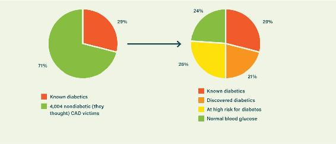
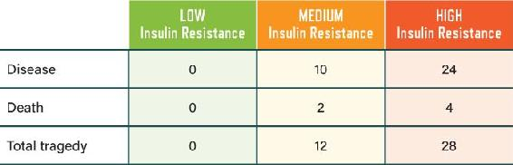
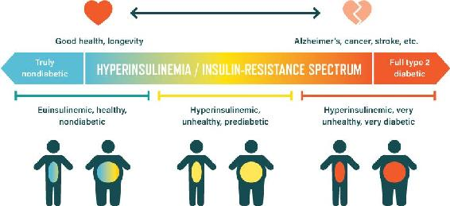
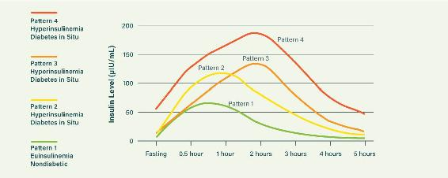
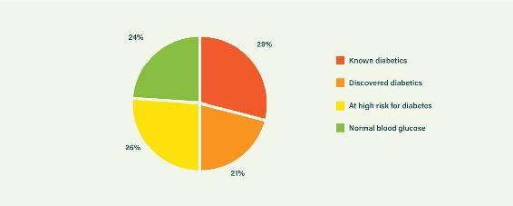
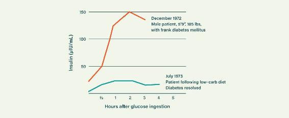
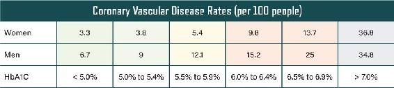
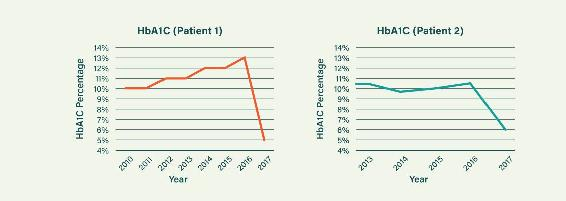

## CHAPTER 10

### MOST OF US HAVE DIABETES:

### INSULIN AS A MASTER GAUGE  
OF CHRONIC DISEASE

There are two rules of Longevity Club. The first rule of Longevity Club is, respect your insulin. The second rule of Longevity Club is . . . respect your insulin.

Okay, so that’s obviously paraphrased from *Fight Club.* It is entirely appropriate.

This chapter is perhaps the most important one in the book. There is no more important factor in weight loss and longevity than your insulin status—period. The single unifying factor among people who live to over one hundred years of age is a low insulin status.^1^

Insulin status is central to the modern epidemic of obesity and ill health. The profound importance of this truth is finally being recognized in the scientific literature.^2^ We have a terrifying obesity epidemic, intimately linked to high insulin. We have an exploding type 2 diabetes epidemic—also related to high insulin. We have a growing Alzheimer’s epidemic, with some leading researchers now calling the disease “type 3 diabetes” because it’s related to insulin resistance in the brain. And rates of cardiovascular disease are steadily growing out of control—yet another high-insulin issue.

We have failed to focus on the primary root causes of all these problems while distracting ourselves with surrogate sideshows.

### THE ROOT CAUSES OF MANY DISEASES

Heart disease is the world’s biggest cause of premature death. It beats all cancers combined, although cancer rates are catching up. Similar root causes drive both diseases, and many others. We must look at the young victims of heart disease to find out what the most important causes are. As mentioned in Chapter 4, teenagers who have the insulin dysregulation of MIRS can exhibit fifteen times the risk for heart disease by the time they reach their forties. Compare this to the statistical noise of cholesterol’s predictive power.

In 2015, the cardiology field was beginning to recognize the central importance of diabetic physiology in driving cardiovascular disease. Scientists had known for some time that diabetes drove heart disease like nothing else. But they also believed that diabetes was not overly common, even though rates had been climbing for years—there appeared to be many other important causes to focus on. But the 2015 EuroAspire study revealed the reality.^3^

In the EuroAspire study, researchers took a random sample of coronary artery disease (CAD) patients ages eighteen to eighty across twenty-four countries of Europe. (This paper uses the term “coronary artery disease” while we tend to use “coronary heart disease”; they’re essentially the same.)

First, they needed to take out the CAD patients who already had full-blown diabetes. Nearly a third of them turned out to be known type 2 diabetics. They didn’t need to look any closer at these guys. The study team already knew that type 2 diabetes massively drives coronary disease.^4^

But what was going on with the remaining folks, the apparently nondiabetic coronary-diseased people? What did their blood glucose metrics look like when scrutinized?

These “nondiabetics” were riddled with diabetes.

Coronary Disease Victims, Ages 18–80, Across All of Europe

Figure 10.1. More than a third of CAD victims were already diagnosed diabetics, but more than three-quarters were essentially diabetic. Source: V. Gyberg et al., “Screening for Dysglycaemia in Patients with Coronary Artery Disease as Reflected by Fasting Glucose, Oral Glucose Tolerance Test, and HbA1c: A Report from EUROASPIRE IV—a Survey from the European Society of Cardiology,” *European Heart Journal* 36, no. 19 (2015): 1171–77.

A shocking picture emerged.

-  Nearly a third of the “nondiabetics” were found to have full-blown diabetes. They are shown in the orange segment in Figure 10.1.

-  Over a third more were found to be at “high risk for diabetes” (yellow). Which, by the way, *is* having diabetes—“high risk for diabetes” is a misleading way of putting it. Even though standard lab tests for diabetes focus on blood glucose, you can be diabetic while your glucose metrics remain normal if you have elevated levels of insulin, which would keep your glucose under some control. By the time your glucose metrics show that you’re at “high risk for diabetes,” your blood glucose has actually been spiraling for some time—it’s just that now your insulin can no longer control it. (This is why testing insulin levels is a much better way of evaluating diabetes risk.)

-  The remaining third appeared to have reasonable blood glucose metrics (green). But, as mentioned above, blood glucose is a very weak measure for identifying diabetes. You need to use insulin measures to properly test for this disease. We predict that if insulin had been properly tested, many of these people would have insulin-signaling issues. In other words, they would be shown to be essentially diabetic.

Diabetes is a vascular disease. It manifests itself specifically through vascular damage. Here’s how renowned pathologist Dr. Joseph R. Kraft, whose pivotal work on insulin response we’ll discuss shortly, put it: “Based upon my several thousand autopsy examinations, the pathology of diabetes is vascular. The initial manifestation of the pathology of diabetes is atherosclerosis. The pathology begins when the blood sugars are normal.”^5^ Blood sugar may be normal in these cases, but insulin isn’t.

The reality is that coronary artery disease is overwhelmingly the vascular disease of diabetes. To avoid it, you mainly have to ensure that you are the exact opposite of diabetic—that you’re insulin sensitive. There are other elements, but being insulin sensitive will mostly put you in the clear. The focus on cholesterol has been a weapon of mass distraction from the real cause of CAD for more than fifty years. We can’t get that time back—the millions who were lost shall remain lost.

Another landmark study released in 2015 provides another bombshell. It reveals that *the majority of adult Americans are now essentially diabetic.*^6^ The distinction between prediabetes and diabetes is arbitrary and misleading—it’s based only on how much the diabetic problem has progressed. Currently prediabetes is only called diabetes when you have* late-stage* insulin dysfunction and your blood glucose has finally gone out of control. We don’t make a distinction between prediabetes and diabetes, because doing so makes no sense whatsoever. The diabetic disease state is an insulin disease state—one of hyperinsulinemia (high insulin) and accompanying insulin resistance. And the reality is that most Americans now have some form of it, no matter what it’s called. The more hyperinsulinemia and insulin resistance you have, the higher your risk of death, not just from cardiovascular disease but also from a dizzying range of common diseases that drive early mortality, including Alzheimer’s, cancer, and other diseases of the liver, kidneys, and other organs.

### FORGET GLUCOSE—THINK INSULIN

How did we reach a point where the majority of adult Americans are now essentially diabetic—a situation in which the rising rates of cardiovascular and other diseases are being driven by this modern epidemic?

We must always remind ourselves that type 2 diabetes is a disease of hyperinsulinemia and insulin resistance, not a disease of blood sugar. (And throughout this chapter, when we refer to “diabetes,” we mean type 2 diabetes—it’s the form of diabetes that can be prevented through diet and the form that’s ravaging America today.) It is fundamentally a disease of damaged insulin signaling. Therefore, the correct way to diagnose the problem is to scrutinize blood insulin metrics, which is rarely done.

How did the research on how diabetes works not lead to routine insulin testing as part of a regular checkup? The problem is that a major symptom of late-stage diabetes is elevated blood glucose. Tragically, it was possible to measure glucose long before measuring insulin became simple to do. As a result, diabetes became mistakenly defined as a disease of blood glucose levels. The implications of the mistake have been devastating.

True, an elevated fasting blood glucose is very damaging to the body’s blood vessels and organs. But high blood glucose only develops after decades of high insulin have already wreaked havoc—by then it’s too late for most people. Countless people who don’t even know they have diabetes die of cardiovascular disease and other diseases long before they get any warning. To find out in time that you are heading for the rocks, you need to focus on your insulin signaling. It will tell you when the problem starts.

People with full-blown diabetes exhibit increased rates of most chronic diseases. This is to be expected. This occurs because a diabetic state is ultimately a state of accelerated aging. The usual effects of aging are, among others, oxidative stress, cellular damage, and failing repair mechanisms. Diabetes hypercharges these processes, which is why it has such grim implications for mortality. The legions of undiagnosed diabetics around us are all suffering from the results of this accelerated aging: elevated risk for cancer, arthritis, Alzheimer’s, and more. They also suffer greatly from vascular damage and chronic infection, which lead to limb amputations, loss of eyesight, and other dreadful afflictions—the list goes on and on. Because most American adults now share this insulin-regulation disease, the majority of them are experiencing chronic afflictions long before they should. This situation is the primary cause of early mortality.

### INSULIN: A BILLION YEARS IN THE DRIVER’S SEAT

Insulin is one of the oldest molecules in the biology of life on our planet. Many estimates put its origins in the primordial past—more than eight hundred million years ago.

LOW INSULIN AND HIGH CARB?

Historically, the many tribal populations that consumed low-carb or keto diets (Maasai, Inuit/Yupik, !Kung, and others) achieved very low insulin with ease. In fact, one study suggests that “nearly 9 out of 10 of the diets of hunter-gatherer groups had less than a third of calories coming from carbohydrates.”^7^ But interestingly, even tribal populations eating a higher-carb whole-foods diet often have good health and low insulin. For example, the indigenous Kitavan people in Papua New Guinea are the clichéd paragon of slimness, health, and long life—in spite of eating significant quantities of whole-food, non-refined carbohydrates. Despite the carbohydrate in their diet, they achieved very low insulin levels. But their unparalleled application of the other rules enabled them to manage the glucose load.

Sadly, trying to achieve low insulin with a high-carb diet by following the other rules is a risky strategy in the modern environment, outside the hunter-gatherer lifestyle—adherence is difficult and failure widespread. There is no question that the low-carb approach is vastly more appropriate and workable for our modern population. It is a no-brainer due to the massive advantage it brings. So there may be different routes to optimal health, but the smart people go with the superior route. And the target always remains the same:

Achieve low insulin.

Life on Earth began in the oceans. Success was determined by what could reproduce most effectively. Glucose was the primary fuel source a billion years ago. Early life-forms developed nutrient-sensing molecules that would enable rapid reproduction when glucose was plentiful. They would also trigger a lockdown survival mode when it was not. Although much has since changed, these fundamentals remain. The most crucial of these nutrient-sensing molecules was insulin.

Organisms became more complex with time and the changing environment. While early life-forms didn’t require oxygen to use glucose—there was no oxygen in the atmosphere back then—as oxygen increased in the atmosphere, organisms evolved to use it to produce energy. The earliest oxygen-using cells were mitochondria, and with time they were incorporated into other organisms. They gave these mother organisms the ability to burn fat as a fuel, using oxygen to do so. We humans now have trillions of these mitochondria in our bodies. Without them and their fat-burning ability, we would cease to exist. They are our power plants, built into our bodies during a billion years of development.

Insulin was the first nutrient sensor and triggered rapid growth when glucose was plentiful. Other sensors developed later as the organisms became more complex. We now have insulin (for glucose), mTOR (for protein), and leptin (for fat). The interplay of these sensors is critically important. Insulin and leptin are hormones released by our pancreas and our fat cells, respectively. mTOR is like a complex microprocessor that responds to dietary protein directly, but also to all other dietary elements through insulin and other diet-driven signals—it integrates the signals from many other feedback loops. All three sensors work together to keep our bodies running optimally. They manage the harsh nutritional environments we encounter. When their signaling is damaged, disease results.

When dietary glucose is kept moderate or low, our bodies perceive that a challenging environment exists because we evolved from single-cell organisms that were forced to rely totally on glucose. Like those early life-forms, the body focuses on extending life through many mechanisms in order to survive until conditions improve. We can tap into this ancient machinery for our longevity advantage.

Insulin also promotes growth—beneficial growth when insulin is at appropriate levels, bad kinds of growth when it is too high. An example is the dangerous “growth” of our blood vessel walls in diabetes and cardiovascular disease, as they swell from inflammatory insults and debris buildup. Here’s another example: when insulin and glucose are high, exposing us to factors that disrupt our cellular-signaling systems, our cells tend toward triggering their ancient genetic desire to reproduce as fast as possible. We now have a name for this kind of phenomenon. We call it “cancer.”

### INSULIN THE MASTER HORMONE

The power of hormones becomes clear if you consider the example of adrenaline. Anyone who has experienced panic knows what it feels like: rocketing fear, racing heart, explosive perspiration. Hormones carry massively powerful effects.

Insulin is also a hormone, one released by the pancreas. Here’s how it works: When carbohydrate foods reach your upper intestine, they trigger another key hormone, glucose-dependent insulinotropic polypeptide (GIP). This carb-driven spurt of GIP streaks to your pancreas and to your fat cells. In the pancreas, it triggers a surge of insulin release. In fat cells, it gets things ready for fat-storage mode.

The surge of insulin flashes around your body, triggering your cells to get ready to absorb glucose. It stops the release of other hormones, such as glucagon, in order to prevent inappropriate glucose production in your liver. It tells the hypothalamus in your brain that glucose is on the way in order to control your appetite. It tells your body to stop burning fat and preferentially burn the glucose coming down the hatch—glucose is dangerous if it remains at a high level in the bloodstream, so it must be prioritized for burning immediately or be turned into body fat for storage. Insulin does all this and much more. It is truly the master regulator of your body.

If you keep your insulin levels low, all these signals are highly effective. Your body will stay exquisitely sensitive to insulin’s messages. This is pivotal for longevity and slimness. There are many strategies for keeping your insulin low. Here are a couple of the most important approaches, all of which were discussed at length in Parts 1 and 2:

-  Don’t consume too much carb, which is mainly made up of glucose.

-  Don’t consume processed carb or processed vegetable oils.

-  Absolutely don’t ingest carbs along with fatty foods—a very bad combo indeed.

-  Don’t consume too much fructose.

-  Do not eat frequently—rather, eat well-spaced meals. Snacking screws up your insulin signaling.

Excessive carb drives excessive insulin. Processed carb in particular leads to explosive GIP release in the gut—driving truly excessive insulin. Carb and fat together really jack up GIP and consequently insulin. Fructose drives insulin problems in the liver, promoting bad cholesterol along the way. These are the main mechanisms that a low-carb, high-fat diet tackles.

There are also emerging studies that show that gut microbiome problems—issues with the balance of good and bad bacteria in your gut—can also drive insulin dysregulation.^8^ In fact they may be very significant drivers in the modern population. Luckily, the steps to improve your microbiome are largely the same steps you would take to tackle insulin problems directly.

Finally, insulin acts as a master gauge to flag many other things that are damaging your body. Insulin and insulin resistance both rise in response to chronic stress, poor sleep, smoking, air pollution, infections, and many other insults.

The bottom line? Respect your insulin—and do everything you can to keep it low and healthy.

### DR. REAVEN KNEW THE SCORE

What is the consequence of not respecting your insulin—of triggering it too much and too often? In short, you will embark on a long steady descent into chronic disease. You’ll also greatly reduce your ability to maintain a healthy body weight. There’s no beating the science on this one.

Gerald M. Reaven is an American endocrinologist and professor emeritus in medicine at the Stanford University School of Medicine. Reaven’s work on insulin resistance and diabetes goes back to the 1970s. He created the term *metabolic syndrome* to describe humankind’s epidemic insulin dysfunction (we’ve referred to it as metabolic insulin resistance syndrome, MIRS—see here). After decades of work, he understood the enormous implications of this problem. In 2012, he finally conducted a study to verify how massively important it really was. The results surprised even him.^9^

Reaven and his team randomly selected 208 apparently healthy middle-aged people. None were obese. Not one of them had a body mass index over 30, the standard cutoff for obesity. The research team measured their insulin status using an extremely accurate method (SSPG). The method was very important to get right. One of the reasons that the importance of insulin is grossly underestimated is that poor methods have been and are being used to measure it. Reaven did not make this mistake.

The team split the participants into three groups based on their insulin status: low, medium, and high. Then they monitored them for more than six years to see how they fared. Here’s what the researchers found: *all that really mattered was insulin status.*

Figure 10.2. Our future health depends on our place on the insulin spectrum. Source: F. S. Faccini, N. Hua, F. Abbasi, and G. M. Reaven, “Insulin Resistance as a Predictor of Age-Related Diseases,” *Journal of Clinical Endocrinology & Metabolism* 86, no. 8 (2001): 3574–78.

As you can see in Figure 10.2, the one-third who were lowest in insulin had no incidence of disease or death. The middle third had twelve disease diagnoses; of those, two had died by the end of the study. The upper third had twenty-eight disease diagnoses; of those, four died. The diseases seen in the participants were the usual ones that have been connected to insulin issues for decades: type 2 diabetes (5), heart disease (7), cancer (9), hypertension (12), and stroke (4). As mentioned, most diseases of aging are intricately connected to insulin and its connected biochemical pathways. When it is not causing problems, insulin acts as a master gauge of these diseases.

It is important to note that when a study uses a moderate sample size like this and participants are chosen in a fair and random manner, the conclusions cannot be questioned. More than two hundred people, correctly sampled, is a sample size plenty large enough to statistically prove the relevance of variables.

The team carried out a thorough analysis of the data. No factor among the many other measurements taken was significant, other than insulin—the insulin-resistance measure was the key. When corrected for this factor, cholesterol levels and other supposedly important variables collapsed. The team’s conclusion: “The fact that an age-related clinical event developed in approximately 1 out of 3 healthy individuals in the upper tertile of insulin resistance at baseline, followed for an average of 6 years, whereas no clinical events were observed in the most insulin-sensitive tertile, should serve as a strong stimulus to further efforts to define the role of insulin resistance in the genesis of age-related diseases.”

Cholesterol has never predicted disease the way insulin does. Cholesterol doesn’t even properly predict heart disease alone, never mind the other diseases. For associational studies to carry weight, a variable’s “risk multiplier” should exceed 2x—the variable should at least double the risk. If the risk multiplier exceeds 5x, there is likely something pretty serious going on. What was the risk multiplier for insulin resistance here? *40x!* The risk multiplier for high LDL was 1.001x—there was no statistical significance. Reaven’s study can be put alongside massive volumes of mechanistic and other data gathered previously on the connection between insulin dysregulation and disease. He has elegantly demonstrated that insulin, a nearly billion-year-old molecule, dominates our disease landscape.

### THE INSULIN-CENTRIC STRATEGY FOR LOSING WEIGHT AND LIVING LONGER

We are not simply “healthy” or “unhealthy” when it comes to insulin. We are all on a spectrum of health. There are, for sure, many causes of chronic disease, but most can be managed by focusing on insulin metrics. This is why insulin dysregulation is the biggest thing you need to address. When you address this you will improve your health enormously.

The diagram on the facing page may help you visualize how the population is spread across the insulin spectrum.

We can be anything from truly nondiabetic (left) through to full-blown diabetic (right), or anywhere in between. We estimate that those safely at the left are in the minority nowadays.

You will also notice that there are relatively healthy fat people in the safe zone. There are also very unhealthy slim people in the dangerous zone. This illustrates a hugely important fact: it is not your body weight that dictates your fate. Your health depends on the health of your fat tissue, not the quantity of it.

Insulin sensitivity starts with cells: just like the body as a whole, individual cells can be insulin resistant or insulin sensitive. Many people can have a lot of fat tissue whose cells are in a healthy, insulin-sensitive state. These people are referred to as “metabolically healthy obese.” They can remain insulin sensitive throughout their bodies, and they have relatively low risk for disease.

Conversely, there are countless people who appear slim but whose fat tissue is unhealthy, insulin resistant and inflamed. This leads to whole-body insulin resistance. These people are referred to as “metabolically unhealthy normal weight,” or “thin outside, fat inside.”

Your whole-body insulin sensitivity depends hugely upon the health and sensitivity of your fat tissue. We’ll talk about this more on here.

The Insulin Spectrum

### THE GENIUS OF DR. JOSEPH R. KRAFT

If you wish to resolve insulin issues and move to the safe end of the insulin spectrum, you need to appreciate the incredible work of Dr. Joseph R. Kraft. Kraft was an expert pathologist and a doctor of nuclear medicine (one of only a few in the US). Over his career, he managed to generate some of the most important data ever gathered in medical history. He decoded the puzzle of insulin resistance and disease well before Reaven. What’s more, he verified his hypothesis with five-hour insulin tests he conducted on nearly fifteen thousand people.

In the 1960s, Kraft pioneered the glucose tolerance with insulin assay method of showing insulin status. His work spanned three decades of investigation and looked at 14,308 individuals ages eight to eighty-eight. Crucially, Kraft recorded the *pattern* of insulin response for all of his patients—how their insulin rose and fell after eating. Kraft discovered that there were only five types of patterns. The first four patterns are of most interest for our purposes (the fifth pattern relates more to type 1 diabetes).

Figure 10.3 on the following page shows these patterns of insulin response after eating. The green line is the pattern seen in someone who is healthy and truly nondiabetic. Kraft called this *euinsulinemia* (*eu*, Greek for “good,” +* insulin *+* emia*, Greek for “blood”). This response means there is a normal (appropriate) insulin response to carbohydrate.

Kraft Patterns: The Earliest Diagnosis of Diabetes

Figure 10.3. Kraft patterns: to truly tell if you are diabetic or healthy. Source: J. R. Kraft, “Detection of Diabetes Mellitus *In Situ* (Occult Diabetes),” *Laboratory Medicine* 6, no. 2 (1975): 10–22.

The red, orange, and yellow lines show varying degrees of dysfunctional insulin response. People with these patterns essentially have a diabetic physiology, even though the vast majority Kraft identified with these patterns had apparently normal blood glucose measures. Kraft called their disease state “diabetes in situ,” and he saw that only 10 percent of his diabetes-in-situ patients failed the standard fasting glucose test. In spite of passing these tests, they were “secret diabetics.” Their dysfunctional insulin response would never be seen by the standard diabetes tests—but they would continue to suffer the vascular damage of diabetes regardless.

From his research and pathology expertise, Kraft knew that these people’s arteries were burning up with atherosclerosis, which is fundamentally an inflammatory disease. He realized that diabetes was everywhere. And this was back in the 1970s. Huge proportions of the population that did not register as diabetic under the standard criteria were nonetheless diabetic. And they would suffer all the vascular disease that goes with it.

Kraft rightly called his pattern test the earliest laboratory diagnosis for diabetes. It remains so to this day, but pretty much no one is using it. The majority of diabetics remain undiagnosed. Kraft stated in his 2008 book, “Those with cardiovascular disease not identified with diabetes are simply undiagnosed.”^10^

Coronary Disease Victims, Ages 18–80, Across All of Europe

Figure 10.4. Kraft was mostly correct: the majority of CAD victims are essentially diabetic. Source: V. Gyberg et al., “Screening for Dysglycaemia in Patients with Coronary Artery Disease as Reflected by Fasting Glucose, Oral Glucose Tolerance Test, and HbA1c: A Report from EUROASPIRE IV—a Survey from the European Society of Cardiology,” *European Heart Journal* 36, no. 19 (2015): 1171–77.

Are most or even all of cardiovascular disease victims really secret diabetics? Let’s look at the EuroAspire study results from here again—shown once more above, in Figure 10.4.

We see from these results that Kraft was at least 76 percent correct—76 percent of CAD patients turned out to have some level of diabetes according to blood glucose tests. The remaining 24 percent were not tested using insulin measures, which might have revealed that they, too, had diabetes.

It is important to remember that these insulin measures reflect the presence of a wide range of disease root causes. Many disease-causing factors—such as bad diets, overeating, smoking, an imbalance of gut bacteria, infections, and more—lead to elevated insulin and insulin resistance. The state of hyperinsulinemia itself is a causal driver for disease, too. So without quantifying every cause-and-effect loop, we can rest assured of the importance of Kraft’s test.

In short, all bad roads lead directly to both disease and the near-universal evil of insulin dysregulation—which also drives disease risk. There is a seething hive of cause-and-effect loops at the center of this mess. That is why insulin metrics are so crucial in the world of heart disease and other diseases of modernity.

Managing Diabetes with a Low-Carb Diet

Figure 10.5. Dr. Kraft was fixing diabetes with low-carb diets—in 1972. Source: J. R. Kraft, “Detection of Diabetes Mellitus *In Situ* (Occult Diabetes),” *Laboratory Medicine* 6, no. 2 (1975): 10–22.

Dr. Kraft had extraordinary success healing his diabetic patients with low-carb diets. Take a look at Figure 10.5 above.

Both lines of this graph show the insulin response of one patient. The upper curve shows results from December 1972, and you can see it fits the nasty hyperinsulinemic pattern 3. The lower curve represents the same patient’s response in July 1973, after eight months on Kraft’s low-carb dietary management, and shows a lovely low-insulin response.

If you are interested in finding out where you are on the insulin spectrum, one excellent way is to use a simplified form of Kraft’s five-hour test, a two-hour insulin reading. This is achieved by drinking 75 grams of glucose solution and then getting a blood insulin test two hours later. If your insulin is below 30 µIU/mL, you would very likely pass a full Kraft test. If it is above 40 µIU/mL, however, you would very likely fail the full test.

### BLOOD GLUCOSE AND A1C

Having high insulin levels is part of what causes damage to your organs, for sure. But if you’re in the bad zone of the insulin spectrum, to varying degrees, high blood glucose also wreaks havoc in your body, especially in the period following your meals.

Fasting glucose is a weak measure to judge health by, as we’ve said. Your arteries will have paid a heavy price by the time this goes out of control. The main value of a blood glucose measure is that if you take it after you have eaten a meal, it will at least flag a problem earlier than a fasting glucose measure would, giving you more time to fix it. But neither post-meal glucose nor insulin are regularly tested as part of a routine checkup.

Glucose is a biologically active molecule that can chemically damage many elements in your body. Your body controls blood glucose in an extremely tight range. Moving above this range is seriously damaging to all organ systems, and your arteries particularly feel the pain. The higher your glucose level, the more damage that occurs. The majority of American adults have experienced the negative effects of excess glucose in their system. This is the price we have to pay for using the stuff to fuel our bodies. It is a very small price for healthy people, but it is a terrible price for the diabetic majority.

Glucose is a sticky molecule that interacts badly with other molecules in your body. The process of glucose-driven damage is called *glycation*. Too much of this phenomenon is very bad news. Testing your red blood cells is a great way to estimate your glycation damage. Over their life cycles—approximately three to four months—red blood cells are constantly exposed to glucose in the bloodstream. They steadily become glycated. The measure of this glycation is called HbA1c, or, more simply, A1C.

You can think of A1C as a pretty good indication of your average blood glucose levels for the past three months. It will generally reveal significant problems with post-meal glucose spikes—not always, but generally. This test is usually only done for people who have already been diagnosed with diabetes. The vast majority of secret diabetics don’t get tested. A pity, but that’s the way our health system rolls. If you ask your doctor to measure your A1C level, you will get to see how bad your diet is. Your A1C level can also indicate if early mortality is in your future.

A very revealing and well-executed study provides data linking A1C and heart disease and mortality rates. The Norfolk Cancer Study focused on cancer, as the name suggests, but the researchers were taken aback at what elevated A1C meant for the risk of other diseases.^11^ They were particularly impressed with the connection to “all-cause death rate.” This, of course, is the most important metric of all.

The research team corrected for as many “confounding factors” as they could. These are factors that changed along with the factor being examined and may have contributed to the increased risks observed. But after correction, they still identified A1C as an *independent* risk factor for cardiovascular disease (CVD)—it was associated with the higher risk all by itself. (Note that CVD is largely just another term for coronary heart disease, but it also includes the damage caused by the same vascular issues across the whole body.)

Figure 10.6. Coronary disease risk and risk of early mortality both ramp up with higher HbA1C. Source: K. Khaw et al., “Association of Hemoglobin A1c with Cardiovascular Disease and Mortality in Adults: The European Prospective Investigation into Cancer in Norfolk,” *Annals of Internal Medicine* 141, no. 6 (2004): 413–20.

As the A1C measurement increases, the associated risk of CVD rises powerfully. As you can see in Figure 10.6, for both men and women, the lowest rates of CVD were associated with a healthy A1C of 5 percent or lower. For men, an A1C above 6.5 percent gave subjects 3.5 times the risk of CVD, while being above 7 percent gave them nearly 5 times the risk. For women, an A1C above 7 percent gave the subjects ten times the risk of CVD.

Those figures are powerful associational evidence. The scientific literature is packed with papers describing the mechanisms whereby elevated blood sugar causes dysfunction—in other words, there’s plenty of mechanism evidence, one of the three pillars of proof from Chapter 2. Researchers are not ethically allowed to acquire experimental evidence—to drive up A1C and see what happens. They would not knowingly feed a subject with a high-carb diet for ten years in order to raise his A1C and see what happens over time. This experiment, however, is being carried out by millions of people every day. The primary way to drive up blood sugar is to indulge in excessive carb consumption. In huge numbers of people, we’ve seen this drive chronic disease and early death.

One problem with A1C is that it is a late-stage indicator of problems. By the time this metric is high, you will have been essentially diabetic for many years. That said, you may find it interesting that no one really talks much about A1C outside of diabetes management. What a shamefully wasted opportunity to improve our collective health.

Figure 10.7. Risk of early mortality ramps up with higher HbA1C. Source: K. Khaw et al., “Association of Hemoglobin A1c with Cardiovascular Disease and Mortality in Adults: The European Prospective Investigation into Cancer in Norfolk,” *Annals of Internal Medicine* 141, no. 6 (2004): 413–20.

Let’s now ponder the “all-cause death rate” linkages to A1C level, as shown in Figure 10.7. These are simply mortality rates, from all causes (heart disease, cancer, diabetes, respiratory disorders, infectious diseases, etc.), arranged by A1C level. But the association is stunning: if your A1C is high, the reaper is not too far away. You’re most probably overweight as well, but not necessarily. Millions are burning up in the insulin spectrum without being overweight.

The good news is that if your A1C is high, you can collapse it down to safe levels in no time by following our plan. Figure 10.8 below shows the dramatic response seen by just a couple of Jeff’s many patients who have achieved this.

Figure 10.8. What can be achieved through our dietary strategy—and very quickly. The steep drop in 2016 begins with the adoption of a low-carb diet.

### ESCAPING TO SAFETY

There is so much more we could say about the link between insulin, glucose, weight loss, health, and longevity. If you’re interested in exploring this further, Appendix D (here) elaborates on the mechanisms of hyperinsulinemia and how your body can actually degenerate into the insulin-resistant state.

Escaping to the safe end of the insulin spectrum is easy for many people. For these people, simply following a well-formulated low-carbohydrate diet will do the trick. But we would be oversimplifying things and doing you a great disservice if we left it at that. (For instance, as mentioned on here, a small minority of people can experience problems with certain types of animal products when taken to excess. These people may need to be more careful in which healthy fats they focus on.) There are many drivers of elevated blood glucose and insulin, and each individual will have to address them as required.

The truth is that longevity is a multifactorial matter, and many important factors vary depending on the individual. We want you to address all the necessary factors in order to assure your long-term health and vitality. We want you to eat rich and live long.

LEANN’S STORY

Leann is a patient of Jeff’s who collapsed her A1C easily and was able to drop medications at the same time. Leann is now eating well and set to live a lot longer, having rapidly resolved her diabetic dysfunction.

Leann’s family history was riddled with heart disease, obesity, vascular problems, and diabetes. Her father died at fifty-six from congestive heart failure; her mother also had congestive heart failure and bypass surgery; and all four of her grandparents had died from some type of heart or vascular problem. Due to this history, Leann arranged for a full medical exam back in the nineties. She was astounded to learn that not only was she diabetic, but her A1C was nearly three times what was considered normal. She was immediately started on metformin, a medication that lowers blood sugar through different mechanisms than insulin does.

Over the years, her dosage of metformin was increased, until she reached the maximum permitted. Her weight also skyrocketed to 314 pounds. She had tried time and time again to lose weight and failed. It really felt as though she was never going to lose weight, and what’s more, she was always hungry.

Leann saw a doctor at a major university medical center for several years, and the doctor regularly wanted her to enter various studies where insulin was the protocol. Lifestyle intervention was hardly discussed. She was simply told to adjust her insulin dosage in line with her carbohydrate consumption. Something didn’t feel right about it for Leann—both her parents had ended up on insulin, and neither ever reached good blood sugar control. Both also gained a scary amount of weight. Her doctors also prescribed multiple other drugs, the last of which was from the class of sulfonylureas, which can have permanent and damaging effects on the pancreas, the very organ that produces insulin. A week after being on the sulfonylurea, Leann was having trouble breathing. She stopped taking it. She really felt defeated and fearful that she would end up like the rest of her family.

With a copy of her bloodwork in hand, Leann sat down with her wife, Sharon, who was working to become a dietitian. Throughout the 2016 holiday season Sharon read study after study on diabetes. When her research was completed, she had closed in on a rather unconventional strategy. Sharon insisted that Leann focus on limiting carbohydrate rather than counting calories or anything else. She wanted her to immediately adopt a ketogenic diet (a *very* low carb, high-fat diet—see here). In January 2017, Leann began her ketogenic journey. It had dramatic effects on her health.

Within a week of lowering her carbohydrates significantly, Leann had an amazing burst of energy. She started taking the dog for walks and was starting to look for new activities to do other than sit around waiting for her next meal. She saw 15 pounds come off that first week. It was very encouraging, and she felt great! She lost weight and did not feel hungry or in the least deprived. In mid-February, Leann bought a fitness tracker to monitor her walking. She was walking between twelve thousand and twenty thousand steps per day. Her coworker thought she was a bit nuts as she was now up actively moving and pacing the halls with her wireless headset while waiting to start conference calls.

By mid-March, Sharon and Leann were excited about the weight loss and figured that Leann’s A1C must have dropped somewhat. Leann knew she did not want to go back to the university for another visit because, along with pushing her toward insulin studies, they were constantly calling and sending her referrals for a diabetes educator. She had met with the educator once early on, and his suggestion was low-fat dieting—eating things like plain oatmeal and salads and staying away from healthy fats. She had been down that path before, had been constantly hungry, and couldn’t maintain the diet.

Leann wanted a doctor who would be keto-friendly and made an appointment to see Jeff in April, just three months into her low-carb lifestyle.

When Leann arrived at the office, she had already lost 50 pounds. Jeff joined her in the exam room, and they talked for roughly twenty minutes before he jumped up and wanted to test her A1C right there in the office. They started to discuss what they thought it would be. She had never had a value below 6.5, so she was thinking it would be somewhere around 8.5, an improvement considering that she’d been at 12 in January. Jeff suggested it might be much lower, based on the details of her successful keto journey to date. He was right—the value came back at 5! Leann was thrilled. In three short months she had lost 50 pounds and reduced her A1C by nearly 60 percent, without injecting any insulin! Based on the Norfolk Study data mentioned on here, her risk of coronary heart disease may have dropped by a huge degree.

In another six months Leann lost 50 pounds more, bringing her total weight loss to more than 100 pounds and counting. She also feels more energetic than ever. She is continuing to refine her eating in order to consistently keep her ratio of fat, protein, and carb in the target zone of 70 percent, 20 percent, and 10 percent, respectively. She continues her follow-up appointments with Jeff and is now confident that she can avoid the fate of her diseaseridden relations.
