## CHAPTER 11

### FIXING HEART DISEASE:

### CHOLESTEROL IS A WEAPON OF MASS DISTRACTION

“Stupidity is the same as evil if you judge by the results.”

—Margaret Atwood

In the last chapter we discussed insulin as the primary driver of heart disease, as well as many other chronic diseases. But most doctors continue to focus on cholesterol. The cholesterol narrative has distracted us from the genuine drivers of heart disease. It has also pushed us away from the healthiest diets. It has a lot to answer for. If you don’t know the truth about cholesterol, your efforts to achieve longevity will be undermined, as has occurred for the millions who went before you.

Cholesterol has dominated the preventative medicine sphere over the past forty years. Nothing else has even come close. This was partly due to the fact that it was one of the first simple blood measures that seemed to correlate with rates of disease, however weakly. Another major reason was that it was one of the few measures that would directly respond to an available class of drugs.

Cholesterol is carried in the blood in particles called lipoproteins. Current blood tests smash up these lipoprotein particles to get to the cholesterol. They then measure the amount of cholesterol that is carried within each lipoprotein. LDL is one type of lipoprotein particle; it’s called “bad cholesterol.” HDL is another type, called “good cholesterol.” But both LDL and HDL carry the exact same cholesterol molecules inside—there is only one type of cholesterol molecule. We should really say that LDL is a “bad lipoprotein” and HDL is a “good lipoprotein.” However, as we’ll soon see, even this would be a misleading way to put it. They are simply different kinds of particles with different yet equally important functions.

The truth is that when it’s high, LDL is sometimes associated with bad things—but it is a weak and erratic risk factor. When HDL is high, it is almost always associated with good things. It is a consistent and intriguing indicator. HDL has always been a thorn in the cholesterol story because it draws us away from the “cholesterol is bad” ruse and points us toward the genuine root causes of heart disease. Also, while many drugs have had success in lowering LDL, no drugs have successfully raised HDL. So HDL is doubly problematic for the storytellers: it raises awkward questions around true cause of heart disease, and it won’t cooperate with saleable drugs. HDL is therefore marginalized and pushed out of the discussion whenever possible.

### A CHOLESTEROL FABLE FOR THE AGES

The cholesterol story we have been sold has changed greatly over the past fifty years. It became clear over time that the original cholesterol theory was highly flawed, so the tale had to be twisted into new shapes to fit the desired message. Each time the existing cholesterol measurement was shown to be useless, a new one was found to take its place, so that everyone could maintain some confidence in the fable.

The changes happened roughly as follows:

- 1. Several decades ago we were all terrified of having a high total cholesterol reading. This number reflected all of the cholesterol transported by lipoprotein particles in the blood. After decades of throwing medications at this number, the focus on total cholesterol quietly dropped from favor. We now know that a higher total cholesterol number generally predicts a *longer, healthier life.* Oops.

- 2. Total cholesterol was then replaced by LDL, or “bad cholesterol.” LDL levels reflect the amount of cholesterol carried in the LDL particles. This was supposedly the proper cholesterol risk factor to use. But after years of throwing meds at LDL, this number has fallen out of favor too, because it doesn’t properly predict risk, either. High LDL can be associated with bad things, but so can low LDL—because LDL only hints at the *real* causes. The plot thickens.

- 3. As more and more researchers realized that LDL was misleading, the advanced lipoprotein test came to the rescue. Remember that the standard LDL metric only gives a measure of the cholesterol quantity inside the LDL particle. However, the advanced lipoprotein test counts the *number* and *size* of the LDL particles themselves. In a sense, this test measures the *quality* of the LDL particles, rather than simply the cholesterol inside them. As a result, it is a somewhat better predictor of any potential issues. But it is still looking at LDL instead of the real underlying causes, so the test can therefore be misleading.

You could be forgiven for wondering what the hell has been going on here. How did we spend decades prescribing meds based on the wrong measures? What’s more, huge numbers of doctors are still taking direction from the thoroughly debunked “total cholesterol” phobia. They are stuck in a cholesterol time warp, worrying about a meaningless number. Many more doctors are stranded in step 2 above, medicating based on LDL. Yet LDL as a direct treatment target has now been removed from the 2013 drug treatment guidelines produced by the American Heart Association and the American College of Cardiology.^1^ These folks who are worrying about LDL are still running aimlessly after the old-fashioned “bad cholesterol.” A small minority of doctors are at least working with the latest science and using advanced lipoprotein testing—but most of them don’t realize that the numbers are still mostly a reflection of something else.

The cholesterol story is both a wonderful and a terrible one: wonderful due to the beautiful elegance of our cholesterol-trafficking systems, terrible because we have misunderstood them for so long. We tragically blamed cholesterol rather than focusing on the real drivers of heart disease. Blinded by associations, we left the real causes off the hook—and we are doing so to this very day.

Dr. William P. Castelli, an expert in cardiology and data analysis, led what is essentially the biggest and longest-running coronary heart disease study in history: the Framingham Heart Study. What he said revealed everything that you need to know about LDL as a risk factor.

Since 1948, the Framingham study has tracked the health and lifestyles of more than five thousand people from Framingham, Massachusetts, looking for causes of cardiovascular disease. Castelli published a detailed paper in 1992 analyzing the data. Here we quote directly from it: “Unless LDL levels are very high (300 mg/dl (7.8 mmol/l) or higher), they have no value, in isolation, in predicting those individuals at risk of CHD.”^2^

He was absolutely correct about this, but the world was never allowed to hear this vital message. The outcome from Framingham was instead twisted to fit the required message. Simply put, the message was that LDL had to be the bad cholesterol. Everyone *needed* this message, because decades of official communications had already declared it from the rooftops. And so that’s what it was made to become. Castelli also established another extremely important fact: “The [total-to-HDL] ratio was found to be a better predictor of [coronary heart disease] than [total cholesterol], LDL, HDL and triglyceride, not only in the Framingham Study but also in the Physician’s Health Study and many other studies.”^3^

We will soon explain the importance of the ratios. But first, we’ll introduce you to the basic molecules that caused all the fuss.

### CHOLESTEROL AND TRIGLYCERIDE

Cholesterol is required for life on this planet. It comes from the sterol family of molecules, which are fat-like in nature. The cholesterol molecule enables the structure of cell walls. It is a vital building block for many hormones that are central in the control systems of our bodies. Cholesterol is a key part of the immune system and is central to the body’s tissue repair apparatus. The phenomenal human brain contains around 30 percent of the body’s cholesterol, even though the brain is only around 4 percent of our body weight. It is required for much more besides. Without cholesterol there would be no life.

We have around forty trillion cells in our bodies, so you have forty trillion reasons to be glad of cholesterol. With some exceptions, all of these cells are blessed with the ability to manufacture their own cholesterol. Cholesterol is that critical. Cholesterol is arguably the most important substance that evolution has designed to keep you healthy. You may rightly wonder how this fundamental requirement for health became something that scientists claimed was somehow conspiring to kill us.

Evolution is not an idiot. It’s not the cholesterol that is the problem but rather the system that manages it in the body, which can become dysfunctional. This is why cholesterol measures can correlate loosely with disease. This association has been hyped and pumped out to us continuously since the 1970s.

Cholesterol

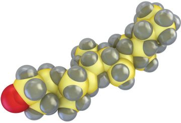

Cholesterol cannot travel around the bloodstream by itself, so nature has evolved some very special “boats” that carry cholesterol molecules safe inside them. These are lipoprotein particles. They are hollow spheres that travel in the bloodstream with the cholesterol packed safely inside. There is also another pivotal molecule that travels with cholesterol inside these lipoprotein particles: triglyceride.

A triglyceride molecule is simply three fat molecules grouped into one glycerol (or sugar-like) molecule. These triglyceride molecules can be consumed through fat-containing food. They can also be created in your liver. Your body assembles, disassembles, and transports triglyceride to fuel your body.

Trigylceride

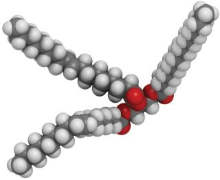

There can, however, be a bad side to triglyceride, if its level in your blood is higher than it should be. Excess fat in your blood is a major issue. Unfortunately this is the case for most people today, and the most common driver of high blood fats is excessive carbohydrate in the diet.

### THE LIPOPROTEINS

In 1928 French biochemist Michel Macheboeuf isolated a water-soluble lipoprotein now known to us as HDL. This complex macromolecule is capable of transporting water-insoluble substances, including cholesterol and triglyceride, in your water-based blood. Following World War II, progress was made in the emerging field of lipidology. In 1949, molecular biologist John Gofman identified a whole family of lipoproteins, including VLDL, LDL, IDL, and others. He was in turn followed by Fredrickson, Gordon, Olson, and Vester, who identified specific lipoprotein patterns associated with atherosclerosis.

All of these discoveries fueled the excitement about “cholesterol” (really lipoproteins) as a causal agent in vascular disease. Advances in measurement continued, and lipid metabolism surged forward as a hot new science. It was the newest kid on the block. By the 1970s, standard lipid testing had become widely available to doctors. Everyone was all over the exciting new tools.

A Lipoprotein Particle

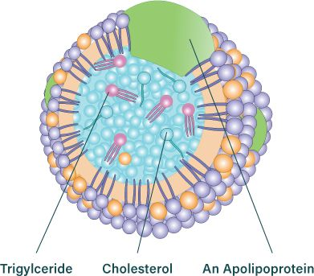

On the right is a simple drawing of a lipoprotein. Basically, the cholesterol and triglyceride molecules are packed safely inside the lipoprotein’s shell. Here they are safely stored for delivery to your brain and bodily tissues. Think of lipoproteins as boats with the cargo safely battened down in the hold. These lipoprotein boats can move freely through your bloodstream while keeping the water-insoluble cargo tucked inside. They travel in the millions on their delivery and collection missions. These boats need to clearly identify themselves in order to dock properly in many different harbors. They do this by signaling with a unique protein molecule wrapped around their outer shell: an apolipoprotein.

There are only two classes of lipoprotein particles that you need to know about. Having a grasp of how they work is very important.

#### WELCOME TO LIPOPROTEIN LAND

LDL and HDL are simply different types of lipoproteins. While the HDL lipoprotein is unique, LDL belongs to a family of LDL-class lipoproteins.

VLDL: Very low density lipoprotein (VLDL) is the mother of LDL—it’s where LDL originates. VLDL is the largest of the LDL-class lipoproteins. VLDLs are created by your liver and ferry triglyceride and cholesterol around your body. VLDL’s main function is to deliver triglyceride to be used as a healthy fuel in skeletal muscle, heart muscle, and many other tissues (especially if you are a fat-burner!). You can completely screw up your VLDLs by eating the wrong foods. It identifies itself with the B100 apolipoprotein.

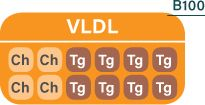

LDL: We now present the most feared lipoprotein in the world. Low-density lipoprotein (LDL) is formed as a VLDL particle gives up its cargo and shrinks in size. LDL still contains cholesterol and triglyceride (with relatively little triglyceride). LDL has many functions, covering both delivery and return trips in the cholesterol transport chain. It’s small compared to its mother, VLDL. Like the other LDL-class vessels, it identifies itself using the B100 apolipoprotein. You can *really* screw up your LDLs by eating the wrong foods.

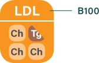

sdLDL: Now we’re getting to why little LDL got a bad name. While LDL has been designed by evolution itself, evolution didn’t quite plan on people messing up its structure or destroying its functionality, but that is what modern humans have been doing. Small dense LDL (sdLDL) is what results when LDL becomes distorted in an inflammatory environment. Your immune system recognizes a damaged or oxidized sdLDL particle as an unwelcome guest and tries to mop it up, but it often fails to manage this properly. The sdLDL particles may also be less likely to return to the liver, so they stay longer in the blood and have a greater chance of being damaged. The main reason why LDL is associated with so many problems is that it takes the rap for its deranged half brother. There is a time-honored and fully accepted way to make your LDL go bad, and it’s remarkably easy. All you need to do is to allow yourself to become insulin resistant. (Note, however, that there are also more benign reasons for having smaller LDL particles, so it can be a fallible marker in many people.^4^)

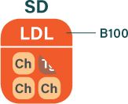

HDL: The most-loved lipoprotein is the celebrated high-density lipoprotein (HDL), which is created mainly in your gut. It has many important functions because it is really the master manager of the whole cholesterol and triglyceride transport system. As with LDLs, you can *really* screw up your HDLs by eating the wrong foods. For good health, you want to avoid a low HDL level at all costs, because low HDL is directly correlated with insulin resistance. HDL is small by design: the little fellow gets to all the places it needs to. It does an amazing job, unless you screw it up with what you put in your mouth. It is unique, and so it identifies itself using an A1 protein tag.

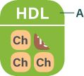

#### LDL FOR ENERGY AND CHOLESTEROL TRAFFICKING

Now we’ll reveal how these lipoproteins play in your bodily orchestra. Most importantly, we will explain how to avoid destroying their evolutionary function.

The VLDL particle is created by the liver. Its cargo hold is packed with fatty goods to meet the body’s needs. VLDL must “dock” with muscle and/or fat tissue before releasing its goods. After giving up its triglyceride cargo, the VLDL particle shrinks and transforms into an LDL particle. In spite of LDL’s fearsome reputation, there is nothing bad happening here at all. Evolution has given us LDL for a purpose. It works fine if you eat the kind of diet humans evolved eating, high in fat and low in carb.

But for the majority of people, especially as they get older, a high-carb diet tends to make VLDL particles large and triglyceride-rich. This is universally bad news. Large, triglyceride-rich VLDLs turn into smaller and denser LDLs that carry less cholesterol. With less cholesterol carried per particle, you need more LDL particles in circulation.

With more LDL particles in circulation, more particles are exposed to oxidative damage. Also, such dysfunctional systems damage the endothelium (the artery’s inner surface)—and this can certainly *cause* LDL to be a problem, too.

Ironically, breaking the rules of a healthy diet not only means more particles are there to be exposed to damage, but it also damages LDL particles itself. Damaged LDLs don’t get taken up properly by your liver; instead, your immune system has the thankless task of trying to mop them up. That means they hang around for longer in your blood (approximately four days rather than the ideal two days). You are now really playing with fire.

These damaged particles are a different breed of LDL that may not like going back to the liver. But there is a place where these problematic particles will end up: inside your inflamed arterial walls. This is what ultimately leads to arterial plaque, blockages, and, eventually, heart attacks.

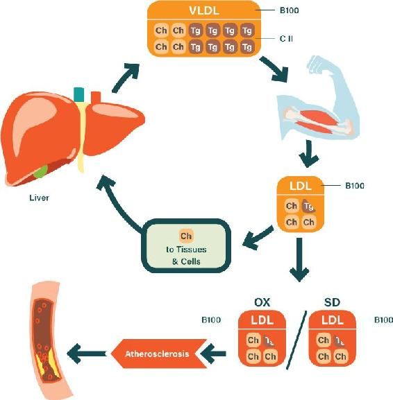

Figure 11.1. VLDL primarily transports triglycerides to muscles for energy purposes; after dropping off these molecules, it becomes LDL, which continues to transport triglycerides and also distributes cholesterol to tissues. Healthy LDL returns to the liver, where the cholesterol is recycled and reused. LDL can also become damaged, turning into sdLDL and oxidized LDL, which contribute to atherosclerosis.

Insulin resistance is a primary driver of sdLDL and oxidized LDL. It is also what helps link a high LDL count to higher disease rates. The amount of undamaged LDL has little relevance to disease for the vast majority of people, as long as they are not driving an inflammatory environment in their bodies.

Insulin resistance also promotes damage and weakness in your arteries through high blood pressure, high blood glucose, and many other mechanisms.^5^ Altogether, these effects are why we talk about insulin resistance as the primary factor in heart disease—and why the focus on cholesterol levels is, at best, a distraction from the real problem.

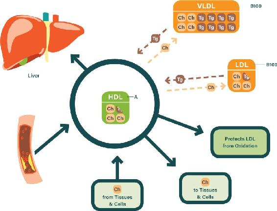

Figure 11.2. HDL is a wonder worker, keeping the LDL-class lipoproteins in healthy working order by managing their triglyceride and cholesterol content. HDL also protects LDL from oxidation damage and delivers vital cholesterol to the few tissues that cannot make their own. HDL even picks up excess cholesterol from tissues and extracts problematic deposits from athersclerotic plaques.

#### HDL FOR SYSTEM TRANSPORT, REPAIR, AND MAINTENANCE

HDL is more than just “good cholesterol.” It is something of a miracle worker. It plays multiple instruments in the lipoprotein orchestra. Let’s see how it all works—we’ll give you the super-short version.

HDL starts off as a simple protein. It then swells as cholesterol and triglyceride are added to it. Armed and ready, it carries out its many crucial functions:

-  swapping cholesterol and triglyceride molecules in and out of VLDL and LDL particles to balance the system

-  extracting excess triglyceride from VLDL and LDL particles to prevent them from becoming dysfunctional

-  collecting cholesterol molecules from cells where there is an excess

-  delivering cholesterol to the rare types of cells that can’t make their own

-  supplying the gonads and adrenal glands with cholesterol, which is needed to synthesize important hormones

-  carrying antioxidant artillery to protect the LDL lipoproteins from damage

-  removing cholesterol from places where it ought not be (like arterial walls)

And a lot more besides. All this HDL does tirelessly. HDL is evolutionary engineering at its best.

But one pivotal function of HDL is truly remarkable. HDL constantly manages the contents of the complete LDL class of lipoproteins, transferring cholesterol and triglyceride molecules in and out of the LDL particles. HDL conducts a complex dance to stop the LDL particles from becoming problematic.

However, HDL can only do so much. Push your system too far with what you eat, and even HDL will break down.

Losing your HDL functionality will cost you dearly. But it is happening all the time, to hundreds of millions of people around the world who are destroying their HDL through what they put in their mouths. A low HDL value is a serious problem. What is the best way to keep your HDL level high and healthy?

You need to keep both your insulin and your insulin resistance low.

### ESCAPING THE CHOLESTEROL MASS DISTRACTION

Castelli, the director of the Framingham Heart Study, whom we quoted earlier, rightly declared that LDL level is a useless measurement when taken alone (unless it’s absurdly high, which applies only to a fraction of a percent of people). Many studies since have proved Castelli to be absolutely correct, showing that both total cholesterol and LDL level don’t have any significant predictive power.

For example, a 2007 study looked closely at the later Framingham data for both men and women.^6^ It found that, while total cholesterol and LDL did not predict CHD events at all, the cholesterol *ratios* predicted CHD events very well. This is because the ratios are an excellent indication of your insulin-resistance level! We quoted Castelli on this ratio point earlier. Here’s what he said again (yes, it is that important): “The [total-to-HDL] ratio was found to be a better predictor of [coronary heart disease] than [total cholesterol], LDL, HDL and triglyceride, not only in the Framingham Study but also in the Physician’s Health Study and many other studies.”^7^ What Castelli did not understand at the time was that the ratio reflected insulin-resistance status rather than “cholesterol” issues per se.

A standard cholesterol panel is often provided in routine blood tests. This test method breaks apart all of the lipoprotein particles—smashes them open, if you will. What’s left behind is then analyzed. In this way you get the total amount of cholesterol and triglyceride that was carried within the lipoproteins. Therefore, all of these traditional tests quantify the amounts of triglyceride and cholesterol in your blood. It doesn’t look at the amount of each kind of lipoprotein at all, even though it’s only lipoproteins of a certain kind and size that you need to be concerned about. This is one of the many reasons why standard cholesterol panels are so misleading.

#### THE DANGEROUSLY MISLEADING LDL LEVEL

Your LDL number is the total, summed-up quantity of cholesterol carried by all your LDL-class particles. It should really be called the “LDL concentration,” and in fact in the scientific literature it is more properly denoted as “LDLc” or “LDL-C.”

If your LDL value is well above 200 mg/dL, it is more likely to have some meaning—that’s fairly high, and it can indicate that your blood is full of damaged LDL particles that contribute to arterial inflammation. But it still may not mean this at all—you must examine all the other values we’ve discussed (including HDL, triglyceride, insulin, and blood glucose) to make a call. Castelli went further and said it had to be above 300 mg/dL before it would be predictive on its own. Yet most doctors still draw meaning from the LDL value alone, regardless of how high or low it is. This is beyond tragic.

Ironically, people with the most serious issues can often have a *lower* LDL than healthy people, especially as they get closer to a heart attack. These unhealthy people have insulin-resistance problems, which means they have excessive triglyceride in their lipoproteins, which crowds out cholesterol. So these unfortunate people end up with a lower LDL value in the test even though they are on fire inside. Also, their HDL desperately tries to remove the excess triglyceride and becomes poisoned with it, driving down their HDL levels—blood tests reveal the problem elegantly. But the message to doctors has been to focus on LDL, not HDL, so the clues to what is going on are mostly missed.

This absurdity of using LDL as a measure of health was highlighted recently. In 2009, there was a massive study of nearly 137,000 people who presented in hospitals with vascular disease.^8^ More than 75 percent of these atherosclerosis-afflicted people had LDL levels well below the average. And the reason was not because they were taking lipid-lowering drugs, either. Only 20 percent of these people were on those drugs. LDL can also drop following trauma—but again, this did not account for the results. The outcome was rather due to insulin resistance—a *real* factor in heart disease. This was also flagged in the results, as the patients’ HDL levels were markedly lower than average. This same reality has been seen in many other studies, too.

In standard cholesterol tests, the LDL number is not even directly measured. It is estimated using an old and unreliable formula. This makes it even more undependable and misleading.^9^

We’ll now move to a far more useful metric: your HDL level.

#### THE RATHER USEFUL HDL AND TRIGLYCERIDE

Your HDL number is the total, summed-up quantity of cholesterol carried by your HDL particles.

Your HDL number does indeed have utility in assessing risk. There is genuine risk if the HDL value is below 40 mg/dL for men or 50 mg/dL for women (though ideally, HDL should be quite a bit higher than these targets). Low HDL consistently highlights genuinely problematic mechanisms in your body. It is a genuinely valuable flag that relates directly to the true root causes of disease.

One key problem with HDL occurs when HDL particles are forced to accept excessive triglyceride. This damages the HDL particle’s ability to function properly. Another is that excess insulin can damage HDL’s ability to remove problematic material from atherosclerosis-afflicted arteries.^10^ There are so many other important functions of HDL that interact intimately with insulin dynamics that we cannot even begin to detail them here.

In the 2009 study of nearly 137,000 people, the average HDL level was below 40. In comparison, the population average is approximately 50.

But HDL is not an infallible marker—no marker really is. You can have a high HDL and still have some disease risk—HDL functionality can be problematic even when the HDL level appears good. That is why it is very important to look at ratios, as we’ll discuss in a moment.

Your triglyceride number also has utility in assessing risk. Triglyceride is most useful as an indicator of insulin-signaling status—high triglyceride indicates that high insulin and insulin resistance are disrupting your system. Many guidelines suggest that triglyceride should be below 150 mg/dL, and this is fair. From extensive research, however, we would say that an ideal level would be below 100 mg/dL.

A high triglyceride value means that your LDL-class particles are carrying a heavier load than they’re designed to. As HDL attempts to manage this overload, the HDL value will be driven lower.

Triglyceride is a statistically noisy risk factor—its relationship to disease risk is quite erratic and variable, unless it is particularly high in value—for many mechanistic reasons. Its level can vary greatly, even among people who are at similar risk for atherosclerosis progression. If it’s below 100 mg/dL, however, it is highly likely that your insulin signaling is in a reasonably good state. If it’s above 200 mg/dL, your insulin signaling is pretty certain to be impaired.

It’s best to get your triglyceride measure from a nonfasting test. Many studies show that nonfasting triglyceride links very closely to heart attacks and risk of early mortality.^11^ This makes absolute sense because people who have a spike in their post-meal triglycerides are—you guessed it—insulin resistant.

### FOCUS ON THE RATIOS

Cholesterol ratios reign supreme in assessing real risk. You can easily calculate the crucial cholesterol ratios from the numbers on standard cholesterol tests. These ratios are a true indicator of metabolic health. They truly show how well your cholesterol transport system is functioning and genuinely reflect the underlying causes of vascular disease.

#### TRIGLYCERIDE/HDL

The shorthand for this ratio is “trig/HDL,” and it’s the best one from the cholesterol panel for assessing real risk.

A study as far back as 1997 came to the conclusion that this ratio is vastly more predictive than the LDL value.^12^ Nothing has since changed—for both heart disease and death risk, the trig/HDL ratio reigns supreme. Recent recommendations say that the value should ideally be below 2.0. Based on the science, the clear mechanisms at work, and all of the published risk data, we would aim lower: below 1.2, or even below 1.0.

The 1997 study we just mentioned showed that the 25 percent of people with the highest trig/HDL ratio values had nearly *sixteen times the risk for heart attacks* as those with low ratios. This risk barely changed when correcting statistically for a large range of variables. Trig/HDL even beats the latest advanced lipoprotein ratios much of the time. Other studies point to the extraordinary predictive power of trig/HDL for deaths from any cause.^13^ Yet more studies show that trig/HDL predicts atherosclerosis severity in patients—whereas LDL completely fails to do so.^14^ So why didn’t trig/HDL become the primary number used from the lipid panel? We can think of a few reasons for this:

- 1. It greatly undermines the theory that “high cholesterol” causes heart disease.

- 2. It particularly wreaks havoc with the simplistic “LDL = bad cholesterol” message.

- 3. Since high triglyceride and low HDL levels are closely associated with and directly caused by insulin problems, it focuses the spotlight on insulin signaling as overwhelmingly the primary problem in heart disease.

- 4. No patented drugs work properly to reduce this ratio. The trials on HDL drugs have bombed spectacularly. This is because low HDL reflects the underlying causes—shoving HDL up with chemical cattle prods doesn’t address these causes.

The predictive power of trig/HDL is to be expected. It is self-evident once we understand how the lipoprotein system interacts with insulin signaling. The mechanisms actually make evolutionary and technical sense (which is not the case with LDL). Trig/HDL is essentially a magnified measure of the insulin dysfunction that we discussed in Chapter 10.

When you have pushed your insulin signaling into a bad place, triglyceride levels tend to increase and HDL simultaneously drops. When this occurs, the trig/HDL ratio changes much more rapidly than these individual measures change. It is therefore a fantastic indicator of a system gone to hell.

So has your doctor been working to reduce your trig/HDL ratio to safe levels? He or she can of course do this by advising you to lower your ingestion of carbohydrate and increase your healthy fat intake. If he or she has been advising this, you are one of the lucky ones.

In addition to the straightforward trig/HDL ratio, you might find it valuable to calculate your AIP, an excellent version of the trig/HDL ratio. Once you know your triglycerides and HDL numbers, you can plug them into an online calculator to find your AIP—a good one is available at www.biomed.cas.cz/fgu/aip/calculator.php.

#### TOTAL CHOLESTEROL/HDL

The ratio of total cholesterol to HDL (total/HDL) is as easy to calculate as it is to address, and it speaks volumes.

People who have significant insulin resistance often have a “normal” LDL. But they also have low HDL and high triglycerides. The triglyceride value jacks up the total cholesterol number, which means that the ratio of total cholesterol to HDL also gets jacked up. In this way, the total/HDL ratio is closely related to the trig/HDL ratio and has similar usefulness.

The total/HDL ratio cuts a swath through all the noise. It doesn’t even require any exotic laboratory tests.

So go ahead and calculate your ratio—the current guideline suggests you should be lower than 5 or even 4.5. Achieving lower than 4 would be the ideal target. We transformed ours many years ago, from about 5 to about 3, by reducing our insulin levels.

The power of the total/HDL ratio has been repeatedly demonstrated again and again across many studies. Let’s look briefly at the outcome of just one recent example that carefully measured and tracked more than three thousand people for eight years.^15^ This study illustrates the point rather well.

The numbers in the bottom row of Figure 11.3 are hazard ratios, which show the relative risk of heart disease. A hazard ratio above 2 is accepted as being very meaningful indeed—there’s a high risk of heart disease that is intimately linked to the ratio value. So what pattern emerges when studies like this are done properly and carefully analyzed?

The total/HDL ratio accounts for pretty much *all* of the increase in risk. LDL is irrelevant in comparison.

In other words, study participants with high LDL still had a low hazard ratio as long as their total/HDL was low. And if they had low LDL but a high total/HDL, their hazard ratio was also high. It is the ratio that drives the CHD bus.

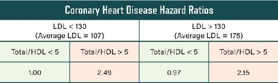

Figure 11.3. Only the total/HDL ratio properly predicts risk—just as Castelli noted. Source: T. D. Wang et al., “Efficacy of Cholesterol Levels and Ratios in Predicting Future Coronary Heart Disease in a Chinese Population,” *American Journal of Cardiology* 88, no. 7 (2001): 737–43.

CAD Risk by LDL & HDL

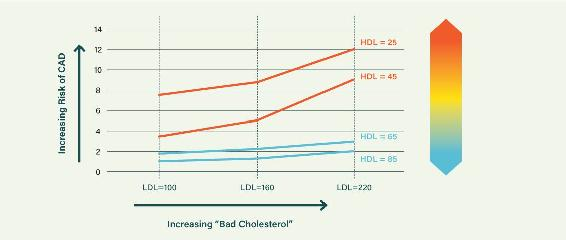

Figure 11.4. Higher LDL cannot tell us anything without looking at HDL also. Source: W. P. Castelli, “Cholesterol and Lipids in the Risk of Coronary Artery Disease—The Framingham Heart Study,” *Canadian Journal of Cardiology* 4, suppl. A (1988): 5A–10A.

#### LDL/HDL

The Framingham Heart Study, one of the largest and longest-running population trials ever conducted, scrutinized LDL and HDL and identified many of the risk factors that are used today to identify probability of heart attacks for people.

Figure 11.4 shows the risk of coronary artery disease (CAD) in fifty- to seventy-year-old men—a rather important group, since it’s the group with the most heart attacks. (Note that this data is from 1977, when our population was not yet ravaged by very high rates of insulin resistance—smoking was the big driver of heart disease back then.)

The data showed that people with a lower HDL (upper red lines) were universally at very high risk of CAD—even when their LDL was nice and low.

But the worst-off were those with high LDL and low HDL. Their risk is jacked up because the combination of high LDL and low HDL screams insulin resistance. Ideally your LDL/HDL ratio should be below 3.5 or so.

### CHOLESTEROL MASTER CLASS: THE ADVANCED LIPOPROTEIN TESTS

The advanced lipoprotein tests are rarely used compared to the standard ones, but they are now becoming more widely available. These tests actually count the lipoproteins and measure their size. Although these measures are important for all particle types, we will focus on the LDL-class particles, whose size and number are particularly important.

#### THE SIZE OF YOUR LDL PARTICLES

Advanced testing methods can measure the size of your LDL particles and give you a distribution of their dimensions. If a large percentage of your LDL particles are in the “small, dense” category (sdLDL), it’s not a good sign. Having lots of these sdLDL particles is also referred to as being a “pattern B” type person. Smaller LDL particles are more prone to oxidation damage—and being insulin resistant can also drive down LDL particle size. That is mainly why sdLDL is a bad thing to have; the sdLDL measure tracks reasonably well with vascular disease.

#### THE NUMBER OF YOUR LDL PARTICLES

The advanced testing methods can also count the *number* of your LDL particles. The count of the LDL particles is generally called “ApoB” or “LDL-P.” For our purpose here, “ApoB” is essentially just another term for “LDL-P”; the test for ApoB simply uses a different methodology. The value of ApoB is more strongly associated with vascular disease than the standard LDL measure, but it does not track more strongly than the ratios discussed on here to here. High ApoB can be a problem mainly because most heart attacks are due to insulin-signaling problems and associated issues, and these also often drive a high ApoB—so a high ApoB flags the risk of insulin resistance. If there are no insulin resistance or inflammatory issues present, then a high ApoB is very likely not an issue.

Remember that all markers are fallible. A high ApoB should be taken as a cue to investigate carefully to see if there are any underlying issues in your system. The investigation should cover the other important markers of underlying dysfunction that we discuss throughout this book—insulin, HDL, triglycerides, and blood glucose (the tests for all these are listed on here). Most importantly, the lipoprotein measure discussed below is a far more powerful metric than ApoB. With a high ApoB, you really need to check the following ratio to verify whether a problem is present or not.

#### APOB/APOA1: THE MASTER RATIO

We’ll close with the most powerful risk indicator by far: the ApoB/ApoA1 ratio. Remember from here that lipoprotein molecules are wrapped in a unique protein called an apolipoprotein. LDL particles have B100 apolipoproteins (ApoB), while HDL particles have A1 apolipoproteins (ApoA1). So the ApoB/ApoA1 ratio tells you the ratio of LDL to HDL.

While this seems similar to the LDL/HDL ratio, it looks at the actual number of the particles themselves—the LDL/HDL ratio looks the quantities of cholesterol contained *within* the particles.

People with insulin resistance tend to have fewer HDL particles and more LDL particles, and the ApoB/ApoA1 ratio reveals this. People without insulin resistance tend to have the opposite—more HDL and less LDL. Hence, the ratio is very revealing and trumps the individual ApoB measure.

The ApoB/ApoA1 ratio obliterates the ApoB measure as a risk factor, just as the LDL/HDL and other traditional cholesterol ratios obliterate the LDL measure.

A good illustration of this comes from an excellent study on cholesterol risk markers.^16^ The study included data from 15,632 women between ages forty-eight and fifty-nine—both traditional cholesterol panels and advanced lipoprotein tests. This gave a great comparison between the markers, showing which ones more powerfully predicted risk. In these association studies, any marker that predicts less than a 2x increase in coronary heart disease risk is a *weak* marker—it’s unlikely to be a cause of CHD. In Figure 11.5 you can see that LDL comes in as very weak marker (as expected). However, if a marker predicts a 2x or ideally 3x increase in CHD risk, it is dependable marker and is likely linked to causal mechanisms of CHD. In this study, as in all the others, the ApoB/ApoA1 ratio put in a great performance, trumping ApoB alone. Interestingly, the total/HDL ratio did even better, as it sometimes does depending on the study. All of this is normal and expected when you understand the science. The importance of looking at ratios rather than at LDL has also been demonstrated in studies of familial hypercholesterolemics—people with a genetic disorder that gives them high levels of LDL.^17^ Even for these high-LDL guys, the ratios always matter more.

Comparison of Risk Predictors

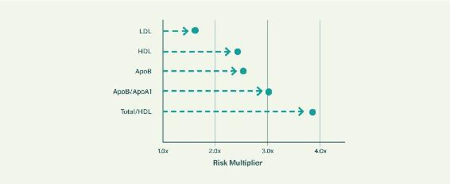

Figure 11.5. LDL is always blown away by the ratios. Source: P. M. Ridker et al., “Non-HDL Cholesterol, Apolipoproteins A-1 and B100, Standard Lipid Measures, Lipid Ratios, and CRP as Risk Factors for Cardiovascular Disease in Women,” *JAMA* 294, no. 3 (2005): 326–33.

### THERE’S NO SUCH THING AS A SUDDEN HEART ATTACK

We all fear heart attacks—we worry that they can just happen like a bolt from the blue. But this is a lie. There’s nothing sudden about the inflammatory disease sequence leading to that “sudden” heart attack.

Most heart attacks are caused by atherosclerosis, the inflammation of the arterial walls. Atherosclerosis is a progressive disease that’s driven by multiple causes. Diabetic physiology (insulin-signaling dysfunction) is the primary factor in progression of heart disease, and tragically, millions of people are riddled with heart disease before they even get their diabetes diagnosis.

If pilots flew by the LDL gauge, we would have aircraft raining down from the sky.

The best way to verify your actual heart disease status is to use the best technology—a technology that can actually *see* this disease in your body. This has been possible to do since the 1980s. There is a simple five-minute scan that can identify heart disease and how bad it is: the coronary artery calcium (CAC) scan.

#### DECADES BEFORE DISASTER: THE STEADY MARCH OF CALCIFICATION

Before we get to what the CAC scan does and how it works, let’s start with some background on heart disease.

The primary cause of cardiac death is damage to your coronary arteries—the blood vessels that feed the heart muscle itself—as a result of sustained inflammation. This damage can lead to a heart attack, and in around 50 percent of cases, this will result in death.

There are a few things that can happen in damaged coronary arteries to cause a heart attack (plaque on the arterial walls can break off and form a blood clot that blocks the flow of blood; the arterial wall itself can rupture or spasm, interrupting the flow of blood)—but no matter what triggers a heart attack, the body’s response to damaged coronary arteries is always the same, and that response is what the CAC scan directly observes and quantifies.

Your body tries to repair itself by depositing calcium in the damaged areas of the arterial wall. As the damage continues, these repair processes quicken. They desperately attempt to shore up the arterial walls before a rupture occurs. This growing calcium becomes the telltale sign of imminent danger—the ultimate canary in the coal mine or visible tip of an iceberg, the vital evidence of your real risk of sudden death.

And it can be clearly and easily measured with a CAC scan.

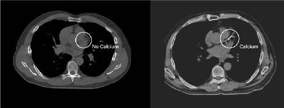

Figure 11.6. Zero CAC is a warranty. High CAC is the master risk marker. In the CAC scan at the right, there’s coronary calcium along the left anterior descending artery—the widowmaker.

#### THE TELLTALE HEART: CORONARY CALCIUM REVEALED

A CAC scan can directly measure the amount of damage in coronary arteries and tell you whether a fatal heart attack is looming or not. It can prompt you to take evasive action. Afterward, it can verify that you have achieved safety. Following decades of misunderstanding, the CAC scan finally made the European Society of Cardiology preventative guidelines in 2013.^18^ It is now recommended for the middle-risk people—where most heart attacks occur. Better late than never. But the vast majority of doctors are not aware of the updated recommendation to use the CAC scan. They do not have time to keep up with the guidelines—and so the vast majority do not realize that things have changed.

All astronauts and US presidents *must* take this scan; they are not given a choice in the matter. For about $150 and a few minutes of your time, you can get your CAC score. Crucially, it gives you advance warning so that you can take action to fix your arteries before it’s too late.

Figure 11.6 shows a technological wonder: a CAC scan of the heart showing calcium deposits. On the left side is a heart with healthy coronary arteries. It has not been subjected to insults over its lifetime. It is not aflame with disease. No calcium appears in the image, meaning that the body hasn’t been attempting to repair damaged arterial walls. Congratulations are in order. A CAC score of 0 is recorded.

The heart on the right is in a very different state. Within the white circle we see the looming iceberg: coronary calcium has formed along the length of a main coronary artery. The bright white is hard to miss, is it not? It’s direct evidence of years of emergency repair work carried out on a damaged artery. This person probably never even knew there was a problem, but they have a CAC score of *almost 1,000*. This means they have around ten times the risk of a major heart attack as someone with a score of 0 to 10—regardless of any other risk factor. (Incidentally, the affected artery here is the left anterior descending artery, which is the responsible for the greatest number of deaths from heart attacks. Cardiologists have given a well-earned name to this artery: the widowmaker.)

#### CAC VERSUS OTHER RISK FACTORS FOR HEART ATTACK

The CAC scan only costs $150 and takes just a few minutes, but it punches way beyond its weight. There are now many studies examining the CAC’s ability to predict heart attack and early mortality. Here we will look through just a representative one.

We’ll start with a simple comparison. Pretty much everyone knows that smoking is very bad for your health, and lung cancer is a much-feared consequence of smoking. The smoking-related deaths from cancer don’t touch those from heart disease and stroke, though: in some studies, smoking has been shown to be the single greatest risk factor in cases of sudden death from cardiac-related events (SCD).^19^ So let’s be harsh and compare the predictive value of a CAC score against that of smoking.

In 2006, a large study looked at 10,377 people over the course of five years; 40 percent were smokers.^20^ None of these people had a history of coronary heart disease. They were all given CAC scans at the start, and their CAC scores were recorded. Then the investigators waited to see what would happen.

Unsurprisingly, the smokers died at a faster rate than the nonsmokers. On average, the smokers were twice as likely to die before the five years were up as nonsmokers. This “doubling your risk” pattern is quite typical for smokers. But let’s look at what a very high CAC score meant for probability of death. Does it bode worse than having a full-time smoking habit?

It does—far worse. For the *nonsmokers* who had a CAC score greater than 1,000, the chances of dying were nearly seven times higher than for a *smoker* with a low CAC score. Thus, having a high CAC score blew away even the crazy mortality risk of a full smoking habit. That illustrates the immense predictive power of CAC.

Let’s look at another common way of evaluating risk. When doctors assess your heart attack risk, they use an old system of statistically noisy guesswork based on heart disease data from a few decades back. Included are things like cholesterol level, family history, blood pressure, and the like. Based on this information, you are given a Framingham Risk Score. This is your chance of having a major heart attack within the next ten years—a score of 10 percent means that you have a 10 percent chance. How does this fuzzy lottery system compare to your CAC score? Very badly indeed. All studies of CAC tell the same story. Figure 11.7 summarizes several of these studies.^21^

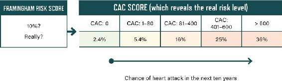

Figure 11.7. Framingham metrics are weak. CAC tells the real risk story. Source: Matthew J. Budoff and Jerold S. Shinbane, eds., *Cardiac CT Imaging: Diagnosis of Cardiovascular Disease* (New York: Springer, 2010).

The left-hand column shows people who got a Framingham Risk Score of 10 percent. Graveyards have countless residents with good Framingham Risk Scores.

If you look at the CAC scores of all these Framingham 10 percent people, everything changes. We can now directly see the presence or absence of disease—a much more realistic way to evaluate risk. Using the standard Framingham system, we were in fuzzy lottery land—supposedly a 10 percent risk applied to everyone. If CAC is checked, however, we get the reality. Some people are indeed in good shape, but others have a 36 percent, not 10 percent, chance of having a heart attack over the next ten years. The following guide to risk now applies:

-  A CAC score of 0 is good—you can relax.

-  Between 1 and 80 is a concern, and you should be reconsidering your lifestyle.

-  Between 81 and 400 means it’s time to take serious action to attend to root causes.

-  Greater than 400 means it’s write-the-will time—or else address all root causes immediately so you can get to safety.

People who have very high CAC scores need to take action fast. Their arteries will likely rupture in the coming years—no nice retirement. Even people with a Framingham Risk of 10 percent can be highly diseased, though some are just fine. Who is who? We simply look at the proper measure—their CAC score. Those who need to can then take action fast.

In the cardiology business, these Framingham 10-percenters are in the “middle-risk” category. Most US adults are in this group. But the majority of heart attacks occur in this middle-risk category, not the high-risk one. What’s more, many CAC studies that have looked closely at this middle-risk group and tracked actual heart attack rates have proven that, based on their actual amount of atherosclerosis (shown in a CAC scan), most of them—about 60 percent—were not middle-risk at all.^22^ The Framingham system was wrong more than it was right, because 20 percent of the middle-risk people were revealed to actually be low-risk while 40 percent of them were really high-risk. So for this middle-risk majority in particular, it’s crucial to know your CAC score—your risk may be much higher than you think.

But what’s most important is the rate of increase in the CAC score. If your calcium is growing fast, then you *must* take action immediately to lower your insulin and reduce inflammation—the primary root causes of arterial damage.

To explain, let’s look at a 2004 study (see Figure 11.8).^23^ When this study was started, the participants had no symptoms, just like the other millions who die from “sudden” heart attacks. But they did all have evidence of calcium in their arteries.

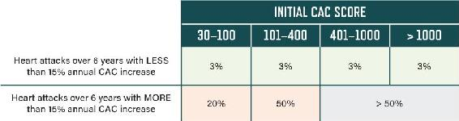

Figure 11.8. CAC progression of more than 15% per year is the real killer. Source: P. Raggi, T. Q. Callister, and L. J. Shaw, “Progression of Coronary Artery Calcium and Risk of First Myocardial Infarction in Patients Receiving Cholesterol-Lowering Therapy,” *Arteriosclerosis, Thrombosis, and Vascular Biology* 24, no. 7 (2004): 1272–77.

All were put on treatment to help with their vascular disease, revealed by their CAC score. But only the people who managed to slow their CAC progression could expect good outcomes. In fact, these people could expect *excellent* outcomes. Having an annual increase of coronary calcium deposits below 15 percent meant only a 3 percent chance of a heart event over the six years of the study. Even those with very high initial scores—as high as 1,000—shared the same low risk of heart attack! These people had managed to quench the fires inside, and their arteries had cooled. They were saved.

In stark contrast, the people whose calcium continued to build at a rate above 15 percent per year showed a much, much higher risk of heart attacks. Even those with lower initial CAC scores had a 20 percent risk for cardiac events within six years. Those who had higher initial scores *and* an increase above 15 percent per year were much worse again: their risk level was around 50 percent. Cardiac carnage, in other words.

This is the power of the CAC score. It can accurately tell if the disease has been burning inside. Crucially, it can tell you over time if you are still alight.

Did the participants’ cholesterol levels show any difference between the saved and the doomed? No, they did not. There was no significant difference in cholesterol levels between the ones with excellent chances of escaping a cardiac event and the disaster-bound. As we’ve covered in this chapter, cholesterol is a highly misleading marker. The ratios (see here to here) are the most valuable metrics, as they are quite consistent and dependable.

#### CAC PREDICTS ALL-CAUSE MORTALITY, TOO

The root causes that drive cardiac disease also drive cancer and many other killers. Therefore, the CAC score has even more power than we revealed above. Many studies have shown that the CAC score predicts death from all causes even better than it predicts death from coronary disease.^24^

Figure 11.9 gives a snapshot of the massive disease difference between a low CAC score and a high CAC score. This study included over 44,000 people averaging in their midfifties. The height of the bars show the actual mortality rates per thousand person-years, a common way of displaying mortality data. So a value of 25 on the y-axis means that 25 percent of these middle-aged people died over a ten-year period—a one-in-four chance of death. That’s worse than the odds in Russian roulette. As you can see, the mortality rate for a high CAC score is around *fifteen times greater* than for a low one. That’s a 1,400 percent higher risk! (The figure also takes into account the number of “risk factors,” but the CAC predictive power obliterates them.)

Mortality Rates and CAC Scores

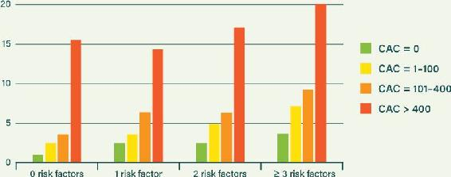

Figure 11.9. CAC blows away the usual risk factors in prediction of mortality. Source: K. Nasir et al., “Interplay of Coronary Artery Calcification and Traditional Risk Factors for the Prediction of All-Cause Mortality in Asymptomatic Individuals,” *Cardiovascular Imaging* 5, no. 4 (2012): 467–73.

In short, a CAC scan is the ultimate test to assess your risk of death from most chronic diseases. It will enable you to take action to ensure longevity and tell you if your efforts are hitting the mark. Here is a quote from one major landmark CAC study: “Participants with elevated CAC were at increased risk of cancer, [chronic kidney disease, chronic obstructive pulmonary disease], and hip fractures. Those with CAC of zero are less likely to develop common age-related comorbid conditions, and represent a unique population of healthy agers.”^25^

### CAC RISING? TAKE ACTION!

Damage to your coronary arteries will only kill you prematurely if you encourage its growth in your body. It’s not simply a consequence of aging. It is not an inevitability based on genetics and risk factors. You can actually do a hell of a lot about it. The damage is driven by a specific disease process: atherosclerosis. You either have this progressive disease or you don’t. If you do, you can deal with it *very* effectively. And the best way to know if you have it is to get a CAC scan.

This simple scan was invented decades ago. You may well ask why it only became recommended for the middle-risk millions in 2013. It is a long and fascinating story, best told in the movie *The Widowmaker*, released in 2015. David Bobbett spent millions of dollars of his own money to fund the movie. After saving his own life, he committed to help others save themselves (setting up a charity to help get the message out: Irish Heart Disease Awareness, www.IHDA.ie).

What is the main reason for the delay in recommending the scan? This is best summed up in the words of Dr. Steve Nissen, the leading preventative cardiologist in the US. Here is what he had to say in 2014: “Well, I’m not a fan of the CAC Score. To date, no one’s been able to show that knowing how much calcium is in the arteries actually allows you to change the outcome for the patients. So it tells you who’s at risk, but it doesn’t tell you what to do for them.”

False! In this book you are learning which actions to take—actions that deliver. In the next ten years it will become apparent that the progressive disease of atherosclerosis can be slowed to the point of safety and even reversed. You can be one of the first people to take part in this revolution.

There is a notable lack of data in the scientific literature showing CAC regression—not just slowing coronary calcium buildup but actually reducing it. This is partly because the orthodoxy believes that regressing CAC is impossible.^26^ But we are now seeing some studies illustrating that it is indeed possible.^27^ The only snag: you can’t lower your CAC score with the orthodox approach of a low-fat diet and medication. You need to follow the Eat Rich, Live Long plan, especially reducing your insulin by eating a low-carb, high-fat diet.

A final reminder on the meaning of the CAC score: it tells you what was happening in your arteries in the past, up to the time when you got the scan. It is your summed-up history of inflammatory damage. If you get a high score, don’t panic. The key is to take action and stop the score from progressing quickly. If progression is stopped, your risk collapses rapidly. It is your choice whether to stop the damage going forward. It is your choice to save your own life.

JEFF P.’S STORY

One of Jeff’s patients not only was able to stop his CAC score from rising but actually reduced it. Jeff P. managed to do this for himself by following the Eat Rich, Live Long plan.

As an aerospace engineer, Jeff P. has always been driven by data. His father had a mild heart attack at age fifty-three and Jeff’s longtime goal has been to avoid that fate, so he tracked his annual blood work even though doctors kept assuring him his risk of heart disease was very low. From age thirty-two through fifty-four, Jeff’s total cholesterol averaged 160 mg/dL while his LDL was around 100. This led his doctors to applaud his excellent health. They even advised him to maintain his dietary habits. They only suggested that he exercise more to raise his HDL above the low to mid-forties. They seemed to be unaware that his triglyceride-to-HDL ratio flagged potential issues. In Jeff’s late forties and early fifties, that ratio averaged nearly 3 and even reached 5 at one point. (Recall from here that most recommendations say it should be below 2, and we would say it should be below 1.2.)

Jeff ate a low-fat diet, as recommended by the 1977 *Dietary Goals for the United States,* which was released his first year of college. He resumed being a vegetarian at age forty-four, after a two-year experiment with it in college, vowing that this time it would be for life—his life, the life of animals, and the life of the planet. His diet was grain-heavy, and he loved “heart-healthy” Raisin Bran with almond or soy milk. Since brown sugar and honey are fat-free, he put them on his morning oatmeal. Not surprisingly, Jeff’s weight crept up over the years, peaking at 170 pounds, 20 pounds more than his high school graduation weight. Jeff had a dad bod before it became a meme.

At age fifty, Jeff moved to Boulder, Colorado, and connected with its strong vegetarian and vegan community. At age fifty-three, he became a vegan. Lactose intolerance led Jeff to get tested for additional food sensitivities. He was shocked to learn he was allergic to gluten and angered when he was told to eliminate it from his diet. Jeff tried to be a gluten-free vegan for a few months, but he began craving meat. His profound initial skepticism with the Paleo/primal and low-carb, high-fat lifestyles faded as he appreciated the high-quality meats and fats from pastured animals available in Boulder. His appetite stabilized, his sleep improved, his skin cleared, and he regained and maintained his youthful weight. Jeff’s energy level is high: he starts each day with a dip in the pool and bikes or walks for transportation.

A Paleo friend suggested that he get a CAC scan but warned that it would reveal the results of his past lifestyle rather than his current eating. Jeff was shocked when his score of 61 at age fifty-five put him in the worst third of his age group. It made him highly skeptical of his past blood profiles and the diet-heart hypothesis. He also wrote his own calcium-scoring program to independently verify his calcium scores. He devoured the medical literature on the predictive power of the CAC and became Dr. Gerber’s patient. Together they decided to work on stabilizing Jeff’s CAC score, but privately Jeff made it his ultimate goal to have a score of zero.

A year after Jeff’s first CAC scan, his score was down to 38—a remarkable 36 percent reduction. Since eating low-carb, high-fat foods, Jeff’s total cholesterol has increased significantly, but his crucial triglyceride-to-HDL ratio is now routinely less than 1. Also, his important HDL value has been as high as 88 mg/dL.

Fortunately, Jeff’s cardiologist appreciates the power of the CAC score. At their last appointment, the doctor was astounded and nearly speechless upon seeing Jeff’s clear regression in combination with a total cholesterol of 367 mg/dL. As a result, Jeff left the appointment without a statin prescription. Jeff will continue to pay attention to his data. His next scan will be in a couple of months at age fifty-nine, but he already knows that he looks and feels great!

IMPORTANT TAKEAWAYS

Here’s a summary of the valuable measures that can be gleaned from the standard cholesterol tests.

-  Triglyceride should be safely below 80 to 100 mg/dL.

-  HDL should be safely above 40 mg/dL (for men) or 50 mg/dL (for women).

-  The ratio of total cholesterol to HDL is crucial and should be below 4.5, preferably below 4.

-  The ratio of triglyceride to HDL is also crucial and should be well below 2, preferably around 1.

-  A CAC scan will enable you to discover hidden heart disease where the risk factors can fail. Crucially, you can take action and check back later to verify that you have stopped the progression of atherosclerosis.
