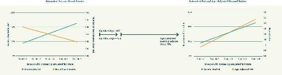
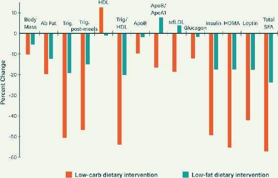
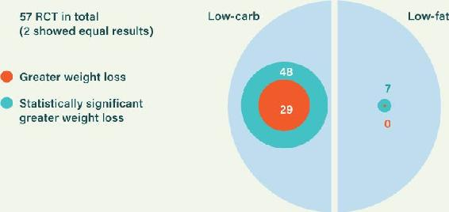
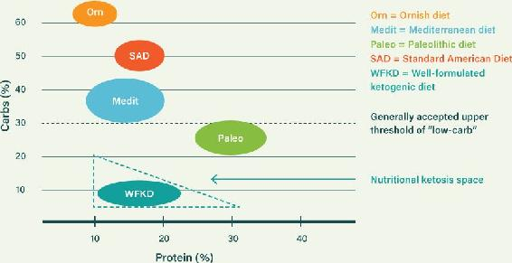

“And take your father and your households, and come unto me: and I will give you the good of the land of Egypt, and ye shall eat the fat of the land.”

—Genesis 45:18

## CHAPTER 13

### HEALTHY FAT:

### THE FUEL FOR LONGEVITY

In Chapter 11 we clarified what cholesterol levels really mean. This misleading marker managed to single-handedly launch the war on fat. Tragically, it still serves to maintain it. We are now breaking free of the bad science, but progress has been glacial. Countless authorities and enormous global businesses are deeply invested in the mistaken theories; they refuse to yield in spite of the conflicting evidence. In recent years they have been resurrecting the data from old associational studies on dietary fat. In their last stand, this is what they have been reduced to.

### THE DESPERATION OF THE ANTIFAT CAMP

A general guideline with associational studies is you should generally demand a 2x multiplier of risk to get excited—that is, the risk should be doubled when a particular factor is in play. This goes for any possible risk factor. Smoking is a significant causal driver in heart disease rates; it is associated with at least a doubled risk of coronary heart disease, as you might expect. Smoking is also a really serious driver of lung cancer—the risk multiplier here exceeds 10x. The studies that look at saturated fat and heart disease, on the other hand, don’t come anywhere close to a 2x multiplier. In fact, many show *lower* risk of heart disease with a higher-fat diet. Let’s look at the outcome of a recent antifat study that grasped at yet more associational straws.

In this study, the average risk multiplier they squeezed out against saturated fat was trivial—around 1.2x.^1^ In other words, eating the most fat was associated with 20 percent higher risk of events compared to eating the least. But the healthy-user bias effect blows this away like a feather. The healthy-user bias phenomenon happens because the people who most strictly follow the official advice on nutrition are those who are most health-focused, and therefore they also deploy a whole range of healthy behaviors that are largely unaccounted for in any particular study. Regardless of the focus of the study, they achieve better health outcomes because they engage in healthier behavior overall.

The official advice for decades has been to lower saturated fat and replace it with polyunsaturated fat. The most health-focused people on the planet are the ones who best followed this advice. These participants therefore grant the low-fat diets with unearned credit. In many ways the studies are therefore highly misleading, creating dodgy data that helps to support bad science.

Figure 13.1 illustrates how big the statistical adjustments can get when the study methods are unusual. On the left side is the original relationship between natural saturated fat and heart events (based on raw baseline data acquired from an earlier paper, where only small age differences were at play between groups). It appeared that a diet higher in saturated fat resulted in fewer heart events. But the authors of a later paper adjusted for changing dietary patterns over time, which led to huge age differences appearing between the groups (the older people were more health-focused, actively pursuing the “official” advice). On the right side we see that now saturated fat looks bad. (Note that “hazard ratio” is just a way of saying “risk multiplier.”) The message became “Guzzle industrial oils instead of natural fats.”

Figure 13.1. Saturated fat appears good (left), but major adjustments mean major changes. Source: D. D. Wang et al., “Specific Dietary Fats in Relation to Total and All-Cause Mortality,” *JAMA Internal Medicine* 176, no. 8 (2016): 1134–45; G. Zong et al., “Intake of Individual Saturated Fatty Acids and Risk of Coronary Heart Disease in US Men and Women: Two Prospective Longitudinal Cohort Studies,” *BMJ* 355 (2016): i5796.

In the later study, the team fully deployed an unusual technique. They incorporated how the subjects’ diets changed over the years using input from later questionnaires, and this led to the massive fifteen-year age difference between the lowest and highest groups. Unlike common age correction, this study dynamically created age differences between groups nearly as large as the study duration. This is where the healthy-user bias distortion could go into overdrive, as methods depart from established norms. The healthiest people during the period of this study were constantly being told that they should reduce saturated fat and replace it with polyunsaturated oils—and the older ones were listening more. Their later questionnaires then beautifully reflected these dietary changes. Even if their other healthy habits were responsible for their better health outcomes, reduced saturated fat gets the credit. Great for the desired message—but not for scientific accuracy.

We don’t need to look at any more associational studies that seek to implicate natural fats as harmful. They all limp in with risk multipliers around 1.2x (or even lower). But let’s look at some similar studies from the opposing camp. Can these associational studies debunk the fat-bashers? It appears that they can.

### STUDIES DEFENDING SATURATED FAT

The conclusion of a recent large, well-conducted study says it all: “Saturated fats are not associated with all-cause mortality, [cardiovascular disease], [coronary heart disease], ischemic stroke, or type 2 diabetes.”^2^

There are many more studies like this from recent years. Some suggest that replacing saturated fat with polyunsaturated oils can actually increase the risk of heart disease. One of them recorded the following conclusion: “Substituting SFAs with . . . polyunsaturated fatty acids (PUFAs) or carbohydrates was significantly associated with higher [coronary heart disease] risks.”^3^

For the 35,597 Europeans who participated in this study, saturated fat appeared to be the safest fat. The risk multiplier reached 1.3x for each 5 percent of saturated fat that was replaced by other ingredients. As with many of these studies, the risk multiplier was too low to mean a whole lot. Yet saturated fat in this study appeared to be safer than other foods examined.

Here’s the conclusion of yet another study, from September 2016: “Our results do not support the association between CVD [cardiovascular disease] and saturated fat, which is still contained in official dietary guidelines. Instead, they agree with data accumulated from recent studies that link CVD risk with the high glycemic index/load of carbohydrate-based diets. In the absence of any scientific evidence connecting saturated fat with CVD, these findings show that current dietary recommendations regarding CVD should be seriously reconsidered.”^4^

And finally, the most revealing study of the bunch was published in August 2017. Called the Prospective Urban Rural Epidemiology (PURE) study, it tracked 135,335 men and women in eighteen different countries for 7.4 years.^5^ The PURE study found that neither coronary heart disease mortality nor mortality in general was associated with intake of fat in general or saturated fat specifically. In fact, a higher saturated fat intake was associated with lower stroke rates. Unsurprisingly (to us), it did show that increasing carbohydrate intake tracked with increasing mortality. In a separate PURE analysis of participants’ cholesterol metrics, the findings agreed with what we have been saying: ratios are far more predictive of problems than the misleading LDL, and higher carbohydrate intake is strongly linked to a higher ApoB/ApoA1 ratio.^6^

True, these are all associational studies, and as we’ve said before, associational evidence only points to an association between two things; it doesn’t prove that one thing causes another. However, associational evidence is good for *disproving* a theory: if two things aren’t even associated with each other, then no causal relationship can even be suggested. And if there’s an *anti*-correlation—the more you have of one thing, the less you have of another—you can be sure that the thing you have more of (in these studies, saturated fat) isn’t causing the thing you have less of (heart disease and overall mortality). The most well-executed associational studies certainly indicate that natural dietary fats should never have been demonized and that higher carbohydrate intakes are far more concerning.

### CLOSING ON THE TRIALS

We will not waste your time trudging through all the low-fat trials and experiments. When you roll them up, you are left with confusion. Billions of dollars have been spent with nothing worthwhile to show for it.

Two of the biggest studies were particularly embarrassing: the Multiple Risk Factor Intervention Trial (MRFIT) and the Women’s Health Study, each of which cost hundreds of millions of dollars to complete. Participants decreased their intake of overall and saturated fat and increased their intake of polyunsaturated fat. The researchers threw their best possible shot at proving that saturated fat causes heart disease, and the shot failed spectacularly. Some of media reported quite honestly on the disaster. The *Wall Street Journal* ran a story on the MRFIT study entitled “Heart Attacks—A Test Collapses.”

There were also many trials that showed significantly worse outcomes when replacing saturated fat with vegetable oils.^7^ These negative-outcome trials were not publicized truthfully, nor were they included properly in many meta-analyses (studies that pool together many other inconclusive studies).

In 2015, a very large meta-analysis examined many of these experimental results. It was a final desperate effort to implicate saturated fat as a cause of heart disease. The key findings overall were that reducing or replacing saturated fat in the diet resulted in:

-  no significant effect on all-cause mortality

-  no significant effect on cardiovascular mortality

-  no significant effect on heart attack mortality or the rate of heart attacks

-  no significant effect on stroke incidence or mortality

There was a slight reduction seen in cardiovascular events, which just nudged into the statistically significant zone. However, this limited effect—mainly a reduction in the incidence of angina—was solely restricted to studies where polyunsaturated fat replaced saturated fat. The selection process also resulted in several negative cardiovascular trials not being included, so even this is open to debate.

Amusingly, the only trial that showed a slight effect on cardiovascular mortality was one where the intervention did not reduce cholesterol levels. Also, a later analysis showed that the reduction in cardiovascular mortality was cancelled out by an increase in cancer mortality.^8^ Go figure. The remaining fourteen of the fifteen studies in the meta-analysis did not show any reduction in cardiovascular mortality at all, which speaks volumes.

The real reason these trials failed is that *the wrong hypothesis was being tested.* They all assumed that saturated fat was independently bad for heart health—harmful all by itself. This in turn rested solely on the idea that it raised LDL levels. Presuming that LDL was universally bad completed the deception. As we explained in Chapter 11 and as countless studies have found, there was never sound science supporting this idea in the first place.

Saturated fat will only have meaningful negative effects if you eat too much carbohydrate, are too high in omega-6, or are too low in omega-3. This was not appreciated by the experimenters, and that is the main reason why the experiments failed.

These experiments were playing with saturated fat changes while not controlling for the interactions. When dietary carbohydrate is too high, there may be a slight advantage gained by replacing saturated fat with polyunsaturated. But this slight advantage at best only tweaks cardiovascular events downward slightly. Some of the experiments just barely picked up on this, but they sold this quirk like there was no tomorrow, even though any gains made are offset by other issues from polyunsaturated fats.

The most valuable experiment would center on reducing insulin and insulin resistance, not the misleading LDL cholesterol. It would focus on reducing trig/HDL or total/HDL ratios. These reflect healthy insulin signaling and low inflammation very well. This experiment would also be informed by insulin metrics. The results of this experiment would address real root causes of heart disease, rather than playing around the edges of statistical noise.

A high-fat and low-carbohydrate combination should have been tested in large experiments. The detrimental potential for excessive omega-6 oils should have been accounted for. And with so much supportive science behind the ratio of omega-6 to omega-3 (see here), this factor should also have been included.^9^ Several other important factors should have been controlled for, too. Sadly, there’s no large human trial that looks at all these factors. The controllers of the funding squandered it on desperate efforts to rescue the low-fat theory.

We do, however, have many experiments that reveal the reality of what fat can do for us in the right ratios.

### ADVANCING YOUR HEALTH WITH HEALTHY NATURAL FATS

In Chapter 4 we showed that the majority of American adults now have some level of metabolic insulin resistance syndrome (MIRS), which is at the root of heart disease and many other modern diseases. Everyone is at a different level—we are all on a spectrum when it comes to this disease process. We called this the hyperinsulinemia/insulin-resistance spectrum in Chapter 10, but it is essentially the MIRS spectrum also. Now we need to get into the core of why dietary fat is so important. It is crucial in fighting the real root causes of this disease. It enables us to address the biggest health problems in the world. It helps us to move people to the safe end of the insulin spectrum—where slimness is achievable and longevity is within grasp.

This is all possible because reducing the amount of carb and getting most of our calories from healthy fats resolves insulin resistance and hyperinsulinemia. These are the problems at the core of MIRS and many chronic diseases, especially heart disease and obesity, and resolving them has enormous implications for health and longevity.

As we explained in Chapter 5, a properly formulated low-carb, high-healthy-fat diet:

-  is hugely effective in resolving prediabetes and diabetes

-  improves appetite control

-  optimizes the absorption of vitamins A, D, E, and K

-  strengthens the immune system

-  minimizes systemic inflammation

-  enhances rapid recovery after sustained vigorous exercise

-  lowers the important risk markers for heart disease

-  slows aging and improves energy

-  promotes healthy skin, hair, nails, and many other outward signs of health

A fascinating 2006 experiment revealed exactly why reducing carb and increasing healthy fat is the key to health.^10^ It specifically investigated a range of people affected by the MIRS epidemic. This was a perfect group to focus on. Engineers love looking at the parts that have the problem. You can learn so much from scrutinizing these “failed parts.”

The researchers split the participants into four randomized groups. They wanted to test differing ratios of carb to fat in their diets; they also wanted to try out something rather special.

First, each group was put on a different dietary regimen for three weeks, without having to reduce their calories. This simulated what would happen with a dietary regimen in a real-life situation. The high-carb diets had complex carbs but also simple sugars—mimicking a typical high-carb diet. The highest-fat diets were broadly similar to the ratios we would recommend. In summary, the four diets were low fat (54 percent carb), moderate fat (39 percent carb), high fat (26 percent carb), and high saturated fat (again 26 percent carb, but here the fat was mostly saturated). (We would generally recommend 20 percent carb or less.)

The next step after the three-week diet was ingenious. They kept the four groups on their diets, but they also *starved* them for the following nine weeks. One thousand calories per day was taken away from everyone. This would not happen in real life. But it revealed something really interesting.

Crucially, the researchers went far beyond measuring the misleading LDL metric. They recorded all the powerful metrics we talked about in Chapter 10: trig/HDL ratio, total/HDL ratio, and all the advanced lipoprotein measures. So what happened to the different groups? Let’s look first at the nonstarvation period.

The lowest-carb, highest-fat diets achieved *superb* improvements in just three weeks—with no reduction in calories. The lowest-carb diet that emphasized saturated fat was the best performer of all. This diet reduced trig/HDL by 44 percent in three weeks flat. That’s right: the high-fat diet nearly halved the most important cholesterol health metric of all.

It also increased HDL by 5 mg/dl, lowered triglyceride by 37 percent, and substantially shifted the important total/HDL down by 13 percent. It also improved the metrics on the number and size of LDL particles.

In contrast, the high-carb, low-fat diets achieved almost nothing without calorie restriction. There was only a 10 percent drop in triglyceride and trig/HDL, with the other metrics not shifting at all.

So a big win here for a low-carb, high-fat diet, and a dunce’s hat for a low-fat diet.

But this experiment then got even more interesting. What do you think happened during the starvation period? Let’s take a look.

After nine weeks’ starvation, the highest-fat diets had improved the key markers even more. Not too surprising to us. The highest-carb diets also finally began to see improvements in the key markers. But what is most interesting is that *even after nine weeks of starvation, the highest-carb diet had only achieved half of what the highest-fat one had achieved with no starvation.*

You can stick with a typical high-carb, low-fat diet and cut your calories in half, and you’ll start to see some improvement in health metrics. Or you can try a low-carb, high-fat diet, stop obsessing about calories, and eat delicious low-carb food, and you’ll see *twice* the improvement.

### THE MIXTURE MATTERS

The world may be still wedded to the misleading, noisy marker of LDL. But many pioneers of sound science are forging ahead. They are carefully monitoring *proper* health markers. This enables them to focus on real root causes of disease—and, of course, to formulate the best diets to prevent it.

Professors Steve Phinney and Jeff Volek are two such pioneers. Phinney realized in the 1970s that vilifying natural healthy fats had been an enormous mistake. His early experiments proved something of immense importance: that the healthfulness of natural saturated fats was hugely dependent on keeping carbohydrate low.

Volek has carried out a series of fascinating human experiments that demonstrate the importance of lowering carb.^11^ His subjects were typical examples of what our population has become: overweight people with “cholesterol issues”—perfect people to test the power of different diets on. In these experiments, half of the participants were put on “healthy” low-fat fare—not junk food by any means but genuine food-pyramid fare—and the other half were put on a very low carb (keto) diet. Figure 13.2 shows how the low-carb diet obliterated the low-fat one.

Low-Carb Trounces Low-Fat

Figure 13.2. All cholesterol and inflammatory markers improve much more with low carb. Source: J. S. Volek et al., “Dietary Carbohydrate Restriction Induces a Unique Metabolic State Positively Affecting Atherogenic Dyslipidemia, Fatty Acid Partitioning, and Metabolic Syndrome,” *Progress in Lipid Research* 47, no. 5 (2008): 307–18.

On the low-carb diet, at the end of the twelve-week experiment, HDL had risen and, more importantly, trig/HDL had collapsed by more than 50 percent. This is a halving of the most important “cholesterol” measure. The subjects’ insulin and triglyceride responses after a meal were greatly improved. The team also carried out human experiments examining the dietary effects on the most dependable markers of inflammation.^12^ Again, it was seen that the low-carb diet dramatically improved these, where the low-fat diet, if anything, worsened them.

Note that the low-fat diet, while trounced by the low-carb one, still managed to achieve some improvements. This is because most overweight people are on a really bad diet, a high-carb and high-fat combo, so even a low-fat diet was an improvement. But why settle for mediocre improvements using an unappetizing diet? It is much better to achieve massive improvements using a delicious diet.

Remember that the body weight is not really a *cause* of issues. The health of fat cells is much more important. How do you dramatically improve the health of your fat cells? You could technically do it with a combination of a very low fat diet, calorie restriction, and very careful monitoring and supplementation to ensure nutrient sufficiency. Or you can do it the way we do—by eating a well-formulated low-carb diet. The low-carb diet naturally targets all those delicious and nutrient-dense ancestral foods. It is an easier, more effective, and vastly more enjoyable way to eat yourself into excellent health.

### MASS EXPERIMENTS LEAD TO MASS APPEAL

In recent years, low-carb science has been really breaking into the mainstream, though there are of course regular reports in the media trying to undermine it. After all, huge businesses and massive reputations are at stake. If low-carb becomes the default, countless organizations and individuals have a lot to lose.

In 2016, we saw one of the most impressive mass experiments yet. The leaders of the Diabetes.co.uk charity are not establishment medical professionals—they are technical experts from the IT world who have set up what has become the biggest type 2 diabetes resource group in the world with the goal of joining together all of the world’s diabetics to share what works best to improve their condition. They started off by supporting the standard high-carb advice for diabetics.

But then the team researched the science and realized that low-carb was a basic requirement for managing diabetes. They launched a live experiment for their members to deploy a simplified low-carb diet.^13^ Guidelines for what to eat and a tracking app were provided for free. More than 120,000 people signed up for the experiment.

Even though this was not a randomized controlled trial, the results were dramatic. Within ten weeks, 80 percent of the self-experimenters reported significant weight loss—more than 10 percent reported losing at least 20 pounds. More than 70 percent experienced improvements in blood glucose. And around 20 percent were able to get off all blood glucose medications.

All of this in ten weeks—through applying the opposite of what the official dietary guidelines dictate.

### LOSING MASS THROUGH EATING FAT

A huge element of why low-carb, high-fat diets work is the appetite-control factor, but this factor is expressly excluded from most diet-experiment designs. Many experiments fix calorie intake at a set value, thus hiding the appetite factor completely (participants don’t have the option of eating when they’re hungry, as would happen in the real world). Others pit a calorie-restricted high-carb diet against an “eat all you want” low-carb one. (In many of these experiments, the low-carb diet still beat the calorie-restricted high-carb diet!) Other shenanigans include calling something a low-carb diet if it is below 45 percent energy from carbs. This makes a comparison between low- and high-carb meaningless, since it essentially compares high-carb to very high carb. This behavior ends up kicking the results into the statistical noise. A true low-carb diet is around 20 percent energy from carbs—or even lower.

We saw in the last section that 80 percent of 120,000 people in one experiment had a good weight-loss experience when moving to low-carb—even though they had already been striving to follow a “good” diet to lose weight. The low-carb approach gave them a super boost in success: it dropped their weight and lowered their medication needs. So why does the establishment keep claiming that human studies don’t show an advantage for low-carb?

Low-Carb vs. Low-Fat Weight Loss in Randomized Controlled Trials (RCTs)

Figure 13.3. The trials have concluded that low-carb performs the best. Source: Public Health Collaboration, “A Summary Table of 53 Randomised Controlled Trials of Low-Carb-High-Fat Diets of Less Than 130g Per Day of Total Carbohydrate and Greater Than 35% Total Fat, Compared to Low-Fat Diets of Less Than 35% Total Fat Compiled by the Public Health Collaboration,” n.d., https://phcuk.org/wp-content/uploads/2016/04/Summary-Table-53-RCTs-Low-Carb-v-Low-Fat.pdf.

Sam Feltham of the Public Health Collaboration UK researched the matter quite thoroughly in 2016.^14^ He gathered together fifty-seven human weight-loss trials. All of them tested low-carb, high-fat diets against low-fat diets. The trials ranged from short six-week interventions to two-year-long experiments.

The result was unequivocal. The low-carb approach beat low-fat in forty-eight out of the fifty-seven trials—with clear statistical significance in twenty-nine. The low-fat diet edged ahead in only seven out of fifty-seven, and none of these were statistically significant. This means that the low-fat diets *failed* in all fifty-seven trials.

Case closed, even when some trials are weakly designed or even biased toward defending the low-fat establishment. Also, keep in mind that many of the low-carb groups in these trials did not get proper advice, so they were exposed to many pitfalls. But still the low-carb approach overwhelmingly won out.

### ABSORBING VITAL NUTRIENTS THROUGH FAT

The low-fat fad of the past few decades not only has contributed to our obesity problem, but it has also promoted many more serious health issues. This is partly because the incorrect fat-lowering advice has a negative effect on the consumption of many vitamins required for optimum health. The most significant downside here is that on a low-fat diet, we can end up deficient in the fat-soluble vitamins, which are required for optimal health.

The four important fat-soluble vitamins are A, D, E, and K. In order for your body to absorb these, they need to be consumed with plenty of fat. Being low in any of these contribute to a dizzying array of health issues. Sadly, the chances of a doctor tracking these health problems back to an inadequate vitamin intake is extremely unlikely—the current medical system is overwhelmingly focused on using medications to resolve problems. Your best strategy, therefore, is to eat a diet that will keep you well into the sufficiency zone on these and other vital nutrients. A well-formulated low-carb, high-fat diet is a superb way to do this.

Another important point to note is that vitamins A, D, and K interact with each other to a great degree. They also interact synergistically with minerals, including magnesium and zinc. Modern populations tend to be deficient in these and many other minerals. There are more reasons for this than simply the damaging lunacy of the low-fat guidelines. Depletion of minerals from the soil due to modern agricultural practices is just one other issue we all face.

Your first strategy is to get onto a high-fat real-foods diet and make great choices. The most nutritious foods should be targeted in order to get these vitamins and more. Luckily, the most nutritious fatty foods are also the most delicious—pastured eggs, wild-caught fish, and grass-fed meats.

You can also leverage the power of fats to boost your absorption of vitamins from the plant foods you eat. Consuming tasty fat with plant foods will enhance nutrient transport into your body. For this reason you should always eat vegetables and salads with some olive oil or grass-fed butter. Coconut oil is another excellent choice for this purpose—it has been found to improve absorption of antioxidants and other nutrients even more than other fats.

It won’t take long for your skin, hair, and general well-being to improve when benefiting from a regimen high in healthy fats.

### HIGH-FAT AND FASTING

One of the most important benefits of a low-carb, high-healthy-fat diet is an indirect one: it enables much better control of your appetite. This means that it greatly enables you to habitually space out your meals—in other words, it helps you incorporate fasting into your daily life. (Another term for this is *intermittent fasting*.) Properly implemented fasting habits will help with weight loss, for sure, but the fasted state is also a health-promoting one that works its magic on many levels.

Pretty much all religions and spiritual groups throughout history have had a place for the practice of fasting. It was not just about self-denial, either. Fasting encourages mental clarity and enhances the thought processes. They may also have had an inkling that fasting in a sense cleanses the body. Hippocrates, Paracelsus, and Galen, the three fathers of modern medicine, all believed fasting to be a powerful medical intervention. In fact, Paracelsus said, “Fasting is the greatest remedy—the physician within.” These old guys were entirely correct, long before modern science could prove it.

The health benefits of fasting have been recognized increasingly in the past decades, particularly among medical researchers. Studies have shown that fasting:

-  promotes insulin sensitivity in all people^15^

-  reduces insulin resistance in people with prediabetes^16^

-  reduces inflammation^17^

-  helps reverse type 2 diabetes^18^

-  reduces blood pressure^19^

-  improves the health of fat cells and improves fat-burning^20^

-  improves weight loss while retaining muscle better than calorie restriction^21^

-  improves mood and mental clarity^22^

-  enhances autophagy (cellular regeneration and repair)^23^

-  protects against damage from radiation in cancer patients^24^

-  may protect against damage from chemotherapy in cancer patients^25^

-  promotes longevity^26^

None of this surprises us in the least. Sadly, there is a dearth of human studies in this arena; the reality is that funding is extremely difficult to obtain for studies on interventions that will negatively impact many industries. However, adding together all the available studies and deeper mechanisms, one can come to a solid scientific conclusion that fasting is beneficial.

We’ve been skipping meals as part of our weight-maintenance and health-optimization plans for many years. We don’t restrict our calories in the way that the jaded “eat less, move more” advice would suggest—by counting calories or peering at portion sizes. We simply skip meals occasionally because our low-carb diet has turned us into excellent fat-burners. If it’s easy to do something that’s very good for you, then why not do it? We would never go back to the habit of eating meals at every allotted time slot. It’s so restrictive, really—the days of responding mindlessly to the mealtime bell are thankfully over.

Freedom is another key benefit of fasting lifestyles: Freedom from excessive appetite. Freedom from hunger that drags you back to the table or pantry. Freedom from the concept that you need to eat frequently. Freedom to use the enormous energy stores our bodies carry. Freedom that feels real good.

### KETOGENIC DIETING

There has been a lot of talk about ketogenic diets in recent years. As we briefly discussed in Chapter 5, a ketogenic diet is the ultimate version of a fat-burning diet and maximizes the advantages of that diet. It’s called “ketogenic” because fat-burning creates molecules called ketones, which are used for energy. People on a ketogenic diet are in a state of nutritional ketosis: they have a certain amount of ketones in their blood.

Some people confuse the healthy state of nutritional ketosis with a very dangerous condition called *diabetic ketoacidosis.* With diabetic ketoacidosis, the body has no insulin available (as in untreated type 1 diabetes) and blood glucose spirals upward out of control. Simultaneously, the lack of insulin allows ketone production to go out of control. Double trouble—and it’s likely to end in a coma or death if insulin is not made available quickly. It’s virtually impossible for someone who does not have type 1 diabetes to have diabetic ketoacidosis.

In stark contrast, the state of nutritional ketosis is a beautifully regulated natural state for humans. Some indigenous peoples are very rarely out of ketosis for most of their lives. It occurs naturally when you are low on carb or sugary foods. Fat and ketones smoothly take over fueling the body where glucose was previously used.

Deep ketosis is a state in which your body’s use of glucose is minimal and your ketone levels are very high. It can be highly therapeutic in the treatment of many diseases, including epilepsy and obesity. But we do not all need to pursue the state of deep ketosis. Most people already live somewhere on a keto spectrum, which goes from the heavy glucose-burner (very low ketone use) on one end all the way to super fat-burner (very high ketone use) on the other end.

You can choose where on this spectrum you want to be. We find it best to live in the mild ketosis end of the spectrum. We do, however, move in and out of deep ketosis regularly through a combination of food choice and fasting strategies. This way, we intermittently receive the extra benefits of fasting, including enhanced mental acuity and autophagy (the breaking down of unhealthy old cells and creation of healthy new ones).^27^ We like tapping into excellent benefits and the many other advantages of fat-burning and ketone use without becoming obsessed with ketone levels. Let’s now look at how you can navigate the keto spectrum.

First, remember that a high-carb diet pumps glucose into your body. With a lot of glucose available, there will be no fat-burning or keto action in sight. On this diet, you’re also very unlikely to be slim or healthy.

If you greatly reduce your carbohydrate intake, however, your body starts getting ready to move along the keto spectrum. This way of eating depletes your glycogen stores quite quickly, and as those stores fall, your body begins to produce increasing levels of ketones to meet your energy requirements. It also begins to fabricate a small, steady stream of glucose for the few tissues that need it (most tissues can run on fat and ketones alone). This process of creating glucose from stored fat and protein is called *gluconeogenesis*.

Your body can create this required glucose with ease. Your liver could pump out many times the level required. Glucose is easy to make out of fat and protein stores—it’s having too much glucose that is the common problem!

As you go deeper into ketosis, your body increasingly switches to relying on nonglucose fuel sources. Fat is burned directly by many tissues while ketones supply the rest. In this state, the brain’s use of glucose drops from 100 percent to as low as 30 percent—with those crucial ketones providing the remaining 70 percent.

Nutritional ketosis is an entirely normal human state. It is arguably healthier than any other nutritional state.

#### GETTING INTO KETOSIS

If you’re interested in getting into ketosis—and, actually, on any low-carb, high-fat diet—be careful not to overeat polyunsaturated fats. In the past, doctors who believed that saturated fats were problematic overloaded their keto-following patients with epilepsy with large quantities of omega-6-rich polyunsaturates. But eating high quantities of polyunsaturated fat actually works against many of the benefits of keto (see Appendix E for details). It is important to ensure that most of your fat calories come from saturated or monounsaturated fat—or, indeed, your own body fat.

Many keto adherents measure the amount of ketones in their blood regularly. This can be very useful because it lets you know if you’re actually in ketosis. It can also help flag foods that push you out of ketosis. If your ketone level is above 0.5 mmol/L, you’re in a state of nutritional ketosis; a level of 2–4 mmol/L means you’re in deep ketosis. You can use a blood ketone meter to test the ketones in your blood—in fact, the glucose meter we recommended on here will also measure ketones in your blood. But for measuring ketones alone, we recommend the Ketonix system, which measures ketones from the breath, with no blood sample required. The Ketonix system is very capable and inexpensive to order online. It is also arguably more accurate, since the ketones on the breath reflect what you are actually producing, whereas the ketones in your blood may appear low because you are constantly burning them up to fuel your body.

As we mentioned in Chapter 5, to achieve ketosis, aim to get approximately 70 percent of your daily calories from fat, 20 percent from protein, and less than 10 percent from carb. In contrast, a standard low-carb diet is approximately 60 percent fat, 20 percent protein, and 20 percent carb. For comparison, the traditional Paleo diet is generally 50 percent fat, 20 percent protein, and 30 percent carb. Volek and Phinney have produced a useful diagram to illustrate the differences, Figure 13.4.

Dietary Protein and Carbs by Diet Type

Figure 13.4. Different macronutrient ratios for different dietary strategies. Used with permission from Jeff Volek and Steve Phinney, Beyond Obesity LLC.

#### THE BENEFITS OF KETO

Pushing far into the keto spectrum has effectively no downsides and huge potential benefits. These are just a few of them:

-  Moving toward deep keto can have major advantages for the very overweight and those who are on the wrong end of the insulin spectrum. It promotes fat-burning, enhances appetite control, and helps resolve insulin resistance.

-  Emerging science is indicating that keto diets may be helpful in the management of certain cancers. There are no miracle cures, but adding a well-formulated keto diet to traditional treatments could improve outcomes considerably.

-  Many neurological conditions respond very well to the keto diet. Keto has been used for nearly a century to successfully manage epilepsy. Even in people for whom the drugs fail entirely, extraordinary control of the disease has been achieved with keto.

The ability of ketosis to improve many disease risk factors is beginning to be realized in the orthodox medical world. A tipping point is expected in the coming decade, and we believe keto will become an accepted approach for managing appetite and achieving optimal health.

The fear of cancer is perhaps the greatest subliminal health worry that most of us have. The huge and increasing number of people living with cancer strongly desire actions that they can take to increase their chances of survival.

The scientific data supporting the anticancer effects of keto has been ramping up in the past decade. An increasing number of researchers are working in this area. Cancer research expert Dominic D’Agostino told us: “When I got into this line of research five years ago, there was nothing on www.clinicaltrials.gov [i.e., no keto/cancer human trials]. Now, as evidence that this is a very promising, compelling approach, there are no less than ten registered clinical trials from institutes which are doing this.”^28^

Orthodox experts in the cancer world are also increasingly waking up to the issues with high-carb, particularly when people are overeating (a very common issue for people on high-carb diets). Dr. Craig B. Thompson, the head of Memorial Sloan Kettering, a renowned cancer research center, had the following to say in a 2011 lecture to medical students: “We now have good evidence in model organisms . . . that if you overfeed someone with fat, you don’t increase their cancer risk at all—good? You overfeed someone with carbohydrates and you dramatically increase their cancer risk. And protein is halfway in between.”^29^

As Richard Feinman, a professor of biochemistry, observed recently: “Where Atkins and weight-loss desires drove the first low-carb revolution in the 1980s, it will be cancer fears that drive the second. And this time it will succeed.”

With ketogenic diets being the ultimate low-carb weapon against carcinogenesis, the keto trend will continue to grow around the world.

JOE’S STORY

Joe is a classic case of someone who had to fully embrace the Eat Rich, Live Long prescription to be healthy and happy.

For most of his life, Joe struggled with his weight. Although he was a very active person—biking, hiking, and rock climbing—he tended to be between 10 and 20 pounds overweight. No matter how hard he worked out, Joe could never seem to get down to the lean body he desired.

Growing up, Joe’s family was mostly vegetarian, though they ate some fish on occasion. They didn’t eat a lot of processed sugar or sodas, as they had a strong “healthy living” focus. Joe grew up eating mostly beans, rice, pasta, cheese, and bread.

By high school, Joe had started eating hamburgers and chicken at restaurants. Once he moved out of his parents’ house, he expanded his diet to include a range of meats and styles of cuisine—mostly Asian and Indian dishes. But even these largely revolved around noodles, rice, and beans or lentils.

By the time he was thirty-two, Joe was on the medication fenofibrate to treat high cholesterol and triglyceride levels. By thirty-five, he realized that biking, climbing, and doing all the sports he normally did was getting harder. It was then he admitted to himself that he was unhealthy and on a path to more severe health problems. Joe weighed himself and realized he was at his heaviest weight ever. He tipped the scale at 210 pounds on a five-foot-nine frame.

That was when he decided to try something new. After some research and reading, he thought he would try a real-food approach based on Paleo and keto. He started with a modified Whole30 based on Mark Sisson’s Primal Blueprint recommendation. He immediately dropped 10 pounds, felt better, and had far less gas and irritability. He decided he needed to learn more and go for even greater health and weight improvements.

After consulting with Jeff, Joe realized the importance of eliminating all processed carbs. He also drastically reduced starchy vegetables like white potatoes. He now eats and craves nutrient-dense foods, including lots of avocado, leafy greens, kale, Swiss chard, broccoli, Brussels sprouts, asparagus, and roasted root vegetables. He still eats a fair amount of meat: burgers, steaks, chicken, lamb, and some bacon and sausage. He also eats a good amount of raw mixed nuts and seeds.

It’s been a little over a year, and Joe is now at 168 pounds. He feels absolutely fantastic. He is performing better than ever in sports and activities, and he sleeps much better, too. He had to go out and buy new clothes because all his old clothes were falling off his body. Several salespeople suggested he try slimmer-fitting styles because he was such a “skinny guy.” His waist size has dropped three inches, and for the first time in a long time, Joe is not trying to cover up his body with hoodies or oversized shirts.

Joe can’t say enough good things about this diet and way of life. He feels as if he has finally found the way he should have been eating his whole life. It is not a diet to Joe; it is a new way of living.
