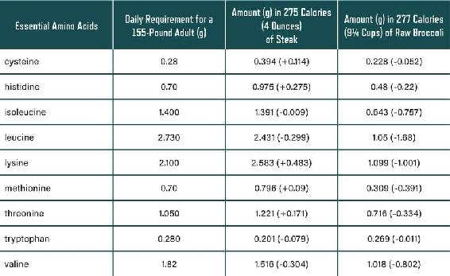

“Livestock take inedible and untasty grains and convert them into a protein-packed food most humans love to eat.”

—Jayson Lusk

## CHAPTER 14

### PROTEIN:

### BENEFITS AND PITFALLS

The dietary requirement for carbohydrate is effectively zero—humans do not need to consume any carbohydrate. Fat, on the other hand, is essential for health. The other essential macronutrient is protein. The average person must consume 60 to 100 grams of protein a day. Eating too little protein has serious consequences for health and vitality.

The highest-quality protein comes from animal foods—meat, fish, and eggs. That’s not to say you can’t get adequate protein from vegetable sources—you just have to be much more careful about what you eat. You can be a vegetarian and have robust health, but that’s not our focus in this book.^1^

The best protein sources tend to be foods that are also high in natural fats, especially animal foods. These also are rich in the fat-soluble vitamins, and eating them enables you to absorb vitamins and minerals properly.

You need to get the right amount of protein to match your muscle mass and activity level; then you can play with carbs and fat. The generally accepted required protein quantity is 0.4 to 0.6 gram per pound of lean body mass. The figure applies for an average, relatively sedentary human. More protein is necessary when activity levels increase.

Muscles are largely made up of protein and are constantly being broken down and rebuilt. People who exercise a lot and want to build muscle need to eat more protein. The exact amount is disputed, but the most common guideline is to ingest around 0.8 to 1.0 gram per pound of lean body mass. This is approximately double the accepted requirement for sedentary people.

It is important to note that “grams of protein” refers to exactly that—the amount of pure protein. For example, an egg might weigh 35 grams, but it contains only around 4 grams of protein. A slice of bread might weigh 35 grams, but it contains only around 2 grams of protein (and 16 grams of carbohydrate).

But not all advisers agree on these protein requirements. Some believe that it should be much higher, but recently there has been a push toward much lower. This will cause much confusion in the coming decade. These various influencers can’t all be correct!

### PROTEIN IN A NUTSHELL

Proteins are complex molecules made up of amino acids. Amino acids are fundamental for life—they make up our very DNA. Some amino acids can be produced by the body. Others must be acquired through our diet. The nine amino acids that we must get from food are called *essential amino acids.*

Amino acids can be linked to form long protein chains. These chains can be folded into complex shapes, which give the proteins new and powerful properties. That is where the magic of amino acids plays out—they enable endless possible proteins for myriad crucial functions.

Proteins also enable you to create enzymes, which are themselves clever proteins that can catalyze other necessary processes. Proteins conduct the billions of processes your body requires. Proteins are used to create all your crucial hormones and signaling molecules. Finally, proteins directly supply the main building blocks for your body tissues.

If your main goal is to remain healthy, maintaining the right type of diet can automatically cover your protein requirements, without your needing to count how much protein you’re eating. This is easier to achieve when you include nutrient-dense animal foods in your regimen, because these carry the highest-quality protein.

### QUALITY OR QUANTITY?

When we ingest food, the proteins in it are broken down into amino acids. We gather up these amino acids and reuse them. This is especially true for the nine essential amino acids.

In *Eat to Live*, a vegan diet book, some claims were made that broccoli provides more protein per calorie than steak.^2^ This is simply not true: 100 calories of broiled top sirloin steak has exactly 11.08 grams of protein, while 100 calories of raw broccoli has exactly 8.29.^3^ This is also a great example of the fact that animal foods have not just the most protein but the* highest-quality* protein. Figure 14.1 shows the reality (note that the nine essentials are shown here).

Figure 14.1. Steak nutritionally beats broccoli, hands down. Source: USDA Food Composition Databases, ndb.nal.usda.gov.

A small 4-ounce serving of steak provides almost all the essential amino acids that an adult requires. A serving of broccoli that has the same number of calories (about 9 cups) does not deliver enough of any of these essential amino acids. Don’t get us wrong—we like broccoli. It can be part of a healthy diet, and we eat it regularly. But we are not under any illusions when it comes to the best sources of protein. We focus on quality. You should as well!

In fact, there are many people who eat primarily meat and almost no carbs, and there are websites dedicated to their testimonials of robust health and vitality.^4^ We would not recommend this particular diet, but many people seem to thrive on it.

You have choices when it comes to protein intake. You can depend on vegetarian sources like artichokes, quinoa, and various high-protein beans and vegetables, but you must have great knowledge and skill to choose carefully from a wide range of foods to achieve optimal protein and nutrient intake. You will also likely have to eat foods that have been shipped long distances. Supplementation with crucial elements such as vitamin B12 is also required—you will not get this vital nutrient from plant foods.

In contrast, it is easy to optimize your nutrition when you consume nutrient-dense animal foods. Meats, fish, and eggs alone will deliver nearly all the nutrients you need. Vegetables and some fruits can then be added for additional nutritional benefits.

### PROTEIN’S WEIGHT-CONTROL ADVANTAGES

Most authorities on weight loss are aligned on one thing: a higher protein intake helps with weight-loss efforts. A simple Google search will fill the page with studies validating this point. A good example is a study that looked at high-protein (25 percent of total daily calories) versus low-protein (14 percent) diets in overweight men.^5^ Interestingly, the study also investigated meal frequency, a subject we feel strongly about (see here). All the participants were on the same calorie-restricted diet to aid weight loss.

The researchers found that the high-protein diet significantly improved three important aspects of appetite:

-  increasing a “full” feeling throughout the day

-  reducing the late-night desire to eat

-  reducing the preoccupation with food

The high-protein diet was well ahead of the low-protein diet on all three measures. This was expected, based on decades of research. But there was an interesting extra finding from the study: when eating the same number of calories but having fewer meals (three rather than six), the high-protein participants were fuller in the evening and late at night. The researchers concluded that the higher-protein diet not only suppressed appetite but also led to the improved feelings of fullness gained through the strategy of eating fewer meals. (The lower-protein group ate very little protein indeed at 14 percent of daily calories, while the higher-protein group ate a more reasonable 25 percent.) Note that this study only scratched the surface in a way, looking at quite short periods of intervention. We would say that a long-term strategy of correct diet combined with adequate protein and smart meal-separation will produce much more dramatic benefits.

Science has shown that if you don’t eat enough protein, you will continue to eat until you get it. The body has important requirements for protein, so our brains’ appetite-control systems are wired to drive us to get enough. Higher protein in the diet activates hunger-suppressing hormones, including peptide YY, GLP-1, and others.^6^

When digesting carb and fat, you absorb most of the calories they contain, but with protein, there is a significant waste or loss of calories as you digest it. This phenomenon is called *thermogenesis*. Higher-protein diets result in more losses through thermogenesis, but this effect also increases satiety and energy expenditure. The end effect is that you feel relatively fuller with protein than if you were getting the same number of calories from carb or fat.^7^

Higher-protein diets can also help stimulate muscle growth. This can lead to a preferential retention of lean muscle mass paired with a loss of fat mass. Myriad studies prove that quite small increases in protein intake can result in significant advantages in weight loss. Moreover, keeping protein intake higher can help prevent weight regain.

One recent trial examined men and women who had lost 5 to 10 percent of their body weight over a short period.^8^ The experiment increased protein from 15 percent of total calories to 18 percent in half the participants. Both groups were tracked over the following six months. Even with this very small protein tweak, the 18 percent group regained significantly less weight than the 15 percent one. This effect was independent of changes in cognitive restraint, physical activity, resting or total energy expenditure, and hunger scores.

#### A WEIGHT-CONTROL CAVEAT

Despite its advantages for weight loss, there is a slight drawback to a high-protein diet: while it’s not nearly as bad as carb, protein still drives an insulin response. If you are eating a lot of protein, the insulin release can be substantial. This is why our low-carb, high-fat plan recommends that you consume moderate amounts of protein.

For people who are not too insulin resistant, a higher level of protein will not have a detrimental insulin-raising effect. Protein generally produces around half of the insulin response that the same amount of carb does, and it has an even smaller relative effect on blood glucose, which rises very little and tapers off steadily.

For people with significant levels of insulin resistance, this is trickier. Type 2 diabetics in particular can have a magnified insulin response. Because protein takes a relatively long time to digest, insulin stays elevated for many hours, and this, of course, is not ideal. Muscle and other tissues are also constantly being recycled. This releases amino acids into the blood, increasing the pool of available protein. If you’re losing weight, the breakdown of excess skin and other tissue can supply a source of protein on top of what you’re eating, and this can contribute to an excess of protein at any time.

Much of what happens when we eat protein—or carb—reflects the balance between the hormones insulin and glucagon. Insulin and glucagon are opposing forces. At its simplest, insulin drives fat storage and promotes tissue growth (its “anabolic” or building function). Glucagon, on the other hand, promotes the release of fatty acids from adipose tissue and the release of glucose from glycogen—in the absence of food, these are used for energy. In the fed state, insulin is generally high and glucagon is rightly suppressed. The opposite occurs in the fasted state, with glucagon going high to free up energy from fat or other sources.

High-carb meals drive insulin high, keeping glucagon low. Protein drives insulin also, to help build muscle from the ingested protein. But it also stimulates the release of glucagon—that way, the drop in blood glucose insulin causes is balanced by glucose (and fatty acids) coming into the bloodstream from storage, so overall, blood sugar stays stable. But when someone who’s insulin resistant eats a lot of protein with lot of carb, this balancing act is tricky to achieve, and this leads to an unstable hormonal situation and unpredictable blood sugar levels. This kind of situation should of course be avoided—we must always strive for low and stable blood sugar and insulin levels.

This is why our plan centers on low carbohydrate and *moderate* protein. If you are keeping carb in a healthy low range, then there is room for a higher amount of protein, since both stimulate insulin. Eating a higher amount of healthy fat provides energy without provoking insulin or a rise in blood glucose, and this combination is optimal for most people. Whether you are losing weight or maintaining your weight, whether you are insulin sensitive or insulin resistant, this combination of low carb, moderate protein, and high fat should fit. The goal should always be to keep insulin low. And generally this means high glucagon, insofar as it is possible.

### PROTEIN AND THE KIDNEYS

One of the most common myths about high protein is that it drives kidney disease. No scientific research supports this notion. The myth probably came about due to the fact that people with existing kidney disease can indeed have problems with a high protein load. But it is wrong to suggest that it is a problem for everyone else.

Another possibility is that the kidney-damaging myth arose from the fact that the kidneys clear the protein-released nitrogen from the body. A presumption may have been made that high-protein diets could, therefore, put excessive demands on the kidneys. This doesn’t happen in reality.

As we mentioned, the brain has an intricate control system to manage dietary protein intake. The body’s ability to manage protein indeed has an upper limit. But just as it demands that you eat until you get enough protein, the brain will step in and tweak appetite and food selection if too much protein is being consumed. You would have to work hard to fully override this control system.

When tested experimentally, it has been observed that high-protein diets change kidney parameters, including glomular filtration rate, which is simply a measure of kidney activity rate, estimated by the blood flow through it. This is to be expected—it is simply the kidney adapting to changing inputs, just the way any organ does. One of the better summaries of how protein affects the kidneys was included in a 2015 scientific paper: “While protein restriction may be appropriate for treatment of existing kidney disease, we find no significant evidence for a detrimental effect of high protein intakes on kidney function in healthy persons.”^9^

### PROTEIN ACTION STEPS

-  For the average person, target protein intake should be approximately 0.4 to 0.6 gram of protein per pound of lean body mass. This ensures adequacy, and there is no evidence to suggest that it is excessive.

-  People who are building muscle through exercise can safely ingest more protein. A good target intake is around 0.8 to 1.0 gram per pound of lean body mass.

-  Reducing protein could be a good strategy for someone who has health challenges that connect to insulin and mTOR pathways, such as cancer (see here)—lowering protein may prevent excessive insulin signaling and overactivation of mTOR.

At the end of the day, protein is a vital part of a healthy diet. We need to consume the highest-quality protein in adequate amounts. This will contribute greatly to health and longevity. It will also assist weight control through the satiety-inducing effects of protein.

The Eat Rich, Live Long plan addresses protein optimization for weight loss and longevity. The beauty of eating nutrient-dense ancestral foods is that they come ready-formulated with a good ratio of fat and protein.

With protein, the important thing is to neither overeat it nor limit it obsessively. The key is to get the balance right.

HOWARD’S STORY

Howard moved to the Denver area from the West Coast and needed to find a new doctor. He started seeing Jeff. Although quite overweight, Howard had never heard the word *diabetes* applied to him by his previous medical professionals. Jeff, however, suspected from his previous blood tests and weight that he was well along the insulin spectrum. Jeff explained that although Howard’s fasting blood glucose and other metrics appeared to be within a normal range, this did not mean that he was safely nondiabetic. While Howard’s LDL cholesterol was indeed low, the ratios Jeff calculated from his cholesterol panel spoke of insulin problems. Howard had never had a post-meal glucose reading taken to check his true status. Likewise, he had never had an insulin test. Therefore he could be very diabetic inside, but with his pancreas still healthy enough to pump out enough insulin, keeping his fasting glucose at an okay level. Remember that diabetes is properly identified by elevated insulin and insulin resistance criteria. Focusing on blood glucose is misleading; you can have high insulin—and therefore diabetes—even if your blood glucose is normal.

Jeff arranged for Howard to have an oral glucose tolerance test (OGTT). This is a procedure where you drink 75 grams of glucose and your blood glucose rise is monitored for the next two hours. It is far superior to a simple fasting blood glucose test for revealing health issues. Importantly, Jeff also ensured that Howard’s blood insulin levels were monitored during the two hours—this information is even more valuable than the blood glucose measurements. The results came back as rather grim: he had spectacularly failed, with both the insulin and blood glucose levels far above the healthy range, just as Jeff had thought he would.

Howard said he had always suspected that something was seriously wrong with his health in spite of his low cholesterol. He was happy now to find out the truth and wanted to know how best to go about fixing the problem. Jeff sat him down and didn’t pull any punches. With Howard’s level of insulin resistance, he would need to go on a very low carb diet immediately. This would begin the repair process, moving him toward the safe end of the insulin spectrum. Over time he might have to carry out further measures to optimize his health, but first things first.

Within weeks of following a very low carb diet, Howard’s belly had begun receding noticeably and he felt better than he had in years. Jeff verified the improvement by checking that his post-meal glucose levels were way down from the initial test. His fasting insulin was dropping sharply as well, sealing the deal. Howard has now fully embraced the low-carb lifestyle, along with many of the other beneficial strategies espoused in this book. Howard has truly collapsed his risk of chronic disease because he now knows about the most important measures of all—even though his previous doctors did not.
