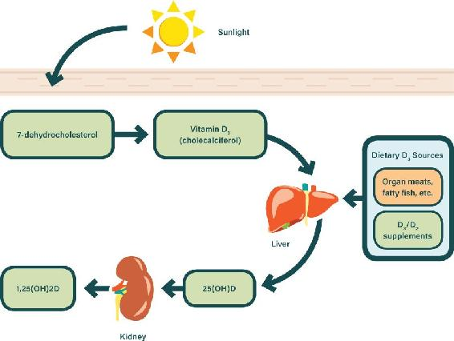
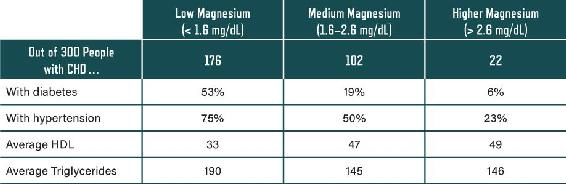

## CHAPTER 15

### WHICH VITAMINS AND MINERALS DO YOU REALLY NEED?

“By the proper intakes of vitamins and other nutrients and by following a few other healthful practices from youth or middle age on, you can, I believe, extend your life and years of well-being by twenty-five or even thirty-five years.”

—Linus Pauling

The human body is an enormously complex machine. Every moment of every day, billions of biochemical reactions are underway. These reactions require many different vitamins, minerals, and other nutrients. A healthy diet will supply most of these nutrients, and we strongly recommend that you target foods that can supply all your nutrient needs. That said, modern agricultural practices have left foods less nutritionally dense than they once were. In addition, we strive for *optimal*, not just adequate, health and longevity. Therefore, we need to top up certain key nutrients that may not be easy to get via our diets.

Notwithstanding the reasonableness of that goal, there has been much confusion about nutrient supplements. Experts have been wrangling over vitamins, minerals, and supplements for decades. Every expert has his or her particular angle. Also, multiple interest groups have inappropriately interfered in the discussion to further their own ends.

Pharmaceutical companies also produce supplements, and this means that there’s big business—and lots of advertising dollars—behind marketing and selling supplements. Pfizer, the maker of prescription medications Lipitor, Viagra, Celebrex, and many others, also manufactures and distributes Centrum and Caltrate. Bayer, famous for its aspirin and a multitude of over-the-counter medications, including Claritin, Aleve, and Alka-Seltzer, also produces One-a-Day and Flintstones vitamins.

Further complicating the issue is the fact that supplements do not have to be evaluated and approved by the FDA, so they can be sold without proof of effectiveness or safety (though there are manufacturing standards that must be met).

With all these large companies with deep pockets having a vested interest in promoting and selling vitamins, and no need to prove that their supplements actually do what they claim, how do you know what vitamins you really need? How do you push aside all the influences and develop a reasonable supplement strategy?

The answer is to look at the results of scientific research, not the claims of big business. In Chapter 7, we talked about the supplements that are most important when your body is adjusting to the Eat Rich, Live Long plan: potassium, sodium, magnesium, and omega-3. In this chapter, we’ll go beyond those to look at the main vitamins and minerals that people tend to be deficient in (though there’s some overlap here with those discussed in Chapter 7).

We’ll start with one that has received endless attention over the past few decades and has been the subject of countless arguments in the medical and research world: vitamin D. The debate on its importance and the appropriate level to consume is still raging.

### VITAMIN D: THE SUNSHINE VITAMIN

Humans evolved in the ubiquitous presence of the sun—we were continuously exposed to sunlight. The action of sunlight on human skin has profound biochemical effects, enabling the synthesis of many key photochemicals that are required for optimal health. One of the most important is known as “vitamin D,” but it is not a vitamin as such. It is a prohormone that is critical for use in manufacturing the active forms of vitamin D. There are many body processes for which the active forms of vitamin D are crucial: calcium management, bone health, immune system function, insulin sensitivity, vascular health, cell proliferation control, and many others.

You could rightly ask why vitamin D is inextricably linked with so many mechanisms in the body. One reason is that it became part of the human body’s control system very early in the evolutionary game. Several hundred million years ago, aquatic vertebrates had easy access to calcium. Bone synthesis and other important functions were easy to manage, and calcium was readily available in the sea all around them. But when the vertebrates migrated onto land, they faced a major challenge: how would they get calcium? The method that emerged involved the synthesis of vitamin D using ultraviolet (UV) energy from the sun. Vitamin D became linked to many processes besides bone formation. Figure 15.1 shows a simplified diagram of how vitamin D is manufactured in humans.

Figure 15.1. The power of the sun: UVB rays act on a cholesterol-type molecule in the skin (7-dehydrocholesterol) and convert it to the crucial vitamin D~3~. You can also access D~3~ from organ meats, fatty fish, and other rich ancestral sources. The D~3~ enters circulation and is used directly by tissues but also gets converted in the liver into 25(OH)D, enabling many more functions and also long-term storage. A final conversion step happens in the kidneys, where the highly active form 1,25(OH)2D is created.

Sunlight’s UV energy acts on a form of cholesterol to create what is called vitamin D~3~. This is the primary path humans evolved to get vitamin D. There are also dietary sources, but while ancestral foods were often rich in D~3~, modern foods are severely lacking in it. This has led many to take supplements instead.

Vitamin D~3~ from any source is processed in the liver and converted to a mildly active version of the hormone called 25-hydroxy D (or calcifediol; in blood test results, this shows up as “25(OH)D”). This is how the body stores vitamin D, and it’s what is measured in blood tests to determine vitamin D levels. This 25-hydroxy D is not the final-stage hormone, but it does play an active role in many important processes. Another conversion step is required to produce the more active hormone called calcitriol (in blood test results, this is “1,25(OH)2D”). The kidneys carry out this step. It is precisely regulated to ensure that correct concentrations are always maintained in the bloodstream.

It is important to note that vitamin D has many key interactions with the other fat-soluble vitamins, A and K~2~ in particular. Therefore, it is not necessarily a good idea to drive up your D status while neglecting the others. These fat-soluble vitamins as a group also interact synergistically with minerals such as magnesium and zinc. The ideal strategy is to ensure that you are getting adequate amounts of all the key vitamins and minerals—that way, you will be broadly covered for the interactions.

#### LOW ON D, HIGH ON DISEASE

How does being low in vitamin D associate with disease and mortality? Well, being lower in 25-hydroxy D associates strongly with rates of many modern diseases, as well as with increased mortality from them. Myriad studies consistently bear this out—for heart and arterial disease, colon and other cancers, diabetes, and many other diseases.^1^ As we’ve stressed throughout this book, there is no proof of causation in associational studies. That said, the 2x multiplier threshold, which is the minimum needed to show a strong and meaningful association, is regularly reached.

These studies were carefully executed and corrected for as many confounding factors as possible. They still do not prove causation. There is, however, a massive body of science supporting mechanisms through which vitamin D and its receptors could affect these disease outcomes. There is even experimental proof, but there is a lot of conflicting data in the literature around this. So why are many of these experiments ambiguous?

-  Generally, people high in D are more likely to get a lot of sun exposure. The sun has many biochemical effects on humans beyond the production of D. These beneficial effects may partly be driving the better outcomes.

-  Having a particular disease or illness can drive down D status, though there is limited data around this. Also, people who are ill may get outside less, thus depriving themselves of healthy sunlight and lowering their D status.

-  Some people may take more vacations in sunny locales and sport more of a tan. These people may also look after their overall health better—creating a further confounder.

Modern lifestyles have led to a general collapse in D levels. This is due to sun phobia, the fact that vitamin D is less abundant in food, and that fewer people are eating the ancestral foods that do contain it (e.g., organ meats, fatty fish, and pastured eggs). Another reason for the epidemic of low D levels is that obesity and inflammatory disease can drive down levels in the blood. We certainly have no shortage of these afflictions in our modern world.

We mentioned that vitamin D is primarily stored in the form of 25-hydroxy D. Evolutionary levels of 25-hydroxy D were generally in the 40 to 50 ng/ml range. These levels are observed today in native Africans in their natural environment and in Caucasians who have access to plenty of sun exposure.^2^ African natives who move to cities and adopt modern lifestyles end up with D levels around 20 ng/ml. Modern sun-starved Caucasians also tend toward this same lower level.

The implications of the modern drop in D levels is much debated in expert circles. Also, there is much controversy around the right supplementation regimen to maintain healthy levels. D~3~ supplements are most commonly measured in international units, or IU. Because this unit was chosen when the science of vitamin D was barely understood, it has an unfortunate drawback: it makes the genuinely required amount of D~3~ appear unreasonably high.

We’ll put things in perspective here. A minimally clothed Caucasian getting slightly pink from sun exposure will generate 10,000 to 25,000 IU of D~3~.^3^ The time required will vary greatly depending on latitude, time of day, skin type, and many other variables. In particular, people with darker skin will require much more sun exposure for the same amount of D synthesis. That said, twenty to thirty minutes in a bathing suit between 10 a.m. and 2 p.m. is a good rough guide. Like most natural biological mechanisms, this reaction is self-regulating. Getting a lot more sun will not maintain such high production rates. Evolution is good that way—it leads the body to grab what it needs and then back off when it’s happy. Likewise, when the blood level of 25-hydroxy D exceeds around 45 ng/ml, the body tapers off many D-related reactions. It would therefore be reasonable to assume that if you are not getting ancestral levels of sun exposure, you might consider taking several thousand IU daily as a supplement. This would be a reasonable assumption unless compelling evidence indicated otherwise. That is where the controversy lies.

Broadly speaking, there are two significant camps in this sphere:

-  Many D experts (including the Endocrine Society, a professional organization of endocrinologists) indicate that for full health, we should have 25-hydroxy D levels above 32 ng/ml.^4^ This puts us in the ancestral ballpark. For most adults, getting this level of 25-hydroxy D in the blood would require supplementing with 4,000 to 5,000 IU of D~3~ per day.

-  Official guidelines from the Institute of Medicine, however, maintain that having above 20 ng/ml of 25-hydroxy D is adequate for bone health. They assume this is good enough for any other beneficial effects and generally recommend supplementation of only 800 IU of D~3~ per day. This will have a very weak effect in raising blood levels. Recently, they acknowledged that up to 4,000 IU per day is okay, but they still recommend only 800 IU per day. Before 2013, they recommended only 400 IU per day.

All credible scientific evidence shows that up to 10,000 IU of D~3~ per day has no toxicity implications whatsoever. The best evidence suggests that you’d have to get 30,000 IU per day to experience any vitamin D toxicity.^5^ The quantity we spontaneously generate during healthy sun exposure bears this out.

#### LACTATING WOMEN SOLVE THE D~3~ RIDDLE

The American Academy of Pediatrics and other authorities currently inform women that their breastmilk is inadequate in D~3~; therefore, they recommend that supplements be given to all breastfed babies.^6^ How could this have come about? There were no supplements available for babies’ benefit as humans evolved. Why should women now have universally inadequate breastmilk? If “breast is best” in every other aspect, then what has gone wrong to make breastmilk inadequate in D~3~ today?

Breastmilk needs to have at least 400 IU of D~3~ per liter to be deemed adequate and supply the baby with as much D~3~ as the recommended infant supplements would achieve. We need to know why women’s breastmilk can no longer supply this amount of D~3~. Luckily a human experiment explored the enigma and explained it all in 2006.^7^ Pediatrician Bruce Hollis led the investigation, and he wanted to demonstrate how utterly obvious the answer was. He knew that women (and men, for that matter) need far more than the miserable 400 IU per day supplement that was recommended before 2013.

Hollis randomly split a large sample of breastfeeding women into two main groups. The first group followed the official recommendations and got a D~3~ supplementation of 400 IU per day. The babies were directly supplemented with 400 IU per day also. (When body mass is taken into account, the babies were given around fifteen times what their mothers were—which emphasizes the absurd nature of the guidelines for adults.) The mothers in the second group were given 6,400 IU of D~3~ per day.

So did Hollis prove that the correct daily supplement for women is in the 6,000 IU range? You bet he did.

Exactly as Hollis predicted, the mothers on 400 IU per day had breastmilk that was too low in D~3~. The breastmilk delivered only 70 IU per liter instead of the required 400. The babies therefore needed the direct D~3~ supplementation.

Also exactly as Hollis predicted, the mothers on 6,400 IU per day came through with excellent amounts of D~3~ in their milk, more than 600 IU—but only by taking sixteen times the recommended daily supplement quantity themselves.

And so the riddle of the inadequate breastmilk was solved—and with it the riddle of how much D~3~ we really need. For adequate D~3~ in her breastmilk, a woman needs to get several thousand IU of D~3~ a day. During human evolution, women would have gotten this amount through sun exposure and dietary sources. In periods of low sunlight, fish and other D-rich foods would have compensated.

The 25-hydroxy D form of vitamin D stored in the mother’s blood does not transfer to breastmilk—it is the vitamin D~3~ streaming in daily that transfers directly to the milk. The D~3~ form lasts only a couple of days in the body. Therefore, daily access to D~3~ through sun, diet, or supplements is required for optimal milk.

When doing experiments involving human subjects, an approval committee must judge on whether safety and ethics are appropriately addressed. Interestingly, in this case the committee insisted that Hollis include another group: one in which the mothers were given 2,400 IU per day of D~3~ (six times the daily recommendation). Hollis told them that this was pointless, as the babies would not get enough D~3~ in the milk. But the committee insisted. Exactly as Hollis predicted, this group of women taking six times the recommended amount for adults failed to produce breastmilk that had sufficient D~3~. The research team had to stop this group from continuing and immediately began supplementing the babies directly with D~3~.

#### IS THERE SUCH A THING AS A HEALTHY TAN?

Healthy sunlight exposure has a dizzying array of benefits for health, yet we have been told for decades to minimize sun exposure because of the risk of skin cancer.^8^ Melanoma is the skin cancer with serious mortality implications, and sun exposure without burning has never been proven to increase the risk of melanoma. In fact, some studies indicate the opposite could even be true—that exposure to sun without burning *decreases* the risk of acquiring or dying from melanoma.^9^

There is good evidence that high sun exposure does increase the risk of the “cosmetic” skin cancers (basal and squamous cell type). But these have very low mortality rates—approximately 1 percent of these cases result in death. Therefore, we believe that sun avoidance will likely lead to far more health problems than it prevents.^10^

Sunlight exposure has more benefits than we can get into here. It enables the release of nitric oxide in the body, which is crucial for vascular health and many other functions.^11^ It contributes to vasodilation (artery dilation for improved blood flow) and moderation of blood pressure.^12^ It also produces many photochemicals in the skin in addition to D~3~—the potential importance of these is only beginning to be explored.^13^ The fact that our bodies produce these chemicals when we’re exposed to the sun is not an accident. The sun has been with us for all of human evolution, and it has become inextricably bound up with the promotion of health in our bodies.

We do not know how many of the benefits relating to vitamin D levels are actually due to these other advantages gained from healthy sun exposure. There is enough evidence to support supplements as a very important intervention to raise D levels. That said, it is very possible that healthy sun exposure is a far more effective way to raise your levels of vitamin D because of the other benefits it brings in tandem. The jury is still out—and until we decode this area fully, accessing healthy sun exposure or an alternative UV source, such as a vitamin D lamp, is likely the best route to take.^14^

The point is illustrated by an interesting study that looked at sun exposure and its associations with mortality.^15^ The team sort of gave away the answer in the actual title of the study: “Avoidance of Sun Exposure Is a Risk Factor for All-Cause Mortality.” And that is what they found when they tracked 29,518 women over twenty years. “The mortality rate amongst avoiders of sun exposure was approximately twofold higher compared with the highest sun exposure group.”

So, along with many experts in the field, we recommend getting healthy sun exposure wherever possible. Of course, you should never allow yourself to get significantly sunburned—that is when the real damage can occur.

### MAGNESIUM

Adequate magnesium is hugely important for a properly functioning body and is arguably one of the most important nutrients to focus on for health and longevity. But our health system largely ignores it.

One major issue is that the blood test for magnesium is a very weak indicator of your true magnesium status. Even if you are terribly deficient, it can come back as “within the normal range.” Here’s why: Less than 1 percent of the body’s magnesium is carried in the bloodstream—most is sequestered in bone and other tissues. If you’re low in available magnesium, your body will leach it out of your bones to supply your needs. This will make the blood level appear to be okay—even when a desperate situation is occurring out of sight. Your level of free cellular magnesium is the most important measure, but this is not assessed in standard blood tests.

By 1957, low magnesium was shown in animal experiments to be a codriver of atherosclerosis.^16^ Unfortunately, this was the period when the diet-heart hypothesis—which claimed that saturated fat drives up cholesterol in the blood, and high cholesterol in turn drives up the risk of heart disease—began storming the US. Magnesium didn’t have a hope against the growing obsession with cholesterol and fat. The research into magnesium and its connection to heart disease (and other diseases) has quietly continued, but it appears that it is being largely ignored. Again, part of the reason may be that the common blood tests do not properly reflect underlying issues.

Figure 15.2. Low magnesium strongly tracks with all the CHD risk factors. Source: N. Mahalle, M. V. Kulkarni, and S. S. Naik, “Is Hypomagnesaemia a Coronary Risk Factor Among Indians with Coronary Artery Disease?,” *Journal of Cardiovascular Disease Research* 3, no. 4 (2012).

Low magnesium links to nearly all known cardiovascular risk factors, and to a rather impressive extent, as shown in a recent study of three hundred patients with coronary heart disease.^17^ The low-magnesium group had a greatly increased rate of nearly all risk factors, with very high statistical significance seen across the board. A selection is shown in Figure 15.2.

In this study, magnesium levels did correlate strongly to the dietary intakes recorded.

It is estimated that 70 to 80 percent of adults are not achieving dietary requirements of magnesium. Because of the blood test’s inadequacy, it is hard to estimate what proportion is truly low. Note that diabetes also causes loss of magnesium. So with most adults experiencing some level of diabetes, it is particularly important to ensure a healthy intake of this crucial mineral.

Sudden cardiac death (SCD) accounts for a significant percentage of overall heart-related mortality. These deaths are often attributed to a cardiac arrhythmia—irregularity in the heartbeat—rather than atherosclerosis-triggered events. An interesting associational study on SCD was carried out in 2010.^18^ It examined the blood magnesium levels of 88,375 women who were initially free of disease. The women with the highest dietary intake of magnesium had a 34 percent lower risk of SCD. The women with the highest amount of magnesium in their blood had a 77 percent lower risk of SCD. Therefore, the risk multiplier for being low in dietary intake of magnesium was approximately 2x, while the risk multiplier for being low in magnesium in the blood was approximately 4x. The fact that this was an associational study notwithstanding, these are impressive multipliers, and they point to the importance of magnesium in preventing heart disease.

There are also studies showing the effectiveness of magnesium supplementation in reducing heart disease risk. C-reactive protein (CRP), a reliable indicator of inflammation in the body, has always had a strong correlation with heart disease: many studies show a 3x to 4x risk multiplier associated with higher levels of CRP.^19^ This is unsurprising, as coronary heart disease is primarily driven by inflammation in the arterial walls, but the relationship between magnesium intake and CRP has attracted little attention. The few studies conducted have mainly been associational ones. In these, CRP usually correlates with low magnesium levels. But there is a 2007 study that was more revealing than the associational ones.^20^

In this study, researchers compared magnesium and CRP levels in heart-failure victims to those in randomly selected patients. As expected, the heart-failure group had lower magnesium levels and higher CRP than the random-patient group (average magnesium was 0.78 versus 0.86 mmol/L, and CRP was 39.8 versus 12.2 mg/dL). After only five weeks of magnesium supplementation, there was a large reduction in CRP in the heart-failure group. It dropped down to roughly the levels of the random-patient group.

Notably, they used only 300 mg/day of magnesium citrate supplementation to achieve this reduction in CRP. This is a modest supplementation for something as vital as magnesium. It is also notable that trials of magnesium supplementation in people low in magnesium have shown remarkable lowering of hypertension.^21^

We recommend targeting foods rich in magnesium. Examples are avocados, full-fat yogurt, and low-carb nuts like Brazil nuts and almonds. Dark chocolate will give you a boost, too. That said, we recommend taking a magnesium supplement to make sure you’re getting enough. We use the cheap and cheerful magnesium citrate powder, which can be purchased in bulk online and can be sprinkled on savory dishes without affecting flavor. Note that it can have a laxative effect until you get used to it, so make sure you don’t get too large a dose at once by spreading your intake throughout the day and ingest it with or just after a meal. Approximately 300 mg of magnesium in supplement form should suffice, assuming you are also getting reasonable quantities from your healthy food intake.

### VITAMIN K~2~

The “K” in “vitamin K” stands for *koagulation*, the German word for blood clotting. From its discovery in the 1930s through the late 1970s, we knew of no other roles for the vitamin. In recent decades, it has become more appreciated that the two forms of K have very different properties. While K~1~ is linked mostly to clotting processes, K~2~ has a unique range of important functions. K~1~ is important, and we certainly recommend getting plenty of it from green leafy vegetables, spring onions, broccoli, and other K-rich foods. However, K~2~ is the form today’s diets are more likely to be deficient in.

The importance of vitamin K~2~ for cardiovascular health only began to be appreciated in the last two decades. Of particular interest is its contribution to preventing calcification of the blood vessels and other soft tissues. K~2~ activates what are called GLA proteins, which inhibit inappropriate soft-tissue calcification. This means that K~2~ plays an important role in keeping calcium away from tissues where it could be problematic—arterial walls, for example.

K~2~ is also important for many other health benefits beyond those of the vascular system. It acts synergistically with vitamins A and D: in essence, it enables many reactions that allow A and D to provide their benefits to the human body. K~2~ is particularly connected to processes that distribute calcium to the parts of the body that require it (primarily bones and teeth).

The Rotterdam Heart Study points to K~2~’s importance in preventing disease. It followed 4,807 subjects over ten years and found that high intake of vitamin K~2~ was associated with a 26 percent reduction in all-cause mortality.^22^ In the same study, coronary artery disease mortality was 57 percent lower, while severe aortic calcification was reduced by 52 percent. Unfortunately this is an associational study, but still, the risk multipliers seen were very substantial. There are very few experimental interventions.^23^ It appears that the interest in K~2~ has not been high enough to encourage large-scale clinical trials.

In spite of the gap in high-quality trials, we believe that K~2~ is a very important vitamin to avoid deficiency in. When the associational, mechanistic, and limited trial evidence is combined, a rather compelling case can be made.^24^ A final point is that there are variants even within the K~2~ vitamin itself. On balance, the MK-7 variant would appear to be the best one to focus on.

How much might you benefit from ingesting daily? Generally, it has been estimated that 200 mcg of vitamin K~2~ (MK-7) will properly activate the GLA proteins that inhibit calcification.^25^ This would be a good ballpark number to aim for. While targeting the foods that deliver K~2~ is best, there are many supplements on the market for those who wish to go this route.

K~2~ is primarily found in animal fats and fermented foods. We focus on grass-fed butter and cheeses, goose liver pâté, organ meats, and of course a healthy range of grass-fed meats. Occasionally, we also partake of fermented foods rich in K~2~, which include sauerkraut and other fermented vegetables. If you really want to hit the K~2~ jackpot, you can get ahold of some natto—Japanese fermented bean curd—which is rich in the MK-7 variant.

Unfortunately, most people’s diet today is likely very low in K~2~. Intakes have suffered greatly during the era of the low-fat fad. With a high-healthy-fat diet, you will be able to buck this sad trend.

### IODINE

Iodine is a vital nutrient that is crucial for fetal development and during early childhood. But it is also hugely important to get adequate iodine all throughout life. It is required for proper thyroid function and much else.

The effects of a low dietary intake of iodine are stark. Symptoms can include difficulty losing weight, muscle weakness, lethargy, memory problems, high triglycerides and other cholesterol imbalances, and poor resistance to infections. We’ll stop there, but the list goes on and on.

Diet is our sole source of iodine, but the iodine content of the food we eat depends on what is available in the water and soil. The soil gets most of its iodine from the oceans (the primary source of the element), so areas far inland are generally poorly served. It was estimated in 1998 that one-third of the earth’s soil is poor in iodine.^26^

The World Health Organization has estimated that over a billion people have inadequate iodine in their diet.^27^ Many US experts flagged a growing problem with iodine deficiency in the late 1990s—they found that the number of people who were deficient was growing rapidly.^28^ From 1971 to 1974, there were only a few percent of men and women in the “very low” category. From 1988 to 1994, that figure jumped to nearly 15 percent for middle-aged men and nearly 25 percent for women. The criteria they used were based on absolute minimum perceived levels, and the requirements are arguably much higher for optimal health. So even in the 1990s, it was a rapidly growing problem. It is even worse now, as the soil has become further depleted. The only significant supply of iodine to the world’s soil comes from the oceans—seawater evaporates and becomes rainfall over land, transferring iodine to the soil. But with depletion from intensive cropping, alkaline fertilizers, and flooding/leaching/erosion, the supply line from the oceans has been strained.^29^ Interestingly, vegetables grown in iodine-deficient soil can have 1/100th of the iodine per pound as those grown in iodine-sufficient soil.

From the early 1970s to the early 1990s, Americans’ median iodine concentration decreased by 50 percent, while the numbers of people having levels below the 50 mcg/L minimum increased by 450 percent. The more recent analyses show that the US situation is continuing to worsen, especially for pregnant women. The WHO considers a urinary iodine concentration less than 150 mcg/L insufficient during pregnancy.^30^ Yet analyses have shown that median concentrations for pregnant women, which were 181 mcg/L in 2003–2004, reached only 125 mcg/L in 2005–2008.^31^ This is essentially a long, slow car crash for human health.

Current estimates also suggest that more than half of Europe’s population is iodine deficient.^32^ There have been many efforts to raise levels through the promotion of iodized salt and other interventions. These have had positive effects, with Europe’s levels now slowly rising. And we have to remember that “deficiency” is measured against the bare minimum requirements. These minimum requirements are what’s needed to avoid the most obvious problems, like an enlarged thyroid. But if you only just meet these minimal requirements, the consequences could still be very negative.

Breast cancer is just one area where iodine deficiency may have serious consequences. The breast tissue is particularly dependent on available iodine for healthy function.^33^ Quite a few iodine interventions had very positive effects on the common problem of breast pain due to fibrocystic disease and other issues.^34^ This would be important in itself, but there is another interesting implication. It appears that the conditions that cause breast pain are quite predictive of breast cancer in the future.

A 2005 study from the Mayo Clinic showed some pretty solid risk multipliers.^35^ They tracked 9,087 women diagnosed with benign, noncancerous breast disease related to fibrocystic and other symptoms for a total of fifteen years. The intention was to understand if these benign conditions led to higher chances of future breast cancer. They discovered that this group of women did indeed have a 1.56 times greater risk of breast cancer than a control group.

The study also categorized the appearance of cells in the biopsies of breast tissue. They found that 34 percent of the women had “proliferative” type cells, ones that demonstrated a worrying ability to self-replicate. Among these particular women, the risk for breast cancer in the future was approximately twice that of the control group (a pretty notable risk increase). For the 66 percent with “non-proliferative” cells, the risk multiplier was only 1.27x.

We are not aware of any trials testing iodine supplementation against incidence or severity of breast cancer, but because it’s well established that iodine supplementation can resolve these more benign diseases that increase the risk of breast cancer, it stands to reason that iodine supplementation may also be beneficial in preventing breast cancer. And there is widespread documentation of iodine deficiency in the general population. Scientific investigations have also closely linked iodine’s mechanisms in the body to factors involved in the risk of breast cancer.^36^

Because of potential negative effects with excessive dosing, we favor getting iodine in your food. Shellfish and seaweed are particularly rich sources, as are eggs, potatoes, and cheese. If supplementing, kelp tablets are a practical and safe way to boost your levels. We would broadly go with the WHO iodine recommendation for lactating women, around 290 mcg/day. But we view this figure as a minimum for most women and men, not just lactating women.

Particularly if you are already deficient, boosting your iodine may give many potent health benefits just by itself. Combined with all the other measures we prescribe, you may not quite believe how good you’re going to feel.

### OTHER VITAMINS AND MINERALS

A whole book could easily be written on important vitamins and minerals. We’ve chosen just a few to detail here. In many ways, they are the ones we feel are most in need of addressing. But they’re certainly not the only nutrients you need. Below is a short list of other important vitamins and minerals. For each, we’ll list some good food sources that are compatible with the Eat Rich, Live Long plan.

Vitamin A: Required particularly to interact with vitamin D, as the two vitamins are very connected in their bodily functions—the ratio of D and A is important to keep in balance. It contributes to many aspects of optimal health. Retinol is the ideal form of vitamin A and is found mainly in animal sources, especially eggs, liver, grass-fed butter, and heavy cream. Cod liver oil is a super supplemental source of retinol. Plant sources provide the less effective carotenoid form of vitamin A. This needs to be converted into retinol in a process that is inefficient in many people. Plant sources include broccoli, spinach, and most dark leafy greens.

Vitamin E: There are actually a range of vitamins under the “E” heading. The E vitamins are carried around the body by the lipoproteins discussed in Chapter 11, and they are important for antioxidant effects. Animal sources are generally not particularly rich in E vitamins, but among these, eggs, liver, grass-fed butter, and heavy cream are the best sources. Plant sources, especially nuts such as hazelnuts, almonds, and walnuts, deliver significant quantities of vitamin E. Green vegetables, including spinach and broccoli, are also useful sources.

B vitamins: The B-complex vitamins comprise vitamin B~12~, vitamin B~6~, thiamine, riboflavin, niacin, folate, pantothenic acid, and biotin. These all have important biological functions; in particular, they help your body turn food into energy. Pantothenic acid and biotin might be less available on a very low carb diet. That said, eggs, cheese, pork, shellfish, fresh vegetables, and organ meats such as liver are all good sources—so you should not skimp on these. In general, it is not a bad idea to take a B-complex multivitamin to cover all the bases. Note that people who are very low in B vitamins can develop profound and debilitating diseases, particularly neurological illnesses. Also, high homocysteine levels (a very significant risk factor for cardiovascular disease) are intimately related to being low on B vitamins, especially B~12~.^37^

Vitamin C: This important compound was thrust into the limelight through Linus Pauling’s work in the mid-twentieth century. It has many functions: helping to repair and regenerate tissues, protecting against heart disease, preventing scurvy, and assisting in lipid or cholesterol metabolism. Pauling and others completed much research that indicated that intensive vitamin C treatment may help protect against a variety of cancers. It may also support healthy immune function.

There is an ongoing debate around whether very high intakes of vitamin C can be instrumental in avoiding heart disease and other chronic diseases, but the jury is still out on this one. There is also some emerging evidence that vitamin C requirements may be much lower while on a well-formulated low-carb dietary regimen.^38^

It is important to note that the complete vitamin C molecule found in foods is very different from the “vitamin C” found in most supplements. The vitamin C molecule in whole foods contains rutin, bioflavonoids, factor K, factor J, factor P, tyrosinase, ascorbinogen, and other components. It also carries an antioxidant called ascorbic acid. In contrast, supplemental vitamin C overwhelmingly consists only of the ascorbic acid component. That is why we target vitamin C intake primarily from low-carb whole foods that are relatively low in digestible carbohydrate. Good sources are asparagus, berries, broccoli, cabbage, cauliflower, citrus fruits (such as lemons, limes, and oranges), kiwis, dark leafy greens (such as kale and spinach), bell peppers, potatoes, and tomatoes.

Zinc and copper: It is key to have an adequate zinc intake. One reason is that zinc interacts with magnesium and the fat-soluble vitamins, helping the latter to function optimally. The good news is that you are very likely to be replete in zinc on a low-carb regimen—lamb, beef, cocoa, yogurt, spinach, and many other recommended foods have plenty. However, being very high in zinc may not be so good if you are very low on copper—and vice versa. The *ratios* are important, rather than individual intakes.^39^ The foods richest in copper are organ meats, like beef liver and pâté, and seafood, including lobster, crab, and oysters. Dark chocolate also has impressive quantities, as do hazelnuts and Brazil nuts.

Selenium: Selenium is required for proper functioning of the thyroid gland and many other functions. An excess of selenium can lead to problems, so it’s generally best to get it from healthy food choices. Brazil nuts are extremely high in selenium, so a few of these a day will go a long way. Lobster, oysters, shrimp, and other shellfish also contain generous amounts. Meats such as beef, pork, and lamb are also rich sources.

Potassium: It is key to have an adequate potassium intake, particularly on a low-carb diet, when it can help combat the “low-carb flu” phenomenon. (We talked more about this on here.) Avocados are especially rich in potassium and also contain plenty of healthy fat, making them a great choice. Spinach and wild salmon are very good, too. If you’re not getting plenty of potassium in your food, then potassium salts may be a good addition. See here for more on potassium.

Sodium: It is key to have an adequate sodium intake. The potential issues with excessive sodium intake have been grossly exaggerated during the past decades. It is far more likely that your salt intake is too *low* rather than too high.^40^ This is especially true when you’re starting out on a low-carb diet. On a grain-based junk-food diet, you may be getting a lot of sodium. When you switch to a real-foods-based low-carb diet, you are likely to require more. (We talked more about this on here.) Liberally salting your food and enjoying broths are great measures to take. See here for more details on sodium.

Chromium: Chromium is a metallic element that we require in small amounts. It is an essential part of metabolic processes that regulate blood sugar, and it assists in the many actions of insulin. As with many other elements, modern agricultural practices have depleted the soil’s chromium content. Therefore, many people are mildly deficient in chromium, possibly the majority of people on Western diets. Beef, turkey, liver, and other organ meats are good animal sources of chromium. Lobster, oysters, shrimp, and other shellfish also contain generous amounts. Plant sources include tomato, spinach, onion, broccoli, garlic, and green peppers.

Berberine: Berberine exists purely as a supplement. It is extracted from certain types of plants (for example, barberry, Oregon grape, and goldenseal). It has been used for three thousand years in traditional Chinese medicine. Many published studies have shown it to be a moderately helpful treatment for type 2 diabetes and metabolic syndrome. Its beneficial effects can include reducing blood glucose and triglycerides, and improving LDL particle quality. It can also deliver some improvements in overall glucose tolerance. In recent years, the more detailed mechanisms for berberine’s action have been studied, and they involve the triggering of many hormonal pathways.^41^ In general, we would always favor the proper application of our ten steps to improve these conditions, however.

JIM’S STORY

Jim was a very heavy guy with major health complaints. He was over 350 pounds with 45 percent body fat. His waist size was a whopping 60 inches. Years before, he had had elevated liver enzymes, and his doctor kept asking Jim how much he was drinking. No matter how many times Jim told him that he drank very little, no more than a couple times per month, the doctor kept telling Jim to reduce his alcohol intake. It turned out, the elevated liver enzymes were due to a fatty liver from consuming excessive carbohydrate. Jim was essentially diabetic, though his doctor didn’t realize it. It was most frustrating for Jim at the time.

But then he researched a low-carb, high-fat diet and began to follow all the steps of our plan. This enabled him to experience a complete transformation in his weight and health.

He eliminated all sugar, processed food, and vegetable oils, which he feels was crucial to his success. He then went on a whole-foods-based low-carb, high-fat diet. After a week or two, this regimen enabled him to deploy various fasting strategies—one meal per day, some full fast days, and even more extended fasts exceeding twenty-four hours. He also began to focus on always getting a good night’s sleep.

After the first six months, when he had lost a lot of weight and was feeling great, he began to take up some exercise. He became an avid runner, and it is now one of his main hobbies.

So what are his body metrics now? Well, in only a year on the plan, his weight has collapsed down to 177 pounds. And his body fat is down to a healthy 18 percent. What’s more, he can now comfortably fit into his new 34-inch waist trousers!
