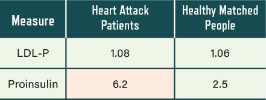

## APPENDIX C: HIGH CHOLESTEROL CONCERNS

For those who are interested in learning more about the lipoprotein tests, ApoE4, and familial hypercholesterolemia, we’ll explore them in more detail here. The truth is that the science around the last two conditions is not nearly the slam-dunk that has been suggested. The risks associated with having the ApoE4 gene or familial hypercholesterolemia are heavily dependent on things other than “cholesterol.” We’ll pick up where we finished in Chapter 11—the LDL particle count metrics.

### CHOLESTEROL MASTER CLASS: ADVANCED LIPOPROTEIN MECHANISMS

We talked about LDL particles and small, dense LDL (sdLDL) in Chapter 11 and noted there that high counts of both may indicate an underlying problem—specifically, they may simply flag that a state of insulin resistance is present and should be addressed. It’s possible, however, that these particles may also have a causal, contributory role in and of themselves. The theory is that LDL particles or sdLDL particles—which have been oxidized by inflammatory issues—can more easily enter the artery wall than other lipoproteins, so higher numbers of these would cause more damage to the arteries. But the evidence suggests that this only happens in cases where the artery wall is *already* damaged. LDL-P—the count of LDL particles—especially may have little or no relevance if there is no arterial damage or inflammation present. If your system is already fireproofed, then extra boats ferrying around fuel will not have any impact.

There is also a lot of evidence that damage to the particles causes arterial disease by triggering immune reactions in the arterial wall.^1^ There are even scientific studies that suggest that oxidative stress damage to the particles is one of the many causes of hyperinsulinemia and insulin resistance.^2^ Therefore, damaged particles can both *cause* and also *be caused by* a state of insulin resistance.

When an inflammatory state exists (due to elevated glucose and/or insulin), your LDLs tend to become oxidized and damaged. Related processes also tend to drive up the quantity of sdLDL particles along with the total number of particles (LDL-P). Therefore, the LDL-P will tend to track with disease, certainly—but because it’s indicating an increase in *damaged* particles, not just because of the mere number of extra particles around.

The current orthodox view is that the LDL particles themselves are toxic by their nature. We probably don’t need to stress how inherently absurd this really is. There are many studies where the LDL-P was disconnected entirely from the rates of disease.^3^ It is at best a fallible indicator of other problems.

Let’s look at one study of many where LDL-P showed no relevance for heart attack patients. A large number of recent heart attack patients were compared with a carefully well-matched set of people of the same age and sex who were apparently heart-healthy, with no history of coronary heart disease.^4^ What did the analysis show? *All* of the measures that relate to glucose metabolism and insulin resistance were different between the groups, with very high statistical significance. But the measure of LDL-P wasn’t different at all.

In this study they also measured an excellent indicator of insulin problems: proinsulin levels. As its name suggests, proinsulin is used to create insulin molecules. Thus, when proinsulin is high, it is highly probable that there is insulin dysregulation. Measuring proinsulin here showed that insulin resistance utterly dominated as an indicator of heart disease. The LDL-P didn’t show up as relevant at all (see Figure C.1).

Figure C.1. Again and again, insulin measures blow away “cholesterol” ones. Source: M. Bartnik, et al., “Abnormal Glucose Tolerance—A Common Risk Factor in Patients with Acute Myocardial Infarction in Comparison with Population-Based Controls,” *Journal of Internal Medicine* 256, no. 4 (2004): 288–97.

And there was more. Even though the researchers chose heart attack victims who were not known diabetics, a full 33 percent of them were found to have type 2 diabetes when tested. On further investigation, a full 67 percent of the heart attack patients had major glucose and insulin dysregulation issues (i.e., they were essentially diabetic). We talked about the 2015 EuroAspire study in Chapter 10, and we see here exactly what was demonstrated there: the huge factor in heart disease attacks is the diabetic phenomenon of hyperinsulinemia and insulin resistance. If Kraft’s glucose tolerance with insulin assay method of showing insulin status (see here) had been deployed, it’s likely that most of the remaining 33 percent would have shown glucose/insulin issues also. So what part is really left for LDL-P to play here?

More evidence of the ubiquity of insulin-resistance issues showed up in an unexpected place. The “healthy” group that the heart attack patients were compared to had specifically been chosen because they had no prior health issues at all. But upon testing, it turned out that 11 percent had type 2 diabetes, and an additional 24 percent were well on their way! If they were tested with Kraft’s method, we would guess that more than 50 percent of the “healthy” controls were not healthy at all. They would have occult diabetes or “diabetes in situ” simmering inside. We are at the point now where the majority of adults have some degree of diabetic dysfunction—whether they have a higher LDL-P or not. This is where the lion’s share of heart disease and other tragedies originate.

So is LDL-P mainly just a good marker for underlying insulin-signaling issues? It would appear to be a very reasonable explanation.

That’s why the ratios of triglycerides to HDL and total cholesterol to HDL, which you can get from the traditional lipid panel, are so powerful, especially if you don’t have access to the advanced lipoprotein test. The ratios trump the LDL-P in terms of predicting heart disease risk in most studies—so they are really the best cholesterol markers of all. The ratios indicate the level of hyperinsulinemia / insulin resistance, which is what both drives up the level of LDL-P and causes the heart disease that’s associated with it. When used properly, these cholesterol ratios win at the cholesterol guessing game.

However, you do not want to be guessing when it comes to your life. That’s why we recommend the CAC scan, which directly measures arterial damage (see here).

### CHOLESTEROL CONFUSION: THE FAMILIAL HYPERCHOLESTEROLEMIACS

Familial hypercholesterolemia (FH) is a genetic trait where lipoprotein receptors are less active, leading to more lipoproteins and cholesterol circulating in the system. This condition appears to have been mercilessly mined since the 1970s. One reason is that it lends vital support to the “cholesterol is bad” theory. As we mentioned earlier, LDL level only properly predicts coronary heart disease when it’s really, really high. Although not publicized, this was nonetheless clear from the Framingham Heart Study, which began in 1948 and is still ongoing. But then it was discovered that approximately one in four hundred people have a genetic tendency to run elevated LDL numbers. These people were recruited to bolster the LDL-is-bad dogma.

Something that affects less than three people in a thousand would normally get little attention. But in the 1970s, the country was convinced that cholesterol was the cause of heart disease. Cholesterol simply *had* to be bad, come hell or high water. So the spotlight was turned on this tiny minority of people, who were enlisted to provide much-needed support for a weak and sickly hypothesis.

These rare and special people with FH are not easy to define. There have been endless efforts to identify genetic markers for the condition; some have been found over time, and some of these are established as accurate. But many medical people still assume that FH may be present based only on an unusually high cholesterol reading.

People with FH have a higher rate of premature heart disease; just how much higher their risk is varies greatly. A risk multiplier of roughly 2.5x is cited by some authorities.^5^ But people with FH are not *consistently* at higher risk. Some get heart attacks early in life, but many live long healthy lives. And now the bombshell: *the ones who have heart attacks have the same LDL levels as those who remain healthy.*^6^

You see the massive problem here: If LDL drives the disease, then more LDL should track strongly with more disease. But even for people with FH, who universally have high LDL levels, it simply does not. Therefore, the prevailing theory that LDL directly causes heart disease is again revealed as simplistic and misleading.

So what *does* drive premature coronary heart disease in some people with FH?

A 2001 study on FH looked a little closer at what was driving the risk of coronary heart disease.^7^ Here are some of the really high risk multipliers they found:

-  lower HDL

-  higher sdLDL (a proxy for oxidation damage—see here)

-  insulin and glucose dysregulation (i.e., insulin-resistance issues)

-  smoking

What’s missing from that list? That’s right: LDL-P or ApoB, the measures of how many LDL particles are in the blood. Here’s one more study from 2001.^8^ The researchers scrutinized a group of men with known FH. Some had had heart attacks at a young age (around forty-one on average). Some were fine and had had no heart attacks. What made the difference here? Let’s take a look.

Compared to the FH men who hadn’t had heart attacks, the FH men who’d suffered heart attacks had:

-  significantly higher levels of insulin

-  significantly higher levels of insulin resistance

-  significantly higher levels of triglycerides

-  significantly higher levels of PAI-1 activity (blood-clotting factors driven by high levels of insulin)

-  significantly lower values of HDL

Again, what’s missing from this list and made no difference in whether they had an early heart attack or not? You guessed it: LDL level.

The last study we’ll look at is from 2014.^9^ This study looked at a relatively large number of FH people from 1994 through to 2013. What were the factors most linked to atherosclerotic events and heart attacks? You guessed it—all the factors that flag insulin-related dysfunction:

-  hypertension (8x risk multiplier)

-  type 2 diabetes (6x risk multiplier)

-  low HDL (2x risk multiplier)

-  high triglycerides (1.8x risk multiplier)

LDL managed to barely scrape over the line in this one with a 1.16x multiplier, but that’s vanishingly small compared to the risk caused by diabetes.

There are many studies that repeatedly show this reality.^10^ One from 2000 showed that total/HDL ratio was a crucial measure for risk of heart events in people with FH.^11^ One from 2005 placed insulin signaling at the center of FH and familial combined hyperlipidemia, a similar condition.^12^

Unfortunately, the general perception, even in the medical community, is still that FH is about “high cholesterol.” In reality, people with FH appear to be simply more susceptible to the various causes of coronary heart disease. Thus, they need to be particularly careful in eliminating them. If you have FH, you need to be especially careful to lower your insulin. You also need to avoid smoking, prevent high blood pressure from developing, and strive to achieve low inflammation (measured by C-reactive protein). You also need to be very diligent in tackling the other root causes of chronic disease: excessive carbohydrate, vegetable oils, lack of sun exposure, a sedentary lifestyle, and other concerns addressed in the ten action steps.

If you have FH and would like to push your LDL levels lower, this is absolutely fine, especially if you are not addressing all of the really important factors named above. For instance, if you’re happy to eat according to the carb-heavy food pyramid, avoid healthy fasting behaviors, smoke cigarettes, and never leave the couch, then lowering LDL is quite important.

In contrast, if you’re applying all the action steps and achieving excellent results in all markers but the cholesterol ones (insulin, blood glucose, blood pressure, waist size, trig/HDL, total/HDL), then you have more choice in the matter.

It is especially helpful for people in this situation to get a CAC scan. If your CAC score is low and/or not progressing over time, it can be greatly reassuring—especially because the CAC scan actually measures heart disease rather than a fallible surrogate like “cholesterol.” Combined with all the crucial measures of insulin regulation and inflammation, the CAC score will settle the matter more decisively than any cholesterol measurements can.

Because genuine FH is a rare and specific condition, some people may have exposure to risk in spite of taking all the appropriate precautions. For that reason, people with verified FH should discuss preventative treatment options with a specialist in the field. It may help to raise the points covered in this section, to ensure that the full picture is discussed between doctor and patient.
