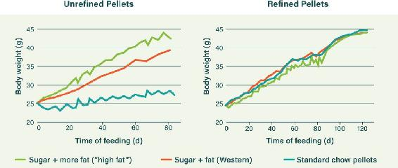
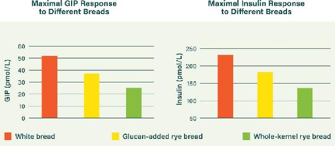

## APPENDIX D: THE INSULIN SPECTRUM

In earlier chapters, we talked about the insulin spectrum, with an unhealthy insulin resistance (which leads to diabetes, heart disease, and a host of other health problems) on one end and healthy insulin sensitivity on the other end.

Where you fall on this spectrum can determine every element of your health—how heavy you are, how damaged your arteries are, whether you have type 2 diabetes, and much more. So here we’ll lay out how insulin resistance develops, and we’ll start the story by revisiting the basics: glucose and the role of insulin.

### GLUCOSE: HIGH-OCTANE FUEL FOR HUMANS

Glucose—sugar—is a tricky fuel. As we explained in Chapter 3, it must be managed carefully or it will damage your body in myriad ways. Carbohydrate is essentially made up of glucose: in fibrous carb foods, such as vegetables, glucose molecules are arranged in stiff chains. The chains are difficult to break down into individual molecules, which means it takes longer for the glucose from these foods to hit your bloodstream. In contrast, nonfibrous, starchy, and sugary carbohydrates—such as pastas, breads, honey, table sugar, baked goods, and fruit juices—can be broken down rapidly into glucose molecules, so they hit your system rapidly. When this occurs, you could suffer dangerous concentrations of glucose in your bloodstream. Thankfully for most people, the body has mechanisms to prevent this.

The standard glucose quantity in an adult’s total blood supply is only 1.5 teaspoons’ worth. Carrying significantly more than this amount would cause serious damage to blood vessels, which over time can damage your internal organs, particularly the heart and kidneys. (Damage to the blood vessels from high blood sugar is also why diabetes is associated with nerve damage and poor circulation.) But blood sugar doesn’t rise this way unless the insulin-signaling system is damaged. Over the short term, at least, healthy people can handle high-carb foods. Here’s how.

Glucose molecules are first sensed in your upper gut, triggering an explosive release of a hormone called glucose-dependent insulinotropic polypeptide (GIP). It is the master glucose sensor. It is also the master switch to trigger insulin release—as GIP surges, it causes a surge in insulin. GIP also primes your fat cells for expansion.

Insulin attempts to safely mop up the incoming glucose by moving it into cells that will use it for energy. It also tells your muscles to stop burning fat—you can’t be burning fat when a risky fuel like glucose is flooding in. Insulin also helps to convert glucose to glycogen, a form of glucose that can be stored in your liver, and to fat—both glycogen and fat cells are safe ways to store glucose energy. Insulin also tells your liver to stop all glucose production until further notice and signals the brain to alter appetite response, too. (While insulin can act to suppress appetite in healthy people, it generally fails to perform this function in insulin-resistant people.)

Insulin does all of this and much, much more. It is the master hormone of metabolism.

All of the above processes should work pretty well in a healthy person. After all, our bodies evolved to manage carbohydrate intake. But in anyone who is even partially diabetic—anyone who has insulin resistance—it doesn’t work so well. Therefore, it does not work so well for the majority of adults.

Sustained high levels of insulin contribute to the buildup of insulin resistance through many mechanisms. In the simplest sense, the body reacts much as it does to sustained levels of a pharmaceutical drug. Cellular receptors that respond to insulin are downregulated in the face of excessive stimulation over time. This is a protective response intended to prevent overloading cells with glucose energy. However, it backfires badly when you continue to consume high amounts of glucose.

Most of us should not be putting lots of glucose into our bodies. We should be getting the bulk of our energy from healthy fats instead, so we can lower our insulin and improve its signaling. As our glucose and insulin levels drop, we move toward the healthy end of the insulin spectrum, with all the benefits that accrue.

### REFINED CARB: THE BEST FOOD FOR THE WORST HEALTH

We’ve said this repeatedly, but it bears repeating: the best strategy for good health and longevity is to keep your insulin very low, safely away from the insulin-resistance zone on the insulin spectrum. There are other factors, of course, but this is a central pillar—if you’re highly insulin resistant, nothing you do is going to have a significant impact on your health until you fix that. So how do we go about keeping insulin low?

For the answer, let’s look a little closer at GIP. It is the master switch for insulin release and is triggered by glucose in the foods we eat; it does not appreciably respond to dietary fat. But there is a crucial caveat that must be highlighted: dietary fat *potentiates* the GIP response to glucose. When it’s eaten along with carb (glucose), dietary fat, no matter how healthy in itself, has a magnifying effect on GIP release.^13^ The combination of dietary fat and glucose is thus to be avoided. In fact, in terms of insulin resistance, this is arguably the worst combination of all.

And of course, even without the addition of dietary fat, high-carb foods are packed with glucose and will send your GIP and insulin skyrocketing. Refined carbohydrates are the very worst offenders. They are true disaster foods.

There are many studies that illustrate this point, but let’s look at just one that shows up the problem elegantly. In this experiment, mice were fed three different types of diet.^14^ One was standard high-carb chow pellets (the correct evolutionary diet for a mouse). Their weight gain was steady and appropriate, as can be seen in Figure D.1.

The other two diets were nasty indeed. They were made up of high amounts of fat *plus* high amounts of carb. Ouch. You can see the nasty weight gain that occurred with the fat-plus-carb diets in the top two lines of Figure D.1. These were very fat mice indeed—with fatty livers to boot.

But then the researchers took all three of these unrefined pellet diets and did something very clever. They simply ground down the pellets to a powder. Nothing else was changed in the composition of the pellets—they were just mechanically refined. This broke up the “whole food” cellular structure of the pellets and made the glucose much more accessible.

Figure D.1. A sugar-and-fat combo diet destroys those poor mice, and refining the carb makes the “healthy” chow act like a sugar-and-fat combo. Source: C. Desmarchelier et al., “Diet-Induced Obesity in Ad Libitum–Fed Mice: Food Texture Overrides the Effect of Macronutrient Composition,” *British Journal of Nutrition* 109, no. 8 (April 2013): 1518–27.

Once it was refined, the previously healthy chow became just as bad for weight gain as the worst junk-food diet, as you can see in the right-hand graph in Figure D.1. We now see the catastrophic implications of refining. And this is just *mechanical* refining—grinding down the original carby chow. Imagine how bad our refined foods are when chemicals and industrially refined oils are added to the mix.

The same kind of effect can be seen in human experiments.

One study that illustrates just one of the many problems with bread and other refined carbs scrutinized the effects of both refining and fiber content on GIP and insulin.^15^ Remember, raising GIP also raises insulin, and the higher GIP goes, the higher insulin goes. As you can see in Figure D.2, white bread—the most refined bread—is the biggest offender, triggering the biggest release of GIP. Ouch. The rye bread with added fiber (glucan) wasn’t much better. The unprocessed whole-kernel rye bread was the best of the lot.

Unsurprisingly, the insulin response corresponds with the GIP levels, as we can see in Figure D.2. Again, processing whole ingredients results in much higher insulin provocation. But the most interesting result from the study was in the detailed analysis. The authors found that the insulin response was not improved by adding fiber (one hypothesis had suggested that speedier “gastric emptying”—moving food out of the stomach faster—would reduce insulin).

What did make a difference? Just one thing: the cellular structure of the grains in the bread. Keeping the grains in their original form helped reduce the insulin response (though it’s still too high for us). Yet again, it was mechanical grinding of the grains that transformed the bad into the terrible.

Figure D.2. Unprocessed breads provoke less GIP and insulin. Source: K. S. Juntunen et al., “Postprandial Glucose, Insulin, and Incretin Responses to Grain Products in Healthy Subjects,” *American Journal of Clinical Nutrition* 75, no. 2 (2002): 254–62.

### THE ROAD TO RUIN:  
FAT DYSFUNCTION

When insulin levels are consistently high, fat cells are the first to become insulin resistant.^16^ The functionality of fat cells, or adipose tissue, is of enormous importance. They produce many key hormones that signal the liver and other organs.^17^ The purpose of this signaling is to optimize overall system control depending on how energy is moving in and out of fat cells. This control system was not designed to deal with our modern food environment, however. Breaking the nutritional rules undermines everything. When adipose tissue becomes more insulin resistant, this signaling is disrupted, which primes your body for systemic, overall insulin resistance—and all the health problems that accompany it.^18^

A great example to illustrate this is lipodystrophy, a medical condition in which the body is unable to create sufficient adipose tissue. People with lipodystrophy appear remarkably skinny, but their lack of adipose makes them highly insulin resistant and diabetic from birth.^19^ If healthy adipose tissue were transplanted into them, it would resolve their diabetes.^20^ Such is the power of healthy fat cells.

In addition to inducing insulin resistance, driving excessive insulin through a bad diet also enlarges fat cells, a state called *hypertrophy*. When this occurs, your fat cells will no longer act as a buffer between the food you eat and your overall system.^21^ In normal circumstances, fat cells are able to take in energy smoothly when you eat and release energy smoothly while you are not eating, thus acting as a perfect buffer to keep the system continually optimized. This important function of fat cells becomes damaged when the cells are compromised. Having unhealthy fat cells is the best way to progress along the spectrum toward insulin resistance.^22^

As more fat cells become enlarged, the consequences mount. The immune system is called in to assist the hurting fat cells.^23^ Immune cells called macrophages tackle the larger adipose cells and start breaking them apart. Normally this would help, but as long as insulin is kept high, more fat cells become enlarged. Over time, a vicious cycle results: the immune system attack actually enhances insulin resistance through many pathways and slows the creation of healthy fat cells (which might have helped to absorb the bad food).^24^

This inflammation of adipose tissue doesn’t only happen in overweight people. You can have a normal body weight and still have damaged (and damaging) adipose. Conversely, you can be obese and have healthy adipose. One study compared obese people who were insulin sensitive to obese people who were highly insulin resistant.^25^ Both groups had an average body mass index of approximately 45 (a BMI over 30 is considered “obese”). They were all supersized guys, for sure. But some were healthy and some were burning up inside. Some were in the safe zone of the insulin spectrum and some were falling off the disastrous end.

So what was the crucial difference between them? It turns out, their insulin sensitivity, or lack thereof, was indicated by the macrophage content of their adipose tissue.

-  The insulin-sensitive group had “safe fat”: their fat cells were small and there was hardly any macrophage activity.

-  The screamingly insulin-resistant group had “sick fat”: their fat cells were enlarged and there was seething macrophage activity.

This study discovered that you could almost perfectly predict insulin resistance using just two measurements, the macrophage content of adipose tissue and blood levels of adiponectin, a hormone released by adipose tissue.^26^ Healthy fat releases much greater quantities of this crucial hormone.

Inflamed, enlarged fat cells are a key signal—and accelerator—of insulin resistance, and they trigger a range of other problems.

### THE ROAD TO RUIN:  
THE VLDL MERRY-GO-ROUND

In someone with small, healthy fat cells, these cells work as a beautiful battery system, absorbing calories, storing them for later use, and steadily releasing them when you are not eating.

When your adipose tissue is impaired, this doesn’t work the way it should. It starts because impaired adipose tissue leads to the creation of more VLDL particles—which, as you’ll recall from Chapter 11, deliver cholesterol and triglycerides around the body. Triglycerides are fats that can be used as fuel, so they’re basically energy floating around the bloodstream.

In addition to absorbing energy from food, adipose tissue absorbs excess triglycerides. So when the adipose tissue is busy mopping up energy (triglycerides) from the increased amount of VLDL particles in the bloodstream, the liver is left to handle some of the energy from food. This is not good. It promotes fatty liver disease. It also results in the creation of more VLDL particles as the liver attempts to export this energy that the adipose didn’t want to take. Do you see the craziness here?

This is the VLDL merry-go-round you suffer from when you move up the spectrum toward insulin resistance. As it spins around and around, it racks up your count of VLDL and LDL particles. It all goes back to high insulin and enlarged, insulin-resistant fat cells.

### THE ROAD TO RUIN: ENDGAME

People who move beyond the safe end of the insulin spectrum are essentially diabetic. But most become sick or die without ever getting their type 2 diabetes diagnosis. (If they were administered the insulin-response pattern test created by Kraft, their diabetes would become clear. But doctors rarely use Kraft-type tests, so many people remain secret diabetics and never know what’s at the root of their chronic health problems.)

For most people, a diabetes diagnosis doesn’t happen until they progress to the endgame and the wheels entirely fall off their insulin wagon. At that point, after years or decades suffering diabetic damage to blood vessels and organs, they reach a point where their blood glucose levels finally spiral out of control and the standard tests reveal they have diabetes.

So what does this final stage of diabetes look like? When you’re at the bad end of the insulin spectrum, you have built dangerous levels of fat in many of your organs, whether you appear to be overweight or not.^27^ Your liver, your pancreas, your kidneys, even your skeletal muscle will be packing inappropriate levels of fat, called ectopic fat.^28^ This fat prevents the proper functioning of your organs.

As high levels of glucose in your bloodstream require high levels of insulin and those high levels of insulin lead your cells to become insulin resistant, your body releases more and more insulin to keep the system working, until eventually, after many years of outrageous insulin demands and a buildup of ectopic fat inside and around it, your pancreas begins to give up. And then you are in serious trouble.

In addition to moving glucose out of the bloodstream, insulin keeps the brakes on adipose tissue, preventing it from releasing fat into the bloodstream inappropriately.^29^ As the insulin supply from your abused pancreas peters out, the insulin guard finally loses control of adipose tissue, and the adipose begins its jailbreak. Previously locked-up fat begins a steady escape into your bloodstream.^30^ It makes its way quickly to your poor old liver, which has to do something with the fat—it has no choice. And so the liver makes glucose out of the fat in a process called *gluconeogenesis*. Glucose begins to flood out of your liver—precisely when it’s the very last thing in the world that your diabetic body needs.

The overload of insulin and fat in your bloodstream is joined by glucose pumping out of your liver. These three things should never be elevated together. Welcome to the endgame. You might now finally receive your official diabetes diagnosis.

But of course there’s a better way: Right now, adopt the ten action steps on here to here. Whether you’re one of the lucky few who are currently insulin sensitive or you’re heading down the road to severe insulin resistance, these changes will make you healthier, improve your longevity, and reduce your risk of heart disease, diabetes, and other chronic diseases. Then get your fasting insulin and fasting blood glucose levels tested and calculate your insulin resistance using a HOMA calculator (see here). With your new knowledge about your level of insulin resistance in hand, you can start to customize your diet and lifestyle to optimize their effect on your insulin.

WHAT WE CAN LEARN FROM THE KITAVANS

Defenders of a high-carb diet always bring up the Kitavans. These indigenous people of Papua New Guinea have vanishingly low rates of coronary heart disease and cancer, even though they eat quite a high percentage of unprocessed carbohydrate, along with a lot of fish, meat, and saturated fat from coconut. And 75 percent of them smoke!

How do they achieve this excellent health with high carbohydrate? Well, they have an incredible number of other factors in their favor: No processed foods, no wheat, no refined sugars. Very low iron status, which reduces oxidative damage to cells. Very high sun exposure (for excellent vitamin D and many other benefits). Very low stress. A diet based on highly nutritious real foods. An excellent ratio of omega-6 to omega-3. The list goes on and on.

It’s true that it is possible to make higher-carb diets work. The surprising solution involves eating bizarrely low levels of fat. A quirk of our biochemistry enables insulin sensitivity for some people on ultralow fat diets. But you need the right combination of genes, and you need every other advantage switched hard to the optimum—like the Kitavans. Regrettably, this is simply impractical to the point of impossible for most people in the Western world. There is no “engineering” solution that can make this combination work for most people—and trying to make this work would be much more difficult (and less satisfying) than following a low-carb, high-fat diet, which has the same benefits.

That said, we can learn something valuable from the Kitavans. Their insulin and glucose levels are, unsurprisingly, incredibly low. With the same activity level and other factors accounted for, the Kitavans’ insulin levels were half those of Swedes in the 1970s (and that was before the current epidemic of insulin resistance).^31^ Also, essentially none of them had glucose levels above baseline healthy levels. Regardless of their diet, they achieved insulin nirvana. That is one of the primary reasons for their vanishingly low rates of coronary heart disease.
