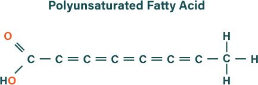
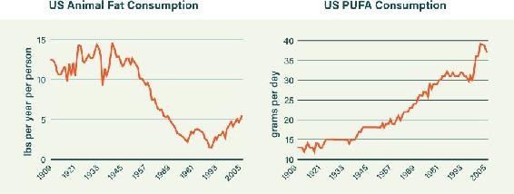
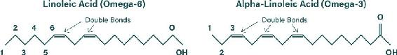
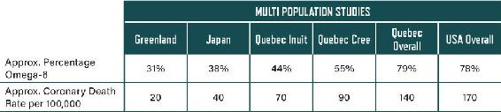
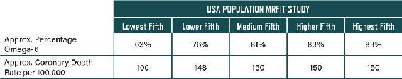

## APPENDIX E: THE SCIENCE OF POLYUNSATURATED FATS

We talked about polyunsaturated fats and how it’s important to avoid vegetable oils earlier in the book. If you’re curious about why we’re so emphatic about this—especially given the usual advice from health authorities to seek out polyunsaturated fats—this appendix offers quite a bit more information.

### THE FATS WE’RE MADE OF

There are three types of fatty acids: saturated, monounsaturated, and polyunsaturated. The word saturated in all these refers to the molecular structure of the fatty acid: if there’s a pair of hydrogen atoms for every carbon atom in the molecule, it’s saturated; if one hydrogen pair is missing, it’s monounsaturated; and if more than one hydrogen pair is missing, it’s polyunsaturated.

To visualize a polyunsaturated fatty acid (PUFA) molecule, think of a centipede whose body is a string of carbon atoms. Two oxygen atoms are incorporated at the head. Hydrogen makes up the legs along each side; wherever a carbon atom is missing its own hydrogen pair, it forms a double bond (depicted by small parallel lines in the diagram) with another hydrogen pair. These double bonds make PUFAs more prone to oxidative damage. PUFAs are delicate, and when oxidized, they become very unstable, which can cause much damage in the body. (Saturated fatty acids, by contrast, with no double bonds, are stable, robust, and resistant to damage.)

PUFAs play a key role in the construction of our cell membranes and in our signaling networks throughout the body. That said, our bodies consist of mostly monounsaturated and saturated fat. These make up around 90–95 percent of our total fat content. The remaining 5–10 percent is PUFAs.

Because our bodies cannot make PUFAs, we need to acquire them from our food. Up until the beginning of the twentieth century, our food contained very small amounts of PUFAs (though plenty for our needs). Around the mid-twentieth century, monounsaturated and saturated fats made up over 90 percent of the “sweet fat that sticks to our bones.”^32^ The percentages may have been much higher before the vegetable oil revolution in the early 1900s. So traditionally, only a very small amount of our body fat was polyunsaturated. This makes a lot of sense for safety—saturated and monounsaturated fats are much more stable than polyunsaturated and less prone to oxidative damage. But the percentage of polyunsaturated fat in our bodies has increased dramatically in the past half century.^33^ We believe that the implications of this are profoundly negative, as we’ll discuss in more detail in a few pages.

Because PUFAs are prone to oxidization, they need to be balanced with the more stable fats. The main kinds of PUFAs also interact with each other to a huge degree, so they need to remain balanced with each other, too. Think of PUFAs like vitamins and minerals: we need them for what they do in the body, but they should not be eaten to burn as fuel. In short, PUFAs are not something you should eat too much of.

And yet we have all heard that consuming polyunsaturated fats is beneficial for heart health. Does the data back that up? The rate of coronary heart disease explosively increased during the first half of the twentieth century. Were people eating more animal fat (that is, saturated fat) during this period? Or were they eating more PUFAs? According to the USDA, animal fat consumption has been decreasing (especially since about 1950) while PUFA consumption has been increasing.

We’ll explore why this is the case in the coming pages. It certainly suggests, however, that the usual advice to eat less saturated fat and more PUFAs should be treated with skepticism.

Figure E.1. As saturated fat consumption has fallen greatly and polyunsaturated fat consumption has risen, chronic disease has exploded. Source: USDA.

### INTRODUCING OMEGA-6 AND OMEGA-3

There are two primary types of PUFAs: omega-6 and omega-3. Both are termed “essential fats” because the human body cannot make them; they must come from dietary sources. The minimum quantities the body requires are very small. Estimates put the figure at less than 1 percent of total caloric intake.^34^

#### OMEGA-6

Historically, humans consumed very small amounts of omega-6. In nature, it’s abundant in eggs, chicken, beef, butter and other dairy, and nuts and seeds. Today it’s also found in refined vegetable oils and the many packaged and processed foods they’re used in: fast food, cakes, cookies, crackers, salad dressings, and more.

Early human experiments on the consumption of higher quantities of omega-6 backfired spectacularly: people died in greater numbers than the control group, who just ate their normal fats.^35^ The evidence later indicated that excessive amounts of omega-6 promotes inflammation. Omega-6 fatty acids have been shown to control and regulate the local tissue production of cytokines and chemokines, molecules that are involved in signaling within the immune system and have a direct effect on your body’s inflammatory response.^36^ There is a very real necessity for inflammation—it’s a key part of the body’s response to injury or damage. But when inflammation becomes excessive, systemic, and chronic, disease results.^37^ The scientific literature is bursting at the seams with mechanisms that link the effects of excessive omega-6 to a vast array of diseases, including our most feared mortality drivers: heart disease and cancer. Billions of dollars have been invested in drug investigations aimed specifically at moderating the excessive actions of omega-6 in inflammation—aspirin, NSAIDs, and many other anti-inflammatory drugs have all been looked at as possible treatments.^38^ Increasingly, concerns are being raised about the side effects of some of these drugs. It may in fact make far more sense to tackle these inflammatory pathways with nutritional interventions that positively influence them.

Figure E.2 shows the primary omega-6 fatty acid, linoleic acid. The two sets of parallel lines in the left half show the double bonds between the carbon atoms.

Figure E.2. Linoleic acid, the primary omega-6 fatty acid, and alpha-linoleic acid, the primary omega-3 fatty acid.

The body converts linoleic acid into arachidonic acid (AA), and from there into yet another fatty acid. AA is a highly unsaturated fatty acid, or HUFA.

#### OMEGA-3

Historically, like omega-6, omega-3 was consumed in relatively small amounts. It’s abundant in fish and shellfish (cod liver oil is an excellent supplement), nuts and seeds, above-ground green leafy vegetables, and pastured eggs.

In contrast to omega-6, omega-3 fatty acids have been shown to have an anti-inflammatory effect in the body, which is beneficial for a wide range of chronic diseases that have inflammation at their root.

Figure E.2 shows the primary omega-3 fatty acid, alpha-linolenic acid. The three sets of parallel lines in the left half show the double bonds between the carbon atoms.

The body converts alpha-linoleic acid into a fatty acid known as eicosapentaenoic acid (EPA). EPA is then converted to docosahexaenoic acid (DHA). Both EPA and DHA are crucial components of a healthy physiology. DHA is central in the healthy functioning of our brain, vision, and reproductive systems. Like arachidonic acid, which is made from omega-6, EPA and DHA are considered highly unsaturated fatty acids, or HUFAs.

Rather than converting alpha-linoleic acid, we can get EPA directly from grass-fed animals, and both EPA and DHA can be directly accessed from fatty fish and cod liver oil. As a general rule, it is advantageous to get more EPA and DHA from the animals that did such a great job of creating them.

#### HUFAS

The HUFAs made from omega-6 and omega-3—AA, EPA, and DHA—take up residence in the membranes of your cells and enable their core functionality.

A key point to note is that omega-6 and omega-3 are converted to HUFAs by the same enzymes. They compete, in a sense, over these enzymes. All things being equal, the body slightly favors the omega-3 for conversion. But of course, if you are gorging on omega-6, that slight favoritism won’t make a difference. Even if you’re trying to take in more omega-3, the amount you’re consuming may not be converted to the HUFAs your body needs, because the larger amounts of omega-6 are commandeering the necessary enzymes.

Many of the trials involving increasing omega-3 were of little value. What’s key is not necessarily increasing omega-3, although there is some value in that, but in moderating omega-6 intake. In some the participants were already drowned in omega-6 from their normal diets. In others the people were already quite adequate in omega-3.^39^

Figure E.3. Omega-6 in tissue tracks closely with CHD rates. Source: W. E. M. Lands, “Diets Could Prevent Many Diseases,” *Lipids* 38 (May 2003): 317–21.

### THE RATIO REIGNS

In many ways omega-6 and omega-3 are opposing forces. Omega-6 is converted into compounds that enable inflammatory responses. Omega-3, in contrast, tends toward anti-inflammatory effects. They need to remain in balance. The ratios between them thus matter.

Traditionally, humans consumed omega-6 and omega-3 at a ratio of approximately 1:1 to 3:1.^40^ But while omega-3 has fallen in our diet over the past century, we are swimming in omega-6. Things have changed beyond recognition in the past century. In the Western diet, the ratio of omega-6 to omega-3 is currently about 20:1. This has significant implications for health.

There is much data linking the ratio of omega-6 to omega-3 to heart disease.^41^ (We’ll look at omega-6 as a factor on its own shortly.) So let’s take a look at how this measure varies across populations with very different rates of heart disease mortality. Figure E.3 shows the percentage of omega-6 HUFAs in their body’s cells in several regions and the average number of deaths due to coronary heart disease (CHD).^42^ As you can see, the relationship between levels of omega-6 and deaths from CHD holds extremely tightly—as one climbs, so does the other.

Figure E.4. Omega-6 products in tissue tracked with CHD in MRFIT Study, too. Source: W. E. M. Lands, “Diets Could Prevent Many Diseases,” *Lipids* 38 (May 2003): 317–21.

Let’s take another view and look at this metric within a specific population. The data in Figure E.4 is sourced from the huge MRFIT study conducted in the US.^43^ It involved long-term follow-up of 361,662 men with any of multiple risk factors (e.g. elevated blood pressure, high cholesterol, and/or a smoking habit). In this case, the entire population is heavily weighted toward a bad ratio of omega-6 to omega-3—four-fifths have an extremely high percentage of omega-6 HUFAs. Even here, however, the relationship between omega-6 and CHD holds steady: those with the lowest amount of omega-6 HUFAs have markedly lower rates of death from CHD. The death rate here lines up with what we’d expect from Figure E.3: when the percentage of omega-6 is around 60, the death rate is around 100 per 100,000.

Remember that hyperinsulinemia and insulin resistance drive the relationship between cholesterol and CHD, and that is not even being considered here. Imagine the synergistic combo of having high insulin resistance and a high ratio of omega-6 to omega-3. Well, that’s the population right there—high in both, and riddled with disease associated with inflammation.

### THE DAMAGING EFFECTS OF OMEGA-6

In study after study, omega-6 has been linked to serious health problems, including heart disease, cancer, obesity, and liver disease.

#### OMEGA-6 AND HEART HEALTH

Polyunsaturated fats have been touted as better for heart health than saturated fats. The belief stemmed from studies showing that additional omega-6 lowered cholesterol levels. Sadly, this data mixed up omega-6 and omega-3 fatty acids entirely. These studies are now being reinterpreted, and evidence suggests that omega-3 (still a polyunsaturated fat, but very different from omega-6) may have an advantage over saturated fat.^44^ Likewise, the associational and epidemiological studies often looked at polyunsaturated intakes without properly examining omega-6 versus omega-3 details. There are also review papers being published that highlight this problem.

One of the most influential studies supporting polyunsaturated fats for heart health, the Oslo diet-heart study, looked at people who had already suffered a heart attack. It showed a reduction in heart events with an increase in polyunsaturated fats.^45^ But this trial jacked up not just omega-6 but also omega-3 intake, and it reduced trans fats—both of these factors have been shown elsewhere to have significant benefit.

So what about some experiments that focused on increasing omega-6 fatty acids? What did they do for heart events—and, more importantly, all-cause mortality? Let’s look at a few examples. One of the earliest of these studies was the anti-coronary club trial, circa 1966.^46^ It put 814 men on a diet high in omega-6 while leaving 463 men of similar backgrounds and health on their usual saturated fat regimen. After four years, the rate of new heart events was lower in the omeg-6 group. But there were twice as many deaths in the omega-6 group as in the control one, because more people were dying from their heart attacks in the omega-6 group, and more were dying from other causes too. The Sydney diet-heart study of 1966–1973 took 221 coronary heart patients and replaced a proportion of the saturated fat in their diet with safflower oils and margarines, which are high in omega-6.^47^ The control group of 237 was encouraged to continue eating their usual amount of saturated fat. After seven years, the omega-6 group had higher all-cause and coronary mortality and higher rates of coronary heart disease.^48^

The Lyon diet-heart study showed dramatic improvements in outcomes by putting people on a “Mediterranean type” diet that was high in vegetables, whole grains, olive oil, and seafood.^49^ The control group was kept on a “prudent Western type” diet that was high in red meat, refined grains, and dairy. The differences between the groups in terms of cardiovascular and other mortality was striking. The group on the Mediterranean diet had around 70 percent fewer events over the study period.

Although the saturated fat content was lower in the Mediterranean group (8 grams per day compared to 11 grams per day), it had little relevance: no association was seen for any fat except for omega-3, which was beneficial in reducing coronary heart disease events. It turned out that only omega-3 was statistically linked to the lower rates of death and disease.

These were important studies that flagged massive problems with the idea that saturated fat is a cause of heart disease and polyunsaturated fats are better for the heart. These trials warned us to be very careful with consumption of omega-6 fatty acids. But they were largely ignored amid the war on saturated fat.

#### OMEGA-6 AND CANCER

There has been a slow-burning controversy around the role of omega-6 fatty acids in carcinogenesis (the development of cancer cells) and tumor progression. We will simplify things here by just looking at breast cancer, but similar results are seen for other cancers.

In one of the early experiments on cancer and dietary fat, researchers induced breast cancer in rats by injecting them with a powerful carcinogenic toxin, then fed one group a diet of 20 percent saturated fat and got a baseline level of toxin-driven tumors.^50^ They fed another group 3 percent omega-6 and 17 percent saturated fat, and the number of tumors doubled. A third group was fed 20 percent omega-6 with no saturated fat, and they saw the same doubling in tumor numbers. The study authors observed that most people now have at least 3 percent of total calories from omega-6 in their diets, which was the percentage at which the tumors doubled. Therefore, they suggested that everyone should adhere to an overall lower-fat diet to avoid cancer. What they didn’t consider was simply reducing the amount of omega-6 instead.

A good 1997 review paper then pulled together many animal experiments on cancer and omega-6 in a large meta-analysis.^51^ This team’s statistical analysis was solid. Their high-level conclusions were sound: they saw that omega-6 intake was the strongest driver of breast cancer tumors across all the experiments. But they also found that there was a “threshold effect” of sorts: the most rapid increase in tumors was seen when omega-6 increased from 0.5 percent to around 4 percent of total calories; from 4 percent to 25 percent, there was a slower increase. The conclusion was that once you go above 4 percent omega-6 in the diet, most of the damage may have already been done. Unfortunately, today, the diets of the vast majority of people are above that level.

A very recent review paper also calls out the risks of excessive omega-6 on breast cancer.^52^ The authors examined exposure to omega-6 at different stages of life. Interestingly, female rats exposed to high amounts of omega-6 before puberty showed a significantly higher incidence rate of tumors than those who were exposed after puberty. The researchers concluded that the risk of omega-6 may be underestimated due to this factor—no one is investigating omega-6 intake in women at different ages.

The smart approach to lowering cancer risk is to only eat natural sources of fat. Animal sources of fats, including butter, meat, and dairy, are relatively low in omega-6, especially when the animal is grass-fed. In addition, the ratio of omega-6 to omega-3 is more optimal in the grass-fed animals. For instance, in a serving of fatty grass-fed steak, only around 2 percent of the fat is omega-6 (around 1 percent is omega-3).^53^ It also comes more loaded with the beneficial conjugated linoleic acid and vaccenic acid, which have been linked to anticancer and antiatherosclerosis effects.^54^

#### OMEGA-6 AND OBESITY

There are many mechanisms by which omega-6 intake can promote chronic weight gain. One is a loss in insulin sensitivity over time (which is always a bad thing).

Our first insight comes from a research team in 2015 that fed mice a relatively low-sugar, high-fat diet, rather than a high-sugar, high-fat as most other researchers did.^55^ As the study authors pointed out, their experiment was the first to properly compare the roles of fructose and omega-6 in the obesity epidemic. They fed one group moderate quantities of fructose, another group levels of soybean oil (which is high in omega-6) that reflect current consumption in the US, and a third group coconut oil instead of soybean oil. This enabled the direct comparison between coconut oil and soybean oil in terms of detrimental effects. This team’s primary finding would shock most orthodox dietitians: “PUFA-rich soybean oil is more obesogenic and diabetogenic than coconut oil (which consists of primarily saturated fat).”

The full list of findings is impressive:

-  Soybean oil induced more weight gain and adiposity (body fat) than fructose.

-  Soybean oil induced type 2 diabetes, glucose intolerance, and insulin resistance.

-  Soybean oil caused fatty liver disease and liver-cell damage.

-  Soybean oil caused a dysregulation of liver gene expression (i.e., it set the liver on a path to further damage).

-  Soybean oil stimulated genetic changes that have been strongly linked to cancer proliferation. (Coconut oil had the opposite effect.)

On the last point, the authors concluded that coconut oil may be protective against liver cancer (and, by extension, saturated fats in general). Worryingly, this protection appeared to be nullified by consuming soybean oil.

Another research team found similar results.^56^ In terms of total fat intake, they used both medium- and high-fat diets, with moderate sugar. For each of these diets they kept the total calories from fat constant but varied the contribution from omega-6 fats. They tested different groups on either low levels of omega-6 (1 percent of total calories) or high levels (8 percent of total calories). This allowed them to examine the effects of the lower amount of omega-6 that humans ingested before the obesity epidemic began and compare them to the effects of today’s intake.

So what did they find? Let’s take a look:

-  High amounts of omega-6 significantly increased food intake, body weight, and adiposity (body fat).

-  Animals fed the 8 percent omega-6 diet accumulated significantly more body fat than animals fed the 1 percent diet.

-  The animals who gained weight on a high-fat and high-sugar diet lost that weight when omega-6 was replaced with saturated fat.

-  Adding omega-3 HUFAs (EPA and DHA) reduced the negative effects of the omega-6.

In short, the study showed disastrous weight-driving effects of high intake of omega-6—that is, the amount consumed in a modern diet.

But there were more revelations to come from this team. In the following year they carried out essentially the same experiment, but this time they used low-fat and medium-fat diets. Remember that we have been told to eat a diet low in fat and get most of our fats from PUFAs. So did a high proportion of omega-6 wreak the same havoc in low- and medium-fat diets?

It most certainly did. Let’s take a look at what the researchers showed:

-  The supposedly ideal low-fat diet can be made highly obesogenic by inclusion of 8 percent omega-6.

-  The high omega-6 intake stimulated biochemical pathways in the liver that have been linked to weight gain in other studies.

-  The high omega-6 intake caused elevated leptin, increased adipose cell size, and raised immune system infiltration into the adipose tissue (there was no infiltration in 1 percent omega-6 animals). This is important as the scientific literature is now revealing that inflammation of fat tissue is a crucial step in the development of obesity, diabetes, and many, many other chronic diseases.^57^

Both studies make clear that a diet high in omega-6 promotes obesity and increased body fat.

#### OMEGA-6 AND LIVER HEALTH

The liver conducts the orchestra that delivers system-wide metabolic health. It is downright crucial to keep it in tip-top condition. But omega-6 can greatly expose the liver to damage.

It’s well known that people who consume too much alcohol can damage their livers. It’s also well established, if not quite as well known, that excessive sugar (specifically fructose) has a similar effect. The liver can be strengthened to help it deal with these substances—but it can also be weakened and its powers of self-restoration grossly undermined, which means it becomes more vulnerable to damaging substances. Turns out, it’s quite easy to ruin your liver’s ability to deal with toxins: just consume lots of omega-6.

The mechanisms by which omega-6 harms the liver were verified in a series of fascinating experiments in the 1980s and 1990s. In one of the best, conducted in 1989, the authors looked at large associational population studies that showed a correlation between higher rates of death from cirrhosis and higher intake of omega-6, as well as lower rates of death from cirrhosis in populations consuming more saturated fat, and they hypothesized that omega-6 enables liver damage from alcohol.^58^

To test this hypothesis, the researchers studied rats infused with very high levels of alcohol on different kinds of diets. The results were as follows:

-  Rats fed a beef tallow diet (where the tallow contained 0.7 percent omega-6) had absolutely no liver damage. This diet, high in saturated fat, was clearly protective against liver disease due to alcohol.

-  Rats fed a lard-based diet (where the lard contained 2.5 percent omega-6 but was primarily high in saturated fat) had minimal to moderate liver disease—so the diet was partially protective against alcohol-induced liver disease.

-  Rats fed a corn oil diet (where the oil contained 56.6 percent omega-6) experienced severe liver disease. The diet gave the liver no protection from alcohol-induced disease—if anything, it accelerated the damage.

To really clinch it, the research team designed an experiment that would determine if omega-6 specifically was the offending factor.^59^

Rats were fed three healthy diets, each with 25 percent of calories from fat. They were also fed enough alcohol to inflict substantial liver damage. The diets were as follows:

-  Beef tallow (containing 0.7 percent omega-6)

-  Lard (containing 2.5 percent omega-6)

-  Beef tallow with 2.5 percent omega-6 added in the form of free linoleic acid

The experiment isolated omega-6 as a factor, so the results would therefore be decisive. So what happened?

-  The rats on the beef tallow diet with 0.7 percent omega-6 showed no liver damage from the alcohol.

-  The rats on a lard diet showed minimal to moderate liver damage.

-  The rats on a beef tallow diet with added omega-6 showed extensive liver damage: fatty liver disease, inflammation, and even necrosis (cell death).

The conclusion was clear: higher amounts of omega-6 led to liver damage from alcohol.

There are also more recent scientific papers finally raising this issue.^60^ We can only hope that the dots get connected in the coming years.

When authorities instructed people to lower their saturated fat intake and simultaneously increase their intake of PUFAs by consuming more corn oil, soybean oil, and sunflower oil, the intake of omega-6 skyrocketed. And now we have an absolute epidemic of fatty liver disease.^61^

### HOW MUCH OMEGA-6 IS ENOUGH?

If we want to avoid the health concerns outlined above and still get enough omega-6 to meet our body’s needs (after all, it is an “essential fat”), how much should we aim for? The answer may surprise you. It would appear that we need only around 0.6 percent of total calories from omega-6 in our diet. This was the quantity recommended for human sufficiency many decades ago, and a recent publication in a journal dedicated to the field of these essential fats agreed with the old estimate.^62^ It called the evidence behind recommendations for more PUFAs “a house of cards” and concluded that the data supports 0.6 to 1.5 percent of total calories from omega-6 as the optimum range for humans.

Another recent paper on the effects of omega-6 and omega-3 in cancer prevention concludes by recommending that people consume 2.5 percent of total calories from omega-6 while keeping the ratio with omega-3 around 2:1, at most.^63^

These numbers make sense with regard to ancestral intakes and ratios of omega-6 to omega-3. Why would we even consider getting 10 percent of our daily calorie intake from these bioactive molecules? Especially when most of them now come from industrially refined oils—which, as we’ll explore in a moment, are uniquely damaging.

Behind these recommendations is the antifat dogma that sprang from the work of Ancel Keys, which we discussed way back in Chapter 2. We now know that those studies never really meant anything, and many experiments flagged major concerns with high intakes of omega-6.

### THE PROBLEMS WITH VEGETABLE OILS

During evolution, we had access to small amounts of both omega-6 and omega-3, and a ratio of 1:1 to 3:1 would have been the norm.^64^ Things have changed beyond recognition in the past century. Ratios of 20:1 and higher are ingested these days.

The unprecedented rise in omega-6 consumption began in the early 1900s with the advent of industrially fabricated vegetable oils. The original versions of cheap and nasty vegetable oils were used to lubricate machinery. But someone got the bright idea to feed them to people, and the rest is history. In the 1970s, the fear of natural fats propelled the consumption of vegetable oils to yet higher levels. The ultra-low cost of these industrial oils made them hugely attractive for the food industry, and so the industry promoted them as healthy at every turn. The vegetable oil industry was particularly active in supporting the mistaken diet-heart hypothesis, and it in turn financed organizations who actively promoted it.^65^ We now ingest twenty times or more of the amount of omega-6 required for health.^66^ Thus, a huge human experiment is being conducted even now.

All the health problems of omega-6 discussed above aren’t so much related to real, whole foods—foods that aren’t chemically processed and refined, as vegetable oils are. The quantities of omega-6 in these are relatively small, and they don’t have the oxidation and other chemical damage that comes with processing. The problem is really the consumption of refined vegetable oils, which are high in omega-6.

Most people are now generally aware about the problems with trans fats—fats that, although found in nature in small amounts, are mostly created in the industrial hydrogenation process, which makes vegetable oils solid. With widespread recognition of their contribution to coronary heart disease, trans fats are finally being banned across the world.^67^

But many forms of trans fats still exist in vegetable oils, even before hydrogenation. Though they aren’t present in the amounts found in hydrogenated oils, they are an inevitable result of the processing vegetable oils go through. No level of these unnatural molecules is okay. Therefore, no processed vegetable oils should be consumed, ever. Even organic, mechanically pressed canola oils can contain up to 5 percent trans fats and other nasties.^68^

On top of the high amounts of omega-6 and the presence of trans fats, vegetable oils are problematic because polyunsaturated fats are, by nature, unstable. Recall from the beginning of this appendix that PUFAs are fragile and prone to oxidation. In real, whole foods there are relatively low levels of PUFA, and they have antioxidants to help prevent oxidation damage. Not so in the PUFA-rich vegetable oils. Here, the molecules are totally exposed to oxidation, both during their industrial processing and after you ingest them.^69^ Cooking heat is also a major offender in oxidizing PUFAs.

Oxidation enables them to create lipid hydro-peroxide molecules (LOOHs).^70^ Your body can create these naturally and appropriately as a response to injury, which will help to destroy unwanted agents. When cells are injured, the response can go a step further than making these LOOHs. Damaged cells can generate highly active lipid peroxide radicals. These are designed to cause a rapid cascade of molecular damage all around them. This can be a useful physiological response to injury, as they can act to destroy problematic cells and other issues. But this process can also be triggered inappropriately by cooking or processing of vegetable oils. Therefore, eating these activated radicals can create a damaging storm in your body that has significant negative consequences.

When oxidized PUFAs are consumed, cholesterol levels are also in the firing line. LDL and other lipoproteins can become highly damaged. So while eating PUFAs may lower your LDL, it also damages it, doing a terrible injury to your whole system.

As we talked about in Chapter 10, oxidized LDL is the true “bad cholesterol.” Evidence has been available for decades to show that undamaged LDL is not really the problem.^71^ Oxidized LDL, on the other hand, drives atherosclerosis, coronary heart disease, and more.

There is no good reason to consume vegetable oils and many good reasons to avoid them.

### THE OMEGA-3 INDEX:  
THE POWER OF KNOWLEDGE

So let’s say you eliminate vegetable oils, reduce your omega-6 intake, and boost your omega-3. How do you ensure that you are getting it right? A simple blood test called the omega-3 index tells you the amount of omega-3 in your cells, based on the ratios of omega-6 to omega-3 in the membranes of your red blood cells.

In Japan, the population omega-3 index is generally around 8 to 11 percent (currently accepted as optimal). Below 8 percent is increasingly being seen as problematic. Northern Europeans vary greatly around the 6 percent level. Unsurprisingly, US citizens average around 4 percent. This is acknowledged to be a really bad level.^72^ Of course, the US is swimming in vegetable oils. And, again unsurprisingly, it has the worst omega-3 index numbers in the world.

The scientific data underpinning the omega-3 index is substantial and growing. One fascinating analysis used dietary and blood test data from multiple studies of coronary heart disease and compared the omega-3 indexes of the participants with their risk for major cardiac events.^73^

The team found that, when it comes to predicting sudden coronary death, the omega-3 index outgunned traditional factors by a wide margin. When the omega-3 index was greater than 8 percent, it showed nearly a 90 percent lower likelihood of death. Importantly, this applied even when the omega-3 index was statistically corrected for all of the other risk factors, so that it was a highly independent predictor.

This makes sense: while all the other glucose and cholesterol risk variables tend to be interrelated through their common links to insulin resistance, the omega-3 index reflects an independent accelerator of coronary heart disease and other chronic diseases by looking at inflammatory pathways beyond the insulin-related ones.

Food manufacturers are already scrambling to create vegetable oils high in omega-3. Japanese researchers are even trying to develop a breed of cattle whose flesh is lower in omega-6 and much higher in omega-3. Meta-analyses of big associational studies have begun to show that increased omega-6 is associated with higher mortality, while omega-3 is associated with lower mortality.^74^

There is a lot more one could say about the detrimental health effects of vegetable oil ingestion. There are also a lot of recent publications by doctors who have done the detailed research in this area and come to the same worrying conclusions.^75^ The fact is that our population has overdosed on inappropriate industrial oils for generations, with huge negative consequences for chronic disease rates. We were sold on these harmful substances through the inappropriate demonization of natural, healthy fats and oils.

The war on fat sure has a lot to answer for.
