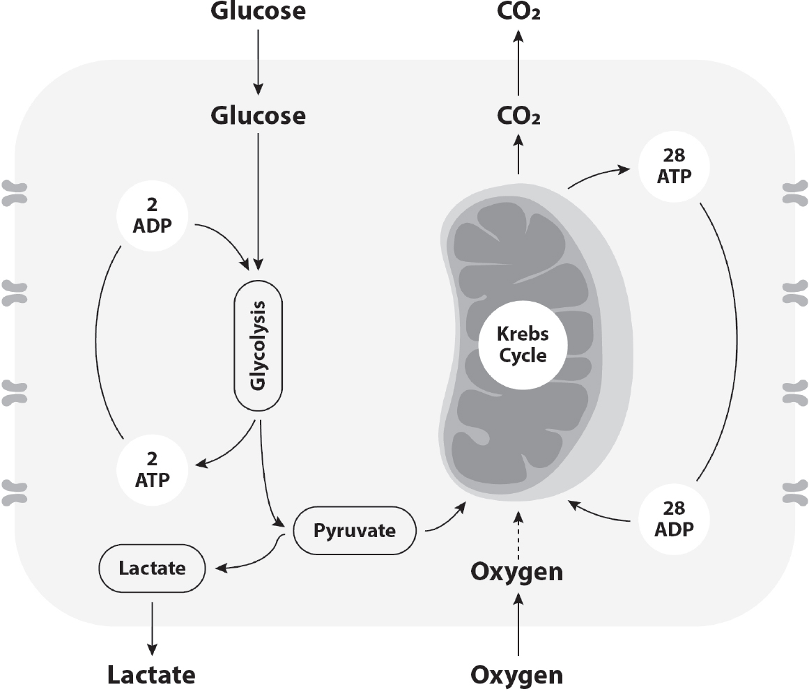
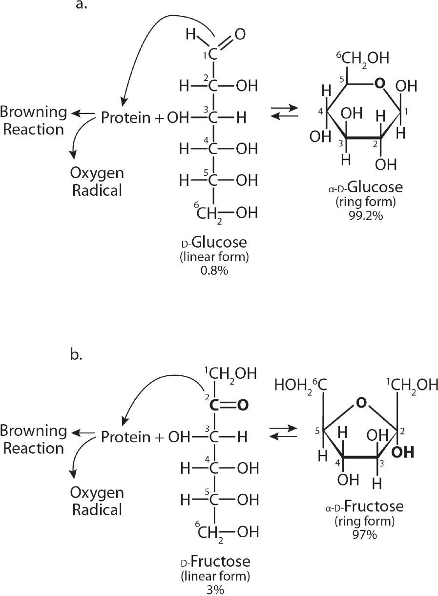
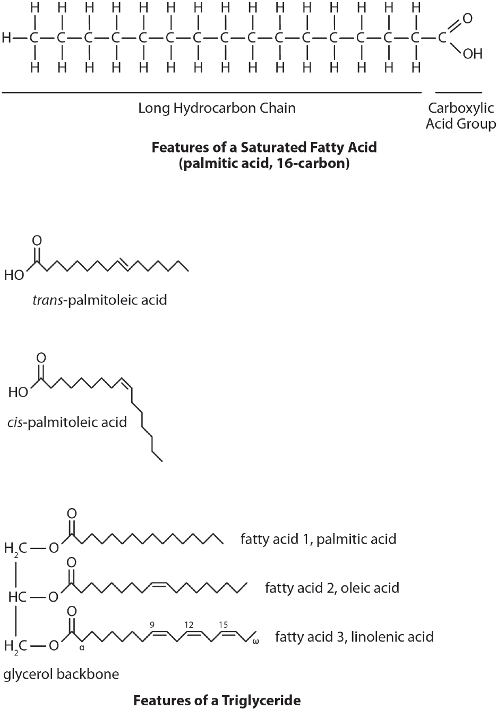

## Chapter 7

### The “Diseases” That Aren’t Diseases

Diseases tend to have difficult medical-technical names that no mere mortal can pronounce, so they’re often assigned more manageable monikers, based on the name of the doctor who first described it (e.g., Alzheimer’s disease), or its most famous patient (e.g., Lou Gehrig’s disease). Sometimes it’s even based on the country of origin (e.g., Jamaican vomiting sickness), on the tissue of interest (e.g., foot-and-mouth disease, polycystic ovarian syndrome), or on the symptoms expressed (e.g., fibromyalgia). However, sometimes naming the disease after the symptom can be quite cryptic. For instance, “diabetes” is a Greek word that means *siphon*, because you’re in the bathroom peeing your brains out, but it doesn’t say anything about glucose, insulin, or the subcellular dysfunction that causes it. Cardiovascular disease localizes the problem to the heart and blood vessels, but doesn’t really say what’s happening there or how it got that way. Hypertension tells the patient there’s high blood pressure, but unless they have such high blood pressure that they get a headache or stroke, they don’t feel it, don’t know what it means, don’t know what to do about it, or whether they should even care. Many of them will make contractions of disease processes to take the onus off—for instance, “I got the high blood,” “I got the low blood,” “I got the sugar.” They might be tempted to think that the process is just a part of normal aging, or that since their parent had it as well that it might be genetic.

In any case, the prevailing wisdom is that these diseases are inevitable. And doctors don’t do anything to alter that illusion. I can’t tell you how many patients I’ve seen who said, “Well my mother had diabetes, so I’m not surprised I got it.” These lay formulations couldn’t be further from the truth.

But do you know of any doctors who disabuse their patients of these mythologies? That’s because they don’t understand them either.

The US population, and indeed the populations of most developed and developing countries, is verifiably sick. While this metabolic dysfunction is exacerbated by body weight, it’s not even remotely dependent on it (remember “thin-sick” from Chapter 2). Yes, the adult American population is 67 percent overweight, but the data argues that 88 percent of the population exhibits some level of metabolic dysfunction. Is obesity the problem, or the symptom (see Chapter 2)? And what do the doctors tell the other 21 percent who aren’t obese but still metabolically ill? What disease do they have? After all, if doctors don’t know how to diagnose, treat, or prevent an unknown disease, why would they even bring it up?

Sadly, *you’re* going to have to bring it up. And that means being facile with the science. I offer Part II so that you have the option of understanding the science, to take ownership over it. Unavoidably, I’m going to have to introduce some new concepts and biochemistry that address food, cancer, and aging. If the science is daunting, then just skip to Chapter 9, which will provide you with the do-it-yourself approach to your own personal health and well-being.

Metabolic dysfunction is the “disease without a name.” The cells of the body, and often of the brain, are sick, due to eight—count ’em, eight— intracellular processes that have gone awry. These eight processes are not mutually exclusive—often if you have one going on, you likely have more than one. Also note that these eight processes, when working right, contribute to longevity; but when not working right underlie the various chronic diseases that result in mortality. They’re not considered diseases per se—as they don’t have an easy lab test or biomarker. They don’t have an ICD-11 code, so they aren’t reimbursable. They don’t have a drug target (see Chapter 10), so doctors don’t talk about any of them with their patients—because why would you want to bring up something you can’t solve? It recalls a saying I learned while I was a visiting professor in Paris, “If there is no solution, there is no problem.”

But scientists who work in the field of chronic disease do know about them. Each of these eight processes can work *for *you, in which case you’ll live to be one hundred playing tennis—or* against* you, in which case you’ll be disabled, depressed, on dialysis, or dead before your time. Further, they’re not mutually exclusive—each interacts with the others, and so they

tend to cluster together. They are the processes belying most, if not all, of the chronic diseases that are killing people and costing billions of dollars. And they are all exacerbated by processed food.

#### Cell Bio 101

To explain these eight subcellular pathologies, I first have to explain a cell and its contents. That means an ultra-short course in cell biology. For this exercise, I’ll limit the syllabus to energy metabolism only, which is the root of all eight subcellular pathways.

The cell is nature’s basic building block of life. Each of us is composed of ten trillion cells, most of them specialized and residing in different organs. In order to stay alive, a cell has to burn energy. Any cell can (and normally does) burn glucose, a simple sugar and the building block of starch. The liver and adipose (fat) tissue need the hormone insulin (released from the pancreas) to open the metabolic door within the *membrane*, the bag that holds the cell together, to let the glucose enter the cell; however, other organs don’t need insulin for glucose entry. But if glucose is in short supply and insulin levels are low, then adipose tissue will give up some of its stored fatty acids to enter the bloodstream, and the liver will turn those fatty acids into ketones, which then seep back into the bloodstream, so that any cell can burn those ketones instead, even without insulin.

Cells are magicians. They either make glucose disappear, or if there’s too much, then presto-change-o, they turn glucose into fat, which wreaks havoc on metabolism. But how and when is the key. Once inside the cell (**Fig. 7–1**), glucose undergoes breakdown through a series of metabolic steps called *glycolysis *to the intermediate pyruvic acid, releasing only a small amount of energy, which is captured within a molecule called adenosine triphosphate (ATP). From there, the pyruvic acid has one of two choices: 1) either enter the* mitochondria *(the energy-burning factories inside the cell), where the metabolic breakdown continues, a process called the* Krebs cycle*, to yield a lot more ATP (and making the waste product carbon dioxide, which you breathe out from the lungs); or 2) if the mitochondria are busy or dysfunctional, the pyruvic acid diverts to a process called *de novo* *lipogenesis *(new fat-making) to turn into a fatty acid called* palmitic acid*, which is then bound to a glycerol molecule and exported out of the liver cell as a triglyceride particle.

***Figure 7–1:**Energy metabolism 101. The cell imports glucose and converts it into pyruvic acid*

*(glycolysis, left side), yielding two ATPs. If the mitochondria are functioning, the pyruvic acid is*

*metabolized by the Krebs cycle (right side), yielding twenty-eight ATPs and carbon dioxide.*

These two pathways of energy metabolism, especially within the mitochondria, consistently release toxic by-products inside the cell called oxygen radicals (kind of like what hydrogen peroxide does on a wound). If not detoxified, these can damage the cell, and even cause it to die. Therefore, the cell has another structure called a *peroxisome*, which is where various antioxidants are stored to neutralize the oxygen radicals.

#### 1. Glycation

Why do we get cataracts and wrinkles as we get older? Each of these is an example of an undeniable and inevitable fact of life—the *Maillard *or* glycation *or* browning *or* caramelization* reaction. All four terms describe the same process, which is the primary process of aging. First described by Professor Louis Camille Maillard in 1912, this process occurs in all living cells. It doesn’t need any energy or enzymes or cofactors or other nutrients, it

just happens. It’s a by-product of living, yet it’s the primary reason for dying. We’re all browning, all the time, and the only way to stop it is by dying. The faster the Maillard reaction occurs, the faster you age—you get wrinkles, your arteries become sclerotic, and you eventually reach the pearly gates. But you can slow this process down—and if you’re successful, you’ll be a lot healthier for a lot longer.

The Maillard reaction only needs two molecules to occur: a carbohydrate (fructose or glucose), plus an amino acid (e.g., proteins). Put them together and the protein starts to “brown” and become less flexible. Ideally, these damaged proteins will be cleared away by cellular waste processing systems, but if the reaction occurs faster than the waste can be cleared, eventually the buildup of *advanced glycation end products*, or AGEs, will lead to cell, organ, and human dysfunction. The question is not *if *the Maillard reaction will occur, but rather* how fast*.

And this is where the metabolic differences between glucose and fructose becomes important (see Chapters 2 and 12). One might think that glucose and fructose, both being molecules found in dietary sugar (sucrose, high-fructose corn syrup, honey, maple syrup, agave—they’re all metabolically the same; take your pick), would drive this reaction at the same rate. You would be very wrong. Yes, they’re both carbohydrates, and yes, they both bind to proteins, but that’s where their similarities end. Because glucose has a sixmember-ring structure (see**Fig. 7–2**), it’s more stable and engages in the Maillard reaction relatively slowly. Conversely, fructose’s five-member ring is more easily broken apart, and engages in the Maillard reaction seven times faster than glucose. It also generates one hundred times the number of oxygen radicals (see *Oxidative Stress*). Furthermore, our research group has shown that a specific breakdown product of fructose, called *methylglyoxal*, drives the Maillard reaction 250 times faster than glucose.

All in all, when it comes to aging, fructose is worse than glucose, and therefore sugar is worse than starch. That doesn’t make glucose “good”—it raises insulin and drives obesity—but compared to fructose, it’s a walk in the park.

#### 2. Oxidative Stress

Oxygen (O^2^) is a peculiar molecule. Our brain is completely dependent on it; in fact, the brain dies in four minutes flat without oxygen, while the rest of your body can keep on living. However, many types of cells grow specifically when they’re deprived of oxygen; this is particularly true of cancer cells (see Chapter 8). Oxygen also has the unique capacity to create an inhospitable environment for foreign invaders (like bacteria), but also for our own cells.

***Figure 7–2:**Structures of a) glucose and b) fructose, in the linear form and the ring form. This figure*

*demonstrates that a sugar is not a sugar. Glucose is a six-membered ring and is more stable than the*

*five-membered ring of fructose, which breaks down more easily to the linear form. Only the linear form*

*can engage in the Maillard reaction. Therefore, fructose drives the Maillard reaction seven times faster*

*than glucose, causing seven times the damage.*

Inside our white blood cells, oxygen undergoes a reaction catalyzed by an enzyme called *superoxide dismutase *(SOD), which turns O^2^ (the stuff we breathe) into O^2^—, an* oxygen radical *or* reactive oxygen species*, similar to how water (H^2^0) can be turned into hydrogen peroxide (H^2^O^2^). When you put hydrogen peroxide on a wound, it bubbles and fizzes as the liberated oxygen radicals kill everything in sight. And that’s great if you’re cleaning a wound. But this process occurs in all of our cells all of the time. Oxygen radicals are a standard by-product of three normal reactions in the body: glycation; energy metabolism in our mitochondria; and iron metabolism (equivalent to rusting, which is constantly occurring in all of our cells). Furthermore, oxygen radicals are formed in response to anything that causes inflammation. Thus, each cell in our body ordinarily has to deal with an oxygen radical pool; if unleashed they would kill us pretty quickly.

Each of our cells possesses specialized subcellular organelles called *peroxisomes*, which is where antioxidants lie in wait to quench incoming oxygen radicals and render them inert (see Chapter 19). But if there are more oxygen radicals than antioxidants (termed *oxidative stress*), it causes cellular dysfunction, structural damage to lipids, proteins, or DNA, and in the extreme, cell death. When this happens in the liver and the pancreas, you get diabetes. It’s also why we need to consume Real Food that has color, because color is an indication that these plants contain the antioxidants we can’t make on our own.

#### 3. Mitochondrial Dysfunction

Imagine an old-style factory with a coal-burning furnace. The coal is transported on railroad cars, and there are able-bodied furnace stokers working in shifts to feed the furnace. As long as the rate of arrival of the coal and the offload by the stokers are matched, the factory runs at full capacity. Now imagine that many of the furnace stokers are old and infirm, or perhaps stricken ill at once. There just aren’t enough stokers for continual twentyfour-hour work. As a result, they’re not going to generate enough energy for the furnace to burn at full capacity, and the factory will not put out the best product. There’s also the scenario where the railroad cars filled with coal start arriving inside the factory walls faster than the furnace stokers can

unload it—the cars build up, taking over the factory floor, and eventually the factory will be overwhelmed, will choke off, and shut down.

Now imagine both of these issues happening at the same time. That’s *mitochondrial dysfunction*. Chronic disease *is *mitochondrial dysfunction, and mitochondrial dysfunction* is* chronic disease. They are one and the same.

Mitochondria are really bacteria that decided eons ago that they were happier living inside of animal-based cells than facing the cold, cruel world on their own. Bacteria were great at burning energy, while animal cells were great at fending off invaders—so they made a symbiotic decision to stick together. To this day, mitochondria have their own DNA and their own genetic program apart from the human DNA found in the nucleus of the cell. But like the shift workers, mitochondria tend to go defective with time and are prone to oxidative stress and damage. Mitochondria are finicky, lose capacity easily, and constantly need to be renewed and replenished. They need to divide, and the cell needs to clear the old ones out. The single best stimulus to make more and fresh mitochondria is exercise—but even your mitochondria can’t outrun a bad diet (see Chapter 10). Not surprisingly, the pharma industry has identified increasing mitochondria as a primary drug target for metabolic disease—yes, they believe you can market “exercise in a pill”—but *there is no magic pill*.

When glucose and oxygen availability, as well as mitochondrial capacity, are all matched, everything goes smoothly. Using the coal factory analogy, when the glucose comes in faster than the mitochondria (stokers) process it, the excess chokes off the factory. The mitochondria have no choice but to divert the excess pyruvic acid into fat, a process called *de novo lipogenesis *(new fat-making). When this happens in the liver, you get fatty liver, which leads to liver insulin resistance (see* Insulin Resistance*). If instead this happens in the pancreas, you get fatty pancreas and insulin deficiency. And fructose (in processed food) makes twice as much liver fat as does glucose.

The sicker your mitochondria, the earlier you die. The organs that need mitochondria and energy production the most are the brain and hormonesecreting organs—because neurotransmission and hormone secretion are energetically expensive. If the mitochondrial DNA is defective, you end up with a class of nasty diseases known as *mitochondrial* *encephalomyopathies*. I took care of one girl with a mitochondrial disease called Kearns-Sayre syndrome who came to my practice at age nine with seizures and droopy eyelids (keeping your eyes open is a high energy task!).

Over the next ten years, she slowly developed diabetes, a heart rhythm disturbance, inability to walk, and finally went comatose at age twenty. She died at twenty-three, and there was nothing we could do for her. Mitochondria can be defective because of genetics, or because of the pathologies discussed in this chapter. Either way, the results are disastrous.

#### 4. Insulin Resistance

As we’ve explored, most people think of insulin as the “anti-diabetes” hormone; it lowers the blood glucose, which prevents diabetic microvascular complications (eye, kidney, nerve disease) from occurring. This is only half of the story. Insulin’s main job is actually to store energy for a rainy day.

Just two organs in your body need insulin to function: the liver and adipose tissue. Too much insulin can get in the way, forcing glucose clearance from the bloodstream into tissues. It can also lead to hypoglycemia (low blood glucose) and inadequate glucose delivery to the brain, which can make you dizzy or unconscious or seize or die, depending on its severity. The pancreas senses the drop in the blood glucose, and stops releasing insulin before you lose consciousness.

But nowadays, more often than not, the opposite problem occurs; different types of cells are not responding to the insulin in the bloodstream. This is called *insulin resistance.* When glucose can’t get into certain cells, those cells starve, which leads to organ dysfunction. When the liver or muscles are resistant, glucose builds up in the blood, leading to diabetes. The fact of the matter is that insulin resistance isn’t due to low insulin levels, but rather high ones—because the cell isn’t responding to the insulin signal. Of course, genetics can play a role—but then again, genetics haven’t changed in fifty years, but the environment sure has.

Various problems that can lead to defective insulin signaling are: obesity; chronic stress; environmental chemicals that drive weight gain (obesogens like estrogen, bisphenol A [BPA], phthalates, PBDE flame retardants); and, our favorite, processed food (see Chapters 18, 19, and 20). High insulin levels cause cellular dysfunction, which ultimately leads to chronic disease, morbidity, and early death. Insulin resistance is the central problem in metabolic syndrome, and different people can have different reasons for insulin resistance—but processed food is by far the biggest player. Even

those who are overweight and those who are under stress don’t exhibit metabolic syndrome if their diet is unprocessed.

#### 5. Membrane Integrity

Every cell has an outer membrane to protect and contain its contents. When membranes get damaged, cells spill their contents and all hell breaks loose, usually leading to cell dysfunction and death. Then the mop-up crew follows behind and does even more damage during the cleanup (see *Inflammation*).

Membranes are composed of a lipid bilayer, like a sandwich; lipids on the inside facing the cellular contents, lipids on the outside of the cell facing the bloodstream, and proteins forming the filling of the sandwich. Membranes can be damaged through two mechanisms: the lipids themselves are damaged either from toxins or from oxidative stress (see *Oxidative* *Stress*); or the lipids are inflexible, like rubber tubing where cracks appear due to plastic that has gotten old and dried out. Membranes should be flexible and malleable like a balloon, called *membrane fluidity*—they should give somewhat when poked from one direction. When they don’t, they can burst.

There are seven different types of fats in your diet, and all can impact your cell membranes in different ways. But for this exercise, we only need to consider three of them, as shown in**Fig. 7–3**.

***Figure 7–3:**a-c) Structures of free fatty acids. a) palmitic acid (16-carbon saturated), b) *trans*-*

*palmitoleic acid (16-carbon *trans-*unsaturated), and c) *cis*-palmitoleic acid (16-carbon *cis*-unsaturated).*

*Note that the COOH carboxyl group (which is inflammatory) is free. d: Structure of a triglyceride,*

*which is composed of three different free fatty acids (at least one of which must be unsaturated), linked*

*to a glycerol backbone, so that the inflammatory COOH carboxyl groups are not free and available to*

*do damage.*

Problems with lipids can damage outer membranes in one of two ways. First, saturated fatty acids (which are different from saturated fats; see Chapter 12) are completely flexible because they don’t have any double bonds, which normally apply a degree of inflexibility to a fat’s structure. This means that saturated fatty acids can conform in any shape, which normally is good for membrane integrity. However, new research suggests that because they’re so fluid, they can sometimes layer on top of each other

and form a clump of lipid within a membrane, the subcellular version of cellulite, which reduces the cells’ overall fluidity.

Unsaturated fats are almost always better for you than saturated ones, which themselves are none too problematic in regard to metabolic syndrome. Because of their *cis*-double bonds, unsaturated fatty acids have fixed angles built into them, which prevents them from layering. But there are two problems with unsaturated fats. First, those *cis-*double bonds are exactly where toxins and oxidative stress like to do their damage, by oxidizing that double bond. And when they do, they release an oxygen radical (see *Oxidative Stress*). Second, when an unsaturated fat is heated beyond its smoking point, the *cis-*double bond can “flip”—and now you’ve got a *trans- *fat, which is deadly to the cell (see Chapter 20). Even though the FDA finally got around to banning* trans-*fats in commercial foods, you can still accidentally make them on your own (see Chapter 18).

#### 6. Inflammation

Foreign invaders (e.g., viruses and bacteria) can damage cells directly. Our body has developed an inflammatory response, which recruits various white blood cells to release toxins like oxygen radicals and cytokines (peptides with killing activity) to destroy the invaders. While we need an inflammatory response (or we would be eaten by the maggots), unfortunately there are four downsides.

*1) *The process kills normal tissues, too, which can lead to long-standing damage after the invader is cleared (e.g., kidney disease after* E. coli*, coronary aneurysms after Kawasaki disease, and now we are learning about long-term damage with COVID-19).

*2) *The inflammatory process can sometimes be triggered against a body tissue because a body tissue molecularly resembles a foreign invader, a phenomenon called* molecular mimicry*. This is why, for instance, some people develop rheumatic fever, kidney disease, and even psychiatric disease after a strep infection.

*3) *Bad bacteria can proliferate in the gut in response to an aberrant environment (either the food itself or the antibiotics in the food; see Chapter 20), which can cause pathogenic bacteria to predominate, such as* Streptococcus mutans* in the mouth and dental caries. The inflammatory reaction will cause breaks in the intestinal barrier, allowing toxins and

bacteria to pass across the intestinal wall into the bloodstream; they then head to the liver and cause insulin resistance, a process known as *leaky gut*. Leaky gut is one reason for the dramatic increase in food allergies and autoimmune disease in people (see Chapter 14).

*4)* Body fat (subcutaneous or visceral fat) can release palmitate, an inflammatory lipid, which in turn drives up the inflammatory response. Palmitate can also be formed in the liver in response to excessive sugar intake, resulting in liver inflammation, which makes chronic disease even worse. In fact, palmitate is the real bad actor in the story of metabolic syndrome (see Chapter 12).

There are connections between metabolism and inflammation in both directions. For instance, when fat cells get so large that they spill their grease, macrophages come into the fat depots to mop it up, and then release a set of cytokines that directly interfere with liver insulin signaling, driving chronic disease.

There are also connections between specific foods and inflammation. For instance, increased dietary fructose reaching the liver spurs on an enzyme called *c-Jun* N-terminal kinase-1 (JNK1 for short), which inactivates the insulin signaling pathway as well.

The key to the chronic disease kingdom is that there are not four separate problems (nutrition, metabolism, inflammation, immunity); there’s only one, and they are all related. Screw up one and you screw up the other three.

#### 7. Epigenetics

Lots of effort has been placed on looking for genetic reasons behind metabolic syndrome, but the studies say only 15 percent is genetic—the rest is environmental. But environment can change genes as well, through a phenomenon called epigenetics. *Epigenetics* refers to changes in the areas around our genes that can cause them to be turned on or off, usually inappropriately, altering responses to these pathologies, and which over time can result in the development of various diseases.

Think of it this way: epigenetics is the on-off switch attached to the dimmer on your living room chandelier. The gene is the lightbulb, the epigene is the light switch. If the lightbulb is defunct or the switch is frozen in the “off” position, the dimmer function is useless. Likewise, epigenes control the effect to which the gene turns on. Epigenetic modifications acting on various

tissues typically only influence the physiology of the exposed individual, changing the risk of disease development later in life. This might partly explain the developmental origins of health and disease.

In some cases, environmental factors alter the epigenetic programming of germ cells in the sperm or egg, and alterations in disease can appear in future generations without further direct exposure. This is known as *transgenerational epigenetic inheritance*. So far, it’s been shown to affect as many as four generations going into the future. So it’s not just what you ate; it’s what your mother ate. In fact, it’s what your great-great-grandmother ate. And as you can imagine, if each person has two offspring, these epigenetic changes can multiply across the population pretty fast. These changes might be a plausible partial explanation for the pandemic of obesity and related diseases that cannot be fully accounted for by genetic variations and lifestyle factors.

Altered nutrition also appears to be a primary driver of altered epigenetics. For instance, take the vitamin folic acid, a necessary and limiting cofactor for the nuclear enzymes called *DNA methyltransferases* (DNMTs), which adds a methyl group to DNA to alter whether genes are being activated. Folic acid is so important to normal fetal development in order to prevent the occurrence of spina bifida that the FDA has remanded the baked goods industry to add it to grocery store– bought bread. In addition, folic acid is necessary to catalyze the breakdown of a metabolite called homocysteine (Hcy; see Chapter 9), which has been linked to one form of early heart disease, although its role in general heart disease remains controversial. Some people carry a mutation in the gene that activates folic acid; these people have higher Hcy levels and greater risk for heart disease, but supplementing their diet with extra folate can reduce some of their risk.

Other nutrients such as vitamin B^12^ (cyanocobalamin), vitamin B^6^ (pyridoxine), vitamin B^2^ (riboflavin), methionine, choline, and betaine are also involved in epigenetics. And nutrients such as retinoic acid, resveratrol, curcumin, sulforaphane, and polyphenols can also modulate it (see Chapter 14 for more on supplements).

Last, epigenetics has also been shown to be at work in the long-lasting effects of some endocrine-disrupting chemicals (EDCs), which mimic hormonal actions and alter long-term metabolism. Examples include elements that come in contact with our processed food supply, such as BPA and

phthalates found in processed food cans and plastic bottles (see Chapter 20), both of which can lead to insulin resistance and obesity.

#### 8. Autophagy

For years, we’ve dumped garbage into landfills and then built on them. In the San Francisco Bay Area, we owe our airport and several lower income housing areas, such as Treasure Island and Foster City, to reclaiming land by adding garbage to it. But what happens when you run out of places to put the garbage? Or worse, what happens when there’s nobody to pick up the trash? And the garbage starts to settle and the whole Bay Area starts to stink, and to sink? As you might expect, it’s much better to clear the garbage than to build on it. And that goes for the human body as well.

Clearing biological waste products is a process known as *autophagy*, and it plays a key role in healthy aging, especially in the brain. The brain uses more energy than any other organ, and so there are lots of mitochondria, oxygen radicals, and therefore lots of damage in it. Omega-3 fatty acids (see Chapter 19), which we need for healthy brain functioning, are particularly susceptible to damage—which equals lots of cleanup.

And as you might imagine, there’s not a lot of extra room in the brain for this waste, so the brain has to be particularly adept and rapid at removing debris. That’s what sleep is for—our intracerebral pressure goes down during sleep, which opens small pores within the brain called *glymphatics*. An ebb tide fluid shifts slowly during sleep to remove damaged cellular components into the bloodstream for disposal. In other words, in the brain, every night is garbage night. And if you don’t get enough sleep, it’s like having your brain’s garbagemen on strike.

But this isn’t just good for the brain—all organs do better with autophagy, which is an essential process that maintains healthy cells by removing damaged proteins and malfunctioning organelles, especially mitochondria. Old mitochondria make a lot of oxygen radicals. Therefore, to improve metabolism and slow aging, it’s essential to get rid of the old mitochondria by autophagy. In fact, people who clear their mitochondria more efficiently live longer.

There’s also evidence to support that autophagy is under various nutritional controls. For instance, vitamin D deficiency is associated with cellular aging; and vitamin D appears to play an important role in promoting

autophagy, by increasing calcium influx into old cells, which induces a cellular program to purposefully kill it. Paradoxically, vitamin B^1^ deficiency accelerates neurodegeneration, while supplementation appears to promote autophagy and slow neurodegeneration, by reducing oxygen radical formation. The biggest effect of nutrition on autophagy has to do with the metabolic improvements that can be seen with the now-popular maneuver of intermittent fasting, which lowers insulin and raises ketones, both of which promote autophagy (we’ll get into more detail in Chapter 14).

#### The “Hateful Eight”? or the “Grateful Eight”?

As you can see, none of these eight processes evoke disease outright. In fact, when they are working right, they contribute to longevity and good health. But, screw up a few, and you have the makings of a very short and miserable life. More important, all eight processes are related to chronic disease, and also related to each other and to food. See a pattern here? These are the true diseases of processed food; they’re just not called diseases or taught in medical school. But they should be taught before any mention of any drug, so that medical students can triangulate, “How does this drug impact these eight processes?” Only in this way can we unlearn doctors to focus on what’s important and patients to understand the limits of disease therapy. Otherwise, both Big Food and Big Pharma win again and again and again.
