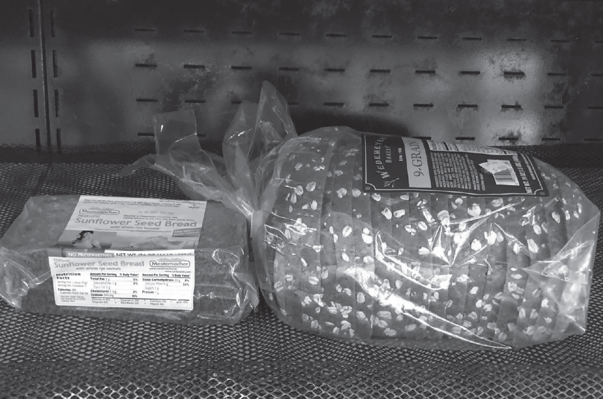

## Chapter 12

### Nutrition “Unwrapped”

Politics is often spread through myths, which themselves are easily turned into propaganda, thus perpetuating the politics—a vicious cycle. These three are replete within nutrition, perhaps more so than any other medical discipline, because there are so many stakeholders with their own beliefs and agendas. That’s why we need the science; it’s the only way to debunk the myths. Then and only then can the propaganda be shattered, clearing the way for a new political landscape. The healthcare professionals didn’t create the myths or the propaganda, but they’ve bought them hook, line, and sinker. Let’s start with the myths surrounding terminology. Here are just three examples:

*1.**The word “weight”**—when did it become a synonym for *health*? When we decided that health*

*was the new morality. Political correctness meant you couldn’t shame people for poverty or race*

*—but fat-shaming continues to this day, because “it’s your fault you’re a glutton and a sloth.” But*

*the data shows that it’s your liver and visceral fat that determines your health, not your weight or*

*total body fat. Liver fat tops out at about one pound, and visceral fat at about six pounds. You*

*can’t see that on the scale. Normal weight people have liver fat, too. It’s not the fat you can see,*

*it’s the fat you *can’t see* that matters.*

*2.**The word “fat”**—does it mean body fat or dietary fat? Or, as you will soon learn, fatty acid? Or,*

*“do these pants make my butt look fat?” (Pro-tip: never answer this question.) Two-thirds of the*

*US populace continue to believe and perpetuate the myth that “fat makes you fat.” While it’s true*

*that dietary fat *could* become body fat, it does so only in response to insulin. And so weight isn’t*

*driven by dietary fat, which doesn’t raise insulin, but rather by dietary refined carbohydrate and*

*sugar, which do.*

*3.**The word “sugar”***—* does it mean blood sugar (glucose) or dietary sugar (glucose-fructose)?*

*The food industry says “you need sugar to live”—but while you do need a blood glucose level to*

*live, you don’t have to consume that glucose. In fact, your liver can make glucose from the*

*glycerol (see**Fig. 7–3d**) released from the breakdown of triglycerides in either dietary fat or*

*body fat, or from amino acids, a process called *gluconeogenesis*. Conversely, you don’t need*

*fructose (the molecule that makes food sweet) to live at all. In fact, there’s no biochemical*

*reaction in any animal cell on the planet that requires dietary fructose. Which means you may*

**want *dietary sugar, but you don’t actually* need* it.*

Nutrition myths die hard, kind of like Voldemort and vampires; they seem indestructible, especially when the Dark Forces of Industry (see Chapter 23) spend a lot of money to maintain and propagate them. What follows are my best efforts to drive a stake through the heart of each of these nutritional myths, so that you can “unlearn” what you’ve been taught.

#### A Calorie Is Not a Calorie

This myth is all that is left of the legacy of Wilbur Atwater. It argues that all calories possess the same heat generation, equivalent to 4,184 joules of energy. From a physics standpoint, a calorie *is* a calorie. But so what? This has nothing to do with what happens to those calories in the human body, because weight gain is only about how those calories are stored.

The efficiency of capturing all those calories and transforming them into chemical energy in the human body is highly uneven. Understanding these various phenomena shows that in fact “a calorie is *not* a calorie,” and there’s an actual difference between eating a handful of almonds and a donut, even if their calorie count is the same.

The “calorie is a calorie” myth can be disproven through five examples:

*1.**Fiber.**You eat 160 calories in almonds, but you only absorb 130. The other 30 are prevented*

*from early absorption because the fiber in them prevents early absorption in the duodenum (early*

*intestine), so the bacteria in the jejunum and ileum (middle and late intestine) will chew the 30 up*

*for their own purposes. You ate them, so they’re considered “calories in,” but you didn’t get them*

*(your bacteria did).*

*2.**Protein.**If an amino acid is to be prepared for energy metabolism, the amino group must be*

*removed by the liver to convert it into an organic acid (e.g., aspartate to oxaloacetate). It costs*

*two ATPs to do this, as opposed to preparing carbohydrate, which costs one ATP. This is known*

*as the *thermic effect of food *(TEF).* Fats generate about *2 to 3 percent of TEF,* carbohydrate**

**about *6 to 8 percent, and* protein about* 25 to 30 percent—meaning it takes more energy to burn*

*a protein than a carbohydrate. If a calorie isn’t recouped because it’s burned, it can’t be stored.*

*3.**Fat.**All dietary fats would liberate 9 calories per gram if you burned them. But omega-3 fatty*

*acids aren’t burned—they’re hoarded, as they’re needed for cell membranes and neurons in the*

*brain (see Chapters 7 and 19). Furthermore, *trans-*fats can’t be burned, as humans don’t have*

*the enzyme to cleave the trans-double bond. They instead will clog your arteries and kill you,*

*unrelated to their calories. All in all, neither are burned, but one will save your life and the other*

*will kill you.*

*4.**Sugar.**Added sugar is made up of equal amounts of glucose and fructose. Both provide the*

*same number of calories, but are metabolized differently in the liver and perform different jobs in*

*the brain. Glucose can be metabolized by all of your body’s tissues and only 20 percent of a*

*glucose load goes to your liver, and even then insulin tells the liver to turn it into glycogen (liver*

*starch). On the other hand, fructose can only be metabolized by the liver, so the whole load goes*

*to your liver, insulin doesn’t have an effect, the mitochondria are overwhelmed, and the rest is*

*turned into liver fat, driving insulin resistance (see**Fig. 2–1**). And on the third hand, fructose*

*drives glycation seven times faster than glucose (see Chapter 7), doesn’t shut off the hunger*

*hormone ghrelin, and is addictive (see Chapter 21).*

*5.**Different fat depots.**It’s not just *if *the calorie is stored, it’s* where* it’s stored. There are three*

*fat depots, but they confer different risks for development of metabolic disease: 1) subcutaneous*

*(butt) fat: you need about 22 pounds to worsen your health; 2) visceral (belly) fat: you need about*

*5 pounds to worsen your health; and 3) liver fat: you only need about 0.3 pounds to worsen your*

*health. And almost all calories from added sugar are going to liver fat. If a calorie stored were a*

*calorie stored, it wouldn’t matter which fat depot was doing the storage—but it does. Protecting*

*the liver is the prime directive.*

#### But It’s Zero Calories . . . ?

Sugar sweetened beverages (SSBs) are causative for at least three diseases of metabolic syndrome—type 2 diabetes, heart disease, and fatty liver disease—plus tooth decay. So, what about noncaloric diet sweeteners, for those with a “sweet tooth”? Stevia, sucralose, aspartame, acesulfame-K, allulose, xylitol, erythritol, and others would seem the obvious choices—no calories, so no heart disease, right? No fructose, so no liver fat or diabetes, right? Not so fast. Though the US has slowly turned to diet drinks because of the obesity epidemic—as of 2010, 42 percent of Coca-Cola sales in the US were of the no-sugar variety—33 percent of all sugar consumption is in drinks, and 42 percent of drinks are now no-sugar, so someone somewhere should be losing weight, right?

Unfortunately, diet sweetener consumption is also correlated with metabolic syndrome. Studies of switching out sugar for diet sweeteners don’t show beneficial effects on weight loss. Rather, the data show that sugar is a

direct cause of metabolic syndrome—though thus far we only have correlation with diet sweeteners. So, do diet sweeteners cause metabolic syndrome, or do people with metabolic syndrome consume more diet drinks? The question really is if the substitution of diet sweeteners for sugar actually reduces caloric intake, body fat, and metabolic disease. Here are five reasons to be concerned:

*1. There’s a difference between pharmacokinetics (what your body does to a drug) and*

*pharmacodynamics (what a drug does to your body)*.* We have pharmacokinetic data on diet*

*sweeteners to determine acute safety, which is part of the FDA’s charter (see Chapter 24), but*

*none of the pharmacodynamics. This has to do with chronic effects, which is not in the FDA’s*

*charter. The fact of the matter is, we don’t know what any of these diet sweeteners do to your*

*long-term food intake, weight, body fat, or metabolic status. The food industry doesn’t do these*

*studies because such studies are expensive and could have detrimental effects on sales. The*

*NIH won’t do them, saying it’s the food industry’s job. So the studies aren’t done.*

*2. You drink a soda. The tongue sends a signal to the hypothalamus that says, “Hey, sugar is*

*coming, get ready to metabolize it.” The hypothalamus then sends a signal along the vagus nerve*

*to the pancreas, saying, “A sugar load is coming, get ready to release the insulin.” If the “sweet”*

*signal is from a diet sweetener, the sugar never comes. What happens next? Does the pancreas*

*say, “Oh, well . . . I’ll just chill until the next meal,” or does it say, “WTF? I’m all primed for the*

*extra sugar. Let’s eat more to get it.”*

*In one study, four groups of Danish men ate their normal diet for six months plus a liter of*

*sugared soda per day, a liter of diet soda per day, a liter of milk per day, or a liter of water per*

*day. No surprise, the sugared soda group gained 22 pounds. The diet soda group gained 3.5*

*pounds. The milk group stayed the same. The water group lost 4.5 pounds. Now, 3.5 is better*

*than 22 pounds, but they still gained weight even without the calories. And the milk has as many*

*calories as the sugared soda, so why didn’t that group gain weight? It all has to do with insulin—*

*meaning the diet sweetener still caused insulin release, while the lactose and fat in the milk didn’t.*

*Plus the fat was satiating, so people ate less.*

*A second study took diet soda drinkers and switched them to water. They lost another 6*

*pounds. If there are no calories in either case, why did their weight change? Insulin again. Insulin*

*response to oral glucose tolerance testing was performed in seventeen morbidly obese adults*

*without diabetes, both with and without a diet sweetener pretreatment. After the diet soda, the*

*insulin response was 20 percent higher than with the seltzer control. The sweet taste alone can*

*both stimulate appetite and insulin release, which drives energy storage.*

*3. Diet sweeteners might change the composition of intestinal bacteria, which could cause leaky gut,*

*generate inflammation, increase deposition of visceral fat, and drive metabolic syndrome,*

*unrelated to calories (see Chapter 7). The intestinal microbiome plays a role not only in what the*

*tongue tastes, but also what the brain senses.*

*4. Early studies suggest that certain diet sweeteners act directly on fat cells grown in a petri dish to*

*promote energy transport inside the cell. In other words, diet sweeteners may have insulin-like*

*properties of their own, but this has yet to be confirmed.*

*5. We don’t know the role that diet sweeteners may play in sugar addiction (see Chapter 21), as this*

*field is in its infancy. However, there are animal studies that suggest brain pathways react*

*similarly to sucrose and diet sweeteners.*

Recent studies argue that artificially sweetened beverages are associated with diabetes, cardiovascular issues, and dementia. Thus far, all of these studies have been correlative—we don’t yet have causation. Nonetheless, quantitatively, the data suggests that the toxicity of two diet sodas is equivalent to one sugared soda, and that they’re way worse than water in terms of obesity and diabetes development. As an example, take the case of aspartame (NutraSweet), which in animal models affects three of our eight subcellular pathologies: oxidative stress, membrane integrity, and inflammation (see Chapter 7). These health concerns are just swept under the rug—a University of Sussex report looked at the original approval of aspartame by the European Food Safety Authority (EFSA). They documented that the EFSA discounted fully 100 percent of the seventy-three studies that showed aspartame caused harm, while accepting 84 percent of the studies that showed no harm.

While none of this research closes the book on diet sweeteners in either direction, it should certainly give us pause. In the last fifteen years, American sugar consumption has dropped from 120 to 94 pounds per year, yet obesity and metabolic syndrome persist unabated. Could diet sweeteners be playing a role? The only surefire way to find out is for Americans to de-sweeten their food across the board—drinks, too. And don’t start thinking juice is the answer (see Chapter 19).

Instead of worrying about calories, we should instead focus on the interaction between genetics and sugar consumption, as this determines insulin levels and where that fat will develop and deposit. Understanding the role of different foods in generating different insulin responses is paramount, and that includes diet sweeteners.

#### A Fiber Is Not a Fiber

As mentioned earlier, there are two types of fiber—soluble and insoluble— and you need both. The reason you hear doctors espousing a plant-based diet isn’t because of the plant origin *per se*; it’s because plants come with both types of fiber. Together, the two kinds of fiber form a gel on the inside of the

duodenum, reducing intestinal absorption by 25 to 30 percent, thus *protecting* *the liver*. Reciprocally, a sizeable portion of what you eat stays in the intestine, where the bacteria can feast on it and grow, thus *feeding the gut*.

As discussed in Chapter 11, the fiber in food is perhaps the most important nutrient for health, because it singlehandedly**protects the liver***and***feeds the gut**in six different ways:

*1. Both kinds of fiber together form a gel on the inside of the duodenum to reduce the rate of*

*absorption of monosaccharides and disaccharides, as well as slow the breakdown of starches.*

*Reduced absorption means reduced transport to the liver, thus preventing the liver from turning*

*excess energy into fat—in turn preventing liver insulin resistance.*

*2. The reduction in the rate of absorption also reduces the glycemic excursion in the blood, keeping*

*the insulin response down, and reducing energy deposition into fat tissue.*

*3. There are two flavors of bacteria that live in your gut: the *white hat *and the* black hat* bacteria*

*—and it’s a daily struggle to see which will prevail. The white hat bacteria (e.g., *Bacteroides*)*

*need more energy to survive and grow in order to battle the black hat bacteria (e.g., *Firmicutes*).*

*Thankfully, the good bacteria can proliferate and maintain a balanced intestinal ecosystem, but*

*need a greater and more robust supply chain to ward off the bad guys. What’s that supply chain*

*made of? Fiber—both types.*

*4. The fiber transits the food through the intestine faster, generating the satiety signal (the gut*

*hormone peptide YY3–36, which is released into the bloodstream and goes to the brain) sooner,*

*thus reducing second portions.*

*5. Soluble fiber is metabolized by gut bacteria into short-chain fatty acids like butyrate. They*

*uniquely feed the microbiome of the colon (large intestine) and are absorbed into the bloodstream*

*where they are anti-inflammatory as well as suppress insulin secretion from the pancreas.*

*6. Insoluble fiber acts as a mild abrasive in the lumen of the colon, which dislodges and sluffs old*

*dead cells, thus reducing cancer risk.*

Be forewarned: the processed food industry will tout the benefits of “added fiber” to various products. But you can’t put the toothpaste back in the tube. Yes, they can add back some soluble fiber (e.g., the psyllium in Fiber One bars), but they can never recapitulate the insoluble fiber lost during processing.

The same goes for *whole grain*. We’ve been taught that brown bread is better for you because it has more fiber. The Whole Grains Council says, “Whole grains or foods made from them contain all the essential parts and

naturally-occurring nutrients of the entire grain seed in their original proportions. If the grain has been processed (e.g., cracked, crushed, rolled, extruded, and/or cooked), the food product should deliver the same rich balance of nutrients that are found in the original grain seed.” In other words, if it starts as whole grain, it remains whole grain. It’s not *what’s in the food*, it’s *what’s been done to the food.*

**Fig. 12–1**is a good example of the problem. The one-pound loaf of bread on the right is big and fluffy. If you threw it at someone’s head, it would bounce off. The slices are thick. The bread on the left is small and dense. If you threw it at someone’s head, it would knock them unconscious. The slices are thin, and they crumble easily. Which one makes a better sandwich? Which is healthier? The bread on the right has milled grain, and the starch and gluten are dissociated from the bran. It generates a rapid and high glucose and insulin response, but makes great avocado toast. The bread on the left still has its starch and gluten within the kernel, and crumbles easily, and it’s an “acquired taste.” Both have soluble fiber, but only the one on the left has structurally and functionally maintained its insoluble fiber.

***Figure 12–1:**Two kinds of whole grain bread. Each weighs one pound. The one on the left is and*

*remains whole grain, while the one on the right started as whole grain but was then milled and*

*processed.*

#### A Carb Is Not a Carb

For decades, the American Heart Association, American Diabetes Association, and American Medical Association advocated a low-fat diet. By definition that means a high-carbohydrate diet. Is that a good trade? Just like “a calorie is not a calorie” and “a fiber is not a fiber,” “a carb is not a carb.” There are three inherent myths about carbohydrates that play a role as to whether they’re causative of, or preventative against, NCDs:

*1.**Sugar vs. starch.**Sugars are monosaccharides and disaccharides (one or two molecules), while*

*starch is a complex polymer (many molecules). Sugars either have one bond or no bonds to*

*break, so they’re digested and absorbed quickly in the duodenum, especially when they’ve been*

*liberated from a food matrix, as they often are (e.g., soda, fruit juice, alcohol). Starch has more*

*bonds to break, and is digested and absorbed slower. All of this adds up to a more rapid and*

*higher insulin response with sugar, which drives weight gain.*

*2.**Type of starch (the two “Amys”):**But “a starch is not a starch.” There are two kinds of*

*starch: amylose (brown foods including beans, lentils, and legumes; carbs that are digested and*

*absorbed slowly) and amylopectin (white foods including wheat, pasta, rice, and potatoes; carbs*

*that are digested and absorbed rapidly). Amylose is better for you, as it’s a string of glucoses*

*with two ends; therefore, only two enzymes at a time can chew it up, resulting in slow digestion*

*and absorption. Amylopectin is more like a tree of glucoses, with lots of branch points. Many*

*more enzymes can chew it up at once, releasing glucose more rapidly, which is more likely to be*

*absorbed early, flood the liver, and generate a bigger insulin response.*

*3.**Carbs are rarely ingested in isolation.**A slice of white bread is straight glucose. But Real*

*Food is glucose plus protein plus fat plus fiber. Those other macronutrients, or lack thereof,*

*influence the glucose’s absorption in the intestine, the insulin response that follows, and risk for*

*weight gain.*

#### Carbs and Glycemic Index (GI)

Higher glucose spikes during eating are associated with more insulin, more inflammation, and higher mortality. Therefore, a primary goal of improving metabolic health is to get the insulin down. One way is to eat foods that don’t make your blood glucose rise too fast. This is where amylose—the “good Amy”—comes in. Thus was born the concept of the glycemic index (GI). Tables of specific foods and their inherent GI are readily available. Some claim that a low-GI diet will keep blood glucose down and help you lose

weight. But does it work to keep insulin down? Is it the glucose spikes or the insulin spikes that do the damage?

Unfortunately, GI isn’t the panacea that the zealots hype. GI is defined as: how high does your serum glucose rise in response to 50 grams of carbohydrate in a given food, as compared with the glucose response in 50 grams of straight starch (e.g., white bread). However, there are four things conceptually wrong with GI:

*1.**GI is an indirect proxy for insulin.**While rapid glucose spikes after refined starch lead to*

*glycation and oxidative stress, it’s the insulin fluctuation that induces the other six subcellular*

*pathologies (see Chapter 7), drives excess energy intake, and promotes obesity.*

*2.**GI assumes everyone responds to the same food in the same way.**GI is computed based*

*on responses of healthy people to certain foods, even though 88 percent of people have some*

*form of metabolic dysfunction. Now that people are using continuous glucose monitors (CGMs;*

*see Chapter 14), it’s very clear that people respond differently to the same food.*

*3.**The important parameter is glycemic load (GL).**GL is different from GI—how much food*

*do you have to eat to get the 50 grams of carbohydrate? GL takes into account the beneficial*

*effect of fiber. A good example is carrots, which are high-GI (lots of carbohydrate) but low-GL*

*(even more fiber). More fiber means a larger portion, because there’s less digestible*

*carbohydrate. You can turn any high-GI food into a low-GL food by eating it with its original*

*fiber. Real Food is by definition low-GL.*

*4.**Fructose!**Fructose is the most egregious cause of liver insulin resistance and metabolic*

*syndrome because of how the liver uniquely metabolizes it**.**Fructose isn’t glucose—when eaten,*

*it doesn’t raise the blood glucose level (it’s not measured in the glucose assay). In fact, by*

*definition, it’s low-GI, because it has no glucose. Still, this hasn’t stopped the food industry from*

*trying to capitalize on the low-GI craze by adding fructose to foods. In fact, the Glycemic Index*

*Foundation of Australia has the nerve to label sugar as low-GI, as if somehow that was a good*

*thing. Keep insulin low by eating lots of fiber and by avoiding added sugar. Real Food is by*

*definition a low-GL diet.*

#### A Fat Is Not a Fat

The epic battle between British physiologist John Yudkin and Minnesota epidemiologist Ancel Keys for control of the American Diet, detailed in my book *Fat Chance *(2012) and Nina Teicholz’s* The Big Fat Surprise *(2017), is now sixty years old. Yudkin wrote* Pure, White and Deadly *(1972) targeting dietary sugar; Keys wrote* The Seven Countries Study* (1980) targeting dietary saturated fat. Both scientists had correlation but not

causation; both had static data (single points in time) rather than longitudinal data (patterns over time). Both used ecologic (population) data, which is much flimsier than individual data. In other words, both had weak cases.

However, Keys had a few more things going for him than Yudkin: hubris, bombast, cherry picking, and willful denial. Keys was also the beneficiary of three scientific discoveries of the 1970s that sealed Yudkin’s fate: people with familial hypercholesterolemia (FH; see Chapter 2) have high LDL and heart disease; dietary fat raises LDL levels; and LDL levels correlate with heart disease in populations. Never mind that smoking and *trans-*fats are bigger contributors, or that those countries eating the most fat had the lowest levels of heart disease. The die was cast, and the 1977 Dietary Guidelines assured that the world would go low-fat.

There are one restriction study and two substitution studies that assessed the effects of the removal of saturated fat from diet—and the latter two had to be reanalyzed to get to the truth. The restriction study was done by the Women’s Health Initiative (WHI), which studied 161,000 women between 1993 and 1998 who reduced their consumption of saturated fat from 30 percent to 10 percent of calories. The verdict: no effect on either weight loss or heart disease. In the Sydney Diet Heart Study, which ran between 1966 and 1973, 458 men who had experienced a heart attack had the saturated fat removed from their diet and replaced with linoleic acid (from soybean oil), which is pro-inflammatory. All subjects experienced a decline in their LDL levels, yet their risk for heart attack increased by 62 percent, as well as their risk of dying by 70 percent. Perhaps the most egregious study was the Minnesota Coronary Study, which followed nine thousand patients over five years (1968 to 1973) at state mental hospitals and nursing homes, where meals were controlled by removing saturated fat and substituting linoleic acid (from corn oil). The study experienced the same results as Sydney— LDL went down, but heart attacks and deaths went up. The authors never published their findings, because they couldn’t explain them. Instead, the data lay in wait in the basement of the lead author, only to be discovered forty years later by his Mayo Clinic cardiologist son. In 2016, he published the findings. He was astonished, but he shouldn’t have been. Low-fat doesn’t work, and substituting with other fats doesn’t work either. It’s not about the LDL; it never was (see Chapter 2).

Furthermore, the saturated fat story doesn’t take into account that all saturated fats are not the same. For example, the saturated fats in red meat are

*even-chain *fatty acids (16 or 18 carbons), meaning they’re cardiovascularly neutral. The saturated fats found in dairy are* odd-chain* fatty acids (15 or 17 carbons), which are metabolized differently in the liver, and are associated with protection from chronic diseases like diabetes and heart disease. Therefore, the fat in dairy is likely protective—except we skim off that fat from cow’s milk and turn it into processed cheese. Good for the dairy producers, as they get two products out of one, but not so good for you, as an ingredient that could be protective against chronic disease has been removed “for your own good.” Even worse, sometimes we flavor the milk with chocolate or strawberry syrup for good measure (see Chapter 14).

#### The Difference between Saturated Fat and Saturated Free

#### Fatty Acids

Despite all these data, and the fact that the FDA removed saturated fat from the Nutrition Facts label, people still think it’s the bogeyman. Let’s get the facts straight: there’s a difference between innocuous *saturated fat *and pernicious* saturated free fatty acids*. Saturated fat itself isn’t inflammatory, because it’s packaged into triglycerides (see**Fig. 7–3d**). Rather, the unpackaged moiety called *free fatty acids *or* non-esterified saturated fatty* *acids* (see**Fig. 7–3a**and**c**), in particular free palmitate (see**Fig. 7–3a**), is the inflammatory component**,**both in the body and in the brain. In particular, free palmitate seems to be the driver of liver and hypothalamic inflammation. However, you don’t eat free fatty acids. They’re produced and exist in only two places in the body. When stored triglyceride is released from the adipocyte (fat cell), the glycerol backbone must be cleaved off, liberating its three free fatty acids. It also happens when the liver turns excess sugar into triglyceride through the process of *de novo *lipogenesis (DNL), as it first must produce a free fatty acid. Both of these processes are related to each other through fructose, as fructose causes both insulin resistance* and* DNL. So is the saturated fat from food the problem? Or are the free fatty acids the metabolic by-product of dietary sugar?

#### A Protein Is Not a Protein

Companies are touting protein as a cure-all and for weight loss/muscle gain. They’re selling protein shakes, protein cookies, protein snack bars, even protein coffee. It’s true that protein is neither carbohydrate nor sugar nor fat, and you need it to maintain normal growth. However, your kidneys have a limited capacity to excrete the metabolic by-products of protein metabolism, and overexcretion can cause kidney damage. Therefore, protein *quality *is as important as protein* quantity.* For example, eggs and beans both contain protein, but are very different in quality. Dietary protein is made up of twenty separate amino acids strung together in different combinations and amounts. One of those amino acids, tryptophan, is rarer and therefore more important than others, because it’s the precursor of serotonin, an important brain neurotransmitter (see Chapter 19). Eggs, poultry, and fish are the best sources of this amino acid, while beans have very little. On the other hand, additional protein is needed if you’re building muscle, especially branched-chain amino acids (BCAAs; leucine, isoleucine, valine), which are 20 percent of muscle (see Chapter 18). BCAAs are in high concentration in corn products, and are what’s in those tubs of protein powder at the health food store. If you’re a bodybuilder, you need them; if you’re not a gym rat and consume excess BCAAs, your liver will take the amino groups off and turn them into organic acids, which will either be diverted into liver fat (through DNL) or into excess glucose, either of which can generate hyperinsulinemia and drive chronic disease. The goal is to get more tryptophan and less BCAAs in the protein you consume.

#### What about Meat?

Meat is relatively high in tryptophan, vitamins, and minerals, but it brings along several other less desirable items as well. With beef, health problems include: iron (oxygen radicals); BCAAs in corn-fed beef (DNL, liver fat, and insulin resistance); and choline, a by-product of which sticks to arteries, causes vascular disease, and leads to insulin resistance. However, red meat has a hazard risk (HR) ratio for diabetes of 1.24; in other words, high meateaters have a 24 percent increased risk over that of the general population. So if the general prevalence of diabetes is 9.4 percent, meat-eaters have a prevalence of 11.6 percent. While a 2.2 percent increase is not negligible, public health officials don’t worry about HR ratios unless they’re above 1.3. Further, when the iron and heme levels were adjusted, the HR ratio was

reduced down to 1.13 (resulting in a diabetes prevalence of 10.6 percent, suggesting that other stuff in the meat isn’t a big driver of diabetes). In another study, unprocessed meat had a HR ratio for diabetes of 1.12 per 100 grams, while processed meat (bacon, sausage, salami) had a HR ratio of 1.51 per 50 grams. Thus, the difference in prevalence goes from 10.5 percent to 28.4 percent. Now, that’s notable. It’s the processing that renders the meat dangerous.

Also, nitrates in processed meat are a known risk factor for colon cancer. Thus, it appears that processed meat is more problematic, presumably due to the additives and the iron, rather than due to the saturated fat. Some, although not all, of these concerns can be assuaged by purchasing grass-fed and nitrate-free meat instead.

#### Mythology Begets Propaganda; Science Begets Public

#### Health

Old myths die hard; saturated fat still casts a long shadow. For instance, in 2016 the USDA took total and saturated fat off the Nutrition Facts label, yet the Dietary Guidelines still advise us to eat only certain amounts of saturated fat.

On the other hand, sugar doesn’t cast enough of a shadow. How can the USDA say to people, eat less sugar, but then allow it in 62 percent of all foods in the grocery store and not require the manufacturers to label it as such? Science works as a change agent for public health only if the opponent is operating off the same science. The issue here is the food industry generates its own science—call it pseudoscience—and uses it to propagandize those myths that best benefit their politics.

And if we’ve learned one thing about propaganda in 2020, it’s that if you say something long enough and loud enough, people will start to believe it.
