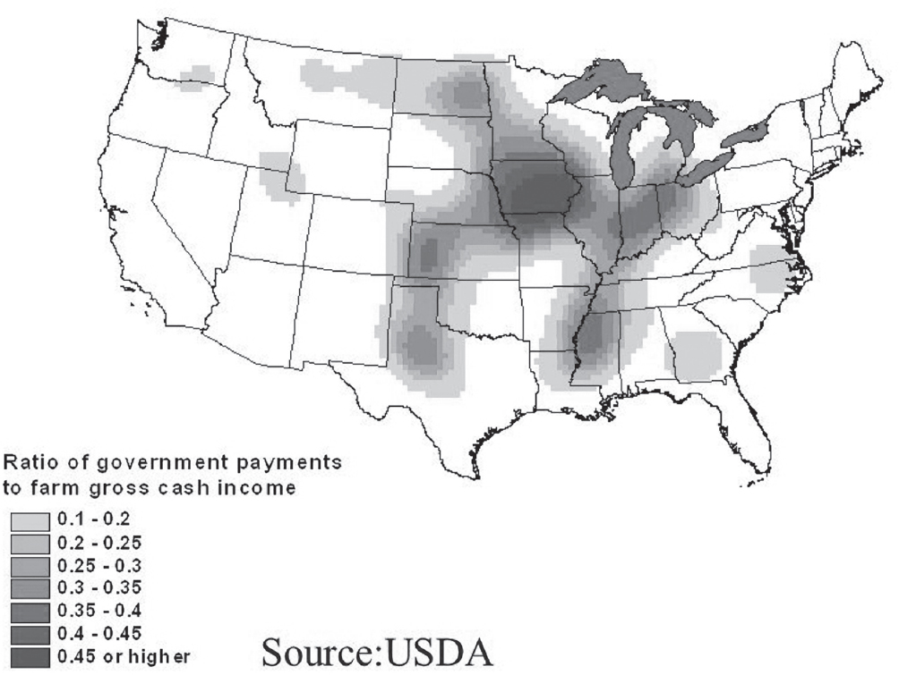

## Chapter 26

### Real Food Is Good for the Wallet

Countries are in the throes of economic crisis for many reasons, not least of which is rising healthcare costs. Governments are trying to figure out how to stem the tide in the cheapest way possible. But no one wants to revamp the food supply because they’d then have to retool the system and the model. They want a quick fix to a systemic problem.

#### Show Me the Money

In August 2015, I traveled with a team of academics from UCSF and UC Berkeley to Mexico City, where we engaged in a discussion with the Enrique Peña Nieto government to study the health and economic aftermath of their recently enacted 1-peso-per-liter soda tax. We were ushered into a conference room at the President’s Palace, where we met behind closed doors with twenty ministers representing Social Security, Labor, Health, Education, the Instituto Nacional de Salud Pública (Public Health Institute), and last but not least, Hacienda—their Treasury minister. The first thing the deputy minister of the Treasury said to us was, “We don’t care about how many lives the soda tax saves. It’s about the money. Show us how much money we save.”

Indeed, governments often don’t care about lives—until Election Day, of course. Then they’ll say anything to get your vote. The quantitation of lives saved and diseases saved is already clear and unassailable. But lives are not factored into those costs, even though they should be, because productive, healthy individuals pay taxes, while sick, infirm individuals extract money

from government health programs like Medicaid and Social Security. Such savings are only evinced long-term, after the administration in question is out of office and will get no credit. It’s all about the short-term balance sheet and immediate political capital.

I heard the deputy minister loud and clear—it’s only about the money. So let’s look at the US numbers. The entire food industry (grocery and restaurant) grosses $1.46 trillion per year with a profit of $657 billion, to yield a gross profit margin of 45 percent. Yet US medical costs total $3.5 trillion per year, of which 75 percent are food-related chronic disease. Of that $2.67 trillion, 75 percent or $1.9 trillion is conceivably preventable if we could roll back rates of disease to 1970 levels, before metabolic syndrome took hold.

Conversely, the pharma industry generates $771 billion in gross revenue annually, of which 21 percent is gross profit. One company made $19 billion in annual profit from diabetes drugs alone. Big Food is even bigger and badder—and with an even larger clientele.

You do the math: between food and pharma, you’ve got $2.1 trillion per year going down a rathole—into shareholder pockets—while the public gets sicker and healthcare is collapsing. We lose triple what the food industry makes cleaning up their mess. This is unsustainable. We could slash disease rates and medical costs and even budget deficits just by reducing the consumption of processed food. And don’t even think of listening to pharma’s promises—there’s no drug for this, because those eight subcellular pathologies are not druggable.

How about the nutraceutical market? That’s a $210 billion business. Some people have to take dietary supplements—they’ve got a bona fide eating disorder, a gastrointestinal malabsorption problem, or they’re taking medications that either inactivate or waste those micronutrients. I’m not going to diss the entire nutraceutical market, as it serves a valid purpose, because many of us need micronutrients that aren’t in abundance in the Western diet to help prevent those eight subcellular pathologies. But if you don’t have one of these preexisting conditions or an eating disorder, then the only reason you need a dietary supplement is that you’re not getting the micronutrients you need from your food. This only happens if you’re eating processed food, in which the vitamins, minerals, micronutrients, and especially the fiber have been stripped out. Yes, some processed food is fortified to try to make up the difference (for instance, adding folic acid to

bread to prevent neural tube defects), but even these foods are a far cry from having an adequate diet to support metabolic health. Therefore, the cost of adding an inadequate antidote to the poison adds $210 billion to our debt sheet; so now we’re at $2.3 trillion.

What about the energy sector? Aside from the money spent cleaning up the climate change problems that it creates, does food processing produce or suck energy? Nitrogen fertilizer production uses large amounts of natural gas and some coal, and can account for more than 50 percent of total energy use in commercial agriculture. Oil accounts for between 30 percent and 75 percent of energy inputs, depending on the cropping system. It appears that nonorganic farming uses at least 10 percent more energy than organic, and as the cost of crude oil goes up, more money is wasted. Turning corn into ethanol doesn’t result in any energy yield, and may end up costing more money than it saves; the real reason ethanol exists is to create more demand for corn and support price hikes.

OK, so does food processing produce or suck water? There’s no question that water use is way higher for processed food; just ask developing countries about how their water systems are diverted to manufacture Coca-Cola. And, of course, the nitrogen runoff contaminates water tables worldwide and makes the water unfit to drink. All of these increase inherent costs.

And, finally, let’s have a look at the real estate market. There’s $26 billion in reduced property values from water contamination, and a loss of $4.1 billion in soil and groundwater contamination from animal manure leakage. That $30 billion is chicken feed compared to the costs of healthcare. But still, no one wants to live near a factory farm or a concentrated animal feeding operation (CAFO), because it stinks to high hell. The chance for contamination of the water supply due to a flood is imminent, as was seen in North Carolina after Hurricane Florence.

#### Food and Farm—Two Four-Letter Words Beginning with

#### “F”

Bottom line: there’s no sector that escapes unscathed from the scourge of processed food—except for the food and drug industries. Big Food escapes, not because of its own practices, but because of the food subsidies embedded

within the annual $173.4 billion Farm Bill. Rural representatives vote for the SNAP program, only if urban representatives vote for crop insurance (8 percent of the Farm Bill) and commodity subsidy programs (5 percent of the Farm Bill). The last is soil conservation (6 percent), which isn’t very controversial.

Farming (at least in a market economy) approaches perfect competition. Therefore, winners in the farm sector are those enterprises that are the leastcost producers, regardless of the commodity—and that means industrial agriculture. There’s no incentive for quality, just quantity. The cost of a basket of commodities will most likely be cheaper in the future (after inflation) than it is today. Furthermore, low-cost production will benefit any enterprise that’s downstream of the resultant commodity (i.e., the processed food industry). There’s no easy way to stop food processors from having access to cheap inputs, unless you differentially subsidize by stopping the commodification of crops. Some people think this is impossible, and any such cure (think Soviet Union, Venezuela) would likely be worse than the disease. But we really have no other choice.

**Fig. 26–1**explains the political problem in simple terms. The state of Iowa accounts for 0.95 percent of the US population, and two-thirds of Iowans farm, have farmed, or have relatives who farm. However, they send 2 percent of the senators to Washington and those senators make sure that Iowans are taken care of. The figure depicts the ratio of government payments to farm gross income. Clearly, it’s not about the money; it’s about the votes. When there are more votes than dollars, that’s when things will change.

***Figure 26–1:**Ratio of US government payments to farm gross income, 2007. Iowa receives the lion’s*

*share of government subsidies, produces corn but receives little revenue for it, and Iowans have more*

*than double the representation in the U.S. Senate based on state population.*

#### Pharma—Doesn’t Start with an “F,” but Might as Well

Big Pharma, well, they’ve got more and sicker patients who are prescribed their medicines by doctors, so they’re making out like bandits. Even Obamacare couldn’t stop the party—all it did was cap insurance company profits at 15 percent, not pharmaceutical company profits, which can be any amount, whatever the market will bear. For diabetes drugs, a 1,000 percent increase in price over twenty years generates a pretty hefty profit. Indeed, the two sectors who win this game are two of the three that are guilty of the *immoral hazards* outlined in this book.

And government? Well, it’s fronting the costs of both of these debacles— but doesn’t realize they’re inexorably linked, so it continues to apportion the benefits to the industry and the costs to the public into two different buckets.

#### Rock the Boat, Baby

In May 2011, I shared the dais at a Culinary Institute of America meeting with Sam Kass, Michelle Obama’s personal chef and her point person for her Childhood Obesity Task Force. I got twenty minutes in the Green Room alone

with him, and he admitted to me that everyone in the White House, including the president, had read the April 2011 *New York Times* Magazine article “Is Sugar Toxic?”, in which our UCSF research was featured. They wished me well—but they would do absolutely nothing to help. No endorsement, mention, not even a wink or a nod. They didn’t want the fight with the food industry; the Obama administration had enough enemies. Don’t rock the boat.

Well, sometimes you have to rock the boat to turn it around. This fight is long overdue. Blaming the victim hasn’t worked. Magical thinking hasn’t worked. It’s time for something that does. In the next chapter, I offer you a veritable smorgasbord of policy principles designed to foment food system change, all of which are tried and tested in the field. I’ll explain what works and what doesn’t, based on the science. Then you get to choose.
