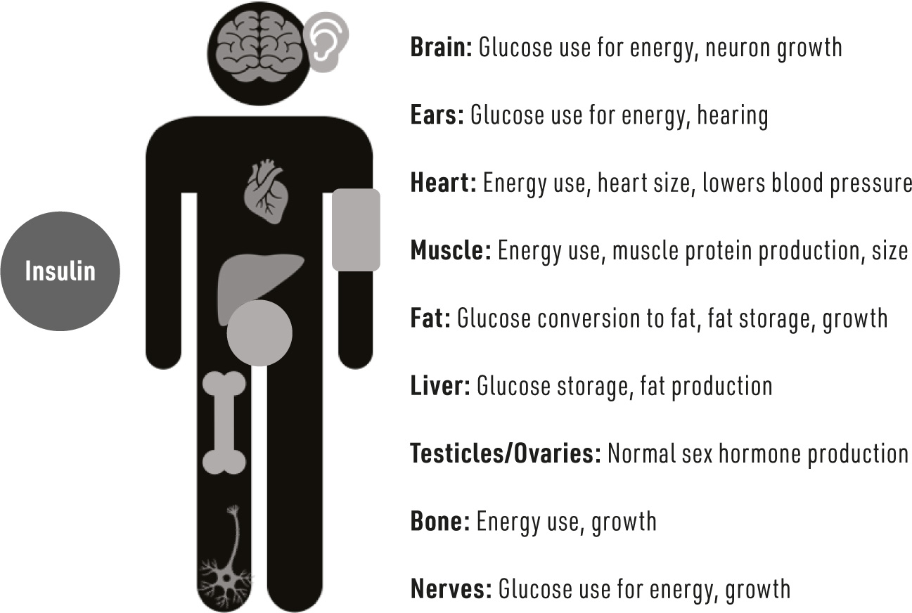
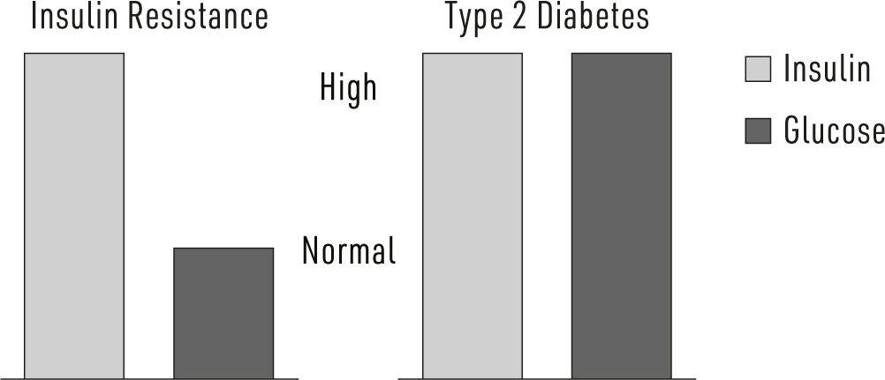

#### CHAPTER 1

### What Is Insulin Resistance?

INSULIN RESISTANCE is the epidemic you may have never heard of. Though many of us are unfamiliar with it, our unawareness belies how common it really is: half of all US adults, and roughly one in three Americans, are known to have it.^1^ However, this number could be as high as 88% of adults!^2^

Even more disturbing is how common it will be in the future—and don’t think the problem is just local. When we look at worldwide trends, it gets even grimmer: 80% of all individuals with insulin resistance live in developing countries, and, as in America, half of all adults in China and India are insulin resistant. Still, this isn’t a new trend. According to the International Diabetes Federation, the number of cases of insulin resistance worldwide has doubled in the past three decades and will likely double again in less than two more.

Insulin resistance was once a disease of affluence (what I like to call a “plague of prosperity”), or a condition that largely affected only well-off older people. Recently, however, that has all changed—there are documented reports of insulin-resistant four-year-olds (and up to 10% of North American children have it^3^). And low-income countries have passed high-income countries in terms of total number of people with the condition.^4^

To top it all off, the overwhelming majority of people with insulin resistance *don’t know they have it* and have never heard of it! So when it

comes to combating rising global rates of this disease, we have an additional barrier: getting people to understand it in the first place.

**Current and projected cases of diabetes by region (in millions)**Data source: International Diabetes Federation^5^

**Top 10 countries by number of adults with diabetes in 2019**Data Source: International Diabetes Federation^6^

#### Introducing Insulin

Before we can understand insulin resistance, we need to lay the groundwork by discussing insulin itself. Many people only think of insulin as a medication for people with diabetes. Insulin is actually a hormone that we

naturally produce in our bodies (unless we have type 1 diabetes—more on that later).

Like most hormones, insulin is a protein that is manufactured in one part of the body, moves through our blood, and affects other parts of the body. In insulin’s case, it’s made in the pancreas, a small organ tucked beneath the stomach. Insulin’s most famous role is regulating our blood glucose levels. When we eat food that increases blood glucose, the pancreas releases insulin, which then “opens the doors” to escort glucose from the blood to various parts of the body, such as the brain, heart, muscles, and fat tissue. And yet, far beyond regulating our blood glucose, insulin has an effect on every cell in every tissue of the body—a pretty big audience! This is almost unheard of among hormones; usually they affect only one or perhaps a few organs, but not insulin—its heavy hand touches every cell.

The specific effect of insulin depends on the cell. For example, when insulin binds to a liver cell, the liver cell makes fat (among other things); when insulin binds to a muscle cell, the muscle cell makes new proteins (among other things). From the brain to the toes, insulin regulates how a cell uses energy, changes its size, influences production of other hormones, and even determines whether cells live or die. Common among all of its effects is insulin’s ability to have the cell make bigger things out of smaller things, a process known as anabolism. Insulin is an anabolic hormone.

**Insulin’s many functions**

Clearly, insulin is important—when it works! The problem, and much of the point of this book, is when insulin isn’t working correctly, a state defined as insulin resistance.

#### Defining Insulin Resistance

At its simplest, insulin resistance is a reduced response to the hormone insulin. When a cell stops responding to insulin, which can be caused by various conditions (covered later), it becomes insulin resistant. Ultimately, as more cells throughout the body become insulin resistant, the *body* is considered insulin resistant.

In this state, certain cells need more than normal amounts of insulin to get the same response as before. Thus, the key feature of insulin resistance is that blood levels of insulin are higher than they used to be, and the insulin often doesn’t work as well.

**“BLOOD GLUCOSE” OR “BLOOD SUGAR”?**

The term “blood sugar” is vague and misleading, but technically

accurate as all simple carbohydrates can be termed “sugars.” “Sugar”

has commonly come to mean sucrose (that is, table sugar and high-

fructose corn syrup), a compound made from joined glucose and

fructose molecules. But this isn’t the sugar we mean when we talk

about “blood sugar.” The more accurate term is glucose, the

invariable final form of the carbohydrates we consume once they are

digested.

As mentioned, one of insulin’s main roles is regulating our blood glucose. Because sustained high glucose levels are dangerous, even potentially lethal, our bodies need insulin to usher the glucose from the blood, effectively lowering blood glucose back to normal. But what about glucose control with insulin resistance? As insulin resistance settles in, this process becomes compromised, which can lead to high blood glucose

levels, or “hyperglycemia”—the universal sign of diabetes. But we’re getting ahead of ourselves; insulin resistance can be present long before a person develops type 2 diabetes. (For a description of the difference between diabetes types 1 and 2, see the next section.)

Insulin is almost always considered in the context of glucose, which isn’t entirely fair considering the hundreds (thousands?) of things insulin does throughout the body. Nevertheless, in a healthy body, if blood glucose is normal, insulin is usually normal. However, with insulin resistance, insulin levels are *higher* than expected relative to glucose. In the “story” of insulin resistance and diabetes, we’ve been treating glucose as the main character, but it’s really the sidekick. That is, glucose is the typical blood marker we use to diagnose and monitor diabetes, but we should really be paying attention to insulin levels first.

So why the backward priority? Well, we can likely blame the glucose-centric paradigm of insulin resistance and type 2 diabetes on history and science.

#### Why Too Many Focus on Glucose, but Not Insulin

Historically, because it is a cause of type 2 diabetes, insulin resistance has been lumped into the diabetes mellitus family of diseases.

The first recorded evidence of this family comes from ancient Egypt over 3,000 years ago, through a medical papyrus noting that people with a particular condition experienced “too great emptying of the urine.” Some time after, physicians in India observed that certain individuals produced urine that attracted insects like honey. (In fact, that symptom would inspire part of the name for the disease: “mellitus” is Latin for honey-sweet.)

Hundreds of years later, in Greece, the excessive urine associated with the disease elicited the name *diabete*, which means “to pass through,” further emphasizing the remarkable amount of urine patients were producing. All of these observations also came with one common finding: in each case, the excessive urine production was accompanied with weight loss. In fact, though it seems amusing now, early theories were that the flesh was melting into urine.

These early physicians, and those that came later, were describing type 1 diabetes mellitus. It wasn’t until the fifth century that Indian physicians

noted two distinct types of this disease, one associated with a young age and losing weight (which modern physicians would come to call type 1), the other with older age and excess body weight (type 2). Nonetheless, both were identified by the excess amount of glucose-loaded urine. In the absence of savvier techniques, this understandably lead to the disease being defined by glucose, which was causing the common, main observable symptom (polyuria—the technical term for producing too much pee).

However, in doing so, we ignored the other, more relevant half of the problem—insulin. And while diabetes types 1 and 2 share the symptom of excess glucose, they diverge completely when it comes to insulin. Whereas type 1 diabetes is caused by having too little insulin (or none), type 2 is caused by having too much.

This “too much insulin” is insulin resistance, and because of its association with type 2 diabetes, it became wrapped up in the glucose-centric perspective as well.

**MODY: LOOKS LIKE TYPE 1, FEELS LIKE TYPE 1, BUT**

**ISN’T TYPE 1**

Do you have type 1 diabetes? Does a sibling have it? And a parent?

An aunt or uncle? A grandparent? Even if you see a strong family

line of type 1 diabetes, you may not have it at all—in fact, relatively

little of type 1 diabetes is thought to be genetically inherited. Ask

your doctor to test your blood for anti-beta-cell antibodies (e.g.,

GADA, IA-2A, ICA, etc.), a definitive diagnosis for type 1 diabetes.

If it’s negative, you probably have MODY, or “mature onset diabetes

of the youth” (a terrible name). Unlike typical type 1 diabetes, MODY is a genetic disorder with

a fairly clear family inheritance pattern, where genes involved with

producing insulin are mutated and now not working. Importantly, in

contrast to true type 1 diabetes, MODY does not result in the loss of

the insulin-producing beta (β) cells of the pancreas—in MODY the β

cells are all there; they just don’t work right. Because of the lack of insulin, a patient will indeed manifest with

all the same symptoms of type 1 diabetes, such as hyperglycemia,

weight loss, polyuria, and feeling faint, thirsty, and hungry. Critically,

whereas a person with type 1 diabetes must be treated with insulin, a

patient with MODY, depending on the specific gene that’s mutated,

can be treated with an oral drug and, in some cases, just by changing

lifestyle. So, your family history of type 1 diabetes may not be type 1

diabetes after all.

Early physicians didn’t have access to modern technology and screening techniques, so it’s understandable that they focused on what they could observe. But why keep focusing on glucose into the modern day?

Well, scientifically, glucose is still more easily measured than insulin. To measure glucose, we only need a simple enzyme on a stick, or a basic glucometer, and that technology has existed for roughly 100 years. Insulin, on the other hand, because of its molecular structure and characteristics, is much more difficult to measure. We didn’t have a test until the late 1950s, and it required handling radioactive material. (This discovery was so revolutionary that Dr. Rosalyn Yalow received the Nobel Prize for it!) It’s simpler today, but still not so easy and not very cheap.

So, even though we can now measure insulin, this advance came about too late—we’d already committed to thinking of diabetes as being a “glucose disease” and, in turn, developed clinical diagnostic values for the disease based entirely on glucose. If you run a quick internet search for “glucose+diabetes,” several top results would immediately inform you of the shared clinical values of blood glucose for diabetes types 1 and 2. (Indeed, the values are the same—126 milligrams per deciliter [mg/dL]— which should seem odd considering the diseases are so different. Excess glucose is the only thing diabetes types 1 and 2 have in common; other than glucose, they are wildly different diseases with very different symptoms and progressions.) Try a similar internet search for insulin, and you’ll find plenty of information on insulin *therapy *but almost nothing about the clinical values of* blood* insulin for diabetes. Even as a professional scientist who studies this condition, I have a hard time finding a consensus on insulin values for diabetes.

All of this is interesting, but it still doesn’t explain why so many people with insulin resistance are undiagnosed. After all, if we can identify type 2

diabetes by glucose levels, why not insulin resistance (which is also called “prediabetes”)? Well, we fail to identify it because *insulin resistance isn’t* *necessarily a hyperglycemic state*. In other words, someone can have insulin resistance and still enjoy perfectly normal blood glucose levels. But which value *won’t* be normal in insulin resistance? You guessed it—insulin. If you’re insulin resistant, you’ll have higher than normal levels of insulin. But of course, the problem is both finding a consensus value for “too much” blood insulin and actually getting your blood insulin measured clinically; it’s not part of the standard tests most doctors order.

This is why we can have a scenario where a person is steadily becoming more and more insulin resistant, but the insulin is still working well enough to keep blood glucose in a normal range. This can develop over years, even decades. But because we more typically look at glucose as the problem, we don’t recognize there’s an issue until the person is so insulin resistant that their insulin, no matter how much they produce, is no longer enough to keep their blood glucose in check. It’s at this point, possibly years after the problem started, that we finally notice the disease.

Ultimately, it is unfortunate that history and science played out the way they did. My single greatest frustration is also the reason so many people with insulin resistance are undiagnosed—we look at it wrong. Perhaps if insulin had been the easier-to-measure molecule, we wouldn’t have lumped types 1 and 2 diabetes together, and we might have launched a system to identify the disease much earlier—all because we’d have been looking for the more relevant indicator, insulin. After all this, it’s no surprise that

insulin is a much better predictor of type 2 diabetes than glucose, predicting the problem up to 20 years earlier.^7^ Before moving on, it’s helpful to establish a couple points.

First, as mentioned, insulin resistance increases the risk of type 2 diabetes. This is true, but this relationship warrants further clarification. Type 2 diabetes *is* insulin resistance. That is, type 2 diabetes is insulin resistance that has progressed to the point where the body is unable to keep blood glucose levels below the clinically relevant 126 mg/dL. We’ve known this for almost 100 years; German scientist Wilhelm Falta first proposed the idea in 1931.^8^ In other words, any time you hear someone speaking about the evils of diabetes, you can just substitute in “insulin resistance” and it’s immediately more accurate. For example, your neighbor doesn’t have a family history of diabetes; she has a family history of insulin resistance.

Second, insulin resistance is a hyperinsulinemic state. That means a person with insulin resistance has more insulin in the blood than normal. (This particular point will become highly relevant when we discuss the unfortunate effects of being in this state for prolonged periods.)

As a reminder, note that insulin resistance per se won’t kill you; it’s just a reliable vehicle that can rapidly get you there by causing other, life-threatening conditions. This means people are experiencing multiple and seemingly diverse health problems that could be improved by addressing one root cause.

Indeed, insulin resistance has a hand in a startling number of very serious chronic diseases, including problems of the head, heart, blood vessels, reproductive organs, and more. Far more than being a mere inconvenience, when left untreated, this is a serious condition. Most people with insulin resistance will ultimately die from heart disease or other cardiovascular complications; others will develop Alzheimer’s disease, breast or prostate cancers, or any number of other lethal diseases.

Understanding how insulin resistance causes these disorders is essential to appreciating how important insulin is to our health. That’s why we’ll spend the next chapters exploring how insulin works throughout the body and just how insulin resistance causes these other conditions. Buckle up— it’s a bumpy ride.
