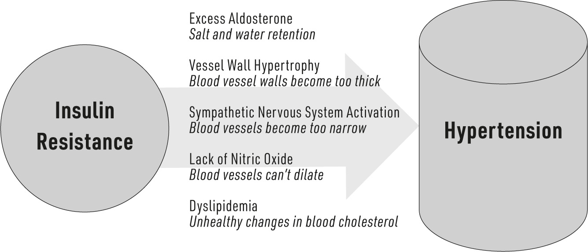
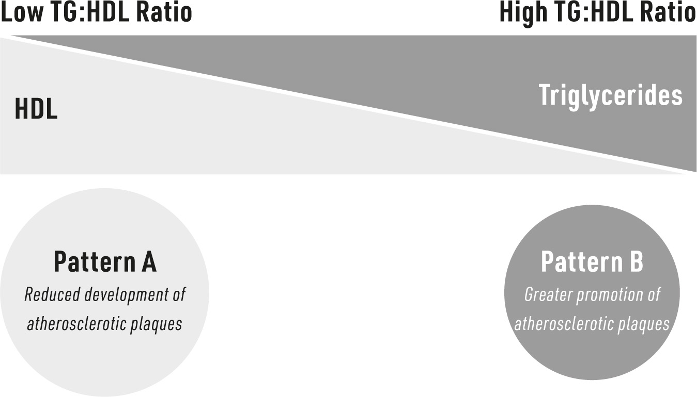

#### CHAPTER 2

### Heart Health

HEART DISEASE is *the *leading global cause of death, accounting for more than 30% of disease-related deaths. Naturally, because it is so deadly, there’s been much discussion of what causes heart disease. Commonly accused culprits include cigarette smoking, alcohol, dietary cholesterol, lack of exercise, and too much belly fat. But there’s not as much focus on insulin resistance. Some circles acknowledge it as a piece of the puzzle, but the truth is more dramatic. It* is* the puzzle—insulin resistance and cardiovascular disorders are almost inseparable. The preeminent physician-scientist Joseph Kraft, who devoted his prolific career to understanding insulin resistance, accurately declared, “Those with cardiovascular disease not identified with diabetes [i.e. insulin resistance] are simply undiagnosed.”^1^ Where you find one, you find the other.^2^ Indeed, the connection is so remarkably strong that there are entire monthly biomedical journals dedicated to the topic.

Now, when we say “heart disease,” we don’t actually mean one disease in particular; heart disease and cardiovascular disorders are umbrella terms for various conditions that affect our heart and blood vessels. So, “heart disease” might mean elevated blood pressure, thickening of the heart muscle, blood vessel plaques, or another condition. We’ll explore several in this chapter.

#### Hypertension

Having excessively high blood pressure dramatically increases the likelihood of developing heart disease. As the pressure in your blood vessels increases, your heart has to work ever harder to move blood adequately throughout your body and all its tissues. The heart can only meet this strain for so long; if it’s not treated, it ultimately results in the heart failing.

There’s no debate: insulin resistance and high blood pressure are related. When patients consistently have both, that’s evidence of a clear association, and almost all people with hypertension are insulin resistant.^3^ This isn’t news to medical professionals. However, what *is *news is that they’re not just related; we’re coming to understand that insulin resistance and high insulin levels directly* cause* high blood pressure.

The reason this is so important is that, as you’ll recall, the overwhelming majority of people with insulin resistance don’t know they have it. For someone who has just been diagnosed with hypertension, that may be the first evidence they have insulin resistance.

Yet, if you’ve been diagnosed with high blood pressure, there is a silver lining. Yes, the connection between insulin resistance and hypertension is strong, but that *also* means that as insulin resistance improves, patients generally see quick improvements in their blood pressure.

Over the years, we’ve come to understand just how insulin resistance, and the accompanying hyperinsulinemia, work in concert to chronically increase blood pressure. Let’s take a closer look.^4^

**How Insulin Resistance Increases Blood Pressure*****Salt and Water Retention***One of the ways that insulin increases blood pressure is through its actions on the hormone aldosterone. Not often discussed, aldosterone has an important role in heart health. Aldosterone is released from the adrenal glands, which are located above the kidneys, and helps to regulate the balance of salt and water in your body. Sodium and chloride, the two parts of salt, are both critical electrolytes that enable all of our body’s cells to function properly. Aldosterone signals the kidneys to hold onto sodium and reabsorb it into the blood so it is not expelled through your urine. Thus, if your adrenal glands release more aldosterone into the blood, your body will retain more sodium, and where sodium goes, so, too, does water. This increases the amount of water in the blood, effectively raising the blood volume, and with it, the pressure.

Insulin naturally increases aldosterone levels in the body. So if you have more insulin, as during insulin resistance, its effect on your aldosterone happens abnormally often … and, accordingly, it’s increasing your blood volume and potentially raising your blood pressure. This very likely explains the remarkably tight association of insulin resistance and hypertension. (It also explains why carbohydrates, which increase insulin more than other nutrients, so effectively increase blood pressure,^5^ while dietary fat has no effect^6^—we’ll explore dietary factors more in Part II.)

**SENSITIVE TO SALT?**

Some people develop hypertension due to excess salt intake, but

others can eat lots of salt and have no such response. People who

develop hypertension from salt consumption are known as “salt-

sensitive hypertensives.” In a healthy state, when we eat salt, the body senses the increased

salt and “turns aldosterone off” so the kidneys excrete salt and water;

this ensures normal blood pressure. However, in the insulin-resistant

state, the body has artificially elevated levels of aldosterone. When

such a person eats salt, the kidneys disobey normal physiology by

retaining salt rather than excreting it along with water. Over time,

this leads to an accumulation of body water that increases blood

volume and raises blood pressure.^7^***Thicker Blood Vessels***Another way that high insulin leads to high blood pressure is by thickening blood vessel walls.

Blood vessels have several layers, and the innermost layer is lined with cells known as “endothelial cells,” or the “endothelium.” Remember, insulin is an anabolic hormone—it inherently signals cells to grow bigger, including endothelial cells. This is a healthy and natural response. However, when excess insulin is flowing through the blood, the signal is stronger than normal. As vessel-wall cells grow, the endothelium thickens, and blood vessels begin to narrow.

Imagine a garden hose thickening as water is flowing through it: as the hose walls press in on the flowing water, the pressure inside the hose will climb. This is exactly what happens in the blood vessels as too much insulin excessively stimulates endothelial growth.***Blood Vessels Can’t Dilate***Think again about that garden hose with water running through it—if we make the hose larger (not longer), the water will flow more slowly and with less pressure; rather than shooting out, the water will merely be a trickle. Nitric oxide (NO) is a powerful vasodilator, which means it increases the diameter of a blood vessel. Endothelial cells produce NO, which helps the muscle layer that surrounds blood vessels to relax, thereby increasing the size of the vessels. Just like the hose, as vessel diameter increases, the pressure inside plummets. In the body, this pressure-lowering effect is so rapid and potent that we have long used NO, in the form of oral nitroglycerin, to prevent or reverse chest pain by rapidly dilating blood vessels in the heart to increase blood flow. In fact, NO has been shown to be so important in cardiovascular health that scientists exploring its function received the Nobel Prize.

Insulin activates the production of NO in endothelial cells. When insulin flows through a series of blood vessels, it signals those endothelial cells to produce NO, which makes the blood vessels dilate, boosting blood flow to that area.^8^ This may be one of the ways that insulin directs the flow and use of nutrients by various tissues. For example, by increasing the blood flow to muscles, insulin helps those muscles receive more nutrients and oxygen.

In contrast to the previous cardiovascular issues we’ve discussed, where aldosterone and endothelial growth are *overactive *with insulin resistance (because of the hyperinsulinemia), the problem with NO and insulin resistance is that insulin is* less* able to stimulate NO production in endothelial cells. In this scenario, the endothelial cells have become less responsive to insulin’s ability to increase NO production. Thus, where insulin once increased blood vessel size and reduced blood pressure, it now has less effect, and blood pressure stays elevated.***Narrow Blood Vessels***Our sympathetic nervous system regulates the body’s unconscious actions, including heart rate and heart contraction force, blood vessel size, sweat glands, and more. It is typically referred to as the “fight or flight response” because its events drive the body to action—it “primes the pump” for us to physically perform at our best. Part of this response is to increase blood pressure. We often think of higher blood pressure as a bad thing, but when you’re fighting or fleeing for your survival, it is actually very helpful because it can increase the delivery of blood (with all its nutrients and oxygen) to various tissues throughout the body, especially our muscles.

Interestingly, even in the absence of a perceived threat, insulin turns this process on, albeit subtly. However, when you have too much insulin because of resistance, this process is hyperactive—our system is slightly activating the fight-or-flight response to such a degree that we experience an increase in blood pressure that lasts as long as the insulin is elevated.***Unhealthy Changes in Blood Lipids***Lipids are fats or fat-like substances that are present in our blood and tissues. Your body stores fats for future energy use, and when it needs energy, it can break down lipids into fatty acids and burn them like glucose.

Dyslipidemia is simply a state of having an abnormal amount of lipids in your blood. Usually, this is defined by simply having *too much* lipid, but it can also indicate that the usual levels of the various lipids are out of order.

The main lipid players are triglycerides (TG), low-density lipoprotein (LDL) cholesterol, and high-density lipoprotein (HDL) cholesterol. Most often, doctors focus on the two cholesterols, and the dogmatic belief is that LDL cholesterol is the villain—many sources refer to HDL as “good” cholesterol and LDL as “bad” cholesterol. While there are certainly data to support that conclusion,^9^ many, many studies suggest otherwise^10^; there’s little consistent evidence to support the theory that LDL is as lethal as we once believed. This inconsistency may have to do with how we measure it.

Though it’s called “low density,” LDL cholesterol actually comes in various sizes and densities. Measuring this is getting easier and easier. We’ve known for decades that our characterization of LDL is more meaningful in predicting heart disease when it is categorized by size and density, which we refer to as a “pattern.” There are two patterns, termed A and B, that represent the ends of a spectrum: pattern A refers to an LDL molecule that is larger and less dense, and B refers to the LDL being smaller and denser. Now, for a cholesterol carrier to cause disease, it must pass from the blood and into the blood vessel wall; we can appreciate that a smaller, denser lipoprotein would do this more easily than a bigger one.

If this doesn’t make sense, let’s use an analogy. Imagine you are standing on a bridge above a river. In your left hand, you’re holding a beach ball (LDL A); in your right hand, you’re holding a golf ball (LDL B). After you drop both balls into the water, what would happen? The buoyant, less dense beach ball would float along with the river, while (as any golfer knows too well) the denser, less buoyant golf ball would drop to the bottom, bouncing along the riverbed. LDL A and B likely act in a similar way in your blood vessels, with LDL A tending to float along and interact with the blood vessel wall less frequently than LDL B. And, importantly, LDL can only drop off its fats and cholesterol when it bumps into the blood vessel wall. Thus, it’s not surprising that people with LDL pattern B are remarkably more likely to experience cardiovascular complications than people with pattern A.^11^

At this point, determining LDL *size* is still not a common part of typical blood tests. If you’ve had your cholesterol tested recently, you may remember that the lipid panel reported just the main three lipid players: TG,

LDL, and HDL. Interestingly, however, we *can* use two of those numbers as a highly accurate indicator of LDL size—a “poor man’s” method, if you will. By dividing the level of triglycerides (in mg/dL) by HDL (in mg/dL; TG/HDL), we get a ratio that is surprisingly accurate in predicting LDL size. The lower the ratio (e.g., ~<2.0), the more prevalent the larger, buoyant LDL particles; that is to say, LDL A predominates. But as the ratio climbs (~>2.0), the small, dense LDL B particles are more common.^12^ Virtually every blood test will include TG and HDL, which means we can readily get an idea of our individual LDL pattern type without requiring a specialized test.

But what does all this have to do with insulin resistance? Insulin selectively drives the production of LDL pattern B from the liver (where almost all cholesterol is made). As insulin levels steadily climb with increasing insulin resistance, the liver is getting the signal to shift the individual toward a pattern B LDL profile.^13^ At its simplest, the connection of dyslipidemia to high blood pressure is thought to be due to the accumulation of lipids in the blood vessel walls and the eventual development of an atherosclerotic plaque, reducing vessel diameter. (The actual process is a bit more complicated, as we’ll see in the next section.)

**STATINS**

Statins are one of the most commonly used medications. They are

used to reduce cholesterol levels and thus are intended to reduce risk

of heart disease. For those with a known genetic defect that increases

cholesterol to very high levels (e.g., familial hypercholesterolemia),

this might indeed be the case.^14^ However, for people without this

disease and who have never had a heart attack, yet are at high risk

based on conventional blood lipid markers, such as LDL levels,

statins provide remarkably little benefit,^15^ possibly because statins

actually appear to increase the ratio of pattern B to pattern A LDL

cholesterol.^16^ Independent of its effect on cholesterol, statins have side effects

relevant to insulin resistance: postmenopausal women who take

statins may increase their risk of developing type 2 diabetes by up to

50%.^17^ We are gaining an ever-clearer picture of how statins cause

insulin resistance. While some of the effect may be statins damaging

muscle tissue,^18^ statins also block the cell’s responsiveness to insulin

and promote the release of hormones that increase glucose in the

blood (making insulin work harder to lower glucose).^19^

#### Atherosclerosis

Atherosclerosis is the most essential process in the development of heart disease.^20^ Our great fear of cholesterol stems from the theory that it leads to atherosclerosis, a process wherein the blood vessels become hardened and narrowed (as just mentioned).^21^ But let’s look at this process more closely.

As described in the last section, to be pathogenic, cholesterol must pass into the blood vessel wall. However, cholesterol being deposited in the endothelium isn’t *in itself *the cause of disease. When they enter the endothelium, cholesterol and fats are benign—they appear to elicit no negative response. Indeed, the cells that line blood vessels, like all other cells in the body,* need* cholesterol and fats to maintain healthy function!

Nevertheless, the lipids may not be benign for long. In certain people, something happens to the cholesterol and fats to make them noxious.

The switch is flipped when the fats and/or cholesterol are oxidized, which happens when oxidative stress is high. Once that happens, white blood cells called macrophages engulf the oxidized lipid to prevent it from oxidizing other parts of cells. (The name *macrophage* comes from the Greek for “big eater,” which is apt considering how these cells work: they swallow up and digest pathogens, foreign substances, and cellular debris.) Over time, the macrophage will become loaded with oxidized fat or cholesterol; the lipid-laden cell is known as a “foam cell” due to its foamy appearance under a microscope. This foam cell then recruits help by releasing proteins to signal more macrophages to come to the area (known as an inflammatory response). The newcomers also become foam cells over time, worsening the problem. Eventually, this mix of foam cells and lipids becomes the core of the atherosclerotic plaque.

At the risk of complicating the problem, as much as the focus has been on cholesterol, it’s more valid (and fair) to spread the blame to include noncholesterol fats. In particular, the polyunsaturated fat called linoleic acid (very common in seed oils, such as soybean oil) is the most readily oxidized fat—far more so than cholesterol—and is likely a main culprit.^22^ In fact, when cholesterol gets oxidized, it’s often due to a linoleic acid being bound to a cholesterol molecule^23^—as though our neutral cholesterol is forced to give the naughty child, oxidized linoleic acid, a piggyback ride. Nevertheless, even here, insulin resistance is relevant.

Insulin resistance is an important risk factor for atherosclerosis.^24^ This is likely because insulin resistance stimulates the two main variables thought to be involved in this disease. We already discussed one: the role of insulin in increasing LDL pattern B subtype; LDL B can carry the problem fats, like linoleic acid. The other variable is oxidative stress. Insulin resistance seems to increase oxidative stress^25^; later, we’ll see that it goes both ways, and that oxidative stress also increases insulin resistance.***Inflammation***Various markers of inflammation, especially the increasingly well-known C-reactive protein, more accurately predict cardiovascular disorders than

cholesterol levels.^26^ Remarkably, whereas insulin elicits anti-inflammatory actions in an insulin-sensitive person (with normal levels of insulin),^27^ insulin activates inflammation in insulin-resistant people (with high levels of insulin).^28^

This matters. A lot. Implicating insulin resistance as a cause of inflammation places insulin resistance at ground zero for heart disease—it’s waging war on the blood vessels by doing everything to promote atherosclerosis. First, insulin resistance increases blood pressure, increasing the likelihood of blood vessel damage. Next, it increases lipid deposition in blood vessel walls. Finally, insulin resistance increases inflammation, promoting the ongoing infiltration of the blood vessel with macrophages, which become increasingly laden with oxidized lipids, changing into foam cells. Altogether, these events, each spurred on separately by insulin resistance, culminate to form an atherosclerotic plaque. With all this in mind, it’s little surprise that insulin can *directly* promote foam-cell formation in blood vessels!^29^

#### Cardiomyopathy

A separate class of cardiovascular disorders specifically involves the heart muscle, or myocardium. With cardiomyopathy, the muscles of the heart become unable to generate enough force to pump blood throughout the body’s countless vessels. There are several types of cardiomyopathy, but they are all generally classified by the structural changes in the heart, including:

• dilated cardiomyopathy, where the heart is “ballooned out”;

• hypertrophic cardiomyopathy, where the heart muscle is too thick and

prevents adequate filling; and

• restrictive cardiomyopathy, where the heart muscle becomes scarred

and stiff. Collectively, these cardiomyopathies are sometimes referred to as “nonischemic heart failure,” meaning that it’s not a lack of blood flow (e.g., atherosclerosis or a heart attack) causing the heart to fail.

Of the three main types, insulin resistance has been most strongly associated with dilated cardiomyopathy, or DCM.^30^ Heart muscle cells rely on glucose for their main fuel. With DCM, the heart muscle (or myocardium) becomes dilated, meaning it stretches and gets thinner. As this continues, the heart muscle doesn’t contract normally and can’t pump blood very well; the theory is that over the course of the disorder, the myocardium becomes ever more reliant on glucose to keep working. However, insulin resistance compromises the heart’s ability to take in and use glucose; because of this metabolic change, the heart begins to suffer from a relative lack of energy and nutrients.^31^

Although there’s not as much evidence as there is for insulin resistance and DCM, some studies indicate insulin resistance may play a role in the development of hypertrophic cardiomyopathy.^32^ (That’s not especially surprising—nothing is at this point, right?) Very likely, the chronically elevated insulin drives the growth of the myocardium, making it too thick to allow the heart chambers to fill with blood. By now, I hope it is clear: though we often blame other factors, there is no single variable more relevant to heart disease than insulin resistance. Any successful efforts to reduce our high risk of heart disease *must* address it. When we acknowledge the central role of insulin resistance, we start resolving the fundamental causes, rather than symptoms (which is all medications can do). As much as worldwide efforts to stem heart disease have tried, the longer we overlook insulin resistance, the worse the problem will get.
