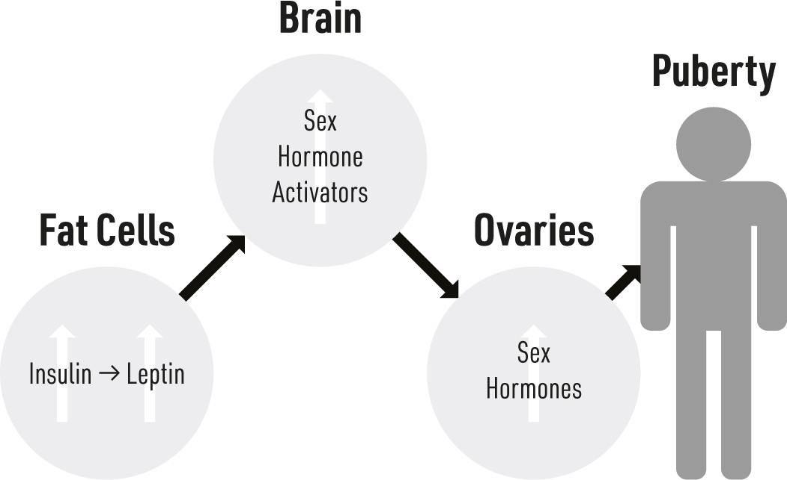

#### CHAPTER 4

### Reproductive Health

BECAUSE YOU’RE NOT MY TEENAGE CHILD, you’ll allow me to freely

discuss sex and its wondrous intricacies. Of course, to keep our species alive, humans, like all other organisms, reproduce. Some of us do this quite well (just ask my parents—I have 12 siblings …), while others may suffer the heartache that usually accompanies infertility. Regardless of the situation, among the essential components of reproductive health are the sex hormones produced by the primary sex glands (testes in men, ovaries in women), with some involvement from the brain. The brain and sex glands, known as gonads, interact to properly orchestrate the many events in men and women that must happen to allow reproduction. However, you might be surprised to learn that a humble hormone from the pancreas plays an important role as well.

The connection between insulin resistance and reproductive disorders may be the most unexpected one that we cover. Most people would never imagine that insulin plays *any* role in reproduction, let alone an essential one. And yet, insulin is absolutely necessary for normal reproduction— which may be evidence of a simple yet profound link between our metabolic and reproductive function. After all, reproducing is risky business! It wouldn’t be prudent to bring off-spring into a dangerous or unhealthy situation, such as a period of starvation. Insulin, then, acts as a signal that tells our brain if our environment is metabolically safe. Normal insulin levels suggest the potential parent-to-be is healthy and their diet is sufficient to grow a fetus and even raise a newborn.

The fact that we need insulin for healthy reproduction is clear. Experiments with rodents have revealed that a lack of insulin leads to changes in brain and gonad function that decrease reproductive processes.^1^ But too much insulin isn’t any better than too little. (Remember, insulin resistance is almost always a state of hyperinsulinemia—the pancreas is producing more insulin than normal in an effort to increase insulin’s actions.) Insulin-resistant men^2^ and women^3^ are more likely to be infertile than their insulin-sensitive counterparts. Additionally, insulin-resistant children are more likely to experience alterations in puberty.^4^

Exactly why this happens is fascinating and illustrates both how delicately fertility is regulated and the ways metabolic processes drive reproductive processes. In this chapter, we’ll take a look at the many sexual and reproductive complications that can arise when men, women, and kids have insulin troubles.

#### Insulin and Women’s Reproductive Health

Reproduction is a complex process in women. Throughout a woman’s menstrual cycle, a series of hormonal changes lead to the development and eventual release of an egg, a process called ovulation, which generally happens each month. If she becomes pregnant, a woman’s reproductive capacities also include developing and sustaining the growing baby. And even after birth, her job isn’t done—her body continues to change, including the production of breast milk and other shifts that affect reproduction.

For women, reproduction involves a great deal of change and growth and demands a lot of energy. Perhaps for these reasons, women’s fertility and reproductive health appear to be much more intimately linked with insulin and insulin resistance than men’s.

Before we talk about the pathological side of insulin and reproductive disorders in women, I have to highlight the interesting—and normal— relationship between insulin and pregnancy. Insulin is a growth signal, turning on anabolic processes to increase the size of our cells and sometimes even their number. The pregnant body needs to grow, and insulin helps that happen. Insulin helps the placenta grow,^5^ helps breast tissue

develop in preparation for lactation,^6^ and even helps ensure Mom has enough energy available for the demanding process of pregnancy by increasing her body’s inclination to store fat. In fact, to facilitate this, insulin receptors are increased in a woman’s fat tissue at the onset of pregnancy, then return to normal levels after birth.^7^ Maternal fat tissue will grow more readily during pregnancy because of fat tissue’s heightened responsiveness to insulin than at other times in life.

Pregnancy is one of very few instances where insulin resistance appears to be a *normal* and even helpful event. Yes, pregnancy is a naturally insulin-resistant state. The average, healthy woman will become roughly half as insulin sensitive at the end of her pregnancy as she was at the beginning.^8^ And in this case, insulin resistance is a good thing! The technical term for this is “physiological insulin resistance”—meaning it’s insulin resistance with a purpose. As a pregnant woman’s body becomes insulin resistant, insulin levels increase (although it’s just as likely that her body becomes insulin resistant because of the elevated insulin levels, described later), which drives tissue growth, such as the placenta.

But the elevated insulin levels in pregnancy do more than prepare the mother-to-be; even more important, insulin also helps stimulate growth and development of the growing baby.^9^ So, just as the elevated insulin is preparing the maternal body for optimal pregnancy function, it is also giving the fetus a critical growth signal.

That said, while insulin resistance is a natural occurrence in pregnancy, it can have other implications for women’s reproductive health, including fertility issues, polycystic ovarian syndrome, gestational diabetes, preeclampsia, and more.***Gestational Diabetes***The most obvious reproduction-related disorder with insulin resistance in women is gestational diabetes mellitus. This happens when the woman becomes sufficiently insulin resistant during the course of her pregnancy that her insulin is not enough to keep blood glucose at normal levels. At this point, the normal, physiological insulin resistance has become pathological; the fine line between these two states is glucose control.

Gestational diabetes can happen to any pregnant woman, though the usual risk factors that apply to insulin resistance are the most relevant. We’ll

get into risk factors in more detail in Part II, but for gestational diabetes, they include pre-pregnancy body weight, age, family history of diabetes, and ethnicity (with those of Asian, Hispanic, and Middle Eastern descent having the highest risk; they’re all ethnicities with greater risk of insulin resistance).^10^

Unfortunately, even if the woman had no evidence of insulin resistance or type 2 diabetes before pregnancy, developing gestational diabetes increases her likelihood of developing type 2 diabetes later in life. In fact, on average, her risk of developing type 2 diabetes is sevenfold higher when compared with a woman who did not have gestational diabetes during pregnancy.^11^***Preeclampsia***More severe insulin resistance during pregnancy, which usually manifests as gestational diabetes, increases the risk of developing one of the most lethal pregnancy disorders, preeclampsia—a dangerous change in kidney function. Women who develop more dramatic insulin resistance during early pregnancy are significantly more likely to develop preeclampsia during the second half.^12^

The connection between the two disorders is not fully understood, but it very likely has to do with at least some of the blood pressure problems that arise from insulin resistance, including activation of the sympathetic nervous system and reduced nitric oxide production^13^ (for a refresher, refer to chapter two).

However it may happen, the altered blood pressure with insulin resistance creates a situation where blood flow to tissues in the mother, including the placenta, is less than ideal.^14^ When it’s not getting enough blood, the placenta creates a signal protein called vascular endothelial growth factor (VEGF) for itself and the rest of the body. VEGF stimulates the formation of blood vessels, and in releasing this protein, the placenta is trying to increase the amount of blood that it receives.^15^ In a healthy pregnancy, this is exactly what happens; the placenta needs more blood and VEGF helps it happen. But in the case of preeclampsia, the placenta inexplicably releases a second protein called the soluble VEGF receptor,

which sticks to VEGF and prevents it from working. So, even though the placenta is making VEGF, the protein can’t do anything.

Not only does this scenario hurt the placenta (by not letting it create new blood vessels), but the kidneys suffer a serious setback—they need the VEGF that the placenta makes. The kidneys normally use VEGF to maintain normal blood filtration, which is their main job and absolutely necessary for health. When the kidneys don’t get enough VEGF, they start to lose their functionality. They stop filtering properly, and toxins and excess water start to accumulate in the blood. Higher blood volume via excess water is the main cause of increased blood pressure (as we saw in chapter two). But the toxins are the more dangerous feature, potentially leading to seizures and death as they affect the brain. Meanwhile, the kidneys’ lack of VEGF also causes them to become “leaky,” allowing protein from the blood to spill into the urine. This is why we monitor not only the blood pressure of women with preeclampsia, but also the amount of urinary protein as an indicator of kidney health.

If it isn’t caught early and treated, preeclampsia can lead to liver or kidney failure and future heart issues for the mother. For the baby, less blood flow to the placenta means the fetus gets less food and oxygen— leading to lower-than-normal birthweight. The only real solution for preeclampsia is to remove the placenta, which means removing the baby as soon as it is developed enough to deliver safely. That means inducing labor or a very early caesarean section to protect the mother’s health.***Over- and Underweight Babies***Being born on either end of the weight spectrum can have consequences later in life, and having a mother with hyperinsulinemia and insulin resistance has a surprisingly strong influence on this.

Before we go on, I want to clarify that when I refer to a newborn’s weight in this section, I don’t mean a baby that is naturally smaller or bigger because of family genetics. I’m discussing the situation when, all things considered, a baby is born smaller or larger than anticipated.

A mother’s metabolic health and the health of her baby are closely connected. Some of the strongest evidence for this comes from the Dutch Famine Study, which tracked the health of people who were conceived during the Dutch famine of 1944–1945 at the end of World War II.^16^ The

researchers were able to explore the effects the famine had on these individuals depending on whether it had occurred early, late, or in the middle of the mother’s pregnancy. Individuals whose mothers endured famine at the beginning of pregnancy were significantly more likely to be obese later in life compared with normal. Importantly, these observations weren’t necessarily associated with the infant being born larger or smaller than normal—it was independent of newborn body weight. (As we will see in later chapters, obesity and insulin resistance are closely connected.)

For a mother with more dramatic pregnancy insulin resistance (such as maternal gestational diabetes and/or polycystic ovarian syndrome—more on that later), the most common result is that the infant is born with a higher birthweight than normal. The fetus has developed in an insulin- and possibly glucose-rich environment, thriving beyond what is typical. This may seem benign, but it has lasting effects. These infants are roughly 40% more likely to be obese and have metabolic complications in their teenage years and beyond.^17^

On the other end of the spectrum are infants born below the normal and expected birthweight (common when the mother develops preeclampsia^18^). It might be tempting to assume that any child born with a high birthweight is much more likely to become obese and insulin resistant than a normalbirthweight baby and certainly more than a low-birthweight (LBW) baby. But it’s not so simple.

While individuals with a high birthweight do indeed have an increased likelihood of obesity and insulin resistance later in childhood,^19^ the risk is actually greater in those with LBW. Paradoxically, just like the high-birthweight infants, these children are more likely than average to develop obesity and metabolic disorders later in life. The metabolic complications of LBW have been particularly well documented in the UK, where researchers have consistently observed that children born thin don’t stay that way for long.^20^ Yes, it’s true—infants born below the normal weight are the most likely to become obese and insulin resistant.^21^ This trend can start to appear as early as four years old—by this age, the child has often caught up to normal-weight peers and begins to surpass them in weight, though it can happen later in the teenage years as well and last into late adulthood.^22^ A part of this effect may be related to the physical stress of being born LBW

and potentially confounding events surrounding the birth^23^ (we’ll discuss how stress connects to insulin resistance on pages 98–99).

**WHAT ABOUT DAD?**

The overwhelming majority of research on neonatal metabolic

complications has focused on the role of the mother’s insulin and

metabolic health. The relatively smaller focus on the *father’s* insulin

and metabolic health has yielded conflicting results.^24^ However,

studies that track and explore insulin resistance and other metabolic

parameters of the offspring, not just birthweight, support the idea that

paternal insulin resistance matters; if Dad has insulin resistance, it’s

one more trait baby may inherit.^25^***Low Breast Milk Supply***Independent of any effect on baby’s development and mother’s health, maternal insulin resistance can also affect the mother’s ability to nurse. A 2000 study of mothers with gestational diabetes revealed that women with the worst insulin resistance were likely to have the lowest milk supply.^26^

Interestingly, if a new mother has a problem breastfeeding, she also has a stumbling block to the built-in solution for improving her insulin resistance. Breastfeeding is an effective method of increasing the mother’s postnatal insulin sensitivity.^27^ So, having insulin resistance could make it more difficult to take advantage of a natural way to reverse the insulin resistance of pregnancy.***Polycystic Ovarian Syndrome***Polycystic ovarian syndrome (PCOS) is the most common cause of female infertility, affecting approximately 10 million women worldwide. As the name suggests, the ovaries of the affected woman become burdened with cysts, resulting in highly painful ovaries that grow to several times their

normal size. At its very core, PCOS is a disease of too much insulin, an inseparable and causal factor.

As I mentioned earlier, female fertility is an elaborate orchestra of hormones. In the first part of a woman’s menstrual cycle, her estrogen levels are low. A small but important part of the brain called the hypothalamus sends a signal to the pituitary gland, also located in the brain, which then releases follicle-stimulating hormone (FSH). FSH tells a few of the follicles in the ovaries to develop into mature eggs. One of the eggs becomes dominant. As the follicles mature, they send a massive increase in estrogens from the ovaries, which tells the hypothalamus and pituitary that there’s an egg ready for release. The pituitary gland then releases luteinizing hormone (LH). This surge in LH causes the dominant, mature egg to emerge through the ovary—this is ovulation. With ovulation, a hormonal signal goes to the remaining developing eggs and causes their degradation, and they subsequently disappear from the ovaries.

Did you get all that? As I said, this process is complex! Ultimately, what’s important to know is that the process of allowing one egg to become dominant and eventually be ovulated is governed by specific hormone fluctuations. If these waves of hormones are disrupted, it creates a problem.

So how exactly is insulin involved? Well, ovaries, like every tissue, respond to insulin. Perhaps one of the more unexpected ways they do so is by inhibiting estrogen production. All estrogens were once androgens; during production, an enzyme called aromatase converts androgens (“male hormones”), such as testosterone, into estrogens (“female hormones”). (This process occurs in both men and women, by the way.) But too much insulin inhibits aromatase. As the enzyme’s actions are dialed down, androgens fail to convert to estrogens at the necessary levels, estrogen production becomes lower than normal, and androgens become higher than normal.

Estrogens have countless effects throughout the body; one of the main ones in women is their role in the menstrual cycle. As we just saw, production of estrogens increases dramatically around midway through the cycle. This spike in estrogens signals the brain, which increases the level of LH production, resulting in ovulation and the eventual degradation of the other developing eggs. If this mid-cycle estrogen bump doesn’t happen owing to insulin resistance, ovulation doesn’t happen, and the ovaries retain and accumulate the eggs.

Beyond its effects on estrogens, insulin may also directly act on the brain to block normal LH production. LH production usually comes in pulses—periods of increased then decreased production. Insulin appears to prevent this pattern, which may disrupt normal fertility.

Insulin’s effects on sex hormones go beyond fertility issues. With PCOS, relatively fewer androgens are being converted to estrogen, resulting in high androgen levels. Higher androgens can lead to more and coarser facial and body hair and male-pattern baldness in women. Last, high insulin alone, independent of sex hormones, often increases the presence of dark skin patches called acanthosis nigricans (described further in chapter six), a common feature of PCOS.***Problems with Fertility Treatments***As you might have guessed, considering the various reproductive disorders insulin resistance causes, many resistant women end up seeking fertility treatments. Unfortunately, even here, insulin resistance insists its presence be noted.

Before we talk about treatments, I want to acknowledge that insulin sensitivity has a direct positive effect on women’s fertility. Reducing insulin levels and improving insulin sensitivity, whether by weight loss or use of insulin-sensitizing drugs, increases natural ovulation in the absence of any fertility-drug intervention.^28^

One of the most common therapies to improve female fertility is treatment with clomiphene, which alters estrogens to induce ovulation. However, insulin-resistant women with PCOS respond poorly to the drug and typically require higher doses, which can lead to negative side effects.^29^ In fact, measuring blood insulin in the woman with PCOS is the most reliable indicator for predicting her responsiveness to clomiphene— the lower the insulin, the higher her response. If female fertility is a complicated orchestra of hormones, insulin is the conductor. Abnormal crescendos and decrescendos of fertility hormones throughout the menstrual cycle, including estrogens, FSH, and LH, are just following the conductor. If a woman is able to get her insulin under control, often the fertility hormones will follow, and the most common forms of infertility, as just outlined, are, like a bad song, simply turned off.

#### Insulin and Men’s Reproductive Health

In contrast to the complexities of female fertility, reproductive health in men is a (relatively) straightforward matter. The primary problem with male infertility is low sperm counts or poor sperm quality. Secondary problems, far less frequent, often include anatomical problems or genetic defects. In this section, we’ll focus on two big problems that can arise with insulin resistance: sperm production and erectile dysfunction. Because insulin resistance is related to both of these problems, let’s first look at its association with testosterone.

We have a cultural obsession with testosterone. It is now common to hear men talk about being diagnosed with “low T” and blame it for their other health complications, including lack of energy and inability to lose weight. Many are inclined to think that the low testosterone is the cause of the weight gain, and this can certainly happen.^30^ But the significant rise in diagnoses of low testosterone suggests something else is occurring (unless you espouse the idea that men have spontaneously become “less manly”). Thus, before we conclude that men have, within a generation, evolved to spontaneously develop low testosterone and become obese and infertile, it’s worthwhile to explore the process in reverse—to consider that poor metabolic health is actually preceding and causing the reduced testosterone production.

Men with higher body fat tend to have less testosterone,^31^ and testosterone levels increase as a man loses weight.^32^ Of course, insulin is highly relevant in these changes, though it can be hard to distinguish insulin’s direct effect from a potential independent effect of simply having too much adipose (fat) tissue. The results of several studies^33^ have confirmed that insulin, independent of body fat, directly inhibits testosterone production; more insulin leads to lower testosterone.

**THE OVARY IN THE ADIPOSE**

Ovaries in women, unlike testes in men, produce relatively fewer

androgens. Rather, ovaries are equipped with high levels of

aromatase—as we learned on page 42, that’s the very busy enzyme

that changes male hormones (androgens) to female hormones

(estrogens). (This also happens in the testes, just not as much.) Remarkably, aromatase also exists in fat tissue.^34^ Yes, men: your

fat tissue is acting like an ovary. More precisely, excess fat tissue

increases circulating estrogens in both men and women. (So, if your

doctor tells you you’re “low T,” don’t blame your testes for what

your fat did!)***Sperm Production***While perhaps not as complex as ovulation, sperm production nevertheless requires the involvement of several hormones, including some from the brain, and testosterone and even estrogens from the testes. Disruptions in the normal production of these hormones can result in the failure to produce sufficient or healthy sperm. If testosterone is below normal levels, sperm production cannot occur.^35^***Erectile Dysfunction***Men with insulin resistance have an increased risk of erectile dysfunction,^36^ and erectile dysfunction gets worse as insulin resistance gets more severe.^37^ Indeed, the relationship is so tight that erectile dysfunction could be one of the earliest signs of insulin resistance, with scientists recently stating in a research article that “insulin resistance may be the underlying pathogenesis of ED in young patients without well-known etiology.”^38^ In other words, if a seemingly healthy young man has erectile dysfunction, insulin resistance could very well be the cause. But to appreciate this connection, we need to revisit the powerful influence insulin wields on blood vessels.

Erectile dysfunction typically stems from a problem of blood vessel regulation—blood vessels must dilate dramatically to develop and sustain an erection. This process requires the production and actions of NO.^39^ As we discussed in chapter two, as endothelial cells (the cells that line the walls of the blood vessels) become insulin resistant, they produce less nitric oxide, which deprives the blood vessels of a strong dilating signal.

If a woman’s fertility is like an orchestra, a man’s fertility is like a barbershop quartet—fewer parts, but each one essential. The complication for men is that fertility requires both physical (i.e., erection) *and* hormonal (i.e., sperm production) processes. In both instances, insulin sings the lead and keeps the other characters on key.

#### Insulin and Puberty

The transition from childhood to adulthood is a period of intense change— notoriously, an intense hormonal change. This all usually starts in the brain with the release of gonadotropin-releasing hormone (GnRH). GnRH sends a signal to adolescent ovaries and testes to induce higher levels of estrogens and androgens that, in turn, lead to the development of secondary sex characteristics—facial hair and voice changes in boys, selective increases in fat and wider hips in girls, and substantial growth in both.

This period of rapid growth requires tremendous energy. And because hormones dictate energy use within the body, puberty is intimately linked, not only with obvious physical changes, but also with changes in our metabolic function.

To understand how metabolism ties in to puberty, we need to understand the role of yet another hormone, leptin. Leptin is a metabolic hormone secreted from fat tissue; the more fat tissue you have, the more leptin you’ll usually have circulating in your blood. You might have heard of leptin as a hormone that sends an “I’m full” signal to the brain, letting the body know when it’s eaten enough. Leptin does much more, including telling the brain there is sufficient body fat to sexually develop. Essentially, leptin increases the production of GnRH from the brain, thereby driving puberty. This effect is so strong that, in mice, leptin injections alone are sufficient to induce puberty.^40^

At first glance, the topic of puberty has plenty to do with other hormones but not much to do with insulin. However, insulin and leptin are highly related and influence each other. As insulin rises, it stimulates leptin production from fat cells, which then activates precursor sex hormone production in the brain, then the gonads. Because insulin has a part to play here, it means our metabolic health and our nutrition have a strong influence on when puberty begins.

***Overnutrition and Early Puberty***Various factors determine when puberty will begin. Some of those factors, such as family history,^41^ are expected, while others are unexpected—for example, it might surprise you that girls with supportive parental relationships are likely to start puberty later than girls who don’t.^42^ One of the strongest determinants of when puberty will start is a person’s nutrition and body fat mass.^43^ (Perhaps because women bear the metabolic burden in reproduction, having to carry the developing baby and feed the newborn, puberty in girls appears to be much more sensitive to metabolic and nutrition status than puberty in boys.)

In recent years, a global shift has occurred in nutrition. Whereas we were once concerned with people around the world not having enough food, the problem of people eating too much food is now more common. Importantly, much of the food we’re overeating comes in the form of refined and insulin-spiking carbohydrates, such as sugar.^44^ Parallel with this shift in nutrition and lifestyle is an equally dramatic increase in blood insulin levels.^45^

As highlighted earlier, insulin drives body fat growth—as insulin climbs, it promotes fat cell development and growth, and prevents the breakdown of fat stored in these cells. As fat cells expand, they produce and secrete more leptin into the blood. The relationship between leptin and

insulin becomes particularly important in the context of puberty and, especially, the early onset of puberty, known as precocious puberty. The result is that over the decades, the global overeating crisis, with its changes in insulin and leptin, has had stark effects on puberty.

Current standards mark a normal onset for puberty to be from around eight to 12 years old in girls and nine to 14 years old in boys. However, our current lifestyle is very different than in earlier generations, and perhaps in all of human history. To put this in perspective, the average onset of puberty in the mid-1800s was around 16 years for girls. This dropped to around 14 in the early 1900s, then to 13 and 12 in the mid- and late 1900s, respectively. Now the average age is under 10 years old—a difference in puberty onset of almost seven years!

The connection between obesity and precocious puberty is strong enough to quantify; every one-unit increase in body mass index (BMI; a rough indicator of body fat) between the ages of two to eight is associated with a roughly one-month-earlier onset of puberty.^46^ In other words, if a young girl’s BMI increases five points above average (a very possible change) during this age range, she can expect puberty to start a half year earlier than what would be normal for her.

There has been speculation as to the cause of these changes. Many theories center around girls’ exposure to estrogen-like molecules found in detergents and plastics. While this might have an influence, the role of insulin resistance and hyperinsulinemia is irrefutable. Again, excess insulin drives excess leptin production, which leads to early puberty. Medical intervention aimed at increasing insulin sensitivity (discussed in depth later), with a subsequent reduction in insulin and leptin, slows the age of puberty onset and progression to normal.^47^

**UNDERNUTRITION AND PUBERTY**

Though much less common, it’s worthwhile to highlight

undernutrition and puberty. If a child is undernourished, the effect on

puberty depends on *when* the lack of sufficient food occurred. In one scenario, if a child is born under her ideal body weight,

she will commonly catch up to her peers in the first few years of life,

and, within the next few years, exceed them in body fat gain.

Because of this, children that are born underweight usually

experience puberty at the same time as their peers, though they may

also start earlier than normal^48^; this is especially true for girls.

Remember, below-average birth-weight increases the risk of

developing insulin resistance.^49^ So, in these children who are born

relatively undernourished, as body fat catches up to normal, then

surpasses it, insulin starts relatively lower in life, then increases in

the ensuing years with the progression of insulin resistance. The

higher insulin levels increase leptin levels and make it more likely

that puberty will start early. The second scenario involves a child who experiences

undernutrition in childhood preceding puberty but had a normal

birthweight. This child’s diet or lifestyle is such that insulin is very

low, which results in very little body fat. This, in turn, results in

insufficient leptin production,^50^ leading to delayed puberty. A prime

example of this is the young female gymnast who undertakes strict

training and diet to maximize her performance by reducing body fat

and increasing muscle mass. In these elite gymnasts, delayed puberty

is very common.^51^ A second example of delayed puberty with

undernutrition is the individual with anorexia nervosa, a state of self-

imposed starvation. Puberty is usually delayed in this state, and, in

some instances, physical sexual development may be permanently

hindered, even if nutrition later becomes sufficient (e.g., reduced

breast development).^52^ Reproduction is a demanding process, and the body wants to ensure things are working right, including metabolic function, before worrying about the next generation. Insulin, the king of all metabolic hormones, is a strong indicator of metabolic status in the body—and high insulin rings a warning bell. From the brain to the ovaries and testes, insulin either facilitates or frustrates reproduction. Normal insulin, reflecting good metabolic health, promotes normal fertility.

As frustrating as fertility issues can be, they rarely fall within the realm of “scary,” which is where the next health complication resides. As different

as fertility and cancer are, they do have one thing in common—to varying degrees, they’re both influenced by insulin.
