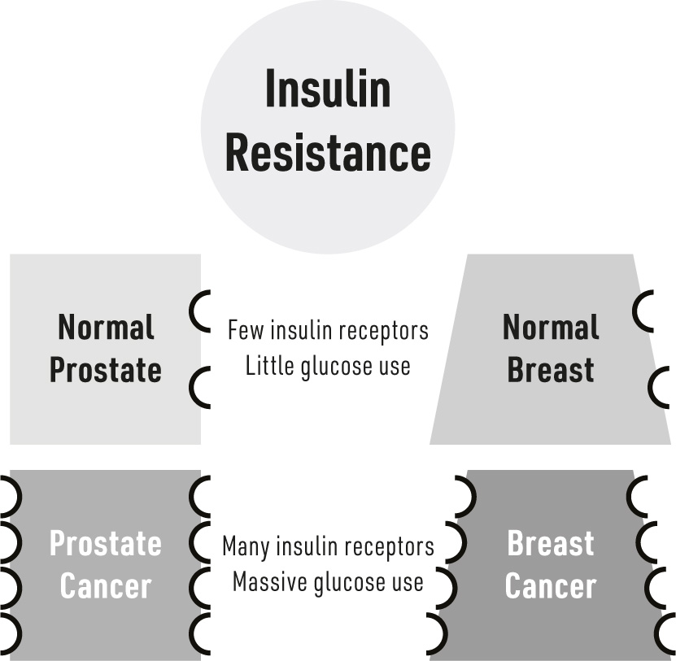

#### CHAPTER 5

### Cancer

CANCER IS THE SECOND-LEADING CAUSE OF DEATH in the United

States, although it’s making a strong play to overtake heart disease as killer number one.^1^ Cancers can affect any organ. Breast and prostate cancers are the most common in women and men, respectively, and lung cancer is the deadliest. Despite over $160 billion being spent per year to cure cancer in the US, with a global economic burden of roughly $1.2 trillion, ever more people are dying. Clearly, this investment isn’t paying off.

Cancers have different possible causes. While the general consensus is that cancer results from genetic mutations or gene damage, increasing evidence challenges this conclusion. Perhaps cancer isn’t a disease of genetics, but rather of metabolism. Though it’s controversial, the metabolic paradigm isn’t without significant supporting data, some of which began a century ago (discussed more hereafter).^2^

Regardless of its specific cause, cancer is a disease of cellular growth; certain cells begin to multiply uncontrollably. And insulin resistance is part of this equation because it pushes cancer cells to grow faster. With insulin resistance, we have a perfect storm involving two primary ingredients on which cancer cells thrive.

First, cancer cells seem to have a sweet tooth—they love glucose.^3^ Now, normally, our cells are awash in a constant supply of nutrients. Because our bodies don’t want all our cells to proliferate unchecked, we have natural control systems in place—healthy cells don’t take in nutrients

unless they’re specifically told to do so by substances called growth factors. When they get the signal, normal cells take in nutrients and rely on enzymes to burn them, thereby releasing energy that becomes our body’s fuel. This energy-creation process takes place inside our cells’ mitochondria. However, cancer cells actually rewire their metabolism to get their energy a different way. Almost 100 years ago, the German physician and scientist Otto Heinrich Warburg discovered that cancer cells have an almost total reliance on glucose as their primary metabolic fuel. Moreover, Warburg’s research indicated that, instead of using their mitochondria to break down the glucose, they do so outside the mitochondria, without the need of oxygen (the technical term for this is anaerobic glycolysis). We now refer to this phenomenon as the “Warburg effect.” This critical deviation from the norm allows cancer cells to grow rapidly everywhere in the body, including locations that might not have adequate blood flow (and, therefore, not enough oxygen).

Second, as you know by now, with insulin resistance, blood insulin levels are elevated. When you appreciate that one of insulin’s main actions is to cause cells to grow, you can easily appreciate the predicament. Insulin’s anabolic effects can also work to increase the growth of cancer cells, especially if the cancer cell has made itself more sensitive to insulin than a normal cell. Thus, while the high blood insulin is sending signals for fat cells to grow, any cancer cells that have mutated to be more sensitive to insulin are growing far more rapidly than normal thanks to this boost from insulin.

To further emphasize insulin’s relevance in cancer, one of the most studied aspects of cancer is something called the insulin-like growth factor1. This protein, like insulin, promotes general growth in the body. That’s usually a good thing, but it is also a common feature of many cancers.^4^

The combination of these two signals, glucose and insulin, is essential to understanding why people with hyperinsulinemia—whether they are lean or fat—have roughly double the likelihood of dying from cancer.^5^ What’s worse is that breast, prostate, and colorectal cancers have a stronger relevance to insulin resistance.

#### Breast Cancer

The cancer perhaps most commonly linked to insulin resistance is breast cancer, which is also the most common cancer in US women (though very rarely—less than 1% of cases—men can also develop breast cancer). The fact that it’s *not* the most common worldwide highlights the importance of environment in so many diseases, including cancers. And insulin resistance has a very strong connection to our environment—we’ll explore that in depth in Part II.

Women with the highest fasting insulin levels (that is, women with insulin resistance) are those with the worst breast cancer outcomes.^6^ Remember, insulin tells cells, including cancer cells, to grow. But the increased insulin alone may account for only part of the insulin–breast cancer connection. The average breast cancer tumor has over six times more insulin receptors than noncancerous breast tissue.^7^ Six times more! That means this malignant tissue is six times more responsive to insulin and its growth signals than normal tissues.

Ultimately, the connection between insulin resistance and breast cancer has been so consistently observed over the years that when trials began treating breast cancer patients with insulin-sensitizing medications, it wasn’t surprising to see an improvement in the disease.^8^ Essentially, the researchers found that controlling insulin resistance helped control the breast cancer.

A related connection is the role of fat tissue itself. We’ll spend two chapters exploring the complicated relationship between insulin resistance and obesity, and we have previously highlighted how excess body fat increases circulating estrogens (see “The Ovary in the Adipose” on page 44). Breast tissue is sensitive to estrogens—estrogens send a growth signal to breast tissue. When this happens excessively, such as is the case with obesity, the breast tissue is more likely to grow excessively, increasing the risk of developing breast cancer.^9^

#### Prostate Cancer

Prostate cancer is the most common cancer in men in the United States, and it becomes increasingly common in men as they age. And prostate cancer, too, has a strong connection with insulin resistance.

Like the breast, the prostate is a highly hormone-sensitive tissue; it will grow or shrink based on hormone signals. While testosterone is the main hormone signal, insulin also plays a role. Before a man is worried about prostate cancer, he’s worried about his prostate just getting too big—a condition called benign prostatic hyperplasia. This is a very common event in men as they age, usually causing difficulty in urinating (the enlarged/growing prostate blocks the exit of urine from the bladder). A man with insulin resistance is about two to three times more likely to have an enlarged prostate compared with an insulin-sensitive man.^10^ So, high insulin means low flow.

Men with a high degree of insulin resistance may be upwards of 250% more likely to develop prostate cancer compared with insulin-sensitive men of the same age, race, and body weight.^11^ In fact, prostate cancer and insulin resistance occur together so often that some scientists have questioned whether prostate cancer might be an additional eventual *symptom* of insulin resistance.^12^ Critically, an analysis of 500 men found that insulin (but not glucose) was positively associated with prostate cancer risk.^13^

But the insulin–prostate connection doesn’t end with elevated insulin levels in the blood. Similar to breast cancer, a fairly common feature with prostate tumors both malignant and benign, is the presence of excess insulin receptors.^14^ So once again, the excess blood insulin and the increased number of insulin receptors in the prostate combine to create a powerful “growth” signal, stimulating the prostate to grow beyond its normal limitations.

#### Colorectal Cancer

Insulin resistance is associated with increased risk of developing cancer in the lower part of the digestive tract, including the colon and rectum; it also makes colorectal cancer more lethal.^15^ Indeed, colon cancer patients with insulin resistance are roughly *three times* more likely to die from the cancer, compared with patients who do not have insulin resistance. The hyperinsulinemia that invariably accompanies (causes) insulin resistance may be the main driver of colon cancer development.^16^

Too much insulin has been shown to increase the number of cells of the outermost (mucosal) layer of the intestines.^17^ This might seem like a good thing, but when we consider that cancer is a problem wherein cells are excessively growing and proliferating, it’s perhaps not so benign. Cancer is a terrifying disease, partly due to its seeming randomness; healthy people who “do everything right” can still get cancer, while some lifelong smokers get nothing. Undoubtedly, there are variables outside of our control —age and genetics, for example. Thus, emphasizing the controllable variables, such as our environment and the food we eat, is the most rational

strategy to mitigate our cancer risk and improve our outcome if we do get it. There is no single most relevant player with cancer, but insulin resistance clearly plays one of the leading roles. Thankfully, as we will see, it’s one we can do something about.

Now that we’ve covered the heavy topic of cancer, it’s time to discuss the “filling”—all the parts of our bodies that make up our ability to move and work. Even these, as you’ll see, are susceptible to changes in insulin.
