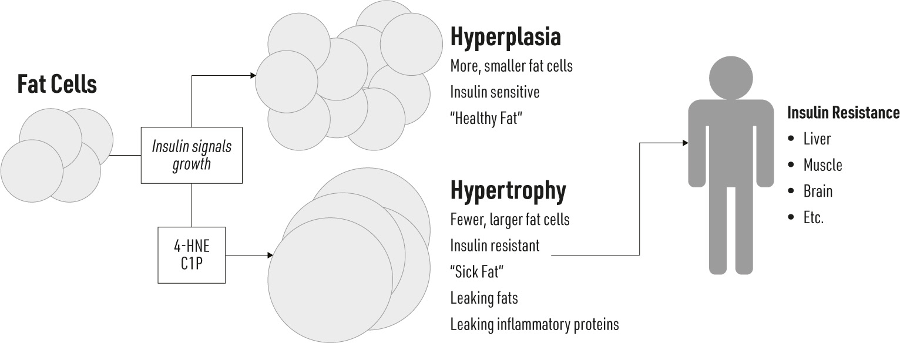

### N

#### CHAPTER 11

### Obesity and Insulin Resistance,

### Revisited

OW, I KNOW WHAT YOU’RE THINKING: “Didn’t we already talk about obesity? How can obesity be a *cause *of insulin resistance if it’s a* consequence* of insulin resistance?”

My answer, again: it’s complicated! Insulin resistance and obesity have a very strong connection, but which comes first is a matter of some debate. There is evidence to support both perspectives. In chapter nine, we explored how high insulin levels lead to the accumulation of body fat. Now, it’s time to review the evidence on the other (more widely accepted) side of the story: how obesity causes insulin resistance.

#### Location Matters

As with real estate, so it is with body fat—it’s all about location. We appreciate more than ever that excess body fat is largely relevant only if we store our fat in the wrong place. Where we store our fat is determined largely by our sex, partly by our genetics (“thanks, Mom and Dad”), and partly by diet.

Typically, we consider two predominant “patterns” of fat storage, referred to as fat deposition, although there are always exceptions (and

some may have the misfortune of having both). A key difference between these two types of fat storage patterns is specific placement of the fat.

The “gynecoid” fat pattern is the result of fat stored beneath the skin, referred to as “subcutaneous fat.” This pattern is typified by fat accumulating on the hips and thighs, with less fat on the upper body and trunk. Think of the pear shape typically seen with women due to the actions of estrogen.

In contrast, the “android” pattern may have both subcutaneous and visceral fat—meaning fat inside the trunk of the body, surrounding the visceral organs (liver, kidneys, intestines, and heart). This is the typical male fat storage pattern, analogous to the apple body shape. Someone with the android pattern stores most of their body fat right around the middle of the body—the “inner tube.”

**IF IT JIGGLES, IT’S GOOD**

The best way to know which is your predominant fat pattern is

simply to grab it. Yep. Grab it. (Only on yourself, please!) If you can grab some fat and shake it, it’s subcutaneous fat (=

better). If you can’t easily grab it or your belly is hard but big, it’s

likely you have more visceral fat (= worse). So don’t be so quick to curse jiggly body fat. We might not like

how it looks or bulges, but it’s better than the alternative.

We have long known that women have a better chance of living longer, healthier lives than men; this is partly due to the inherent differences in the impact these fat deposits have on insulin resistance and the subsequent risk of various chronic diseases. Ultimately, what is so important about these two fat patterns is the likelihood of having excess visceral fat. Study after study has shown that storing fat inside the core of the body is harmful, and we now know that there are differences in how fat behaves when it’s stored in the viscera. And because men have a greater likelihood of storing fat there, this, in turn, is likely why men suffer more health problems with excess body fat than women do. A series of rodent experiments have

established this. When visceral fat from an obese animal is transplanted into a lean animal, the recipient animal becomes insulin resistant immediately.^1^ In contrast, when subcutaneous fat is transplanted into the lean animal, it remains insulin sensitive.^2^

Interestingly, these same rules apply to a seemingly lean person. That’s right—even some people who look lean may be insulin resistant because of having more visceral fat. But wait: even lean individuals with insulin resistance are likely fatter than their lean insulin-sensitive counterparts. It’s really a matter of whether you see the fat or not. And this is relevant because it emphasizes the most important aspect of obesity and insulin resistance; namely, where you’re fat.

**WAIST-TO-HIP RATIO**

Want to know how you’re doing? Another easy method to determine

your fat pattern is to compare your girth around the largest part of

your belly (near the navel; this is the waist measurement) with the

largest part around your hips/buttocks (this is the hip measurement).

Divide the waist number by the hip number. For example, if my

waist is 30 inches and my hips are 40 inches, my waist-to-hip ratio is

0.75. For men, this number is ideally below 0.9. For women, this

number should be below 0.8.

Ultimately, the story still isn’t over—it’s not enough to know that excess body fat increases the risk of developing insulin resistance. We need to know how the fat leads to insulin resistance. Excess body fat, especially visceral fat, increases two pathological conditions—it increases inflammation and causes oxidative stress (covered in the next two chapters).

#### Fat Cell Size Matters

Did you know that your fat cells may be able to hold only so much fat? Like an overflowing cup, when your fat cells are “full,” the excess fat begins spilling over into the blood and potentially getting stored in other tissues. The precise process is being actively studied, but the most consistent results suggest that it’s because the fat cells simply become insulin resistant.

Insulin sends a powerful signal to the fat cell to store fat, which means to both pull fat in directly from the blood and to make new fat from glucose. However, insulin also slams the “exit” doors closed to prevent any fat from leaving, inhibiting the fat-shrinking process known as “lipolysis.”

There is a fascinating and even obvious (as long as you have a microscope!) difference between fat cells that are insulin sensitive and continuing to store fat and those that are insulin resistant and “leaking” fat —it’s all about size. As we gain fat, our fat tissue can grow in two ways: either via an increased number of fat cells (yet the fat cells themselves remain small; this is called “hyperplasia”) or a growth in cell size (yet the number of fat cells remains lower; this is called “hypertrophy”). Larger fat cells have relatively fewer insulin receptors, for their size, than smaller fat cells.^3^ Because of this, larger fat cells may not receive sufficient insulin stimulus, and as a result, the larger fat cells experience a degree of fat breakdown despite the presence of insulin attempting to block the process.

This series of events is evidence of a personal fat threshold—a limit to the size of the fat cells (and fat mass, by extension).^4^ When a fat cell reaches its maximum dimensions through hypertrophy (which is several times that of the normal fat cell), it attempts to limit further growth; an excellent way to do this is to become resistant to insulin’s growth signal. However, if fat cells can multiply via hyperplasia, they never reach this limit and maintain sensitivity. An interesting scenario plays out when we explore this idea in more detail. Let’s imagine two people: one with fat cell hypertrophy and another with fat cell hyperplasia. The first fellow, whose fat is growing via hypertrophy, will stop gaining weight as the enlarged fat cells become insulin resistant and refuse to grow any further; this person could be only moderately overweight (by conventional standards), yet be very insulin resistant. In contrast, the second fellow, whose fat cells are multiplying, will continue to gain weight, and have a greater potential be very overweight, yet likely maintain a high degree of insulin sensitivity.

We can actually “hijack” this process with modern medicine. In a fascinating example of the power of fat cell size in determining insulin

sensitivity and metabolic health, insulin-resistant patients are sometimes prescribed a type of medication (“thiazolidinediones”; discussed more in chapter sixteen) that actually forces the fat cells toward hyperplasia. Following this, an interesting scenario ensues: patients start gaining weight but become more insulin sensitive.^5^ The drugs help fat cells continue to proliferate and store fat, which helps with insulin control, but, unfortunately, hurts weight control.

Importantly, the insulin-resistant fat cell that’s grown beyond its borders not only leaks fat, but because it’s “too big,” it also becomes inflamed, dumping inflammatory proteins into the blood.^6^ In the end, this means that the body is receiving this toxic mix of too much fat and too much inflammation, both of which drive insulin resistance.

**THE “FAT FORMULA”**

You might be able to determine your own fat tissue’s insulin

resistance with numbers from a blood test. If you can, next time you

have a blood test, ask your healthcare provider to measure your

insulin levels (in microunits per milliliter or µU/mL) and your free

fatty acids (in millimoles per liter or mmol/L); with these numbers,

you have what you need. Normally, insulin prevents fat cells from

shedding their fat, which comes in the form of free fatty acids. Of

course, if the fat cells are becoming insulin resistant, insulin may be

high, and because it’s not working too well, free fatty acids would be

high. A recent publication found that a “fat formula” score of 9.3

(insulin × free fatty acids) was the optimal cutoff^7^; if your score is

lower than 9.3, you can take some comfort that your fat cells are

doing OK.

But why might fat cells grow in size and not number? What makes them “turn bad”? From what we’ve learned, there are a couple of known causes. Paradoxically, two distinct fat products can hurt the fat cell’s ability to store fat in a healthy way, forcing fat cells to stop growing in number and start growing in size.

Before we look at what these fat molecules do, a brief biochemistry lesson may be helpful. A fatty acid is the technical term for an individual fat molecule. Each molecule consists of a row of carbon atoms with hydrogen atoms linked to them. The number of hydrogens can differ between molecules, which is a sign of whether the fatty acid is saturated (having the maximum number of hydrogens) or unsaturated (having less than the maximum).

The first, and likely the worst, fat molecule that makes fat cells hypertrophy is called 4-hydroxynonenal (4-HNE).^8^ 4-HNE is the little monster that is born from the unholy union of a polyunsaturated fat (such as an omega-6 fat) and reactive oxygen molecules (or oxidative stress). Because of the unique structure of the fat—that is, all the unsaturated bonds —and the positioning of those bonds, omega-6 fats are very, very readily oxidized.^9^ Importantly, linoleic acid, the omega-6 fat of interest, is a massive part of our diet. It is the single most common fat consumed in the standard Western diet; it’s essentially the main fat in all processed and packaged foods. And, not surprisingly, it has become a significant part of the fat we store in our fat cells, constituting roughly one quarter of it^10^ (it’s increased almost 150% in the last 50 years). With this in mind, it’s easy to see the sequence: reactive oxygen molecules bump into the highly prevalent stored linoleic acid, creating 4-HNE, which accumulates and disrupts the fat cell’s ability to proliferate, forcing it to grow in size rather than number.

The second fat character that disrupts fat cell growth, forcing hypertrophy, is called ceramide 1-phosphate (C1P). Whereas 4-HNE is a consequence of oxidative stress, C1P can be considered more a

consequence of inflammation. Through a series of steps, a cell can create C1P from other innocent fats, but the initial steps are turned on by inflammation signals. However it happens, once C1P accrues to a certain point, it flips the same switches as 4-HNE and the fat cells become limited in their ability to multiply, increasing fat cell insulin resistance.^11^

But the story isn’t over. As mentioned earlier, regardless of the mechanism, we know that having more, smaller fat cells is better, metabolically speaking, than having fewer, larger fat cells.^12^ For reasons including lack of insulin response and poor blood flow,^13^ the larger, fewer fat cells begin leaking not only fat but also proteins called cytokines that promote inflammation (more on this in the next chapter). As the fat cells continue belching these toxic contents into the blood, tissues “downstream” of the fat cells, including the liver and muscle, are the victims. So, in this fat-centric perspective, the fight starts in the fat cells but soon carries over to the liver and muscles (and more).

#### Ectopic Obesity

Fat should be stored in fat cells; this is how our bodies are built. We certainly do have a limited capacity to store fat elsewhere, but ideally this is kept at a minimum. When we store too much fat in nonfat tissues (called ectopic fat), problems arise, including insulin resistance. A few tissues appear highly relevant to this process, including the liver, pancreas, and muscles; once they become insulin resistant, the rest of the body starts to feel it.

In each of these tissues, there is a reflection of what we see in the sick fat cell—it’s storing the wrong kind of fat. Triglycerides appear to be benign, even outside our fat cells. The real problems start when the fat is converted into ceramides; these “mean fats” compromise the cell’s insulin functions, whether it be in the liver, pancreas, or muscle.^14^***Fatty Liver***By now, you’re aware that the liver can get fat through a couple of processes, including too much fructose or alcohol or by too much insulin, which pushes the liver to create fats from carbohydrates. Regardless of the

cause, when the liver starts to get fat, it starts to become insulin resistant. Once this happens, it begins releasing glucose even when it shouldn’t. Generally, when insulin is high, it tells the liver to pull in and store glucose as glycogen and prevents the breakdown of glycogen back into blood glucose. Once insulin resistant, the liver allows glycogen to break down even when it shouldn’t, resulting in blood glucose levels that are constantly being elevated. This creates a battle with insulin, which keeps trying to push glucose out of the blood (including into the liver), while the liver keeps dumping glucose back into the blood. This chronic battle exacerbates the insulin resistance throughout the body by ensuring insulin stays almost constantly elevated.***Fatty Pancreas***The pancreas is responsible for insulin production, so it’s little surprise it’s listed here. However, unlike data about the liver, the data suggesting that fatty pancreas is relevant are more tempting than they are conclusive.^15^ The fatty pancreas could just be another symptom of insulin resistance and excess body fat; however, it might matter. For example, one study in China found that people with fatty pancreases were almost 60% more likely to have confirmed insulin resistance. A separate study of type 2 diabetes patients who were tracked for over two years revealed that pancreatic beta cells experienced a return to normal function around the same time that pancreas fat declined substantially. None of this is conclusive, but it may offer some valuable insight.^16^***Fatty Muscles***If the muscles become insulin resistant, it will be almost impossible to clear glucose from the blood. By mass, muscle is the largest tissue in most of our bodies and represents the largest “glucose sink”—it’s the main consumer of blood glucose, and it heavily relies on insulin to open the doors to glucose and escort it into the muscle cells. As I mentioned earlier, if the muscles are just storing benign triglycerides, they seem to respond to insulin just fine^17^; again, it all depends on the type of fat it’s storing. Once fat is converted to ceramides in the muscle, they start attacking several proteins in the muscle

that would normally attempt to respond to insulin, effectively stopping the insulin signaling as long as the ceramides are around.

One very important aspect of insulin resistance is that muscle can become insulin resistant on its own—it doesn’t need the fat cells to become insulin resistant first. Several studies have confirmed this, including studies from my own lab and others’: when insulin is high for a prolonged period, muscle cells stop responding to it.^18^

**LIPODYSTROPHY—TOO LITTLE OF A GOOD THING**

We live in a culture that despises body fat; we do everything we can

to fight it. Thus, most people would envy someone who, due to a

genetic mutation, is not capable of making fat tissue. This is a

condition known as lipodystrophy. However, a lack of fat tissue does

not mean an inability to store fat. While the person with

lipodystrophy looks as lean as you’d expect (no subcutaneous fat

tissue), the body is so determined to store fat that it stores it in other

tissues, including muscles and the liver. As these tissues become

loaded with the ectopic fat just discussed, they become insulin

resistant and create a state of severe insulin resistance in the body.^19^ Thus, rather than curse our body fat, we should be grateful for it;

we might not like the way it looks, but it’s healthier than the

alternative.

Teasing apart insulin resistance and body fat is a challenge—they have so many varied connections. Despite conflicting evidence on which comes first, as fat cells grow, they tend to develop and promote a general resistance to insulin throughout the body. However, this doesn’t mean the excess fat cell growth is obvious! Remember, “obesity” isn’t a required event; sometimes the fat cell growth is relatively minor or in places that are less obvious or simply not meant for fat storage.

Throughout this chapter I’ve highlighted the reality that not all fats, even when stored improperly, are bad for insulin signaling. Whether a fat is nice or mean is a process of conversion—the right (or wrong) set of

biochemical circumstances pushes the nice fat over the edge. Let’s look at those circumstances now.
