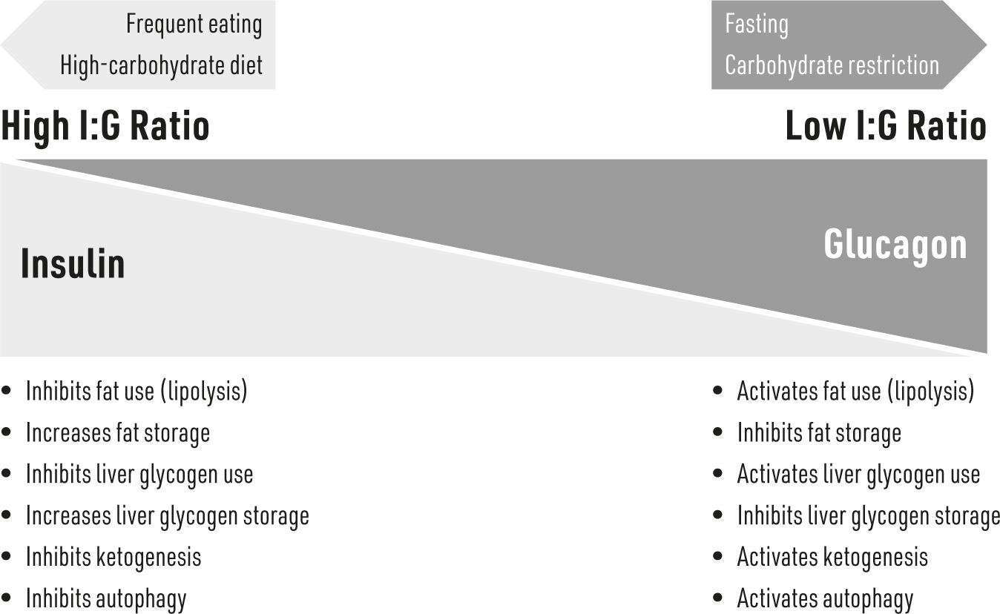
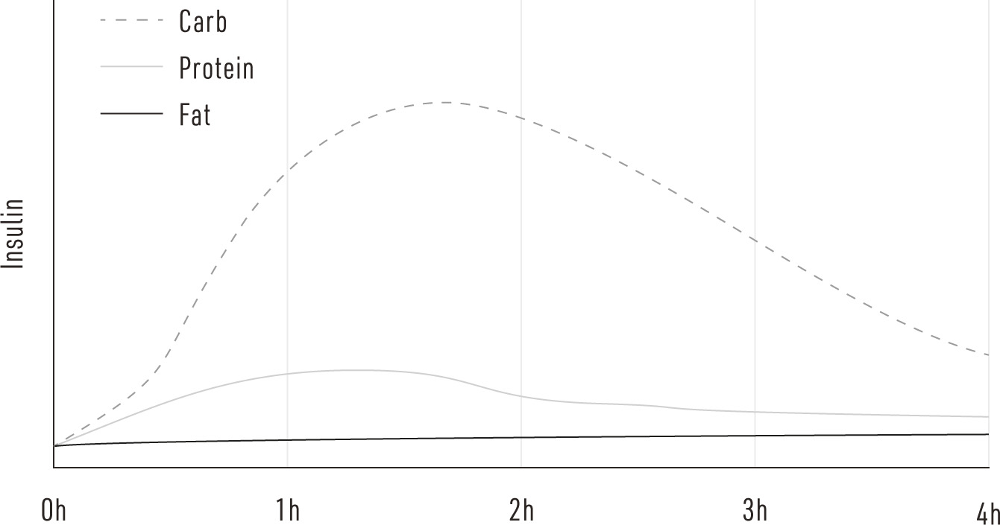
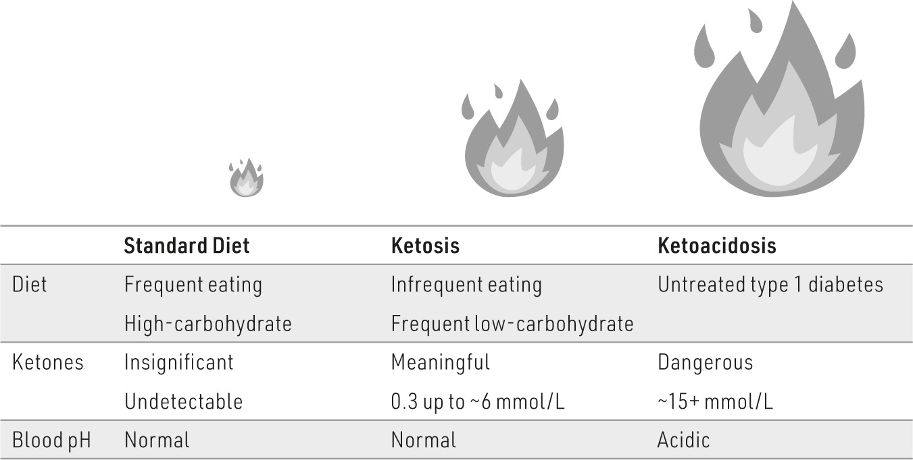

### W

#### CHAPTER 15

### Eat Smart: The Evidence on the Food

### We Eat

E HAVE NOW ARRIVED at what is the most powerful part of the solution in the fight against insulin resistance: the food we eat. The most powerful but also the most difficult to change. So much has been written about this in recent decades, so for me, exploring the benefits to insulin sensitivity as a consequence of altering the diet required a thoughtful and deliberate analysis of published research. The results of such an analysis led me to one unavoidable conclusion: when it comes to diet, we got it wrong.

The epidemics of obesity and insulin resistance are partly the product of bending science to fit politics. As documented thoroughly by Gary Taubes (*Good Calories, Bad Calories*) and Nina Teicholz (*The Big Fat Surprise*), in the 1950s and 1960s, a political consensus was created from the limited (and highly debated) data suggesting dietary fat, particularly saturated fat, correlated with heart disease. In remarkably little time, this correlation became considered causation, and a tentative theory become dietary dogma. Soon, we collectively learned to vilify dietary fat as the leading cause of heart disease, weight gain, and diabetes, though at the time the scientific community widely criticized this move.

At its simplest, the battle of thought between political agenda and scientific process centered around the relevance of calorie number versus calorie type in determining the ideal nutrition for good health. Supporters of

calorie number argue that it’s all a matter of mathematics: if you eat fewer calories than you expend, you’ll be lean and insulin sensitive; if you eat more calories than you expend, you’ll be fat and insulin resistant. On the other side, many argue that the type of calorie is more relevant than the number; a nutrient, once consumed, affects the body’s hormones, particularly insulin, and it’s this subsequent insulin effect that drives insulin resistance, fat gain, and eventually disease.

Depending on your school of thought, then, the solution to insulin resistance is either restricting calories, which almost invariably means a low-fat diet, or restricting certain types of carbohydrates, which aims to keep insulin low. Now, I mentioned earlier that the human body is somewhat more complicated than a simple furnace, and there’s more to diet than “calories in, calories out.” Let’s take a look at the research on these varied approaches.

#### Limiting Calories

The most common dietary intervention in our society to prevent weight gain or aid weight loss is calorie restriction, and this same tool is used in attempts to fix insulin resistance. However, whereas calorie restriction will cause weight loss, if only in the short term, its effects on insulin resistance are less conclusive.

These paradoxical findings may be explained by the type of weight that’s lost. One of the problems with calorie restriction is that you have no control over where on the body the weight loss occurs. We certainly want to lower body fat. But in this state of (hopefully) mild starvation known diplomatically as calorie restriction, the body is also reducing the amount of lean mass a person has, including muscle and bone.^1^ It’s easy to see the problem: the less lean mass a person has, especially muscle, the less insulin-sensitive tissue is available to help clear glucose from the blood and restore insulin levels to baseline. Yes—caloric restriction can cause insulin resistance.

**ANOREXIA AND INSULIN RESISTANCE**

Anorexia nervosa (AN) is a condition where a person seeks an

unhealthily low level of body fat through severe calorie restriction. In

the “excess fat = insulin resistance” paradigm, a person with AN

should be highly insulin sensitive. Unfortunately, that’s not the case.

Patients with AN are regularly found to be less glucose tolerant and

more insulin resistant than healthy lean individuals.^2^ In this scenario,

“fasting” has turned into “starvation.”

One remarkable study explored the metabolic consequences of strict and severe caloric restriction in obese individuals with no prior history or evidence of insulin resistance.^3^ The subjects self-restricted their intake to around 800 calories a day, which resulted in varying levels of weight loss; subjects lost between 8 and 35 kilograms, or about 17 and 77 pounds. (No, 800 calories a day is not much food!) In contrast to the link between body weight and insulin resistance, this state of weight loss caused over half of the study subjects to develop insulin resistance to the point of type 2 diabetes! In fact, with severe caloric restriction, the body can become demonstrably insulin resistant in just a few days.

Very-low-calorie diets elicit stress on the body, evident in the marked changes in hormone levels, with the most prominent change being a significant increase in the quintessential stress hormone cortisol.^4^ Remember, one of cortisol’s main hormonal actions (as part of our fight-orflight response with adrenaline) is to counter insulin and increase blood glucose. But cortisol’s antagonistic relationship with insulin extends beyond just trying to increase glucose; cortisol actually makes the muscles (and other tissue) insulin resistant. Furthermore, thyroid levels plummet, which, in addition to lowering metabolic rate, exacerbates the problem; thyroid hormone maintains normal insulin signaling. Thus, the drop in thyroid hormones further shifts the body to an insulin-resistant state.^5^

Despite these frightening findings with severe and prolonged caloric restriction, *mild* caloric restriction, including low-fat diets, can clearly improve insulin sensitivity.^6^ However, the results are sometimes not overly dramatic. As an example, in looking at the effects of 14 weeks of a low-fat,

plant-based diet in overweight middle-aged women, insulin sensitivity was no different from that of participants eating the control diet.^7^

**CARBS COME LAST**

If you have a dietary obsession with certain carbohydrates, such as

rice or pasta, and know you can’t live without them, the good news is

that you can use a simple trick to lessen the insulin impact: eat them

at the end of your meal. In a study comparing breaking up the parts

of a meal into the primary starch, protein, and vegetables, eating the

starchy part of the meal after the protein and vegetables had a

significantly smaller effect on blood glucose and insulin.^8^***Dietary Fiber***A low-fat, low-calorie diet is almost always going to be high in dietary fiber (that is, if it’s done right, by focusing on real foods rather than processed diet meals). Dietary fiber has a special place in the hallowed halls of the nutritional pantheon; it is almost universally embraced as being essential to a modern healthy diet. Despite the many reported benefits, the role of fiber in insulin sensitivity is open to interpretation; there’s a general indication that fiber improves it. Multiple epidemiological studies (that is, studies that get data from questionnaires) find a correlation between fiber consumption and improved insulin sensitivity.^9^ Results from clinical trials are mixed; interpreting the results requires some scrutiny in the context of insulin resistance. Because clinical trials, not questionnaires, help establish cause and effect, we’ll only focus on those.

Some studies have found that when study subjects eat a high-fiber meal, glucose and insulin levels are lower than those of subjects who eat a low-fiber meal—but again, these findings vary based on the subject population. For example, men with higher fasting insulin levels (i.e., insulin-resistant men) enjoyed a lower post-meal insulin spike when consuming a high-fiber meal versus a low-fiber meal, but there was no difference in insulin levels in the men with normal fasting insulin (i.e., insulin-sensitive men). When

explored over the long term, the results get even more confusing. While increasing dietary fiber over a period of several weeks was shown to improve insulin sensitivity in a group of nonobese people with diabetes,^10^ consuming more dietary fiber had no effect on insulin resistance in obese people with diabetes.^11^ Altogether, these studies suggest an insulin-sensitizing effect of fiber in insulin-resistant subjects, if not insulin-sensitive subjects, and provide evidence of a possible limit to the benefits.

An important weakness in these studies is the type of fiber used. Virtually every dietary fiber trial uses fiber supplements in the form of guar gum, which is not a fiber that comes with most carbohydrates. While guar gum is available in health food stores, it is not part of a normal diet, which suggests the results of a high-fiber diet in the form of higher guar gum intake should not be extrapolated to assume that other sources of fiber like vegetables and legumes will have the same results.^12^ Nevertheless, placing insulin-resistant individuals on a high-fiber diet (50 g/day) where the fiber is primarily from fruits, vegetables, legumes, and select grains, significantly improved insulin sensitivity after six weeks.^13^

An unfortunate aspect of almost every study exploring the role of dietary fiber in insulin resistance is that the study increases fiber at the expense of fat—the high-fiber study diets are low-fat diets. As we will see shortly, dietary fat elicits no effect on blood insulin, so the relative absence of fat in the high-fiber diets leaves unanswered the question of whether or not a diet high in fat *and *fiber is more effective than a diet high in fiber and low in fat. An alternative perspective is that dietary fiber is increasingly more essential as dietary carbohydrates, particularly processed, are increasingly part of the diet. Two published reports touch on this conflict, albeit without actually addressing insulin resistance, and focus on only the glucose response. One study gave participants three distinct types of bread —low fiber/low fat, high fiber/low fat, and high fiber/high fat.^14^ The low fiber/low fat bread resulted in a far greater blood glucose response than the other two and was the least satisfying (suggesting that perhaps the person would be inclined to eat more). Whereas the blood glucose response was similar between the two high-fiber breads—regardless of fat content—the high-fiber/high-fat bread was more* satisfying*. Unfortunately, the study did not assess insulin levels, which prevents any conclusions touching on insulin resistance directly. A second study fed subjects four types of pasta

meals—normal pasta, pasta with psyllium (fiber), pasta with fat (oil), and pasta with psyllium and fat.^15^ Psyllium alone did nothing to mitigate the insulin or glucose effects of the carbohydrate-rich pasta. While adding fat lowered them somewhat, adding both psyllium and fat lowered them the most and led to the greatest satiety.

In the end, it’s very likely that fiber improves insulin sensitivity in most people by simply replacing sugars and starches that elicit an insulin response. Importantly, one should scrutinize the source of fiber; it’s dumbfounding, but true, that most fiber supplements have sugar as one of the main ingredients.

Depending on the degree to which the fiber dissolves in water, dietary fiber can be defined as “soluble” (mixes well with water) or “insoluble” (does not mix well with water). Beyond their solubility, dietary fiber can be defined by its ability to benefit glucose and insulin control. Here, soluble fiber wins. Whereas insoluble fiber, derived mainly from grains and bran, provides bulk for stool, it’s the soluble fiber, generally from fruits and certain vegetables (including the psyllium husk in the pasta experiments I just mentioned), or specific supplements, that provides the best glucose and insulin benefits.^16^

#### Intermittent Fasting or Time-Restricted Feeding

The timing of meals is an important topic, as most people are eating more frequently now than ever before. In fact, just about 30 years ago, most adults and children had daily meals separated by almost five hours, whereas today this number is down to about three and a half hours, and this doesn’t include snacking between meals, something that generally didn’t occur in the 1980s.^17^

A common thread among many dietary plans is when and how often to eat. The advice varies; some approaches involve compressing periods of eating to two or three meals per day, with substantial gaps in between, while other strategies suggest eating normally for a few days, then avoiding food entirely for a day. On the other end of the spectrum, some diets encourage “grazing,” eating six to eight small meals per day—the antithesis of timerestricted eating.

As you now know, when we eat a meal (and especially certain foods, which we’ll get into later), our blood insulin rises to control glucose levels. Because elevated insulin is one of the most relevant factors in developing insulin resistance, it makes sense to follow a dietary plan that incorporates periods of time throughout the day when insulin is kept low. So right away, you’ve probably guessed that more frequent eating isn’t effective at controlling insulin.

When looking at the data on timing of eating, two factors become relevant—how the person eats day to day and month to month. On a larger time scale, patients who fast (for 24 hours) roughly once monthly are about half as likely to be insulin resistant compared with those who don’t.^18^ At the shorter end, within each day, eating fewer, larger meals elicits a greater improvement than eating several smaller meals throughout the day.^19^ Very likely, the insulin benefit in eating fewer meals in the day is simply a consequence of having longer periods of time when glucose and insulin are normal in between meals. If you have more frequent meals, insulin levels would increase every couple of hours, regardless of how much you eat. If three large meals per day is better than six small ones, are fewer meals than three best of all? Possibly.

Fasting involves eating normally for some period of time, with strategic periods of food avoidance; no need to count calories. There is evidence to show fasting is effective at improving insulin sensitivity, though it partly depends on how it’s done. Two studies looked at intermittent fasting by having study subjects eat normally one day and essentially fast the entire next day, repeated seven times over a two-week period. The two studies found conflicting results: one reported an improvement in insulin sensitivity,^20^ while the other observed no benefit.^21^ By contrast, a recent study on the use of intermittent fasting in insulin-treated people with type 2 diabetes found that frequent (a few times weekly) 24-hour fasts were so effective at improving insulin sensitivity that participants were able to cease insulin use—it was “deprescribed.”^22^ In fact, for one person, it happened in only five days! The alternative strategy is to confine eating to a specific window of time each day, so you’d end up eating breakfast and lunch only^23^ or lunch and dinner only.^24^ In these time-restricted eating studies, participants saw robust improvements in insulin sensitivity.

It may sound strange, but many of the benefits of fasting are caused by changes in hormones. Of course, insulin drops quickly with a fast, but insulin’s “opposite,” glucagon, rises. It’s important to understand glucagon to truly appreciate the power of a fast. Where insulin tries to save energy in the body, glucagon wants to spend it—they are two sides of the same metabolic coin. Glucagon wants the body to release its stored energy by pushing the fat cells to share their fat and the liver to share its glucose. Because insulin and glucagon work against each other to activate and inhibit metabolic processes (see the diagram below), the balance of these two hormones dictates which processes actually occur. Thus, looking at fasting, and even eating, through the lens of the insulin:glucagon ratio is very helpful.

**WHAT MAKES US HUNGRY?**

We consider hunger to be a function of whether something is in our

stomach. This idea is the driving force behind eating “bulk,” like

fiber—something to fill you up yet not add to the total calories we

consume. However, feeling hunger is more complicated than empty

space in our gut. Hunger is partly driven by energy (in calories)

provided to our cells—if the cells of our body sense insufficient

energy, that can activate a hunger sensation in the brain, which we

feel in our stomach. If this weren’t the case, every person that

received an IV for nourishment would feel like they’re starving. This

doesn’t happen. In exploring whether energy or dietary bulk is more relevant for

hunger, one group of researchers found that if an IV infusion only

contained glucose, a person would feel hunger. However, if the

infusion also contained some fat, hunger disappeared.^25^ In other

words, even though the stomachs of both groups were empty, if their

cells sensed adequate energy, particularly in the form of fat, the body

didn’t feel the need to eat, and the person felt content.^26^ Energy from

a meal conveys greater satiety than bulk—if your cells are fed, they

don’t care if there’s something taking up room in your stomach.

A remarkable example of just how far this can go is the case report of a morbidly obese Scottish man. This fellow began experimenting with fasting and experienced such a rapid health benefit that he simply kept going. Eventually, he did so under medical supervision, ensuring proper hydration and mineral consumption, and ultimately fasted for 382 days!^27^

Obviously, fasting is a powerful tool, and as with any “power tools,” you need to use it wisely and deliberately. A critical distinction must be made between fasting and starvation. There is no definite time past which fasting becomes harmful, but it can have unintended consequences if taken too far; so much depends on the constitution of the person fasting, how they define “fasting” (what are they drinking, how are they supplementing, etc.), and how they’re ensuring essential mineral intake. Also, how a person ends a fast matters greatly. Early studies into prolonged, *multiday* fasting found a potentially lethal consequence called “refeeding syndrome” can develop after fasting ends.^28^ Refeeding syndrome happens when blood levels of electrolytes and minerals, such as phosphorous and potassium, become too low. Interestingly, this dangerous shift is caused by insulin suddenly going up too high, too quickly. Thus, just as a body has shifted away from using

glucose during a fast, eating too much processed carbohydrate, which will spike glucose and insulin, is the wrong way to end a fast. The calories we eat, when we do eat, have a powerful effect on insulin control, something we’ll discuss now.***Circadian Rhythm and the Dawn Phenomenon***Our body has an inherent rhythm and timing to numerous functions that extend well beyond waking and sleeping. Powerful hormones, such as cortisol and growth hormone, ebb and flow throughout the day and night. Insulin naturally follows this rhythm as well; even when we haven’t eaten, insulin levels start to climb around 5:30 AM and begin falling within roughly two hours.^29^ These rising insulin levels indicate a mild insulin-resistant state, and importantly, this isn’t something that only happens when we’re sleep deprived—it happens every day, even when we get a full night’s sleep. This early morning insulin resistance is known as the “dawn phenomenon” or “dawn effect.”

A controlled trial measured the varying insulin levels of people drinking the same amount of glucose during three times of day (morning, afternoon, and evening) and found the insulin response highest in the morning and lowest in the evening.^30^ The reason why the body needed more insulin in the morning is a result of hormones that counter insulin’s actions. I’ve mentioned how one of insulin’s main effects is to reduce blood glucose by driving it into tissues like our muscles and fat. By contrast, hormones that climb toward the end of our sleep cycle, such as catecholamines, growth hormone, and especially cortisol, act to increase blood glucose. All this forces insulin to work harder to do its job—in other words, creating insulin resistance.

Translated into real food, this means that we need more insulin to control blood glucose when we eat a piece of toast in the morning than we would if we ate that same piece of toast in the evening.^31^ With this perspective in mind, what we eat when we wake up may matter more than what we eat any other time of day. No meal has gotten as much attention as breakfast, but usually we hear it isn’t to be missed. Considering the insulin resistance we experience every morning, one might be tempted to skip breakfast entirely to fight insulin resistance. What does the research say?

One study randomly assigned 52 obese women who were normally either breakfast eaters or skippers to either eat or skip breakfast for three months.^32^ Importantly, both new dietary interventions were lower calorie and *identical* in total calorie number (i.e., even though the breakfast skippers only ate twice daily, they ate the same number of calories as the breakfast eaters). Not surprisingly, everyone lost some weight, but those who ate breakfast during the study lost a bit more. However, a similar study tracked the differences in almost 300 overweight and obese men and women for four months, and those researchers found no difference in weight loss between breakfast skippers and eaters.^33^ As you can tell, these similar studies raise more questions than they answer; they don’t tell us whether breakfast is good or bad for body fat. To me, the resolution is clear —it all depends on what you’re eating for breakfast.

I doubt there’s another meal of the day so firmly built on eating some of the worst possible foods. For much of the world, breakfast is often largely a meal of sugar and starch—think juice, cereal, bagels, rice, or toast. As we’ll see in the next few pages, if this is your average breakfast, you may as well just skip eating and inject yourself with insulin.

**THE CLOCK IN OUR FAT**

Interestingly, when it comes to insulin sensitivity, our fat tissue

marches to the beat of its own drum. Unlike the body as a whole,

which is slightly more insulin resistant in the morning, our fat tissue

is *more insulin sensitive* in the morning and least sensitive in the

evening.^34^ Because insulin inhibits fat burning^35^ and promotes fat

cell growth,^36^ eating an insulin-spiking meal in the morning could

add more fat to our frames compared with eating it in the evening.

#### Carbohydrate Restriction

Once we appreciate that too much insulin is a main driver of insulin resistance, the chain of events suggesting a solution is too obvious: eating

fewer carbohydrates = reduced blood glucose = reduced blood insulin = improved insulin sensitivity.^37^ With a lowering of insulin comes a sort of resetting (re-sensitizing) of the “insulinostat.”

To really appreciate the relevance of the food we eat, we need to establish the effect of each macronutrient on blood insulin. As you can see from the insulinostat chart, dietary protein elicits a mild insulin effect (about two times fasting levels, although this depends on blood glucose levels). Carbohydrate, on the other hand, can elicit a remarkable increase in insulin: more than 10 times above normal, with the height and length of the spike highly variable depending on the carbohydrate and a person’s insulin sensitivity. Dietary fat elicits no insulin effect at all.^38^ Thus, a diet that limits the insulin spiker (carbohydrates, especially refined) and increases the insulin dampeners (protein and fat, especially unrefined) is one that should improve insulin sensitivity. And—as we will see—it does. Adapted from Nutall, F.Q. and M.C. Gannon, *Plasma glucose and insulin response to* *macronutrients in nondiabetic and NIDDM subjects.* Diabetes Care, 1991. 14(9): p. 824-

38.

There are several relevant topics to discuss with regard to a carbohydrate-restricted diet, including the effects on insulin resistance, an overview of ketones, body weight control, and more.

**HOW MUCH DOES PROTEIN REALLY INCREASE**

**INSULIN? IT DEPENDS …**

The overwhelming consensus with dietary protein is that it causes a

significant spike in insulin. However, this is highly dependent on the

need for gluconeogenesis (GNG). GNG is the process whereby the

liver naturally makes glucose for the body when there isn’t enough

coming from the diet. Due to GNG, eating carbohydrates is

unnecessary,^39^ though they can still certainly be a pleasant part of the

diet. When a person who eats a normal high-carbohydrate diet

ingests protein, they experience a robust rise in insulin. However, in

a person who eats relatively fewer carbs, they have little or no insulin

response to protein.^40^ The main reason for these different insulin

responses is likely based on whether or not GNG is needed. When

we eat less glucose, GNG picks up the slack, keeping our blood

glucose perfectly normal. Because insulin inhibits GNG so strongly,

an insulin spike with eating protein in the context of a low

carbohydrate diet would be dangerous—we would deprive the body

of its natural and inherent glucose source.***Carbohydrate Intake and Insulin Resistance***Restricting carbohydrates was perhaps the first modern documented intervention to control diabetes and weight, accepted as fact throughout Western Europe in the early and mid-1800s. Why such a paradigm fell out of favor, to be replaced with the current recommendations that those with insulin resistance and type 2 diabetes should avoid fat and eat starches, is puzzling, but the shift in guidelines was dramatic. Within decades (from the early to the mid-1900s), guidelines for diabetes went from encouraging strict avoidance of bread, cereals, sugar, and so forth, while allowing all meats, eggs, cheese, and the like (per *The Practice of Endocrinology* in 1951), to just the opposite—encouraging breads and cereals while discouraging meats, eggs, et cetera (per the American Heart Association and, until recently, the American Diabetes Association). And we responded

—we eat relatively less fat now than we ate 50 years ago.^41^ This change was supposed to make us healthier, but the explosion of insulin resistance during this time is evidence that our modern dietary shift away from fat in favor of carbohydrates has not yielded the intended results.

Clinical research since the 1990s has provided compelling evidence that carbohydrate restriction prevents or improves insulin resistance. Indeed, when comparing studies that actually change a subject’s diet (intervention or clinically based studies) rather than simply asking questions about a subject’s diet (questionnaire-based studies), the consensus is overwhelmingly supportive of carbohydrate restriction. Intervention-based studies are far superior because they’re able to *definitively* answer questions like, “Which diet is best for improving insulin resistance?” One study that asked this question brought in hundreds of overweight middle-aged men and women. For two years, study subjects were assigned one of three diets: a calorie-restricted, low-fat diet; a calorie-restricted, moderate-fat diet, and a non–calorie-restricted low-carb diet. In addition to causing the greatest weight loss, the unrestricted low-carb diet also helped lower insulin and improve insulin resistance the most.^42^

A different study employed a similar strategy for three months. Overweight men and women were split into either a low-carbohydrate or low-fat diet group; neither group limited calorie intake. While insulin levels dropped by roughly 15% in the low-fat diet group, subjects in the low-carbohydrate diet group saw insulin levels drop by 50%.^43^ Moreover, another indicator of insulin resistance (the “HOMA score,” discussed more in chapter seventeen) dropped over three times more with the low-carbohydrate diet compared with the low-fat diet.

Yet another study followed its subjects for almost four years while they stuck to a carbohydrate-restricted diet.^44^ The thrust of the study was to compare metabolic improvements, including insulin sensitivity, with two interventions—diets containing either 50% or 20% carbohydrate. Not only was the lower carbohydrate diet “significantly superior” at improving health, it ultimately led to almost half of the patients getting off insulin (and almost entirely off any other medications), and the rest substantially reduced daily insulin requirements. A final study worth mentioning is one that put insulin-resistant subjects on a relatively normal diet (~60% carbohydrate) or moderately restricted with carbohydrates (~30%) for three

weeks, then switched over to the other diet for another three weeks. Once again, insulin sensitivity increased more with the lower-carbohydrate diet.^45^

I could go on. There are many, many more studies that indicate similar results. Multiple meta-analyses (or statistical analyses that pool the findings from numerous studies), encompassing thousands of patients, unanimously reveal that a carbohydrate-restricted, calorie-unrestricted diet lowers insulin at least as much, and often more, than low-fat, calorie-restricted diets.^46^ Indeed, the sum of evidence is so convincing that the American Diabetes Association updated its “Standards of Medical Care in Diabetes” to include the use of low-carbohydrate diets for controlling type 2 diabetes.^47^

Before we move on, it’s important to acknowledge that the collective evidence supporting carbohydrate restriction should be viewed in the context of insulin and, thus, should not be considered a call to avoid all carbohydrates. Not all carbohydrates are created equal. Whether they are considered “good” should depend on the degree to which the food increases insulin.***Carbohydrate Quality Versus Quantity***I encourage you to think of carbohydrates as being on a spectrum with regard to their effects on glucose and insulin. It doesn’t always matter how many grams of carbohydrate you’re eating if the foods you choose have “good” carbs. A useful tool in deciding whether a carbohydrate is “good” or “bad” is by determining its glycemic load, or GL—a number that estimates how much a particular carbohydrate food will raise your blood glucose after you eat it. And, as you know by now, an increase in blood glucose will in turn spike your blood insulin.

It’s easy to confuse the GL with the glycemic index (GI). The GI is simply a measure of how *quickly *the carbohydrate is broken down into glucose in the blood. GL, on the other hand, actually determines how* much* carbohydrate is in the food that can become glucose in the blood. Let’s take a watermelon, for example. With a GI of 72, watermelon is considered “high GI,” but its GL is remarkably low at 2—this means that even though the carbohydrate in the watermelon can rapidly become glucose in the blood (per GI), the actual amount of carbohydrate is low enough to not really matter (per GL). To be clear: The problem with the GI is that it doesn’t account for how much potential glucose is in the food you’re eating.

GL does. Thus, it’s possible to consume a diet that has a higher amount of carbohydrates and still potentially prevent or improve insulin resistance if the carbohydrate is low GL. Of course, as a reminder, the underlying utility in understanding the glycemic load is to get an idea of what the food is doing to insulin.

A GL of 20 and above is usually considered “high,” 11 to 19 is “moderate,” and 10 or below is “low.” This convention is fine; just remember, the lower the better. It can be difficult to calculate GL on your own, but there are several online and smartphone app resources that you can use to determine the GL of the foods you’re eating.^48^ High-GL foods include sugary drinks and candy, white pasta and bread, and French fries and baked potatoes. Whole wheat pasta, brown rice, sweet potatoes, and fruit juices without added sugar generally fall in the moderate range. Some low GL foods are kidney, garbanzo, and black beans; lentils; certain wholegrain breads; and cashews and peanuts.

Fiber-rich vegetables and fruits are good examples of low-GL carbohydrates; a diet high in fiber improves insulin sensitivity.^49^ Importantly, for people with insulin resistance, keeping the GL low is significantly more effective at improving health compared with a simple low-fat diet.^50^

Focusing on the GL of foods becomes particularly valuable if your diet is based mostly on plants and plant products (so read closely, vegetarians and vegans). In general, most plant foods are lower in protein and fat and contain mostly carbohydrate (obvious exceptions are “fatty fruits” such as avocado, olives, and coconut). Nevertheless, some plant foods are great sources of dietary fiber that can help control their glycemic effect.

Many of us have heard that plant-based diets are inherently healthier and more effective at preventing disease, though this isn’t without debate. Regardless, a plant-based diet isn’t necessarily better when it comes to insulin resistance. The simplicity of eating “low-carb” discourages a person from eating any insulin-spiking packaged snacks and treats, such as potato chips. However, such foods could very easily be acceptable on a vegetarian/vegan diet, insofar as they may not contain any animal products.

Again, the GL provides a general and helpful guide (more on this later), though it has its own considerations. What complicates matters is that not everyone responds the same way to carbohydrate foods; GL is an estimated value, but your individual glycemic response may vary.

***Glucose Intolerance***We readily embrace the idea that certain people respond poorly to certain foods. We all know people who shun dairy (lactose intolerance) or avoid wheat (gluten intolerance) because of how they feel afterward or what it does to their bodies and health. Is it inconceivable, then, that some of us may respond negatively to dietary glucose?

The idea that some of us have less tolerance to glucose is revealed with a quite simple experiment: people drink a glucose solution and we measure what it does to blood glucose and insulin. Across this group of people, even though fasting glucose levels will be similar, the degree to which the consumed glucose will impact blood glucose can differ widely, including blood glucose levels that rise more than double those seen in others. Importantly, these same people can have equally elevated insulin levels. This is glucose intolerance—where some bodies have to just work harder to move the glucose out of the blood and into the body’s cells.

You’re likely already suspicious of insulin as a key factor in determining why some people have a stronger response to glucose than others, and you’re right. In fact, we know that if the fat cells have become insulin resistant (usually the first cells to “fall,” as described earlier in chapter eleven), glucose intolerance will soon follow.^51^

If a person is glucose intolerant, you’d expect them to have a better response to a diet that lowers the dietary glucose—and evidence supports this. In 2007 results were published for a study that sought to rigorously compare the metabolic improvements accompanying four prominent diets —the Atkins diet (~30% carbohydrate), Ornish diet (~60%), LEARN diet (~50%), and Zone diet (~40%). Due to the mix of diets included, the study became known as the “A to Z study.” A 2013 follow-up study by these same researchers explored the degree to which insulin sensitivity impacted the response to the diets with the least (Atkins) and most (Ornish) carbohydrates. Interestingly, all subjects lost weight on the lowestcarbohydrate diet, regardless of insulin sensitivity. However, only insulin-sensitive subjects (i.e., those that are the most glucose tolerant), but not insulin-resistant subjects (i.e., those that are the least glucose tolerant), lost weight on the highest-carbohydrate diet.^52^

**A GUT FEELING**

Differences in gut bacteria could explain how some people are able

to readily use carbohydrates and others aren’t. That’s right—the

billions and billions of bacteria in your intestines that help you digest

food may be the strongest distinguishing factor that determines how

intensely your glucose and insulin respond to a carbohydrate-rich

meal. Scientists at the Weizmann Institute found that a person’s gut

bacteria determined the glycemic load of a food, and that some

people had a fairly minor response to things like ice cream, while

others had dramatic glycemic responses to common foods like wheat

bread.^53^***Saturated and Polyunsaturated Fats***Low-carbohydrate diets are often (not always!) high in animal fat and protein. Many people who avoid animal fat do so out of fear of saturated fat. “The saturated fat will clog your cells and block insulin from working!” is the common cry. There are a few scientific problems with this sentiment.

First, animal fat is never exclusively saturated—it’s a broad mix of saturated, monounsaturated, and polyunsaturated. Second, the muscle of insulin-sensitive athletes is just as “fat filled” as the muscle from obese, insulin-resistant people.^54^

However, fat does matter—just not the kind you think. The most likely fat that matters is a type called ceramide,^55^ and it’s not one you worry about in your diet; it’s one you make in your cells. As discussed previously (see page 114), ceramide production is activated by inflammation; once turned on, the cell will turn an innocent saturated fat into ceramide, and the ceramide then makes the cell less sensitive to insulin. Critically, ceramide levels are not increased in the tissues of people who adopt a carbohydraterestricted, fat-liberal diet.^56^ Equally important, saturated fat in the blood is NOT increased in people adhering to a high-fat diet. In one study, the low-carbohydrate group, despite eating three times more saturated fat than the low-fat group, not only had a much greater drop in fasting insulin but also a two to three times greater reduction in saturated fats in the blood!^57^ In fact,

adding saturated fat to a meal (like lard) actually reduces blood fats to lower levels compared with adding unsaturated fats (like olive oil).^58^

One of the dangers with avoiding saturated fat is what we replace it with. Our collective fear of saturated fat has led to an embrace of polyunsaturated fats, derived industrially from seeds. Interestingly, replacing saturated fat (e.g., lard, butter, tallow, etc.) with polyunsaturated fat (e.g., soybean oil, corn oil, rapeseed oil, safflower oil, etc.) may actually do more harm.^59^ However, these findings don’t apply to all seeds—the polyunsaturated fat (alpha-linolenic acid) from flax seed improves insulin resistance.^60^

The other mechanisms that create insulin resistance, such as oxidative stress and inflammation, are also improved with a diet that is lower in carbohydrates.^61^ Thus, carbohydrate restriction addresses several, and the most impactful, of the distinct causes of insulin resistance. However, avoiding insulin-spiking carbohydrates has other effects that help improve insulin sensitivity as well.***Oxidative Stress and Inflammation***I covered how oxidative stress and inflammation can cause insulin resistance in chapter twelve. Here, I want to briefly highlight that while oxidative stress and inflammation are distinct causes of insulin resistance, they’re also influenced by the same dietary changes that effectively lower insulin directly—namely, a lower-carbohydrate, high-fat diet. Some of the protective effect against oxidative stress and inflammation could be a result of simply avoiding countless chemicals in seemingly innocent foods; much of the benefit could be from interesting molecules in the blood called “ketones” (described further in a moment). Ample studies have found that ketones elicit potent antioxidant^62^ and anti-inflammatory^63^ effects.

Having established the efficacy of a carbohydrate-controlled diet in improving insulin resistance, we’ve really only seen the peak of the mountain of evidence in support of the health benefits of such a diet. Largely because insulin resistance is so prevalent in how multiple chronic diseases develop, countless studies over the past decades have explored the role of low-carbohydrate diets in treating a host of diseases.

#### Ketogenic Diets

A very low-carb diet is occasionally termed “ketogenic” because of its effects on nutrient metabolism in the body. Specifically, these diets increase ketogenesis—the state when the liver is creating ketones, a nutrient that can be used for energy, from molecules that are produced when the liver breaks down fats (a state called ketosis, as elaborated in the next section). Everyone has ketones; we make them any time insulin is low (or altogether absent, as with type 1 diabetes). With low insulin, the body shifts its energy source to rely heavily on burning fat instead of glucose. This can happen after a period of fasting (e.g., 18–24 hours) or carbohydrate restriction. As fat burning continues, the liver turns some of the fat into ketones, which are essentially a backup fuel for various parts of the body, especially the brain.

Ketones were once considered “metabolic garbage” because scientists were unaware of any role for them. Oh, how the times have changed! Not only are ketones recognized as a viable fuel source for almost every cell, including the brain and muscles, but they’re also important signaling molecules that have multiple beneficial effects. Some of the known benefits of ketones include increasing the number of mitochondria in the cell (where fats are broken down),^64^ reducing oxidative stress, and controlling inflammation.^65^ In the case of some animals, including worms and mice, ketones even extend lifespan, though there is not yet evidence of this in humans.^66^ Research from my own lab finds that ketones promote healthy beta-cell and muscle-cell mitochondrial function.^67^

Ketones introduce an interesting option for energy (calorie) accounting in the body. A state of ketosis allows energy to be simply *wasted *from the body, rather than being stored or used. While ketones can be and are used by the body for energy, they are also* removed* from the body through urine and breathing. This is unique to ketones; these “little pieces of energy” allow all the calories to be accounted for while providing a novel “bypass.” We are literally passing energetic molecules (i.e., nutrients) from the body in the form of ketones. Each ketone molecule counts for roughly four calories.^68^

Critically, insulin is a powerful inhibitor of ketogenesis—if insulin is high, ketogenesis stops; if insulin is low, ketogenesis occurs. Thus, any diet that keeps insulin consistently low is accurately considered ketogenic.

I consider it necessary to distinguish high-fat diets and ketogenic diets. A high-fat diet, depending on the study, could be one that simply increases fat content without any intervention to lower carbohydrate consumption. Thus, the person on such a vague diet could very well have the same insulin-spiking effect of the typical amount of carbohydrates combined with extra calories from the extra fat. This is decidedly unhealthy. In contrast, a ketogenic diet has replaced carbohydrates with dietary fat. Because dietary fat has practically no effect on insulin, the switch results in a diet that keeps insulin low and, thus, ketones higher than normal.***Ketosis Versus Ketoacidosis***The average diet provides the typical American with blood ketone levels below most conventional methods of detection. This level increases by roughly 10 times when a person adopts a low-carbohydrate diet (blood ketones get to around 1–2 mmol/L). This state, when ketones are increased above “normal” without any effect on blood pH, is referred to as ketosis. But ketones can affect pH if they get too high—when they reach 10 times higher than that found with ketosis (to around 10–20 mmol/L), the blood becomes acidic.

This second 10-fold change is the cutoff between ketosis and ketoacidosis. Most people have negative ideas about ketosis and ketogenic diets because of what they’ve learned regarding ketones and type 1 diabetes. A person with type 1 diabetes who underdoses insulin will assuredly develop ketoacidosis, which can be life threatening (and not just because of the very high ketones). However, a person with a functioning pancreas will have sufficient insulin production to prevent ketoacidosis, even when fasting.

***Ketone Supplementation***The increasing appreciation for ketones has resulted in the birth of ketone supplements. Because they are so new, understanding the effect of exogenous ketones on insulin control is still in its infancy. However, early evidence is positive. Testing a group of healthy men and women, scientists gave subjects a drink containing ketones, followed soon after by an oral glucose tolerance test (i.e., giving the person a syrupy drink).^69^ By measuring blood glucose and insulin levels, the research group found that when fed a ketone drink, the study subjects were able to clear the glucose from the blood more rapidly. Interestingly, and suggestive of the insulin-sensitizing effect of ketones, this occurred without a further elevation in insulin. Participants’ levels were similar across the groups; insulin simply worked better.

If you’re interested in ketone supplements, just keep in mind that, despite their benefits, drinking ketones is unlikely to help with insulin resistance. In the end, it’s the insulin that we care about. Ketones, in the context of insulin resistance, are mostly useful because they’re an inverse *indicator* of our insulin levels—they simply tell us how we’re doing keeping our insulin in check. For the sake of improving insulin resistance, and all that comes with it, we don’t seek high ketones as much as we seek low insulin.

Few people view the food they eat through the lens of insulin resistance; “What will this do to my insulin?” isn’t often the question. Overwhelmingly, people ask themselves, “What will this do to my weight?” There is no doubt that the food we eat matters—both how much and what kind. As important as calorie number may be, calorie type is equally important, because it’s the type of calorie, whether from fats, proteins, or carbohydrates, that through hormones tells the body what to do with the calories.

#### Weight Control

At least some of the metabolic benefit of controlling insulin is a result of demonstrable changes in metabolic rate. This is not a recent discovery; two of the greatest scientists in the last century were the first to bring light to insulin’s ability to dampen metabolic rate. Elliot P. Joslin and Francis G. Benedict, each now famous for their work in endocrinology and metabolism, respectively, noted in 1912 that metabolic rate in untreated insulin-deficient diabetes was roughly 15% higher compared with similarbody-weight subjects with normal insulin.^70^ The same thing can be seen in people with type 2 diabetes treated with insulin: it slows their metabolic rate.^71^

To understand how insulin affects metabolic rate, let’s look again at brown fat, or BAT. In the last chapter, we highlighted how BAT helps us burn fat. The metabolic benefits of carbohydrate restriction are not limited to controlling insulin. While insulin inhibits brown fat, ketones activate brown fat.^72^ Because of this combination, it’s little surprise that an insulin-controlling carbohydrate-restricted diet provides more metabolic “wiggle room” regarding caloric balance than the traditional diet. This could be why people adhering to a *calorie-unrestricted *low-carbohydrate diet can lose more fat than people following the classic* calorie-restricted* low-fat diet,^73^ even if potentially eating significantly more calories.^74^

The best example of this is a study that rotated obese and overweight subjects through four diets that differed in composition of fat and carbohydrates but were identical in calories. Metabolic rate (measured by resting energy expenditure) was the lowest during the lowest-fat diet and

increased steadily through the four diets as fat content increased and carbohydrate content decreased. In the end, the metabolic rate of subjects when on the low-carbohydrate, high-fat regimen was roughly 80 calories per day higher than when these same subjects adhered to a low-fat, high-carb diet.^75^ More recently, well-controlled studies conducted at both the National Institutes of Health and Harvard University have found the same: when in ketosis, metabolic rate is increased by roughly 100 to 300 calories per day.^76^ In the Harvard study, participants were divided into three groups: high carbohydrate (60% carbs, 20% fat), moderate carbohydrate (40% carbs, 40% fat), and low carbohydrate (20% carbs, 60% fat). Additionally, this study used a highly sophisticated technique to measure metabolic rate. Let me elaborate: traditionally, when researchers measure metabolic rate, we either make the person lie down under a space-helmet-like device (indirect calorimetry) or they spend time in a claustrophobia-inducing small room (direct calorimetry); both have obvious problems, since in real life people don’t limit their movement like that. The Harvard study, led by Dr. David Ludwig, used a technique called “doubly labeled water,” a relatively new and very clever method of determining metabolic rate that allows the subjects to live life as usual by drinking a unique type of “marked” water; researchers measure the rate at which the body uses the water (which is driven by metabolic rate). Metabolic rate changed inversely with carbohydrate consumption; the group eating the highest carbohydrates had the lowest metabolic rate, while the group eating the lowest carbohydrates had the highest metabolic rate. In fact, the group that started with highest fasting insulin levels experienced the greatest increase in metabolic rate with the lowest carbohydrate consumption (this group also had the greatest drop in blood triglycerides and greatest rise in HDL cholesterol).

**OTHER BENEFITS OF CONTROLLING CARBOHYDRATES**

Earlier, we explored the numerous diseases and disorders that are

connected to insulin resistance. If insulin resistance causes these

conditions, and controlling insulin is such an effective strategy to

address insulin resistance, then an insulin-lowering, carbohydrate-

restricted diet should dramatically improve many of those insulin-

resistance-connected disorders, right? Researchers have explored this

question. Let’s take a quick look.

**Heart Disease**

**Blood Cholesterol:**Remember that LDL pattern A (larger, more

buoyant particles) is less problematic/pathogenic than LDL B

(smaller, denser particles). Paradoxically, eating more fat prompts

LDL cholesterol to be “more pattern A.” One study placed 20 men

on either a traditional high-carbohydrate diet or a low-carbohydrate

diet for six weeks.^77^ Not only did insulin come down significantly,

but on average the subjects on the carbohydrate-restricted diet

experienced an increase in LDL size. Importantly, even those who

were considered pattern B subjects became demonstrably more

pattern A due to the increased LDL particle size. A second study

conducted an almost identical dietary intervention but followed over

100 subjects for six months^78^; those researchers found similar

results. So, if eating fat and cholesterol, staples in a low-carbohydrate

diet, doesn’t make LDL more dense, what does? Though rarely

explicitly stated, a theme throughout these studies is that eating a diet

that keeps insulin low elicits favorable changes in blood lipids;

insulin drives an alteration in LDL particles toward small and dense

(pattern B). Indeed, the most insulin-resistant individuals have, on

average, more than double the amount of small, dense LDL when

compared with insulin-sensitive people of similar age and body

weight.^79^ In summary, a high-fat diet presents a neat paradox—

eating more fat has favorable changes in blood lipids.

**Blood Pressure:**Some traditionalists contend that a high-fat diet

promotes higher blood pressure, but the evidence indicates the

opposite. In one study, subjects were divided into four diet groups

that varied in fat versus carbohydrate intake. In addition to having

the greatest drop in triglycerides and the greatest increase in HDL

(“good”) cholesterol, the high-fat diet group had the largest drop in

blood pressure of all the groups—four times greater than the low-fat

diet group.^80^

**Reproductive Health**

**PCOS:**In a study exploring the role of diet and PCOS, five women

with PCOS (who were only mildly overweight) were placed on a

low-carbohydrate diet for just 24 weeks.^81^ Importantly, the women’s

amount of free testosterone dropped by almost 25%, which is likely a

result of insulin dropping by half (remember that insulin stimulates

testosterone production from the ovaries). All the women noted

improvements in every self-reported category, including emotional

well-being, unwanted body hair, body weight, infertility, and

menstruation. Undoubtedly to their great delight, two of the five

women, despite repeatedly failed fertility treatments, became

pregnant during the course of the study.

**Low Testosterone:**Men require higher levels of testosterone than

women for normal reproductive health. Unfortunately, the staple

weight-loss diet we’ve been following for decades has been hurting

that health; putting men on a low-fat diet significantly reduces

testosterone.^82^ According to the authors of the study, the solution is

simple: let men eat more fat.

**Neurological Health**

**Alzheimer’s Disease:**As we saw in chapter four, several studies in

rats have found that a high-sugar diet impairs brain function.^83^

Additionally, a study in elderly humans found that those people with

the greatest preference for carbohydrates not only ate more

carbohydrates, but were the most likely to have the worst

neurological symptoms, including the greatest degree of cognitive

dysfunction, memory impairment, motor problems, and

disengagement.^84^ Humans with Alzheimer’s disease or mild cognitive impairment

who follow a low-carbohydrate, high-fat diet show improved

cognitive function.^85^ Interestingly, however, the brain doesn’t

actually use the fat. When we eat fat as our primary macronutrient,

the liver metabolizes more fat than it needs, and the extra fat

becomes ketones. In the study just mentioned, the people with the

largest increase in ketones had the greatest improvement. Another study explored this similar dietary effect in 10 subjects,

all with varying levels of Alzheimer’s-related cognitive decline. (In

fact, several had either quit their jobs or were suffering

professionally due to the disease.) They ate a low-carb, high-fat diet,

fasted 12 hours each night (to increase ketogenesis), and took

coconut oil (which is more ketogenic than other fats). All improved

their cognitive function and were able to return to work or improve

their performance there. The benefits persisted even at a follow-up

almost three years later.^86^ In fact, the brain begins shifting to ketone use as ketones become

available; this might be evidence that the brain prefers ketones to

glucose for fuel. One reason could be that, to a degree, ketone uptake

by the brain isn’t dependent on insulin, unlike glucose. Thus, if a

person is insulin resistant, it’s at least possible that their brain has

become insulin resistant and takes in less glucose.^87^

**Parkinson’s Disease:**Very few human studies have been conducted

on the benefits of a high-fat, low-carbohydrate diet in people with

Parkinson’s disease. A small study had individuals adopt a ketogenic

diet for one month, after which every subject reported “moderate” to

“very good” improvements in disease symptoms.^88^ A study

involving a rat model of Parkinson’s disease found that ketones were

highly protective of the necessary neurons (e.g., dopamine-producing

neurons) because they increased protection against oxidative stress.^89^

**Migraine Headaches:**The limited evidence that supports the role of

ketogenic diets in migraine therapy is almost an afterthought in

research. However, it’s not new—remarkably, there are published

reports from 1928^90^ and another, larger report from 1930^91^ of

improvements in migraine headaches with carb-restricted, high-fat

diets. For example, one study reports that two sisters adopted a

carbohydrate-restricted, high-fat diet in an effort to lose weight.^92^

Both had reported often suffering from severe migraines. While the

sisters adhered to the diet, the migraines resolved; they returned

when the sisters stopped. Another revealed that people with insulin

resistance who experience migraine headaches (and remember—you

may not know you’re insulin resistant) could experience a 75%

improvement in migraine frequency and severity simply by

restricting dietary sugar.^93^

**Heartburn**

One of the most commonly reported benefits I’ve heard from people

who adopt a carbohydrate-restricted, high-fat diet is the almost

immediate reversal of heartburn, the most common symptom of

gastroesophageal reflux disease (see chapter seven). Research

participants reported experiencing heartburn half as frequently when

eating a low-carbohydrate, high-fat diet.^94^ Another study detailed

five case reports in which all patients who followed this diet had

substantial improvements in heartburn.^95^ In fact, the study is almost

anticlimactic due to the regularity with which it repeats this phrase:

“symptoms disappeared within 1 day of starting the low-

carbohydrate diet.” It may make for a slightly predictable read, but

for those who experience heartburn frequently, it’s an exciting story!

**Skin**

Very few studies have attempted to determine the benefit of a

carbohydrate-restricted diet for treating skin disorders, but some do

reveal positive benefits with acanthosis nigricans,^96^ acne,^97^ and

possibly inflammatory skin disorders, like psoriasis.^98^

**Aging**

In 2004, a high-profile science manuscript concluded that “endocrine

manipulations can slow aging.”^99^ A diet that keeps insulin low is

thus worth exploring. Evidence in insects and rodents is clear:

restricting carbohydrates while increasing fat extends lifespan,

effectively slowing the aging process,^100^ keeping several aspects of

the body “young,” including maintaining muscle while lowering fat,

improving blood lipids, cutting insulin and leptin levels, and

improving brain function.^101^ Ultimately, these may be among the

reasons that families that live the longest tend to be the most insulin

sensitive. The length of this chapter reflects its relevance: when it comes to insulin resistance, the food we eat may matter more than anything else. Our exercise and eating patterns will largely cause or cure insulin resistance. Of course, as powerful as they are, they’re also uncomfortable and require meaningful changes. This is likely why they’re not more commonly considered and why there will always be a place for easier, if less effective, options.
