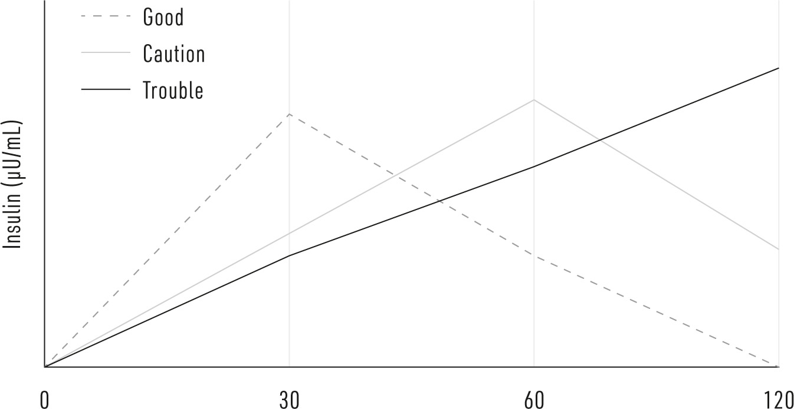
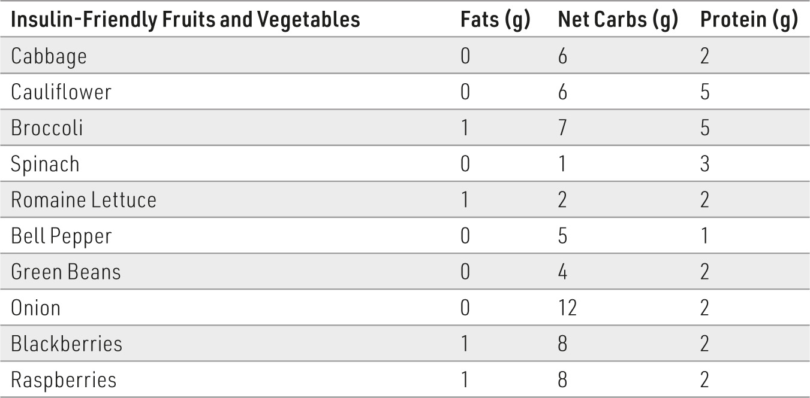
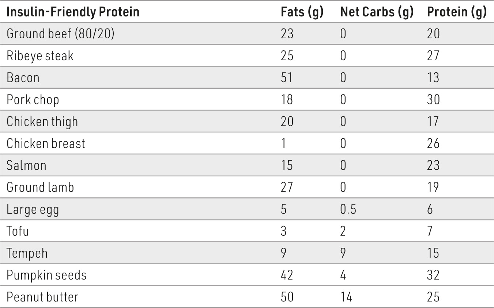
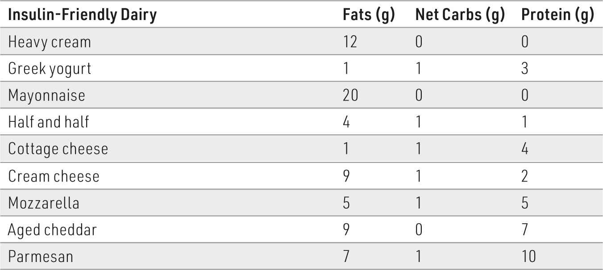
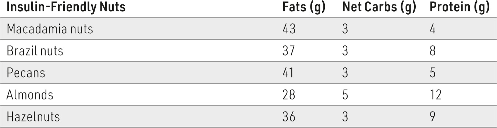

### I

#### CHAPTER 17

### The Plan: Putting Research into

### Action

N THIS BOOK, I’ve hoped to bring to light the serious, chronic disorders

that can arise from insulin resistance, as well as to arm you with knowledge on the interventions that effectively improve it. However, it won’t be worth much without a plan to put this knowledge into action.

As you now understand, the most important changes you can make are lifestyle related. Some are obvious; for example, if you’re regularly exposed to cigarette smoke, either make a greater effort to quit or remove yourself from the environment where others are smoking. Some are trickier; indeed, the plan to improve your insulin sensitivity and reduce the risk of the numerous diseases that stem from insulin resistance must revolve around physical activity and, especially, the food you eat. In this chapter, I’ve translated the findings from all the research I’ve cited on diet and exercise into guidelines you can follow to make great improvements in your insulin sensitivity. (That said, I always recommend you discuss your plan with your health practitioner, particularly if you have a health condition.)

#### First, Find Out Where You Are

Before starting any journey, you need to know where you are. If you’re planning to make some lifestyle changes to reverse or prevent insulin

resistance, first you want to know how insulin resistant you are. So, did you take the Insulin Resistance Quiz (page xviii) at the beginning of the book? If not, go back and take it now. This will give you a general idea of your risk level.

Remember, if you answered “yes” to two or more questions, you’re very likely insulin resistant. But don’t focus on those symptoms for long. As helpful as it may be to observe and track the symptoms in the quiz, they merely let us know our general insulin sensitivity. For a detailed assessment, you need to measure your insulin levels.

To be frank, there’s no easy way do this on your own; there is no athome, finger-prick test. You need to request a laboratory blood test. And not just any test; every fasting blood test will give you your glucose, but few will reveal your insulin. Thankfully, you have some options. (These options depend heavily on where you live; some countries make this easier than others.)

First, you can request an insulin blood test from your physician. Often the test will be covered by your insurance, but not always (and this is sometimes why the physician may be reluctant). If insurance won’t cover the expense, your physician’s office can tell you how expensive the test will be, but it is usually under $100 in the United States as of this writing.

If your insurance won’t cover the insulin test or you don’t want to wait for a clinic visit, you can simply request a test on your own. Numerous companies have sprung up that enable consumers to simply order insulin (and other) tests online. Some examples are walkinlab.com and labtestsonline.org (I’m not affiliated with either). These companies partner with local blood testing services to request the test directly; you go into your local lab, have blood drawn, and the company sends you the results. The test costs around $30 to $60.

Unfortunately, because the focus has been so solidly on glucose for so long, there is not a wide consensus on insulin levels. Ideally, your blood insulin levels should be less than ~6 microunits per milliliter of blood (µU/mL). While ~8–9 µU/mL is the average for men and women, it’s not good to be “average” in this case; a person with 8 µU/mL has double the risk of developing type 2 diabetes as a person with 5 µU/mL.^1^

If you can only get fasting insulin, try to get your blood glucose measured at the same time. The upside of this is being able to figure out your homeostatic model assessment (HOMA) score. This is a helpful little formula that considers both fasting glucose *and* fasting insulin; by covering both sides of the coin, it’s more descriptive than insulin alone. The value is determined mathematically by: [Glucose (mg/dL) × Insulin (µU/mL)] / 405 (for the United States) or [Glucose (mmol/L) × Insulin (µU/mL)] / 22.5 (for most other countries). Though there’s no consensus yet, a value over 1.5 indicates insulin resistance, and above 3 usually means you’re on the borderline of having type 2 diabetes.

Unfortunately, even fasting insulin may have some limitations—there are some people whose fasting insulin may be normal, yet their insulin response to dietary glucose isn’t. To do this, working with a healthcare professional or research lab, you drink a small cup of 75 grams of pure glucose and immediately get your blood drawn every 30 minutes for two hours. There are a couple methods to scrutinize insulin,^2^ but the simplest is this: 1. If your insulin peaks at 30 minutes and steadily comes down, you’re likely insulin sensitive (“Good”); 2. If your insulin peaks at 60 minutes, rather than 30 minutes, be careful—you’re probably insulin resistant and your likelihood of getting type 2 diabetes later in life is five times higher than normal (“Caution”); and finally, 3. If your insulin progressively climbs and peaks at 120 minutes, you’re most certainly insulin resistant and you’re almost 15 times more likely to get type 2 diabetes (“Trouble”).^3^

One note on this: if you have type 2 diabetes and you’ve been prescribed insulin, you can also track your daily insulin dose as a sign of changes. Ideally, you should be checking your blood glucose levels frequently. If, after making some lifestyle choices, your normal insulin dose is resulting in lower than typical blood glucose levels, that dose has become too high—you’re more sensitive to insulin. Be warned: Things can change very quickly once you start changing your diet. In fact, in one study of carbohydrate restriction, insulin-treated type 2 diabetes patients had to reduce their insulin dose by half within just a day!^4^

If you can’t easily measure your insulin, there are a couple of alternatives. One, measure your blood pressure. If you’ve managed to lower your insulin levels, blood pressure should come down within a few days. Two, measure your ketones. By purchasing a ketone meter, you can get an idea of insulin control, albeit indirectly, insofar as ketones will start to rise as insulin starts to drop. This also may take a few days. You’ll recall that a diet that keeps insulin low will also increase ketone production from the liver; this process of ketogenesis is a normal, even healthy, state where the body is using fat at such a high rate that some of the fat is being turned into ketones. Most of the ketones will be used by the body, especially the brain, for energy, but we also expel some in our breath and urine. Because of this, you can measure your ketones in a number of ways. The most accurate— and expensive—is using blood ketone test strips, which are around $1 per

strip. The cheapest method is using urine test strips, which cost a few cents each. A final method is a breath ketone analyzer, which falls between both strip methods in expense. All have pros and cons to consider when deciding to take this route.

Many people find it highly motivating to measure ketones to determine how well they’re lowering insulin through dietary changes. Though this greatly depends on the person, if blood ketones are around 1 millimole (mM), insulin levels are probably below 10 µU/mL, which is a great insulin level to start with. Unfortunately, using ketones as a marker of insulin changes becomes less useful over time: blood insulin levels may not drop much more, but with ongoing dietary changes, ketones could continue to rise slightly. Until an at-home method of measuring insulin is available, this is the easiest do-it-yourself way to get an idea of your insulin (albeit inversely).

#### Where You Go Depends on Where You Start

If you’re able to get your insulin levels measured, you’ll have an idea of where you are now. This gives you an idea of what to do next, which we’ll outline later.

If your insulin levels are on the low end (<~6 µU/mL or 41 pmol/L), it’s a safe assumption that you’re doing quite well, and your insulin sensitivity is strong. You are either already adhering to smart lifestyle choices, or you are young enough to get away with bad choices (for now).

If your insulin levels are moderately elevated (7–17 µU/ml or 48–118 pmol/L), you should start making changes, particularly with the food you eat and how frequently you’re eating.

In the event your insulin is high (>18 µU/mL or 125 pmol/L), you need to make changes today. The next time you eat, start making some of the adjustments we’ll discuss shortly.

#### Exercise to Increase Insulin Sensitivity

As we saw in chapter fourteen, using your muscles is crucial in the fight against insulin resistance. If you don’t already exercise, it can be tough to know what kind is right for you and how to incorporate it into your life. The

best thing you can do right now is not be intimidated by it. We’ll explore some helpful ways to start later.***What Kind of Exercise Should I Do?***There is a benefit to any type of exercise, whether aerobic or resistance, though resistance training may offer a greater improvement in insulin sensitivity for the time spent. Nevertheless, before I continue, I feel compelled to state the obvious here: the best exercise to help improve your insulin sensitivity (or achieve any other health outcome) is the one you will actually *do*.

Think of it this way. If you are convinced you should lift weights three times a week to reduce your insulin resistance, but the nearest gym is 30 miles away, you will have a wonderful excuse not to make that drive … and you may end up doing nothing. However, if you decide to walk or jog through your neighborhood, even though it may not be as “beneficial” on paper as resistance training, there are far fewer barriers to prevent this from happening (depending on your neighborhood!) and you’ll be more likely to do it. So, when committing to an exercise regimen, you will need to determine the genuine limitations in your situation (as opposed to excuses) and act accordingly.

That said, aerobic and resistance exercise are both effective interventions to increase insulin sensitivity, and in an ideal world, your exercise regimen should include both.

To recap: Aerobic exercise is any activity that seeks to more specifically train the cardiovascular and pulmonary systems by increasing the heart and breathing rate. This can be achieved in several ways, including, most commonly, running, cycling/spinning, or swimming.

Resistance training forces a muscle to repeatedly contract or maintain a position against resistance with the intention of developing muscle (and bone) strength. For the novices, some of the exercises described below may be unfamiliar; resistance training has a learning curve. I’d highly recommend becoming familiar with online resources or, if you can afford it, enlisting a trainer to help you become familiar with various exercises and proper movements.

First, the most practical and beneficial method of resistance training is to think “complex.” Ideally, resistance training consists of complex

exercises that involve complementary sets of muscles (muscles that support the targeted muscles and therefore also get a workout) following realistic movements. A benefit of this method is that you train the muscles to be used in ways that reflect daily life, as opposed to an artificial movement. An example of an artificial movement is the famous biceps curl, where a person raises and lowers a dumbbell by bending their elbow. This movement has almost no real-world equivalent and its only purpose, whether or not the person acknowledges this, is to make a T-shirt fit more tightly around the upper arms.

To fully allow resistance training to produce a stronger, more capable body and improve insulin resistance, separate your lifting exercises into two key motions: pushing and pulling. This deceptively simple scheme allows training to follow natural movement and promotes appropriate and complementary muscle development—muscles that naturally work together become stronger together. For example, strong biceps are useless if your back muscles are weak, because every real motion that involves the biceps (i.e., anytime the elbow closes) involves the back.

Second, if you don’t have access to a gym, make do with what you have around your home. Whether it’s push-ups and chair squats or lifting water-filled milk jugs and sit-ups, you can fatigue muscles with these “homemade” exercises as well. If your circumstances allow, I’d recommend purchasing a weightlifting bench and a set of dumbbells that match your strength (you’ll expand this gear over time).

Third, resistance training is for everyone. Some women avoid resistance training for fear of becoming too bulky; for most women, this simply does not happen. When a man resistance-trains to fatigue on every set, he will get stronger and his muscles will get (potentially dramatically) bigger. When a woman resistance-trains to fatigue, she will get stronger and her muscles will grow a bit and become more defined. Why the difference in size between men and women despite similar relative intensities? It’s hormones—the sexes have distinct hormonal cocktails in the blood that dictate the anabolic effects (growth) of the muscle with resistance training. Nevertheless, regardless of size and strength improvements, 60 minutes of resistance exercise in a week can improve insulin resistance more than 60 minutes of aerobic exercise.^5^

**DUDE! NO ARM DAY?**

Few people have time to devote to the exercises that exclusively

work the biceps (front of the arm) and triceps (back of the arm),

which is a good thing. Allow these muscles to get worked as they are

naturally used, with pushing (triceps) and pulling (biceps) motions.

After all, what good is it to have really strong triceps if your

shoulders and chest are weak? You won’t be any more able to help

get yourself out of a chair or off the ground. Most commonly, people do arm exercises either because they

don’t know better (forgivable) or they want to show off

(unforgivable, but it is easier to show off arms than legs). If you have

enough time to focus on the fairly useless (in isolation) muscles of

the arm, you’d be better off spending more time on your legs and

core. Remember, friends don’t let friends skip leg day.

There are many helpful resources to help you get started on becoming more physically active and training your body to become more insulin sensitive. A very helpful guide is the book *Get Strong* by two fit (and colorful) brothers, Al and Danny Kavadlo, or the You-Tube channel of Jerry Teixeira. To help you get started immediately, I’ve included a simple exercise plan in Appendix A.***How Often, How Long, and When Should I Exercise?***If you’re able, you should engage in physical activity six days per week, reserving one day for a genuine rest to allow the body to recover. Depending on the type of exercise, the daily exercises would need variety to prevent overuse injury and to ensure proper recovery of specific muscles.

I consider 20 minutes to be just enough time capable of eliciting a pronounced benefit. Where time is limited (~20 minutes), intensity of the activity is more important. When possible, 30 to 40 minutes is a good length of time to be certain you fully complete the day’s exercise regimen. I personally aim for 40 minutes—anything more, and I feel like I’m mixing my priorities (i.e., spending time with family, etc.).

The time of your exercise session during the day is less important than just getting it done; there is no clear benefit to exercising in the morning versus the afternoon versus the evening. However, people who exercise in the morning usually find fewer excuses and are therefore more consistent. The reality is that fewer things can potentially get in the way of exercising at 6 AM compared with 6 PM.***How Intense Should My Workout Be?***Your exercise intensity may matter more for improving insulin sensitivity than any other variable, including duration.^6^ An important caveat: Do not try to do more than you’re capable of. When implementing high-intensity training, it is essential to start easier, let your body adapt, and gradually work up to higher intensities.

For aerobic exercise, high-intensity workouts are achieved by simply performing the exercise more vigorously. An ideal way to do this is interval training, where one minute of lower intensity exercise is followed by a minute of maximal intensity, repeated for the desired duration. So, for example, if you choose to run, don’t just set your watch for 35 minutes and happily jog away. Rather, keep your eye on your watch to mix intervals of light jogging with periods of heavier running.

For resistance exercise, you can achieve higher intensity by performing every set to failure. In other words, every time you begin an exercise, you continue that exercise, regardless of the number of times it takes (i.e., repetitions), until you can’t do any more. Similar to high-intensity aerobic exercise, it’s truly exhausting, but it is essential to reaping the maximum insulin benefit. In fact, just a few exercises performed one single time to failure can be enough to improve insulin resistance.^7^

A key benefit for increasing intensity in aerobic and resistance training is that it makes each exercise type more like the other. Just as performing intervals more intensely during aerobic exercise more fully exhausts and strengthens the muscles being used, so, too, does more intense resistance exercise, especially with shorter rests between sets, heavily tax the cardiopulmonary system.

#### Eating to Keep Insulin Low

Now we’ve come to what may be the most important lifestyle change you can make. The most scientifically sound diet to improve insulin resistance is one that keeps insulin low. Every aspect of your diet—what you eat, when you eat it—is a means to that end. As you embrace nutritional changes to become more insulin sensitive and help control your health, here are my four vital pillars that provide the foundation of a smart plan: 1. Control carbohydrates. 2. Prioritize protein. 3. Fill with fat. 4. Watch the clock. As evidence of just how powerful these seemingly simple recommendations are, let me share a recent experience we had in my lab. In working with a local clinic, we had 11 women with type 2 diabetes follow these instructions for 90 days. With no changes in exercise, no counting calories, and, remarkably, without the use of any medications, the type 2 diabetes was gone.^8^***Control Carbohydrates***This is the first and most fundamental principle for rapidly and effectively controlling insulin.

Now, due to inherent metabolic differences among all people, it simply isn’t possible to establish a one-size-fits-all strategy. Your ideal composition of macronutrients (that is, the percentage of calories from fat, protein, and carbohydrates) can vary, but no matter what ends up being the right balance for you, carbohydrates will constitute a far smaller part of the diet than is typical in the conventional and ubiquitous “Western diet” (which is typically ~50%–60% carbohydrates). And that’s a good thing—we’re looking to reverse the trends this diet brought on.

If you answered “yes” to two or more questions from the “Insulin Resistance Quiz” at the beginning of the book (page xviii), you’re less tolerant of carbohydrates and, therefore, will need to be more cautious of the type and amount of carbohydrates you eat. If you answered “yes” to only one or none, you’ll have more room for carbohydrates in your diet. The reasons for this spread are simply due to how likely it is your body will

need make more insulin and keep levels higher for longer to clear the glucose from your blood after eating. Remember that while carbohydrates spark a robust increase in insulin (though there is a broad range; broccoli has little effect, while potato chips have a large effect), protein will have a modest effect, and dietary fat will have none. With this in mind, here are some general macronutrient ranges (percentages of calories from fat, protein, and carbohydrates) that may be helpful as you plan a new nutrition plan to improve or prevent insulin resistance.

• If you answered “yes” to two or more: ~70% of calories from fat, 25%

of calories from protein, 5% of calories from carbohydrates

• Generally less than 50 grams of carbohydrates per day

• If you answered “yes” to one: ~65%–25%–10%

• Generally less than 75 grams of carbohydrates per day

• If you didn’t answer “yes” to any questions (and never want to), you

have more freedom: 55%–25%–20% or 55%–30%–15%

• Generally less than 100 grams of carbohydrates per day (or higher,

as warranted by health and physical activity)

Keep in mind that these ranges may require some optimization on your part—these numbers are not meant to be “final.” And note that eating less than 50 grams of carbohydrates per day is very likely to be ketogenic in most people. If you’re uncomfortable with this and feel strongly that you need more carbohydrates, make every effort to focus on low-GL vegetables and fruits. One thing for all to keep in mind: you don’t need to be constantly in ketosis to enjoy the insulin-sensitizing benefits of a carbohydratecontrolled or smart-carb approach.

When it comes to fruits and vegetables, strive to balance carbohydrates and nutrients—choose foods high in nutrients and low in carbohydrates. Be careful to avoid overconsuming high-starch vegetables, such as squashes and potatoes, and high-sugar fruits, like bananas, pineapples, and apples. Here are some good fruits and vegetables (average serving size, 100 g; adapted from www.ruled.me):

Two resources can help you start making insulin-friendly dietary changes. The first is Appendix B of this book, which contains a detailed food list—see pages 209–214. The next is an online database of foods with their respective glycemic loads, which you can find at https://www.health.harvard.edu/diseases-and-conditions/glycemic-indexand-glycemic-load-for-100-foods. Remember the general guidelines for using the glycemic load:**Glycemic****Load**

**Verdict****Examples**<15 Good Leafy greens like spinach and kale and other

nonstarchy vegetables like broccoli, cauliflower, peppers, cucumber, and more; fatty fruits like

avocado and olives; eggs; any meat; butter, cheese, and sour cream. 16–30 Be

careful Most alcohol, plain yogurt, whole-fat milk,

berries, citrus fruits, most nuts, certain less starchy vegetables like carrots and peas, lentils,

and most beans. >30 Danger Almost every processed food, juices, breads,

crackers, cereals, ice cream, sugary fruits like pineapples and bananas, and so many more.

Along with this general idea of controlling carbohydrates, here are some additional thoughts to consider: 1. Don’t be so sweet! An insulin-sensitizing nutrition plan will have very

little sugar in it. Mostly this recognizes that sugar is ubiquitous in its

many forms. Whether it’s “cane sugar,” “evaporated cane juice,”

“high-fructose corn syrup,” “brown rice syrup,” or others, they’re all

the same garbage. You can find sugar-free versions of the most

common foods in your home, paying particular attention to things like

sauces, dressings, ketchup, peanut butter, and so forth. Who wants

sugar in these foods anyway, right? You won’t taste the difference.

When it comes time to actually enjoy a dessert, I encourage you to

limit this to only one treat per week or to find a way to make or

purchase versions with fewer carbohydrates. 2. Be starch smart! Carbohydrates are an incredibly diverse macronutrient

and the more natural the carbohydrate, the better. A general rule to help

avoid the worst of the carbohydrates is that if it comes in a bag or a

box with a barcode, it’s likely a carbohydrate to avoid. 3. Don’t drink your carbohydrates. There is a big difference in insulin

response when we drink a fruit compared with eating the fruit. When

we’ve removed or altered the fiber in a fruit, we’re getting the pure

fructose as opposed to fructose with an appropriate amount of fiber.

This presence of the natural fruit fiber dramatically reduces the insulin

response to the fruit.^9^ 4. Where you’re able, make an effort to focus on more fermented

carbohydrates, like including raw sauerkraut or kimchi (see later) with

a meal daily; see below for more about fermented foods. For those who

get almost no fermented foods and don’t plan on altering their cuisine

enough to include them, one easy strategy is to drink apple cider

vinegar every day. Whichever is your most carbohydrate-heavy meal of

the day, precede that meal with 1 to 2 tablespoons of raw, unfiltered

(like Bragg’s) apple cider vinegar.

**ARTIFICIAL SWEETENERS**

Thanks to countless nonnutritive sweeteners, it’s possible to enjoy

something sweet without spiking glucose and insulin. Be careful with

how you buy your sweeteners if you plan on using them for baking

or cooking. In general, if the sweetener comes in a powder, it can

contain glucose-heavy fillers, such as maltodextrin, defeating the

purpose of the sweetener, which is to not spike insulin. Here’s a list

of sweeteners and how they affect insulin:

**Sweetener****Insulin effect**

**alone****Insulin effect with**

**carbohydrates**

Sucralose None Increased

Aspartame None Unclear, possibly increased

Stevia None None

Acesulfame-K Unclear,

possible Unclear, possibly increased

Xylitol Little Little

Erythritol None None

Other sugar

alcohols Variable, likely Variable, very likely

increased

Monk fruit

extract None None

**THE BENEFITS OF FERMENTED FOODS**

Modern conveniences are a blessing in most every way, but, oddly,

refrigeration may have yielded unintended consequences on how we

digest and ultimately metabolize the foods we eat. Before we could

store foods at 39°F to prevent them from going bad, many foods and

drinks were, deliberately or not, fermented. Fermentation involves bacteria digesting sugars (fructose,

lactose, glucose, etc.) and producing acids (giving a slightly tart

taste), carbon dioxide (giving a drink some bubbles or food some air

pockets), and, possibly, alcohol (ranging from trace amounts to high,

depending on the nature and length of ferment). The chemical

products are interesting, but it’s what’s lost, not gained, during

fermentation that may be particularly relevant in exploring the foods’

insulin-sensitizing benefits. When bacteria are fermenting a food, like a grain, they’re not

eating the small amounts of fat or protein but rather the starches;

bacteria eat glucose. Thus, by eating the starches in the fermenting

food, the bacteria help us by lowering the amount of sugars we

consume, thereby lowering the effects of the food on blood glucose

and insulin. So, we have two pronounced insulin-sensitizing benefits

when we consume a fermented food: we consume less starch than the

nonfermented version; and we ingest beneficial bacteria that can act

as probiotics in our intestines. Raw apple cider vinegar is a surprisingly effective fermented

food. A couple of studies have found that consuming just a

tablespoon or so of apple cider vinegar with a starchy meal helps

lower the glucose and insulin effect of that meal in insulin-resistant

people^10^ and may help generally improve glucose control for type 2

diabetes.^11^ Also, taking two tablespoons of raw apple cider vinegar

in the evening helps control glucose levels the following morning,

when glucose levels tend to climb.^12^ (This is why I recommend

taking two tablespoons of apple cider vinegar in a full glass of water

every morning and evening.) Sourdough, in which natural bacteria allow the bread to rise over

time and in the absence of the ubiquitous “fast-acting” yeast, is

another remnant of fermented foods in the West. People with insulin

resistance who replace normal bread with sourdough bread enjoy a

significant lowering of blood glucose and insulin levels.^13^ Moreover,

sourdough breads have a significantly lower effect on blood glucose

compared with normal bread, even when made of the same grains.^14^ If you’re in the market for sourdough bread, pay close attention:

many are fake. Most “sourdough” breads in your supermarket are

actually normal bread with vinegar added to mimic the tart flavor of

the real thing. True sourdough bread, rarely sold in supermarkets,

will mention “sourdough starter” among the ingredients; it’s usually

sold in specialty or health food shops. And it’s worth it. Though yogurt has somewhat remained a part of our diet,

fermented milk or “sour milk” (note: not the same as spoiled milk!)

as an ingredient is now almost entirely absent, though commercial

varieties of kefir are beginning to make a comeback. As in

sourdough, yogurt bacteria selectively eat the lactose (milk sugar)

from the milk, leaving the milk fats and proteins for us. Interestingly,

these soured milk products also convey demonstrable protection

against insulin resistance: they not only lower the glucose and insulin

burden of grains and other foods when consumed with a meal^15^ but

also improve long-term glucose control.^16^ In contrast to the West, Eastern cuisine has maintained a healthier

appreciation for fermented foods. Perhaps the most notable is kimchi,

a mix of fermented vegetables. Sure enough, eating kimchi helps

lower glucose and insulin levels in people with insulin resistance.^17^

Further, this study compared the effects of fresh kimchi against 10-

day-old kimchi, suggesting that it wasn’t the vegetables that were

important, but rather what had happened to them while fermenting.

Similar benefits may be seen with fermented ginseng and

soybeans.^18^ But eating fermented foods isn’t the only way to benefit from the

work of beneficial bacteria; probiotics also may do the trick.

Probiotics are bacteria you ingest that improve your health, usually in

the form of a capsule or powder (if not part of a fermented food).

Several lines of evidence support the insulin-sensitizing effects of

probiotics; much of this is summed up in a meta-analysis that

compiled the findings of 17 randomized trials, concluding that

probiotics effectively lower fasting glucose and insulin.^19^***Prioritize Protein***Avoid the temptation to eat too little protein; one concern as people adopt a low-carbohydrate, high-fat diet is that they excessively eschew protein (such as meat or eggs). While certain amino acids (the parts of the dietary protein that flow in the blood) can cause an insulin release, the degree to which this occurs depends heavily on the amount of glucose in the blood, whether the person is ingesting carbohydrate with the protein or has underlying elevated blood glucose (i.e., hyperglycemia). If carbohydrate consumption and blood glucose are low, there will be little or no insulin response to dietary protein. In contrast, if carbohydrate consumption is high and blood glucose is elevated, there will be a substantial insulin response. To optimize muscle and bone growth and recovery from exercise, aim to get 1 to 1.5 grams of protein per kilogram.^20^ Critically, if you’re older, you need to be on the higher end of this; we become progressively less capable of changing dietary protein into muscle protein as we age.^21^

As stated earlier, eating to control insulin can be achieved in many ways, including via omnivore, vegetarian, and even vegan lifestyles. However, simply due to the relative absence of insulin-spiking starches, eating animal products makes it much easier to control insulin. The foods that contain the most protein, and the least starch and sugar, are animal based.^22^

If you’re a vegetarian, you can still follow a smart, insulin-sensitizing nutrition plan. You’ll need to search harder to find less starchy and higherfat menu choices, but they’re out there. Avoid the temptation to consume too many seed oils—stick with fruit fats (e.g., from olives, avocados, and coconuts) and, if allowed in your diet, animal fats from nonmeat sources (e.g., dairy, eggs).

If you do eat meat, make an effort to obtain all meat, dairy, and eggs from sources as close to home as possible. Where able, ensure the animals have been pasture raised and allowed to eat their natural diet (e.g., cows eat grass, not grain). While there isn’t much evidence to support the idea that

free-range meat or eggs are better for health, it’s certainly a more ethical and sustainable approach. I suspect you’ll be surprised what’s available in your area if you take some time to search. The same can be said for those following a plant-based diet; buying locally and avoiding farms that operate “monocropping” can help you be confident that your purchases support a sustainable system. Again, consult Appendix B for a detailed list of insulin-friendly food choices.

Be careful with cured meats, including sausages and especially jerky; these very often include significant amounts of sugar. And don’t shy away from fatty meats and fish, including lamb and salmon.

Here’s a list of ideal protein sources and their nutritional breakdown (based on conventional serving size of 4 oz. or 115 g):

Certain dairy products can be surprisingly high in milk sugars (i.e., lactose). Milk is a perfect example—it’s high in all three macronutrients (protein, fat, and carbohydrates), making it an ideal food to help a baby grow (which is why mammals make milk). To focus on good dairy sources that avoid spiking insulin, determine how fermented they’ve been. As with

all other fermented foods, we’ve allowed bacteria to do some of the work for us—bacteria eat glucose, leaving the fat and protein behind for us to enjoy. Some important examples are cheeses and yogurts. Of course, other ideal dairy sources have just had the protein and carbohydrate removed, such as cream and mayonnaise. Here’s a list of good diary choices (average serving size of 100g or ½ cup):

**GOT MILK? HOLD THE SKIM …**

Many consider calcium to be the hero of milk, but maybe it’s the fat?

If you’re looking to lose weight, don’t shy away from dairy fat.

Several studies, including a 12-year follow-up study in men, as well

as a prospective study of children, revealed that consumption of

whole milk is associated with less risk of being obese or developing

obesity compared with consumption of fat-reduced milk.^23^

Moreover, very recent analyses suggest that whole-fat dairy reduces

the risk of diabetes compared with low-fat dairy.^24^***Fill with Fat***

Embrace the insulin-sensitizing value that comes from eating real foods with all their glorious fat. Remember that the fat we eat does not increase insulin and is, thus, a useful food that can nourish your body while not feeding the “beast” (i.e., insulin resistance). In fact, be wary of meals that don’t include fat; they won’t be as satisfying, and the insulin effect of the meal will very likely be higher than it would otherwise be.

We have a physiological need for dietary fat—it is essential. That doesn’t mean all fats are good; the general rule is that if it’s a “real” or “natural” fat, it’s good, as opposed to fat in processed foods. Also, challenge the dogmatic definition of “healthy fat” as being unsaturated; the more unsaturated a fat, the more readily the fat can be oxidized (and thus harmful—see page 21) and likely to contain unwanted chemicals from being processed. Thus, saturated and monounsatu-rated fats from animal and fruit sources (i.e., coconut, olive, or avocado) are ideal, and polyunsaturated fats (i.e., soybean oil) should be avoided. Here’s a brief primer on dietary fats:

• Saturated fats (good): These include fats from animals (meat and

butter/ghee) and coconut oil.

• Monounsaturated fats (good): This is mostly fruit fats (olive and

avocado) and certain nuts (like macadamia nut oil)

• Polyunsaturated fats (caution): Polyunsaturated fats from natural

sources, like meat and nuts, are fine, mostly because the amounts are

so low. This can also include chia and flax seeds, which are rich in one

of the three omega-3 fats (i.e., alpha-linolenic acid). Processed seed

oils (i.e., soybean oil, corn oil, etc.) and processed foods that contain

them have hundreds or thousands of times more polyunsaturated

omega-6 fats, making them best avoided. Another important point about fats and oils is when to eat them in the context of cooking. The more saturated the fat, the more heat it can take; the less saturated the fat (mono- and polyunsaturated), the less heat it can take. In other words, if you’re cooking with the oil, use animal fats, like lard or butter, or coconut oil. If you’re using the fats/oils as a dressing, the monounsaturated fats are ideal (because they’re liquid at room temperature), including olive and avocado oil.

A note on nuts. Like dairy, nuts tend to be higher in all three macronutrients, albeit heavier in fat. Nevertheless, there is a spectrum of carbohydrate content in nuts that is worth noting: 1. Lowest carbohydrate: macadamia nuts, pecans 2. Moderate carbohydrate: This is most nuts, including peanuts, almonds,

and walnuts. 3. Highest carbohydrate: pistachios, cashews

Here’s a specific list of good ones (based on average serving sizes of 2 oz. or 60 g):

**MICRONUTRIENTS AND VITAMINS**

So far in our exploration of diet and insulin resistance, we’ve focused

on the macronutrients—that is, fat, protein, and carbohydrates. There

is equivocal evidence on myriad micronutrients, or minerals,

vitamins, and other molecules in the diet. The majority of these

compounds have no effect on insulin sensitivity, but a handful have

been found to have positive results and are worth mentioning. If you

feel it would help, consider taking these supplements, though it will

in no way compensate for an unhealthy diet; macronutrients matter

more than micronutrients.

**Magnesium:**Magnesium, which is mostly obtained in the diet from

leafy greens and nuts/seeds, has generally positive reports with

insulin sensitivity. Multiple studies indicate that people with insulin

resistance have lower levels of magnesium.^25^ In a well-controlled

study, subjects receiving 4.5 g of magnesium per day for four weeks

were more insulin-sensitive compared with the control group.^26^ A

somewhat similar study followed subjects with type 2 diabetes^27^ for

16 weeks and, again, saw improvements in insulin sensitivity. As

evidence of just how beneficial it may be, it appears to even help

lower insulin in subjects without diabetes.^28^

**Chromium:**Chromium is a rarely mentioned mineral whose main

dietary sources are green beans, broccoli, nuts, and egg yolks. Within

six weeks of taking oral chromium picolinate (400 µg/day), insulin

resistance was significantly improved among a group of patients with

type 2 diabetes; the improvement was maintained throughout the

remaining six weeks of the study.^29^ Once the chromium

supplementation was ceased, the patients lost the improvements in

insulin sensitivity within just a few weeks.

**Cysteine:**A nonessential amino acid, cysteine can be made in the

body if there are sufficient levels of other amino acids (e.g.,

methionine). Primary food sources are meat, eggs, peppers, garlic,

broccoli, and a few others. Because the data in humans is limited, a rat study is necessarily

insightful. Rats were placed on a high-sucrose diet for six weeks and

received a low (5.8 grams) or high (20 grams) dose of cysteine. As

expected, the high-sucrose diet caused insulin resistance and

oxidative stress. However, the high cysteine supplement was

sufficient to prevent the increased insulin.^30^

**Calcium:**When it comes to minerals, many are tempted to claim

calcium as the winner for improving insulin sensitivity. However, the

results aren’t so clear; most of the studies that report a benefit to

calcium consumption build the claim based on study subjects

consuming more dairy, and the studies that look at calcium alone

report no insulin-sensitizing benefit.^31^ Dairy, and its various fats,

proteins, and carbohydrates, may be helpful, and the calcium may

simply be an artifact.

In a group of obese subjects, increasing calcium intake (to 1200

mg/day) by increasing dairy consumption reduced insulin by 18%.^32^

However, by placing study subjects on high-dairy diets with or

without calcium supplementation, the high-dairy group experienced a

remarkable 44% drop in insulin, though the group with calcium had

no improvements.^33^ In a longer study that tracked overweight

subjects for 10 years, the subjects that consumed the most dairy

products had the lowest risk of developing insulin resistance and type

2 diabetes.^34^

**Vitamin D:**We typically think of vitamin D in the context of bone

health, but it’s a more complicated and beneficial molecule than most

think. People who are deficient in vitamin D, in addition to other

disorders, will often develop insulin resistance. In fact, the risk of

developing insulin resistance is roughly 30% higher than normal.^35^

The solution is simple, of course: supplementing 100 µg of vitamin

D^3^ (4000 IU) per day for just a few months is enough to improve

insulin sensitivity back to normal.^36^ Other than supplements, great

natural sources of vitamin D include fatty fish (like tuna and

salmon), egg yolks, and cheese.

**Zinc:**Zinc is commonly consumed in red meat and, to a lesser

degree, poultry. A study in insulin-resistant patients found that those

taking 30 mg of zinc daily for six months had significant

improvements in glucose and insulin sensitivity compared with the

placebo group.^37^ However, similar studies reveal no effect.^38^***Watch the Clock!***The most important and simple concept to keep in mind is that having prolonged periods during the day where glucose and insulin are low is a vital step in the right direction. To this end, I recommend adopting a basic strategy of time-restricted eating in some form. I’ve found a simple and effective method for this.

Fast from food (not water!) for 12 hours every night. Usually, this will take the form of eating dinner around 5–7 PM and not eating again until 5–7 AM or so. Two to three days per week, extend this to an 18-hour fast (e.g., eat dinner at 6 PM and eat your first meal at noon the next day). If your meals are higher in fat and lower in refined carbohydrates, you’ll be surprised at how easy this becomes as your body adapts to using fat, including your own body fat, as a fuel, something that can happen as insulin is kept under control. Every two to four weeks, you can even go all the way and fast from food for 24 hours.***Other Tips***As you begin implementing dietary changes that help sensitize your body to insulin and reverse insulin resistance, you will likely find the books *The Art* *and Science of Low-Carbohydrate Living*; *Eat Rich, Live Long*; or *Protein* *Power *to be helpful (or any number of books and online sites, such as www.ruled.me). For those who lean more toward vegetarian living,* The* *Complete Vegetarian Keto Diet Cookbook *and* Ketotarian* will be helpful.

As a general rule, be careful with conventional meal-replacement shakes. This isn’t to say you can’t use these, but, tragically, drinks marketed for diabetes and weight loss are among the worst due to the grossly misplaced general fear of fat and the surprisingly liberal amounts of refined carbohydrates they contain. Moreover, the fats in most of these drinks are largely seed oils like soybean oil. Thankfully, there are many healthy shakes available nowadays—they just aren’t the ones you see conveniently when you’re shopping. Just make sure the shakes have *very* little or no sugar or fructose and do not contain seed oils.

Perhaps the greatest challenge with adopting a low-carbohydrate diet is dealing with carbohydrate and sugar cravings. Though the debate rages on around these foods being genuinely addictive,^39^ I define food addiction in a simple way: 1. Are you craving the foods? 2. Do you have trouble controlling how much of it you eat? 3. Do you feel guilty when you overindulge?

Nobody is watching a movie at home on a Saturday night craving scrambled eggs; it’s chips and ice cream. When you’re craving something sweet or salty, try sating the craving with cheese, nuts, or seeds.

And don’t forget to check out the detailed food list in Appendix B.

**NOT-SO-HELPFUL FRIENDS**

Your friends are undoubtedly wonderful, caring people, but be

warned—once you commit to eating sweets to only one treat per

week, they may suddenly be less than helpful. I’ve seen many people

attempt to make this critical dietary change by reducing sugars, only

to have their friends become their most ardent opposition; they seem

to tease, if not deliberately sabotage, their friends’ efforts to be

healthier. It may be human nature—we don’t like seeing people make

changes we know we should be making, and it’s easier to ignore the

problem if we’re all part of it.***Ideas for Each Meal*****BREAKFAST**For reasons discussed earlier, breakfast is arguably the most important meal to change (remember the “dawn phenomenon,” page 149). One of the easiest ways to use time-restricted eating to improve insulin sensitivity is to always fast through breakfast.^40^ This is a staple of my own insulin-sensitizing strategy, and I’ve found it’s the easiest, most convenient meal to skip.

Changing breakfast is not too difficult because it’s usually a meal that is entirely up to you—what you eat won’t impact anyone else, unlike lunch and dinner, which you may eat with colleagues or family members (and may limit your choices). Even a breakfast with family can still be selective. After that, here are some ideas of what to eat on mornings when you’re not fasting:

1. Bacon and eggs (scrambled in the grease!) 2. Omelets with various veggies (I love adding raw sauerkraut) 3. Egg muffins (blended egg, cream, and cheese baked in small muffin

molds) 4. Whole-fat yogurt or cottage cheese with berries 5. Almond milk–berry smoothie**LUNCH**If you eat out, simply find the menu options that provide mostly fat and protein and ensure the carbohydrate is not a refined starch (bread, pasta, potato, etc.). This isn’t as hard as it seems—try getting your next hamburger “protein style” or lettuce wrapped. Assuming you “brown-bag it,” here are some options: 1. Avocado-tuna salad 2. Cobb salad (with plenty of hardboiled eggs and meat) 3. Protein-style/lettuce-wrapped hamburger (just be careful with the

condiments—they’re usually high in sugar) 4. Any meat with vegetables 5. Goat cheese salad I often do simple lunches that are admittedly a bit eclectic (but so simple!), including two or three hard-boiled eggs with salt and pepper, a half cup of olives, a small bag of mixed greens with oil and vinegar, and a stick or two of full-fat cheese.**DINNER**Dinner is where it might get tricky. Depending on your situation and family life, you may find it difficult to change dinner to fit into an insulin-sensitizing diet. The largest barrier is the people you typically eat dinner with—your family (or roommates or significant others) may not want to eat the same way as you, yet you want to (and should) enjoy that social time. Some of this may simply involve you being more selective with what you may already be eating at dinner. Assuming it will be heavier in

carbohydrates, you could enjoy having a full glass of water with 2 tablespoons of raw apple cider vinegar before eating. Here are some ideas: 1. Taco salad (skip the shell) 2. Grilled salmon with vegetables 3. Meatballs with vegetable pasta 4. Bacon-wrapped roasted chicken with vegetables 5. Cauliflower mac and cheese 6. Zoodle or vegetable noodle bowls**DESSERT**Dessert? Yes—with sweeteners that don’t increase insulin and glucose (e.g., stevia, monk fruit, erythritol, etc.), you can have the sweet without the insulin spike. Nonetheless, this is something that can easily get out of hand and should be considered a rarity (i.e., once per week) rather than a staple. Try: 1. Low-carb ice cream, frozen yogurt, or sorbet (there are more store

brands of low-carb ice cream than ever, such as “Rebel”; you could

also invest in a home ice cream maker and do it yourself) 2. Low-carb cookies and muffins (like with ice cream, depending on

where you live, there are bakeries that specialize in these, such as

“Keto Cookie,” “Keto Cakes,” “Fat Snax,” and more) By now, you’ve learned enough about how to combat insulin resistance to make a plan and put it into practice. Don’t rely on the old way of doing things; there is no need to feel constantly hungry or worry over every calorie. Scrutinizing what and when you eat and the way you exercise to best lower insulin can prevent or even reverse insulin resistance and work to address the countless health problems it causes.

Living with insulin in mind may seem odd, and some of your actions may seem strange to your family and friends, but decades of science are on your side. When it comes to our health and our efforts to live a long and healthy life, it’s time to let data, not dogma, dictate our decisions.
